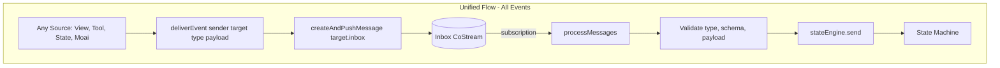

# Actor Architecture: Distributed Resilience & Execution Plans

## Executive Summary

**Inbox-only from the start?** Yes. Single implementation, no two-phase refactor. Compact rule: eliminate dual path, one source of truth. Same-actor latency fixed by calling `processMessages` immediately after push (bypass 50ms subscription debounce).

**Execution order**: Proposal 3 first (operation-result), then Part C (deliverEvent + inbox-only) as one refactor. No deprecation, no fallbacks, 100% migration.

---

## Local-First CRDT: No In-Memory Hacks

**Principle**: End-to-end persistence via CoJSON. Every event is a CoMap in a CoStream before it is processed. No in-memory queues, no ephemeral state that survives a crash.

| Anti-pattern | Correct approach |
|--------------|------------------|
| Queue messages in memory when target not loaded | Resolve target to inbox co-id from CoJSON (actor config → inbox ref → resolve). Push to CoStream. If resolution fails, fail — do not buffer. |
| Bypass inbox for "fast path" | Never. All events go to CoStream first. processMessages reads from CoJSON via processInbox. |
| In-memory dedup only | CoJSON `processed` flag on message CoMap is source of truth. Within-session `_processedMessageCoIds` is optimization only; after crash/restart we rely on CoValue. |
| Best-effort inbox persist | Never best-effort. Push to inbox is the only path; it must succeed or fail. |

**Immediate processMessages for same-actor**: NOT an in-memory hack. Flow: (1) `createAndPushMessage` writes to CoStream (durable), (2) we await it, (3) then call `processMessages` which invokes `processInbox` — a read from CoJSON. The message is in the durable store before we process. We are only choosing when to trigger the read (immediately vs waiting for subscription).

---

## Part A: High-Distributed Future (100+ Actors) — Elixir-Like Resilience

### Current Architecture Constraints at Scale

With 100+ actors:

- **Dual path creates divergence**: `sendInternalEvent` bypasses inbox (direct → stateEngine); `sendMessage` goes to inbox. Same-actor and cross-actor behave differently.
- **Sync/consistency gap**: Same-actor events are processed immediately; inbox persist is best-effort. Cross-tab sees different order if direct path wins.
- **No single failure boundary**: processMessages has validation and retry, but direct path has none. One path can succeed while the other fails.
- **Hard to reason about ordering**: With mixed paths, global ordering across 100 actors is unclear.

### Elixir/OTP Principles Applied

| Principle | Elixir | MaiaOS Target |
|-----------|--------|----------------|
| **Message passing only** | No shared mutable state; everything is a message | All events as messages; inbox is single entry point |
| **End-to-end persistence** | — | CoJSON CRDT: every event in CoStream before processing. No in-memory queues. |
| **Let it crash** | Supervisor restarts; don't catch everything | processMessages fails → retry on next tick; don't swallow |
| **Idempotency** | Handlers tolerate duplicate delivery | CoJSON `processed` flag is source of truth; state handlers assume at-least-once |
| **Single source of truth** | Mailbox holds all messages | Inbox CoStream is the only event log |
| **Backpressure** | Queue grows; can pause producers | Future: inbox size limits, backpressure signals |

### Unified Inbox-Only Flow (Target Architecture)

**Core rule**: There is only one way to deliver an event to an actor: push to its inbox. `processMessages` is the only caller of `stateEngine.send`.



**Benefits for 100+ actors:**

1. **Single path** — No branching; same behavior for same-actor, cross-actor, cross-tab, moai
2. **Durable ordering** — CoStream append gives a total order; processMessages drains in order
3. **Natural idempotency** — processMessages dedup; state handlers can assume at-least-once
4. **Partition tolerant** — Message in inbox survives crash; processMessages retries
5. **Observable** — All events in CoStream; full audit trail for debugging

**Cost**: One async hop for same-actor (write → subscription → processMessages). Typically one microtask; UI impact minimal.

**Implementation**: `deliverEvent(senderId, targetId, type, payload)` always does `createAndPushMessage`. No direct `stateEngine.send` except from processMessages.

---

### Proposal 1 Revisited: Data Owner + Inbox-Only

**Two changes that work together:**

1. **Inbox-only delivery** — All events via inbox (see above).
2. **Data owner principle** — An actor that has the data performs the operation. Child (list) calls @db directly for toggle/delete; no forwarding to parent.

**Why both matter:**

- **Inbox-only**: Resilient, consistent, scalable.
- **Data owner**: Reduces cross-actor traffic. List has `id`, `done`; no need to involve vibe. Fewer messages, fewer failure points.

**Unified round-trip (distributed, resilient):**

```
[Same-actor, e.g. vibe form]
View → deliverEvent(vibe, vibe, CREATE_BUTTON, {value})
     → createAndPushMessage(vibe.inbox)
     → subscription → processMessages(vibe)
     → stateEngine.send → creating state → @db create
     → SUCCESS → processMessages (next message) or same run

[Cross-actor, e.g. agent → detail]
State action → deliverEvent(agent, detail, LOAD_ACTOR, {id})
            → createAndPushMessage(detail.inbox)
            → subscription → processMessages(detail)
            → stateEngine.send → updateContext

[Child has data, e.g. list toggle]
View → deliverEvent(list, list, TOGGLE_BUTTON, {id, done})
     → createAndPushMessage(list.inbox)
     → processMessages(list)
     → stateEngine.send → @db update (list calls @db directly, no publishMessage to vibe)
```

**List calling @db directly** stays correct: list is in the same account, has access to the schema, and owns the user gesture. No need for vibe in the path.

---

## Part B: Proposal 3 Execution Plan (Operation-Result Re-export Elimination)

**Goal**: Remove maia-engines re-export; all consumers import from `@MaiaOS/schemata/operation-result`. 100% migration, no deprecation.

**Execute first** (independent, low risk) — can run before or in parallel with Part C.

### Step 1: Migrate maia-engines Imports

| File | Current Import | New Import |
|------|----------------|------------|
| `libs/maia-engines/src/operations/operations.js` | `from './operation-result.js'` | `from '@MaiaOS/schemata/operation-result'` |
| `libs/maia-engines/src/engines/state.engine.js` | `from '../operations/operation-result.js'` | `from '@MaiaOS/schemata/operation-result'` |
| `libs/maia-engines/src/engines/data.engine.js` | `from '../operations/operation-result.js'` | `from '@MaiaOS/schemata/operation-result'` |
| `libs/maia-engines/src/operations/spark-operations.js` | `from './operation-result.js'` | `from '@MaiaOS/schemata/operation-result'` |
| `libs/maia-engines/src/operations/index.js` | Re-exports from `./operation-result.js` | `from '@MaiaOS/schemata/operation-result'` |
| `libs/maia-engines/src/index.js` | `from './operations/operation-result.js'` | `from '@MaiaOS/schemata/operation-result'` |

### Step 2: Update index.js Exports

Replace the operation-result block with direct import from schemata. maia-engines index.js currently re-exports for convenience — change to `from '@MaiaOS/schemata/operation-result'`. Compact rule: eliminate re-export file; index.js can still re-export from schemata (single hop, no operations/operation-result.js).

### Step 3: Delete Re-export File

Delete `libs/maia-engines/src/operations/operation-result.js`.

### Step 4: Verify

- `bun run check:ci` passes
- No remaining imports of `./operation-result.js` or `../operations/operation-result.js` within maia-engines
- External packages (maia-tools) already use `@MaiaOS/schemata` — no changes

### Checklist

- [ ] 4 internal files + operations/index.js + index.js updated
- [ ] operation-result.js deleted
- [ ] CI passes
- [ ] No fallbacks, no deprecation notices

---

## Part C: Unified Execution Plan — deliverEvent + Inbox-Only (All-In)

**Decision**: Go inbox-only from the start. No two-phase refactor. Aligns with compact rule: eliminate dual path, single source of truth, resist sophistication.

**Rationale**:
- Compact rule: "Eliminate before optimize", "One path not two", "Resist sophistication"
- Building the right thing once avoids rework
- 50ms debounce on inbox subscription would hurt UX for same-actor — **fix**: call `processMessages(actorId)` immediately after push when `senderId === targetId`; don't wait for subscription

### Inbox-Only Flow (Same-Actor Fast Path)

```
deliverEvent(actor, actor, type, payload)
  → createAndPushMessage(actor.inbox, { processed: false, ... })
  → processMessages(actorId)  // immediate, same call stack — no 50ms debounce
  → processInbox returns new message
  → stateEngine.send → state machine
```

Cross-actor: push → subscription fires (debounced) → processMessages. SUCCESS from tools: push → processMessages retry (setTimeout 0) drains it next tick.

### Step 1: Add deliverEvent (Inbox-Only, With Immediate processMessages for Same-Actor)

```javascript
async deliverEvent(senderId, targetId, type, payload = {}) {
  if (containsExpressions(payload)) throw new Error(`[ActorEngine] Payload contains unresolved expressions...`)
  const payloadPlain = payload && typeof payload === 'object' ? JSON.parse(JSON.stringify(payload)) : payload || {}
  const message = { type, payload: payloadPlain, source: senderId, target: targetId, processed: false }

  await this._pushToInbox(targetId, message)

  // Same-actor: trigger processMessages immediately (bypass 50ms subscription debounce)
  if (senderId === targetId) {
    const actor = this.actors.get(targetId)
    if (actor?.inboxCoId && this.dataEngine) await this.processMessages(targetId)
  }
}
```

`_pushToInbox(targetId, message)`:
- Resolve targetId to inbox co-id (no in-memory queue):
  - Actor in memory: use actor.inboxCoId
  - Human-readable (e.g. °Maia/todos/actor/vibe): resolve via CoJSON — actor config has inbox ref; resolve to inbox co-id. If resolution fails, throw; do not buffer in memory
- `createAndPushMessage(inboxCoId, message)` with processed: false
- No pendingMessages. Every message goes to CoStream. Resolution must be deterministic from actor ref (in registry/account).

### Step 2: Migrate Internal Call Sites

| Caller | Location | Current | New |
|--------|----------|---------|-----|
| ViewEngine | `view.engine.js:669` | `sendInternalEvent(actorId, eventName, payload)` | `deliverEvent(actorId, actorId, eventName, payload)` |
| StateEngine | `state.engine.js` (6 places) | `sendInternalEvent(id, 'SUCCESS'\|'ERROR', payload)` | `deliverEvent(id, id, 'SUCCESS'\|'ERROR', payload)` |
| StateEngine | `state.engine.js:537` | `sendMessage(detailActor.id, {type, payload, from})` | `deliverEvent(machine.actor.id, detailActor.id, type, payload)` |
| publishMessage tool | `publishMessage.tool.js:50` | `actorEngine.sendMessage(target, {type, payload, from})` | `actorEngine.deliverEvent(actor.id, target, type, messagePayload)` — tool passes target (co-id or human-readable); _pushToInbox resolves via CoJSON and pushes |

### Step 3: Migrate External API (loader.js:802-804)

```javascript
deliverEvent(senderId, targetId, type, payload) {
  this.actorEngine.deliverEvent(senderId, targetId, type, payload)
}
```

Rename `sendMessage` → `deliverEvent`. Args: `(senderId, targetId, type, payload)`. Services: grep showed no sendMessage usage in services/ — verify.

### Step 4: _pushToInbox Implementation (No In-Memory Queue)

- If actor in memory (actors.get(targetId)): use actor.inboxCoId
- Else: resolve targetId to inbox co-id via CoJSON. Actor config (in registry) has inbox ref; resolve to CoStream co-id. Throw if resolution fails — do not buffer
- `createAndPushMessage(inboxCoId, { type, payload, source, target: inboxCoId, processed: false })`
- **Eliminate pendingMessages**: Delete `this.pendingMessages` Map and the drain logic in createActor (actor.engine.js:431-434). Every message goes to CoStream.

**Resolution**: If `op: 'resolve'` with humanReadableKey for actor ref returns actor config co-id (not inbox), we need resolveActorInbox or similar: read actor config CoMap, get `inbox` property, resolve that to inbox CoStream co-id. All from CoJSON — no in-memory fallback.

### Step 5: Remove sendInternalEvent and sendMessage

- Delete both methods
- Keep _pushToInbox as private

### Step 6: maia-db / processInbox

No changes. processInbox returns messages with processed: false. ActorEngine marks processed after stateEngine.send succeeds. Already correct.

### Step 7: Vibes

No .maia changes. Vibes use publishMessage tool; tool switches to deliverEvent internally.

### Step 8: Docs to Update

- `libs/maia-docs/02_creators/03-actors/02-lifecycle-messaging.md` — sendMessage → deliverEvent
- `libs/maia-docs/02_creators/05-state/00-overview.md` — sendInternalEvent → deliverEvent
- `libs/maia-docs/02_creators/12-best-practices/00-overview.md` — flow description
- `libs/maia-docs/03_developers/02_maia-loader/api-reference.md` — os.deliverEvent
- `libs/maia-docs/03_developers/04_maia-engines/actor-communication/*` — API references
- `libs/maia-docs/01_getting-started/02-architecture.md` — example

### Step 9: Verify

- `bun run check:ci`
- Manual: todos (add, toggle, delete), sparks (SELECT_SPARK), paper/voice if present
- No sendInternalEvent, sendMessage references
- No deprecation, no fallbacks

### Checklist

- [ ] deliverEvent implemented (inbox-only, immediate processMessages for same-actor)
- [ ] _pushToInbox implemented (resolve via CoJSON, createAndPushMessage — no in-memory queue)
- [ ] pendingMessages eliminated (delete Map + createActor drain)
- [ ] ViewEngine migrated
- [ ] StateEngine migrated (6 call sites)
- [ ] publishMessage tool migrated
- [ ] loader.js sendMessage → deliverEvent
- [ ] sendInternalEvent removed
- [ ] sendMessage removed
- [ ] Docs updated
- [ ] All vibes work
- [ ] CI passes
