# ActorEngine + Runtime Master Execution Plan

## Overview

Single execution plan combining:

1. **Move** `agent-runtime.engine.js` → `src/runtimes/browser.js`, rename class `AgentRuntime` → `Runtime`
2. **ActorEngine cleanup** — dead code removal, unified actor model, validation extraction, logging consolidation
3. **Lifecycle centralization** — Runtime as single source of truth for spawn/destroy
4. **Architectural refactors** — circular refs → ActorOps injection, view logic → ViewEngine

All milestones are ordered and actionable. Execute in sequence.

---

## Compact-Simplify-Consolidate Alignment

This plan aligns with [compact-simplify-consoldiate.mdc](.cursor/rules/compact-simplify-consoldiate.mdc):

- **Question existence first:** M1 removes `moduleRegistry` (never used); M2 removes `_isServiceActor` (no longer needed).
- **Eliminate before optimize:** M3 extracts validation to shrink `processEvents` — improves readability without new layer.
- **Universal generic DRY interfaces:** M7 ActorOps — ONE interface between ActorEngine, ViewEngine, StateEngine (eliminates circular refs, connects modules).
- **Resist sophistication:** M6 MessageValidationEngine is optional; rule says "don't add layers to simplify" — only do M6 if validation is duplicated (ViewEngine + ActorEngine) and a single engine genuinely eliminates code.
- **Consolidate duplicates:** StateEngine._getActorConfigFromDb duplicates Runtime.getActorConfig — consider Runtime as source of truth post-M5; StateEngine could call `runtime.getActorConfig(actorRef)` instead.
- **100% migration, no fallbacks:** Every milestone updates all call sites before deleting; no backwards-compat layers.

---

## Engines Ecosystem Audit


| Engine                         | Lines | Notes                                                   | Elimination/Consolidation                                                    |
| ------------------------------ | ----- | ------------------------------------------------------- | ---------------------------------------------------------------------------- |
| **ActorEngine**                | ~1060 | Lifecycle, view attach, messaging, validation, rerender | M1–M8: dead code, actorType, validation extract, view→ViewEngine             |
| **Runtime** (runtimes/browser) | ~274  | Inbox watch, getActorConfig                             | M0b move to runtimes/browser; M5 centralize lifecycle; M0c hooks             |
| **DataEngine**                 | ~97   | Operation router                                        | Already minimal; no changes                                                  |
| **StateEngine**                | ~583  | XState-like interpreter, actorEngine ref                | M7b ActorOps; _getActorConfigFromDb → use Runtime.getActorConfig if possible |
| **StyleEngine**                | ~336  | Tokens, components, getStyleSheets                      | Already focused; no changes                                                  |
| **ViewEngine**                 | ~731  | loadView, render, validateEventPayloadForSend           | M7a ActorOps; M8 receive loadViewConfigs/attachViewToActor                   |


**Cross-engine opportunities:**

- **moduleRegistry:** ActorEngine stores it but never uses; ViewEngine receives it — verify usage, remove if dead.
- **getActorConfig duplication:** Runtime.getActorConfig and StateEngine._getActorConfigFromDb do the same — consolidate to Runtime after M5.
- **Circular refs:** ActorEngine ↔ ViewEngine ↔ StateEngine — M7 ActorOps breaks these; Loader holds refs, one-way flow.

---

## Stage 0: Audit Summary (Done)

**ActorEngine** ([actor.engine.js](libs/maia-engines/src/engines/actor.engine.js)) ~1060 lines:


| Responsibility       | Location                                                        | Notes                           |
| -------------------- | --------------------------------------------------------------- | ------------------------------- |
| Lifecycle            | spawnActor, createActor, destroyActor                           | Core, well-structured           |
| View/DOM attach      | _attachViewToActor, _loadViewConfigs                            | Tightly coupled to ViewEngine   |
| Messaging            | deliverEvent, _pushToInbox, processEvents                       | Long processEvents (~145 lines) |
| Validation           | _validateEventType, _loadEventTypeSchema, _validateEventPayload | 3 layers, DB_OP special case    |
| Rerender batching    | _scheduleRerender, _flushRerenders                              | Svelte-style, clean             |
| Child actors         | _createChildActorIfNeeded                                       | Used by ViewEngine              |
| Actor classification | _isServiceActor                                                 | **To remove** — unified model   |
| Context updates      | updateContextCoValue                                            | Called by StateEngine           |


**Fragmented lifecycle:** AgentRuntime (watchInbox), ActorEngine._pushToInbox (headless spawn), Loader (createActor), maia.main/dashboard (destroyActorsForAgent/Container)

---

## Milestone 0b: Move Runtime to src/runtimes/browser.js

**Move into dedicated runtimes folder (not rename within engines):**


| Step | Action                                                                                                                                                                                    |
| ---- | ----------------------------------------------------------------------------------------------------------------------------------------------------------------------------------------- |
| 0b-1 | Create `libs/maia-engines/src/runtimes/` directory                                                                                                                                        |
| 0b-2 | Move `engines/agent-runtime.engine.js` → `runtimes/browser.js`                                                                                                                            |
| 0b-3 | Rename class `AgentRuntime` → `Runtime`; JSDoc: "Runtime (browser) - Manages actor lifecycles, inbox watching, getActorConfig"                                                            |
| 0b-4 | Log prefix `[AgentRuntime]` → `[Runtime]`                                                                                                                                                 |
| 0b-5 | [maia-engines/src/index.js](libs/maia-engines/src/index.js): `export { Runtime } from './runtimes/browser.js'`                                                                            |
| 0b-6 | [maia-engines/package.json](libs/maia-engines/package.json): Add `"./runtimes/*": "./src/runtimes/*"` to exports (optional; index re-export is sufficient)                                |
| 0b-7 | [loader.js](libs/maia-loader/src/loader.js): `import { Runtime } from '@MaiaOS/engines'`; `const runtime = new Runtime(...)`; `os.actorEngine.runtime = runtime`; `await runtime.start()` |
| 0b-8 | [actor.engine.js](libs/maia-engines/src/engines/actor.engine.js): `this.agentRuntime` → `this.runtime` in all usages                                                                      |


**Verification:** `bun run check:ci`, grep for `AgentRuntime|agent-runtime|agentRuntime` → 0 matches. File lives at `src/runtimes/browser.js`.

---

## Milestone 0c: Lifecycle Observability Hooks

Add event hooks on Runtime so every spawn/destroy path is observable. Enables refactor verification, future devtools, metrics. Zero cost when unused.


| Step | Action                                                                           |
| ---- | -------------------------------------------------------------------------------- |
| 0c-1 | Runtime: Add `_listeners = new Map()` (event -> Set)                             |
| 0c-2 | Runtime: Add `on(event, callback)` and `_emit(event, payload)`                   |
| 0c-3 | Emit `actorSpawned` from spawn paths: `{ actorId, config, source: 'view'         |
| 0c-4 | Emit `actorDestroyed` from destroy paths: `{ actorId, reason: 'containerUnmount' |
| 0c-5 | Optional: Emit `messageQueued` from deliverEvent: `{ targetId, type }`           |
| 0c-6 | All emit calls from single spawn/destroy entry points (after M5 centralization)  |


**Benefits:** Verify M5 consolidation (any spawn not firing hook = missed path); future devtools/metrics; no-op when no listeners.

---

## Milestone 1: Remove Dead Code and Consolidate Logging


| Step | Action                                                                                                                 |
| ---- | ---------------------------------------------------------------------------------------------------------------------- |
| 1a   | Remove `moduleRegistry` from ActorEngine constructor and `this.registry` (grep first for `actorEngine.registry`)       |
| 1b   | Add `_isDebug()`: `typeof window !== 'undefined' && (import.meta?.env?.DEV ?? false)`                                  |
| 1c   | Replace scattered `if (typeof window !== 'undefined') { console.log(...) }` with `if (this._isDebug()) this._log(...)` |


**Verification:** `bun run check:ci`, manual smoke test.

---

## Milestone 2: Remove _isServiceActor and actorType


| Step | Action                                                                                                                                       |
| ---- | -------------------------------------------------------------------------------------------------------------------------------------------- |
| 2a   | Delete `_isServiceActor` from ActorEngine                                                                                                    |
| 2b   | Remove `actor.actorType` and `actorType: 'service'` from spawnActor default                                                                  |
| 2c   | [view.engine.js:527](libs/maia-engines/src/engines/view.engine.js): Replace `child.actorType === 'ui'` with `child.viewDef` for slot cleanup |


**Verification:** Slot switching (chat paper/messages) works; no regressions.

---

## Milestone 3: Extract Message Validation Pipeline


| Step | Action                                                                                                     |
| ---- | ---------------------------------------------------------------------------------------------------------- |
| 3a   | Extract `async _validateMessage(actor, message)` — returns `{ valid, payloadPlain }` or `{ valid: false }` |
| 3b   | Move contract check, schema load, payload validation, DB_OP shape into helper                              |
| 3c   | Refactor `processEvents`: loop validate → if valid dispatch to state machine; else mark processed          |


**Verification:** Full inbox flow (chat, sparks, db) works.

---

## Milestone 4: Quick Cleanups


| Step | Action                                                                                   |
| ---- | ---------------------------------------------------------------------------------------- |
| 4a   | Split `_pushToInbox` into `_resolveInboxForTarget`, `_pushMessage`, headless spawn logic |
| 4b   | Add JSDoc at top of actor.engine.js: actor shape, lifecycle, responsibilities            |


---

## Milestone 5: Centralize Lifecycle in Runtime


| Step | Action                                                                                                              |
| ---- | ------------------------------------------------------------------------------------------------------------------- |
| 5a   | Runtime: Add `createActorForView(config, container, agentKey)` — delegates to `actorEngine.createActor`             |
| 5b   | Runtime: Add `destroyActor(id)`, `destroyActorsForAgent(key)`, `destroyActorsForContainer(container)`               |
| 5c   | Loader: Call `runtime.createActorForView` instead of `actorEngine.createActor` (createActor, loadAgentFromDatabase) |
| 5d   | maia.main / dashboard: Call `runtime.destroyActorsForAgent` / `runtime.destroyActorsForContainer`                   |
| 5e   | Pass Runtime ref to ViewEngine; ViewEngine calls `runtime.destroyActor(childId)` for slot cleanup                   |
| 5f   | `_pushToInbox` headless spawn: delegate to `runtime.ensureActorSpawned(targetId)` (add method if needed)            |
| 5g   | StateEngine: Replace `_getActorConfigFromDb` with `runtime.getActorConfig(actorRef)` (consolidate duplicate)        |
| 5h   | Verification: grep confirms no direct `actorEngine.createActor`/`destroyActor` from Loader, Maia, ViewEngine        |


---

## Milestone 6: Extract MessageValidationEngine (Optional)

**Note:** If validation stays small after M3, M6 can be skipped.


| Step | Action                                                                        |
| ---- | ----------------------------------------------------------------------------- |
| 6a   | Create `message-validation.engine.js` with `validateMessage(actor, message)`  |
| 6b   | Move contract check, schema load, DB_OP shape, payload validation into engine |
| 6c   | Inject into ActorEngine; `processEvents` calls it                             |
| 6d   | ViewEngine `validateEventPayloadForSend` delegates to ValidationEngine        |
| 6e   | Loader wires ValidationEngine into ActorEngine and ViewEngine                 |


---

## Milestone 7a: ActorOps Interface + ViewEngine


| Step | Action                                                                                          |
| ---- | ----------------------------------------------------------------------------------------------- |
| 7a-1 | Define ActorOps: `{ deliverEvent, getActor, createChildActor, destroyActor, scheduleRerender }` |
| 7a-2 | ActorEngine implements ActorOps                                                                 |
| 7a-3 | Loader passes ActorOps to ViewEngine constructor                                                |
| 7a-4 | Remove `viewEngine.setActorEngine(this)`                                                        |
| 7a-5 | Verification: ViewEngine has no ActorEngine ref; only ActorOps                                  |


---

## Milestone 7b: ActorOps + StateEngine


| Step | Action                                                        |
| ---- | ------------------------------------------------------------- |
| 7b-1 | Add `updateContextCoValue` to ActorOps                        |
| 7b-2 | Loader passes ActorOps to StateEngine constructor             |
| 7b-3 | Remove `stateEngine.actorEngine = actorEngine`                |
| 7b-4 | Verification: No circular refs; only Loader holds engine refs |


---

## Milestone 8: Move View/DOM Logic to ViewEngine


| Step | Action                                                                                      |
| ---- | ------------------------------------------------------------------------------------------- |
| 8a   | ViewEngine: Add `loadViewConfigs(actorConfig, actorId)`                                     |
| 8b   | ViewEngine: Add `attachViewToActor(actor, containerElement, actorConfig, agentKey)`         |
| 8c   | ActorEngine `createActor`: Call `viewEngine.attachViewToActor(...)` when container provided |
| 8d   | Remove `_loadViewConfigs` and `_attachViewToActor` from ActorEngine                         |
| 8e   | Verification: All view-loading and DOM-attach logic in ViewEngine                           |


---

## File Structure (Post-Execution)

```
libs/maia-engines/src/
  engines/
    actor.engine.js           # M1–M4 cleanup; M5 lifecycle via Runtime; M7 ActorOps; M8 view logic removed
    message-validation.engine.js # M6 optional
    view.engine.js            # M7 ActorOps; M8 loadViewConfigs, attachViewToActor
    state.engine.js           # M7 ActorOps
    data.engine.js
    style.engine.js
  runtimes/
    browser.js                # Runtime (moved from agent-runtime.engine.js); M5 createActorForView, destroyActor, etc.
```

---

## Execution Order

```mermaid
flowchart LR
    M0b[M0b Move to runtimes] --> M0c[M0c Observability hooks]
    M0c --> M1[M1 Dead code]
    M1 --> M2[M2 actorType]
    M2 --> M3[M3 _validateMessage]
    M3 --> M4[M4 Quick cleanups]
    M4 --> M5[M5 Lifecycle Runtime]
    M5 --> M6[M6 ValidationEngine]
    M6 --> M7a[M7a ActorOps ViewEngine]
    M7a --> M7b[M7b ActorOps StateEngine]
    M7b --> M8[M8 View to ViewEngine]
```




---

## References

- [actor.engine.js](libs/maia-engines/src/engines/actor.engine.js)
- [agent-runtime.engine.js](libs/maia-engines/src/engines/agent-runtime.engine.js) → [runtimes/browser.js](libs/maia-engines/src/runtimes/browser.js)
- [view.engine.js](libs/maia-engines/src/engines/view.engine.js)
- [loader.js](libs/maia-loader/src/loader.js)
- [main.js](services/maia/main.js), [dashboard.js](services/maia/dashboard.js)
- [.cursor/rules/compact-simplify-consoldiate.mdc](.cursor/rules/compact-simplify-consoldiate.mdc)

