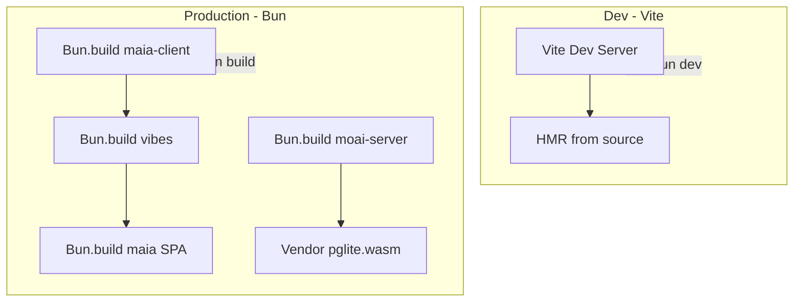

# Bun-Native Build Architecture

## Problem Statement

Production builds use Vite (Rollup) which struggles with CJS dependencies (pg, ajv) when bundling for Bun. The moai server bundle pollutes output with `module`/`exports`, causing Bun to misdetect format and crash.

**Root cause**: Mixing toolchains—Vite for builds, Bun for runtime—introduces CJS/ESM interop issues. Vite's CJS transform has edge cases.

**First principles**: Use one runtime (Bun) for both execution and bundling. Bun understands CJS and ESM natively; its bundler produces clean output.

## Success Criteria

- **Desirable**: Production builds work reliably; no CJS pollution; single coherent toolchain
- **Feasible**: Bun.build supports target=browser, target=node, format=esm; handles aliases
- **Viable**: Vite remains for dev (HMR); minimal maintenance surface

## Solution: Vite = Dev Only, Bun = All Production Builds




### Architecture


| Phase      | Tool   | Purpose                                           |
| ---------- | ------ | ------------------------------------------------- |
| **Dev**    | Vite   | HMR, run from source, proxy to moai               |
| **Dev**    | Bun    | Run moai from source (`bun src/index.js`)         |
| **Build**  | Bun    | Bundle maia-client, moai-server, vibes            |
| **Build**  | Bun    | Bundle maia SPA (or minimal Vite—see Milestone 2) |
| **Deploy** | Docker | Copy Bun-built artifacts only; no node_modules    |


## Current State Audit

### Build Flows


| Output      | Current tool    | Entry                              | Output path            |
| ----------- | --------------- | ---------------------------------- | ---------------------- |
| maia-client | Vite (lib mode) | libs/maia-distros/client/index.js  | output/maia-client.mjs |
| moai-server | Vite (SSR)      | services/moai/src/index.js         | output/moai-server.mjs |
| vibes       | Vite (lib mode) | libs/maia-distros/vibes/index.js   | output/vibes.mjs       |
| maia SPA    | Vite            | services/maia/index.html + main.js | services/maia/dist/    |
| pglite.wasm | node script     | vendor from node_modules           | output/pglite.wasm     |


### Aliases Required (all configs)

- `@MaiaOS/core`, `@MaiaOS/db`, `@MaiaOS/self`, `@MaiaOS/script`, `@MaiaOS/schemata`, `@MaiaOS/operations/*`, `@MaiaOS/tools`, `@MaiaOS/vibes`
- `cojson`, `cojson/crypto/WasmCrypto`, `cojson-storage-indexeddb`, `cojson-transport-ws`, `buffer`

### Special Handling

- **Client bundle**: Stub pglite/postgres adapters (server-only)
- **Server bundle**: Include pg, pglite; externalize only pglite.wasm (vendored)
- **.maia files**: Transform to `export default ${json}`

## Implementation Milestones

### Milestone 0: Audit Current Build System and Bun.build Capabilities

**Activities:**

- Document all alias paths used in client, server, vibes configs
- Verify Bun.build supports `--alias`, `--define`, `--target`, `--format`
- Test `bun build ./entry.js --target=node --format=esm` with pg/pglite in deps
- Check Bun loader API for .maia files

**Output**: Confirmed Bun can build client, server, vibes with required aliases and transforms.

**Human Checkpoint:** Present audit before implementing.

---

### Milestone 1: Create Bun Build Scripts for maia-client, moai-server, vibes

**Implementation:**

- Add `libs/maia-distros/scripts/build-with-bun.js` (or separate scripts per bundle)
- Implement alias resolution for @MaiaOS/* and cojson paths
- maia-client: `bun build client/index.js --target=browser --format=esm --outdir=output --outfile=maia-client.mjs`
- moai-server: `bun build services/moai/src/index.js --target=node --format=esm --outdir=output --outfile=moai-server.mjs`
- vibes: `bun build vibes/index.js --target=browser --format=esm --outdir=output --outfile=vibes.mjs`
- Handle .maia: Bun plugin or pre-transform step
- Keep vendor-pglite script (unchanged)

**Cleanup:**

- Replace `build:client`, `build:server`, `build:vibes` in maia-distros to call Bun scripts
- Remove Vite configs from distros build pipeline (or keep only for reference during migration)

**Human Checkpoint:** Verify all three bundles build and run.

---

### Milestone 2: Create Bun Build for maia SPA

**Option A (preferred if feasible):** Bun builds main.js; copy index.html + assets; inject script path.

- `bun build services/maia/main.js --target=browser --format=esm --outdir=dist --outfile=main-[hash].mjs`
- Copy index.html, style.css, brand/ to dist
- Replace script src in HTML with built filename (or use fixed name)

**Option B (fallback):** Keep Vite for maia SPA build only—minimal scope.

- Vite remains for `services/maia` production build (HTML entry, CSS, assets)
- Distros (client, server, vibes) built by Bun; maia imports pre-built bundles

**Decision point:** Validate Option A with a quick prototype before committing.

**Human Checkpoint:** Confirm SPA build works (local preview + Docker).

---

### Milestone 3: Remove Vite from Production Pipeline, Update Docker and Deploy

**Implementation:**

- maia-distros: Remove Vite from build (or move to devDeps only for local dev)
- services/maia: `build` script uses Bun (or minimal Vite per Milestone 2)
- Dockerfile moai: Copy only moai-server.mjs + pglite.wasm; no node_modules
- Dockerfile maia: Copy dist/ from Bun (or Vite) build

**Cleanup:**

- Remove @rollup/plugin-commonjs from maia-distros (if added)
- Ensure Vite is only in devDependencies where used for dev

**Human Checkpoint:** Deploy to Fly; verify moai and maia run correctly.

---

### Milestone 4: Verify Dev and Prod Flows End-to-End

**Verification:**

- `bun dev`: maia (Vite) + moai (Bun from source) start; HMR works
- `bun run distros:build`: All bundles produced by Bun
- `bun run build` (maia): SPA builds
- Docker build: Both services build and run
- fly deploy: Smoke checks pass

**Documentation:**

- Update monorepo-architecture.mdc build section
- Update version-management if build scripts change

---

## File Structure (Target)

```
libs/maia-distros/
├── scripts/
│   ├── build-with-bun.js    # Or build-client.js, build-server.js, build-vibes.js
│   └── vendor-pglite.js    # Unchanged
├── output/
│   ├── maia-client.mjs     # Bun-built
│   ├── moai-server.mjs     # Bun-built (pg + pglite bundled, wasm external)
│   ├── vibes.mjs           # Bun-built
│   └── pglite.wasm         # Vendored
├── client/index.js         # Entry (unchanged)
├── server/                 # May remove; server built from services/moai
├── vibes/index.js          # Entry (unchanged)
└── package.json            # build scripts call Bun
```

## Manual Testing Strategy

- **Dev**: `bun dev` → maia on 4200, moai on 4201; edit kernel, verify HMR
- **Build**: `bun run distros:build` → inspect output size, run moai locally with `bun output/moai-server.mjs`
- **Deploy**: Docker build both services; fly deploy; curl /health

## Risks and Mitigation


| Risk                             | Mitigation                                                 |
| -------------------------------- | ---------------------------------------------------------- |
| Bun lacks plugin for .maia       | Pre-transform .maia to .js, or use `--loader` if supported |
| Bun alias syntax differs         | Use build script to resolve paths programmatically         |
| maia SPA needs HTML/CSS pipeline | Option B: retain Vite for SPA only                         |


## Dependencies

- No new npm packages for builds (Bun is runtime)
- Vite stays as devDependency for `bun dev` (maia)

