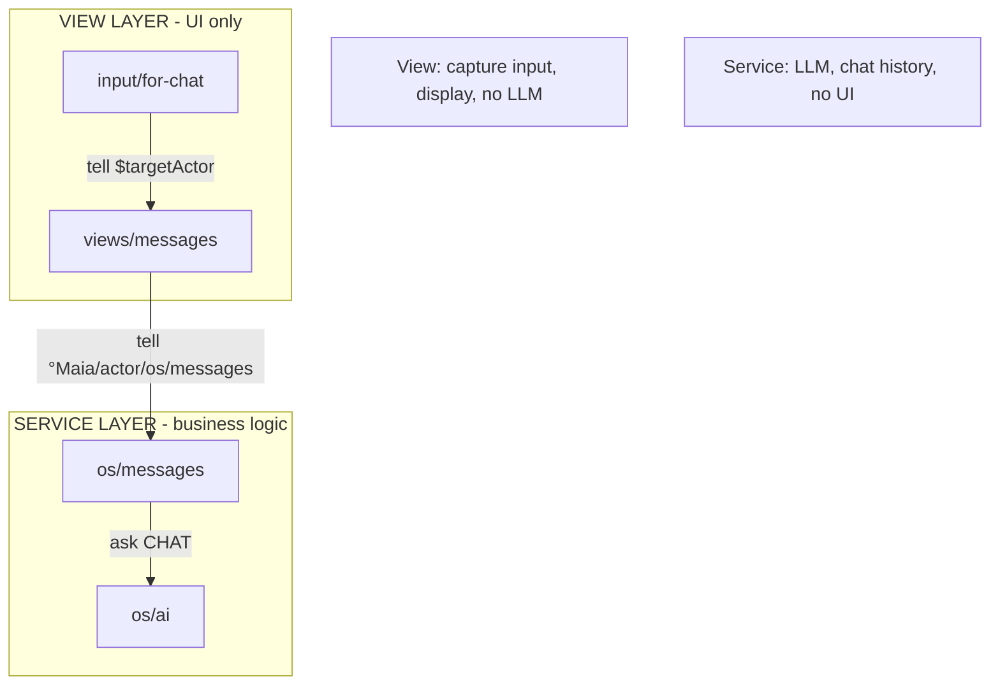
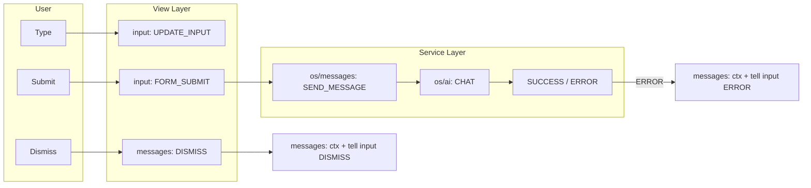
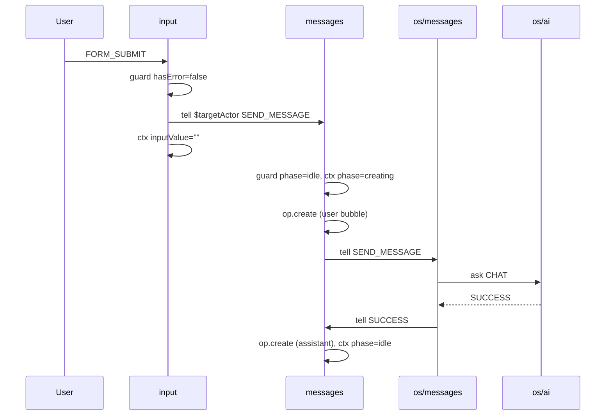
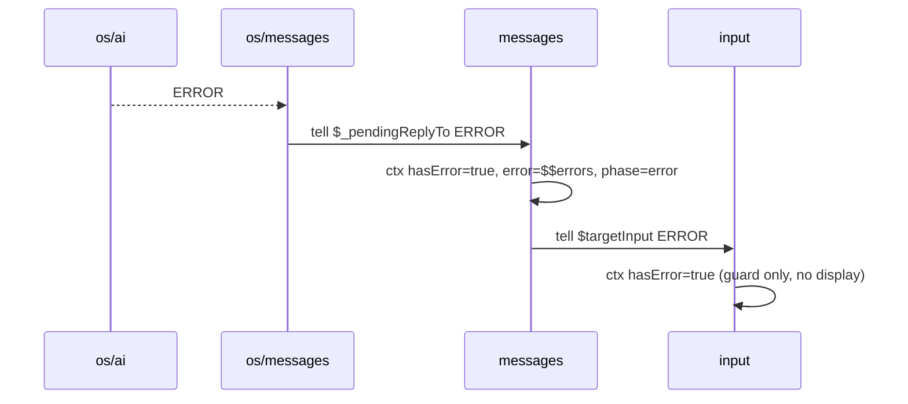
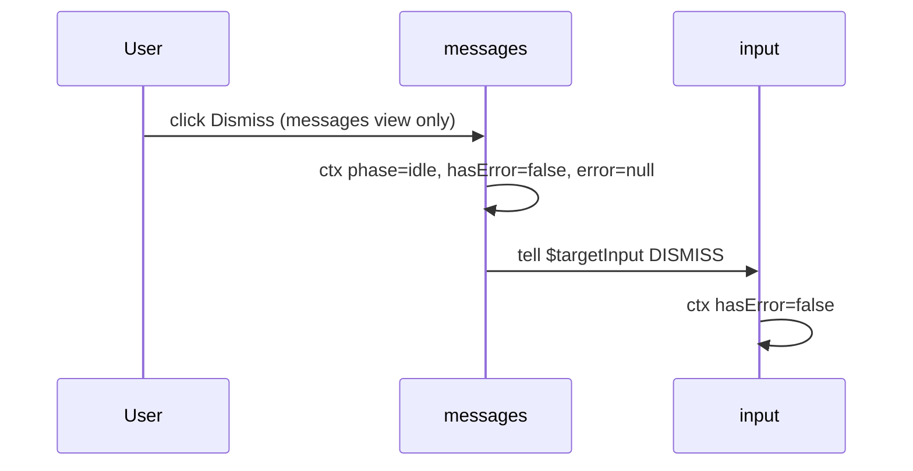

# Chat App: Compact Flow + View/Service Separation

**Principles**: compact-simplify-consolidate, strict separation (View vs Service), single source of truth, universal sibling refs.

---

## 1. Separation of Concerns (Immutable)

| Layer       | Actors             | Owns                                 | Never                      |
| ----------- | ------------------ | ------------------------------------ | -------------------------- |
| **View**    | input, messages    | UI state, display, form              | Call LLM, own chat history |
| **Service** | os/messages, os/ai | conversations, _pendingReplyTo, CHAT | Render UI, own inputValue  |

---

## 2. Consolidated Context (Single Source of Truth)

**Before (duplication)**:

- input: hasError, error, error-message div, Dismiss btn
- messages: hasError, error, error div, Dismiss btn
- Both display. Both clear. Guards. Schema refs.

**After (consolidated)**:

| Actor           | Context                                                           | Responsibility                                                       |
| --------------- | ----------------------------------------------------------------- | -------------------------------------------------------------------- |
| **input**       | inputValue, hasError (guard only), targetActor                    | Capture, send. Guard blocks submit when error. **No error display.** |
| **messages**    | phase, isLoading, hasError, error, conversations, **targetInput** | Orchestrate, display chat, **own & display error**, Dismiss          |
| **os/messages** | conversations, _pendingReplyTo                                    | LLM bridge                                                           |

**Elimination**: input's error-message div, input's Dismiss button, input's DISMISS handler, $onlyWhenOriginated guards, 50% of error-related code.

---

## 3. Unified Event Flow (Consolidated)

---

## 4. Happy Path (unchanged, clean)

---

## 5. Error Path (Consolidated)

**Fix**: messages uses `$targetInput` (from layout @actors.input), not `°Maia/actor/views/input/for-chat`.

---

## 6. Dismiss Path (Consolidated - One Button)

**Eliminated**: input's Dismiss button, input's DISMISS handler, $onlyWhenOriginated, bidirectional tells.

---

## 7. Universal Tell Pattern

| From        | To          | Use                       | Why                 |
| ----------- | ----------- | ------------------------- | ------------------- |
| input       | messages    | `$targetActor`            | Sibling (layout)    |
| messages    | input       | `$targetInput`            | Sibling (layout)    |
| messages    | os/messages | `°Maia/actor/os/messages` | Service (singleton) |
| os/messages | messages    | `$_pendingReplyTo`        | Dynamic (source)    |

**Rule**: View→View = layout sibling ref. View→Service = schema. Service→View = replyTo/source.

---

## 8. Implementation Checklist

### Milestone 1: Add targetInput to messages

- messages context: `targetInput: "@input"` (layout has @actors.input)
- messages process ERROR: `tell target: "$targetInput"`
- messages process DISMISS: `tell target: "$targetInput"`
- Remove `$onlyWhenOriginated` from messages DISMISS

### Milestone 2: Consolidate error to messages only

- input view: remove error-message div (entire block)
- input context: keep hasError (for guard), remove errorLabel, dismissButtonText
- input process: keep ERROR (ctx hasError), **remove DISMISS handler**
- input interface: remove DISMISS
- Session-scoped clear on mount: messages only (input gets DISMISS from messages)

### Milestone 3: Mount clear for reopen

- ViewEngine attachViewToActor: clear hasError for **messages** on fresh mount
- Verify layout-chat children get per-instance context (no shared CoValue)

### Debug: Trace mode

To diagnose error-state breaks or message loops:

1. **Enable trace**: `localStorage.setItem('maia:debug:trace', '1')` or `?maia_trace=1` in URL
2. **Logs**: `[Trace:View]` events from DOM, `[Trace:Inbox]` deliveries (from→to), `[Trace:Process]` handler runs, `[Trace:Context]` snapshot on ERROR
3. **Loop detection**: Warns when same event type bounces between same two actors ≥4 times in 2s
4. **Disable**: `localStorage.removeItem('maia:debug:trace')`

### Verification

- One Dismiss button (messages)
- Error displays only in messages area
- input blocks FORM_SUBMIT when hasError (guard)
- Open/close after error: messages clears on mount or via DISMISS
- Multi-agent chat: $targetInput resolves to sibling (no cross-talk)

