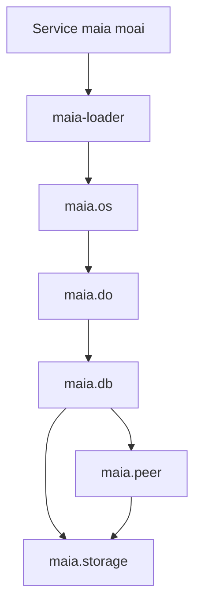
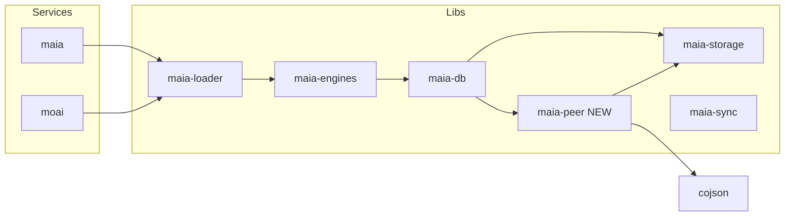

# Compact, Simplify & Consolidate – Executable Plan

This plan implements the architecture from [compact-simplify-consoldiate.mdc](.cursor/rules/compact-simplify-consoldiate.mdc): radical elimination, 100% migration, no backwards compatibility layers. Each milestone is testable with a human checkpoint.

---

## API Hierarchy (User-Facing)

| Layer | API | Role |
|-------|-----|------|
| **maia.os** | `maia` (boot result) | User-facing interface; what services use. Boot, engines, modules. |
| **maia.do** | `maia.do({ op, schema, key, filter, ... })` | Data operations. DataEngine (in maia-engines). Public data API. |
| **maia.db** | Internal | What maia.do uses. MaiaDB (CoJSON wrapper). read/create/update/delete/resolve. |
| **maia.peer** | `maia.peer` (optional ref) | P2P layer; node, account, sync. |
| **maia.storage** | Internal / peer | Storage adapters (IndexedDB, PGLite, Postgres). |

**Flow:** service → maia-loader → **maia.os** → **maia.do** → maia.db → maia.peer, maia.storage

**User-facing:** All interaction through **maia.os** (the running MaiaOS instance). Data ops via **maia.do({ op: "read", schema: "", key, filter, map, ... })**.

**Naming:**
- Merge `maia-operations` + `maia-script` → **maia-engines** (@MaiaOS/engines)
- DataEngine = operations engine (was DBEngine); lives in maia-engines
- Property: `maia.do` – exposes DataEngine; **maia.do({ op, schema, key, filter, ... })** is the public data API
- Use **MaiaPeer** (not localPeer, not CoPeer)

---

## Package Layout (After Consolidation)

| Package | Role |
|---------|------|
| **@MaiaOS/engines** | DataEngine (data ops), ActorEngine, ViewEngine, StyleEngine, StateEngine, ToolEngine, MaiaScriptEvaluator, modules. Merged from maia-operations + maia-script. |
| **@MaiaOS/peer** | Node + account + storage wiring + sync. Extracted from maia-db. |
| **@MaiaOS/db** | MaiaDB (CRUD, resolve, indexing, seeding), ReactiveStore. Depends on peer. |
| **@MaiaOS/storage** | Storage adapters (IndexedDB, PGLite, Postgres). |
| **@MaiaOS/sync** | Sync server only. |

### maia-engines Structure (Clean Separation)

| Component | Role |
|-----------|------|
| **data.engine.js** | DataEngine – executes maia.do({ op, schema, key, ... }). Uses MaiaDB. Supports **pluggable operation types** – register custom ops (domain-specific, extensions) without modifying core. |
| **actor.engine.js**, **view.engine.js**, **style.engine.js**, **state.engine.js**, **tool.engine.js** | All engines. Each receives `maia.do` ref; all DB interaction via **maia.do({ op: "read", ... })**. No direct MaiaDB access. |
| **evaluator.js**, **config-loader.js** | Utils. |
| **modules/** | db, core, ai, sparks. |
| **operations/** | Operation impls (createSuccessResult, createErrorResult, etc.). |

### Clean Architecture Rules

- **Self-contained packages:** No cross-spill. Each package has a single responsibility.
- **Unidirectional deps:** loader → engines → db → peer, storage. No circular deps.
- **ReactiveStore:** Lives in maia-db (used by read, reactive-resolver). Engines import from maia-db if needed.
- **Evaluator injection:** maia-db read uses Evaluator for filter expressions; inject at boot to avoid maia-db → maia-engines.
- **All engines → maia.do:** ActorEngine, ViewEngine, StyleEngine, StateEngine all use `maia.do({ op: "read", ... })` for DB. No direct MaiaDB/backend access.

### DataEngine: Pluggable Operation Types

DataEngine supports **pluggable operation types**. Built-in: read, create, update, delete, schema, resolve, append, createSpark, readSpark, etc. Custom ops can be registered (e.g. `registerOperation(name, handler)`) for domain-specific or extension operations.

### Engine Interface Standardization

All engines follow the same pattern:
- Receive `maia.do` (DataEngine ref) from loader
- Use `maia.do(payload)` for all data operations – never `maia.db` or backend directly
- Unified `execute` / lifecycle interface where applicable

---

## Terminology (Single Source of Truth)

| Old | New |
|-----|-----|
| DBAdapter + CoJSONBackend | MaiaDB (single class) |
| maia-operations + maia-script | **maia-engines** (@MaiaOS/engines) |
| DBEngine | **DataEngine** (data.engine.js in maia-engines) |
| maia.db() (public data API) | **maia.do()** – public data API |
| maia.db (internal) | MaiaDB – what maia.do uses |
| dbEngine (property) | maia.do (exposes DataEngine) |
| backend / adapter param | peer (MaiaPeer instance) |
| cojson/ folder in maia-db | peer logic → maia-peer; CRUD/indexing/seed stay in maia-db |
| kernel.js | loader.js |
| User-facing root | **maia.os** (MaiaOS instance) |

---

## Milestones (Executable, One-by-One)

### Milestone 0: Quick Wins & Foundation

**Goal:** Delete dead code, establish folder structure. App still runs.

- Delete `_debugCoIdRegistry()` from loader (dead, broken with CoJSON)
- Create `cojson/seeding/`; move `schema/seed.js` → `seeding/seed.js`; update imports
- Verify: `bun run build`, maia and moai start

**Checkpoint:** App runs

---

### Milestone 1: Extract @MaiaOS/peer Package

**Goal:** MaiaPeer as its own package. maia-db depends on it.

Create `libs/maia-peer/` with:
- `createPeer({ agentSecret, storage, peers })` → `{ node, account }`
- `loadPeer({ accountID, secret, storage, peers })` → `{ node, account }`
- `setupSyncPeers(syncDomain)`, `subscribeSyncState()`
- Move from maia-db: `cojson/groups/coID.js` (createAccountWithSecret, loadAccount), `cojson/peers/sync-peers.js`
- maia-peer depends on: cojson, cojson-transport-ws, @MaiaOS/storage

Update:
- maia-self: import from @MaiaOS/peer
- maia-db: import from @MaiaOS/peer; MaiaDB later takes `peer` (node+account)
- maia-loader boot: create peer via @MaiaOS/peer, pass to MaiaDB

**Checkpoint:** Sign in, load vibe, sync works

---

### Milestone 2: Consolidate DBAdapter + CoJSONBackend → MaiaDB

**Goal:** Single MaiaDB class. No DBAdapter.

- Create `MaiaDB` in maia-db merging CoJSONBackend logic
- Delete `db-adapter.js`, `CoJSONBackend` class
- MaiaDB constructor: `new MaiaDB(peer)` where peer = { node, account }
- DataEngine holds MaiaDB; calls `maiaDB.read()`, `maiaDB.create()`, etc.
- Update boot: `new MaiaDB(peer)` instead of `new CoJSONBackend(node, account)`

**Checkpoint:** Sign in, load vibe, create/update data

---

### Milestone 3: Merge maia-operations + maia-script → maia-engines, DataEngine, maia.db → maia.do, kernel → loader

**Goal:** Single engines package. Clean separation. API stays maia.do().

- Create `libs/maia-engines/` – merge maia-operations + maia-script
- Rename `DBEngine` → **DataEngine**, `engine.js` → `data.engine.js` (the operations engine)
- Structure: engines/, operations/, modules/, utils/
- Move ReactiveStore to maia-db (breaks cycle: maia-db owns store primitive; engines import from maia-db if needed)
- Inject Evaluator into MaiaDB/read at boot (avoids maia-db → maia-engines)
- Rename `maia.db` → `maia.do` everywhere – **maia.do({ op, schema, key, filter, ... })** is the public data API
- All engines receive `maia.do`; use it for all DB ops. Standardize interface: no direct backend access.
- Rename `kernel.js` → `loader.js` in maia-loader
- Delete maia-operations, maia-script. Update loader, maia-db, maia-tools, jsconfig.

**Checkpoint:** No regressions

---

### Milestone 4: Apply MaiaPeer Naming & API Hierarchy

**Goal:** Consistent MaiaPeer terminology. Confirm API hierarchy.

- Replace `backend` parameter → `peer` (MaiaPeer instance) across maia-db
- Add `maia.peer` getter (optional) for tools that need direct peer access
- JSDoc/errors: use "MaiaPeer" not "localPeer" or "CoPeer"
- Confirm flow: service → maia-loader → **maia.os** → **maia.do** → maia.db → maia.peer, maia.storage

**Checkpoint:** Sync, create, update, delete

---

### Milestone 5: Split seed.js & Per-File Simplifications

**Goal:** Apply [compact-simplify-consoldiate.mdc](.cursor/rules/compact-simplify-consoldiate.mdc) to large files. Eliminate first, split only if >1000 lines and truly needed.

- Seed: extract bootstrap, cleanup, configs, data, registry, helpers → target ~250 lines
- Per file: question existence, eliminate, then split only if irreducible

**Checkpoint:** Fresh account seed, reseed, smoke tests

---

### Milestone 6: Documentation

- Update maia-docs: maia.os → maia.do → maia.db → maia.peer
- Update READMEs: maia-db, maia-engines, maia-peer
- Remove DBAdapter/CoJSONBackend references
- Document engine interface standardization
- Final approval

---

## Implementation Order

1. Milestone 0 – Dead code, seeding folder
2. Milestone 1 – Extract maia-peer
3. Milestone 2 – MaiaDB consolidation
4. Milestone 3 – Merge maia-operations + maia-script → maia-engines, DataEngine, maia.db → maia.do, kernel → loader
5. Milestone 4 – MaiaPeer naming, hierarchy
6. Milestone 5 – seed.js split, per-file
7. Milestone 6 – Docs

---

## 20 Largest Files for Compaction

Apply [compact-simplify-consoldiate.mdc](.cursor/rules/compact-simplify-consoldiate.mdc): question existence, eliminate, then split. Each file: rename policy, package role, separation of concerns.

### Renaming Policies (Cross-Cutting)

- **backend** → **peer** (MaiaPeer instance)
- **dbEngine** → **maia.do** (DataEngine ref)
- **kernel** → **loader** (file + comments)
- **CoJSONBackend** → **MaiaDB**
- **DBAdapter** → deleted (no interface)
- **maia.db** → **maia.do** (all call sites)

### Package Roles (Separation of Concerns)

- **maia-db:** MaiaDB – CRUD, resolve, indexing, seeding. No peer logic (→ maia-peer).
- **maia-engines:** DataEngine + Actor/View/Style/State/Tool engines. All DB via maia.do.
- **maia-loader:** Boot MaiaOS, wire engines. Exposes maia.os.
- **maia-schemata:** Schema definitions, validation, transforms.
- **services/maia:** Frontend SPA. Uses maia.os, maia.do.
- **services/moai:** Sync + API. Boots MaiaDB + DataEngine.
- **maia-self:** Passkey auth. Uses @MaiaOS/peer.

---

### maia-db

| # | Lines | File | Rename | Split/Eliminate | Target |
|---|-------|------|--------|-----------------|--------|
| 1 | 2,521 | `cojson/schema/seed.js` | Move → `seeding/seed.js`. `backend` → `peer`. | Extract: bootstrap, cleanup, configs, data, registry, helpers. | ~250 + 6 |
| 2 | 1,554 | `cojson/crud/read.js` | `backend` → `peer`. Evaluator injected. | Extract: unified-store, special-cases. | ~400 + 2 |
| 3 | 1,203 | `cojson/indexing/schema-index-manager.js` | `backend` → `peer`. | Consolidate ensure*. Extract index-operations. | ~600 |
| 12 | 685 | `cojson/core/cojson-backend.js` | File → `MaiaDB.js`. Class → MaiaDB. | Merge into MaiaDB. Extract spark. | ~550 |
| 14 | 618 | `cojson/groups/groups.js` | `backend` → `peer`. | Eliminate duplicates. | – |
| 15 | 602 | `cojson/crud/data-extraction.js` | `backend` → `peer`. | Evaluate merge with read. | – |
| 16 | 591 | `cojson/schema/resolver.js` | `backend` → `peer`. | – | – |
| 18 | 451 | `cojson/cache/coCache.js` | JSDoc: maia.dbEngine → maia.do. | – | – |

### maia-engines (was maia-script + maia-operations)

| # | Lines | File | Rename | Split/Eliminate | Target |
|---|-------|------|--------|-----------------|--------|
| 8 | 917 | `actor.engine.js` | `dbEngine` → `maia.do`. No backend. | Extract: config-loader, rerender-batch. | ~500 + 2 |
| 10 | 727 | `view.engine.js` | `dbEngine` → `maia.do`. | Extract: dom-builder, events. | ~300 + 2 |
| 11 | 697 | `state.engine.js` | `dbEngine` → `maia.do`. kernel→loader. | Extract: guards, transitions. | ~400 + 2 |
| 19 | 449 | `style.engine.js` | `dbEngine` → `maia.do`. | – | – |

### maia-loader

| # | Lines | File | Rename | Split/Eliminate | Target |
|---|-------|------|--------|-----------------|--------|
| 9 | 871 | `kernel.js` | File → `loader.js`. Backend→MaiaDB in comments. | Extract: boot, vibes, covalues. | ~300 + 3 |

### maia-schemata

| # | Lines | File | Rename | Split/Eliminate | Target |
|---|-------|------|--------|-----------------|--------|
| 6 | 981 | `schema-transformer.js` | – | Extract: transform-schema, transform-instance. | ~100 + 2 |
| 7 | 939 | `validation.engine.js` | – | Extract: formats, ajv-setup. | ~500 + 2 |

### services/maia

| # | Lines | File | Rename | Split/Eliminate | Target |
|---|-------|------|--------|-----------------|--------|
| 4 | 1,089 | `db-view.js` | kernel→loader. | Extract: value-renderer, metadata-utils, schema-table, covalue-detail. | ~350 + 4 |
| 5 | 1,077 | `main.js` | `maia.db` → `maia.do`. | Extract: auth-flow, route-handler, loading-screens. | ~400 + 3 |
| 17 | 575 | `dashboard.js` | `maia.db` → `maia.do`. | – | – |

### services/moai

| # | Lines | File | Rename | Split/Eliminate | Target |
|---|-------|------|--------|-----------------|--------|
| 13 | 628 | `index.js` | MaiaDB, DataEngine in boot. | Extract: sync-handlers, agent-handlers, seed-boot. | ~250 + 3 |

### maia-self

| # | Lines | File | Rename | Split/Eliminate | Target |
|---|-------|------|--------|-----------------|--------|
| 20 | 435 | `self.js` | Import from @MaiaOS/peer. | – | – |

---

## Compact-Simplify Alignment

- **Eliminate first:** DBAdapter, CoJSONBackend, _debugCoIdRegistry
- **100% migration:** No compatibility layers; update all call sites before delete
- **No backwards compat:** No wrappers, shims, or deprecation paths
- **Single implementation:** MaiaDB is the data layer; MaiaPeer is the peer layer
- **Universal interfaces:** **maia.do({ op, schema, key, filter, map, ... })** as single data API; peer as single peer abstraction; **maia.os** as user-facing root
