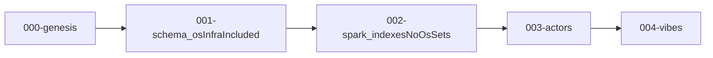

# Delete maia-universe + unify migrate sparks (plan v2)

This revision applies your **indexed pipeline** — **genesis 0**, **schema 1**, **spark 2 (without os)**, **actors 3**, **vibes 4** — and folds in current repo observations (duplicate `updates/004-actors`/`005-vibes`, brittle codegen paths, `@MaiaOS/universe` still referenced by codegen and dev-server).

---

## Canonical folder names (runner sorts lexically)

Match `discoverMigrationStepFolders` (`^\d{3}-`). Use **five** directories:

| Index | Folder | Role |
|------:|--------|------|
| 0 | `000-genesis` | Account scaffold + `°maia` sparks shell + `@nanoids` CoMap (**no factory rows**, **no spark.os infra writes** unless you deliberately fold an exception here — default: keep scaffold-only). |
| 1 | `001-schema` | Meta-factory + **all factory-schema CoMaps**, then **spark.os** slot wiring: `INFRA_SLOTS` population, definition catalog bootstrap, `writeInfraSlotsToSparkOs`, `loadInfraFromSparkOs`, `hydrateValidationMetaFromPeer`, factory CoMap verification pass (**all “spark.**os**” / infra-key `.set`s live here**, not step 2). |
| 2 | `002-spark` | **Spark layer without spark.os cmap mutation**: e.g. `rebuildAllIndexes(peer)` (currently at tail of [`seed.js`](libs/migrate/src/helpers/seed/seed.js)), any follow-up strictly **excluding** infra slot keys (`sparkOs` cmap `set`s). Optional: asserts / validation that `libs/migrate/src/sparks/` and generated registries are consistent — **must not duplicate** step 1 infra. |
| 3 | `003-actors` | Service + UI configs via `getSeedConfig` slice (today’s actors step). |
| 4 | `004-vibes` | `buildSeedConfig` + vibes + data buckets (today’s vibes step). |

**`requires` chain:** `"001-schema"` ← `"000-genesis"`; `"002-spark"` ← `"001-schema"`; `"003-actors"` ← `"002-spark"`; `"004-vibes"` ← `"003-actors"**.

**Deletes:** Remove duplicate half-renamed trees `updates/004-actors/` and `updates/005-vibes/` (bad `config.id` ≠ folder name); there must be exactly one actors folder (`003-actors`) and one vibes folder (`004-vibes`) after this renumbering.

---

## What changed vs. plan v1 (003-spark-os)

- Renamed conceptually from **five steps ending in `005-vibes`** to **five steps ending in `004-vibes`** with **zero-based indices** aligned to folders `000` … `004`.
- **spark.os infra is explicitly not step 2.** It moves under **`001-schema`** (after factories exist — same dependency order as current `seed.js`).
- **`002-spark`** is narrowly **non-os** touches (indexes rebuild, verification), so the step name reflects “spark” without implying “spark.os cmap” authoring.

---

## Content vs. orchestration

- **`libs/migrate/src/sparks/<spark>/`** — authored JSON (+ minimal `*.js` where actors need code). Single source after deleting `libs/maia-universe`.
- **`libs/migrate/src/updates/<NNN-*/>**` — `config.json`, `migrate.js`, and **generated `generated.js` only** (no per-step `configs/**/*.json` for actors/vibes; codegen imports `../../sparks/...`).
- **`@AvenOS/migrate` exports**: keep `./helpers/*`, `./runner`, `./orchestration` → seed entry.

---

## Refactor todos (execution phase — do not run until explicitly asked)

1. **Rewire codegen** [`scripts/generate-migrate-registries.mjs`](scripts/generate-migrate-registries.mjs): globs → `libs/migrate/src/sparks/maia/`; emits `002-factories/generated.js`-equivalent under **`001-schema/generated.js`**; actors → `003-actors/generated.js`; vibes+data → `004-vibes/generated.js`. Swap `maiaIdentity` import to [`libs/migrate/src/helpers/identity-from-maia-path.js`](libs/migrate/src/helpers/identity-from-maia-path.js).

2. **Split [`libs/migrate/src/helpers/seed/seed.js`](libs/migrate/src/helpers/seed/seed.js)** (or add `schema-seed.js` / `spark-index-seed.js`):
   - Step 1 invokes **factory creation + spark.os infra** block (everything up to / including infra hydration that currently needs `factoryCoIdMap`).
   - Step 2 invokes **rebuild indexes** (and optional non-os post-pass); **cannot** open `spark.os` for new slot IDs.

3. **Migrate step `migrate.js` files**: thin wrappers calling the split helpers; **check** predicates move with their phase (infra filled → satisfies before actors; indexes warm → satisfies before actors if applicable).

4. **Brand ref parity**: Ensure [`build-seed-config.js`](libs/migrate/src/helpers/seed/build-seed-config.js) `getSeedConfig` / `buildSeedConfig` include `brand/maiacity.style.json` in `styles` before actor transform so `brand: °maia/brand/maiacity.style.json` resolves (`[SchemaTransformer] No co-id…` bug).

5. **Delete packages** `libs/maia-universe`, `libs/maia-seed` after rerouting [`services/app/dev-server.js`](services/app/dev-server.js), root scripts, Dockerfiles (`universe:registry` → `migrate:registry`), [`jsconfig.json`](jsconfig.json), and tests.

6. **Verification:** `bun run migrate:registry`, `bun run check:ci`, `bun test`, optional sentrux rescan → update [`.sentrux/AUDIT.md`](.sentrux/AUDIT.md).

---

## Audit vs. earlier refactor plan (insights)

Already effectively delivered by **`@AvenOS/migrate` + numbered updates:** scoped seed slices, codegen per phase, vibes gated after actors — **instead of** `seedSchemas`/`seedVibes` on `MaiaDB`, `engine-ops`, duplicate flow steps (`genesisSeedSchemasStep`), or `SEED_VIBES` env. Missing work for **parity** today is structural: duplicate spark trees, mismatched codegen paths, orphaned `updates/004-*` duplicates, codegen still pointing at `@MaiaOS/universe` — addressed by execution items above — not by reviving skipped MaiaEngine/MaiaDB split.

---

## Mermaid

`sch` intentionally groups **schemas + spark.os infra** because step 2 excludes os cmap authoring per product decision.
