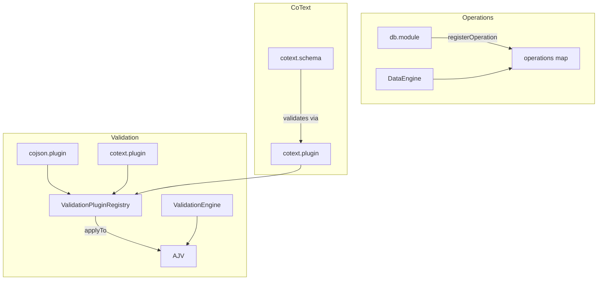

# Extensible Modules Master Plan

Master feature plan merging: Pluggable Validation Architecture, Pluggable Operations Registry (db module), CoText Schema + CoText Validation Plugin.

---

## Problem Statement

MaiaOS has **inconsistent extensibility** across its core domains:

- **Tools** are pluggable (modules register via registry)
- **Validation** is monolithic (ajvCoTypesPlugin hardcoded; no plugin surface)
- **Operations** are static (DataEngine.operations hardcoded; db module does not own ops)
- **CoText** is missing (Jazz's CoPlainText has no equivalent; was explicitly removed)

**Root cause:** No shared plugin/registry pattern for validation and operations. Adding new keywords, formats, or data ops requires editing core packages.

**How might we** unify extension points so that validation, operations, and specialized schemas (like CoText) can be extended via modules—mirroring the tools pattern—so that developers can add custom validation rules, custom maia.do ops, and CoText support without forking core packages?

---

## Success Criteria

- **Desirable**: Developers can add custom validation keywords, custom operations, and CoText support via modules. Same mental model as tools.
- **Feasible**: ValidationPluginRegistry + applyTo(ajv); DataEngine.registerOperation(); CoText plugin with grapheme format. All build on existing AJV, DataEngine, CoList.
- **Viable**: No breaking changes to maia.do, validateAgainstSchema, or tool APIs. Clean migration; 100% adoption; no legacy shims.

---

## Solution Approach

**Three pillars, one architectural pattern:**

| Pillar | Owner | Extension Point | JSON Definition |
|--------|-------|-----------------|-----------------|
| **Validation** | @MaiaOS/schemata | ValidationPluginRegistry, plugins in schemata/plugins/ | keywords, formats in .plugin.js |
| **Operations** | db module | DataEngine.registerOperation() | .operation.maia in db module |
| **CoText** | schemata (validation only) | cotext.plugin.js | cotext.schema.json, cotext keyword |

**Dependency order:** Validation → Operations (independent) → CoText (depends on validation).

**Root-cause fix:** Introduce plugin/registry pattern for validation and operations; CoText as first consumer of the validation plugin system.

---

## Implementation Milestones

### Milestone 0: Capture Current State & System Audit

**CRITICAL: This MUST be completed before all other milestones**

**System Audit:**
- [ ] Identify all files: ajv-co-types-plugin.js, validation.engine.js, data.engine.js, db.module.js, create.js, meta.schema.json
- [ ] Map dependency graph: maia-schemata → maia-db, maia-engines; cojson types
- [ ] Read ALL relevant source files end-to-end
- [ ] Document current architecture: how validation, operations, and tools are wired
- [ ] Identify integration points: loadSchemaAndValidate, create flow, maia.do execute
- [ ] List call sites: validation (sync, create, update, tool, state, actor), operations (tools, engines)
- [ ] Document current state (how things work NOW)
- [ ] Create comprehensive audit report

**Output**: Complete baseline understanding before making any changes

**Human Checkpoint:** ✋ Present audit findings before proceeding

---

### Milestone 1: Pluggable Validation Architecture

**Implementation (Root-Cause Architectural Solution):**
- [ ] Create `libs/maia-schemata/src/validation-plugin-registry.js` – ValidationPluginRegistry class
- [ ] Create `libs/maia-schemata/src/plugins/cojson.plugin.js` – extract from ajv-co-types-plugin
- [ ] Refactor ValidationEngine.initialize(): accept registry in options, call `registry.applyTo(this.ajv)` after creating AJV
- [ ] Add ValidationPluginRegistry to ModuleRegistry or pass to getValidationEngine
- [ ] Deprecate or re-export ajv-co-types-plugin from cojson.plugin.js
- [ ] Wire loader: create registry, pass to ValidationEngine

**Cleanup & Migration:**
- [ ] Remove hardcoded ajvCoTypesPlugin call from ValidationEngine (replaced by plugin)
- [ ] Verify all validation still works (existing schemas, create, update, sync)

**Verify**: Does this solve the root cause? Makes validation extensible like tools.

**Human Checkpoint:** ✋ Pause for manual testing

---

### Milestone 2: Pluggable Operations (Db Module Owns Ops)

**Implementation (Root-Cause Architectural Solution):**
- [ ] Add `registerOperation(opName, { definition, execute })` to DataEngine
- [ ] Create `libs/maia-engines/src/modules/db/operations/` with read.operation.maia, create.operation.maia, etc.
- [ ] Refactor db.module.js: register all built-in ops from JSON + execute functions on load
- [ ] DataEngine: start with minimal/empty ops or keep built-ins in constructor; db module populates or overwrites
- [ ] Optional: operation.schema.json for .operation.maia meta-schema

**Cleanup & Migration:**
- [ ] Remove hardcoded operations map from DataEngine constructor (or keep as fallback; db module registers)
- [ ] Update all operation imports; execute functions stay in operations/ or move to db/operations/
- [ ] Verify maia.do({ op: 'read'|'create'|... }) still works

**Verify**: Does this solve the root cause? Db module owns ops; others extend via registerOperation.

**Human Checkpoint:** ✋ Pause for manual testing

---

### Milestone 3: CoText Schema + CoText Validation Plugin

**Implementation (Validation-Only; No create path or wrapper in this milestone):**
- [ ] Create `libs/maia-schemata/src/plugins/cotext.plugin.js` – format `grapheme`, keyword `cotext`
- [ ] Add `unicode-segmenter` to maia-schemata dependencies
- [ ] Add `cotext` property to meta.schema.json
- [ ] Create `libs/maia-schemata/src/data/cotext.schema.json` – colist, cotext: true, items format: grapheme
- [ ] Register CoText plugin in ValidationPluginRegistry (schemata applies it on init)
- [ ] Add cotext to SCHEMAS in maia-schemata index.js

**Scope (this milestone):** Schema + validation plugin only. Create path (string → graphemes) and CoText wrapper are out of scope unless explicitly requested.

**Verify**: CoText schema validates; cotext keyword enforces grapheme-only items.

**Human Checkpoint:** ✋ Pause for manual testing

---

### Milestone 4: Documentation & Final Review

- [ ] Manual verification: validation plugins, operations, CoText schema all work
- [ ] Update `libs/maia-docs/developers/` – validation plugins, operation registry, CoText
- [ ] Update `libs/maia-docs/creators/` – how to add custom validation, custom ops, use CoText schema
- [ ] Final human approval ✋

---

## File Structure

```
libs/maia-schemata/src/
├── validation-plugin-registry.js    # NEW
├── plugins/
│   ├── cojson.plugin.js            # NEW (extract from ajv-co-types-plugin)
│   └── cotext.plugin.js            # NEW (Milestone 3)
├── data/
│   └── cotext.schema.json          # NEW (Milestone 3)
├── os/
│   └── meta.schema.json            # MODIFY (add cotext)
└── ajv-co-types-plugin.js          # DEPRECATE / re-export

libs/maia-engines/src/
├── engines/
│   └── data.engine.js              # MODIFY (registerOperation)
└── modules/
    └── db/
        ├── db.module.js            # MODIFY (register ops)
        └── operations/            # NEW
            ├── read.operation.maia
            ├── create.operation.maia
            └── ...
```

---

## Architecture Diagram



---

## Manual Testing Strategy

- **Validation**: Add a test plugin, verify keyword runs; validate CoText schema with grapheme array
- **Operations**: Register custom op via module, call maia.do({ op: 'myOp', ... })
- **CoText**: Validate data against cotext schema; verify grapheme format rejects multi-char items

---

## Risks & Mitigation

| Risk | Mitigation |
|------|------------|
| Boot order: ValidationEngine needs registry before modules load | Create registry in loader; pass to getValidationEngine before modules |
| DataEngine created before db module; ops empty initially | Db module loads first; populates ops before first maia.do call |
| CoText create path not in scope | Document that callers must pass grapheme array; optional create path in future |

---

## Documentation Updates

- [ ] `libs/maia-docs/developers/03_maia-schemata/` – validation plugins, plugin contract
- [ ] `libs/maia-docs/developers/04_maia-engines/` – operation registry, db module ops
- [ ] `libs/maia-docs/creators/` – CoText schema usage, custom validation, custom ops
- [ ] ❌ Skip `libs/maia-docs/agents/LLM_*.md`
