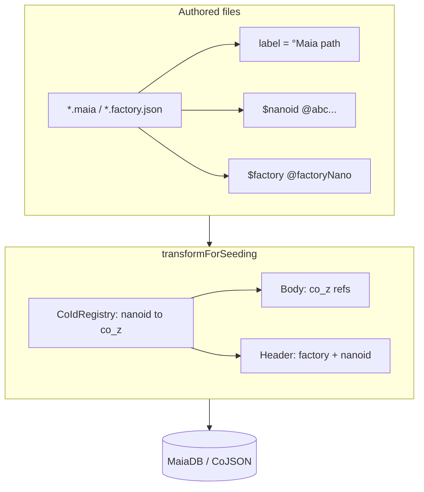

# Factory migrate: `$nanoid` identity + migrate-mode seed

## Goal (iteration)

- **Stable authored ref**: one field **`$nanoid`** — 12 characters from **`[A-Za-z0-9]`**, written in files as **`@` + 12 chars** (example shape: `@aB3dEf9GhJk`). This is the **only** hardcoded cross-reference key between factory definitions and instance configs (replacing `°Maia/factory/…` / long instance `$id` strings for wiring).
- **Human path (non-ref)** — merge legacy **`$id`**, **`$title`**, **`$label`**, **`@label`** into a **single** field **`label`**: the full path string **`°Maia/…`** (e.g. `°Maia/todos/actor/intent`). **No separate `title` field.** Ref wiring uses only **`$nanoid`**.
- **`$factory`**: in authored JSON, points at the **factory schema** by **`$nanoid`** (e.g. `"$factory": "@xYz9…"`). After seeding, body fields still resolve to **`co_z…`** like today.
- **CoJSON header**: persist **`$nanoid`** in **dynamic header metadata** next to **`$factory`** on create (today [`create-covalue-for-spark.js`](libs/maia-db/src/cojson/covalue/create-covalue-for-spark.js) only sets `{ $factory }` in practice via cotype helpers). Seeded **content** continues to use **resolved `co_z` ids** for refs; nanoids in bodies are transformed away the same way `°Maia/…` refs are today.
- **Migration**: remove legacy **`$id`**, **`@label`**, redundant titles, and old ref style across **`*.maia`**, **`*.factory.json`**, and **seeding** code — **no** long-term compatibility shims (per repo rules).

## How it works today (unchanged summary)

See previous analysis: factory **schema** rows upsert on full seed; **instance** configs always **create**; **`forceFreshSeed`** gates seed; [`patterns.js`](libs/maia-factories/src/patterns.js) uses `°…/factory/`, instance/vibe path regexes; [`factory-transformer.js`](libs/maia-factories/src/factory-transformer.js) treats **`$id`** as instance identifier and skips most `$` keys from ref walking.

## Target model (authoritative)

| Concept | Field | Notes |
|--------|--------|--------|
| Stable ref (authoring) | **`$nanoid`** | 12 chars `[A-Za-z0-9]`; file form **`@` + nanoid** |
| Human path (non-ref) | **`label`** | Full **`°Maia/…`** path; merged from old **`$id`**, **`$title`**, **`@label`**, **`$label`** |
| Factory pointer | **`$factory`** | **Nanoid** of target factory schema in source; transforms to **`co_z…`** |

**Registry**: [`spark.os.factories`](libs/maia-db/src/migrations/seeding/store-registry.js) and **`CoIdRegistry`** should index by **`$nanoid`** → **`co_z`**, and may index **`label`** for debugging or migrate-only matching.

**AJV vs nanoid vs `co_z`**: AJV does **not** need nanoids as a first-class id. It needs a **stable string per schema document** for `addSchema` / `getSchema` / `$ref`. **Runtime validation** (against schemas loaded from the peer) should use **`co_z`** as that id — the same id the CoValue already has — so AJV’s registry aligns with storage. **Nanoids** exist so **source files** can reference each other **before** any CoValue exists; the seed pipeline maps **`@nanoid` → `co_z`**, then validation paths that see a factory co-id should use **`co_z`** only. **Static / CI** validation of raw `*.factory.json` may still use a **derived** JSON Schema `$id` (e.g. `https://maia.city/schema/<nanoid>`) **or** compile after a synthetic map nanoid→temporary id — that is tooling detail, not “AJV stores nanoids in prod.”

**Product fields on factory JSON**: use **`label`** for the **`°Maia/factory/…`** path; remove duplicate legacy **`$id`** / **`title`** as human-path carriers — **no** duplicate path fields in authored JSON.

**Runtime role of `$nanoid` (header)**: After create, **`headerMeta.$nanoid`** is the **stable authored identity** persisted on the CoValue. **Migrate / seed upsert** reads it to match repo config → existing row. **Normal app behavior** (resolve actor, follow refs, validation) still uses **`co_z`** and **`headerMeta.$factory`**; nanoid is **not** the primary graph edge at runtime — it is **correlation + migration**, not day-to-day linking between instances.

**Nested UI `"label"` keys** inside view trees (e.g. tab labels in views) may **conflict** with top-level identity **`label`**. Resolve by **namespacing** nested UI labels (e.g. `text`, `tabLabel`, or keep nested `label` only where schema allows) so top-level **`label`** is reserved for the **`°Maia/…`** path on configs — **update view schemas** accordingly.

## Implementation phases

### Phase A — Identity + plumbing

1. Add **`NANOID_REF_PATTERN`** (or extend ref resolution) in [`patterns.js`](libs/maia-factories/src/patterns.js); **`isFactoryRef`** / instance ref helpers should accept **`@` + 12 alnum** as the **authored** ref form.
2. **`CoIdRegistry`**: register **`$nanoid`** → **`co_z`** for factories and instances during seed.
3. **`factory-transformer.js`**: resolve **`$factory`**, **`$co`**, and nested string refs that point at **`@nanoid`** via the registry; **stop** using instance **`$id`** as the transform anchor — use **`$nanoid`** for refs; **`label`** is not a ref.
4. **`createCoValueForSpark` / `createCoMap`**: pass **`$nanoid`** into header **meta** together with **`$factory`** (confirm jazz/cojson meta shape supports extra keys).
5. **Validation**: extend factory/instance schemas so **`label`** (path), **`$nanoid`** are allowed; remove **`$id`** / **`@label`** / **`title`** from instance schemas where they were first-class.

### Phase B — Content migration (big bang)

1. **`libs/maia-factories`**: every **`*.factory.json`** — assign unique **`$nanoid`**, set **`label`** to **`°Maia/factory/…`** path, remove **`$id`** / **`title`** duplicates, change **`$co`** / **`$factory`** to **nanoid** form where they reference other factories.
2. **`libs/maia-vibes` (and any `*.maia`)**: replace top-level **`$id`** → **`label`**; merge **`@label`** → **`label`** where it is the same path; add **`$nanoid`** per entity; set **`$factory`** to factory nanoid; grep for **`$title` / `$$label`** in view DSL and nested **`label`** keys — align with schema (avoid clashing with path **`label`**).
3. **Seeding / sync / actors**: [`seed.js`](libs/maia-db/src/migrations/seeding/seed.js), [`configs.js`](libs/maia-db/src/migrations/seeding/configs.js), [`seeding-utils.js`](libs/maia-factories/src/seeding-utils.js), [`store-registry.js`](libs/maia-db/src/migrations/seeding/store-registry.js) — switch keys and lookups from **`$id`** / path keys to **`$nanoid`**; **`getCombinedRegistry`** should include nanoid → coId; **`label`** may remain in body as human path.

### Phase C — Migrate-mode seed (from prior plan)

- **`seed({ migrate: true })`**: no full wipe; upsert instances by **`$nanoid`** (from header or registry), overwrite body fields from transformed JSON; wire **`PEER_SYNC_MIGRATE`** and data engine.

## End-to-end flow (target)

## Risks

- **Uniqueness**: global uniqueness of **`$nanoid`** across factories + instances — enforce in CI or a small validator script.
- **AJV**: keep a single story — **runtime** uses **`co_z`**; **authoring** uses nanoids only until transform; avoid two live ids for the same schema in one process.
- **Downstream engines**: any code that **`grep`s `°Maia/`** or **`$id`** for actors/views must be updated in the same migration (e.g. [`view.engine.js`](libs/maia-engines/src/engines/view.engine.js), [`actor.engine.js`](libs/maia-engines/src/engines/actor.engine.js)).

## Files (expected touch surface)

- [`libs/maia-factories`](libs/maia-factories): `patterns.js`, `factory-transformer.js`, `validation.engine.js`, `validation.helper.js`, `seeding-utils.js`, all `**/*.factory.json`
- [`libs/maia-vibes`](libs/maia-vibes): all `**/*.maia`
- [`libs/maia-db`](libs/maia-db): `create-covalue-for-spark.js`, `coMap.js` / other cotypes if meta is threaded, `migrations/seeding/*`, `factory/resolver.js` if it keys by old ids
- [`libs/maia-engines`](libs/maia-engines): any ref to instance **`$id`** / **`@label`**
- [`services/sync`](services/sync): seed build + migrate env

This subsumes the earlier “migrate only” plan: **identity migration is a prerequisite** so migrate can key upserts by **`$nanoid`** instead of **`$id`**.

## Completeness (audit)

**Strong coverage:** Authored identity (`label`, `$nanoid`, `$factory`), transformer/registry, seed plumbing, migrate-mode gate, sync env, nested-`label` conflict, AJV risk, major libs in the file list.

**Gaps now tracked in todos:** (1) **Runtime indexing / resolve** — [`factory-index-manager.js`](libs/maia-db/src/cojson/indexing/factory-index-manager.js) and related code use schema **`title`** for factory refs; moving path to **`label`** requires explicit updates. (2) **Packages outside maia-vibes** — e.g. [`libs/maia-actors`](libs/maia-actors) seed-config, loader/distros, **`buildSeedConfig`** / vibe merge — must be audited. (3) **Persisted CoValues** — the plan is complete for **source** migration; **existing** IndexedDB/PGlite/Postgres rows may still have old keys until a **migrate** run overwrites them (greenfield vs upgrade path). (4) **Tests + CI** — unit/integration and `.maia` format checks. (5) **`seedData` / user data** — out of scope unless you also rename collection keys; call out if data layer should stay unchanged.

**Dependency order:** Phase **A** (plumbing + patterns) → **B** (JSON + `.maia` big bang) → **C** (migrate seed + deploy flags). Do not migrate content before transformer and create paths understand **`$nanoid`**.

**Not exhaustive:** [`libs/maia-docs`](libs/maia-docs) developer docs, root **`.env.example`**, and every grep hit for `°Maia/` across the repo — treat as follow-up documentation and a final repo-wide search during implementation.
