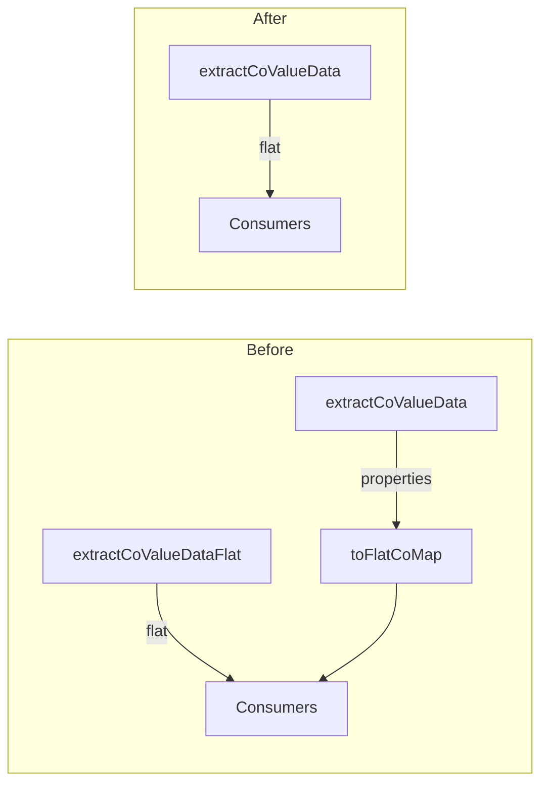

# Flat Format Migration - Master Execution Plan

## Problem Statement

The codebase has two competing representations for CoMap data:

- **Flat**: `{ schematas: 'co_z...', indexes: 'co_z...' }` - direct key-value, matches CoJSON
- **Properties**: `{ properties: [{ key: 'schematas', value: 'co_z...', type: 'co-id' }, ...] }` - normalized for DB viewer

This caused bugs after the registry refactor: consumers expected flat but received properties. The current fix uses `toFlatCoMap()` in 10+ places as a defensive conversion. That's fragmented and error-prone.

**Goal**: One canonical format (flat) from extraction to consumption. No dual format, no fallbacks.

---

## Compact-Simplify-Consolidate Analysis

### First Principles

1. **Should two extraction functions exist?** No. `extractCoValueData` (properties) and `extractCoValueDataFlat` (flat) do the same job. One universal interface.
2. **Should toFlatCoMap exist?** No. It's a conversion layer because the producer emits the wrong format. Eliminate at source.
3. **Why did properties format exist?** DB viewer wanted per-property `type` (co-id, sealed) for display. Derive at render from value. Don't pollute the data layer.
4. **Irreducible core**: One extraction function, one format (flat), no conversion helpers.

### Elimination Opportunities

| Target                                                | Lines              | Action                                              |
| ----------------------------------------------------- | ------------------ | --------------------------------------------------- |
| extractCoValueData (properties branch)                | ~65                | Replace with flat logic; merge into single function |
| extractCoValueDataFlat                                | ~180               | Delete after merging into extractCoValueData        |
| toFlatCoMap                                           | 14 + 25 call sites | Delete entirely                                     |
| convertPropertiesArrayToPlainObject properties branch | ~50                | Delete; flat-only path                              |
| Properties fallbacks                                  | ~30                | Delete all `.get?`, `properties?.find`              |

**Projected reduction**: ~200+ lines.

---

## Audit Summary

### Producers (before)

| Producer                 | Output Format             | Used By                     |
| ------------------------ | ------------------------- | --------------------------- |
| extractCoValueData()     | Properties (CoMap branch) | create.js, update.js        |
| extractCoValueDataFlat() | Flat                      | read.js, deep-resolution.js |

### Consumers with toFlatCoMap / Properties Fallback

| File                        | Usage                                                       |
| --------------------------- | ----------------------------------------------------------- |
| cojson-backend.js           | toFlatCoMap for osData                                      |
| resolver.js                 | toFlatCoMap for sparkData, osData, schematasData, vibesData |
| groups.js                   | toFlatCoMap for registries, sparks, sparkStore              |
| kernel.js                   | toFlatCoMap for 8+ store values                             |
| resolve-capability-group.js | toFlatCoMap internally (5 calls)                            |
| reactive-resolver.js        | (missing) osData.schematas - fails                          |
| dashboard.js                | Inline properties conversion + .get? fallback               |
| read.js                     | Inline properties in readSparksFromAccount                  |
| seed.js                     | .get? fallback for registries/sparks                        |
| db-view.js                  | groupData.properties fallback for name                      |
| operations.js               | extractSchemaDefinition handles both                        |
| resolve-account-profile.js  | profileData.properties?.find for name                       |
| config-loader.js            | convertPropertiesArrayToPlainObject (properties to flat)    |

### DB Viewer

- Main CoMap display (lines 514-534) **already uses flat**: `Object.keys(data).filter(...)`
- Group name (707-711): fallback to `groupData.properties.find` - remove when flat guaranteed

---

## Implementation Milestones

### Milestone 1: Consolidate to ONE extraction function

**File**: [libs/maia-db/src/cojson/crud/data-extraction.js](libs/maia-db/src/cojson/crud/data-extraction.js)

1. Replace the CoMap branch in `extractCoValueData` (lines 89-151) with flat output logic from `extractCoValueDataFlat` (account shortcut + flat key-value loop).
2. Add account shortcut logic from `extractCoValueDataFlat` to `extractCoValueData`.
3. Align colist/costream handling - keep one implementation.
4. **Delete** `extractCoValueDataFlat` entirely.
5. Update callers:
  - [read.js](libs/maia-db/src/cojson/crud/read.js): `extractCoValueDataFlat` -> `extractCoValueData` (5 calls)
  - [deep-resolution.js](libs/maia-db/src/cojson/crud/deep-resolution.js): `extractCoValueDataFlat` -> `extractCoValueData` (4 calls)
  - Internal call data-extraction.js line 552: `extractCoValueData`
  - create.js, update.js: no change (already use extractCoValueData)

**Result**: One function `extractCoValueData`, always flat for CoMaps. ~150 lines net reduction.

### Milestone 2: Remove toFlatCoMap

1. **Delete** `toFlatCoMap` from [libs/maia-db/src/cojson/helpers/resolve-capability-group.js](libs/maia-db/src/cojson/helpers/resolve-capability-group.js) (lines 23-33).
2. **Remove** import and all calls:

| File                        | Action                                                                  |
| --------------------------- | ----------------------------------------------------------------------- |
| cojson-backend.js           | Remove 2 calls: `osData = toFlatCoMap(osData)` -> use `osData` directly |
| resolver.js                 | Remove 5 calls (sparkData, osData, schematasData, vibesData)            |
| groups.js                   | Remove 4 calls (registriesContent, sparksContent, sparkData)            |
| kernel.js                   | Remove 8+ calls                                                         |
| resolve-capability-group.js | Remove 5 internal calls in buildCapabilityGroupMap                      |

1. Replace each `toFlatCoMap(x)` with `x`. Remove export from [libs/maia-db/src/index.js](libs/maia-db/src/index.js).

### Milestone 3: Dashboard, read.js, seed.js

- **dashboard.js**: Remove inline properties conversion (lines 67-72, 165-169). Use `registriesData.sparks`, `sparksData[key]` directly. Remove `runtimesData.get?.(vibeCoId)` -> `runtimesData[vibeCoId]`.
- **read.js**: Remove inline conversion in readSparksFromAccount (lines 881-887). Use flat directly.
- **seed.js**: `registriesData?.sparks ?? registriesData?.get?.('sparks')` -> `registriesData.sparks`; `sparksData[MAIA_SPARK] ?? sparksData?.get?.(MAIA_SPARK)` -> `sparksData[MAIA_SPARK]`.

### Milestone 4: DB viewer

**File**: [services/maia/db-view.js](services/maia/db-view.js)

- Remove `groupData.properties` fallback (lines 707-712). Use `groupData.name` only.
- Main content already uses flat (Object.keys). Add type derivation at render: `value.startsWith('co_')` -> co-id, `value.startsWith('sealed_')` -> sealed. No structural change needed.

### Milestone 5: config-loader

**File**: [libs/maia-script/src/utils/config-loader.js](libs/maia-script/src/utils/config-loader.js)

- Delete `Array.isArray(config.properties)` branch (~50 lines) from `convertPropertiesArrayToPlainObject`.
- Keep CoList/CoStream passthrough and flat `Object.entries` path.
- Keep nested handling for raw live CoMap (`value.get`/`value.keys`) only when config is passed as live object (RawCoMap shape).
- No fallback: fail fast if properties received.

### Milestone 6: Operations, resolve-account-profile

- **operations.js** `extractSchemaDefinition`: Remove properties branch. Use flat only: `Object.assign(schemaObj, coValueData)` or iterate `Object.entries(coValueData)` excluding metadata.
- **resolve-account-profile.js**: `profileData?.name ?? profileData?.properties?.find?.(p => p?.key === 'name')?.value` -> `profileData?.name`.

### Milestone 7: read-operations, resolver schema returnType, moai

- **read-operations.js** [libs/maia-db/src/cojson/crud/read-operations.js](libs/maia-db/src/cojson/crud/read-operations.js): Update `isReady` (lines 7-15): Remove `data.properties` check. Use `Object.keys(data).length > 0 && data.id`.
- **resolver.js** line 177: `const properties = data.properties` - schema CoValues have `definition`, `cotype` as top-level keys. Use flat: `data.definition`, `data.properties` (JSON Schema properties). Ensure schema extraction works with flat.
- **moai index.js** [services/moai/src/index.js](services/moai/src/index.js): If uses backend.read() -> gets flat, use flat access. If uses getCurrentContent -> raw CoMap with .get(), no change. Verify and update any extracted/store data path to flat access.

### Milestone 8: Verification

1. Add todo - works, list populates
2. Toggle todo - works
3. Create spark - works
4. DB viewer - CoMap properties display correctly (flat iteration, type derived at render)
5. Schema resolution - resolve(@maia/schema/data/todos) returns co-id
6. No linter errors
7. Grep: zero references to `toFlatCoMap`, `extractCoValueDataFlat`, `config.properties` (properties-format)

---

## Architecture: Before vs After

---

## File Checklist

| File                                                 | Action                                                                              |
| ---------------------------------------------------- | ----------------------------------------------------------------------------------- |
| data-extraction.js                                   | Merge extractCoValueDataFlat into extractCoValueData; delete extractCoValueDataFlat |
| create.js, update.js                                 | No change (already use extractCoValueData)                                          |
| read.js, deep-resolution.js                          | extractCoValueDataFlat -> extractCoValueData                                        |
| resolve-capability-group.js                          | Delete toFlatCoMap; remove 5 internal calls                                         |
| cojson-backend.js, resolver.js, groups.js, kernel.js | Remove toFlatCoMap import and calls                                                 |
| maia-db index.js                                     | Remove toFlatCoMap export                                                           |
| dashboard.js, read.js, seed.js                       | Remove properties conversion and .get? fallbacks                                    |
| db-view.js                                           | Remove groupData.properties fallback; derive type at render                         |
| config-loader.js                                     | Delete properties branch                                                            |
| operations.js, resolve-account-profile.js            | Flat only                                                                           |
| read-operations.js                                   | isReady: flat check                                                                 |
| resolver.js                                          | Schema extraction: flat data.definition, data.properties                            |
| moai index.js                                        | Verify flat access for extracted paths                                              |
| reactive-resolver.js                                 | Uses osData.schematas directly (no change after producer fix)                       |

---

## Verification Checklist

- Add todo works
- Toggle todo works
- Create spark works
- DB viewer CoMap display correct
- Schema resolution works
- No linter errors
- No toFlatCoMap references
- No extractCoValueDataFlat references
- No properties-format fallbacks

