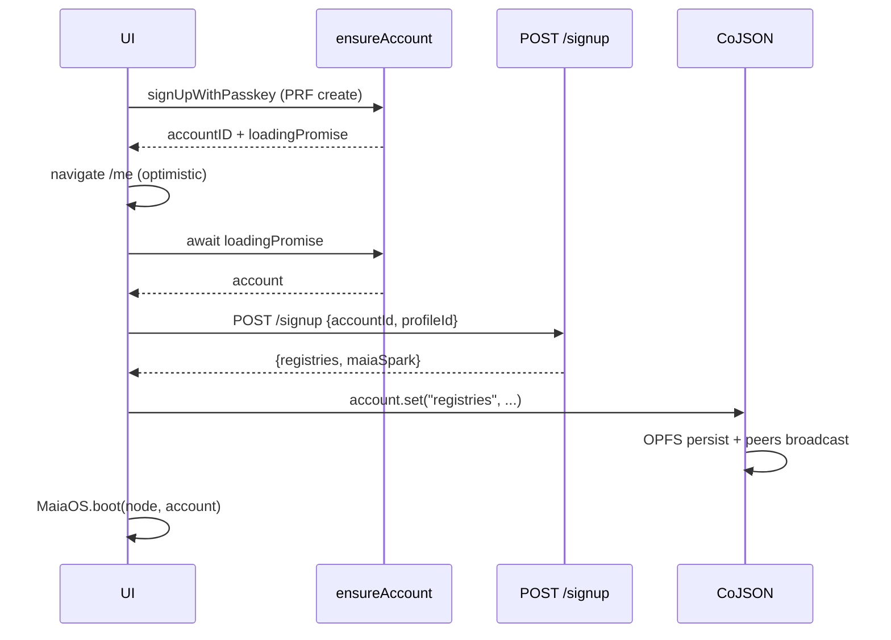
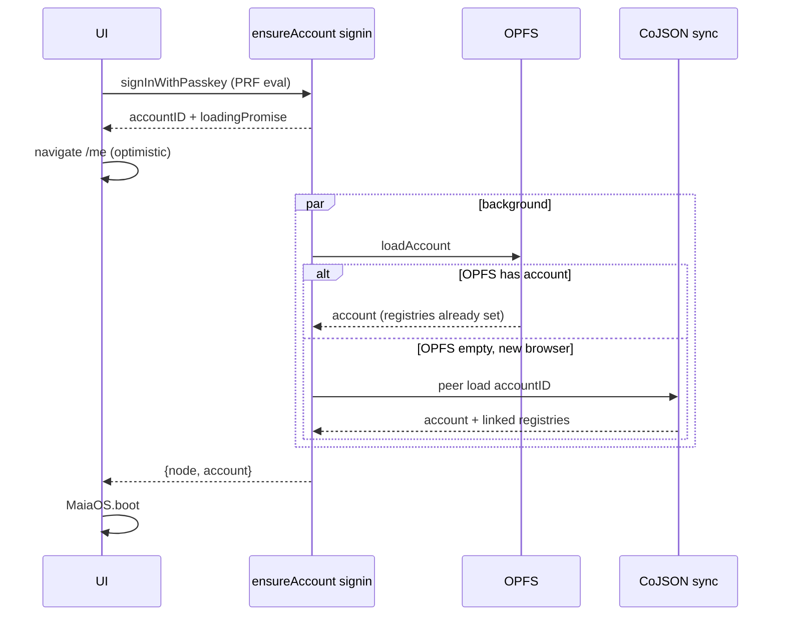

## 0. Your three explicit states (source of truth)


| State          | Trigger                              | Network                                               | UI latency                                                         | Result on account CoValue                                               |
| -------------- | ------------------------------------ | ----------------------------------------------------- | ------------------------------------------------------------------ | ----------------------------------------------------------------------- |
| **(a) Signup** | first passkey create                 | exactly one `POST /signup`                            | create passkey -> UI on `/me` immediately; anchor runs in parallel | `account.profile` + `account.registries` set                            |
| **(b) Signin** | returning passkey                    | zero REST; OPFS-first then CoJSON sync if new browser | instant after biometric                                            | no writes (load only)                                                   |
| **(c) Invite** | guardian approves in Capabilities UI | zero new REST; uses existing capability/grant path    | non-blocking, runs after signin                                    | `registries.humans[accountId]` set; `/sync/write` + `/llm/chat` granted |


These three states each own **one** primitive and **one** code path. No shared plumbing between them, no accidental re-entry.

## 1. First-principles audit against the original plan

Against [.cursor/rules/first-principles.mdc](.cursor/rules/first-principles.mdc) (DRY, KISS, strip indirections, ~20% compaction):

- **S1 (storage-first signin)**: kept. Signin never awaits peers before OPFS.
- **S2 (idempotent register)**: superseded. `POST /register type:'human'` is **deleted**. Signin never calls any register endpoint.
- **S3 (bake registries coid as env var)**: rejected. Replaced by one `POST /signup` during signup only — writes onto the account CoValue, which propagates via CoJSON to every future device. No env, no well-known, no discovery cost after signup.
- **S4 (symmetric signup)**: kept. Signup and signin both return `{ accountID, agentSecret, loadingPromise }` and render the UI optimistically.
- **S5 (remove dead `Promise.race`)**: kept.
- **S6 (explicit sync states)**: kept, sharpened. `writeEnabled: boolean` replaced by `{ connected, local, member }`.

Complexity debts removed beyond the original plan:

1. Five signup/signin wrappers in [libs/maia-self/src/self.js](libs/maia-self/src/self.js) collapse into **one** primitive + two tiny identity helpers (PRF / env-secret).
2. `applySyncRegistriesToAccount` + `linkAccountToRegistries` (two names, same work) merge into **one** `anchorRegistriesOnSignup` called from exactly one place.
3. The `type:'human'` branch in [services/sync/src/index.js](services/sync/src/index.js) (~~674–750) is deleted. `grantMemberCapabilities` in [services/app/main.js](services/app/main.js) (~~1395) becomes the single place a human enters `registries.humans` — capability grant + registry upsert happen atomically in the guardian flow.
4. `HAS_ACCOUNT_KEY` localStorage flag deleted — OPFS is the truth.

## 2. Unified primitive: `ensureAccount`

`libs/maia-self/src/ensure-account.js` — used by humans (PRF identity) and avens (env-secret identity) identically.

```js
export async function ensureAccount({
  identity,      // { agentSecret, accountID? }
  storage,       // from getStorage()
  peers,         // from setupSyncPeers()
  name,
  migration = ensureProfileForNewAccount,
  mode,          // 'signup' | 'signin' | 'bootstrap'
}) {
  const { agentSecret } = identity
  const crypto = await WasmCrypto.create()
  const accountID =
    identity.accountID ??
    idforHeader(accountHeaderForInitialAgentSecret(agentSecret, crypto), crypto)

  const loadingPromise = (async () => {
    try {
      return await loadAccount({ accountID, agentSecret, peers, storage, migration })
    } catch (err) {
      if (!err?.isAccountNotFound) throw err
      if (mode === 'signin') throw err   // signin never creates
      return createAccountWithSecret({ agentSecret, name, peers, storage, migration })
    }
  })()

  return { accountID, agentSecret, loadingPromise }
}
```

Key invariant: **signin cannot create**. If OPFS is empty *and* peers don't have the account, we throw — the UI routes to signup. This is the structural fix for the bug where a fresh browser with a wrong passkey silently created a phantom account.

Callers become tiny:

- `signUpWithPasskey({ name })` -> PRF create -> `ensureAccount({ mode: 'signup', ... })` -> returns `{ accountID, loadingPromise }` -> caller `await loadingPromise` -> `anchorRegistriesOnSignup(account, ...)`.
- `signInWithPasskey()` -> PRF eval -> `ensureAccount({ mode: 'signin', ... })` -> returns `{ accountID, loadingPromise }`. Done.
- Sync server startup + test-aven -> `ensureAccount({ mode: 'bootstrap', identity: { accountID, agentSecret }, ... })`. Server awaits `loadingPromise` (no UI to unblock).

`createAgentAccount` / `loadAgentAccount` / `loadOrCreateAgentAccount` are **deleted**.

## 3. State (a) signup — one POST /signup roundtrip

### Server: `POST /signup`

Rename `GET /syncRegistry` -> `POST /signup` in [services/sync/src/index.js](services/sync/src/index.js) (handler ~594, route ~1133):

```js
async function handleSignup(worker, body) {
  const { accountId, profileId } = body || {}
  if (!accountId?.startsWith('co_z')) return err('accountId required', 400)
  if (!profileId?.startsWith('co_z')) return err('profileId required', 400)

  const registriesId = getRegistriesId(worker.account)
  const sparksId = await getCoIdByPath(worker.peer, registriesId, ['sparks'])
  const maiaSparkId = sparksId
    ? (await loadCoMap(worker.peer, sparksId))?.get(SYSTEM_SPARK_REGISTRY_KEY)
    : null

  return jsonResponse({ registries: registriesId, '°maia': maiaSparkId ?? null })
}
```

- Rate-limited (30/min/IP, as today).
- Idempotent: same input -> same output, no server-side writes on repeat.
- Does **not** write to `registries.humans` (that's state (c)).
- Does **not** grant capabilities.

### Client: `anchorRegistriesOnSignup`

New helper in [libs/maia-peer/src/coID.js](libs/maia-peer/src/coID.js):

```js
export async function anchorRegistriesOnSignup(account, { syncBaseUrl }) {
  if (account.get('registries')?.startsWith('co_z')) return
  const res = await fetch(`${syncBaseUrl}/signup`, {
    method: 'POST',
    headers: { 'Content-Type': 'application/json' },
    body: JSON.stringify({ accountId: account.id, profileId: account.get('profile') }),
  })
  if (!res.ok) throw new Error(`/signup failed: HTTP ${res.status}`)
  const { registries } = await res.json()
  if (!registries?.startsWith('co_z')) throw new Error('/signup missing registries')
  account.set('registries', registries)
}
```

Called exactly once, in the signup UI path, AFTER `ensureAccount` resolves and BEFORE `MaiaOS.boot`. The `account.set('registries', ...)` write goes through CoJSON, which persists to OPFS and broadcasts to peers — every future device receives it via normal sync. No future `/signup` call is ever made.




## 4. State (b) signin — zero REST




Because `account.registries` was anchored during signup, it is **part of the account CoValue**. A new browser receiving the account from peers automatically receives `registries` along with it (CoJSON loads linked CoValues on access). No REST, no `.well-known`, no discovery.

Edge case — wrong passkey / never-signed-up:

- OPFS miss + peer 404 -> `loadAccount` throws `isAccountNotFound`.
- `ensureAccount({ mode: 'signin' })` does NOT fall through to create.
- UI shows "Account not found — did you mean to sign up?".

## 5. State (c) invite — capability grant + registry upsert, one place

Today these are two flows:

- `registries.humans[accountId]` is written by `handleRegister` (POST from client).
- `/sync/write` capability is granted by `grantMemberCapabilities` (guardian UI at [services/app/main.js](services/app/main.js) ~1395).

Unify them: make `grantMemberCapabilities` the single place a human becomes "a member". When a guardian approves a member, the same operation:

1. Creates the Human CoMap (`account` + `profile` fields, guardian-extended group, `everyone` reader).
2. Upserts `registries.humans` with dual keys (`username` + `accountId`).
3. Grants `/sync/write` + `/llm/chat` capabilities.

Refactor: extract the human-creation logic from `handleRegister` into a helper (e.g. `createHumanInRegistry(worker, { accountId, profileId, username })`) reusable by:

- `grantMemberCapabilities` (via the client's authenticated sync session — no new REST).
- The internal admin tool (if still needed server-side).

Then delete the `type:'human'` branch in `handleRegister`. Aven and spark branches stay.

Invite schema (design now, enforce later):

- New `libs/maia-universe/src/sparks/maia/factories/invite.factory.maia`:
  ```json
  { "sub": "co_z...", "iss": "co_z<guardian>", "exp": 1234, "uses": 1, "nbf": 0 }
  ```
- New `libs/maia-db/src/cojson/helpers/invite-validate.js` -> `validateInvite(peer, inviteCoId, { sub })`.
- Client helper `acceptInvite(maia, inviteCoId)` presents an invite to the guardian observer for auto-grant (future paywall-gated flow). Not wired today; the paywall is a single `if (MAIA_INVITE_REQUIRED)` check added later.

Default stays permissive: guardian approves manually, no invite required.

## 6. Three-state sync indicator

In [libs/maia-peer/src/sync-peers.js](libs/maia-peer/src/sync-peers.js) replace:

```js
// before
{ connected, syncing, error, status, writeEnabled }
```

with:

```js
// after
{ connected, local, member }
//   connected: boolean              — WS up
//   local:     'empty' | 'ready'    — OPFS has account
//   member:    'unknown' | 'pending' | 'approved'
//                                    — registries.humans[me] resolved
```

`member` subscribes to the `registries.humans` CoMap once `account.registries` is set (existing CoValue `subscribe` mechanism). `pending` until a guardian approves via state (c); `approved` when `registries.humans[accountId]` resolves to a co-id.

UI in [services/app/main.js](services/app/main.js) reads `member === 'approved'` to decide whether to show the "Read-only until approved" banner. `writeEnabled`, `HAS_ACCOUNT_KEY`, `markAccountExists` are deleted — those were proxy states for things we can now observe directly.

## 7. Dead code removal

- [libs/maia-peer/src/coID.js](libs/maia-peer/src/coID.js) lines 139–186: `INITIAL_LOAD_TIMEOUT` + `Promise.race` — always awaits `loadPromise` anyway. Replace with direct `await`.
- [libs/maia-peer/src/coID.js](libs/maia-peer/src/coID.js) lines 203–233: background fire-and-forget preload of `registries -> sparks -> °maia -> os`. CoJSON auto-loads linked values on access; this runs on every load as a premature optimization. Delete.
- [libs/maia-self/src/index.js](libs/maia-self/src/index.js): stale comment saying `subscribeSyncState` moved to `@MaiaOS/db` — it's in `@MaiaOS/peer`. Fix.
- [services/sync/README.md](services/sync/README.md) lines 50–57: remove the false claim that `/register` grants `/sync/write`.

## 8. TDD coverage (bun tests, colocated)

Per [.cursor/rules/first-principles.mdc](.cursor/rules/first-principles.mdc) point 4, colocated `/tests`:

- `libs/maia-self/tests/ensure-account.test.js` — signup creates + migrates; signin loads and throws on not-found; PRF path and env-secret path produce identical account scaffolds; signin-no-create invariant.
- `libs/maia-peer/tests/anchor-registries.test.js` — short-circuits when already set; POSTs once and only once; throws on HTTP error.
- `services/sync/tests/signup-endpoint.test.js` — idempotent (same input -> same coids, no DB writes on repeat); 400 on missing fields; 200 on first + repeat.
- `services/sync/tests/grant-member-upserts-registry.test.js` — guardian flow writes `registries.humans` + grants `/sync/write` in one transaction; idempotent; verifies `handleRegister type:'human'` is removed.

## 9. File-by-file diff summary

- [libs/maia-self/src/self.js](libs/maia-self/src/self.js) — ~460 lines -> ~120 lines. Keep `signUpWithPasskey`, `signInWithPasskey`, `generateAgentCredentials`. Delete `createAgentAccount` / `loadAgentAccount` / `loadOrCreateAgentAccount`.
- `libs/maia-self/src/ensure-account.js` — new, ~50 lines.
- [libs/maia-peer/src/coID.js](libs/maia-peer/src/coID.js) — add `anchorRegistriesOnSignup`; strip dead `Promise.race` and background preload. ~240 -> ~150 lines.
- [libs/maia-peer/src/sync-peers.js](libs/maia-peer/src/sync-peers.js) — replace `writeEnabled` with `{ local, member }` subscriptions.
- [services/app/main.js](services/app/main.js) — delete `applySyncRegistriesToAccount`, `linkAccountToRegistries`, `registerHuman`, `autoRegisterHuman`, `HAS_ACCOUNT_KEY`, `markAccountExists`. Signup path: `ensureAccount` + `anchorRegistriesOnSignup`. Signin path: `ensureAccount` only. `grantMemberCapabilities` extended to upsert `registries.humans`. ~200 lines removed.
- [services/sync/src/index.js](services/sync/src/index.js) — rename `GET /syncRegistry` -> `POST /signup`; extract `createHumanInRegistry` helper; delete `type:'human'` branch from `handleRegister`.
- [services/sync/README.md](services/sync/README.md) — rewrite the auth section around the three states.
- `libs/maia-universe/src/sparks/maia/factories/invite.factory.maia` — new schema.
- `libs/maia-db/src/cojson/helpers/invite-validate.js` — new helper.

Expected net delta: **~-450 lines** (well above the ~20% compaction target).

## 10. User-facing outcome

- **Signup** (new user): passkey create + UI on `/me` immediately; one `POST /signup` completes in background; `account.registries` anchored; user is "read-only" until a guardian invites them.
- **Signin** (returning, same browser): passkey + PRF + OPFS -> UI renders sub-second. Zero REST.
- **Signin** (returning, new browser): passkey + PRF + CoJSON sync of account CoValue -> UI renders as soon as account + registries sync down. Zero REST.
- **Invite**: guardian approves in Capabilities UI -> human appears in `registries.humans` + gets `/sync/write` in one transaction. Paywall later = gate this action behind invite validation.
- **Offline signup**: blocked at the `/signup` POST step with a clear "connecting..." indicator; retries silently; signin works fully offline once signed up.
- **Agents / avens**: same `ensureAccount` primitive with `mode: 'bootstrap'`; no `/signup` roundtrip (server seeds `registries` at genesis).

