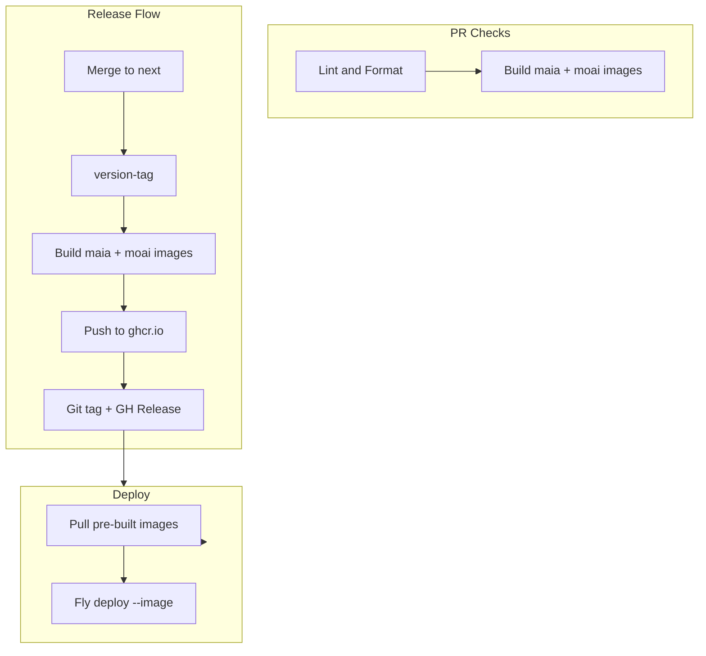

# Maia-Bundles: Symmetric Client/Server Kernels

## Vision

Package `@MaiaOS/maia-bundles` – three build outputs, all centralized in one folder:


| Output          | Target           | Used by      | Purpose                                                             |
| --------------- | ---------------- | ------------ | ------------------------------------------------------------------- |
| **maia-client** | Browser (client) | maia service | CoJSON, sync, human auth (IndexedDB)                                |
| **moai-server** | Node (server)    | moai service | CoJSON, sync server, agent auth (PGlite/Postgres bundled)           |
| **vibes**       | Both             | maia, moai   | Vibe registries, configs, components. Imported selectively by both. |


All three are outputs of `@MaiaOS/maia-bundles`. Vibes source stays in `@MaiaOS/vibes`; the bundle build happens in maia-bundles. Same principles, same flows.

---

## Core Principles (Applied to Both)

1. **Single JS bundle** – One main entry, one built artifact per target
2. **Production-only deps** – No devDeps in runtime; minimal external deps
3. **Same build pipeline** – Shared scripts, shared conventions
4. **Same Docker pattern** – Build bundle → slim runtime image
5. **Same CI flow** – Build → tag → release → deploy pre-built images

---

## Current State vs Target

### Current

- `@MaiaOS/core` – source + browser bundle (`maia-client.es.js`)
- Moai – workspace deps (kernel, db, operations), full monorepo in Docker
- Mixed concepts: "kernel" = package name + client bundle; no server bundle

### Target

Package `@MaiaOS/maia-bundles` with `client/`, `server/`, and `vibes/` folders. All three bundles centralized in one package:

```
libs/maia-bundles/
├── client/                   # Client entry + vite config
│   ├── index.js
│   └── vite.config.js
├── server/                   # Server entry + vite config
│   ├── index.js
│   └── vite.config.js
├── vibes/                    # Vibes bundle – imports from @MaiaOS/vibes, outputs to dist
│   ├── index.js
│   └── vite.config.js
├── dist/
│   ├── maia-client.es.js
│   ├── moai-server.es.js
│   └── vibes.es.js           # Vibes output
└── package.json
```

**Vibes source** – `@MaiaOS/vibes` keeps the .maia configs, registries, components. The **bundle build** runs in maia-bundles/vibes/, which imports from vibes and produces `dist/vibes.es.js`. Single maia-bundles folder for all three outputs.

---

## Unified Build Pipeline

### Build Script (shared)

```bash
bun run bundles:build   # Builds maia-client + moai-server + vibes
```

All three use the same tooling and structure:

- Entry file → bundle → `output/maia-client.es.js`, `output/moai-server.es.js`, `output/vibes.es.js`
- **PGlite** – only `output/pglite.wasm` vendored; adapter loads it and passes `wasmModule` to PGlite.create() (no path/fs resolution issues)
- **Vibes** – bundle build in maia-distros/vibes/, imports from `@MaiaOS/vibes` source, output in maia-distros/output/
- Build configs kept as close as possible – same patterns, same flow for all three

### What Each Output Contains

**maia-client / moai-server** – shared: CoJSON, DB, operations, script, tools, sync protocol.

**Only differences** – storage adapters and self/account mode:


| maia-client (client)      | moai-server (server)                         |
| ------------------------- | -------------------------------------------- |
| IndexedDB storage adapter | PGlite + Postgres storage adapters (bundled) |
| Human mode / passkey self | Agent mode / loadOrCreateAgentAccount        |


**vibes** – vibe registries, .maia configs, components. Imported selectively by maia (client) and optionally by moai (server).

---

## Standardized Docker Pattern

Same pattern for both services:

```dockerfile
# Stage 1: Builder
FROM oven/bun:1 AS builder
WORKDIR /app
COPY package.json bun.lock* ./
COPY libs/ ./libs/
COPY services/<service>/ ./services/<service>/
ENV HUSKY=0
RUN bun install --frozen-lockfile
RUN bun run bundles:build
# Service-specific build (e.g. vite for maia, or none for moai if bundled)

# Stage 2: Runtime (slim)
FROM oven/bun:1-slim
WORKDIR /app
# Copy only: built bundle(s) + server script + minimal package.json
COPY --from=builder /app/services/<service>/dist/ ./
COPY --from=builder /app/services/<service>/server.js ./   # or moai entry
COPY --from=builder /app/services/<service>/package.prod.json ./package.json
RUN bun install --production
CMD ["bun", "run", "start"]
```

Differences only in what gets copied; the flow is identical.

---

## Deployment Pipeline (Synchronized)




- **CI (PR)**: Lint + build both images (validation only)
- **Release**: Build images → push to registry → create release
- **Deploy**: `fly deploy --image ghcr.io/.../maia:VERSION` (no source build)

---

## File Structure (Proposed)

```
libs/
├── maia-bundles/                  # @MaiaOS/maia-bundles – all 3 bundles centralized
│   ├── client/
│   │   ├── index.js
│   │   └── vite.config.js
│   ├── server/
│   │   ├── index.js
│   │   └── vite.config.js
│   ├── vibes/                     # Vibes bundle – imports from @MaiaOS/vibes
│   │   ├── index.js
│   │   └── vite.config.js
│   ├── dist/
│   │   ├── maia-client.es.js
│   │   ├── moai-server.es.js
│   │   └── vibes.es.js
│   └── package.json
│
├── maia-vibes/                    # Source only – .maia configs, registries, components
│   ├── src/
│   └── package.json
│
services/
├── maia/
│   ├── package.json               # deps: @MaiaOS/maia-bundles (maia-client + vibes)
│   └── ...
│
└── moai/
    ├── package.json               # deps: @MaiaOS/maia-bundles (moai-server, vibes optional)
    └── ...
```

---

## Migration Path

1. **Create maia-bundles package** – add `client/`, `server/`, `vibes/` folders
2. **Create server build** – server entry + vite config, bundle pg/pglite, output `moai-server.es.js`
3. **Relocate client build** – move kernel browser build to `client/`, output `maia-client.es.js`
4. **Move vibes bundle into maia-bundles** – vibes/ folder imports from `@MaiaOS/vibes`, outputs `vibes.es.js`
5. **Unify build** – `bun run bundles:build` outputs all three to `dist/`
6. **Update maia** – import maia-client + vibes from `@MaiaOS/maia-bundles`
7. **Update moai** – import moai-server (and optionally vibes) from `@MaiaOS/maia-bundles`
8. **Align Docker + CI** – standardized pipeline

---

## Symmetric Flow Diagram

```mermaid
flowchart TB
    subgraph Bundles [@MaiaOS/maia-bundles - all 3 centralized]
        MClient[maia-client]
        MServer[moai-server]
        VibesOut[vibes]
    end

    subgraph VibesSource [@MaiaOS/vibes - source only]
        VibesSrc[.maia configs, registries]
    end

    subgraph Services
        MaiaSvc[maia service]
        MoaiSvc[moai service]
    end

    VibesSrc --> VibesOut
    MClient --> MaiaSvc
    MServer --> MoaiSvc
    VibesOut --> MaiaSvc
    VibesOut -.->|optional| MoaiSvc
```


All three bundle outputs live in maia-bundles/dist/. Vibes source stays in maia-vibes; the bundle build runs in maia-bundles/vibes/.

---

## Technical Alignment: Bundles as Close as Possible

The two bundles share the same codebase and build setup. They differ only in:

1. **Storage adapters**
  - maia-client: IndexedDB (browser)
  - moai-server: PGlite + Postgres (Node), bundled as internals
2. **Self / account mode**
  - maia-client: Human mode (passkey auth, signIn/signUp)
  - moai-server: Agent mode (loadOrCreateAgentAccount)

Everything else – CoJSON, DB, operations, script, tools, sync protocol – is identical. Same vite config pattern, same entry structure, same build flow.

---

## Decisions (Closed)


| Item               | Decision                                                                |
| ------------------ | ----------------------------------------------------------------------- |
| Package name       | `@MaiaOS/maia-bundles`                                                  |
| Folder structure   | `client/`, `server/`, `vibes/` at package root                          |
| Output filenames   | `maia-client.es.js`, `moai-server.es.js`, `vibes.es.js`                 |
| pg, pglite         | Bundled as internals in moai-server (not externalized)                  |
| Vibes              | Bundle build in maia-bundles/vibes/, imports from @MaiaOS/vibes source  |
| Bundle differences | maia-client vs moai-server: only storage adapters + human vs agent self |


