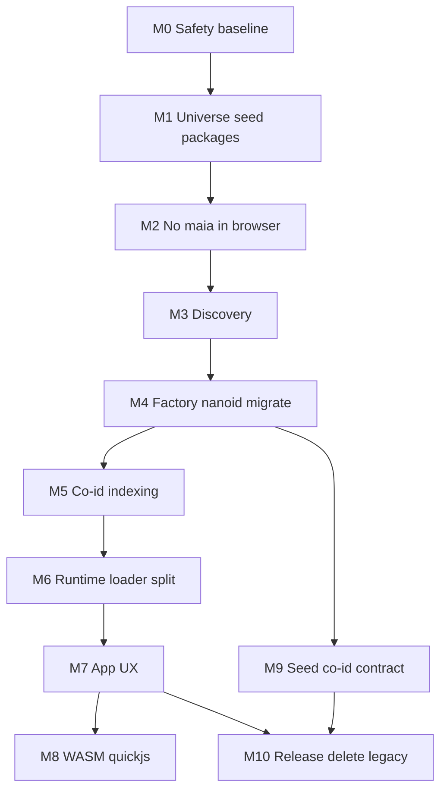

# Maia mega-refactor — milestone execution plan (greenfield rebuild)

This plan follows **Design Thinking** and **first-principles**: one cojson data plane, one co-id identity story, delete indirection that only exists for historical package names.

---

## Primary source

- **Cursor transcript (JSONL):**  
`~/.cursor/projects/Users-samuelandert-Documents-Development-MaiaOS/agent-transcripts/081dfade-6ebd-4ac8-a89e-d1fcff03b375/081dfade-6ebd-4ac8-a89e-d1fcff03b375.jsonl`  
(~947 lines; user + assistant + `tool_use`; assistant prose may be `[REDACTED]`.)
- **Export for grep:** `[scripts/export-cursor-session-to-recovery.mjs](../../scripts/export-cursor-session-to-recovery.mjs)` → `bun scripts/export-cursor-session-to-recovery.mjs` → `recovery/SESSION-*-part-*.md`

---

## Rebuild premise — **skip old “Stage 0 audit” for recovered packages**

**You do not have** restored `libs/maia-universe`, `libs/maia-seed`, or `libs/maia-runtime` from the lost refactor branch. **Do not** block on auditing those paths.

**Current IDE baseline (this repo today):**


| Area                                          | Location                                                                                                                                                             |
| --------------------------------------------- | -------------------------------------------------------------------------------------------------------------------------------------------------------------------- |
| Actor + `.maia` sources (OS, services, views) | `[libs/maia-actors/src/maia/](../../libs/maia-actors/src/maia/)` → **end state:** `libs/maia-universe/src/maia/actors/...`                                           |
| Vibes scaffolding                             | `[libs/maia-vibes/](../../libs/maia-vibes/)` → **rename in place** to `libs/maia-universe/` (`@MaiaOS/universe`), then merge actors + factories **into** `src/maia/` |
| Genesis / seed blob                           | `[libs/maia-actors/src/maia/seed-config.js](../../libs/maia-actors/src/maia/seed-config.js)` → `**@MaiaOS/seed`**                                                    |
| Sync imports seed                             | `[services/sync/src/index.js](../../services/sync/src/index.js)` → `getSeedConfig` from `@MaiaOS/actors/seed-config` **today**                                       |
| Validation, plugins, co-types, transformers   | `[libs/maia-factories/src/](../../libs/maia-factories/src/)` → `**@MaiaOS/runtime`** (JS) + `src/maia/factories` (maia) under universe                               |
| DB, indexing, resolver                        | `[libs/maia-db/src/](../../libs/maia-db/src/)`                                                                                                                       |
| Loader composition                            | `[libs/maia-loader/](../../libs/maia-loader/)`                                                                                                                       |
| App shell, dashboard, db viewer               | `[services/app/](../../services/app/)`                                                                                                                               |
| Path aliases                                  | `[jsconfig.json](../../jsconfig.json)` — add `@MaiaOS/universe` / `@MaiaOS/seed` / `@MaiaOS/runtime`; **remove** actors/factories/vibes when deleted                 |


**Rebuild intent:** One `**@MaiaOS/universe`** package with a **canonical** `src/maia/...` tree; **seed** + **runtime** for everything that is not static maia sources; then **remove** `@MaiaOS/actors`, `@MaiaOS/factories`, and `@MaiaOS/vibes` entirely (no long-lived shim packages).

---

## Canonical layout — `@MaiaOS/universe` (`libs/maia-universe/`)

**All maia sources live under `src/maia/`**, grouped by role (aligned with your intent):

```
libs/maia-universe/src/maia/
  actors/           # OS actors, services, shared actor glue — e.g. actors/os/..., actors/services/...
  factories/        # *.factory.maia, meta factories, factory barrels — was spread under maia-factories
  vibes/            # per-vibe trees (views, process, interface, …) — was maia-vibes
  views/            # optional: keep or fold under actors/vibes per feature; avoid duplicate trees
  data/             # centralized *.data.maia — see below (no sparks/)
```

- `**src/maia/actors/os**` (and sibling actor folders) = **actor** `.maia` + `function.js` for OS / db / messages / AI, etc.
- `**src/maia/factories`** = factory **definitions** and indexes (not validation **engine** JS — that goes to `**@MaiaOS/runtime`**).
- `**src/maia/vibes**` = vibe-scoped maia (what lived in `**maia-vibes**`).
- `**sparks/**` — **not used** in this layout (no peer `src/sparks/<ns>/` beside `maia`).

### Centralized `***.data.maia`** (DRY seeding data)

Pull **all** seeding-oriented **data** artefacts into **one** convention under `**src/maia/data/`**, using a **single filename pattern** so seed/registry logic stays generic:


| Pattern               | Purpose                                                                                                           |
| --------------------- | ----------------------------------------------------------------------------------------------------------------- |
| `**todos.data.maia`** | Default / template data for todos vibe                                                                            |
| `**notes.data.maia**` | Notes                                                                                                             |
| `**icons.data.maia**` | Icons (and similar static lists)                                                                                  |
| `***.data.maia**`     | Same idea for any other vibe/feature — **one file per concern**, not scattered duplicates inside each vibe folder |


**First principles:** seeding references `**data/*.data.maia`** (or generated keys from them) instead of copy-pasting inline blobs across `vibes/todos`, `vibes/notes`, etc. `**@MaiaOS/seed**` / `getSeedConfig` should **import** this folder in a **DRY** way (e.g. one table mapping vibe key → `data/<name>.data.maia`). Refactor existing scattered data into this tree as you merge packages.

Barrels: `src/maia/actors/index.js`, `src/maia/factories/index.js`, `src/maia/vibes/index.js` (or generated), optional `src/maia/data/index.js` that re-exports or lists `*.data.maia`, plus `actor-service-refs.js`, `registry.js` at the package root as needed.

---

## Consolidation strategy — **rename `maia-vibes` → `maia-universe`** (reuse scaffolding)

**Do not** create an empty `maia-universe` folder from scratch if you can avoid it.


| Step | Action                                                                                                                                                                                         |
| ---- | ---------------------------------------------------------------------------------------------------------------------------------------------------------------------------------------------- |
| 1    | **Rename** package directory `libs/maia-vibes` → `libs/maia-universe` and set `name` to `@MaiaOS/universe` in `package.json` (reuse scripts, `files`, build hooks from vibes).                 |
| 2    | **Merge** `[libs/maia-actors/src/maia/](../../libs/maia-actors/src/maia/)` into `libs/maia-universe/src/maia/actors/` (resolve any path overlap with old vibes content).                       |
| 3    | **Merge** factory **sources** from `[libs/maia-factories](../../libs/maia-factories)` into `src/maia/factories/` — **rename** `*.factory.json` → `*.factory.maia` (and move **validation/plugins/JS** to `@MaiaOS/runtime`, not under `maia/`). |
| 4    | **Merge** remaining vibe-only trees from the old vibes layout into `src/maia/vibes/`.                                                                                                          |
| 5    | Update **every** import: `@MaiaOS/actors` / `@MaiaOS/vibes` / `@MaiaOS/factories` → `@MaiaOS/universe` (subpath exports) or `@MaiaOS/runtime` / `@MaiaOS/seed` as appropriate.                 |
| 6    | **`bun install`**, `check:ci`, full build — then **delete** the old packages (see below).                                                                                                                                       |


---

## Target packages (after split — **no** permanent `maia-factories` / `maia-actors` / `maia-vibes`)

**At a glance — where old `libs/maia-factories` goes:**

| Destination | What it is |
| ----------- | ---------- |
| **`@MaiaOS/universe`** | **Files on disk:** factory definitions as **`*.factory.maia`** (renamed from today’s **`*.factory.json`** — same content/role, one extension convention). **No** validation `.js` in this tree. |
| **`@MaiaOS/runtime`** | **Code that runs in app / loader:** validation engine + helpers, plugins, resolvers, patterns, nanoid/co-id **math**, `getFactory` backed by **in-memory schema objects** (not `.maia` files), view validation, operation/icon/vibe helpers. |
| **`@MaiaOS/seed`** | **Only the seed pipeline:** `annotate-maia`, `factory-transformer`, `seeding-utils`, `getSeedConfig` (from old actors); **depends** on `@MaiaOS/runtime` for shared id math. **Does not** replace the whole factories package. |

**Not a rename:** `libs/maia-factories` is **deleted** after migration. **`maia-seed`** is a **new, smaller** package — **not** “`maia-factories` renamed.”

| Package | Responsibility | Sources |
| ------- | -------------- | ------- |
| `@MaiaOS/universe` | Only `src/maia/**` trees: `actors/`, `factories/`, `vibes/`, `data/` (`*.data.maia`, `*.factory.maia`) — no `sparks/` | Renamed maia-vibes + merged maia-actors + factory defs from old `maia-factories` **renamed** from `*.factory.json` |
| `@MaiaOS/seed` | **Seed-time only:** `getSeedConfig`, annotate, **factory-transformer**, **seeding-utils**; imports universe `.maia` via relative paths | `seed-config.js` (from actors) + **only** seed pipeline JS split out of `maia-factories` |
| `@MaiaOS/runtime` | **Runtime JS:** validation, plugins, resolvers, nanoid/co-id **math**, view validation — **no** raw `.maia` in browser | **Most** `.js` modules from old [`libs/maia-factories/src/`](../../libs/maia-factories/src/) (see matrix below) |
| `@MaiaOS/actors` / `@MaiaOS/vibes` / `@MaiaOS/factories` | Removed after migration | Delete dirs + workspace entries |

**End state:** Three legacy workspace packages gone; a single universe tree under `src/maia/actors|factories|vibes|data|...`, plus **`seed`** + **`runtime`** for non-maia-file logic.

### Important: `maia-factories` is **not** renamed to `maia-seed`

The old **`libs/maia-factories`** package does **three different jobs** today. This plan **splits** it and **deletes** the package:

| Misconception | Reality |
| ------------- | ------- |
| “Rename `maia-factories` → `maia-seed`” | **`@MaiaOS/seed`** only gets **seed-time** scripts (`factory-transformer`, `seeding-utils`, `annotate-maia`, plus `getSeedConfig`). It is **not** the whole factories package. |
| “All factories code goes to seed” | **No.** **Static** factory **definitions** live under **`@MaiaOS/universe`** as **`*.factory.maia`** (migrated from **`*.factory.json`**). **Validation / plugins / resolvers** go to **`@MaiaOS/runtime`**. |
| “Runtime and seed both own nanoid” | **One canonical implementation:** **`nanoid.js`** + **`co-id-generator.js`** live in **`@MaiaOS/runtime`** (same derivation as actors/vibes — see Principles). **`@MaiaOS/seed`** **imports** from **`@MaiaOS/runtime`** for seed-time id work (avoid duplicating math). |

### Factory config filenames — **`*.factory.json` → `*.factory.maia`**

Today [`libs/maia-factories`](../../libs/maia-factories) stores schemas as **`*.factory.json`** (suffix `factory.json`, e.g. `os/actor.factory.json`, `data/todos.factory.json` — not a separate `.factories.json` type). **End state in universe:** those files are **standardized** to **`*.factory.maia`** with the **same basename** (e.g. `actor.factory.maia`, `todos.factory.maia`, `meta.factory.maia`) under `src/maia/factories/os/` and `src/maia/factories/data/`. **Drop** the `.json` pattern so factory configs align with **`*.data.maia`**.

**Critical:** **`@MaiaOS/runtime` does not read `*.factory.maia`.** Runtime exposes **`getFactory`** and validation against **plain objects**. Those objects are **materialized** by **build** (bundler/codegen reads `*.factory.maia` from universe and emits a **JS module** of objects) and/or by **data already in cojson** after **seed** — same rule as M2: **no** `.maia` file path in the **browser runtime** graph. **Do not** leave duplicate `*.factory.json` beside `*.factory.maia` after migration.

### Split matrix — from [`libs/maia-factories/src/`](../../libs/maia-factories/src/) (explicit)

| Current asset (approx.) | **Goes to `@MaiaOS/universe`** | **Goes to `@MaiaOS/runtime`** | **Goes to `@MaiaOS/seed`** |
| ------------------------- | -------------------------------- | ------------------------------ | -------------------------- |
| `os/**/*.factory.json`, `data/**/*.factory.json` | **Yes** — as **`os/**/*.factory.maia`**, **`data/**/*.factory.maia`** under `src/maia/factories/` (**rename** from `*.factory.json`; see subsection above) | No | No |
| `co-types.defs.json` | Optional copy next to maia **or** single source in runtime if only JS consumers | **Yes** (package asset consumed by validation) — pick **one** home; avoid two diverging copies | No |
| `validation.engine.js`, `validation.helper.js` | No | **Yes** | No |
| `view-validator.js` | No | **Yes** | No |
| `plugins/cojson.plugin.js`, `cotext.plugin.js`, `cobinary.plugin.js` | No | **Yes** | No |
| `expression-resolver.js`, `payload-resolver.js`, `patterns.js` | No | **Yes** | No |
| `factory-ref-resolver.js`, `executable-key-from-maia-path.js` | No | **Yes** | No |
| `operation-result.js`, `icon-instance-ref.js`, `vibe-keys.js` | No | **Yes** | No |
| `nanoid.js`, `co-id-generator.js` | No | **Yes** (canonical id derivation; seed **imports** runtime) | Uses via dependency |
| `factory-transformer.js` | No | No (unless you later share tiny pure helpers — default **seed-only**) | **Yes** |
| `seeding-utils.js` | No | No | **Yes** |
| `annotate-maia.js` | No | No | **Yes** |
| `os/meta.factory.json` (and any other `*.factory.json` not listed above) | **Yes** — under `src/maia/factories/...` | No | No |
| `getFactory`, `getAllFactories`, inlined `FACTORIES { ... }` map in [`index.js`](../../libs/maia-factories/src/index.js) | No | **Yes** — **`@MaiaOS/runtime`** owns the registry **code** and holds **`FACTORIES` as in-memory objects** (not file handles). **Build** inlines or codegen supplies those objects from **`*.factory.maia`** in universe; **no** `import '…factory.maia'` inside **`@MaiaOS/runtime`** for the **client** bundle. | No |
| `CoIdRegistry` (exported from `co-id-generator.js`) | No | **Yes** (same module as `co-id-generator`) | No — seed code **imports** `@MaiaOS/runtime` when it needs the registry |
| `index.js` (package barrel) | N/A — deleted | New `maia-runtime/src/index.js` — runtime public API + factory registry | New `maia-seed/src/index.js` — seed-only exports (`annotateMaiaConfig`, `transformForSeeding`, …) |
| `tests/*.test.js` | N/A | Move tests for **runtime** modules → `libs/maia-runtime/tests/` | Move seeds/tests **factory-transformer**, **seeding-utils**, **nanoid** seed cases → `libs/maia-seed/tests/` (split by subject; duplicate `nanoid.test.js` only if both packages need it — prefer **one** canonical nanoid test in **runtime**) |

**Barrel split:** Today [`libs/maia-factories/src/index.js`](../../libs/maia-factories/src/index.js) mixes (a) seed exports, (b) runtime validation exports, and (c) **`*.factory.json`** imports that become the **`FACTORIES`** object. After split, **runtime** owns **`getFactory` / validation** and only sees **objects**; **universe** keeps **`*.factory.maia`** for authoring; **build** bridges universe → **object modules** the app loads; **seed** reads maia and writes **co-values**. **Seed** re-exports only seeding entrypoints.

After the split, **`@MaiaOS/loader`** should depend on **`@MaiaOS/runtime`** (and **`@MaiaOS/db`**, etc.), **not** on a monolithic “factories” package. **Sync** depends on **`@MaiaOS/seed`** for `getSeedConfig`, **not** on pulling all of runtime into the server bundle unless required.

**Workspace wiring (every milestone that adds a package):**

- Root `[package.json](../../package.json)` `workspaces`
- Per-package `[package.json](../../package.json)` `name`, `exports`, `dependencies`
- `[jsconfig.json](../../jsconfig.json)` `paths`
- `[libs/maia-loader/package.json](../../libs/maia-loader/package.json)` — single place to re-export **execution boundary** if desired
- `[libs/maia-distros/scripts/build.js](../../libs/maia-distros/scripts/build.js)` / app **entry** — ensure **browser** bundle does not pull seed/universe

**Cycle-breaking (transcript):** If `@MaiaOS/seed` imports `.maia` from universe, prefer **relative** `../../maia-universe/...` from seed package **or** codegen — avoid **seed → universe → seed** workspace cycles.

---

## Transcript anchor table (expanded — second pass)


| Theme                                                                                                                               | Transcript / session notes                                                                                        |
| ----------------------------------------------------------------------------------------------------------------------------------- | ----------------------------------------------------------------------------------------------------------------- |
| Recursive registry / `Bun.Glob`                                                                                                     | ~1–2, ~5, ~44                                                                                                     |
| `universe_seed_consolidation` plan                                                                                                  | ~9, ~11                                                                                                           |
| `src/sparks` namespace beside `maia`                                                                                                | ~54–61 — **superseded:** target layout has **no** `sparks/`; use `**maia/data/*.data.maia`** for DRY data instead |
| Server-only seed / **not** browser bundle                                                                                           | ~64, ~68, ~73, ~200                                                                                               |
| `validation.engine` / Bun **asset URL** for `.maia`                                                                                 | ~205, ~220–223                                                                                                    |
| “Zero maia json in runtime” / inline                                                                                                | ~223, ~228, ~249, ~307                                                                                            |
| Merge plans: `eliminate_.maia_from_browser`, `per-namespace_.maia_discovery`, `dynamic_schema_loading`, `**unified_.maia_cleanup`** | ~263–267, ~308–311                                                                                                |
| `**read.js` `@scope**`, **evaluator `resolvePath`**, **cobinary-previews shadow walk**, **dashboard `renderApp` navigation**        | Session todo list / tool_use (not always in short user blurbs) — **track as M5–M7 file tasks                      |
| Sync **terminal** / dev errors                                                                                                      | ~310                                                                                                              |
| Notes/todos **not seeding**                                                                                                         | ~328, ~341                                                                                                        |
| Known-good commit `413e6e9…`                                                                                                        | ~360                                                                                                              |
| Profile / `**factoryCoIdMap`** / `**UPLOAD_PROFILE_IMAGE**`                                                                         | ~412, ~535, ~826–831                                                                                              |
| Indexing: **title** brittleness → **co-id only**                                                                                    | ~425–455, ~587–588                                                                                                |
| Wrong vibe / **Maia DB** vibe / **no detail**                                                                                       | ~508, ~693, ~741                                                                                                  |
| WASM `**sandboxed-add`** / **quickjs** rename                                                                                       | ~559, ~659                                                                                                        |
| **Seed-time co-ids only**                                                                                                           | ~621–622, ~638                                                                                                    |
| `**hydrateCobinaryPreviews` not defined**                                                                                           | ~808                                                                                                              |
| Engines vs **runtime** merge question + **README** boundaries                                                                       | ~849–855                                                                                                          |
| `**git reset`** / **stash** / Timeline                                                                                              | ~866–909                                                                                                          |
| Mega recap (concepts)                                                                                                               | ~916                                                                                                              |


---

## Principles

- **No `.maia` in the browser or in `@MaiaOS/runtime` as an input** — the SPA and runtime validation **never** `import` or resolve `*.maia`; they use **plain objects** (inlined at build) and **cojson** from sync. **Co-values** are what the app reads; universe `.maia` is **authoring** + **seed** only.
- **No raw `.maia` in the browser** — same as above; cojson is **live** runtime truth for data; schema **objects** are **materialized** (build or peer), not file text in the client.
- **Co-id** is the handle; **titles** are UI.
- **Factories** use the same **nanoid** derivation as **actors** and **vibes** — no separate **`$id`** authority.
- **Seed/migrate** on sync peer (or build), not SPA authority.
- **Seeding data is DRY** — one place: `**src/maia/data/*.data.maia`** (e.g. `todos.data.maia`, `notes.data.maia`, `icons.data.maia`); not duplicated per-vibe blobs.
- **No `sparks/` parallel tree** — not part of the target layout.
- **100% migration** — no permanent dual keys (`[IMPORTANT.mdc](../rules/IMPORTANT.mdc)`).

### Where `.maia` is allowed (explicit)

| Layer | `.maia` on disk / in imports? | What the app actually uses |
| ----- | ------------------------------ | --------------------------- |
| **`@MaiaOS/universe`** | **Yes** — authoring: `*.factory.maia`, `*.data.maia`, actor/vibe `.maia` | N/A (not shipped as source to the client) |
| **`@MaiaOS/seed`** + **sync** | **Yes** — seed reads universe maia and writes **co-values** | Peer state becomes **cojson** |
| **Build** (`services/app`, `maia-distros`) | **Yes** — bundler may **compile** `.maia` → **JS/JSON modules** that export **objects** | Those **objects** are what runtime sees |
| **`@MaiaOS/runtime`** (library used by app) | **No** — **no** `import '…maia'` in the **runtime** package graph for the browser; API is **`validate(…, object)`**, **`getFactory(type)`** backed by **in-memory** schema objects | Objects + cojson only |

---

## Milestone discipline — testable, runnable, mergeable

**Yes, it makes sense:** each milestone should ship a **known-good** state you can **verify** locally and in CI, so you never “stack” untested refactors.

**Rules**

1. **Gate before the next milestone** — do not start **M(n+1)** until **M(n)**’s gate is green (or document a deliberate exception and the debt).
2. **Every milestone has:** (a) **automated** checks, (b) **one** primary **manual smoke** where needed, (c) a short **Definition of Done** checklist in the milestone section.
3. **CI-shaped commands** — prefer the same commands locally and in GitHub Actions (`bun run check:ci`, workspace `test`, scoped `build`).

**Default gate stack (adjust per milestone scope)**

| Step | Command / action | When |
| ---- | ------------------ | ---- |
| Lint + format | `bun run check:ci` | Every milestone |
| Unit tests | `bun test` (or `bun --filter <pkg> test` for touched workspaces) | Every milestone that touches testable libs |
| Build | `bun run build` from root **or** the minimal set listed in that milestone (`services/app`, `services/sync`, `libs/maia-distros` as applicable) | When the milestone changes bundling or packages |
| Smoke | Milestone-specific (see table below) | Server/seed milestones: `bun dev:sync`; browser milestones: load app + console; **M2**: `rg` on `dist/` |

**Milestone → minimum “done” signal (runnable)**

| Ms | Primary runnable proof |
| -- | ------------------------ |
| **M0** | Baseline: `check:ci` green; optional transcript export script run |
| **M1** | `bun dev:sync` seed path completes; `rg` shows **app** does not import `@MaiaOS/seed` |
| **M2** | App **prod** `build` + `dist/` has **no** required `.maia` / `_bun/asset` on critical path (per M2 `rg` recipe) |
| **M3** | `data/*.data.maia` wired; seed-config resolves; tests green |
| **M4** | Nanoid/co-id tests + profile flows per M4 checklist |
| **M5** | `maia-db` / resolver tests for indexing + M5 scope |
| **M6** | Loader + `maia-runtime` build; full app+sync+distros build |
| **M7–M8** | Dashboard / cobinary / profile / wasm smoke per milestone |
| **M9–M10** | Final grep-clean; delete legacy packages; full monorepo gate |

**Definition of Done template** (copy into each milestone): *This milestone is done when: (1) gate commands pass, (2) checklist below is checked, (3) branch is safe to merge to `next` per repo rules.*

---

## Milestone 1 — Server-only universe + seed graph (Design Thinking)

This milestone follows [maia-design-thinking.mdc](../rules/maia-design-thinking.mdc): **Capture → Empathize → Define → Ideate → Prototype → Implement → Review**, scoped to **package consolidation + seed boundary** only.

### Design Thinking stage map (M1)

| Stage | What you do for M1 |
| ----- | ------------------ |
| **0 — Capture** | Minimal inventory (rebuild-friendly): where `seed-config` lives today, what `sync` imports, what `maia-vibes` / `maia-actors` / `maia-factories` export. **No** requirement to restore lost `maia-universe` from disk. |
| **1 — Empathize** | **Maintainers:** one canonical `src/maia/**` tree, fewer packages. **Sync peer:** authoritative genesis; must not depend on browser-only APIs. **End users:** receive cojson from sync — they never “download universe source” in the SPA. |
| **2 — Define** | See **Problem statement** and **Success criteria** below. |
| **3 — Ideate** | Compare **(A)** rename `maia-vibes` → `maia-universe` vs **(B)** new folder + copy. **Recommendation (transcript + KISS):** **(A)** reuse scaffolding, then merge actors/factories. |
| **4 — Prototype** | Package dependency graph: `seed` → universe `.maia` via **relative** or **subpath** imports; **no** `seed ↔ universe` workspace cycle. |
| **5 — Implement** | Ordered steps + file table + CoJSON seeding note below. |
| **6 — Review** | Checklist + human ✋ before M2. |

### Problem statement (first principles)

Today, **genesis tables and static maia** are split across **`@MaiaOS/actors`**, **`@MaiaOS/vibes`**, **`@MaiaOS/factories`**, with **`seed-config`** living under actors. That splits ownership, encourages **browser-side** bundling mistakes, and duplicates paths. **Root need:** one **`@MaiaOS/universe`** tree for all `.maia` sources; one **`@MaiaOS/seed`** entry for `getSeedConfig`; **sync** remains the only **peer** that must run full seed/migrate — not the SPA.

### Success criteria

- **Desirable:** Developers navigate `libs/maia-universe/src/maia/{actors,factories,vibes,data}/` without cross-package guesswork; seed config is imported from `@MaiaOS/seed` everywhere server-side.
- **Feasible:** `bun dev:sync` completes a seed path; workspace resolves; **no** circular dependency between `seed` and `universe`.
- **Viable:** `package.json` + `jsconfig` + loader/distros references updated in one milestone; technical debt (old package names) removed in **M10**, not half-renamed forever.

### Out of scope for M1 (defer)

- **No** full `Bun.Glob` registry automation yet (transcript ~1–2, ~5, ~44) — **M3**.
- **No** browser `.maia` elimination yet — **M2**.
- **No** `*.data.maia` DRY migration completion — start folder in **M3**; M1 may only **create empty** `src/maia/data/` if needed for imports.
- **No** deleting `maia-actors` / `maia-factories` until **M10** — M1 may leave shim re-exports temporarily **only if** you explicitly ban new code there (prefer: rewire imports immediately).

### Transcript references (M1 — expanded)

| Turn / theme | What the session pushed |
| ------------ | ----------------------- |
| ~1–2, ~5 | Recursive **registry** / **Bun.Glob** for `.maia` — **not** fully delivered in M1; establish **physical** tree under `universe` first. |
| ~9, ~11 | Point to **`universe_seed_consolidation`** plan — **audit** what was done vs forgotten; M1 **is** that consolidation at package level. |
| ~54–61 | “Extras” **sparks** beside maia — **superseded** in current plan by `maia/data/*.data.maia`; **do not** add `src/sparks/` in M1. |
| ~64, ~68, ~73, ~200 | **“Why does the browser bundle any of this?”** — co-values **seeded server-side**; universe/seed must not become **client entry** dependencies. |
| Session **tool_use** (representative) | **`seed-config`** moved to **`@MaiaOS/seed`**; **`registry.js`** on universe; **cycle break** seed ↔ universe via **relative** imports from `maia-seed` into `maia-universe` paths. |
| ~866–909 | **Git:** commit before mass moves — process tie-in with **M0**, not optional for M1 execution. |

### CoJSON / seeding (backend writes) — M1 alignment

Per Design Thinking **Implement → CoJSON schema indexing**: when seed writes co-values that participate in **schema indexes**, the **write path** should eventually respect **index-first** rules (see [maia-design-thinking.mdc](../rules/maia-design-thinking.mdc) “CoJSON Schema Indexing”). **M1** establishes **packages and imports** so sync can call `getSeedConfig()` **deterministically**; **full** index invariants are validated in **M5** with `maia-db` tests. Do not hand-seed colists in M1 in a way that bypasses later resolver rules.

### Implementation order (do in roughly this sequence)

1. **Commit / tag** baseline (see M0).
2. **Rename** `libs/maia-vibes` → `libs/maia-universe`, set `@MaiaOS/universe`, fix internal package refs.
3. **Create** `libs/maia-seed` with `getSeedConfig` moved out of actors; fix **imports** inside `seed-config` to point at **`maia-universe`** paths (relative `../../maia-universe/src/maia/...` or subpath exports — **avoid** `seed` depending on `universe` package if that creates a **cycle**; transcript: break with relative filesystem paths from seed to maia files).
4. **Merge** `maia-actors/src/maia/**` into `maia-universe/src/maia/actors/**` (and factories/vibes merges as below).
5. **Merge** factory **maia** assets into `maia-universe/src/maia/factories/**` (leave **JS** validation stack for **M6** / `runtime` unless you must compile).
6. **Wire** [`services/sync/src/index.js`](../../services/sync/src/index.js) → `import { getSeedConfig } from '@MaiaOS/seed'`.
7. **Update** root [`package.json`](../../package.json) workspaces, [`jsconfig.json`](../../jsconfig.json), [`libs/maia-loader/package.json`](../../libs/maia-loader/package.json) if it referenced old names.
8. **`bun install`**, `bun dev:sync`, fix until green.

### Files to touch

| Action | Path |
| ------ | ---- |
| **Rename** | `libs/maia-vibes/` → `libs/maia-universe/`; `package.json` `name`: `@MaiaOS/universe`; fix internal refs |
| **Merge** | [`libs/maia-actors/src/maia/`](../../libs/maia-actors/src/maia/) → `libs/maia-universe/src/maia/actors/` (preserve `os/`, `services/`, `views/` under **actors**) |
| **Merge** | Factory **maia** / registry content from [`libs/maia-factories`](../../libs/maia-factories) → `libs/maia-universe/src/maia/factories/` |
| **Merge** | Vibe trees from old vibes layout → `libs/maia-universe/src/maia/vibes/` |
| **Move** | `actor-service-refs.js` into universe (next to barrels / registry) |
| **Create** | `libs/maia-seed/package.json`, `src/index.js`, `src/seed-config.js` |
| **Move** | [`libs/maia-actors/src/maia/seed-config.js`](../../libs/maia-actors/src/maia/seed-config.js) → `libs/maia-seed/src/seed-config.js` (rewire imports to universe-relative paths; **no** seed↔universe cycles) |
| **Edit** | [`services/sync/src/index.js`](../../services/sync/src/index.js): `import { getSeedConfig } from '@MaiaOS/seed'` |
| **Edit** | Root [`package.json`](../../package.json): workspace `maia-vibes` → `maia-universe`; add `maia-seed` |
| **Edit** | [`jsconfig.json`](../../jsconfig.json): `@MaiaOS/universe`, `@MaiaOS/seed` paths |
| **Defer delete** | Keep `maia-actors` / `maia-factories` until M10 if imports not fully cut over |

### Tests (automated + manual)

- `bun dev:sync` — seed completes without throwing; logs show expected seed phases ([`AGENTS.md`](../../AGENTS.md) env: `PEER_SYNC_SEED`, storage).
- `rg '@MaiaOS/seed'` / `rg '@MaiaOS/universe'` on [`services/app`](../../services/app) — **client** must not import **seed**; universe imports only via paths that **distros** allow (should be **none** or **data-only** for non-.maia).
- **Optional:** `bun test` any package that re-exported seed before.

### Browser debug (M1 gate — minimal)

M1 is mostly server-side; **if** you touch app imports: open app, confirm **no new** errors from accidental universe/seed in client bundle. Full console checklist is **M2/M7**.

### Risks and mitigation

| Risk | Mitigation |
| ---- | ---------- |
| **Workspace cycle** (`seed` ↔ `universe`) | Relative imports from `maia-seed` into `../maia-universe/src/...` **or** codegen; do not add `universe` as dependency of `seed` if it pulls `seed` back. |
| **Partial merge** | Merge **actors** tree first, then factories, then vibes; run `check:ci` after each chunk if possible. |
| **Lost re-exports** | Grep all `@MaiaOS/actors`, `@MaiaOS/vibes`, `@MaiaOS/factories` before declaring M1 done (should trend to **universe** / **runtime** / **seed**). |

### Human checkpoint ✋ (before M2)

- [ ] Sync seed smoke OK on clean PGlite (or documented failure mode).
- [ ] Team agrees **no** `sparks/` and **no** browser universe bundle (aligns transcript ~64–73).
- [ ] Proceed to **M2** (eliminate client `.maia`).

---

## Milestone 2 — Zero `.maia` in browser bundles (Design Thinking)

Depends on **M1** (package boundaries) so “what ships to the client” is unambiguous. Follows [maia-design-thinking.mdc](../rules/maia-design-thinking.mdc).

### Design Thinking stage map (M2)

| Stage | What you do for M2 |
| ----- | ------------------ |
| **0 — Capture** | Inventory **every** `import '…\.maia'` / dynamic import of maia in **app**, **loader client path**, **maia-engines** view pipeline, **maia-factories** validation used in browser. Map what Bun emits (`/_bun/asset/…`). |
| **1 — Empathize** | **Users** hit white screens / `validation.engine` / `TypeError` when the runtime expects JSON but gets a URL string. **Developers** need one rule: **cojson + inline defs** in client, never authoritative raw maia text. |
| **2 — Define** | See **Problem statement** and **Success criteria**. |
| **3 — Ideate** | (A) **Inline** maia JSON at build time — (B) **fetch** at runtime — (C) **only** validate from cojson already in the peer. **Transcript ~249, ~307:** “go for **inlining** for now” → prefer **A** or structured bundles, not **B** for hot paths. |
| **4 — Prototype** | Decide: `bunfig.toml` / loader plugin for `.maia` → JSON in **app** and **distros** outputs; **runtime** validation API takes **objects**, not file paths. |
| **5 — Implement** | Ordered steps + file table + browser checklist below. |
| **6 — Review** | `dist/` clean + **Browser debug** (Design Thinking) before M3. |

### Problem statement (first principles)

The SPA bundler treats **`.maia` imports** as **assets** (e.g. `/_bun/asset/…`). Code that expects **inline JSON** instead receives a **string URL** → **`validation.engine`** and related paths throw (transcript ~205, ~220).

**Root need:** the **browser** must **not** depend on **raw `.maia` text** at runtime. Validation and views consume **materialized structure** (inlined JSON from build, or **cojson** already loaded from sync), matching **“zero maia json dependencies at runtime”** in the sense of **no authoritative maia file fetch** (~223, ~228).

### Success criteria

- **Desirable:** App loads without validation crashes; no spurious “cannot create property” / missing schema errors from URL-vs-object confusion.
- **Feasible:** `services/app` production build contains **no** required `.maia` asset references on the critical boot path; `rg '\.maia|_bun/asset'` on `dist/` is empty or explicitly allowlisted non-critical assets.
- **Viable:** One documented rule in loader/runtime: **client** imports **`@MaiaOS/runtime`** (or future split) **without** pulling `seed` / universe `.maia` sources.

### Out of scope for M2 (defer)

- **Full** `@MaiaOS/runtime` extraction from `maia-factories` — **M6** if not done yet; M2 may still patch [`validation.engine.js`](../../libs/maia-factories/src/validation.engine.js) behavior.
- **Per-namespace glob discovery** — **M3** (plans: `per-namespace_.maia_discovery`).
- **Resolver / `read.js` @scope** — **M5**.

### Transcript references (M2 — expanded)

| Turn / theme | What the session pushed |
| ------------ | ----------------------- |
| ~205 | Screenshot / `validation.engine.js` **Uncaught TypeError** — often **URL vs object** when `.maia` is bundled as asset. |
| ~220–223 | **“Didn’t we say not to bundle `.maia` to the browser?”** — Bun dev HTML bundler emits **`/_bun/asset/...`** for `.maia` imports; fix **bundler + runtime resolution** (e.g. `maia-runtime` + `bunfig.toml` pattern in session tool_use). |
| ~223, ~228 | **Zero** maia JSON **as a dependency** in the client hot path; validation should use **cojson / dynamic** schemas from sync where applicable. |
| ~228 | **“Shouldn’t validation only use dynamically loaded cojson factories/schemas?”** — aligns M2 with **peer-backed** factory materialization (ties to **M5/M9**). |
| ~249, ~307 | **“Go for inlining for now”** — pragmatic M2: **inline** at build vs fetch. |
| ~263–267, ~308–311 | Merge **three plans** into one track: **`eliminate_.maia_from_browser`**, **`dynamic_schema_loading`**, **`unified_.maia_cleanup`** — M2 is the **browser elimination** pillar of that merge. |

### CoJSON / client validation (M2 alignment)

Validation in the **browser** should operate on **cojson-backed** or **build-inlined** definitions, not on a second “source of truth” maia file. **Schema indexing** on the **peer** (sync) remains authoritative for **writes** (see Design Thinking CoJSON section); M2 ensures the **client** does not **parse** raw maia off disk/network in the hot path.

### Implementation order (rough sequence)

1. **Grep** `import .*\.maia` / `from '.*\.maia'` in [`services/app`](../../services/app), [`libs/maia-loader`](../../libs/maia-loader), [`libs/maia-engines`](../../libs/maia-engines), and any client-reachable `maia-factories` entry.
2. **Edit** [`services/app/build.js`](../../services/app/build.js) (and any Bun HTML / plugin config) so `.maia` is either **excluded** from client graph or **compiled to JSON** at build time — no bare asset URL in code that expects an object.
3. **Add** or wire **`libs/maia-runtime/bunfig.toml`** (or equivalent) if the project uses **`.maia` → JSON** at bundle time (pattern from session).
4. **Edit** [`libs/maia-factories/src/validation.engine.js`](../../libs/maia-factories/src/validation.engine.js) **or** `@MaiaOS/runtime` successor: if value is a **string** starting with `http`/`/` or `/_bun/asset/`, **reject** or **resolve once** at init — not on every validation (prefer **eliminate** import path).
5. **Edit** [`libs/maia-engines`](../../libs/maia-engines) view pipeline: no **fetch(maiaUrl)** for normal renders.
6. **Optional:** add [`scripts/check-no-maia-in-app-bundle.mjs`](../../scripts/) — fail CI if `dist/` matches forbidden patterns.
7. **`bun run build`** (app) + **`bun run check:ci`**.

### Files to touch

| Action | Path |
| ------ | ---- |
| **Edit** | [`services/app/build.js`](../../services/app/build.js) / Bun HTML bundler — **no** raw `.maia` in client graph **or** compile to JSON |
| **Edit** | [`libs/maia-runtime`](../../libs/maia-runtime) `bunfig.toml` (create with package) **or** [`libs/maia-factories/src/validation.engine.js`](../../libs/maia-factories/src/validation.engine.js) — **no** `fetch(assetUrl)` for `.maia` on hot paths; handle inlined JSON only |
| **Add** | Optional `scripts/check-no-maia-in-app-bundle.mjs` — `rg` on `dist/` |
| **Edit** | [`libs/maia-engines`](../../libs/maia-engines) — view path must not pull **raw** maia for runtime validation |
| **Edit** | [`libs/maia-distros/scripts/build.js`](../../libs/maia-distros/scripts/build.js) if client bundle is built there — same rule |

### Tests (TDD + build)

- `cd services/app && bun run build` → `rg '\.maia|_bun/asset'` on `dist/` (adjust regex to project output).
- **Unit tests** (where validation is testable): **given** inlined schema object, **no** throw; **given** asset URL string, either **fail fast** at boundary or **not reachable** after refactor.
- `bun run check:ci` at repo root.

### Browser debug (Design Thinking — M2 gate)

Use the workflow **Implement → Browser Debugging** from [maia-design-thinking.mdc](../rules/maia-design-thinking.mdc):

- Open `http://localhost:4200` (or app URL).
- **Console:** **0** uncaught errors; **no** `validation.engine` / `TypeError` from maia URL confusion.
- **Network:** no failing fetches for `*.maia` on critical path (unless explicitly allowed).
- **Stop if:** repeated errors in `validation.engine.js` or asset URL passed where object expected.

### Risks and mitigation

| Risk | Mitigation |
| ---- | ---------- |
| **HMR** still imports `.maia` in dev | Same rule as prod: compile or exclude; test **`bun dev:app`** + console. |
| **Loader** re-exports factories that pull maia | Tighten [`libs/maia-loader/package.json`](../../libs/maia-loader/package.json) **exports** / client entry so only **runtime** surface is exposed. |
| **Half-migrate** | **No** `if (typeof x === 'string') fetch(x)` as permanent fix — **remove** bad import graph ([`IMPORTANT.mdc`](../rules/IMPORTANT.mdc)). |

### Human checkpoint ✋ (before M3)

- [ ] Production build + `dist/` inspection OK; browser console clean on smoke navigation.
- [ ] Team agrees **inlining** (or equivalent) is the chosen path until dynamic cojson-only validation is fully wired (~228).
- [ ] Proceed to **M3** (discovery / registries / `data/*.data.maia`).

---

## Milestone 3 — Discovery + registries + `data/*.data.maia` (Design Thinking)

Depends on **M1–M2** (universe tree exists; client does not depend on raw `.maia` imports). Follows [maia-design-thinking.mdc](../rules/maia-design-thinking.mdc).

### Design Thinking stage map (M3)

| Stage | What you do for M3 |
| ----- | ------------------ |
| **0 — Capture** | Count lines in manual `index.js` barrels; list duplicate seed data in vibe folders; note HMR constraints. |
| **1 — Empathize** | **Maintainers** drown in import lists; **seed** must stay deterministic; **no** second `sparks/` tree — use **`maia/data/*.data.maia`**. |
| **2 — Define** | One **registry story**: either codegen, or documented manual + server-only `registry.js`. |
| **3 — Ideate** | (A) **Build-time codegen** of registry maps — (B) **Bun `readdirSync`** on sync only — (C) **keep manual** with pre-commit check. Transcript ~44: full **Bun.Glob** for every `.maia` was **not** finished — pick **A or C** first for stability. |
| **4 — Prototype** | `registry.js` API + `data/` file naming contract. |
| **5 — Implement** | See ordered steps + table. |
| **6 — Review** | `check:ci` + seed smoke; ✋ before M4. |

### Problem statement

Manual **barrels** and **scattered** seed blobs **do not scale** and caused “did you actually implement glob?” confusion (transcript ~5, ~44). **Root need:** a **single** discovery or **explicit** generation step; **DRY** data via **`src/maia/data/*.data.maia`** (replaces ad-hoc `sparks/` ideas — ~54–61 superseded).

### Success criteria

- **Desirable:** Adding a new `.maia` file is **one** edit (or **zero** if codegen lists it).
- **Feasible:** `getSeedConfig()` pulls **`data/*.data.maia`** through **one** mapping; `bun test` + `bun dev:sync` pass.
- **Viable:** **ADR** documents why manual barrels remain (if HMR) or how codegen runs (`package.json` script prebuild).

### Out of scope for M3 (defer)

- **Factory identity → deterministic nanoid (drop hand `$id`)** — **M4**.
- **Resolver / title vs co-id** — **M5**.

### Transcript references (M3 — expanded)

| Turn / theme | Detail |
| ------------ | ------ |
| ~1–2 | **Recursive index / registry** from sparks subfolders + `.maia` traversal. |
| ~5 | **End-to-end** “Bun auto-registry watchers” — align implementation with reality or document gap. |
| ~44 | **Audit:** recursive `Bun.Glob` + dynamic `import()` **not** wired; per-vibe `registry.js` / manual indexes remained. |
| ~54–61 | **Sparks** namespace — **superseded** by `maia/data/*.data.maia` (plan refinement). |
| Plans | `per-namespace_.maia_discovery` (Cursor plans) — M3 is where **namespace/discovery** choice is **decided** and recorded. |

### CoJSON / seeding note

Centralizing **`*.data.maia`** reduces **manual** colist seeding mistakes; **backend** index rules still apply when writes land (**M5**).

### Implementation order

1. Create **`libs/maia-universe/src/maia/data/`**; add **`todos.data.maia`**, **`notes.data.maia`**, **`icons.data.maia`** (minimal set); migrate duplicated inline data out of vibes.
2. Add **`registry.js`** (server-only) **or** **`scripts/generate-maia-registry.mjs`** + wire **`package.json`** script.
3. Update **`maia/actors/index.js`**, **`maia/factories/index.js`** (generated or documented manual).
4. Update **[`libs/maia-seed/src/seed-config.js`](../../libs/maia-seed/src/seed-config.js)** — single import pattern for `data/*.data.maia`.
5. **`bun test`**, **`bun dev:sync`**, **`check:ci`**.

### Files to touch

| Action | Path |
| ------ | ---- |
| **Create** | `libs/maia-universe/src/maia/data/` + migrate to **`*.data.maia`** — DRY; remove duplicates from vibe folders |
| **Create** | `scripts/generate-maia-registry.mjs` **or** `libs/maia-universe/src/registry.js` (server-only `readdirSync`) |
| **Edit** | `libs/maia-universe/src/maia/actors/index.js`, `maia/factories/index.js` — codegen or keep + doc |
| **Edit** | [`libs/maia-seed/src/seed-config.js`](../../libs/maia-seed/src/seed-config.js) — single pattern for `maia/data/*.data.maia` |

### Tests (TDD)

- Package tests for **pure** helpers (key derivation from paths if codegen emits maps).
- **`bun test`** in touched packages; seed smoke resolves every advertised **`*.data.maia`**.

### Risks and mitigation

| Risk | Mitigation |
| ---- | ---------- |
| **Codegen** drifts from disk | CI check: regen + `git diff` or hash compare. |
| **Glob in browser** | **Forbidden** — keep discovery **server/build** only. |

### Human checkpoint ✋ (before M4)

- [ ] ADR or plan note: manual vs codegen vs hybrid.
- [ ] `data/*.data.maia` present and seed-config wired.
- [ ] Proceed to **M4** (factories → **deterministic nanoid**, not hand **`$id`**).

---

## Milestone 4 — Factory identity: deterministic nanoid (same as actors/vibes), not hand-authored `$id` (Design Thinking)

Depends on **M3** (factory `.maia` live under universe). Follows [maia-design-thinking.mdc](../rules/maia-design-thinking.mdc).

**Correction (first principles):** Do **not** treat **factory `$id`** fields as the long-term source of truth. **Remove** reliance on them in favor of the **same deterministic nanoid / co-id architecture** already used for **actors** and **vibes** — one derivation pipeline (path, namespace, namekey), **no** duplicate human-edited factory keys.

### Design Thinking stage map (M4)

| Stage | What you do for M4 |
| ----- | ------------------ |
| **0 — Capture** | List every place that still reads **`$id`** from `**/*.factory.maia` or **`factoryCoIdMap`** keyed by old `$id` strings; map **profile** / upload flows. |
| **1 — Empathize** | **Users** hit broken profile/upload when **keys diverge** from actors/vibes rules; **developers** need **one** nanoid story, not a special factory `$id` lane. |
| **2 — Define** | **Canonical key** = **deterministic nanoid-derived co-id** from agreed inputs (e.g. namespace + factory namekey / path), **aligned with actors/vibes** — **not** “normalize `$id` text in files.” |
| **3 — Ideate** | **Delete** `$id` from maia sources where the pipeline can derive identity, vs keep minimal header metadata only if the transformer truly requires it — **no** parallel legacy keyspace ([`IMPORTANT.mdc`](../rules/IMPORTANT.mdc)). |
| **4 — Prototype** | Wire **factory-transformer** / seed so emitted co-values use **nanoid** IDs; adjust [factory_config_migrate.plan.md](factory_config_migrate.plan.md) phases to this model (**nanoid**, label, header meta, transformer, seed migrate) — **re-interpret** “$id” phases as **migration off** old `$id`, not **preserving** them. |
| **5 — Implement** | Ordered steps + table. |
| **6 — Review** | Tests green; **`PEER_SYNC_MIGRATE`** dry-run ✋ before M5. |

### Problem statement

Hand-authored or legacy **factory `$id`** fields **diverge** from **actors/vibes** and break **`factoryCoIdMap`**, profile pipelines, and refactors (transcript ~93, ~412, ~535). **Root need:** **one** **deterministic nanoid** architecture for **all** factory instances — **get rid of factory `$id` as the authority** and **migrate** stored data to **co-id** keys produced by that pipeline.

### Success criteria

- **Desirable:** Factories, actors, and vibes **share** the same **derivation rules** for stable ids; profile / **UPLOAD_PROFILE_IMAGE** uses that **same** path.
- **Feasible:** `bun test` (factories/db) for nanoid derivation + migration; idempotent migrate on PGlite copy.
- **Viable:** Operator runbook for **`PEER_SYNC_MIGRATE`** after identity cutover.

### Out of scope for M4 (defer)

- **Indexer / title hacks** — **M5**.
- **Deleting legacy packages** — **M10**.

### Transcript references (M4 — expanded)

| Turn / theme | Detail |
| ------------ | ------ |
| ~93 | **Same nanoid logic as actors and vibes** — factories must **not** be a special case. |
| ~412 | **factoryCoIdMap** / old keys; **remove** dependence on hardcoded factory **`$id`**; migrate **without** fallbacks. |
| ~535 | **UPLOAD_PROFILE_IMAGE** — keys must follow **same** deterministic rules as other features. |
| Plan | [factory_config_migrate.plan.md](factory_config_migrate.plan.md) — execute phases so **nanoid** is canonical; use plan as **checklist** to **strip** legacy `$id` usage, not to **cement** it. |

### CoJSON note

When factory **co-ids** change under migration, **schema indexes** and references (**M5**) must be updated in **one** cutover — order: **emit new nanoid ids** → **`PEER_SYNC_MIGRATE`** → re-verify **resolver** / index tests.

### Implementation order

1. **Implement / unify** deterministic **nanoid** derivation for factories (reuse actors/vibes helpers — **DRY** in `@MaiaOS/runtime` / seed as appropriate).
2. **Remove** authoritative **`$id`** from `**/*.factory.maia`** where derivation replaces it (or leave only non-authoritative metadata if absolutely required — then **document**).
3. Update **factory-transformer** + **seed** paths so **no** runtime path depends on hand **`$id`** for lookup.
4. Run **migration** phases aligned with [factory_config_migrate.plan.md](factory_config_migrate.plan.md) to **rewrite** stored graphs from old keys → **nanoid** co-ids.
5. Fix **profile-image** / uploads to use **same** derivation.
6. **`bun test`** + dry-run **`PEER_SYNC_MIGRATE`** on PGlite copy.

### Files to touch

| Action | Path |
| ------ | ---- |
| **Edit** | `**/*.factory.maia` under universe — **eliminate** authoritative `$id`; align with nanoid pipeline |
| **Edit** | [`libs/maia-factories/src/factory-transformer.js`](../../libs/maia-factories/src/factory-transformer.js) or `@MaiaOS/runtime` — derive factory co-ids like actors/vibes |
| **Edit** | Shared **nanoid** / co-id helpers — **one** module used by actors, vibes, **factories** |
| **Follow** | [factory_config_migrate.plan.md](factory_config_migrate.plan.md) — **reinterpret** as migration **to** nanoid, **off** `$id` |
| **Edit** | Profile / image factories — **same** derivation as ~93 / ~412 |

### Tests (TDD)

- **`bun test`** — derivation: same inputs → **same** co-id (actors/vibes/factories).
- **Migration** tests — old `$id`-keyed data → **nanoid** co-ids; **no** dual lookup paths.
- **Dry-run** migrate on PGlite **copy**.

### Risks and mitigation

| Risk | Mitigation |
| ---- | ---------- |
| **Silent** divergence from actors/vibes | **Shared** test vectors across all three. |
| **Incomplete** migration | **Grep** `$id` / legacy map usage after cutover; must be **zero** in hot paths. |

### Human checkpoint ✋ (before M5)

- [ ] Factories use **deterministic nanoid** only; **`$id`** not authoritative.
- [ ] Migrate dry-run OK.
- [ ] Proceed to **M5** (indexing / resolver).

---

## Milestone 5 — Indexing: co-id only (`read.js`, resolver, factory index) (Design Thinking)

Depends on **M4** (factory co-ids are **nanoid-derived**, stable, **not** hand `$id`). Follows [maia-design-thinking.mdc](../rules/maia-design-thinking.mdc). **CoJSON schema indexing** (Design Thinking Implement §3): writes should keep **schema index** colists consistent — **backend-enforced**.

### Design Thinking stage map (M5)

| Stage | What you do for M5 |
| ----- | ------------------ |
| **0 — Capture** | Trace **title** vs **co-id** in [`factory-index-manager.js`](../../libs/maia-db/src/cojson/indexing/factory-index-manager.js), [`resolver.js`](../../libs/maia-db/src/cojson/factory/resolver.js), [`read.js`](../../libs/maia-db/src/cojson/crud/read.js), [`evaluator.js`](../../libs/maia-engines/src/utils/evaluator.js). |
| **1 — Empathize** | **Users** see wrong lists / filters when **human-readable** keys drift; **developers** want **registry + co-id** only (transcript ~440–441). |
| **2 — Define** | **No** brittle titles as canonical; **walk** `spark.os.factories` / schema colists by **co-id**. |
| **3 — Ideate** | **Simplify** (~436): walk factories colist, check flags **per item** — avoid **reverse lookup** spaghetti. |
| **4 — Prototype** | **Chicken/egg** for meta-factory index (~445) — document order. |
| **5 — Implement** | TDD first on `resolver-strict`, then code. |
| **6 — Review** | All **`maia-db`** index tests green ✋. |

### Problem statement

**Title-based** and **reverse-map** indexing **breaks** when labels change (transcript ~425–455, ~587–588). **Root need:** **purely co-id driven** end-to-end for indexing jobs (~441).

### Success criteria

- **Desirable:** “Dining” / feature flags resolved by **factory ref** or **co-id**, not string title.
- **Feasible:** [`resolver-strict.test.js`](../../libs/maia-db/tests/resolver-strict.test.js) + related tests **green**.
- **Viable:** Short doc: **bootstrap order** for meta-factory index if applicable (~445).

### Out of scope for M5 (defer)

- **App/dashboard UX** — **M7**.
- **Loader package split** — **M6** (may touch imports only).

### Transcript references (M5 — expanded)

| Turn / theme | Detail |
| ------------ | ------ |
| ~425–432 | **Indexing** — don’t depend on **brittle titles** as canonical ids. |
| ~436 | **Simpler:** walk **`sparks.os.factories`** colist; check each item; use **registry factories ref co-id**. |
| ~440–441 | **No human-readable** keys; **purely co-id** for all indexing. |
| ~445 | **Meta-factories** colist index — **chicken/egg** with registries; document. |
| ~449 | Re-think with **first-principles**. |
| ~587–588 | **100% co-id** runtime lookup (repeated user emphasis). |
| Session todos | **`read.js` `@scope`**, **evaluator `resolvePath`**, **cobinary-previews shadow walk** (shadow part overlaps **M7**). |

### CoJSON / schema indexing (M5 — required)

Per Design Thinking: **Create/Update/Delete** paths that touch **schema-indexed** co-values must **maintain** `spark.os.indexes` / colists — **store schema co-value before vibe reference** where the architecture requires it. **M5** is where **read/resolver/index** align with that invariant.

### Implementation order

1. **TDD:** extend [`resolver-strict.test.js`](../../libs/maia-db/tests/resolver-strict.test.js) for failing cases (title misuse).
2. Fix [`read.js`](../../libs/maia-db/src/cojson/crud/read.js) **`@scope`**.
3. Fix [`evaluator.js`](../../libs/maia-engines/src/utils/evaluator.js) **`resolvePath`** / unwrap.
4. Fix [`factory-index-manager.js`](../../libs/maia-db/src/cojson/indexing/factory-index-manager.js) + [`resolver.js`](../../libs/maia-db/src/cojson/factory/resolver.js).
5. **`bun test`** `@MaiaOS/db` until green.

### Files to touch

| Action | Path |
| ------ | ---- |
| **Edit** | [`libs/maia-db/src/cojson/crud/read.js`](../../libs/maia-db/src/cojson/crud/read.js) — `@scope` |
| **Edit** | [`libs/maia-engines/src/utils/evaluator.js`](../../libs/maia-engines/src/utils/evaluator.js) — `resolvePath` / unwrap |
| **Edit** | [`libs/maia-db/src/cojson/indexing/factory-index-manager.js`](../../libs/maia-db/src/cojson/indexing/factory-index-manager.js) |
| **Edit** | [`libs/maia-db/src/cojson/factory/resolver.js`](../../libs/maia-db/src/cojson/factory/resolver.js) |
| **Test** | [`libs/maia-db/tests/resolver-strict.test.js`](../../libs/maia-db/tests/resolver-strict.test.js) and related |

### Tests (TDD — required)

- **Red → green** on `resolver-strict` and any **indexed-instance-refs** tests.
- **`bun test`** `@MaiaOS/db`.

### Risks and mitigation

| Risk | Mitigation |
| ---- | ---------- |
| **Scope** creep into UI | Keep M5 **db + engines evaluator** only; cobinary **shadow** in **M7**. |

### Human checkpoint ✋ (before M6)

- [ ] DB tests green; documented meta-index bootstrap if needed.
- [ ] Proceed to **M6** (loader / runtime split).

---

## Milestone 6 — Loader, distros, runtime vs engines boundary (Design Thinking)

Depends on **M2** (validation surface) and **M4–M5** (stable factories + db). Follows [maia-design-thinking.mdc](../rules/maia-design-thinking.mdc).

### Design Thinking stage map (M6)

| Stage | What you do for M6 |
| ----- | ------------------ |
| **0 — Capture** | Draw **import graph**: `maia-loader` → `db`, `engines`, `factories`, `actors` / `universe`; flag **cycles** and **DOM/QuickJS** leakage into `db`. |
| **1 — Empathize** | **Maintainers** need **clear boundaries**; transcript ~849 asked whether to **merge engines into runtime** — default **no** if it pulls **QuickJS/DOM** into `@MaiaOS/db`. |
| **2 — Define** | **`@MaiaOS/runtime`** = validation/plugins/resolvers; **`@MaiaOS/engines`** = view/data/process engines; **`@MaiaOS/db`** = cojson CRUD — **document** who imports whom. |
| **3 — Ideate** | Optional **`runtime-core`** vs **fat runtime** — choose **simplest** graph without cycles. |
| **4 — Prototype** | Optional **`execution-boundary.js`** on loader — **one** public surface for app/sync. |
| **5 — Implement** | Create **`maia-runtime`**, move JS from **`maia-factories`**, update loader + distros. |
| **6 — Review** | Full **build** ✋. |

### Problem statement

**Unclear** package boundaries caused **wrong** imports and **duplicate** cobinary hydration (session: `db-view` vs `view.engine`). **Root need:** **explicit** contracts + **`@MaiaOS/runtime`** owning validation **JS** split from **`maia-universe`** `.maia` assets.

### Success criteria

- **Desirable:** New contributors read **README** / `description` and know **where** to add code.
- **Feasible:** `bun run distros:build` + app + sync **build** green.
- **Viable:** No **circular** workspace deps; loader **re-exports** are intentional.

### Out of scope for M6 (defer)

- **Deduping** `hydrateCobinaryPreviews` — finalize in **M7** after runtime stable.

### Transcript references (M6 — expanded)

| Turn / theme | Detail |
| ------------ | ------ |
| ~849 | **Merge engines into runtime?** — evaluate **against** pulling **DOM/QuickJS** into **`@MaiaOS/db`**; prefer **documented split** or **`runtime-core`**. |
| ~855 | **README** or **`package.json` `description`** per package; optional **loader** boundary **only**. |

### Implementation order

1. **Create** [`libs/maia-runtime/package.json`](../../libs/maia-runtime/package.json); move validation stack from [`maia-factories`](../../libs/maia-factories).
2. **Edit** [`libs/maia-loader/src/index.js`](../../libs/maia-loader/src/index.js) — depend on **`@MaiaOS/runtime`**; remove deep **`factories`** internals from default path.
3. **Edit** [`libs/maia-distros/scripts/build.js`](../../libs/maia-distros/scripts/build.js) — bundle entry lists.
4. **Add** README or `description` for **`maia-db`**, **`maia-engines`**, **`maia-runtime`**, **`maia-loader`**.
5. Optional: **`libs/maia-loader/src/execution-boundary.js`** re-export surface.

### Files to touch

| Action | Path |
| ------ | ---- |
| **Create** | `libs/maia-runtime/package.json` + move validation stack out of `maia-factories` |
| **Edit** | [`libs/maia-loader/src/index.js`](../../libs/maia-loader/src/index.js) — `@MaiaOS/runtime` |
| **Edit** | [`libs/maia-distros/scripts/build.js`](../../libs/maia-distros/scripts/build.js) — bundle lists |
| **Add** | README or `description` in `maia-db`, `maia-engines`, `maia-runtime`, `maia-loader` |

### Tests

- `bun run distros:build`, `services/app` build, `services/sync` build.
- `bun test` where packages define tests after move.

### Risks and mitigation

| Risk | Mitigation |
| ---- | ---------- |
| **Circular** deps | **Directed** graph review before merge. |

### Human checkpoint ✋ (before M7)

- [ ] Builds green; boundaries documented.
- [ ] Proceed to **M7** (app UX).

---

## Milestone 7 — App: dashboard, `renderApp`, cobinary, notes/todos (Design Thinking)

Depends on **M5–M6** (stable data paths + loader). **Heavy** [maia-design-thinking.mdc](../rules/maia-design-thinking.mdc) **Browser Debugging** — **Implement** step 4.

### Design Thinking stage map (M7)

| Stage | What you do for M7 |
| ----- | ------------------ |
| **0 — Capture** | Reproduce: **wrong vibe**, **flash to grid**, **notes/todos** missing, **`hydrateCobinaryPreviews` undefined** (~808). |
| **1 — Empathize** | **Users** cannot navigate vibes reliably; **profile** image not showing (~826–831). |
| **2 — Define** | **One** navigation state machine: dashboard ↔ vibe viewer ↔ maia-db; **cobinary** previews **defined** wherever `renderApp` runs. |
| **3 — Ideate** | **Dedupe** preview helper: `db-view` vs `view.engine` (Innovation pass at doc end). |
| **4 — Prototype** | Fix **import** graph for `hydrateCobinaryPreviews` first. |
| **5 — Implement** | `main.js` → `dashboard.js` → `db-view.js` + `view.engine.js`. |
| **6 — Review** | **Browser debug** checklist ✋. |

### Problem statement

**Regressions:** opens **wrong vibe** (Maia DB) (~508), **no detail** / flash (~693, ~741), **notes/todos not seeding** / **broken context** (~328, ~341), **`ReferenceError: hydrateCobinaryPreviews is not defined`** (~808). **Root need:** **consistent** `renderApp` / navigation + **single** cobinary preview strategy.

### Success criteria

- **Desirable:** Click vibe → **detail** stable; todos/notes lists **render**; profile **upload** path works with **M4** nanoid / co-id rules.
- **Feasible:** **Console 0** uncaught errors on smoke path; **real `co_z` ids** in logs.
- **Viable:** No duplicate undefined helpers across bundles.

### Out of scope for M7 (defer)

- **WASM quickjs** click-load — **M8**.
- **Full** seed contract audit — **M9**.

### Transcript references (M7 — expanded)

| Turn / theme | Detail |
| ------------ | ------ |
| ~328, ~341 | **Notes/todos not seeding**; possible **broken context** rendering. |
| ~347 | **Browser test yourself** — use Design Thinking browser steps. |
| ~508 | Clicking todos vibe opens **Maia DB** vibe — **wrong routing**. |
| ~535 | **UPLOAD_PROFILE_IMAGE** / traces — ties to **M4**. |
| ~693, ~741 | **Any vibe** → **no detail** / screen flash; dashboard grid stuck. |
| ~808 | **`hydrateCobinaryPreviews is not defined`** in **`db-view.js` / `renderApp`**. |
| ~826–831 | **Profile** image still not showing. |

### Browser debug (M7 gate — required)

From [maia-design-thinking.mdc](../rules/maia-design-thinking.mdc): open app → **console** (no errors, **real co-ids**) → **network** (no 4xx on critical path) → **stop** if mock ids or undefined.

### Implementation order

1. Fix **`hydrateCobinaryPreviews`** import/export in [`db-view.js`](../../services/app/db-view.js).
2. Fix [`dashboard.js`](../../services/app/dashboard.js) **`loadVibe` / `loadSpark` / `navigateToScreen`**.
3. Fix [`main.js`](../../services/app/main.js) screen transitions.
4. Fix [`view.engine.js`](../../libs/maia-engines/src/engines/view.engine.js) **shadow** DOM cobinary walk; align with `db-view`.
5. Fix **universe** view `.maia` for todos/notes **context** under merged tree.

### Files to touch

| Action | Path |
| ------ | ---- |
| **Edit** | [`services/app/db-view.js`](../../services/app/db-view.js) — `renderApp`, `hydrateCobinaryPreviews` |
| **Edit** | [`services/app/dashboard.js`](../../services/app/dashboard.js) — navigation |
| **Edit** | [`services/app/main.js`](../../services/app/main.js) — screen state |
| **Edit** | [`libs/maia-engines/src/engines/view.engine.js`](../../libs/maia-engines/src/engines/view.engine.js) — cobinary + shadow DOM |
| **Fix** | Views under `libs/maia-universe/src/maia/` — todos/notes context |

### Tests

- **Manual** browser (required for M7).
- **Regression:** no `ReferenceError: hydrateCobinaryPreviews is not defined`.

### Risks and mitigation

| Risk | Mitigation |
| ---- | ---------- |
| **HMR** hides missing export | **Production** `bun run build` + open **preview**. |

### Human checkpoint ✋ (before M8)

- [ ] Dashboard → vibe → profile smoke OK; console clean.
- [ ] Proceed to **M8** (WASM / quickjs).

---

## Milestone 8 — WASM / sandboxed-add / quickjs rename (Design Thinking)

**Goal:** `wasm.maia` + JS load path works; rename **quickjs-add** → **quickjs** everywhere.

### Files to touch


| Action     | Path                                                                                                                                                                     |
| ---------- | ------------------------------------------------------------------------------------------------------------------------------------------------------------------------ |
| **Edit** | `libs/maia-universe/src/maia/actors/services/sandboxed-add/` (merge from [`libs/maia-actors/.../sandboxed-add/`](../../libs/maia-actors/src/maia/services/sandboxed-add/)) |
| **Rename** | `quickjs-add` → `quickjs` under `src/maia/vibes/` or `actors/services/` (match transcript ~659)                                                                          |
| **Edit**   | Seeding tests → live under `@MaiaOS/seed` or `maia-runtime` after split (replace old `[maia-factories/tests/](../../libs/maia-factories/tests/)` paths)                  |


### Tests

- Manual: open WASM vibe, click load.

**Transcript:** ~559, ~659.

---

## Milestone 9 — Seed contract: **co-ids only** at runtime

**Goal:** No human-readable **keys** in client hydration paths; seed writes **co_z** refs.

### Files to touch


| Action    | Path                                                                                                                             |
| --------- | -------------------------------------------------------------------------------------------------------------------------------- |
| **Audit** | `libs/maia-seed/src/seed-config.js` output shape                                                                                 |
| **Edit** | Client readers in [`services/app`](../../services/app) / [`libs/maia-loader`](../../libs/maia-loader) — remove title-key lookups |


### Tests

- Integration: cold seed + login + dashboard.

**Transcript:** ~621–622, ~638.

---

## Milestone 10 — Release + **delete legacy packages**


| Step     | Done when                                                                                                                                                                                                 |
| -------- | --------------------------------------------------------------------------------------------------------------------------------------------------------------------------------------------------------- |
| 10.1     | `bun run check:ci`                                                                                                                                                                                        |
| 10.2     | `bun test` all workspaces                                                                                                                                                                                 |
| 10.3     | Operator note: `PEER_SYNC_SEED`, `PEER_SYNC_MIGRATE`, order of operations                                                                                                                                 |
| **10.4** | Remove workspace dirs `libs/maia-actors`, `libs/maia-factories`; no duplicate `maia-vibes` after rename to `maia-universe` |
| **10.5** | `rg '@MaiaOS/actors|@MaiaOS/factories|@MaiaOS/vibes'` → zero hits outside archived docs; workspaces list only `maia-universe` for that surface |


**Transcript:** ~916; versioning: [continous-versioning.mdc](../rules/continous-versioning.mdc).

---

## Dependency graph




---

## Milestone Final — Documentation and review

- `libs/maia-universe` contains `src/maia/actors/`, `src/maia/factories/`, `src/maia/vibes/`, `src/maia/data/*.data.maia` (centralized seeding data) — no `sparks/`
- `libs/maia-seed` + `libs/maia-runtime` exist; no duplicate validation/seed JS left under removed packages
- `libs/maia-actors`, `libs/maia-factories`, `libs/maia-vibes` deleted — only `maia-universe` remains for that surface (vibes package renamed, not duplicated)
- `jsconfig` + workspaces + `bun install` clean
- No backwards-compat shims (`[IMPORTANT.mdc](../rules/IMPORTANT.mdc)`)
- Browser smoke for M7

**Innovation pass:** One shared **cobinary preview** helper (`db-view` + `view.engine`) with injected `loadBinary` — **after** M5–M7 stability.