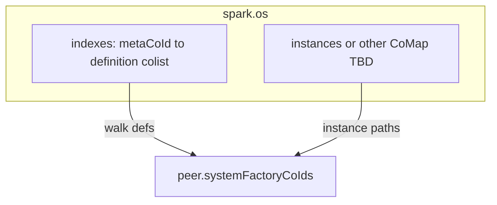

# Remove `spark.os.factories` + catalog-only discovery

## Goal (locked)

- **Get rid of** the **`spark.os` factories CoMap** entirely — no `systemFactoryRegistry`, no renamed `factories` property on `spark.os` for namekey/instance → `co_z`.
- **Replace** that role with **indexed discovery**: **metafactory-keyed definition colist** under [`spark.os.indexes`](libs/maia-db/src/cojson/indexing/factory-index-manager.js) (`key = metaSchemaCoId`, **items = schema definition `co_z`s**) plus **`resolveSystemFactories`** walking that colist and filling **`peer.systemFactoryCoIds`** from each def’s **`content.title`** (° keys).

## Write path

- [`registerFactoryCoValue`](libs/maia-db/src/cojson/indexing/factory-index-manager.js): **remove** `factoriesRegistry.set(title, id)` and **`ensureFactoriesRegistry`** usage for a global factory CoMap on `os`.
- **Add/keep** idempotent **append** of `schemaCoValueCore.id` to **`indexes[metaCoId]`** catalog colist (typed colist, `indexing: false` on the catalog schema).
- [`store-registry.js`](libs/maia-db/src/migrations/seeding/store-registry.js): **stop** writing factory defs and **stop** targeting the removed CoMap; **instance** `INSTANCE_REF` rows must go to an **explicit new home** (see below) — **not** the old factories map.

## Read path

- [`resolveSystemFactories`](libs/maia-engines/src/engines/data.engine.js): **no** flat map iteration from `os.factories`. **Load** `os.indexes`, resolve **metafactory `co_z`** (from first catalog entry, seed anchor, or infra runtime ref populated after minimal bootstrap — **design detail in implementation**), **walk** definition colist, **`set(title, defCoId)`** into `peer.systemFactoryCoIds`.
- [`fillRuntimeRefsFromSystemFactories`](libs/maia-db/src/cojson/factory/runtime-factory-refs.js): unchanged **after** map is filled from catalog.

## Instance / vibe keys (audit)

- Today **instance paths** and some **vibes** also lived in the same registry CoMap. **After removal**, define **one** place for **instance config** refs (e.g. dedicated `spark.os` key like `instances` CoMap, or reuse an existing registry already on `os`) — **must** be decided and implemented in the same migration (no silent loss of seed data).

## Resolver / seed

- [`lookupRegistryKey`](libs/maia-db/src/cojson/factory/resolver.js) for **factory schema** keys: **must not** read `os.factories`; resolve via **catalog / indexes** (or `peer.systemFactoryCoIds` after `resolveSystemFactories`).
- **Bootstrap order**: metafactory + `indexes` must exist before catalog append; **chicken-egg** (meta `co_z` before catalog key) handled in seed/bootstrap only — **reseed** for existing DBs.

## Non-goals

- **No** backwards compatibility: **no** read of old `systemFactoryRegistry` / `factories` keys on `spark.os`.

## Verification

- DB explorer: **`spark.os` has no `factories` / `systemFactoryRegistry` field**.
- `bun --filter @MaiaOS/db test`, `bun run check:ci`.

## Mermaid

