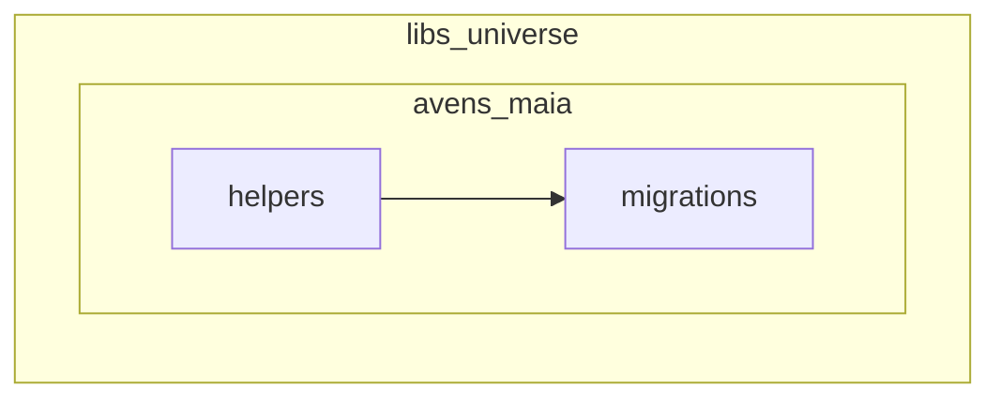

# Avengers OS `@AvenOS/universe` + `libs/universe/src/avens/maia`

## Interpretation

- **`@AvenOS/universe`** replaces **`@AvenOS/migrate`** (not legacy `libs/maia-universe`).
- **Authoring scope path is `avens`, not `sparks`:** everything Maia-specific for migrations + helpers lives under **`libs/universe/src/avens/maia/`**:
  - **`migrations/`** — ordered steps (`config.json`, `migrate.js`, `generated.js`, authored JSON colocated per step as decided).
  - **`helpers/`** — seed / identity / refs (today `libs/migrate/src/helpers`).
  - **Glue** — `index`, runner/history wiring, package exports.

Folder name **`avens`** is intentional (distinct from **`services/aven`** — spell consistently in docs).

## Rename **spark-os** → **sparks** (migration / code vocabulary)

| Layer | Change |
|-------|--------|
| **Migrate step** | `003-spark-os/` → **`003-sparks/`**; **`config.json` `id`** **`003-sparks`**; update **`requires`** on **`004-actors`** (and any docs/errors referencing the old id). |
| **Seed stages** | Today **`seedStages: ['sparkOs']`** → rename to **`'sparks'`** (and **`spark-os.js`** → **`sparks.js`** if helpers are renamed for parity). |
| **Human docs / logs** | Prefer **“sparks step”** instead of **“spark-os step.”** |

### Persistence caveat (must decide before coding)

Across **`@MaiaOS/db`** and peers, **`spark.os`**, **`getSparkOsId`**, infra slot keys, and similar identifiers may reflect **persisted CoMap layout or RPC contracts**. Renaming **only** migrate folders + seed stage strings is usually safe; renaming **stored field names or infra keys** is **not** a simple find/replace — it implies **schema migration or coordinated reseed**. The implementation task should either:

- **Label-only rename** (steps + TS identifiers + docs; keep underlying **`spark.os`** storage semantics), or  
- **Full domain rename** (explicit migration story + acceptance of breaking existing DBs without reseed).

Record the chosen tier in PR notes.

## Target skeleton

```text
libs/universe/
  package.json           # "@AvenOS/universe"
  src/
    avens/
      maia/
        helpers/
        migrations/
          001-genesis/
          002-factories/
          003-sparks/       # was 003-spark-os (infra slots, catalog, rebuild checkpoint)
          004-actors/
          005-vibes/
        runner.js           # optional; may stay src/runner.js with re-export
        history.js
        index.js
```



## Invariants

- **`maiaIdentity` path keys** unchanged unless intentionally migrating identities.
- Runner: folder name **`===`** **`config.json` `id`**.
- **`package.json` exports**: paths like `./src/avens/maia/migrations/002-factories/generated.js`.

## Rewrite checklist (high level)

1. **`libs/migrate` → `libs/universe`**, **`@AvenOS/migrate` → `@AvenOS/universe`** (monorepo grep).
2. **`src/helpers`** → **`src/avens/maia/helpers`**; **`src/updates`** → **`src/avens/maia/migrations`**.
3. **`003-spark-os` → `003-sparks`** (folder, ids, imports, AGENTS/AvenOS).
4. Codegen / dev-server / Dockerfiles → **`libs/universe/src/avens/maia/...`**.
5. **`bun install`**, registry codegen, **`check:ci`**, **`bun run test`**.

## Risk / clarity

- **`libs/universe`** vs deleted **`libs/maia-universe`** — document to avoid confusion.
- **`services/aven`** vs **`src/avens`** — similar substring; use full paths in docs.

## Pipeline phases (mental model; optional factory split later)

| Phase | Role |
|-------|------|
| **0 — genesis** | Minimal scaffold / nanoid / bootstrap slice |
| **1 — essential infra factories** | Meta, indexes registry, group-ish infra factories (*split from today’s monolithic 002-factories — optional refactor*) |
| **2 — remaining factories** | All other `*.factory.json` rows |
| **3 — actors** | Same as today’s **004-actors** (renumber if chain changes) |
| **4 — vibes** | Same as today’s **005-vibes** (renumber if chain changes) |

The **`003-sparks`** step (formerly **spark-os**) holds definition catalog, infra slots, hydration, and the **first** **`rebuildAllIndexes`** checkpoint before actors — unless folded into phases **1–2** intentionally.

## `rebuildAllIndexes` placement

- **Not** after each factory insert during bulk seed (indexing gated during CRUD).
- **After** the **003-sparks** checkpoint once infra + catalog + factory **`CoMap`** sync for that pass is done (when **`instances`** not run in same **`seed`** call).
- **Again** at end of full **`instances`** seed when more indexed CoValues exist.

Refs: [`libs/migrate/src/helpers/seed/seed.js`](libs/migrate/src/helpers/seed/seed.js) until moved under **`libs/universe`**.
