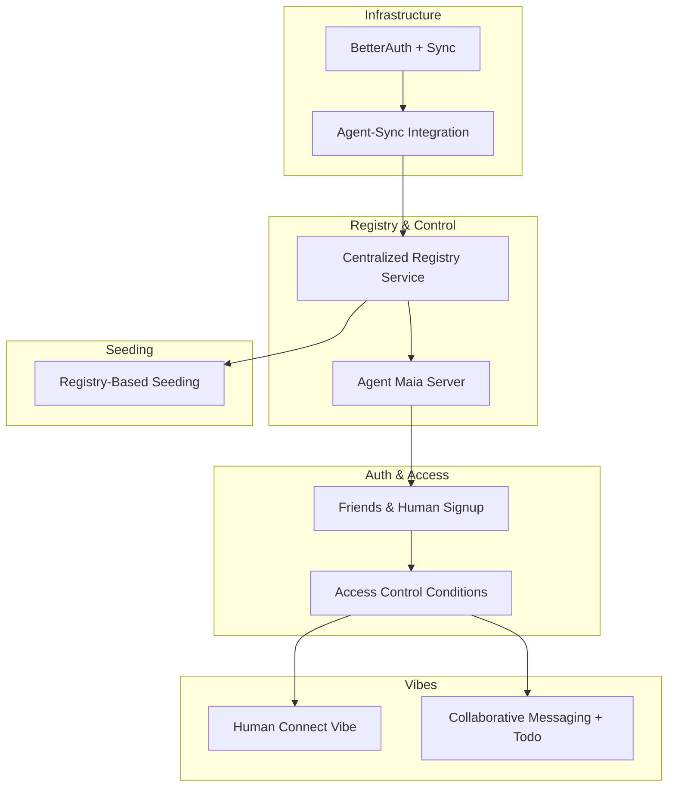

# Next Preview Instance Launch Plan

## Current State (from codebase audit)

**Auth**: Passkey-based via `maia-self` (PRF flow) in [services/maia-city/main.js](services/maia-city/main.js). No BetterAuth. No wallet service in repo (monorepo doc references it but it does not exist).

**Sync**: [services/sync](services/sync) is a thin WebSocket wrapper around [libs/maia-sync](libs/maia-sync). No auth at connection level, no rate limiting, no role-based access.

**Agent**: [services/agent](services/agent) uses [libs/maia-agent](libs/maia-agent). Connects to sync via `syncDomain` (localhost:4203 dev). Loads agent account with PGlite. Simple POST /trigger. No integration with sync service for access control or coordinated behavior.

**Registries**: Per-spark CoMaps in `account.sparks[@maia].registries` (sparks, schematas, vibes). See [libs/maia-schemata/src/os/registries.schema.json](libs/maia-schemata/src/os/registries.schema.json). No centralized lookup service.

**Access control**: Guardian/publicReaders model documented in [libs/maia-blog/260210_access_control_sparks_capabilities.md](libs/maia-blog/260210_access_control_sparks_capabilities.md). Per-CoValue groups. No fine-grained sharing conditions for "share vibe with friend X" or "share with agent Y".

**Seeding**: [libs/maia-db/src/cojson/schema/seed.js](libs/maia-db/src/cojson/schema/seed.js) uses `getAllSchemas()` from `@MaiaOS/schemata` (package). Schemata are bundled, not fetched from a registry.

**Vibes**: Chat and Todos vibes exist in [libs/maia-vibes](libs/maia-vibes). No "human/friends" vibe. No collaborative human+Maia messaging.

---

## Recommended Task Ordering

---

## Task 1: BetterAuth at Sync Service + Rate Limiting + Access Control Roles

**PRD**

| Section | Content |
| ------- | ------- |
| **Problem** | Sync service accepts any WebSocket connection. No authentication. No rate limiting. AI/agent connections cannot be distinguished or rate-limited separately from human connections. |
| **Success** | Sync service authenticates connections (BetterAuth session or token). Rate limits by connection type (human vs agent). AI/agent access mapped to roles (e.g., agent can only access sparks it is member of). |
| **Scope** | Add BetterAuth integration to sync service; add rate-limiting middleware; define and enforce role semantics for AI vs human. |
| **Subtasks** | 1) Add BetterAuth to monorepo (wallet service or integrate into sync); 2) Require auth before WebSocket upgrade at `/sync`; 3) Implement rate limiting (e.g., per-account limits, stricter for agents); 4) Map connection type (human/agent) to access rules; 5) Document env vars and deployment. |
| **Out of scope** | Full OAuth providers; replacing passkey flow for human auth. |
| **Dependencies** | BetterAuth (or equivalent) library; existing passkey flow in maia-city for human sessions. |

---

## Task 2: Connect Maia Spark with Sync Service Agent

**PRD**

| Section | Content |
| ------- | ------- |
| **Problem** | Agent service connects to sync as a peer but does not coordinate with sync service logic. No shared understanding of "Maia Spark" as the agent's representation. No handoff between sync server and agent for access decisions. |
| **Success** | Maia agent (agent service) is clearly identified as "Maia Spark"; sync service and agent share account/identity; agent can respond to sync events or be triggered by sync-related actions. |
| **Scope** | Ensure agent service uses same sync domain and account semantics; add sync-event hooks or triggers that involve the agent; document Maia Spark = agent account. |
| **Subtasks** | 1) Align agent service credentials with sync service expectations (same env pattern); 2) Add sync-domain config to agent; 3) Define Maia Spark identity (account ID) in docs/config; 4) Add trigger path from sync events to agent (e.g., inbox messages) if needed; 5) Test agent + sync together in dev. |
| **Out of scope** | Full agent orchestration; multi-agent. |
| **Dependencies** | Task 1 (auth/roles) for agent-specific rate limits. |

---

## Task 3: Centralized Registry Service + Agent Maia Server

**PRD** (merged: "adding centralized registry service" + "agent maia server that controls registries")

| Section | Content |
| ------- | ------- |
| **Problem** | Registries are per-spark only. No way to discover sparks, schemata, vibes, or other humans across the network. No server that manages registries or registers new sparks/humans. |
| **Success** | A centralized registry service provides lookup APIs for sparks, schemata, vibes, and humans. An agent Maia server can register new sparks and new human accounts. Single source of truth for "who/what exists" in the preview instance. |
| **Scope** | New registry service (or extend sync/api); API for lookup and registration; agent server that performs registrations; schema for registry entries. |
| **Subtasks** | 1) Design registry API (REST or CoJSON-backed); 2) Implement registry service (or add to api service); 3) Define schemata for registry entries (spark, human, schema, vibe); 4) Implement agent Maia server that can register new spark and new human; 5) Persist registry (PGlite or Postgres); 6) Add health/lookup endpoints. |
| **Out of scope** | Full distributed registry; multi-tenant isolation in v1. |
| **Dependencies** | Task 1 (auth) for securing registry writes. |

---

## Task 4: Friends & Human Signup + Fill Registry in Maia Spark

**PRD**

| Section | Content |
| ------- | ------- |
| **Problem** | Human signup only creates passkey + account. No friends concept. New humans are not registered in Maia Spark's registry. |
| **Success** | Human signup flow registers the new human in the centralized registry. Maia Spark's registry (or a friends registry) is populated so humans can discover and connect with each other. |
| **Scope** | Extend signup to call registry; define "friends" as a registry subset; populate Maia Spark registries on signup. |
| **Subtasks** | 1) Add registry registration step after passkey signup in maia-city; 2) Define friends/humans schema in registry; 3) Populate `account.sparks[@maia].registries` (or equivalent) with new human on signup; 4) Add UI to show "registered" status; 5) Test signup → registry flow. |
| **Out of scope** | Friend requests, blocking; full social graph. |
| **Dependencies** | Task 3 (centralized registry + agent server). |

---

## Task 5: Finetune Access Control Conditions

**PRD**

| Section | Content |
| ------- | ------- |
| **Problem** | Access control uses guardian/publicReaders. No flexible conditions for "share this vibe with friend X" or "allow agent Y to read this data". |
| **Success** | Conditions for sharing vibes and data with specific humans and agents. Clear semantics: share with human, share with agent, share with spark members. |
| **Scope** | Extend capabilities model; add condition resolution in backend; update operations to respect conditions. |
| **Subtasks** | 1) Design condition schema (e.g., `shareWith: [{ accountId, role }, ...]`); 2) Extend `os.capabilities` or create sharing rules CoMap; 3) Update cojson-backend / reactive resolver to evaluate conditions; 4) Add operations: `shareVibeWith`, `shareDataWith`; 5) Update Sparks vibe UI for sharing; 6) Document in blog/docs. |
| **Out of scope** | Complex RBAC; time-based conditions. |
| **Dependencies** | Existing guardian model; Task 4 (humans in registry) for "friend" targets. |

---

## Task 6: Re-use Centralized Registry Schemata in Seeding

**PRD**

| Section | Content |
| ------- | ------- |
| **Problem** | Seeding uses `getAllSchemas()` from package. Schemata are bundled, not pulled from registry. Cannot add new schemata via registry without code change. |
| **Success** | When centralized registry exists, seeding can optionally fetch schemata from registry. Bootstrap uses registry schemata when configured, else falls back to package. |
| **Scope** | Add registry-based schema fetch to seed.js; config flag for registry vs package; keep package as default. |
| **Subtasks** | 1) Add `getSchemasFromRegistry(url)` to maia-schemata or seed; 2) In bootstrapAndScaffold, check config: use registry if available; 3) Merge/validate registry schemata with package schemata; 4) Update kernel boot config for `registrySchemaUrl`; 5) Test seeding with registry. |
| **Out of scope** | Full schema versioning; registry as only source. |
| **Dependencies** | Task 3 (registry service with schemata endpoint). |

---

## Task 7: Simple Human Vibe (Connect/Follow Friends)

**PRD**

| Section | Content |
| ------- | ------- |
| **Problem** | No UI to connect or follow friends. No vibe for managing human relationships. |
| **Success** | A minimal vibe that lets users see friends (from registry), send connect request, and accept. "Follow" = one-way connection; "friend" = mutual. |
| **Scope** | New vibe: Human/Connect/Friends. Uses registry for human lookup. Uses access control for sharing. |
| **Subtasks** | 1) Create vibe scaffold (manifest, actor, context, view, inbox, state); 2) Query registry for humans; 3) Add connect/follow action (writes to group or CoMap); 4) Add accept/decline for mutual friends; 5) Integrate with Task 5 sharing conditions; 6) Add to Maia Spark vibes registry. |
| **Out of scope** | Rich profiles; activity feed. |
| **Dependencies** | Task 4 (humans in registry), Task 5 (access control). |

---

## Task 8: Collaborative Messaging Vibe + Todo Tool

**PRD**

| Section | Content |
| ------- | ------- |
| **Problem** | Chat vibe exists for AI. Todos vibe exists. No minimal collaborative messaging between humans and Maia, with a todo tool for defining and prioritizing tasks together. |
| **Success** | A vibe for human-Maia messaging with an attached todo tool. Users and Maia can send messages and create/prioritize todos in the same context. |
| **Scope** | New vibe or extend chat: messaging stream + todo tool. Shared CoStream/CoList for messages; shared todo list; tool for "add todo", "prioritize". |
| **Subtasks** | 1) Design messaging schema (or reuse chat); 2) Add todo tool to vibe (create, prioritize, complete); 3) Create collaborative context (humans + Maia in same group); 4) Wire AI to use todo tool in conversation; 5) Build minimal UI: message list + todo list; 6) Ensure access control allows both humans and agent. |
| **Out of scope** | Rich media; threads; full project management. |
| **Dependencies** | Task 5 (access control for agent + humans); existing chat/todos vibes as reference. |

---

## Summary: Todo List

| ID | Task | Dependencies |
| -- | ---- | ------------ |
| 1 | BetterAuth at sync + rate limiting + AI access control roles | - |
| 2 | Connect Maia Spark with sync service agent | 1 |
| 3 | Centralized registry service + Agent Maia server | 2 |
| 4 | Friends & human signup + fill registry in Maia Spark | 3 |
| 5 | Finetune access control conditions | 4 |
| 6 | Re-use centralized registry schemata in seeding | 3 |
| 7 | Simple human vibe (connect/follow friends) | 4, 5 |
| 8 | Collaborative messaging vibe + todo tool | 5 |

---

## Implementation Notes

- **Design thinking**: Milestone 0 (Capture Current State) is done for this plan. Each task should run Empathize → Define → Ideate → Prototype → Implement → Review per [maia-design-thinking.mdc](.cursor/rules/maia-design-thinking.mdc).
- **Workspace rules**: No backwards compatibility layers; migrate 100%; solve root causes (see [IMPORTANT.mdc](.cursor/rules/IMPORTANT.mdc)).
- **Parallelization**: Tasks 6 and 7 can run in parallel after Task 3; Task 8 after Task 5.
