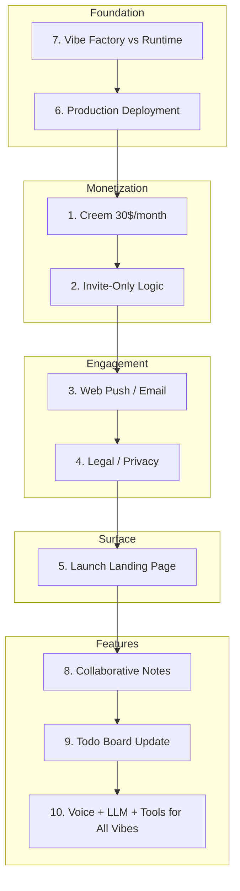

# Pre-Launch Todo Plan

## Current State Summary

| Area                    | Status          | Notes                                                                                                                                                             |
| ----------------------- | --------------- | ----------------------------------------------------------------------------------------------------------------------------------------------------------------- |
| Creem/billing           | Not implemented | Docs at [creem.md](libs/maia-docs/External_docs/creem.md); milestone 0 describes 1€ waitlist                                                                      |
| Invite-only             | Planned         | Sync has write capability; groups/crypto-permissions in [crypto-permissions.md](libs/maia-docs/TODO/crypto-permissions.md)                                        |
| Web push / email        | Not implemented | Planned in [00_milestone_0_waitlist.md](libs/maia-docs/TODO/05_conceptpaper/02_phase1/development/00_milestone_0_waitlist.md)                                     |
| Legal/privacy           | Not implemented | Privacy policy required for GDPR                                                                                                                                  |
| Landing page            | Minimal         | [landing.js](services/app/landing.js) shows "Coming Soon" + Sign in                                                                                               |
| Production deploy       | Next only       | [deploy-next.yml](.github/workflows/deploy-next.yml) deploys to `next.maia.city`                                                                                  |
| Vibe factory vs runtime | Unclear         | Runtime in [browser.js](libs/maia-engines/src/runtimes/browser.js); factory in [TERMINOLOGY.md](libs/maia-docs/TODO/TERMINOLOGY.md)                               |
| Collaborative notes     | Implemented     | Paper vibe in [paper/](libs/maia-vibes/src/paper/); may need fixes                                                                                                |
| Collaborative todos     | Implemented     | Todos vibe in [todos/](libs/maia-vibes/src/todos/)                                                                                                                |
| Voice + LLM + tools     | Partial         | [@ai/chat](libs/maia-actors/src/os/ai/function.js) + [browser.js](libs/maia-engines/src/runtimes/browser.js) collectTools/executeToolCall; per-vibe wiring needed |

---

## 1. Implement Creem $30/month Subscription

**Scope:** Creem.io as Merchant of Record (MoR) for subscription billing.

**Tasks:**

- Create Creem product: $30/month recurring subscription
- Set up [webhook endpoint](libs/maia-docs/External_docs/creem.md) for `checkout.completed`, `subscription.`* events
- Add checkout flow: create session via `POST /v1/checkouts`, redirect to Creem URL
- Store subscription status in user/account context (CoJSON or sync service)
- Add billing portal link (`POST /v1/customers/billing`) for manage/cancel
- Gate app access: require active subscription before full app load (or soft gate with upgrade prompt)

**Key files:** New `libs/maia-actors` or service for Creem; sync service for webhook handler; app for checkout UI.

---

## 2. Add Invite-Only Logic

**Scope:** Restrict access to invited users; batch invites via invite codes or admin-granted capability.

**Tasks:**

- Define invite model: invite code, or capability granted by admin to user
- Add invite creation flow (admin/backend): generate invite code or grant `/sync/write` capability
- Add invite validation at sign-in or sync connect: check user has valid invite
- If no invite: show "Request invite" or waitlist landing instead of app
- Integrate with queue position from [milestone 0](libs/maia-docs/TODO/05_conceptpaper/02_phase1/development/00_milestone_0_waitlist.md) (Fibonacci batches)

**Key files:** [groups.js](libs/maia-db/src/cojson/groups/groups.js), [crypto-permissions.md](libs/maia-docs/TODO/crypto-permissions.md), sync service.

---

## 3. Activate Web Push or Gather Email

**Scope:** Notifications for invites, updates; fallback to email if push unavailable.

**Tasks:**

- **Web push:** VAPID keys, service worker (`sw.js`), `push.subscribe()` in user flow
- Store push subscription in user account (CoJSON)
- Backend: cron or scheduled job to send push (e.g. daily progress, invite ready)
- **Email fallback:** If push denied or unsupported, collect email for transactional updates
- Creem checkout has newsletter checkbox (optional); can add dedicated email signup form

**Key files:** New `push.tool`, service worker; sync or separate worker for sending.

---

## 4. Legal and Privacy Policies

**Scope:** GDPR-compliant privacy policy and terms of service.

**Tasks:**

- Draft privacy policy: data collected, purpose, storage, sharing, rights, contact
- Draft terms of service (if applicable)
- Add consent checkbox at signup (before account creation)
- Add `/privacy` and `/terms` routes or pages
- Log acceptance (user_id, timestamp, policy version) for compliance

**Key files:** [milestone 0](libs/maia-docs/TODO/05_conceptpaper/02_phase1/development/00_milestone_0_waitlist.md) §4; new static pages or routes.

---

## 5. Launch Landing Page

**Scope:** Replace "Coming Soon" with full launch landing per [00_milestone_0_website.md](libs/maia-docs/TODO/05_conceptpaper/02_phase1/development/00_milestone_0_website.md).

**Tasks:**

- Hero: "Own the future. Build it together." + subheadline + CTA
- Sections: The Hook, The Vision (Simulation → Valley → City), The Promise, The Invitation
- CTA: "Join Waitlist" or "Reserve Your Spot ($30/mo)" depending on pricing model
- Footer: Privacy, Terms, Contact, social links
- Mobile-first, minimal scroll; glassmorphic styling consistent with existing [landing.css](services/app/css/landing.css)

**Key files:** [landing.js](services/app/landing.js), [main.js](services/app/main.js), [landing.css](services/app/css/landing.css), [hero.css](services/app/css/hero.css).

---

## 6. Setup Main / Production Env and Deployment Pipeline

**Scope:** Production deployment on `maia.city` (or equivalent) separate from `next.maia.city`.

**Tasks:**

- Create production Fly apps: `maia-city` (app), `sync-maia-city` (sync)
- Add production fly.toml variants or configs:
  - `VITE_PEER_SYNC_HOST=sync.maia.city`, `VITE_PEER_APP_HOST=maia.city`
  - `PEER_SYNC_STORAGE=postgres` (production DB)
- Add `deploy-main.yml` workflow (or extend deploy-next) triggered on `main` branch or `[release]` to production
- Configure GitHub environments: `Production` (maia.city), `Next` (next.maia.city)
- DNS: `maia.city`, `sync.maia.city` → Fly.io

**Key files:** [deploy-next.yml](.github/workflows/deploy-next.yml), [services/app/fly.toml](services/app/fly.toml), [services/sync/fly.toml](services/sync/fly.toml).

---

## 7. Figure Out Vibe Factory vs Vibe Runtime Logic

**Scope:** Clarify and resolve architecture split.

**Current state:**

- **Runtime:** [browser.js](libs/maia-engines/src/runtimes/browser.js) — filters vibes by `runtime: ["browser"]`, runs actors, collects tools
- **Factory:** [TERMINOLOGY.md](libs/maia-docs/TODO/TERMINOLOGY.md) — composite-factory for reusable UI; `factory-load` vs runtime evaluation

**Tasks:**

- Document: "Vibe factory" = reusable UI component definitions; "Vibe runtime" = execution environment for vibes
- Decide: Is factory used in current MaiaOS (libs/maia-engines) or only in legacy Svelte compositor?
- If factory is unused: remove or clarify in docs; if used: ensure consistent behavior
- Align terminology with [02_creators/01-vibes](libs/maia-docs/02_creators/01-vibes/01-reference.md)

---

## 8. Solve Collaborative Writing Pad / Notes

**Scope:** Ensure Paper vibe works reliably for collaborative notes.

**Current state:** [paper/](libs/maia-vibes/src/paper/), [notes.schema.json](libs/maia-schemata/src/data/notes.schema.json), [process.maia](libs/maia-actors/src/views/paper/process.maia) — `UPDATE_PAPER` updates `notes.0.content`.

**Tasks:**

- Verify CoText sync works for content (collaborative editing)
- Fix any cursor/selection conflicts or sync issues
- Add multi-note support if needed (currently `notes.0`)
- Add rich text or markdown if desired
- Ensure Paper works with invite-only and sync

---

## 9. Update Collaborative Todo Board

**Scope:** Improve todos vibe for launch.

**Current state:** [todos/](libs/maia-vibes/src/todos/), list views, kanban columns in docs.

**Tasks:**

- Implement or verify kanban view (columns: todo, in progress, done)
- Ensure real-time sync across collaborators
- Add AI tools (createTodo, queryTodos) for voice/LLM integration
- Polish UI/UX for launch

---

## 10. Wire Up Voice + LLM + Tool Calling for All Vibes

**Scope:** Ensure every vibe exposes tools that voice/LLM can use.

**Current state:**

- [@ai/chat](libs/maia-actors/src/os/ai/function.js) uses `runtime.collectTools()` and `runtime.executeToolCall()`
- [browser.js](libs/maia-engines/src/runtimes/browser.js) collects tools from `actorRefs` (avens + dependencies)
- Tools are derived from actor interface schemas (event types → tool definitions)

**Tasks:**

- Audit each vibe: chat, humans, quickjs-add, todos, sparks, paper, creator
- Ensure each has an actor with an interface schema that defines events (CREATE_TODO, etc.)
- Ensure each actor is registered as a dependency or aven so `collectTools` includes it
- Add voice UI entry point: orb/button that opens chat with voice input
- Test: voice → transcribe → LLM → tool call → actor update for todos, paper, humans, etc.

**Key files:** [browser.js](libs/maia-engines/src/runtimes/browser.js) `_getVibesAndDependenciesFromDb`, [function.js](libs/maia-actors/src/os/ai/function.js), interface schemas per vibe.

---

## Suggested Order

**Recommended sequence:** (7) clarify factory/runtime → (6) production pipeline → (1) Creem → (2) invite-only → (3) push/email → (4) legal → (5) landing → (8) notes → (9) todos → (10) voice+LLM wiring.

---

## Notes

- **Creem vs "cream":** The payment provider is **Creem** (creem.io); docs use "Creem" in [creem.md](libs/maia-docs/External_docs/creem.md).
- **Pricing:** Product docs specify €34 for Maia Voice; user requested $30/month — align as needed.
- **Jazz vs CoJSON:** Milestone 0 references Jazz; current stack uses CoJSON. Ensure invite/waitlist uses CoJSON.

