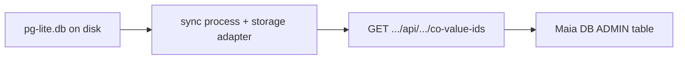

# Raw PGlite / Postgres `coValues.id` dashboard (ADMIN › All)

## Constraint (why not “only the app”)

The SPA runs in the **browser**. It **cannot** read [`services/sync/pg-lite.db`](services/sync/pg-lite.db) or run SQL against the server’s PGlite file directly. The file is owned by the **sync** process (`PEER_SYNC_STORAGE=pglite`, `PEER_DB_PATH`).

So “raw database” access requires **sync** (or another server) to execute SQL against the same storage adapter that persists CoJSON.



## Schema (source of truth)

Shared table definition in [`libs/maia-storage/src/schema/postgres.js`](libs/maia-storage/src/schema/postgres.js) migration:

- Table: **`coValues`** (queries in adapters use this form; e.g. [`libs/maia-storage/src/adapters/pglite.js`](libs/maia-storage/src/adapters/pglite.js) `SELECT * FROM coValues WHERE id = $1`).

Phase 1 query (read-only):

```sql
SELECT id FROM coValues ORDER BY id;
```

No CoJSON / `MaiaOS.getAllCoValues()` / `peer.read()` for this view.

## Implementation

### 1. [`libs/maia-storage`](libs/maia-storage)

- Add **`async listCoValueIds()`** on the same DB client class used by `getCoValue` / `upsertCoValue` (PGlite + Postgres adapters) implementing the SQL above.
- Return `string[]` of `id` values. Keep it a thin passthrough to `this.db.query` — no business logic.

### 2. [`services/sync/src/index.js`](services/sync/src/index.js)

- After `localNode` / storage boot, register a **GET** route (e.g. `/api/v0/admin/storage/co-value-ids` — exact path TBD) that:
  - Resolves the underlying storage client (same mechanism as other sync internals; storage is on the node and may be wrapped by [`wrapStorageWithIndexingHooks`](libs/maia-db/src/cojson/indexing/storage-hook-wrapper.js) — Proxy forwards unknown methods, so adding `listCoValueIds` on the concrete client is enough if the sync can call it).
  - Returns `{ ok: true, ids: string[] }` with JSON + existing CORS helpers.

**Security (required):** gate the route with an env flag, e.g. **`MAIA_STORAGE_ADMIN_API=1`** (or `NODE_ENV !== 'production'` **only** if you explicitly accept that; prefer explicit env). **Do not** ship an open DB listing in production without authentication.

### 3. [`services/app/db-view.js`](services/app/db-view.js) + peer URL

- For **ADMIN › All**, **fetch** the sync origin (same pattern as other sync HTTP calls — use [`@MaiaOS/peer`](libs/maia-peer) `getSyncHttpBaseUrl` or existing app convention) + the new path.
- **Loading / error** states in the table area.
- **Phase 1 UI:** one column **Co-ID** (links `data-maia-action="selectCoValue"` when `co_z*`).
- Later: add columns for `header`, `rowID`, etc., from the same table or separate queries.

### 4. Postgres (Fly)

Same endpoint and `listCoValueIds()` implementation for the Postgres adapter so behavior matches PGlite when `PEER_SYNC_STORAGE=postgres`.

## Out of scope (this iteration)

- Arbitrary raw SQL from the browser.
- Listing rows from `transactions` / `sessions` only (those are separate tables; can be a follow-up “SQL explorer”).

## Verification

- Local: `PEER_SYNC_STORAGE=pglite`, `MAIA_STORAGE_ADMIN_API=1`, open ADMIN › All → ids match `SELECT id FROM coValues ORDER BY id` run against the same DB with `psql` / PGlite CLI if available.
- Clicking a row opens the existing CoValue inspector.
