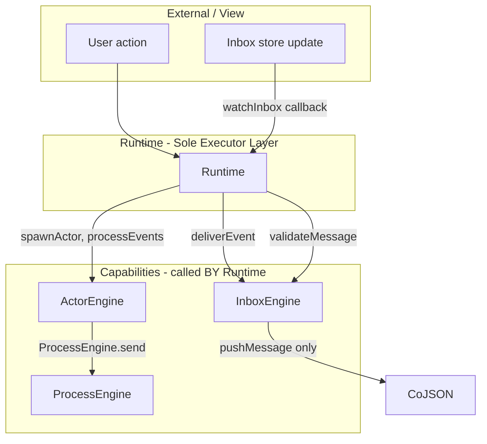

# Runtime Inbox Consolidation + CoJSON Single Source of Truth

## Principles

- **Runtime is the sole executor of all engines** — Runtime is the single layer that "runs" things. All execution flows through Runtime: deliver, process inbox, spawn, render, etc. Engines are passive capabilities; Runtime invokes them. Engines never call each other for execution — only Runtime orchestrates.
- **Each engine colocates its responsibility (DRY, single source of truth per domain)** — InboxEngine owns ALL inbox logic (read, validate, push, resolve). ActorEngine owns ALL actor logic (spawn, destroy, processEvents). ProcessEngine owns ALL process logic. No scattering of the same responsibility across engines. One domain = one engine.
- **CoJSON is the single source of truth** — All persisted state (messages, `processed` flag, inbox contents) lives in CoJSON. No in-memory structures mirror or replace CoJSON.
- **Operational state** (locks, subscription handles) is acceptable when purely runtime concurrency control, not persisted data.
- **No in-memory hacks** — Never cache message state, processed state, or inbox membership in JS Maps/Sets when that state lives in CoJSON.

---

## Engine Responsibility Colocation (DRY)


| Engine        | Owns (single source of truth)                                                                       | Does NOT own                                  |
| ------------- | --------------------------------------------------------------------------------------------------- | --------------------------------------------- |
| InboxEngine   | Inbox read (`getUnprocessedMessages`), validate, push, resolve inbox, watchInbox subscription setup | Spawning actors, processEvents, orchestration |
| ActorEngine   | spawnActor, destroyActor, processEvents, actor lifecycle                                            | Inbox reads, deliver (push)                   |
| ProcessEngine | Process/state-machine logic                                                                         | Actor spawning, inbox                         |
| Runtime       | **Orchestration only** — when to run what, calls engines in sequence                                | Domain logic (belongs in engines)             |


**Rule**: Engines do not call other engines for execution. Runtime calls engines. If InboxEngine needs "process these messages", it returns them to Runtime; Runtime calls ActorEngine.processEvents.

---

## Runtime as Sole Executor — Architecture




**Current violations**:

- InboxEngine.processUnprocessedMessages directly calls actorEngine.spawnActor and actorEngine.processEvents — bypasses Runtime.
- ActorEngine.deliverEvent calls InboxEngine.deliver — execution flows between engines instead of through Runtime.
- Inbox read (`processInbox`) is called from ActorEngine, InboxEngine, Runtime — scattered; should colocate in InboxEngine as single source.

**Target**:

- All execution flows: External → Runtime → Engine(s). Runtime is the only caller of engine execution methods.
- Inbox read: InboxEngine owns it. Runtime calls `InboxEngine.getUnprocessedMessages(...)`; nowhere else calls processInbox directly.
- Process flow: Inbox subscription fires → Runtime.processInboxForActor → InboxEngine.getUnprocessedMessages (read) → ActorEngine.spawnActor + processEvents (process).

---

## Current In-Memory State Audit


| Location                 | Structure                  | Type               | Verdict                                          |
| ------------------------ | -------------------------- | ------------------ | ------------------------------------------------ |
| InboxEngine              | `_watchedInboxCoIds` (Set) | Subscription dedup | **Remove** — redundant with `_processingByInbox` |
| InboxEngine              | `_processingByInbox` (Map) | Concurrency lock   | **Keep** — operational mutex                     |
| ActorEngine              | `actor._isProcessing`      | Re-entry guard     | **Keep** — operational                           |
| Runtime                  | `_watchedInboxCoIds` (Set) | Subscription dedup | **Remove** — redundant                           |
| processInbox (maia-db)   | `seenCoIds` (Set)          | Transient dedup    | **Keep** — local to single call                  |
| Message `processed` flag | CoJSON                     | Source of truth    | **Already correct**                              |


---

## Single Most Effective Addition

**Pass `preloadedMessages` from processUnprocessedMessages to processEvents** — one read from CoJSON per cycle, no redundant processInbox call. Reinforces "read once from CoJSON, use that result."

---

## Implementation Milestones

### Milestone 1: Remove _watchedInboxCoIds

**Files**: [libs/maia-engines/src/engines/inbox.engine.js](libs/maia-engines/src/engines/inbox.engine.js), [libs/maia-engines/src/runtimes/browser.js](libs/maia-engines/src/runtimes/browser.js)

- InboxEngine: remove `_watchedInboxCoIds`, always subscribe in watchInbox
- Runtime: remove `_watchedInboxCoIds`, make watchInbox a direct delegate
- Rely on `_processingByInbox` + CoJSON for correctness

---

### Milestone 2: Pass preloadedMessages to processEvents

**Files**: inbox.engine.js, actor.engine.js

- ActorEngine.processEvents(actorId, preloadedMessages = null)
- When provided, use preloadedMessages; else fetch via inbox read (dataEngine.execute for now; InboxEngine.getUnprocessedMessages after M3)
- InboxEngine.processUnprocessedMessages passes result.messages to processEvents

---

### Milestone 3: Runtime as Sole Executor + Colocate Inbox Read

**Goal**: (1) InboxEngine never calls actorEngine for execution. (2) InboxEngine is sole source for inbox read — Runtime calls InboxEngine, not dataEngine.execute(processInbox) directly.

**Changes**:

1. **InboxEngine** — Add `getUnprocessedMessages(inboxCoId, actorId)`:
  - Single source for inbox read. Internally calls `dataEngine.execute({ op: 'processInbox', actorId, inboxCoId })`.
  - No other engine or Runtime calls processInbox directly — DRY, colocated in InboxEngine.
2. **Runtime** — Add `processInboxForActor(inboxCoId, actorId, actorConfig)`:
  - Holds `_processingByInbox` lock (Runtime owns execution, Runtime owns the lock).
  - Calls `InboxEngine.getUnprocessedMessages(inboxCoId, actorId)` — not dataEngine directly.
  - If actor exists: `actorEngine.processEvents(actorId, preloadedMessages)`.
  - If not: `actorEngine.spawnActor`, emit actorSpawned, then `actorEngine.processEvents(actorId, preloadedMessages)`.
3. **InboxEngine.processUnprocessedMessages** — Replace orchestration with delegation:
  - Calls `runtime.processInboxForActor(inboxCoId, actorId, actorConfig)` — no direct actorEngine calls.
  - Remove `_processingByInbox` from InboxEngine (moved to Runtime).
4. **InboxEngine.deliver** — Require Runtime for execution. Always use `runtime.ensureActorSpawned`. No fallback to actorEngine when runtime is null.
5. **All processInbox call sites** — Migrate to InboxEngine.getUnprocessedMessages: ActorEngine retry check, Runtime.executeToolCall SUCCESS polling. No direct dataEngine.execute(processInbox) from engines or Runtime — DRY.

---

### Milestone 4: Unify InboxEngine.deliver branches

- Single path: push message → rely on subscription for processing
- Remove ensureActorSpawned/processEvents from deliver; subscription fires, Runtime processes
- Or: deliver always calls runtime.ensureActorSpawned (Runtime as sole executor) — no direct actorEngine in deliver

---

## Data Flow (Target State)

```
CoJSON (inbox, messages, processed) <- single source of truth
         ^
         | read/write
         v
InboxEngine: getUnprocessedMessages (ONLY place that reads processInbox), validate, push, watchInbox
         ^
         | "get messages" (Runtime calls)
         v
Runtime: processInboxForActor, ensureActorSpawned, executeToolCall, deliverEvent
         |
         | "run this"
         v
ActorEngine: spawnActor, processEvents | ProcessEngine: send | ...
```

**Colocation**: All inbox reads go through InboxEngine.getUnprocessedMessages. Runtime is the only executor; engines are capabilities.

---

## What Stays In-Memory (Operational Only)

- `_processingByInbox` — mutex (in Runtime or InboxEngine per design)
- `actor._isProcessing` — re-entry guard
- `_inboxWatcherUnsubscribes` — subscription handles
- `seenCoIds` in processInbox — transient, single-call dedup

None of these mirror or replace CoJSON.