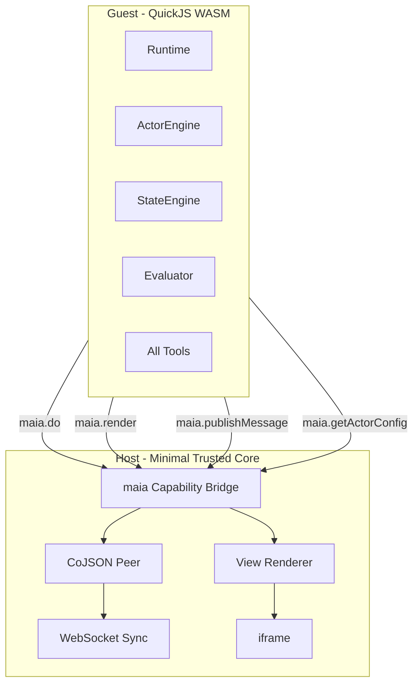

# 100% Sandbox Migration Plan

## Essence Summary


| Principle              | Meaning                                                                                                                |
| ---------------------- | ---------------------------------------------------------------------------------------------------------------------- |
| **Zero trust**         | Every agent and actor runs in the same secure sandbox—no first-party exception                                         |
| **Config from host**   | Guest receives all config (agents, actors, tools, state, view, style) via capability bridge. Host loads from CoJSON DB |
| **No hardcoded .maia** | No ACTORS registry or imports in QuickJS. Seed populates DB; .maia/.function.js become seed data                       |
| **Capability bridge**  | Guest only sees `maia.do`, `maia.render`, `maia.publishMessage`, etc. No fetch, require, or DOM                        |
| **View + style = IPC** | Serializable JSON/CSS passed to host; host renders in iframe. No DOM in guest                                          |
| **Technology**         | [quickjs-emscripten](https://github.com/justjake/quickjs-emscripten) for sandbox; Asyncify for async tools             |


---

## Reference Links


| Resource                                                         | URL                                                                                                                                                  |
| ---------------------------------------------------------------- | ---------------------------------------------------------------------------------------------------------------------------------------------------- |
| **quickjs-emscripten**                                           | [https://github.com/justjake/quickjs-emscripten](https://github.com/justjake/quickjs-emscripten)                                                     |
| **HN: QuickJS sandbox**                                          | [https://news.ycombinator.com/item?id=40896873](https://news.ycombinator.com/item?id=40896873)                                                       |
| **Figma: How we built the plugin system**                        | [https://www.figma.com/blog/how-we-built-the-figma-plugin-system/](https://www.figma.com/blog/how-we-built-the-figma-plugin-system/)                 |
| **Figma: Plugin security update**                                | [https://www.figma.com/blog/an-update-on-plugin-security/](https://www.figma.com/blog/an-update-on-plugin-security/)                                 |
| **@sebastianwessel/quickjs** (alternate; use fetch with caution) | [https://github.com/sebastianwessel/quickjs](https://github.com/sebastianwessel/quickjs)                                                             |
| **MDN: iframe sandbox**                                          | [https://developer.mozilla.org/en-US/docs/Web/HTML/Element/iframe#sandbox](https://developer.mozilla.org/en-US/docs/Web/HTML/Element/iframe#sandbox) |
| **MaiaOS view schema**                                           | [view.schema.json](libs/maia-schemata/src/os/view.schema.json)                                                                                       |
| **MaiaOS style schema**                                          | [style.schema.json](libs/maia-schemata/src/os/style.schema.json)                                                                                     |


---

## Architecture Overview




---

## View & Style: Serializable IPC Payloads


| Config                 | Schema            | Output                                                                  | IPC-safe                     |
| ---------------------- | ----------------- | ----------------------------------------------------------------------- | ---------------------------- |
| **View**               | view.schema.json  | `{ content: { tag, class, text, attrs, children, $on, $each, $slot } }` | Yes—plain JSON               |
| **Style**              | style.schema.json | `{ tokens, components, selectors }`                                     | Yes—plain JSON               |
| **StyleEngine output** | —                 | CSS string (`compileToCSS`)                                             | Yes—host injects into iframe |
| **ViewEngine output**  | —                 | `RenderCommand[]` (tag, attrs, children, events)                        | Yes—serializable tree        |


Style engine sanitizes: `sanitizeCSSInterpolatedValue`, blocks `expression()`, `javascript:`. View engine uses `createElement` + `sanitizeAttribute`. For IPC, the **evaluated result** is passed—no live DOM, no functions.

---

## Guest Receives All Config from Host


| Config                 | Source                                    | How guest receives                                |
| ---------------------- | ----------------------------------------- | ------------------------------------------------- |
| Agent config           | `account.registries.sparks[°Maia].agents` | `maia.getAgentConfig(key | coId)`                 |
| Actor config           | CoJSON by actor co-id                     | `maia.getActorConfig(actorCoId)`                  |
| State definition       | CoJSON (actor.state ref)                  | Inline in actor config or `maia.getStateConfig()` |
| View definition        | CoJSON (actor.view ref)                   | Inline or `maia.getViewConfig()`                  |
| Style definitions      | CoJSON (brand + actor style)              | Host resolves, compiles; passes `{ css, tokens }` |
| Tool definition + code | CoJSON (actor.tool ref)                   | `maia.getToolConfig()` → `{ definition, code }`   |


**Flow:** Host loads from CoJSON → passes to guest via capability bridge. Guest never reads CoJSON directly.

---

## No Hardcoded .maia in QuickJS


| Item                | Today                       | After migration                                      |
| ------------------- | --------------------------- | ---------------------------------------------------- |
| Actor definitions   | Hardcoded ACTORS registry   | `maia.getActorConfig(coId)`                          |
| Tool definitions    | Hardcoded ACTORS            | `maia.getToolConfig(coId)` or inline in actor config |
| Tool code (execute) | ES module import            | String from CoJSON, run in QuickJS with `maia`       |
| State, view, style  | Engines load via dataEngine | Host loads, passes to guest                          |


- Tool schema: `definition` (JSON) + `code` (JS string). System tools seeded at bootstrap.
- `libs/maia-actors/*.actor.maia`, `*.function.js` → **seed process** populates DB.
- Runtime: zero imports from maia-actors.

---

## The `maia` Capability Object

Guest sees only:

```javascript
const maia = {
  do(payload) { /* host: dataEngine.execute */ },
  render(actorId, viewSpec, styleSpec) { /* host: paints iframe */ },
  publishMessage(senderId, targetId, type, payload) { /* host: inbox */ },
  getAgentConfig(keyOrCoId) { /* host: loads from DB */ },
  getActorConfig(coId) { /* host: loads from DB */ },
  getToolConfig(coId) { /* host: loads from DB */ },
  // No fetch, require, or DOM
}
```

All methods return JSON-serializable. Implementation: host exposes via `vm.newFunction()` ([quickjs-emscripten](https://github.com/justjake/quickjs-emscripten)).

---

## quickjs-emscripten: Key Features


| Need                     | API                                                                     |
| ------------------------ | ----------------------------------------------------------------------- |
| Capability bridge        | `vm.newFunction()`, `vm.setProp(vm.global, "maia", maiaHandle)`         |
| Async tools              | `newAsyncifiedFunction()`, `evalCodeAsync()` — guest awaits `maia.do()` |
| Memory limit             | `runtime.setMemoryLimit()`, `memoryLimitBytes` in evalCode              |
| CPU limit                | `runtime.setInterruptHandler()`, `shouldInterruptAfterDeadline()`       |
| No default host exposure | By default nothing exposed; add only `maia`                             |


**HN insight ([jitl](https://news.ycombinator.com/item?id=40896873)):** Never expose host `fetch` to guest—sandboxed code must not call HTTP as the host. All network via `maia.ai`, `maia.do` proxy.

---

## Implementation Decisions


| Decision                         | Choice                                                             |
| -------------------------------- | ------------------------------------------------------------------ |
| Per-invocation vs pooled sandbox | Fresh context per invocation—better isolation                      |
| All tools in QuickJS?            | Yes—no native exception                                            |
| Host fetch for AI?               | Yes—`maia.ai()` proxies; guest never gets fetch                    |
| iframe per actor?                | Per-agent or shared with isolated roots                            |
| Async                            | Use ASYNCIFY build; tools await `maia.`*                           |
| Package size                     | `quickjs-emscripten-core` + single WASM variant for minimal bundle |


---

## Security Checklist


| Check                      | Notes                                                    |
| -------------------------- | -------------------------------------------------------- |
| No fetch in guest          | All network via `maia.ai`, `maia.do` (host proxy)        |
| No require/import in guest | Unless controlled module loader                          |
| Restricted actor view      | Guest sees `{ id, contextSchemaCoId, contextCoId }` only |
| Payload validation         | Validate against tool definition schema                  |
| CPU/memory limits          | `setMemoryLimit`, `setInterruptHandler`                  |
| View/style sanitization    | StyleEngine + ViewEngine already sanitize                |


---

## Tool Format (from CoJSON)

```json
{
  "$schema": "°Maia/schema/tool",
  "$id": "tool_db_001",
  "name": "@db/db",
  "definition": { "parameters": { ... } },
  "code": "export default { async execute(actor, payload) { return await maia.do(payload) } }"
}
```

Guest receives `{ definition, code }`, evaluates `code` in QuickJS with `maia` in scope.

---

## Data Flow

```
Host (CoJSON peer)
  ├─ Loads: agents, actors, state, view, style, tool (definition + code)
  ├─ Passes via: maia.getAgentConfig, maia.getActorConfig, maia.getToolConfig
  └─ Guest (QuickJS)
        ├─ Receives config blobs (JSON)
        ├─ Runs state machine, evaluator, tool.code with maia
        ├─ Sends: maia.do, maia.render(viewSpec, styleSpec), maia.publishMessage
        └─ Host: executes, paints iframe, delivers to inbox
```

---

## Related

- [maia-actors README](../../libs/maia-actors/README.md)
- [maia-engines overview](../../libs/maia-docs/03_developers/04_maia-engines/engines/00-overview.md)
- [Original quickjs-sandbox roadmap](libs/maia-docs/TODO/roadmap/quickjs-sandbox-user-tools.plan.md)

