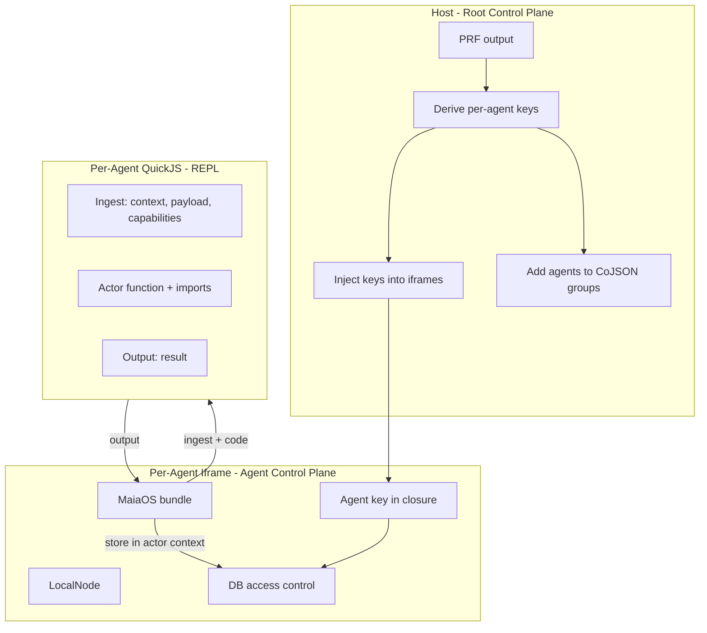
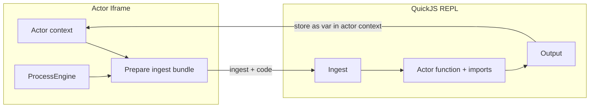

# Three Control Planes Architecture - V1 Secure User Agents

## Overview

End-to-end secure environment for untrusted user agents/actors. Three control planes with clear responsibilities. We control the full pipeline: [libs/maia-peer](libs/maia-peer), [services/sync](services/sync), [services/app](services/app), [services/sync](services/sync).

**QuickJS actor functions = LLM-inspired sandboxed REPL.** Ingest + output + code imports. No maia.* direct access.

---

## The Three Control Planes




---

## Actor Iframe ↔ QuickJS IPC Bridge

**Clear boundary:** Ingest + output + code imports. No maia.db, maia.ai, etc. in QuickJS.




**Ingest (iframe → QuickJS):**

- Actor context data (notes, conversations, etc.)
- Event payload
- Per-function capabilities only (e.g. `do` for @db, `collectTools` + `executeToolCall` + `fetch` for @ai)
- Code imports (utilities: splitGraphemes, etc.)

**Output (QuickJS → iframe):**

- Function return value (OperationResult)
- Stored in actor context (e.g. `lastToolResult`) for downstream steps

**Data access:** Iframe manages all DB/CoJSON. QuickJS calls injected `do(payload)`; iframe executes with full auth and permissions. Actor functions never handle keys or auth.

---

## Control Plane Responsibilities

### 1. Host (Root Control Plane)


| Responsibility        | Details                                                      |
| --------------------- | ------------------------------------------------------------ |
| **PRF output**        | Human passkey → PRF evaluation → prfOutput (in memory)       |
| **Derive agent keys** | `HKDF(prfOutput, "agent-{agentId}")` → agentSecret per agent |
| **Inject keys**       | postMessage agentSecret to each iframe; zero after send      |
| **CoJSON groups**     | Add each agent's public key to group rules (permissions)     |
| **Orchestrate**       | Create/destroy agent iframes, route events                   |
| **Native agents**     | Run trusted system agents (spark admin, dashboard)           |


**Does NOT:** Hold agent keys long-term, run user code, sign on behalf of agents.

---

### 2. Per-Agent Iframe (Agent Control Plane)


| Responsibility        | Details                                                         |
| --------------------- | --------------------------------------------------------------- |
| **Hold agent key**    | In closure, memory-only; receive via postMessage from host      |
| **Sign**              | Internal — when executing DataEngine/CoJSON ops, iframe signs   |
| **LocalNode**         | Own CoJSON LocalNode, own WebSocket to sync server              |
| **MaiaOS bundle**     | Runtime, ActorEngine, ProcessEngine, ViewEngine (our code only) |
| **DB access control** | All CoJSON permissions; inject `do()` with full auth            |
| **Render**            | viewDef → DOM (JSON-driven, no eval)                            |


**Does NOT:** Run user-generated code (that's QuickJS). Never persist key to storage. QuickJS never gets maia.* — only per-function capabilities.

---

### 3. Per-Agent QuickJS (Actor Function REPL)


| Responsibility          | Details                                                                |
| ----------------------- | ---------------------------------------------------------------------- |
| **Run actor functions** | User-written tools, system tools — like LLM sandboxed Python/JS REPL   |
| **Ingest only**         | Receives context, payload, capabilities from iframe — no maia.* direct |
| **Output only**         | Returns result; iframe stores in actor context (lastToolResult)        |
| **No keys, no auth**    | Never sees agent key; all data via injected capabilities               |


**Does NOT:** Access DOM, fetch, maia.db, or any host/iframe internals. Ingest/output + code imports only.

---

## Context Flow

1. **Actor context** holds state (notes, lastToolResult, etc.)
2. **ProcessEngine** hits `act.function` → prepares ingest bundle from context + payload + per-function capabilities
3. **QuickJS** runs function with ingest → returns output
4. **Iframe** stores output in actor context (e.g. `lastToolResult`)
5. **Next step** (SUCCESS guard, etc.) uses updated context

---

## Current Sync Pipeline (Reference)

**Client ([libs/maia-peer](libs/maia-peer)):**

- `setupSyncPeers(syncDomain)` → WebSocketPeerWithReconnection
- Connects to `wss://{syncDomain}/sync`
- `node.syncManager.addPeer(wsPeer)` — one LocalNode, one WebSocket per account

**Server ([services/sync](services/sync)):**

- One LocalNode (server account)
- Each client WebSocket → createWebSocketPeer → addPeer
- cojson-transport-ws: one peer per connection

---

## Sync Suggestions (We Control Full Pipeline)

### Option A: Host-Based Proxy (Single WebSocket per Client)

Protocol extension for multiplexing. Defer until many agents.

### Option B: Local Propagation (No Network for Same-Client CoValues)

Host as local relay; iframes broadcast CoValue updates. Depends on CoJSON ingest API.

### Option C: Keep Current (One WebSocket per Agent)

**V1:** Each iframe has own LocalNode, own WebSocket. Simplest.

---

## Key Derivation Flow

```
PRF(passkey, "maia.city") → prfOutput
HKDF(prfOutput, "agent-todos") → agentSecret_todos
HKDF(prfOutput, "agent-chat")  → agentSecret_chat
Host postMessages agentSecret to iframe
Iframe stores in closure; signing internal to DataEngine
Host adds agent public key to CoJSON group rules
```

---

## Security Summary


| Layer   | User code?            | Keys?            | Isolation                         |
| ------- | --------------------- | ---------------- | --------------------------------- |
| Host    | No                    | Derives, injects | Root                              |
| Iframe  | No (our MaiaOS)       | Holds in closure | Null-origin                       |
| QuickJS | Yes (actor functions) | No               | Ingest/output + per-function caps |


---

## File Structure (Target)

```
libs/maia-peer/          # setupSyncPeers, local relay (future)
services/sync/           # Sync service (WebSocket + agent API + LLM)
libs/maia-runtime/       # QuickJS + ingest/output bridge
services/maia/           # Host shell, iframe orchestration
services/moai/           # Sync server, /sync WebSocket
```

