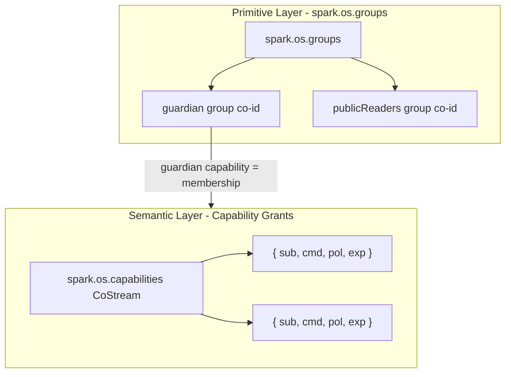

# spark.os Groups + Capabilities — Master Plan

Merges: [rename_capabilities_to_groups](rename_capabilities_to_groups_86fc3930.plan.md) + [cojson_capabilities_+_spark.os](cojson_capabilities_+_spark.os_37b7b1b1.plan.md).

---

## Immediate: Protect LLM/chat API

**Scope:** Bearer token + capability from register. Secure binding: accountID vs agent pubkey. 100% capability gatekeeping (no registry-membership checks).

### Security: Account ID vs Agent Pubkey

- **accountID** (co_z...) — Cojson account co-id. Identifies the human's account.
- **Agent pubkey / did:key** — Ed25519 public key from agentSecret. In UCAN: `iss`. Proves who signed.
- **Binding:** accountID in `meta.maia/accountID` is an unverified claim. An attacker could put another account's ID and sign with their own key. We MUST verify: the signer (iss) owns the claimed accountID.
- **Verification:** Load account by accountID → get header.ruleset.initialAdmin (agentID) → derive expected did:key from agentID → `iss === expectedDidKey`. If mismatch → 403 (forged claim).

### 100% Capability Gatekeeping

- **Only** check `Human.llmExp`. No additional "is in registry" or "is human" checks.
- The registry is used only as an index to find the Human CoMap (accountId → humanCoId). No Human = no capability = deny.
- The capability (llmExp) is the sole gate.

### Flow

```
Register → create Human with llmExp
LLM: Bearer → verify signature → verify accountID↔iss binding → lookup Human → check llmExp > now → proxy
```

### 1. Human schema (libs/maia-schemata)

- Add optional `llmExp` (integer, Unix seconds) to [human.schema.json](libs/maia-schemata/src/os/human.schema.json)

### 2. Moai handleRegister (services/moai/src/index.js)

- Create Human: add `llmExp: Math.floor(Date.now()/1000) + 365*24*3600`
- Idempotent: load Human; if `!llmExp || llmExp < now`, update Human.llmExp

### 3. Moai handleLLMChat (services/moai/src/index.js)

1. Extract `Authorization: Bearer <token>`; no token → 401
2. `verifyInvocationToken(token, { allowedCmd: "/llm/chat" })` → { iss, accountId }
3. `**verifyAccountBinding(peer, accountId, iss)**` — load account, get header.ruleset.initialAdmin, derive expected did:key, return match. If false → 403
4. `**hasValidLlmCapability(worker, accountId)**` — registry lookup (accountId → Human co-id) → load Human → return `human.llmExp > now`. No Human or expired → 403. **No other checks.**
5. On success → RedPill proxy

### 4. verifyAccountBinding (new helper)

- In moai or maia-db: given peer, accountId, expectedDidKey
- Load account CoValue, read `verified.header.ruleset.initialAdmin` (agentID)
- From agentID signer part, derive did:key (may need cojson/crypto helper)
- Return `derivedDidKey === expectedDidKey`

### 5. Client (libs/maia-actors/src/os/ai/function.js)

- Before fetch: `token = await runtime.getCapabilityToken?.({ cmd: "/llm/chat", args: {} })`
- No token → error "Sign in required for AI chat"
- Add `Authorization: Bearer ${token}`

### Files to change

- [libs/maia-schemata/src/os/human.schema.json](libs/maia-schemata/src/os/human.schema.json): add optional `llmExp`
- [services/moai/src/index.js](services/moai/src/index.js): handleRegister (llmExp), handleLLMChat (auth + binding + capability), `verifyAccountBinding`, `hasValidLlmCapability`
- [libs/maia-actors/src/os/ai/function.js](libs/maia-actors/src/os/ai/function.js): getCapabilityToken + Bearer header

---

## Design Summary (Full Plan)




- **spark.os.groups** — Data-access groups (guardian, publicReaders). Groups are the primitive.
- **spark.os.capabilities** — CoStream of Capability CoMaps. Fully generic for any capability type (API, CRUD, file, custom). UCAN-aligned.

---

## Phase 1: Rename capabilities → groups (fullstack)

Rename the CoMap that holds guardian/publicReaders from `capabilities` to `groups`.

### 1.1 Schema (libs/maia-schemata)

- Rename: `os/capabilities.schema.json` → `os/groups.schema.json`
- Update: `$id` / `title` → `°Maia/schema/os/groups`
- Update: description → "Groups CoMap - guardian, publicReaders. Stored in spark.os.groups"
- [libs/maia-schemata/src/index.js](libs/maia-schemata/src/index.js): import and key `'os/capabilities'` → `'os/groups'`
- [libs/maia-schemata/src/os/os-registry.schema.json](libs/maia-schemata/src/os/os-registry.schema.json): property `capabilities` → `groups`
- [libs/maia-schemata/src/data/spark.schema.json](libs/maia-schemata/src/data/spark.schema.json): descriptions → `spark.os.groups.guardian`

### 1.2 Bootstrap and MaiaDB (libs/maia-db)

- [libs/maia-db/src/migrations/seeding/bootstrap.js](libs/maia-db/src/migrations/seeding/bootstrap.js): capabilitiesSchemaCoId → groupsSchemaCoId, `os.set('groups', groups.id)`, migration block
- [libs/maia-db/src/cojson/core/MaiaDB.js](libs/maia-db/src/cojson/core/MaiaDB.js): same renames, `data: { groups: groups.id }`

### 1.3 Groups resolution (libs/maia-db)

- [libs/maia-db/src/cojson/groups/groups.js](libs/maia-db/src/cojson/groups/groups.js): JSDoc + variables `capabilities`* → `groups`*
- [libs/maia-db/src/cojson/helpers/resolve-capability-group.js](libs/maia-db/src/cojson/helpers/resolve-capability-group.js): `osData?.capabilities` → `osData?.groups`
- [libs/maia-db/src/cojson/crud/map-transform.js](libs/maia-db/src/cojson/crud/map-transform.js): example path → `os.groups.guardian.accountMembers`

### 1.4 Engines, actors, moai, docs

- [libs/maia-engines/src/engines/data.engine.js](libs/maia-engines/src/engines/data.engine.js): error msg
- [libs/maia-actors/src/views/detail/context.maia](libs/maia-actors/src/views/detail/context.maia): `$os.groups.guardian.`*
- [services/moai/src/index.js](services/moai/src/index.js): comment
- [libs/maia-blog/260210_access_control_sparks_capabilities.md](libs/maia-blog/260210_access_control_sparks_capabilities.md): `os.groups`, groups-as-primitive explanation
- [libs/maia-docs/02_creators/07-operations/01-usage.md](libs/maia-docs/02_creators/07-operations/01-usage.md): `spark.os.groups.guardian`

### Migration

No fallbacks. If production has existing sparks, run a one-time migration to rewrite os CoMaps: `capabilities` key → `groups` key.

---

## Phase 2: Add spark.os.capabilities (CoStream of grants)

**Option 3B** — CoStream of Capability CoMaps (UCAN-aligned, one CoMap per grant).

### 2.1 Structure

```
spark.os
├── groups         (guardian, publicReaders — data access)
├── capabilities   (CoStream of Capability CoMaps — generic grants)
├── schematas
├── indexes
└── ...
```

`spark.os.capabilities` is a **CoStream** of Capability CoMaps. Each grant is one CoMap. Fully generic: API, CRUD, file, custom—any command.

---

## Phase 3: UCAN-aligned Capability schema

### UCAN Alignment (Delegation Spec)

UCAN Capability: `subject × command × policy`


| UCAN Field | Type    | Our Cojson Adaptation                            |
| ---------- | ------- | ------------------------------------------------ |
| `sub`      | DID     | null                                             |
| `cmd`      | Command | `/llm/chat`, `/crud/read`, etc.                  |
| `pol`      | Policy  | `[]` for minimal; array of predicates for future |


Delegation payload also includes: `iss`, `aud`, `exp`, `nbf`, `nonce`, `meta`. For stored grants we use:


| Field   | Required | Purpose                                                       |
| ------- | -------- | ------------------------------------------------------------- |
| `sub`   | Yes      | Subject (account co-id)                                       |
| `cmd`   | Yes      | Command (UCAN segment structure: `/`-delimited, lowercase)    |
| `pol`   | Yes      | Policy; `[]` = no additional constraints                      |
| `exp`   | Yes      | Unix seconds expiry                                           |
| `iss`   | Optional | Issuer (who granted; moai or guardian co-id)                  |
| `nbf`   | Optional | Not before (Unix seconds)                                     |
| `nonce` | Optional | Uniqueness (bytes or string); CoValue co-id provides implicit |
| `meta`  | Optional | MaiaOS extensions (`maia/accountID`, etc.)                    |


### Schema: °Maia/schema/os/capability

```json
{
  "$schema": "°Maia/schema/meta",
  "$id": "°Maia/schema/os/capability",
  "title": "UCAN-aligned Capability Grant",
  "description": "Single capability grant. sub×cmd×pol. Stored in spark.os.capabilities CoStream.",
  "cotype": "comap",
  "indexing": false,
  "properties": {
    "sub": { "type": "string", "pattern": "^co_z[a-zA-Z0-9]+$", "description": "Subject (account co-id)" },
    "cmd": { "type": "string", "pattern": "^/[a-z0-9/]*$", "description": "UCAN Command (e.g. /llm/chat)" },
    "pol": { "type": "array", "description": "UCAN Policy; [] for no constraints" },
    "exp": { "type": "integer", "description": "Expiry Unix seconds" },
    "iss": { "type": "string", "pattern": "^co_z[a-zA-Z0-9]+$", "description": "Issuer (optional)" },
    "nbf": { "type": "integer", "description": "Not before (optional)" },
    "nonce": { "type": "string", "description": "Uniqueness (optional)" },
    "meta": { "type": "object", "description": "Extensions (optional)" }
  },
  "required": ["sub", "cmd", "pol", "exp"]
}
```

### Schema: °Maia/schema/os/capabilities-stream

CoStream schema for the stream of capability refs. (CoStream of co-ids to Capability CoMaps.)

### os-registry update

Add to [os-registry.schema.json](libs/maia-schemata/src/os/os-registry.schema.json):

```json
"capabilities": {
  "type": "string",
  "pattern": "^co_z[a-zA-Z0-9]+$",
  "description": "CoStream of Capability CoMap co-ids (UCAN-aligned grants)"
}
```

---

## Phase 4: Bootstrap + visibility

### Bootstrap (libs/maia-db)

- Create capabilities CoStream for °Maia.os (empty initially)
- `os.set('capabilities', capabilitiesStream.id)`
- Migration: existing °Maia sparks get empty capabilities stream if missing

### Visibility (moai + guardian)

- **Moai**: Load °Maia → os → capabilities stream. For each cmd, verify: accountId in stream with matching cmd and unexpired exp.
- **Guardian**: Same path. UI (MaiaDB, Capabilities card) lists grants so guardian sees who has which capability.

### Permissions

- Capabilities stream lives in a group extending guardian.
- Guardian and moai can mutate. Subjects can read their own entry.

---

## Standard Capabilities (Reference)


| Command                      | Who                           | Storage                                        |
| ---------------------------- | ----------------------------- | ---------------------------------------------- |
| `/test-ucan`                 | Any valid signature           | None                                           |
| `/llm/chat`                  | Registered / capability grant | `registries.humans` OR `spark.os.capabilities` |
| `/sync`                      | WebSocket (cojson auth)       | N/A                                            |
| `/register`, `/syncRegistry` | Unauthenticated               | N/A                                            |


Phase 1: Use `registries.humans` as capability for /llm/chat. Phase 2+: On register, push Capability CoMap to spark.os.capabilities. Moai consults stream; guardian sees list.

---

## Implementation Order

1. **Phase 1** — Fullstack rename capabilities → groups.
2. **Phase 2** — Add °Maia/schema/os/capability, °Maia/schema/os/capabilities-stream; extend os-registry with `capabilities`.
3. **Phase 3** — Bootstrap: create empty capabilities stream for °Maia.os.
4. **Phase 4** — On register: push Capability to stream; moai verifies from stream (with registry fallback); guardian UI.

---

## UCAN Spec References

- [UCAN Specification](https://ucan.xyz/specification/) — roles, capability = subject×command×policy
- [UCAN Delegation](https://ucan.xyz/delegation/) — Capability fields: sub, cmd, pol; envelope: iss, aud, exp, nbf, nonce
- [UCAN Invocation](https://ucan.xyz/invocation/) — invoker, executor, proofs

