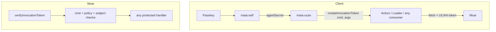

# maia-ucan — Generic Capabilities Layer

**Note:** The CoValue-as-token implementation (Model B) is the current design. See [ucan_maia_master.plan.md](.cursor/plans/ucan_maia_master.plan.md) for the consolidated plan. Capability schema: **°Maia/schema/capability**. This plan is retained for JWT-style UCAN interop reference (deferred).

## Problem Statement

MaiaOS needs a **generic, reusable capabilities/access-control solution** built on its infrastructure (maia-self, cojson, maia-db, maia-engines). Today the moai LLM endpoint is unauthenticated; tomorrow we need to protect CRUD, file access, agent APIs, etc. **maia-ucan** provides one shared layer for all capability-based auth across MaiaOS. **Goal: 100% UCAN spec compliance** in field names, principal format, and semantics — while using a **cojson-native implementation** (no CID, DAG-CBOR, IPLD).

## Success Criteria

- **Generic**: maia-ucan is reusable for any capability/command — not LLM-specific
- **Desirable**: First use case (LLM) locked; future endpoints plug in the same way
- **Spec compliance**: UCAN field names, did:key principals, envelope semantics 1:1
- **Feasible**: Cojson AgentSecret → did:key + signed invocation; moai verifies via Ed25519
- **Viable**: maia-ucan maintainable; integrates with maia-db, maia-engines, maia-schemata

## Design Principle: Fully Generic Capabilities

maia-ucan is **not** an LLM auth library. It is the **shared capability/access-control layer** for all of MaiaOS:

- **Core API**: `createInvocationToken(cmd, args, ...)`, `verifyInvocationToken(token, { allowedCmd, ... })`
- **Consumers**: LLM, CRUD, file, agent APIs, custom commands — all use the same primitives
- **Server**: Each endpoint configures `allowedCmd` and optional `isSubjectAuthorized`; no endpoint-specific logic in maia-ucan
- **Client**: `os.getCapabilityToken({ cmd, args })` — one API for any capability

---

## Part 1: UCAN Spec 1:1 Field Adoption

Adopt UCAN spec fields **exactly** as defined. No renaming.

### Invocation Payload (ucan/inv)


| Field   | Spec Type     | Required | maia-ucan                                            |
| ------- | ------------- | -------- | ---------------------------------------------------- |
| `iss`   | DID           | Yes      | did:key (from Ed25519 pubkey)                        |
| `sub`   | DID           | Yes      | did:key (same for self-invocation)                   |
| `aud`   | DID           | No       | Omit when sub = executor                             |
| `cmd`   | String        | Yes      | Any: `/llm/chat`, `/crud/read`, `/file/upload`, etc. |
| `args`  | {String: Any} | Yes      | Command-specific (e.g. `{}`, `{ uri }`, etc.)        |
| `prf`   | [&Delegation] | Yes      | `[]` for self-invocation                             |
| `nonce` | Bytes         | Yes      | 12 random bytes, base64url                           |
| `exp`   | Integer       | null     | Yes                                                  |
| `iat`   | Integer       | No       | Optional                                             |
| `meta`  | {String: Any} | No       | See below                                            |
| `cause` | &Receipt      | No       | Future                                               |


### Delegation Payload (ucan/dlg) — Future


| Field                         | Spec          | maia-ucan             |
| ----------------------------- | ------------- | --------------------- |
| `iss`                         | DID           | did:key               |
| `aud`                         | DID           | did:key               |
| `att`                         | Attestations  | Array of capabilities |
| `prf`                         | [&Delegation] | co-id refs (not CID)  |
| `exp`, `nbf`, `nonce`, `meta` | As spec       | Same                  |


### meta Field (Cojson-Native Extensions)

UCAN spec allows arbitrary `meta`. We use namespaced keys for MaiaOS:

```
meta: {
  "maia/accountID": "co_z...",   // For humans registry lookup (cojson account)
  "maia/pub": "<base64url>"     // Optional: raw Ed25519 pubkey for verification
}
```

- `iss`/`sub` = did:key → signature verification via DID resolution (we derive pubkey from did:key)
- `maia/accountID` → isHumanAccount(registry) lookup

---

## Part 2: Deterministic co-id DID (did:key)

### Derivation

**did:key** is deterministically derived from the Ed25519 public key. Same agentSecret → same did:key.

**Format (W3C did:key):**

```
did:key:z + base58btc(multicodec_ed25519 + pubkey_32bytes)
```

- Multicodec for Ed25519 pubkey: `0xed 0x01` (uvarint)
- Input: 2 + 32 = 34 bytes
- base58btc: Use `@scure/base` base58 (same alphabet as base58btc)

**Implementation:**

```javascript
// libs/maia-ucan/src/did-key.js
import { base58 } from '@scure/base';

const MULTICODEC_ED25519_PUBKEY = new Uint8Array([0xed, 0x01]);

export function publicKeyToDidKey(publicKeyBytes) {
  const multicodec = new Uint8Array(34);
  multicodec.set(MULTICODEC_ED25519_PUBKEY, 0);
  multicodec.set(publicKeyBytes, 2);
  return `did:key:z${base58.encode(multicodec)}`;
}

export function didKeyToPublicKey(didKey) {
  if (!didKey.startsWith('did:key:z')) throw new Error('Invalid did:key');
  const decoded = base58.decode(didKey.slice(9)); // 9 = "did:key:z".length
  if (decoded[0] !== 0xed || decoded[1] !== 0x01) throw new Error('Not Ed25519');
  return decoded.slice(2);
}
```

### Principal Mapping


| UCAN Field            | Source    | Value                                                              |
| --------------------- | --------- | ------------------------------------------------------------------ |
| `iss`                 | Derived   | `publicKeyToDidKey(ed25519VerifyingKey(signerSecretBytes))`        |
| `sub`                 | Same      | Same (self-invocation: iss = sub)                                  |
| `aud`                 | Omit      | When executor = subject                                            |
| `meta.maia/accountID` | maia-self | `idforHeader(accountHeaderForInitialAgentSecret(...))` → `co_z...` |


**Bidirectional**: did:key ↔ Ed25519 pubkey. No registry. 100% compatible with UCAN/DID ecosystem.

---

## Part 3: maia-self Crypto Pipeline (Reference)

```
PRF(passkey, salt) → prfOutput (32 bytes)
  → agentSecretFromSecretSeed(prfOutput)
  → AgentSecret = "sealerSecret_z{base58}/signerSecret_z{base58}"

AgentSecret → signerSecret = split("/")[1]
  → base58.decode(signerSecret.slice(14))
  → signerSecretBytes (32) = Ed25519 signing key

signerSecretBytes → ed25519VerifyingKey()
  → publicKeyBytes (32)
  → publicKeyToDidKey(publicKeyBytes)
  → did:key

AgentSecret + crypto → accountHeaderForInitialAgentSecret → idforHeader
  → accountID (co_z...)
```

**Signing arbitrary bytes:**

```javascript
import { ed25519Sign } from 'cojson-core-wasm';
// signerSecretBytes = base58.decode(agentSecret.split("/")[1].slice(14))
const sig = ed25519Sign(signerSecretBytes, messageBytes);
```

---

## Part 4: Cojson-Native Encoding (vs Spec DAG-CBOR)


| Spec                 | maia-ucan                                          |
| -------------------- | -------------------------------------------------- |
| Envelope             | DAG-CBOR `[sig, { h, ucan/<tag>@<ver>: payload }]` |
| Encoding for signing | DAG-CBOR                                           |
| CID / &Delegation    | CID, base58btc                                     |
| nonce                | `{"/": {"bytes": "<base64>"}}`                     |
| Transport            | IPLD                                               |


**Canonical JSON**: RFC 8785 or equivalent (sorted keys, no extra whitespace). Use `JSON.stringify(payload, Object.keys(payload).sort())` pattern or a small canonicalizer.

---

## Part 5: Architecture Integration

### maia-db

- [libs/maia-db](libs/maia-db): Schema resolution, CoCache, MaiaDB, resolve
- maia-ucan uses maia-schemata for validation; maia-db for runtime resolve if needed (e.g. schema refs)
- No direct maia-db dependency in maia-ucan for MVP; maia-schemata for `°Maia/schema/ucan/`*

### maia-engines

- [libs/maia-engines](libs/maia-engines): Actors, agents, db, schemata
- Client-side: loader → runtime → actors; actors call `os.getCapabilityToken({ cmd, args })` — generic for any capability
- maia-ucan is used by maia-actors, maia-loader, and any MaiaOS component that needs capability auth

### Generic Use Cases (maia-ucan consumers)


| Consumer           | cmd                              | Purpose                            |
| ------------------ | -------------------------------- | ---------------------------------- |
| LLM chat           | `/llm/chat`                      | First use case — lock LLM endpoint |
| CRUD (future)      | `/crud/read`, `/crud/mutate`     | Data access                        |
| File (future)      | `/file/upload`, `/file/download` | Storage                            |
| Agent API (future) | `/agent/invoke`                  | Agent invocation                   |
| Custom             | Any `/`-delimited                | Extensible                         |


### Data Flow (Generic)




---

## Part 6: Implementation Milestones

### Milestone 0: Capture Current State & System Audit

- Read [services/moai/src/index.js](services/moai/src/index.js) — handleLLMChat
- Read [libs/maia-actors/src/os/ai/function.js](libs/maia-actors/src/os/ai/function.js) — LLM fetch
- Read [libs/maia-self](libs/maia-self), [libs/maia-loader](libs/maia-loader)
- Map maia-schemata, maia-db resolve
- Document: moai getRegistriesId, getCoIdByPath, humans registry

**Output**: Audit report

---

### Milestone 1: Create maia-ucan Package (Generic)

**Structure:**

```
libs/maia-ucan/
├── package.json    # deps: cojson, @MaiaOS/schemata, cojson-core-wasm
├── README.md
└── src/
    ├── index.js       # createInvocationToken, verifyInvocationToken (core generic API)
    ├── did-key.js     # publicKeyToDidKey, didKeyToPublicKey
    ├── cojson-signer.js
    ├── envelope.js    # canonical JSON, JWT-style encode/decode
    ├── capability.js  # Capability.from (spec-aligned)
    ├── invocation.js  # build/parse invocation payloads
    └── types.js
```

**Core API (generic):**

- `createInvocationToken(agentSecret, accountID, { cmd, args, exp, meta? })` → JWT-style token
- `verifyInvocationToken(token, { now, allowedCmd?, isSubjectAuthorized? })` → payload or throws

**Field alignment**: All payloads use exact UCAN names: `iss`, `aud`, `sub`, `att`, `cmd`, `args`, `prf`, `nonce`, `exp`, `nbf`, `iat`, `meta`.

---

### Milestone 2: Cojson-Signer, did:key, Generic Token Logic

**cojson-signer.js:**

1. `signerSecret = agentSecret.split("/")[1]`
2. `signerSecretBytes = base58.decode(signerSecret.slice(14))`
3. `ed25519Sign(signerSecretBytes, messageBytes)` via cojson-core-wasm
4. `ed25519VerifyingKey(signerSecretBytes)` for pubkey

**did-key.js:** `publicKeyToDidKey`, `didKeyToPublicKey` per Part 2.

**createInvocationToken(agentSecret, accountID, { cmd, args = {}, exp, meta? }):**

- Payload: `{ iss, sub, cmd, args, prf: [], nonce, exp, meta: { "maia/accountID": accountID, ...meta } }`
- `iss` = `sub` = `publicKeyToDidKey(getPublicKey(agentSecret))`
- Sign canonical JSON, return JWT-style token

**verifyInvocationToken(token, { now, allowedCmd?, isSubjectAuthorized? }):**

- Decode token, extract payload
- Resolve `iss` did:key → pubkey via `didKeyToPublicKey`
- Verify signature with pubkey
- Check `exp`, optional `allowedCmd` (e.g. `/llm/chat` or prefix `/llm`), `iss === sub`
- Optional `isSubjectAuthorized(payload)` — e.g. isHumanAccount for LLM

---

### Milestone 3: Moai Integration — Protect LLM (First Consumer)

- Create `verifyForLLMChat(token, { now, isHumanAccount })` — wraps `verifyInvocationToken` with `allowedCmd: "/llm/chat"`, cmd hierarchy check, isHumanAccount
- Before handleLLMChat: `Authorization: UCAN <token>` or `Bearer <token>`
- Pattern reusable: other endpoints add their own `verifyForX` or use `verifyInvocationToken` directly with their `allowedCmd` and `isSubjectAuthorized`

---

### Milestone 4: Client Integration — Generic getCapabilityToken

- Loader/Runtime: expose `os.getCapabilityToken({ cmd, args })` — generic, uses agentSecret
- maia-actors (AI function): `getCapabilityToken({ cmd: "/llm/chat", args: {} })` before LLM fetch
- Future consumers: same API for other commands

---

### Milestone 5: Documentation & Final Review

- README: maia-ucan as generic capabilities layer; UCAN spec alignment; did:key; usage for LLM and future commands
- Document schema naming `°Maia/schema/ucan/`*

---

## Spec Sources

- [UCAN Specification](https://ucan.xyz/specification/)
- [UCAN Delegation](https://ucan.xyz/delegation/)
- [UCAN Invocation](https://ucan.xyz/invocation/)
- [did:key Method](https://w3c-ccg.github.io/did-method-key/)

