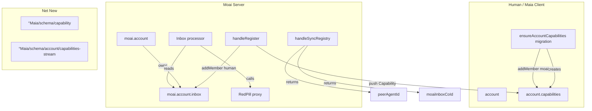
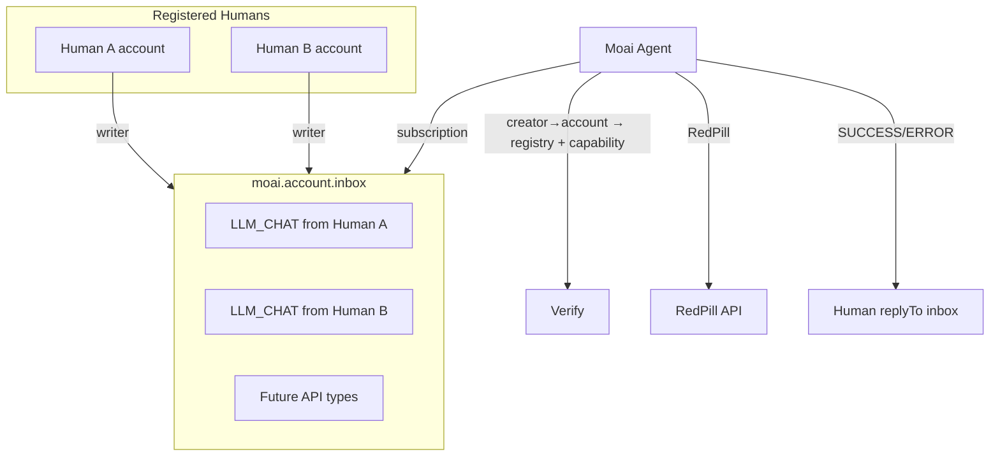

# UCAN MaiaOS — Unified Execution Plan

## 0. Problem Statement & Success Criteria

### Problem Statement

**How might we** secure MaiaOS API access (LLM, future CRUD/file/agent) **so that** only authorized humans can invoke, provenance is cryptographically verifiable, and the system stays cojson-native?

**Fundamental problem:** LLM endpoint is unauthenticated. We need capability-based auth with invoker binding (executor validates who is making the request, not just that a capability exists).

### Success Criteria


| Criterion     | Definition                                                                            |
| ------------- | ------------------------------------------------------------------------------------- |
| **Desirable** | Registered humans get LLM access; unregistered cannot. Clear UX (no broken flows).    |
| **Feasible**  | Cojson-native: capabilities as CoValues, inbox transport, session→account provenance. |
| **Viable**    | Extensible to future APIs; maintainable; 100% UCAN semantics where applicable.        |


### Root Cause (Architectural)

The root cause is transport + provenance: HTTP + co-id cannot prove invoker. Inbox + writer membership + creator metadata can. Centralized moai inbox is the architectural upgrade.

---

## 0b. Starting Point: Zero Capability Infrastructure

**We have none of the following.** The plan builds everything from scratch.


| Component                      | Exists today? | Current state                                                                       |
| ------------------------------ | ------------- | ----------------------------------------------------------------------------------- |
| account.capabilities           | No            | Human accounts have registries, profile; no capabilities stream                     |
| Capability schema              | No            | Not defined                                                                         |
| moai.account.inbox             | No            | Moai has account (agent worker) but no API inbox                                    |
| syncRegistry peerAgentId       | No            | Returns only `registries`, `°Maia`                                                  |
| syncRegistry moaiInboxCoId     | No            | Not returned                                                                        |
| Capability CoMap               | No            | Nothing                                                                             |
| LLM auth                       | No            | handleLLMChat accepts any POST; no verification                                     |
| Client capability check        | No            | @ai/chat does plain fetch, no headers                                               |
| ensureAccountCapabilities      | No            | Boot is linkAccountToRegistries → autoRegisterHuman (no migration)                  |
| Moai inbox processor           | No            | Moai does not process inbox messages for API                                        |
| createAndPushMessage / deliver | Yes           | Exists in maia-db, InboxEngine — for actor inboxes                                  |
| handleRegister                 | Yes           | Creates Human CoMap, adds to registry; does NOT push capability or add inbox writer |


**Current LLM flow:** Client fetch → POST /api/v0/llm/chat → handleLLMChat → RedPill. No auth. Anyone can call.

---

## 1. Full Architecture from Scratch

### 1.1 Component Inventory (All New or Modified)




### 1.2 Creation Order & Dependencies


| Step | Who                       | Creates                                                           | Depends on                                         |
| ---- | ------------------------- | ----------------------------------------------------------------- | -------------------------------------------------- |
| 1    | Moai boot                 | moai.account.inbox (CoStream in moai's account group)             | agentWorker exists, schema for inbox items         |
| 2    | Schema seed               | °Maia/schema/capability, °Maia/schema/account/capabilities-stream | Schema registry                                    |
| 3    | syncRegistry              | Returns peerAgentId (=worker.account.id), moaiInboxCoId           | moai inbox exists                                  |
| 4    | linkAccountToRegistries   | account.registries                                                | syncRegistry                                       |
| 5    | ensureAccountCapabilities | account.capabilities stream, addMember(moaiAgentId,'writer')      | syncRegistry (for peerAgentId), account.registries |
| 6    | autoRegisterHuman         | POST /register                                                    | linkAccountToRegistries done                       |
| 7    | handleRegister            | Human CoMap, Capability, add human to moai.inbox writers          | account.capabilities exists, moai.inbox exists     |
| 8    | Inbox processor           | Subscribes to moai.inbox, processes LLM_CHAT                      | moai.inbox exists                                  |


**Critical path:** Moai must create moai.account.inbox before syncRegistry can return moaiInboxCoId. Migration (ensureAccountCapabilities) needs peerAgentId from syncRegistry — so syncRegistry must return it before migration runs. Boot order: linkAccountToRegistries (gets peerAgentId + moaiInboxCoId) → ensureAccountCapabilities (uses peerAgentId) → autoRegisterHuman.

### 1.3 Moai Bootstrap: Creating moai.account.inbox

**When:** After `agentWorker = { node, account, peer, dataEngine }` is set, before syncRegistry can be called.

**Where:** services/moai/src/index.js — add `ensureMoaiInbox(agentWorker)` after schemaMigration, before seed.

**Logic:**

1. Check if moai.account already has `inbox` (or a well-known prop like `apiInbox`) set. If yes, skip.
2. Get moai's account group (cojson: account lives in a group, or we create a group for moai's account resources).
3. Create CoStream with schema for API request messages (or reuse existing message schema).
4. Store stream co-id: `moaiAccount.set('apiInbox', streamId)` or equivalent. If account is a CoMap with fixed shape, we may need a separate root-level store for moaiInboxCoId — audit will clarify.
5. Export moaiInboxCoId for handleSyncRegistry (e.g. `agentWorker.moaiInboxCoId = ...`).

**Alternative:** Moai's account might already have a structure. If moai uses a CoMap for account, we add `account.set('apiInbox', streamId)`. The audit must confirm moai account shape.

### 1.3b Actor-Based Upgrade: Use Full MaiaOS Actor Stack (Preferred)

**Reuse existing actor architecture instead of a custom inbox processor.** The moai API becomes a proper service actor that runs on the server.

**Existing stack:** ActorEngine, ProcessEngine, InboxEngine, DataEngine. Actors have: config (process, interface, inbox), spawnActor, processEvents, deliverEvent. Service actors like °Maia/actor/services/spark follow this pattern.

**New actor: °Maia/actor/services/moai/api** (moai.agent / capabilities service actor)


| Component              | Role                                                                                                        |
| ---------------------- | ----------------------------------------------------------------------------------------------------------- |
| **Actor config**       | process, interface, inbox. No view (headless). Same shape as °Maia/actor/services/spark                     |
| **Interface**          | LLM_CHAT: { messages, model?, temperature?, replyTo }                                                       |
| **Process**            | handlers: { LLM_CHAT: [{ function: true }] } → executableFunction                                           |
| **executableFunction** | Capability verify (creator→account, account.capabilities) → RedPill proxy → deliverEvent(replyTo, 'SUCCESS' |
| **Inbox**              | Created by seed (or moai bootstrap). Lives in moai's scope. Humans added as writers at register             |


**Flow:**

1. Client: `deliverEvent(moaiApiActorCoId, 'LLM_CHAT', { messages, model, replyTo: callerActorCoId })` — same as any actor
2. InboxEngine.deliver resolves moaiApiActorCoId → inbox, pushes message
3. Message syncs to moai
4. Moai runs minimal actor runtime: spawn moai API actor (headless), watch inbox, processEvents on new message
5. ProcessEngine routes LLM_CHAT → executableFunction.execute
6. executableFunction: verify capability, RedPill, deliverEvent(callerId, 'SUCCESS', { content, model })

**Benefits:**

- Reuses InboxEngine, ProcessEngine, deliverEvent, ask protocol
- Client uses same deliverEvent pattern — no special createAndPushMessage path
- Extensible: add new event types (LLM_*, CRUD_*, etc.) via interface + handlers
- Consistent with °Maia/actor/services/* pattern

**Moai runtime addition:** Moai currently has peer, dataEngine. Add ActorEngine, ProcessEngine, InboxEngine (minimal set). Or a slim "ServerActorRuntime" that: (1) spawns headless moai API actor, (2) subscribes to its inbox, (3) calls processEvents on new messages. Browser Runtime.watchInbox does this — moai needs equivalent.

**Seed:** Add °Maia/actor/services/moai/api to getSeedConfig (actor, process, interface, inbox). Inbox created during seed; group allows addMember(human) at register. Or: moai creates actor config + inbox at bootstrap if not using seed for this actor.

**syncRegistry:** Returns moaiApiActorCoId (not raw inbox co-id). Client uses it for deliverEvent target. InboxEngine.resolveInboxForTarget(moaiApiActorCoId) resolves to inbox.

---

## 1.4 Complete Integration Logic

### Boot Flow (Maia Client)

```
1. Sign in → MaiaOS.boot({ node, account, syncDomain, getMoaiBaseUrl })
2. linkAccountToRegistries(maia)
   - fetch(getMoaiBaseUrl() + '/syncRegistry')
   - data = { registries, °Maia, peerAgentId, moaiInboxCoId }  ← NEW
   - account.set('registries', data.registries)
   - STORE peerAgentId, moaiInboxCoId for later (pass to migration / runtime)
3. ensureAccountCapabilities(maia)
   - IF account.registries exists AND !account.get('capabilities'):
     - peerAgentId = from step 2 (or re-fetch syncRegistry)
     - group = createGroup (human is admin)
     - group.addMember(peerAgentId, 'writer')
     - stream = group.createStream({ $schema: '°Maia/schema/account/capabilities-stream' })
     - account.set('capabilities', stream.id)
4. autoRegisterHuman(maia)
   - fetch(getMoaiBaseUrl() + '/register', { type: 'human', accountId, profileId })
```

### Register Flow (Moai)

```
1. Receive POST /register { type: 'human', accountId, profileId }
2. Create Human CoMap { account: accountId, profile: profileId }; add to registry
3. Load account CoValue by accountId
4. capabilitiesStreamCoId = account.get('capabilities')
5. IF capabilitiesStreamCoId:
   - Create Capability CoMap { cmd: '/llm/chat', exp: now+3600, accountId }
   - Append capability co-id to capabilitiesStreamCoId
   - moaiInboxGroup.addMember(accountId, 'writer')  ← Grant human write to moai inbox
6. Return success
```

### LLM Request Flow (End-to-End)

**Actor-based (preferred):**

```
1. Human's @ai/chat process runs in browser
2. @ai/chat process: instead of fetch(), do deliverEvent(moaiApiActorCoId, 'LLM_CHAT', { messages, model, replyTo: self })
3. InboxEngine.deliver(moaiApiActorCoId, { type: 'LLM_CHAT', payload, source, target, replyTo })
4. Message syncs to moai via cojson
5. Moai ServerActorRuntime: processEvents(moaiApiActorCoId)
   - ProcessEngine routes to executableFunction
   - executableFunction: creator→account, verify capability, RedPill, deliverEvent(replyTo, 'SUCCESS'|'ERROR', payload)
6. Client: SUCCESS/ERROR arrives in @ai/chat actor's inbox; process continues (ask protocol)
```

**Raw inbox (fallback):** Same as before but with createAndPushMessage + custom processor.

### Data Flow: Where Does Each Value Come From?


| Value                     | Source                                                                         |
| ------------------------- | ------------------------------------------------------------------------------ |
| peerAgentId               | worker.account.id (moai's agent account co-id)                                 |
| moaiApiActorCoId          | Seeded actor config co-id; syncRegistry returns it (actor-based)               |
| moaiInboxCoId             | Actor inbox; resolveInboxForTarget(moaiApiActorCoId) or raw stream (fallback)  |
| accountId (human)         | maia.id.maiaId or account from sign-in                                         |
| replyTo                   | Process actor's inbox co-id (actor.inboxCoId); process waits for SUCCESS/ERROR |
| creator session→account   | Audit deliverable: cojson readInboxWithSessions → _sessionID → ?               |
| moaiApiActorCoId (client) | From syncRegistry at boot; pass to deliverEvent as target (actor-based)        |


---

### 1.5 Centralized Moai Inbox (Diagram)

**One inbox for all API requests.** Moai grants each registered human write access to its inbox. No per-account request streams. No HTTP header.




### 1.6 UCAN Spec Alignment (100% Semantics)


| UCAN Concept            | MaiaOS Cojson Implementation                                       |
| ----------------------- | ------------------------------------------------------------------ |
| **Delegation**          | Capability CoMap in account.capabilities stream                    |
| **Subject (sub)**       | `accountId` in Capability CoMap                                    |
| **Command (cmd)**       | `cmd` field, e.g. `/llm/chat`                                      |
| **Expiry (exp)**        | `exp` field, Unix seconds                                          |
| **Nonce / Uniqueness**  | CoValue co-id + CoStream tx/madeAt (implicit)                      |
| **Executor validation** | At execution: (1) capability valid, (2) invoker binding            |
| **Principal**           | co-id for account (cojson-native); did:key not required            |
| **Invoker binding**     | Provenance: message creator session→account; only writers can push |


### 1.7 Executor Validation (Rock-Solid)

From UCAN Security Considerations:

> "The executor MUST verify the ownership of any external resources at execution time. Having the Executor be the resource itself is RECOMMENDED."

**Moai (executor) must validate:**

1. **Capability validity** — Signed (cojson), not expired, cmd matches, accountId in registry
2. **Invoker binding** — Requester IS the account. Proven by: message in moai inbox, only registered humans are writers; message creator/session resolves to account

**Provenance:** Message created in moai.inbox. Only writers can append. Writers = moai + registered human accounts. Creator session→account gives invoker. No client-provided source trusted.

---

## 2. Data Model

### 2.1 CoValues and Permissions


| CoValue                | Created by        | Signed by | Group permissions                      |
| ---------------------- | ----------------- | --------- | -------------------------------------- |
| account.capabilities   | Human (migration) | Human     | Human admin; moai writer               |
| Capability CoMap       | Moai              | Moai      | Moai creates; human reader             |
| **moai.account.inbox** | Moai              | Moai      | Moai admin; **each human writer**      |
| API request message    | Human             | Human     | Created in moai inbox by human session |


### 2.2 Storage Layout


| Path                         | Description                              |
| ---------------------------- | ---------------------------------------- |
| account.registries           | account.get('registries')                |
| account.capabilities         | Capabilities CoStream co-id              |
| moai.account.inbox           | CoStream for API requests (single inbox) |
| registries.humans            | Human CoMaps by accountId                |
| human.account, human.profile | Account and profile refs                 |


### 2.3 Schemas

**°Maia/schema/capability** (CoMap)

```json
{
  "cmd": "string",
  "exp": "integer",
  "accountId": "string"
}
```

- `accountId` = UCAN `sub` (subject)
- `cmd` = UCAN command
- `exp` = UCAN expiry (Unix seconds)

**°Maia/schema/account/capabilities-stream** (CoStream)

- Items: $co refs to Capability CoMaps

**Inbox message** (reuse existing message schema; type discriminator)

- type: `LLM_CHAT` | future API types
- payload: { messages, model?, temperature? } for LLM_CHAT
- source: human account co-id (set by client; verified via writer membership + creator)
- replyTo: actor/process co-id for SUCCESS/ERROR response

---

## 3. Flow — Full Round-Trip

### 3.1 Boot / Migration

```
linkAccountToRegistries
  → ensureAccountCapabilities
    → fetch peerAgentId from GET /syncRegistry
    → create capabilities stream, group.addMember(moaiAgentId, 'writer')
    → account.set('capabilities', stream.id)
  → autoRegisterHuman
```

### 3.2 Register (Human → Moai)


| Step | Who   | Action                                                                               |
| ---- | ----- | ------------------------------------------------------------------------------------ |
| 1    | Human | POST /register { type: 'human', accountId, profileId }                               |
| 2    | Moai  | Create Human CoMap { account, profile }                                              |
| 3    | Moai  | Load account, get account.capabilities                                               |
| 4    | Moai  | Create Capability CoMap { cmd: '/llm/chat', exp, accountId }; append co-id to stream |
| 5    | Moai  | **Add human account as writer to moai.account.inbox group**                          |
| 6    | Moai  | Add Human to registry                                                                |


**Revocation (future):** When human is removed from registry, remove their account from moai.inbox writers. Capabilities in stream expire by `exp`; optional: add explicit revocation check.

### 3.3 API Request (e.g. LLM Chat)


| Step | Who   | Action                                                                                       |
| ---- | ----- | -------------------------------------------------------------------------------------------- |
| 1    | Human | Push message to moai.inbox: { type: 'LLM_CHAT', payload: { messages, model, ... }, replyTo } |
| 2    | Moai  | New message in inbox; get creator session→account                                            |
| 3    | Moai  | Verify account in registry; load account.capabilities; check valid /llm/chat                 |
| 4    | Moai  | Proxy to RedPill; get response                                                               |
| 5    | Moai  | Push SUCCESS { content, model } or ERROR { errors } to replyTo                               |


---

## 4. Implementation Reference

### 4.1 File Touchpoints


| Layer                  | File                         | Change                                                                                                 |
| ---------------------- | ---------------------------- | ------------------------------------------------------------------------------------------------------ |
| **syncRegistry**       | services/moai/src/index.js   | Add peerAgentId, **moaiApiActorCoId** to response                                                      |
| **Moai bootstrap**     | services/moai, agent seed    | Seed or create °Maia/actor/services/moai/api; ensure inbox; add ServerActorRuntime                     |
| **Migration**          | libs/maia-db src/migrations  | ensureAccountCapabilities                                                                              |
| **Register**           | services/moai handleRegister | Push Capability; **add human as writer to moai API actor inbox group**                                 |
| **Moai API actor**     | libs/maia-actors (new)       | °Maia/actor/services/moai/api: process, interface, executableFunction (capability + RedPill)           |
| **ServerActorRuntime** | services/moai (new)          | Spawn moai API actor headless; watch inbox; processEvents on new message                               |
| **Client**             | libs/maia-actors os/ai       | deliverEvent(moaiApiActorCoId, 'LLM_CHAT', { messages, model, replyTo }); wait for SUCCESS/ERROR (ask) |
| **Schemas**            | libs/maia-schemata           | °Maia/schema/capability, capabilities-stream, moai/api-request                                         |


### 4.2 Creator → Account Resolution

Cojson inbox messages have `_sessionID`. Resolve session to account:

- Option A: cojson exposes session→account
- Option B: message.source = accountId, verify source is in moai.inbox writers (client sets source; we verify they're a writer—but attacker could put victim's id if they're also a writer; need cryptographic provenance)
- **Required:** Use creation metadata. `readInboxWithSessions` gives session per item. Resolve session to account via peer/cojson API. If not available, add to cojson or use convention: require message.source = accountId and verify accountId is in the set of writers AND the message was created by a session that belongs to that account. The latter requires session→account mapping.

**Implementation:** `process-inbox.js` uses `readInboxWithSessions`; messages have `_sessionID`. Cojson sessions are tied to accounts. Resolve: message._sessionID → peer's session map → accountId. If cojson does not expose this, add `getAccountForSession(sessionId)` or equivalent. Alternative: require `payload.accountId` and verify (a) accountId is a writer of moai.inbox, (b) only one session per account typically—validate creator is in that account's group. Prefer explicit session→account from cojson.

### 4.3 @ai/chat Process Change

- **Before:** executableFunction does fetch(apiUrl) — sync HTTP
- **After:** executableFunction does deliverEvent(moaiApiActorCoId, 'LLM_CHAT', { messages, model, replyTo: actor.id }). Process waits for SUCCESS/ERROR via ask protocol (same as other ask targets). moaiApiActorCoId from syncRegistry.

### 4.4 HTTP Endpoint

- **Deprecate/remove** POST /api/v0/llm/chat — all LLM requests go through moai inbox. No X-Capability-CoId header.

---

## 5. UCAN Nonce / Replay

From UCAN spec: nonce REQUIRED in delegation; ensures unique CID; prevents replay.

**Our model:** Each Capability CoMap = unique CoValue (unique co-id). CoStream append has tx, madeAt. Cojson signatures prevent forgery. Co-id + tx = implicit nonce. Multi-use until exp.

---

## 6. Summary Decisions


| Decision                  | Choice                                                                                                                                                    |
| ------------------------- | --------------------------------------------------------------------------------------------------------------------------------------------------------- |
| Transport                 | **moai.account.inbox** — centralized, no HTTP for API                                                                                                     |
| Invoker binding           | Provenance via creator session→account; only writers push                                                                                                 |
| Capabilities              | account.capabilities CoStream; moai pushes on register                                                                                                    |
| Moai inbox writers        | Moai + each registered human (added on register)                                                                                                          |
| UCAN alignment            | Semantics: sub=accountId, cmd, exp; executor validation                                                                                                   |
| Principal                 | co-id (cojson-native)                                                                                                                                     |
| Multi-use                 | Yes, until exp                                                                                                                                            |
| **Capability revocation** | When human removed from registry: remove from moai.inbox writers; existing capabilities in stream expire naturally (exp) or add explicit revocation check |


---

## 7. Implementation Milestones (Design Thinking)

### Milestone 0: Capture Current State & System Audit

**CRITICAL: MUST be completed before all other milestones.**

**Audit checklist:**

- Identify all relevant files: moai index.js, handleLLMChat, handleRegister, handleSyncRegistry; maia-actors os/ai; maia-db process-inbox, message-helpers, createAndPushMessage; maia-loader boot flow; maia main.js (linkAccountToRegistries, autoRegisterHuman)
- Map full dependency graph (moai → loader, loader → db/engines/actors)
- Read process-inbox.js, readInboxWithSessions, message schema
- **Creator→account resolution:** Does cojson expose session→account? Where? Document: `_sessionID` on messages; peer session map; getAccountForSession or equivalent. **Deliverable: Creator→account resolvable: YES/NO + how**
- Map current LLM flow: @ai/chat → fetch → handleLLMChat (no auth)
- Document moai bootstrap, agent worker, account creation
- Document current inbox patterns (InboxEngine, deliver, createAndPushMessage)
- **Moai account structure:** How is moai's account (agentWorker.account) structured? Can we set account.set('apiInbox', streamId)? Or separate store for moaiInboxCoId?
- **Migration context:** Where do migrations run? Can they fetch syncRegistry? How does getMoaiBaseUrl reach them?
- **Service actor seed pattern:** How does °Maia/actor/services/spark get its inbox/group? Can we addMember at runtime? Review seed-config.js
- Create audit report with: file inventory, dependency graph, creator→account resolution, moai account shape, migration context, integration points

**Human checkpoint:** Present audit findings before proceeding to e1.

---

### Milestone 1: Schema + syncRegistry + Moai API actor

**Implementation:**

- Add °Maia/schema/capability (cmd, exp, accountId)
- Add °Maia/schema/account/capabilities-stream
- Register schemas in seed
- Add °Maia/actor/services/moai/api to seed (actor, process, interface, inbox) — headless service actor
- handleSyncRegistry: add peerAgentId, moaiApiActorCoId to response
- Moai bootstrap: ensure moai API actor seeded (inbox exists); or create at runtime if not using seed

**Cleanup & migration:** N/A (net new).

**Human checkpoint:** Verify syncRegistry returns new fields; schemas registered.

---

### Milestone 2: ensureAccountCapabilities

**Implementation:**

- Migration: when account has registries and !account.get('capabilities'), fetch peerAgentId from syncRegistry
- Create capabilities stream, group.addMember(moaiAgentId, 'writer'), account.set('capabilities', stream.id)
- Boot order: linkAccountToRegistries → ensureAccountCapabilities → autoRegisterHuman

**Cleanup & migration:** N/A (net new).

**Human checkpoint:** Verify migration runs; account.capabilities set for test account.

---

### Milestone 3: handleRegister

**Implementation:**

- After creating Human CoMap: load account, get account.capabilities
- Create Capability CoMap, append co-id to stream
- **Add human account as writer to moai API actor inbox group**
- Add Human to registry

**Cleanup & migration:** N/A.

**Human checkpoint:** Register human; verify capability in stream; verify human is writer on moai inbox.

---

### Milestone 4: Moai API actor executableFunction + ServerActorRuntime

**Implementation:**

- Create executableFunction for °Maia/actor/services/moai/api: capability verify (creator→account, account.capabilities), RedPill proxy, deliverEvent(replyTo, 'SUCCESS'|'ERROR')
- ServerActorRuntime on moai: spawn moai API actor headless, watch inbox, processEvents on new message
- Wire ActorEngine/ProcessEngine/InboxEngine (or minimal equivalent) for moai's single service actor

**Root-cause check:** Does this solve invoker binding? Yes—provenance from creator.

**Cleanup & migration:** N/A.

**Human checkpoint:** Push test LLM_CHAT to moai inbox; verify response to replyTo.

---

### Milestone 5: Client + remove HTTP

**Implementation:**

- @ai/chat executableFunction: get moaiApiActorCoId from syncRegistry; deliverEvent(moaiApiActorCoId, 'LLM_CHAT', { messages, model, replyTo: actor.id })
- Process waits for SUCCESS/ERROR via ask protocol (same as other ask targets)
- Handle tool calls loop (same as today, but LLM turns go via inbox)

**Cleanup & migration:**

- **Remove** POST /api/v0/llm/chat handler
- **Remove** handleLLMChat or repurpose for non-LLM if needed
- Update all client call sites to use inbox
- Verify 100% migration—no HTTP LLM path remains

**Manual browser debugging:**

- Open app; trigger @ai/chat
- Console: no errors; real co-ids
- Network: no fetch to /api/v0/llm/chat
- Verify LLM response arrives via inbox

**Human checkpoint:** Full manual user test of LLM chat flow.

---

### Milestone 6: Documentation & Final Review

- Update developer docs (capability flow, moai inbox, UCAN alignment)
- Update creator docs if user-facing
- UCAN alignment checklist document
- Final human approval

---

## 8. File Structure

```
libs/maia-schemata/src/              # New: °Maia/schema/capability, capabilities-stream
libs/maia-actors/src/services/moai/  # New: °Maia/actor/services/moai/api (actor, process, interface, executableFunction)
libs/maia-actors/src/seed-config.js  # Add moai API actor to getSeedConfig
libs/maia-db/src/migrations/         # ensureAccountCapabilities
services/moai/src/index.js           # handleSyncRegistry, handleRegister, ServerActorRuntime, remove handleLLMChat
libs/maia-actors/src/os/ai/          # executableFunction: deliverEvent instead of fetch
libs/maia-loader/                    # Boot order, syncRegistry consumption (moaiApiActorCoId)
libs/maia-docs/developers/           # Capability auth, moai API actor docs
```

---

## 9. Manual Testing Strategy


| Phase     | Activity                                        |
| --------- | ----------------------------------------------- |
| After e1  | syncRegistry returns peerAgentId, moaiInboxCoId |
| After e2  | Migration creates account.capabilities          |
| After e3  | Register adds capability + inbox writer         |
| After e4  | Moai processes inbox message; RedPill called    |
| After e5  | Full LLM chat works via inbox; HTTP removed     |
| Browser   | Console: 0 errors, real co-ids. No mock data.   |
| Anti-mock | No mock_123, test_, fake_ in IDs                |


---

## 9. Risks & Mitigation


| Risk                                     | Mitigation                                                                                                                     |
| ---------------------------------------- | ------------------------------------------------------------------------------------------------------------------------------ |
| Creator→account not resolvable in cojson | Audit must answer this first. If no: design fallback (e.g. require signed payload with accountId; or per-account sub-streams). |
| Moai inbox subscription model            | Cojson sync is reactive; moai needs to poll or use cojson subscription. Audit current patterns.                                |
| Async UX (inbox vs sync fetch)           | @ai/chat process already supports ask pattern. Ensure replyTo + SUCCESS/ERROR flow is smooth.                                  |
| Capability revocation                    | Remove human from moai.inbox writers on registry remove; capabilities expire by exp.                                           |


---

## 10. Documentation Updates

- `libs/maia-docs/developers/` — capability auth, moai inbox, UCAN alignment
- `libs/maia-docs/creators/` — if user-facing
- Skip `libs/maia-docs/agents/LLM_*.md` (auto-generated)

---

## 11. Spec Sources

- [UCAN Specification](https://ucan.xyz/specification/)
- [UCAN Delegation](https://ucan.xyz/delegation/)
- [UCAN Invocation](https://ucan.xyz/invocation/)
- [Jazz Inbox API](https://jazz.tools/docs/react/server-side/communicating-with-workers/inbox)
- [Jazz Groups & Permissions](https://jazz.tools/docs/react/permissions-and-sharing/overview)

