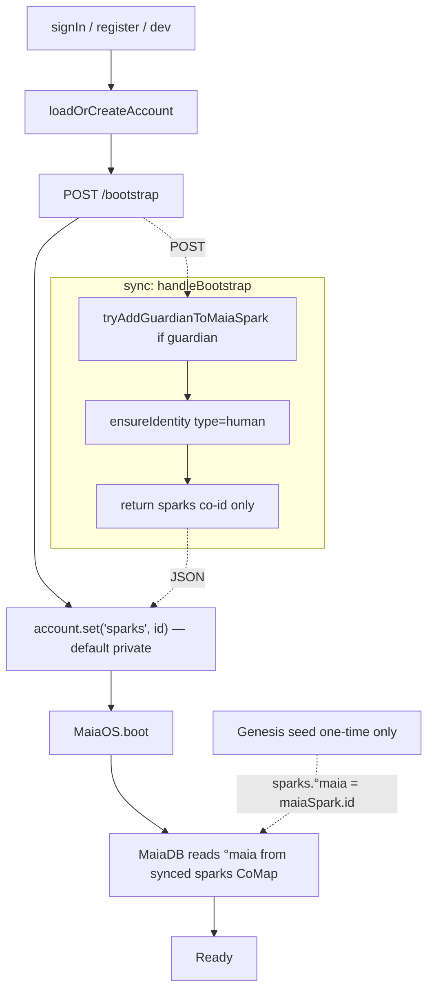

# Unified Bootstrap Handshake — Full Radical Refactor

## 1. New universal handshake: `POST /bootstrap`

One endpoint replaces `/signup` + `/register type=human` + client `anchorSparksOnSignup` + client `ensureHumanIdentityForCurrentAccount` + server `scheduleGuardianAdminPromotion`.

### Contract
- Request: `{ accountId: co_z..., profileId: co_z... }`
- Response: `{ sparks: co_z... }`

**Why only `sparks`?** The `°maia → maiaSparkCoId` mapping is written **once** during initial genesis seed ([libs/maia-seed/src/orchestration/bootstrap.js:143](libs/maia-seed/src/orchestration/bootstrap.js): `sparksRegistry.set(MAIA_SPARK, maiaSpark.id)`) and never changes. The sparks registry CoMap has `addMember('everyone', 'reader')` ([libs/maia-seed/src/orchestration/bootstrap.js:141](libs/maia-seed/src/orchestration/bootstrap.js)), so **any client that has the `sparks` co-id can load the CoMap via CoJSON sync and read `°maia` locally**. Server only hands out the pointer; the data flows through normal sync.

### Server flow (atomic, idempotent, <1s on warm server)

```javascript
async function handleBootstrap(worker, body, req) {
  const { accountId, profileId } = parseBootstrapBody(body)
  if (accountId === avenMaiaGuardian) {
    await tryAddGuardianToMaiaSpark(worker)
  }
  await worker.dataEngine.resolveSystemFactories()
  await ensureIdentity({ peer: worker.peer, dataEngine: worker.dataEngine, type: 'human', accountId, profileId })
  const sparksId = getSparksRegistryCoId(worker.account)
  return jsonResponse({ sparks: sparksId }, 200, {}, req)
}
```

Error semantics: if guardian not yet promoted, server promotes it inline (on startup, still does one-shot attempt; the deferred retry scheduler is deleted because `/bootstrap` calls do the promotion eagerly).

## 2. Account pointer privacy

CoJSON's account/group permission rules only accept `'trusting'` writes for a fixed whitelist of keys (`readKey`, `groupSealer`, `profile`, `root`, key-reveal, parent-extension, write keys) or valid role assignments. `sparks` is **not** whitelisted — a trusting write of `account.set('sparks', 'co_z…', 'trusting')` is parsed as `setRole('sparks', '<co_z…>')` and silently marked invalid.

- `account.profile` → `'trusting'` (whitelisted by CoJSON; must stay public so validation before migrations can read it).
- `account.sparks` → **default private**. Any signed-in agent holds the agentSecret and can immediately decrypt the account's readKey (sealed for their sealer secret); no cross-peer readKey sync is required for a local-first read.

### Changes
- [libs/maia-db/src/profile-bootstrap.js](libs/maia-db/src/profile-bootstrap.js): `account.set('profile', profileCoMap.id, 'trusting')` (unchanged — profile is whitelisted).
- [libs/maia-seed/src/orchestration/bootstrap.js](libs/maia-seed/src/orchestration/bootstrap.js): `account.set('sparks', sparksRegistry.id)` (default private).
- Client helper (below): `account.set('sparks', sparksId)` (default private).

## 3. `MaiaDB.resolveSystemSparkCoId` → direct read from synced CoMap

Delete the 4×20s ReactiveStore wait chain. Replace with a direct read — once `account.sparks` is anchored, the sparks CoMap syncs and `°maia` is readable locally (it was set once at genesis; never mutates):

```javascript
async resolveSystemSparkCoId() {
  if (this.systemSparkCoId?.startsWith('co_z')) return this.systemSparkCoId
  const sparksId = this.account.get('sparks')
  if (!sparksId?.startsWith('co_z')) {
    throw new Error('[MaiaDB] account.sparks not anchored. Run bootstrapAccountHandshake before booting MaiaOS.')
  }
  await ensureCoValueLoaded(this, sparksId, { timeoutMs: TIMEOUT_COVALUE_LOAD })
  const sparksContent = this.getCurrentContent(this.getCoValue(sparksId))
  const maiaSparkCoId = sparksContent?.get?.(SYSTEM_SPARK_REGISTRY_KEY)
  if (!maiaSparkCoId?.startsWith('co_z')) {
    throw new Error('[MaiaDB] sparks registry missing °maia entry.')
  }
  this.systemSparkCoId = maiaSparkCoId
  return maiaSparkCoId
}
```

Typical path: ~10-100ms (local CoJSON read after sync), worst case 5s on a cold sync. **No external handoff needed — the CoMap is the source of truth.**

## 4. Single bootstrap helper in `@MaiaOS/peer`

New [libs/maia-peer/src/bootstrap-handshake.js](libs/maia-peer/src/bootstrap-handshake.js):

```javascript
export async function bootstrapAccountHandshake(account, { syncBaseUrl, node }) {
  const accountId = account.id
  const profileId = account.get('profile')
  if (!accountId?.startsWith('co_z') || !profileId?.startsWith('co_z')) {
    throw new Error('bootstrapAccountHandshake: account id + profile required')
  }
  const res = await fetch(`${syncBaseUrl.replace(/\/$/, '')}/bootstrap`, {
    method: 'POST',
    headers: { 'Content-Type': 'application/json' },
    body: JSON.stringify({ accountId, profileId }),
  })
  if (!res.ok) throw new Error(`[Maia] /bootstrap failed: HTTP ${res.status}`)
  const { sparks } = await res.json()
  if (!sparks?.startsWith('co_z')) {
    throw new Error('[Maia] /bootstrap response missing sparks co-id')
  }
  if (account.get('sparks') !== sparks) account.set('sparks', sparks)
  const wfs = node?.syncManager?.waitForStorageSync
  if (typeof wfs === 'function') {
    await wfs.call(node.syncManager, accountId)
    await wfs.call(node.syncManager, sparks)
  }
  return { sparks }
}
```

Replaces `anchorSparksOnSignup`. Called unconditionally after every account load/create (not gated on `wasCreated`). Client does not receive `maiaSparkCoId` — it reads that from the sparks CoMap directly after sync completes (see section 3).

## 5. Unified `MaiaOS.boot` — single path

Remove the agent-mode branch in [libs/maia-runtime/src/loader.js:224-279](libs/maia-runtime/src/loader.js). Agent workers (sync server) call `loadOrCreateAgentAccount` + `bootstrapAccountHandshake` explicitly, same as the app. Single signature:

```javascript
MaiaOS.boot({ node, account, agentSecret?, syncDomain?, modules? })
```

No `systemSparkCoId` parameter — `MaiaDB.resolveSystemSparkCoId` reads directly from `account.sparks` + sparks CoMap on demand (section 3). Single code path for every caller.

## 6. `loadAccount` catch simplification

[libs/maia-peer/src/coID.js](libs/maia-peer/src/coID.js): Keep `recoverAccountWithMissingProfile` (still possible on genuine data corruption) but collapse the `loadAccount` catch to one conditional flow. Delete `anchorSparksOnSignup` from this file.

## 7. Await `MaiaOS.boot` in auth entry points

[services/app/main.js](services/app/main.js) `signInWithSecretKeyDev` (line 705) and `register` (line 955): change `.then(...).catch(...)` to `await MaiaOS.boot(...)` inside a try/catch. Loading overlay's 60s watchdog remains as the final safeguard.

New flow per auth entry:
```javascript
const { node, account } = await loadingPromise
await bootstrapAccountHandshake(account, { syncBaseUrl, node })
maia = await MaiaOS.boot({ node, account, agentSecret, ... })
```

## 8. Deletions

### Files to delete entirely
- [libs/maia-peer/tests/anchor-sparks.test.js](libs/maia-peer/tests/anchor-sparks.test.js) — superseded by new `bootstrap-handshake.test.js`.

### Exports/functions to remove
- `anchorSparksOnSignup` from `libs/maia-peer/src/coID.js` + its export in `libs/maia-peer/src/index.js`.
- `waitForAccountSparksCoId`, `waitForSparksCoMapRegistryKey` from `libs/maia-db/src/cojson/crud/read-operations.js` + re-exports.
- `ensureHumanIdentityForCurrentAccount`, `readProfileIdForAccount`, `sleepMs` from `services/app/main.js`.
- `scheduleGuardianAdminPromotion` from `services/sync/src/index.js`.
- `tryAddGuardianToMaiaSpark` stays (reused inside `handleBootstrap`).
- `handleRegister` type=`human` branch removed (server route keeps type=`aven` and type=`spark` only).
- Agent-mode branch in `MaiaOS.boot` (`libs/maia-runtime/src/loader.js:224-279`).

### Endpoints to remove / rename
- `POST /signup` → deleted. `/bootstrap` replaces it.
- `POST /register type=human` → branch removed (type=aven/spark still supported).
- `parseSignupBody` in [services/sync/src/signup-helpers.js](services/sync/src/signup-helpers.js) → renamed `parseBootstrapBody`.

## 9. Timeout constants

Single source in `libs/maia-peer/src/timeouts.js` (or similar):
```javascript
export const TIMEOUT_WS_CONNECT = 10000
export const TIMEOUT_COVALUE_LOAD = 5000
export const TIMEOUT_HTTP = 10000
export const TIMEOUT_STORAGE_PERSIST = 30000
```
All ad-hoc `20000`/`25000`/`8000` literals in `read-operations.js`, `MaiaDB.js`, `sync/index.js`, `data.engine.js` replaced by imports.

## 10. Tests (TDD — write first)

New / updated tests (colocated in each package's `/tests`):

- `libs/maia-peer/tests/bootstrap-handshake.test.js` — mocks `fetch`, asserts account.sparks set with 'trusting' privacy, waitForStorageSync called, idempotent on re-run.
- `libs/maia-peer/tests/load-account-no-profile.test.js` — keep; still validates recovery path.
- `services/sync/tests/handle-bootstrap.test.js` (new) — asserts handler ensures identity + returns `{ sparks, maiaSparkCoId }`.
- `libs/maia-db/tests/invite-validate.test.js` — unchanged.
- `libs/maia-db/tests/resolve-system-spark-co-id.test.js` (new) — asserts fast-path when already cached, direct read when `account.sparks` present, throws with clear message when missing (no 20s wait).
- `libs/maia-self/tests/ensure-account-handshake.test.js` (new) — end-to-end: load → bootstrap → boot; verifies MaiaDB reads °maia from the synced sparks CoMap, not from any server handoff.

## 11bis. Bootstrap Telemetry (accretive — integrated with `@MaiaOS/logs`)

**Motivation:** even after the radical simplification, failures should never present as "stuck on a generic loading overlay + opaque timeout." Every phase of the new linear bootstrap must be observable (timing + typed error) through the existing logging infrastructure.

### Integration points

1. **New perf tracer** — [libs/maia-logs/src/perf.js](libs/maia-logs/src/perf.js) adds one line beside `perfAppVibes`:
   ```javascript
   export const perfBootstrap = createPerfTracer('app', 'bootstrap')
   ```
   Also re-exported from [libs/maia-logs/src/index.js](libs/maia-logs/src/index.js). Gated by `LOG_MODE=perf.app.bootstrap` — same mechanism as every other channel, zero config churn.

2. **New module** — [libs/maia-peer/src/bootstrap-phase.js](libs/maia-peer/src/bootstrap-phase.js):
   ```javascript
   import { perfBootstrap } from '@MaiaOS/logs'

   export const BOOTSTRAP_PHASES = Object.freeze({
     INIT: 'init',
     CONNECTING_SYNC: 'connecting_sync',
     LOADING_ACCOUNT: 'loading_account',
     HANDSHAKE: 'handshake',
     ANCHORING_SPARKS: 'anchoring_sparks',
     READING_SYSTEM_SPARK: 'reading_system_spark',
     INITIALIZING_MAIADB: 'initializing_maiadb',
     READY: 'ready',
     FAILED: 'failed',
   })

   let _phase = BOOTSTRAP_PHASES.INIT
   const _listeners = new Set()

   export function setBootstrapPhase(phase, detail = {}) {
     _phase = phase
     perfBootstrap.step(phase, detail)
     for (const l of _listeners) {
       try { l({ phase, detail }) } catch (_) {}
     }
   }
   export function subscribeBootstrapPhase(fn) { _listeners.add(fn); return () => _listeners.delete(fn) }
   export function getBootstrapPhase() { return _phase }
   export function resetBootstrapPhase() { _phase = BOOTSTRAP_PHASES.INIT; perfBootstrap.start('bootstrap') }

   export class BootstrapError extends Error {
     constructor(phase, message, { cause, retryable = false } = {}) {
       super(message)
       this.name = 'BootstrapError'
       this.phase = phase
       this.cause = cause
       this.retryable = retryable
       setBootstrapPhase(BOOTSTRAP_PHASES.FAILED, { failedPhase: phase, message })
     }
   }
   ```

3. **Wire into the new linear flow:**
   - `bootstrapAccountHandshake`: `setBootstrapPhase(HANDSHAKE)` before fetch; `setBootstrapPhase(ANCHORING_SPARKS)` before `account.set`; throws `BootstrapError('handshake', ...)` on fetch/parse errors.
   - `MaiaDB.resolveSystemSparkCoId`: `setBootstrapPhase(READING_SYSTEM_SPARK)` at entry; throws `BootstrapError('reading_system_spark', ...)` on missing anchor.
   - `MaiaOS.boot`: `setBootstrapPhase(INITIALIZING_MAIADB)` at entry; `setBootstrapPhase(READY)` on success.
   - `services/app/main.js` (`signIn`, `signInWithSecretKeyDev`, `register`): `resetBootstrapPhase()` + `setBootstrapPhase(CONNECTING_SYNC)` + `setBootstrapPhase(LOADING_ACCOUNT)` around the respective calls.

4. **Live loading overlay** — `services/app/main.js` renders a phase-to-label map and subscribes via `subscribeBootstrapPhase`:
   ```javascript
   const PHASE_LABELS = {
     connecting_sync: 'Connecting to sync peer…',
     loading_account: 'Loading your account…',
     handshake: 'Handshake with sync server…',
     anchoring_sparks: 'Anchoring sparks registry…',
     reading_system_spark: 'Reading system spark…',
     initializing_maiadb: 'Initializing MaiaDB…',
     ready: 'Ready',
     failed: 'Bootstrap failed',
   }
   subscribeBootstrapPhase(({ phase }) => {
     const el = document.querySelector('.loading-connecting-subtitle')
     if (el) el.textContent = PHASE_LABELS[phase] ?? 'Setting up your sovereign self…'
   })
   ```
   Error view: if caught error is a `BootstrapError`, render `phase` prominently: *"Authentication Failed — phase 'handshake': HTTP 502"*.

5. **Tests:**
   - `libs/maia-peer/tests/bootstrap-handshake.test.js` additionally asserts the expected phase transition sequence.
   - New `libs/maia-peer/tests/bootstrap-phase.test.js` — unit-tests the phase store, subscriber pub/sub, `BootstrapError` auto-emits `FAILED`.

### Footprint

- `libs/maia-logs/src/perf.js`: +1 line export + index re-export.
- `libs/maia-peer/src/bootstrap-phase.js`: ~50 LOC.
- Phase calls at 5 sites: ~10 LOC.
- Overlay subscriber: ~25 LOC in `services/app/main.js`.
- Tests: ~60 LOC.
- **Total: ~140 LOC added; no new packages, no new mental model.**

## 11. Documentation

[libs/maia-docs/03_developers/state-and-persistence.md](libs/maia-docs/03_developers/state-and-persistence.md): replace "Account bootstrap (resilience)" + "POST /register" + "POST /signup" + "Humans (identity index)" sections with one "Account bootstrap (POST /bootstrap)" section. Document the single contract, idempotency, CoJSON's account-key permission whitelist (why `profile` is `'trusting'` but `sparks` is default private), and that client `account.set('sparks', id)` is used.

## Flow diagram after refactor



## Estimated LOC impact

- Deleted: `anchorSparksOnSignup` (~45), `recoverAccountWithMissingProfile` simplification (~20), agent-mode branch in loader (~60), `ensureHumanIdentityForCurrentAccount` (~65), `scheduleGuardianAdminPromotion` (~55), `handleRegister type=human` branch (~40), `waitForAccountSparksCoId` + `waitForSparksCoMapRegistryKey` (~90), `handleSignup` (~40), `MaiaDB.resolveSystemSparkCoId` wait-chain (~20), `waitForSyncPeers` dance in `signInWithPasskey` (can stay if WS race still relevant — review during implementation). **~435 lines deleted.**
- Added: `handleBootstrap` (~35), `bootstrapAccountHandshake` (~40), direct-read `resolveSystemSparkCoId` (~15), timeout constants (~10), plus tests (~150). **~250 lines added.**
- **Net: ~185 lines removed from runtime code, plus ~300 lines of indirection collapsed into straight-line calls.**