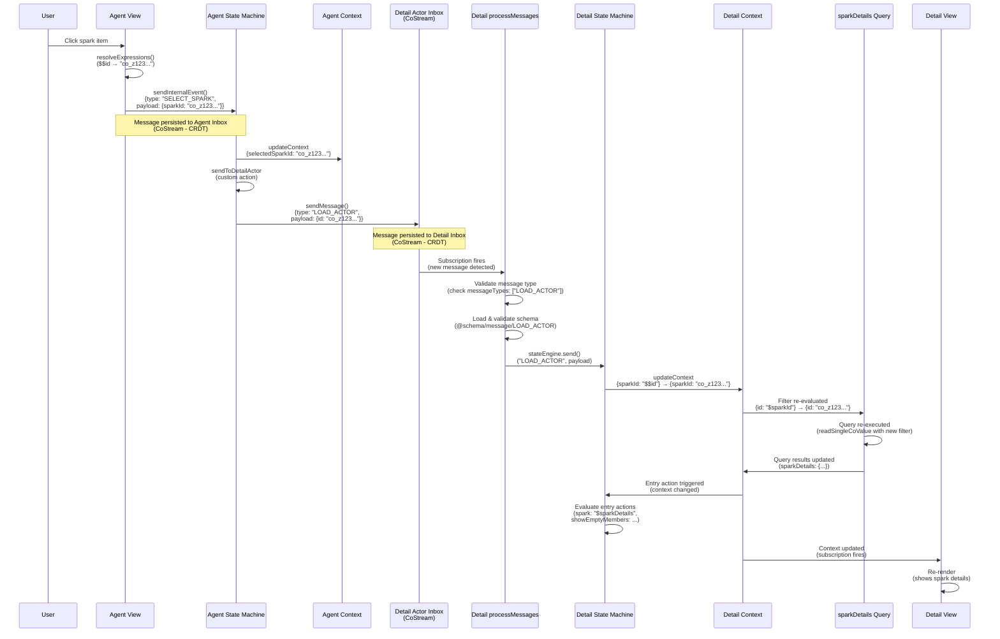

# Actor-to-Actor Communication Flow

## Overview

This document explains how actors communicate with each other in MaiaOS, using the Sparks vibe as a concrete example. Actors communicate via **inbox-based messaging** (CoStreams), not direct references, ensuring clean separation and distributed system compatibility.

**Key Principle**: Every actor is independent with its own context, state machine, view, and inbox. Actors communicate by sending messages to each other's inboxes, not by accessing each other's internal state.

---

## Complete Flow: Agent Actor → Detail Actor

### Sequence Diagram



---

## Step-by-Step Breakdown

### 1. User Interaction → View Event

**Location**: `libs/maia-vibes/src/sparks/agent/agent.view.maia`

When a user clicks a spark item:
```json
{
  "$on": {
    "click": {
      "send": "SELECT_SPARK",
      "payload": { "sparkId": "$$id" }
    }
  }
}
```

**What happens**:
- View engine resolves `$$id` to actual co-id (e.g., `"co_z123..."`)
- View engine calls `sendInternalEvent()` with resolved payload
- Message is persisted to agent actor's inbox (CoStream)

**Key Point**: All expressions are resolved **before** sending to inbox. Only clean JSON is persisted.

---

### 2. Agent State Machine Processing

**Location**: `libs/maia-vibes/src/sparks/agent/agent.state.maia`

The agent state machine receives `SELECT_SPARK`:
```json
{
  "on": {
    "SELECT_SPARK": {
      "target": "idle",
      "actions": [
        {
          "updateContext": {
            "selectedSparkId": "$$sparkId"
          }
        },
        "sendToDetailActor"
      ]
    }
  }
}
```

**What happens**:
1. Updates context: `selectedSparkId: "co_z123..."`
2. Executes custom action: `sendToDetailActor`

---

### 3. Custom Action: Sending Message to Detail Actor

**Location**: `libs/maia-engines/src/engines/state.engine.js:464-475`

The `sendToDetailActor` custom action:
```javascript
if (actionName === 'sendToDetailActor') {
  const sparkId = machine.actor.context.value?.selectedSparkId;
  if (sparkId && machine.actor?.children?.detail) {
    const detailActor = machine.actor.children.detail;
    await machine.actor.actorEngine.sendMessage(detailActor.id, {
      type: 'LOAD_ACTOR',
      payload: { id: sparkId },
      from: machine.actor.id
    });
  }
}
```

**What happens**:
1. Reads `selectedSparkId` from agent context
2. Gets reference to detail actor (child actor)
3. Sends `LOAD_ACTOR` message to detail actor's inbox via `sendMessage()`

**Key Point**: Messages are sent to actor inboxes (CoStreams), not directly to state machines. This ensures CRDT-native persistence and sync.

---

### 4. Message Persistence to Inbox

**Location**: `libs/maia-engines/src/engines/actor.engine.js:753-784`

The `sendMessage()` function:
```javascript
async sendMessage(actorId, message) {
  // Validate payload is resolved (no expressions)
  if (message.payload && containsExpressions(message.payload)) {
    throw new Error(`[ActorEngine] Message payload contains unresolved expressions...`);
  }
  
  const actor = this.actors.get(actorId);
  if (actor.inboxCoId && this.dbEngine) {
    const messageData = {
      type: message.type,
      payload: message.payload || {},
      source: message.from || message.source,
      target: actorId,
      processed: false
    };
    await createAndPushMessage(this.dbEngine, actor.inboxCoId, messageData);
  }
}
```

**What happens**:
1. Validates payload is resolved (no expressions)
2. Creates message object with metadata
3. Persists to detail actor's inbox CoStream (CRDT)
4. Message syncs across devices automatically

**Key Point**: Inbox is a CoStream (append-only list), providing CRDT-native deduplication and sync.

---

### 5. Message Processing

**Location**: `libs/maia-engines/src/engines/actor.engine.js:899-950`

The `processMessages()` function subscribes to inbox CoStream:
```javascript
async processMessages(actor) {
  // Subscribe to inbox CoStream
  const inboxStore = await this.dbEngine.execute({
    op: 'read',
    schema: actor.inboxSchemaCoId,
    key: actor.inboxCoId
  });
  
  // When new message arrives, subscription fires
  inboxStore.subscribe(async (inboxValue) => {
    // Process unprocessed messages
    for (const message of unprocessedMessages) {
      // Validate message type
      if (!actor.messageTypes.includes(message.type)) {
        console.warn(`[ActorEngine] Message type ${message.type} not in messageTypes`);
        continue;
      }
      
      // Load and validate message schema
      const messageSchema = await loadMessageSchema(message.type);
      await validatePayload(message.payload, messageSchema);
      
      // Route to state machine
      await this.stateEngine.send(actor.machine.id, message.type, message.payload);
    }
  });
}
```

**What happens**:
1. Subscribes to inbox CoStream
2. When new message arrives, subscription fires
3. Validates message type against `messageTypes` array
4. Loads and validates message schema
5. Routes to state machine via `stateEngine.send()`

**Key Point**: Message validation ensures type safety and prevents invalid messages from reaching state machines.

---

### 6. Detail State Machine Processing

**Location**: `libs/maia-vibes/src/sparks/detail/detail.state.maia`

The detail state machine receives `LOAD_ACTOR`:
```json
{
  "on": {
    "LOAD_ACTOR": {
      "target": "idle",
      "actions": [
        {
          "updateContext": {
            "sparkId": "$$id"
          }
        }
      ]
    }
  }
}
```

**What happens**:
1. Receives `LOAD_ACTOR` message with `payload: {id: "co_z123..."}`
2. Updates context: `sparkId: "co_z123..."`
3. Entry action runs (because state is `idle`)

---

### 7. Query Reactivity: Dynamic Filter Re-evaluation

**Location**: `libs/maia-db/src/cojson/crud/read.js:99-471`

The detail context contains a query with dynamic filter:
```json
{
  "sparkDetails": {
    "schema": "@schema/data/spark",
    "filter": {
      "id": "$sparkId"
    }
  }
}
```

**What happens**:
1. Context update changes `sparkId: null` → `sparkId: "co_z123..."`
2. Unified store detects context change
3. Re-evaluates query filters: `{id: "$sparkId"}` → `{id: "co_z123..."}`
4. Detects `findOne` pattern (single ID filter)
5. Executes query: `readSingleCoValue(backend, "co_z123...")`
6. Returns single object (not array)
7. Updates `sparkDetails` in context with query result

**Key Point**: Queries automatically re-execute when their filters change. This is reactive - no manual refresh needed.

---

### 8. Entry Action: Deriving UI State

**Location**: `libs/maia-vibes/src/sparks/detail/detail.state.maia:25-51`

The entry action runs when context changes:
```json
{
  "entry": {
    "updateContext": {
      "spark": "$sparkDetails",
      "showContent": {
        "$and": [
          { "$ne": ["$sparkId", null] },
          { "$ne": ["$sparkDetails", null] }
        ]
      },
      "showEmptyMembers": {
        "$if": {
          "condition": {
            "$and": [
              { "$ne": ["$sparkDetails", null] },
              {
                "$or": [
                  { "$eq": ["$sparkDetails.members", null] },
                  { "$eq": [{ "$length": "$sparkDetails.members" }, 0] }
