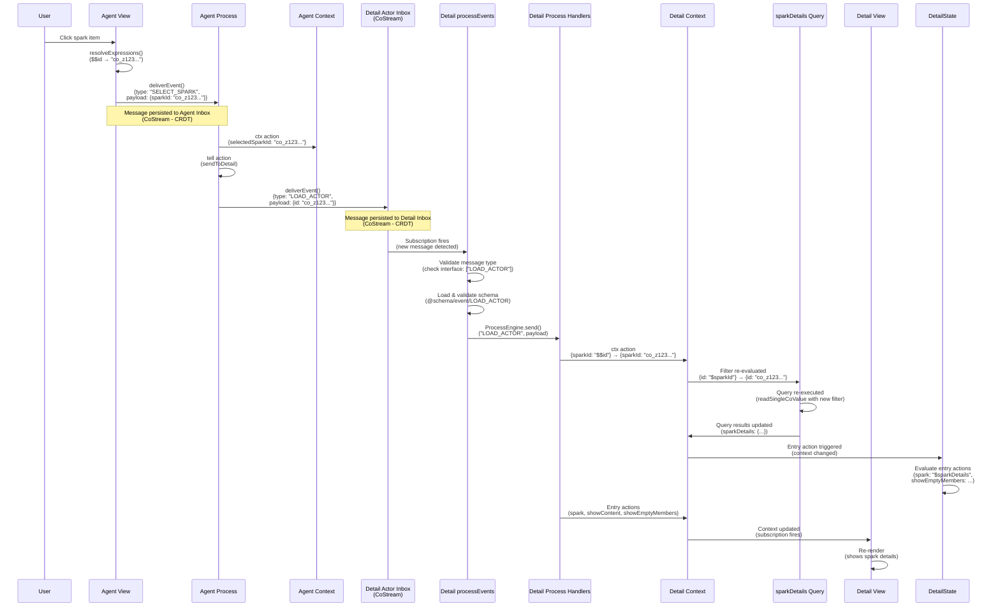

# Actor-to-Actor Communication Flow

## Overview

This document explains how actors communicate with each other in MaiaOS, using the Sparks vibe as a concrete example. Actors communicate via **inbox-based messaging** (CoStreams), not direct references, ensuring clean separation and distributed system compatibility.

**Key Principle**: Every actor is independent with its own context, process handlers, view, and inbox. Actors communicate by sending messages to each other's inboxes, not by accessing each other's internal state.

---

## Complete Flow: Agent Actor → Detail Actor

### Sequence Diagram



---

## Step-by-Step Breakdown

### 1. User Interaction → View Event

**Location**: `libs/maia-vibes/src/sparks/agent/agent.view.maia`

When a user clicks a spark item:
```json
{
  "$on": {
    "click": {
      "send": "SELECT_SPARK",
      "payload": { "sparkId": "$$id" }
    }
  }
}
```

**What happens**:
- View engine resolves `$$id` to actual co-id (e.g., `"co_z123..."`)
- View engine calls `deliverEvent()` with resolved payload
- Message is persisted to agent actor's inbox (CoStream)

**Key Point**: All expressions are resolved **before** sending to inbox. Only clean JSON is persisted.

---

### 2. Agent Process Handling

**Location**: `libs/maia-vibes/src/sparks/agent/agent.process.maia` (or process definition)

The agent process receives `SELECT_SPARK` via `handlers.SELECT_SPARK`:
```json
{
  "handlers": {
    "SELECT_SPARK": [
      { "ctx": { "selectedSparkId": "$$sparkId" } },
      { "tell": { "target": "@detail", "type": "LOAD_ACTOR", "payload": { "id": "$selectedSparkId" } } }
    ]
  }
}
```

**What happens**:
1. `ctx` action updates context: `selectedSparkId: "co_z123..."`
2. `tell` action sends message to detail actor inbox

---

### 3. Tell Action: Sending Message to Detail Actor

**Location**: `libs/maia-engines/src/engines/process.engine.js`

The `tell` action config specifies target and payload. ProcessEngine evaluates expressions and calls `deliverEvent()`:

```json
{ "tell": { "target": "@detail", "type": "LOAD_ACTOR", "payload": { "id": "$selectedSparkId" } } }
```

**What happens**:
1. ProcessEngine resolves `target` (e.g., child actor reference)
2. Evaluates `payload` with context (`$selectedSparkId` → `"co_z123..."`)
3. Calls `ActorEngine.deliverEvent()` to push message to detail inbox

**Key Point**: Messages are sent to actor inboxes (CoStreams), not directly to process handlers. This ensures CRDT-native persistence and sync.

---

### 4. Message Persistence to Inbox

**Location**: `libs/maia-engines/src/engines/actor.engine.js`

The `deliverEvent()` function pushes to inbox via `_pushToInbox()`:
```javascript
async deliverEvent(senderId, targetId, type, payload = {}) {
  // Validate payload is resolved (no expressions)
  if (containsExpressions(payload)) throw new Error(...);
  
  await this._pushToInbox(targetId, {
    type, payload: payload ?? {}, source: senderId, target: targetId, processed: false
  });
  // Same-actor: trigger processEvents immediately
  if (senderId === targetId) await this.processEvents(targetId);
}
```

**What happens**:
1. Validates payload is resolved (no expressions)
2. Resolves target to inbox co-id (actor in memory or via CoJSON)
3. Persists to target's inbox CoStream (CRDT)
4. Message syncs across devices automatically

**Key Point**: Inbox is a CoStream (append-only list), providing CRDT-native deduplication and sync.

---

### 5. Message Processing

**Location**: `libs/maia-engines/src/engines/actor.engine.js`

The `processEvents()` function processes inbox messages. Inbox subscription fires when new messages arrive:
```javascript
// For each unprocessed message:
// 1. InboxEngine validates message type (actor.interface)
// 2. InboxEngine validates payload against schema
// 3. ProcessEngine.send(processId, message.type, message.payload)
// 4. handlers[event] actions execute
```

**What happens**:
1. Inbox subscription fires when new message arrives
2. InboxEngine validates message type against `interface` array
3. Loads and validates message schema
4. Routes to ProcessEngine via `ProcessEngine.send(processId, event, payload)`
5. Handlers[event] actions execute

**Key Point**: Message validation ensures type safety and prevents invalid messages from reaching process handlers.

---

### 6. Detail Process Handling

**Location**: `libs/maia-vibes/src/sparks/detail/` (process definition)

The detail process receives `LOAD_ACTOR` via `handlers.LOAD_ACTOR`:
```json
{
  "handlers": {
    "LOAD_ACTOR": [
      { "ctx": { "sparkId": "$$id" } }
    ]
  }
}
```

**What happens**:
1. Receives `LOAD_ACTOR` message with `payload: {id: "co_z123..."}`
2. `ctx` action updates context: `sparkId: "co_z123..."`
3. Context change triggers query re-evaluation

---

### 7. Query Reactivity: Dynamic Filter Re-evaluation

**Location**: `libs/maia-db/src/cojson/crud/read.js:99-471`

The detail context contains a query with dynamic filter:
```json
{
  "sparkDetails": {
    "schema": "@schema/data/spark",
    "filter": {
      "id": "$sparkId"
    }
  }
}
```

**What happens**:
1. Context update changes `sparkId: null` → `sparkId: "co_z123..."`
2. Unified store detects context change
3. Re-evaluates query filters: `{id: "$sparkId"}` → `{id: "co_z123..."}`
4. Detects `findOne` pattern (single ID filter)
5. Executes query: `readSingleCoValue(backend, "co_z123...")`
6. Returns single object (not array)
7. Updates `sparkDetails` in context with query result

**Key Point**: Queries automatically re-execute when their filters change. This is reactive - no manual refresh needed.

---

### 8. Context-Driven UI State

**Location**: `libs/maia-vibes/src/sparks/detail/` (process definition or separate handler)

When context changes (e.g., sparkDetails from query), handlers can derive UI flags. Or use reactive expressions in view via data attributes:
```json
{
  "entry": {
    "updateContext": {
      "spark": "$sparkDetails",
      "showContent": {
        "$and": [
          { "$ne": ["$sparkId", null] },
          { "$ne": ["$sparkDetails", null] }
        ]
      },
      "showEmptyMembers": {
        "$if": {
          "condition": {
            "$and": [
              { "$ne": ["$sparkDetails", null] },
              {
                "$or": [
                  { "$eq": ["$sparkDetails.members", null] },
                  { "$eq": [{ "$length": "$sparkDetails.members" }, 0] }
