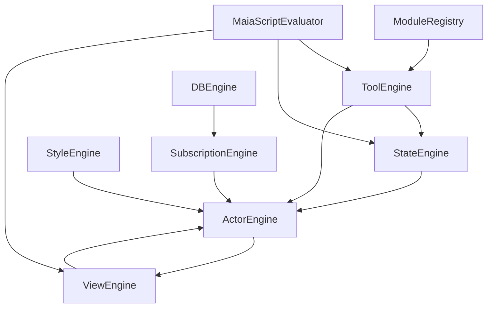

# maia-script: Execution Engines and Modules

## Overview

The `@MaiaOS/script` package provides the reusable execution components that power MaiaOS. Think of it as the factory floor where all the work happens - engines process your definitions, modules provide tools, and utilities handle common tasks.

**What it is:**
- ✅ **Execution engines** - Process actors, views, styles, state machines, and tools
- ✅ **Module system** - Plugin architecture for extending functionality
- ✅ **MaiaScript evaluator** - Evaluates JSON-based expressions safely
- ✅ **Utilities** - Shared helpers for config loading, path resolution, etc.

**What it isn't:**
- ❌ **Not the kernel** - Boot process is in `@MaiaOS/kernel`
- ❌ **Not tool definitions** - Tools are in `@MaiaOS/tools`
- ❌ **Not schemas** - Schema validation is in `@MaiaOS/schemata`

---

## The Simple Version

Think of `maia-script` like a factory with specialized workers (engines):

- **MaiaScriptEvaluator** = The translator (converts JSON expressions to values)
- **ActorEngine** = The manager (orchestrates everything)
- **ViewEngine** = The painter (renders UI)
- **StyleEngine** = The stylist (compiles CSS)
- **StateEngine** = The conductor (runs state machines)
- **ToolEngine** = The executor (runs tools)
- **DBEngine** = The librarian (manages data)
- **SubscriptionEngine** = The watcher (keeps data in sync)

**Analogy:**
Imagine you're building a house:
- You write blueprints (`.maia` files) - these are your definitions
- The factory workers (engines) read the blueprints and do the work
- Modules are like toolboxes - they provide specialized tools
- The evaluator translates your instructions into actions

---

## Architecture

### Package Structure

```
libs/maia-script/src/
├── engines/              # Core execution engines
│   ├── MaiaScriptEvaluator.js    # Expression evaluator
│   ├── ModuleRegistry.js          # Module loader
│   ├── actor-engine/              # Actor lifecycle
│   ├── view-engine/               # UI rendering
│   ├── style-engine/              # Style compilation
│   ├── state-engine/              # State machines
│   ├── tool-engine/               # Tool execution
│   ├── db-engine/                 # Database operations
│   ├── subscription-engine/       # Reactive subscriptions
│   └── message-queue/             # Message queuing
├── modules/              # Module definitions
│   ├── db.module.js               # Database module
│   ├── core.module.js             # Core UI tools
│   └── dragdrop.module.js         # Drag-and-drop
├── utils/                # Shared utilities
│   ├── module-registration.js     # Module helpers
│   ├── config-loader.js            # Config loading
│   ├── path-resolver.js           # Path resolution
│   ├── html-sanitizer.js          # HTML sanitization
│   └── co-id-validator.js         # Co-ID validation
└── index.js              # Public API exports
```

### Engine Dependencies



**Dependency Flow:**
1. `ModuleRegistry` loads modules and registers tools
2. `MaiaScriptEvaluator` evaluates expressions (used by all engines)
3. `ToolEngine` executes tools (used by StateEngine and ActorEngine)
4. `StateEngine` interprets state machines (used by ActorEngine)
5. `ViewEngine` renders UI (used by ActorEngine)
6. `StyleEngine` compiles styles (used by ActorEngine)
7. `ActorEngine` orchestrates everything
8. `DBEngine` handles data operations
9. `SubscriptionEngine` manages reactive subscriptions (used by ActorEngine)

---

## Documentation Structure

This package documentation is organized into focused topics:

- **[engines.md](./engines.md)** - Detailed descriptions of all 10 engines
- **[modules.md](./modules.md)** - Module system and creating custom modules
- **[expressions.md](./expressions.md)** - MaiaScript expression language reference
- **[api-reference.md](./api-reference.md)** - Complete API reference
- **[patterns.md](./patterns.md)** - Common patterns and troubleshooting

---

## Quick Start

Here's a simple example of using engines directly:

```javascript
import { MaiaScriptEvaluator } from '@MaiaOS/script';

const evaluator = new MaiaScriptEvaluator();

// Evaluate a simple expression
const result = await evaluator.evaluate(
  { $if: { condition: { $eq: ['$context.status', 'active'] }, then: 'green', else: 'gray' } },
  { context: { status: 'active' } }
);
// Returns: 'green'
```

For full system usage, see the [maia-kernel Package](../02_maia-kernel/README.md).

---

## Related Documentation

- [maia-kernel Package](../02_maia-kernel/README.md) - Boot process and orchestration
- [maia-operations Package](../06_maia-operations/README.md) - Shared database operations layer
- [maia-schemata Package](../03_maia-schemata/README.md) - Schema validation
- [maia-db Package](../05_maia-db/cojson.md) - Database backends
- [DSL Fundamentals](../02_dsl.md) - MaiaScript language reference
- [Engines](../04_engines.md) - High-level engine overview

---

## Source Files

**Package:** `libs/maia-script/`

**Key Files:**
- `src/index.js` - Public API exports
- `src/engines/` - All engine implementations
- `src/modules/` - Module definitions
- `src/utils/` - Shared utilities

**Dependencies:**
- `@MaiaOS/operations` - Shared database operations layer
- `@MaiaOS/tools` - Tool definitions
- `@MaiaOS/schemata` - Schema validation
- `@MaiaOS/db` - Database layer
