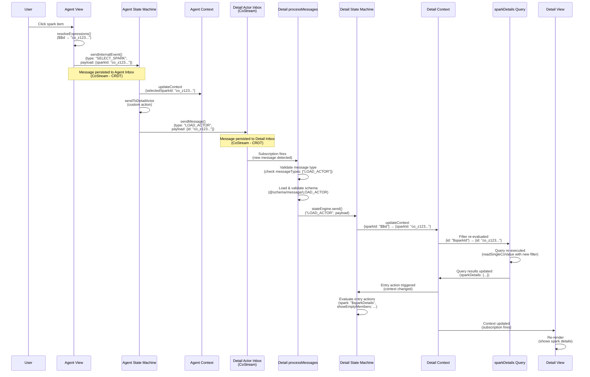

# Actor-to-Actor Communication Flow

## Overview

This document explains how actors communicate with each other in MaiaOS, using the Sparks vibe as a concrete example. Actors communicate via **inbox-based messaging** (CoStreams), not direct references, ensuring clean separation and distributed system compatibility.

**Key Principle**: Every actor is independent with its own context, state machine, view, and inbox. Actors communicate by sending messages to each other's inboxes, not by accessing each other's internal state.

---

## Complete Flow: Agent Actor → Detail Actor

### Sequence Diagram



---

## Step-by-Step Breakdown

### 1. User Interaction → View Event

**Location**: `libs/maia-vibes/src/sparks/agent/agent.view.maia`

When a user clicks a spark item:
```json
{
  "$on": {
    "click": {
      "send": "SELECT_SPARK",
      "payload": { "sparkId": "$$id" }
    }
  }
}
```

**What happens**:
- View engine resolves `$$id` to actual co-id (e.g., `"co_z123..."`)
- View engine calls `sendInternalEvent()` with resolved payload
- Message is persisted to agent actor's inbox (CoStream)

**Key Point**: All expressions are resolved **before** sending to inbox. Only clean JSON is persisted.

---

### 2. Agent State Machine Processing

**Location**: `libs/maia-vibes/src/sparks/agent/agent.state.maia`

The agent state machine receives `SELECT_SPARK`:
```json
{
  "on": {
    "SELECT_SPARK": {
      "target": "idle",
      "actions": [
        {
          "updateContext": {
            "selectedSparkId": "$$sparkId"
          }
        },
        "sendToDetailActor"
      ]
    }
  }
}
```

**What happens**:
1. Updates context: `selectedSparkId: "co_z123..."`
2. Executes custom action: `sendToDetailActor`

---

### 3. Custom Action: Sending Message to Detail Actor

**Location**: `libs/maia-script/src/engines/state.engine.js:464-475`

The `sendToDetailActor` custom action:
```javascript
if (actionName === 'sendToDetailActor') {
  const sparkId = machine.actor.context.value?.selectedSparkId;
  if (sparkId && machine.actor?.children?.detail) {
    const detailActor = machine.actor.children.detail;
    await machine.actor.actorEngine.sendMessage(detailActor.id, {
      type: 'LOAD_ACTOR',
      payload: { id: sparkId },
      from: machine.actor.id
    });
  }
}
```

**What happens**:
1. Reads `selectedSparkId` from agent context
2. Gets reference to detail actor (child actor)
3. Sends `LOAD_ACTOR` message to detail actor's inbox via `sendMessage()`

**Key Point**: Messages are sent to actor inboxes (CoStreams), not directly to state machines. This ensures CRDT-native persistence and sync.

---

### 4. Message Persistence to Inbox

**Location**: `libs/maia-script/src/engines/actor.engine.js:753-784`

The `sendMessage()` function:
```javascript
async sendMessage(actorId, message) {
  // Validate payload is resolved (no expressions)
  if (message.payload && containsExpressions(message.payload)) {
    throw new Error(`[ActorEngine] Message payload contains unresolved expressions...`);
  }
  
  const actor = this.actors.get(actorId);
  if (actor.inboxCoId && this.dbEngine) {
    const messageData = {
      type: message.type,
      payload: message.payload || {},
      source: message.from || message.source,
      target: actorId,
      processed: false
    };
    await createAndPushMessage(this.dbEngine, actor.inboxCoId, messageData);
  }
}
```

**What happens**:
1. Validates payload is resolved (no expressions)
2. Creates message object with metadata
3. Persists to detail actor's inbox CoStream (CRDT)
4. Message syncs across devices automatically

**Key Point**: Inbox is a CoStream (append-only list), providing CRDT-native deduplication and sync.

---

### 5. Message Processing

**Location**: `libs/maia-script/src/engines/actor.engine.js:899-950`

The `processMessages()` function subscribes to inbox CoStream:
```javascript
async processMessages(actor) {
  // Subscribe to inbox CoStream
  const inboxStore = await this.dbEngine.execute({
    op: 'read',
    schema: actor.inboxSchemaCoId,
    key: actor.inboxCoId
  });
  
  // When new message arrives, subscription fires
  inboxStore.subscribe(async (inboxValue) => {
    // Process unprocessed messages
    for (const message of unprocessedMessages) {
      // Validate message type
      if (!actor.messageTypes.includes(message.type)) {
        console.warn(`[ActorEngine] Message type ${message.type} not in messageTypes`);
        continue;
      }
      
      // Load and validate message schema
      const messageSchema = await loadMessageSchema(message.type);
      await validatePayload(message.payload, messageSchema);
      
      // Route to state machine
      await this.stateEngine.send(actor.machine.id, message.type, message.payload);
    }
  });
}
```

**What happens**:
1. Subscribes to inbox CoStream
2. When new message arrives, subscription fires
3. Validates message type against `messageTypes` array
4. Loads and validates message schema
5. Routes to state machine via `stateEngine.send()`

**Key Point**: Message validation ensures type safety and prevents invalid messages from reaching state machines.

---

### 6. Detail State Machine Processing

**Location**: `libs/maia-vibes/src/sparks/detail/detail.state.maia`

The detail state machine receives `LOAD_ACTOR`:
```json
{
  "on": {
    "LOAD_ACTOR": {
      "target": "idle",
      "actions": [
        {
          "updateContext": {
            "sparkId": "$$id"
          }
        }
      ]
    }
  }
}
```

**What happens**:
1. Receives `LOAD_ACTOR` message with `payload: {id: "co_z123..."}`
2. Updates context: `sparkId: "co_z123..."`
3. Entry action runs (because state is `idle`)

---

### 7. Query Reactivity: Dynamic Filter Re-evaluation

**Location**: `libs/maia-db/src/cojson/crud/read.js:99-471`

The detail context contains a query with dynamic filter:
```json
{
  "sparkDetails": {
    "schema": "@schema/data/spark",
    "filter": {
      "id": "$sparkId"
    }
  }
}
```

**What happens**:
1. Context update changes `sparkId: null` → `sparkId: "co_z123..."`
2. Unified store detects context change
3. Re-evaluates query filters: `{id: "$sparkId"}` → `{id: "co_z123..."}`
4. Detects `findOne` pattern (single ID filter)
5. Executes query: `readSingleCoValue(backend, "co_z123...")`
6. Returns single object (not array)
7. Updates `sparkDetails` in context with query result

**Key Point**: Queries automatically re-execute when their filters change. This is reactive - no manual refresh needed.

---

### 8. Entry Action: Deriving UI State

**Location**: `libs/maia-vibes/src/sparks/detail/detail.state.maia:25-51`

The entry action runs when context changes:
```json
{
  "entry": {
    "updateContext": {
      "spark": "$sparkDetails",
      "showContent": {
        "$and": [
          { "$ne": ["$sparkId", null] },
          { "$ne": ["$sparkDetails", null] }
        ]
      },
      "showEmptyMembers": {
        "$if": {
          "condition": {
            "$and": [
              { "$ne": ["$sparkDetails", null] },
              {
                "$or": [
                  { "$eq": ["$sparkDetails.members", null] },
                  { "$eq": [{ "$length": "$sparkDetails.members" }, 0] }
                ]
              }
            ]
          },
          "then": true,
          "else": false
        }
      }
    }
  }
}
```

**What happens**:
1. Sets `spark: "$sparkDetails"` (single object from query)
2. Computes `showContent` (boolean flag for UI)
3. Computes `showEmptyMembers` (boolean flag for UI)

**Key Point**: UI flags are computed in state machines, not views. Views only reference boolean flags from context.

---

### 9. View Re-rendering

**Location**: `libs/maia-vibes/src/sparks/detail/detail.view.maia`

The view subscribes to context changes:
```json
{
  "tag": "h2",
  "class": "detail-title",
  "text": "$spark.name"
}
```

**What happens**:
1. Context subscription fires when `spark` updates
2. View engine re-renders with new context value
3. View displays spark details and members

**Key Point**: Views are reactive - they automatically re-render when context changes.

---

## Key Architectural Patterns

### 1. Inbox-Based Communication

**Why**: 
- CRDT-native persistence and sync
- Complete event traceability
- Distributed system compatibility
- No direct actor references needed

**How**:
- Messages sent to actor inboxes (CoStreams)
- Inbox subscriptions process messages automatically
- Messages validated before routing to state machines

### 2. Independent Actors

**Why**:
- Each actor has its own context, state, view, inbox
- No parent-child dependencies
- Actors can be created/destroyed independently
- Enables lazy loading and reuse

**How**:
- Child actors created lazily via `_createChildActorIfNeeded()`
- Parent references child via `actor.children[namekey]`
- Communication via inboxes, not direct state access

### 3. Reactive Queries

**Why**:
- Automatic updates when filters change
- No manual refresh needed
- Declarative data needs
- Backend handles all query resolution

**How**:
- Query objects declared in context: `{schema: "...", filter: {...}}`
- Unified store detects queries, evaluates filters, executes queries
- Query results merged into context automatically
- Context subscriptions trigger view re-renders

### 4. Expression Resolution

**Why**:
- Only resolved values can be persisted to CRDTs
- Expressions require evaluation context that may not exist remotely
- Clean JSON is portable across devices

**How**:
- Views resolve ALL expressions before sending to inbox
- Messages contain only resolved values (no expressions)
- State machines receive resolved payloads
- Filters re-evaluated when context changes

---

## File Reference

### Core Engine Files

- **Actor Engine** (`libs/maia-script/src/engines/actor.engine.js`):
  - `sendMessage()` - Send message to actor inbox
  - `sendInternalEvent()` - Send internal event to own inbox
  - `processMessages()` - Process messages from inbox
  - `_createChildActorIfNeeded()` - Create child actor lazily

- **State Engine** (`libs/maia-script/src/engines/state.engine.js`):
  - `send()` - Route event to state machine
  - `_executeNamedAction()` - Execute custom actions (e.g., `sendToDetailActor`)

- **View Engine** (`libs/maia-script/src/engines/view.engine.js`):
  - `_renderSlot()` - Render child actors in slots
  - `_handleEvent()` - Handle DOM events, resolve expressions, send to inbox

- **Unified Store** (`libs/maia-db/src/cojson/crud/read.js`):
  - `createUnifiedStore()` - Wrap context, detect queries, merge results
  - `resolveQueries()` - Evaluate filters, execute queries
  - `evaluateFilter()` - Resolve filter expressions dynamically

### Sparks Vibe Files

- **Agent Actor** (`libs/maia-vibes/src/sparks/agent/`):
  - `agent.view.maia` - Renders spark list, sends `SELECT_SPARK` event
  - `agent.state.maia` - Handles `SELECT_SPARK`, calls `sendToDetailActor`
  - `agent.context.maia` - Contains `sparks` query, `selectedSparkId`, `@actors`

- **Detail Actor** (`libs/maia-vibes/src/sparks/detail/`):
  - `detail.actor.maia` - Defines `messageTypes: ["LOAD_ACTOR"]`
  - `detail.context.maia` - Contains `sparkDetails` query with dynamic filter
  - `detail.state.maia` - Handles `LOAD_ACTOR`, computes UI flags
  - `detail.view.maia` - Renders spark details and members

---

## Common Patterns

### Pattern 1: Parent → Child Communication

**Use Case**: Parent actor needs to send data to child actor

**Steps**:
1. Parent state machine updates its context
2. Parent state machine calls custom action (e.g., `sendToDetailActor`)
3. Custom action reads from parent context
4. Custom action sends message to child inbox
5. Child processes message, updates its context
6. Child queries re-evaluate if filters changed

**Example**: Agent actor → Detail actor (Sparks vibe)

### Pattern 2: Dynamic Query Filters

**Use Case**: Query should filter by value from context

**Steps**:
1. Define query in context with dynamic filter: `{id: "$sparkId"}`
2. Update context value that filter references: `sparkId: "co_z123..."`
3. Unified store detects filter change
4. Query re-executes with new filter
5. Query results update in context
6. Views re-render with new data

**Example**: `sparkDetails` query filters by `sparkId`

### Pattern 3: Child Actor Creation

**Use Case**: Render child actor in parent view

**Steps**:
1. Define child in parent context: `@actors: {detail: "@sparks/actor/detail"}`
2. Reference child in view: `currentDetail: "@detail"`
3. Use slot in view: `$slot: "$currentDetail"`
4. View engine extracts namekey from `currentDetail`
5. View engine calls `_createChildActorIfNeeded()`
6. Child actor created lazily, attached to slot element

**Example**: Agent view renders detail actor in slot

---

## Troubleshooting

### Issue: Detail view not updating when clicking spark

**Symptoms**: Clicking spark item doesn't update detail view

**Possible Causes**:
1. Expression validation error in state machine entry action
2. Message not being sent to detail actor inbox
3. Detail actor not created yet
4. Query filter not re-evaluating

**Debug Steps**:
1. Check console for expression validation errors
2. Verify `sendToDetailActor` action is called
3. Verify message appears in detail actor inbox
4. Verify `sparkId` updates in detail context
5. Verify query filter re-evaluates

**Fix**: Use `$sparkDetails.members` instead of `$spark.members` in entry action (see bug fix above)

### Issue: Messages not being processed

**Symptoms**: Messages sent but not reaching state machine

**Possible Causes**:
1. Message type not in `messageTypes` array
2. Message schema validation failing
3. Inbox subscription not set up
4. Actor not created yet

**Debug Steps**:
1. Verify message type in `messageTypes` array
2. Check message schema exists and validates
3. Verify inbox subscription is active
4. Verify actor exists before sending message

---

## Related Documentation

- [Actor Engine API](../04_maia-script/engines.md#actor-engine) - Actor lifecycle and messaging
- [State Engine API](../04_maia-script/engines.md#state-engine) - State machine execution
- [View Engine API](../04_maia-script/engines.md#view-engine) - View rendering and events
- [Query Reactivity](../05_maia-db/README.md) - How queries work with dynamic filters
- [MaiaScript Expressions](../04_maia-script/expressions.md) - Expression syntax and evaluation

---

## Summary

**Actor-to-actor communication in MaiaOS**:
1. ✅ **Inbox-based** - Messages sent to actor inboxes (CoStreams)
2. ✅ **Independent** - Each actor has its own context, state, view, inbox
3. ✅ **Reactive** - Queries re-execute when filters change
4. ✅ **Validated** - Messages validated before routing to state machines
5. ✅ **CRDT-native** - All messages persist to CRDTs, sync across devices

**Key Files**:
- `libs/maia-script/src/engines/actor.engine.js` - Message passing
- `libs/maia-script/src/engines/state.engine.js` - State machine execution
- `libs/maia-db/src/cojson/crud/read.js` - Query reactivity

**Example**: Sparks vibe agent → detail actor communication flow (documented above)
