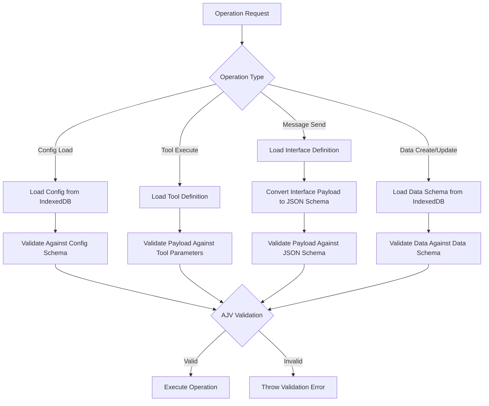

# Validation Guide

Complete guide to MaiaOS's end-to-end JSON Schema validation system.

## Overview

MaiaOS validates **everything** using JSON Schema:
- ✅ Config files (actors, views, states, etc.)
- ✅ Tool payloads
- ✅ Message payloads
- ✅ Application data (create, update, toggle operations)

All validation uses AJV (fast JSON Schema validator) and schemas are dynamically loaded from IndexedDB.

## Validation Points

### 1. Config Files

**When:** When configs are loaded from IndexedDB  
**Where:** In respective engines (ActorEngine, StateEngine, ViewEngine, etc.)  
**Schema:** Config schemas (actor.schema.json, view.schema.json, etc.)

**Example:**
```javascript
// ActorEngine.loadActor() validates actor definition
await validateOrThrow('actor', actorDef, `maia.db:${actorKey}`);
```

**What Gets Validated:**
- Required fields (`$type`, `$id`, etc.)
- Field types and formats
- Nested object structures
- Enum values

### 2. Tool Payloads

**When:** Before tool execution  
**Where:** `ToolEngine.execute()`  
**Schema:** Tool's `parameters` field (JSON Schema format)

**Example:**
```javascript
// Tool definition
{
  "parameters": {
    "type": "object",
    "properties": {
      "text": { "type": "string", "minLength": 1 }
    },
    "required": ["text"]
  }
}

// Validation happens automatically
await toolEngine.execute('@core/createTodo', actor, { text: "Buy milk" });
```

**What Gets Validated:**
- Required parameters
- Parameter types (string, number, boolean, object, array)
- String constraints (minLength, maxLength, pattern)
- Number constraints (minimum, maximum)
- Enum values
- Nested object structures

### 3. Message Payloads

**When:** Before sending/receiving messages  
**Where:** `ActorEngine._validateMessage()`  
**Schema:** Interface's `payload` field (converted to JSON Schema)

**Example:**
```javascript
// Interface definition
{
  "inbox": {
    "CREATE_TODO": {
      "payload": { "text": "string" }
    }
  }
}

// Validation happens automatically
await actorEngine.sendMessage(actorId, {
  type: "CREATE_TODO",
  payload: { text: "Buy milk" }
});
```

**What Gets Validated:**
- Payload structure matches interface definition
- Field types match expected types
- Required fields are present
- Nested objects and arrays

**Note:** Interface payload format (`{ "text": "string" }`) is automatically converted to JSON Schema format (`{ type: "object", properties: { text: { type: "string" } } }`).

### 4. Application Data

**When:** During create/update/toggle operations  
**Where:** `CreateOperation`, `UpdateOperation`, `ToggleOperation`  
**Schema:** Data schemas from IndexedDB (e.g., `@schema/data/todos`)

#### Create Operations

**Full validation** - All required fields must be present:

```javascript
// Schema requires: text (string, minLength: 1), done (boolean)
await maia.db({
  op: 'create',
  schema: '@schema/todos',
  data: { text: "Buy milk", done: false }
});
// ✅ Valid

await maia.db({
  op: 'create',
  schema: '@schema/todos',
  data: { text: "", done: false }
});
// ❌ Invalid: text should NOT be shorter than 1 characters
```

#### Update Operations

**Partial validation** - Only validates fields being updated:

```javascript
// Schema requires: text, done
// But updates only validate fields being updated
await maia.db({
  op: 'update',
  schema: '@schema/todos',
  id: '123',
  data: { done: true }
});
// ✅ Valid - only validates 'done' field

await maia.db({
  op: 'update',
  schema: '@schema/todos',
  id: '123',
  data: { done: "yes" }
});
// ❌ Invalid: done should be boolean
```

#### Toggle Operations

**Field validation** - Validates field exists and is boolean:

```javascript
await maia.db({
  op: 'toggle',
  schema: '@schema/todos',
  id: '123',
  field: 'done'
});
// ✅ Valid - 'done' exists and is boolean

await maia.db({
  op: 'toggle',
  schema: '@schema/todos',
  id: '123',
  field: 'text'
});
// ❌ Invalid: Field "text" is not a boolean (type: string)
```

## How Validation Works

### Schema Storage

1. **Config Schemas**: Stored in `src/schemata/` (actor.schema.json, view.schema.json, etc.)
2. **Data Schemas**: Stored in `src/schemata/data/` (todos.schema.json, etc.)
3. **Seeding**: All schemas are automatically seeded into IndexedDB during `MaiaOS.boot()`
4. **Storage**: Schemas stored in IndexedDB `schemas` store with keys like:
   - `@schema/actor` (config schema)
   - `@schema/data/todos` (data schema)

### Validation Flow



### AJV Integration

MaiaOS uses AJV (Another JSON Schema Validator) for all validation:

```javascript
import { validateOrThrow } from '../schemata/validation.helper.js';

// validateOrThrow automatically:
// 1. Loads validation engine (AJV instance)
// 2. Compiles schema (cached for performance)
// 3. Validates data
// 4. Throws error with clear message if invalid
await validateOrThrow('tool-payload', payload, schema);
```

**Performance:**
- Schemas are compiled once and cached
- Validation is fast (< 1ms per validation)
- No performance impact on normal operations

## Error Messages

Validation errors provide clear, actionable feedback:

### Example: Tool Payload Error

```
Validation failed for 'tool-payload' in tool-payload:
  - /text: should NOT be shorter than 1 characters
  - /done: should be boolean
```

**What it means:**
- Field path: `/text` (root level field)
- Error: Value is shorter than minimum length (1 character)
- Field path: `/done`
- Error: Value should be boolean but isn't

### Example: Message Payload Error

```
Validation failed for 'message-payload' in message-payload:
  - /id: should be string
  - /text: is required
```

**What it means:**
- Field `/id` has wrong type (expected string)
- Field `/text` is missing (required field)

### Example: Application Data Error

```
Validation failed for 'application-data' in application-data:
  - /text: should NOT be shorter than 1 characters
  - /done: should be boolean
```

**What it means:**
- Field `/text` violates minLength constraint
- Field `/done` has wrong type

## Troubleshooting

### Schema Not Found

**Error:** `No schema found for @schema/data/todos, skipping validation`

**Cause:** Schema not seeded into IndexedDB

**Solution:**
1. Check schema exists in `src/schemata/data/todos.schema.json`
2. Check schema is exported in `src/schemata/index.js`
3. Restart app to trigger re-seeding

### Validation Fails Unexpectedly

**Error:** `Validation failed: text should be string`

**Cause:** Data type mismatch

**Solution:**
1. Check the schema definition for expected type
2. Verify data matches schema (use `console.log` to inspect)
3. Convert data to correct type before validation

### Interface Payload Validation Fails

**Error:** `Message validation failed: Payload.text should be string`

**Cause:** Interface payload format doesn't match actual payload

**Solution:**
1. Check interface definition matches actual message payload
2. Verify payload structure in console logs
3. Update interface definition if payload structure changed

### Partial Update Validation Too Strict

**Error:** `Validation failed: text is required`

**Cause:** Update operation requires all fields (should only validate updated fields)

**Solution:**
- This shouldn't happen - update operations use partial validation
- If it does, check `UpdateOperation` is using `required: []` for partial schema

## Best Practices

### 1. Define Schemas First

Always define schemas before using them:

```javascript
// ✅ Good - Schema defined first
// src/schemata/data/todos.schema.json
{
  "properties": {
    "text": { "type": "string", "minLength": 1 },
    "done": { "type": "boolean" }
  },
  "required": ["text", "done"]
}

// Then use in operations
await maia.db({ op: 'create', schema: '@schema/todos', data: {...} });
```

### 2. Use Descriptive Error Messages

Add `description` fields to schema properties:

```json
{
  "properties": {
    "text": {
      "type": "string",
      "minLength": 1,
      "description": "The todo item text content (required, non-empty)"
    }
  }
}
```

### 3. Be Permissive Initially

Start with permissive schemas, tighten later:

```json
// ✅ Good - Start permissive
{
  "properties": {
    "text": { "type": "string" }  // No minLength initially
  }
}

// Tighten later after testing
{
  "properties": {
    "text": { "type": "string", "minLength": 1 }  // Add constraint
  }
}
```

### 4. Validate at Boundaries

Validation happens at operation boundaries (not on every property access):

```javascript
// ✅ Good - Validate at operation boundary
await maia.db({ op: 'create', schema: '@schema/todos', data: todoData });

// ❌ Bad - Don't validate individual properties
// (Validation happens automatically, don't add manual checks)
```

### 5. Handle Validation Errors Gracefully

Catch validation errors and provide user-friendly messages:

```javascript
try {
  await maia.db({ op: 'create', schema: '@schema/todos', data });
} catch (error) {
  if (error.message.includes('Validation failed')) {
    // Show user-friendly error
    showError('Invalid todo data. Please check your input.');
  } else {
    throw error; // Re-throw other errors
  }
}
```

## Adding New Validation

### Adding a New Data Schema

1. **Create schema file:**
   ```bash
   # Create src/schemata/data/yourtype.schema.json
   ```

2. **Define schema:**
   ```json
   {
     "$id": "https://maiaos.dev/schemas/data/yourtype",
     "$schema": "http://json-schema.org/draft-07/schema#",
     "type": "object",
     "properties": {
       "field1": { "type": "string" },
       "field2": { "type": "number" }
     },
     "required": ["field1"]
   }
   ```

3. **Export in index.js:**
   ```javascript
   import yourtypeSchema from './data/yourtype.schema.json';
   const DATA_SCHEMAS = {
     'data/todos': todosSchema,
     'data/yourtype': yourtypeSchema
   };
   ```

4. **Use in operations:**
   ```javascript
   await maia.db({
     op: 'create',
     schema: '@schema/yourtype',
     data: { field1: "value", field2: 123 }
   });
   ```

### Adding Validation to New Operation

1. **Import validation helper:**
   ```javascript
   import { validateOrThrow } from '../../../schemata/validation.helper.js';
   ```

2. **Load schema from IndexedDB:**
   ```javascript
   const schemaKey = '@schema/data/yourtype';
   const schema = await this._loadDataSchema(schemaKey);
   ```

3. **Validate data:**
   ```javascript
   if (schema) {
     await validateOrThrow('application-data', data, schema);
   }
   ```

## Summary

- ✅ **100% validation coverage** - Everything is validated
- ✅ **Dynamic schemas** - Schemas loaded from IndexedDB at runtime
- ✅ **Fast performance** - AJV compilation and caching
- ✅ **Clear errors** - Actionable error messages with field paths
- ✅ **Fail-fast** - Validation errors throw immediately

For schema definitions, see [Schema System](./03_schemas.md).  
For engine details, see [Engines Guide](./04_engines.md).
