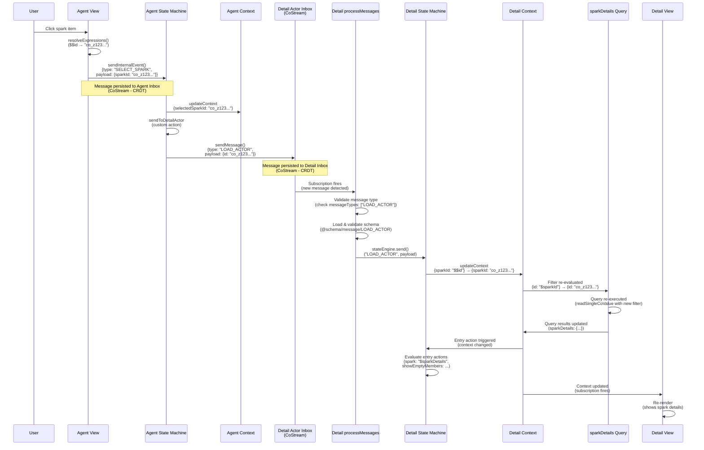
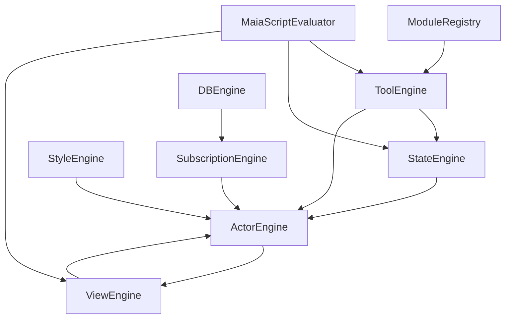

# MaiaOS Documentation for maia-script

**Auto-generated:** 2026-02-11T16:28:11.589Z
**Purpose:** Complete context for LLM agents working with MaiaOS

---

# ACTOR COMMUNICATION

*Source: developers/actor-communication.md*

# Actor-to-Actor Communication Flow

## Overview

This document explains how actors communicate with each other in MaiaOS, using the Sparks vibe as a concrete example. Actors communicate via **inbox-based messaging** (CoStreams), not direct references, ensuring clean separation and distributed system compatibility.

**Key Principle**: Every actor is independent with its own context, state machine, view, and inbox. Actors communicate by sending messages to each other's inboxes, not by accessing each other's internal state.

---

## Complete Flow: Agent Actor → Detail Actor

### Sequence Diagram



---

## Step-by-Step Breakdown

### 1. User Interaction → View Event

**Location**: `libs/maia-vibes/src/sparks/agent/agent.view.maia`

When a user clicks a spark item:
```json
{
  "$on": {
    "click": {
      "send": "SELECT_SPARK",
      "payload": { "sparkId": "$$id" }
    }
  }
}
```

**What happens**:
- View engine resolves `$$id` to actual co-id (e.g., `"co_z123..."`)
- View engine calls `sendInternalEvent()` with resolved payload
- Message is persisted to agent actor's inbox (CoStream)

**Key Point**: All expressions are resolved **before** sending to inbox. Only clean JSON is persisted.

---

### 2. Agent State Machine Processing

**Location**: `libs/maia-vibes/src/sparks/agent/agent.state.maia`

The agent state machine receives `SELECT_SPARK`:
```json
{
  "on": {
    "SELECT_SPARK": {
      "target": "idle",
      "actions": [
        {
          "updateContext": {
            "selectedSparkId": "$$sparkId"
          }
        },
        "sendToDetailActor"
      ]
    }
  }
}
```

**What happens**:
1. Updates context: `selectedSparkId: "co_z123..."`
2. Executes custom action: `sendToDetailActor`

---

### 3. Custom Action: Sending Message to Detail Actor

**Location**: `libs/maia-script/src/engines/state.engine.js:464-475`

The `sendToDetailActor` custom action:
```javascript
if (actionName === 'sendToDetailActor') {
  const sparkId = machine.actor.context.value?.selectedSparkId;
  if (sparkId && machine.actor?.children?.detail) {
    const detailActor = machine.actor.children.detail;
    await machine.actor.actorEngine.sendMessage(detailActor.id, {
      type: 'LOAD_ACTOR',
      payload: { id: sparkId },
      from: machine.actor.id
    });
  }
}
```

**What happens**:
1. Reads `selectedSparkId` from agent context
2. Gets reference to detail actor (child actor)
3. Sends `LOAD_ACTOR` message to detail actor's inbox via `sendMessage()`

**Key Point**: Messages are sent to actor inboxes (CoStreams), not directly to state machines. This ensures CRDT-native persistence and sync.

---

### 4. Message Persistence to Inbox

**Location**: `libs/maia-script/src/engines/actor.engine.js:753-784`

The `sendMessage()` function:
```javascript
async sendMessage(actorId, message) {
  // Validate payload is resolved (no expressions)
  if (message.payload && containsExpressions(message.payload)) {
    throw new Error(`[ActorEngine] Message payload contains unresolved expressions...`);
  }
  
  const actor = this.actors.get(actorId);
  if (actor.inboxCoId && this.dbEngine) {
    const messageData = {
      type: message.type,
      payload: message.payload || {},
      source: message.from || message.source,
      target: actorId,
      processed: false
    };
    await createAndPushMessage(this.dbEngine, actor.inboxCoId, messageData);
  }
}
```

**What happens**:
1. Validates payload is resolved (no expressions)
2. Creates message object with metadata
3. Persists to detail actor's inbox CoStream (CRDT)
4. Message syncs across devices automatically

**Key Point**: Inbox is a CoStream (append-only list), providing CRDT-native deduplication and sync.

---

### 5. Message Processing

**Location**: `libs/maia-script/src/engines/actor.engine.js:899-950`

The `processMessages()` function subscribes to inbox CoStream:
```javascript
async processMessages(actor) {
  // Subscribe to inbox CoStream
  const inboxStore = await this.dbEngine.execute({
    op: 'read',
    schema: actor.inboxSchemaCoId,
    key: actor.inboxCoId
  });
  
  // When new message arrives, subscription fires
  inboxStore.subscribe(async (inboxValue) => {
    // Process unprocessed messages
    for (const message of unprocessedMessages) {
      // Validate message type
      if (!actor.messageTypes.includes(message.type)) {
        console.warn(`[ActorEngine] Message type ${message.type} not in messageTypes`);
        continue;
      }
      
      // Load and validate message schema
      const messageSchema = await loadMessageSchema(message.type);
      await validatePayload(message.payload, messageSchema);
      
      // Route to state machine
      await this.stateEngine.send(actor.machine.id, message.type, message.payload);
    }
  });
}
```

**What happens**:
1. Subscribes to inbox CoStream
2. When new message arrives, subscription fires
3. Validates message type against `messageTypes` array
4. Loads and validates message schema
5. Routes to state machine via `stateEngine.send()`

**Key Point**: Message validation ensures type safety and prevents invalid messages from reaching state machines.

---

### 6. Detail State Machine Processing

**Location**: `libs/maia-vibes/src/sparks/detail/detail.state.maia`

The detail state machine receives `LOAD_ACTOR`:
```json
{
  "on": {
    "LOAD_ACTOR": {
      "target": "idle",
      "actions": [
        {
          "updateContext": {
            "sparkId": "$$id"
          }
        }
      ]
    }
  }
}
```

**What happens**:
1. Receives `LOAD_ACTOR` message with `payload: {id: "co_z123..."}`
2. Updates context: `sparkId: "co_z123..."`
3. Entry action runs (because state is `idle`)

---

### 7. Query Reactivity: Dynamic Filter Re-evaluation

**Location**: `libs/maia-db/src/cojson/crud/read.js:99-471`

The detail context contains a query with dynamic filter:
```json
{
  "sparkDetails": {
    "schema": "@schema/data/spark",
    "filter": {
      "id": "$sparkId"
    }
  }
}
```

**What happens**:
1. Context update changes `sparkId: null` → `sparkId: "co_z123..."`
2. Unified store detects context change
3. Re-evaluates query filters: `{id: "$sparkId"}` → `{id: "co_z123..."}`
4. Detects `findOne` pattern (single ID filter)
5. Executes query: `readSingleCoValue(backend, "co_z123...")`
6. Returns single object (not array)
7. Updates `sparkDetails` in context with query result

**Key Point**: Queries automatically re-execute when their filters change. This is reactive - no manual refresh needed.

---

### 8. Entry Action: Deriving UI State

**Location**: `libs/maia-vibes/src/sparks/detail/detail.state.maia:25-51`

The entry action runs when context changes:
```json
{
  "entry": {
    "updateContext": {
      "spark": "$sparkDetails",
      "showContent": {
        "$and": [
          { "$ne": ["$sparkId", null] },
          { "$ne": ["$sparkDetails", null] }
        ]
      },
      "showEmptyMembers": {
        "$if": {
          "condition": {
            "$and": [
              { "$ne": ["$sparkDetails", null] },
              {
                "$or": [
                  { "$eq": ["$sparkDetails.members", null] },
                  { "$eq": [{ "$length": "$sparkDetails.members" }, 0] }
                ]
              }
            ]
          },
          "then": true,
          "else": false
        }
      }
    }
  }
}
```

**What happens**:
1. Sets `spark: "$sparkDetails"` (single object from query)
2. Computes `showContent` (boolean flag for UI)
3. Computes `showEmptyMembers` (boolean flag for UI)

**Key Point**: UI flags are computed in state machines, not views. Views only reference boolean flags from context.

---

### 9. View Re-rendering

**Location**: `libs/maia-vibes/src/sparks/detail/detail.view.maia`

The view subscribes to context changes:
```json
{
  "tag": "h2",
  "class": "detail-title",
  "text": "$spark.name"
}
```

**What happens**:
1. Context subscription fires when `spark` updates
2. View engine re-renders with new context value
3. View displays spark details and members

**Key Point**: Views are reactive - they automatically re-render when context changes.

---

## Key Architectural Patterns

### 1. Inbox-Based Communication

**Why**: 
- CRDT-native persistence and sync
- Complete event traceability
- Distributed system compatibility
- No direct actor references needed

**How**:
- Messages sent to actor inboxes (CoStreams)
- Inbox subscriptions process messages automatically
- Messages validated before routing to state machines

### 2. Independent Actors

**Why**:
- Each actor has its own context, state, view, inbox
- No parent-child dependencies
- Actors can be created/destroyed independently
- Enables lazy loading and reuse

**How**:
- Child actors created lazily via `_createChildActorIfNeeded()`
- Parent references child via `actor.children[namekey]`
- Communication via inboxes, not direct state access

### 3. Reactive Queries

**Why**:
- Automatic updates when filters change
- No manual refresh needed
- Declarative data needs
- Backend handles all query resolution

**How**:
- Query objects declared in context: `{schema: "...", filter: {...}}`
- Unified store detects queries, evaluates filters, executes queries
- Query results merged into context automatically
- Context subscriptions trigger view re-renders

### 4. Expression Resolution

**Why**:
- Only resolved values can be persisted to CRDTs
- Expressions require evaluation context that may not exist remotely
- Clean JSON is portable across devices

**How**:
- Views resolve ALL expressions before sending to inbox
- Messages contain only resolved values (no expressions)
- State machines receive resolved payloads
- Filters re-evaluated when context changes

---

## File Reference

### Core Engine Files

- **Actor Engine** (`libs/maia-script/src/engines/actor.engine.js`):
  - `sendMessage()` - Send message to actor inbox
  - `sendInternalEvent()` - Send internal event to own inbox
  - `processMessages()` - Process messages from inbox
  - `_createChildActorIfNeeded()` - Create child actor lazily

- **State Engine** (`libs/maia-script/src/engines/state.engine.js`):
  - `send()` - Route event to state machine
  - `_executeNamedAction()` - Execute custom actions (e.g., `sendToDetailActor`)

- **View Engine** (`libs/maia-script/src/engines/view.engine.js`):
  - `_renderSlot()` - Render child actors in slots
  - `_handleEvent()` - Handle DOM events, resolve expressions, send to inbox

- **Unified Store** (`libs/maia-db/src/cojson/crud/read.js`):
  - `createUnifiedStore()` - Wrap context, detect queries, merge results
  - `resolveQueries()` - Evaluate filters, execute queries
  - `evaluateFilter()` - Resolve filter expressions dynamically

### Sparks Vibe Files

- **Agent Actor** (`libs/maia-vibes/src/sparks/agent/`):
  - `agent.view.maia` - Renders spark list, sends `SELECT_SPARK` event
  - `agent.state.maia` - Handles `SELECT_SPARK`, calls `sendToDetailActor`
  - `agent.context.maia` - Contains `sparks` query, `selectedSparkId`, `@actors`

- **Detail Actor** (`libs/maia-vibes/src/sparks/detail/`):
  - `detail.actor.maia` - Defines `messageTypes: ["LOAD_ACTOR"]`
  - `detail.context.maia` - Contains `sparkDetails` query with dynamic filter
  - `detail.state.maia` - Handles `LOAD_ACTOR`, computes UI flags
  - `detail.view.maia` - Renders spark details and members

---

## Common Patterns

### Pattern 1: Parent → Child Communication

**Use Case**: Parent actor needs to send data to child actor

**Steps**:
1. Parent state machine updates its context
2. Parent state machine calls custom action (e.g., `sendToDetailActor`)
3. Custom action reads from parent context
4. Custom action sends message to child inbox
5. Child processes message, updates its context
6. Child queries re-evaluate if filters changed

**Example**: Agent actor → Detail actor (Sparks vibe)

### Pattern 2: Dynamic Query Filters

**Use Case**: Query should filter by value from context

**Steps**:
1. Define query in context with dynamic filter: `{id: "$sparkId"}`
2. Update context value that filter references: `sparkId: "co_z123..."`
3. Unified store detects filter change
4. Query re-executes with new filter
5. Query results update in context
6. Views re-render with new data

**Example**: `sparkDetails` query filters by `sparkId`

### Pattern 3: Child Actor Creation

**Use Case**: Render child actor in parent view

**Steps**:
1. Define child in parent context: `@actors: {detail: "@sparks/actor/detail"}`
2. Reference child in view: `currentDetail: "@detail"`
3. Use slot in view: `$slot: "$currentDetail"`
4. View engine extracts namekey from `currentDetail`
5. View engine calls `_createChildActorIfNeeded()`
6. Child actor created lazily, attached to slot element

**Example**: Agent view renders detail actor in slot

---

## Troubleshooting

### Issue: Detail view not updating when clicking spark

**Symptoms**: Clicking spark item doesn't update detail view

**Possible Causes**:
1. Expression validation error in state machine entry action
2. Message not being sent to detail actor inbox
3. Detail actor not created yet
4. Query filter not re-evaluating

**Debug Steps**:
1. Check console for expression validation errors
2. Verify `sendToDetailActor` action is called
3. Verify message appears in detail actor inbox
4. Verify `sparkId` updates in detail context
5. Verify query filter re-evaluates

**Fix**: Use `$sparkDetails.members` instead of `$spark.members` in entry action (see bug fix above)

### Issue: Messages not being processed

**Symptoms**: Messages sent but not reaching state machine

**Possible Causes**:
1. Message type not in `messageTypes` array
2. Message schema validation failing
3. Inbox subscription not set up
4. Actor not created yet

**Debug Steps**:
1. Verify message type in `messageTypes` array
2. Check message schema exists and validates
3. Verify inbox subscription is active
4. Verify actor exists before sending message

---

## Related Documentation

- [Actor Engine API](../04_maia-script/engines.md#actor-engine) - Actor lifecycle and messaging
- [State Engine API](../04_maia-script/engines.md#state-engine) - State machine execution
- [View Engine API](../04_maia-script/engines.md#view-engine) - View rendering and events
- [Query Reactivity](../05_maia-db/README.md) - How queries work with dynamic filters
- [MaiaScript Expressions](../04_maia-script/expressions.md) - Expression syntax and evaluation

---

## Summary

**Actor-to-actor communication in MaiaOS**:
1. ✅ **Inbox-based** - Messages sent to actor inboxes (CoStreams)
2. ✅ **Independent** - Each actor has its own context, state, view, inbox
3. ✅ **Reactive** - Queries re-execute when filters change
4. ✅ **Validated** - Messages validated before routing to state machines
5. ✅ **CRDT-native** - All messages persist to CRDTs, sync across devices

**Key Files**:
- `libs/maia-script/src/engines/actor.engine.js` - Message passing
- `libs/maia-script/src/engines/state.engine.js` - State machine execution
- `libs/maia-db/src/cojson/crud/read.js` - Query reactivity

**Example**: Sparks vibe agent → detail actor communication flow (documented above)

---

# API REFERENCE

*Source: developers/api-reference.md*

# API Reference

Complete API reference for `@MaiaOS/script` package.

---

## Exported Engines

All engines are exported from `@MaiaOS/script`:

```javascript
import {
  ActorEngine,
  ViewEngine,
  StyleEngine,
  StateEngine,
  ToolEngine,
  MaiaScriptEvaluator,
  ModuleRegistry,
  DBEngine,
  IndexedDBBackend,
  SubscriptionEngine,
  MessageQueue
} from '@MaiaOS/script';
```

---

## Subpath Exports

Modules and engines are available via subpath exports:

```javascript
// Modules
import { register } from '@MaiaOS/script/modules/db.module.js';

// Engines (if needed)
import { ActorEngine } from '@MaiaOS/script/engines/actor-engine/actor.engine.js';
```

---

## Using Engines Directly

For advanced use cases, you can use engines independently:

### Custom Evaluator

```javascript
import { MaiaScriptEvaluator } from '@MaiaOS/script';

const evaluator = new MaiaScriptEvaluator(null, {
  maxDepth: 100,
  validateExpressions: true
});

const result = await evaluator.evaluate(
  { $if: { condition: true, then: 'yes', else: 'no' } },
  { context: {}, item: {} }
);
```

### Custom View Renderer

```javascript
import { ViewEngine, MaiaScriptEvaluator, ModuleRegistry } from '@MaiaOS/script';

const evaluator = new MaiaScriptEvaluator();
const registry = new ModuleRegistry();
const viewEngine = new ViewEngine(evaluator, null, registry);

// Render a view without full actor system
await viewEngine.render(viewDef, { context: {} }, shadowRoot, [], 'custom');
```

### Custom Database Operations

```javascript
import { DBEngine, IndexedDBBackend } from '@MaiaOS/script';

const backend = new IndexedDBBackend();
await backend.init();
const dbEngine = new DBEngine(backend);

// Use read() API (always returns reactive store)
const store = await dbEngine.execute({
  op: 'read',
  schema: 'co_zTodos123'  // Schema co-id (co_z...)
});

// Store has current value
console.log('Current data:', store.value);

// Subscribe to updates
const unsubscribe = store.subscribe((data) => {
  console.log('Data updated:', data);
});
```

---

## Package Exports

The package exports are defined in `libs/maia-script/package.json`:

```json
{
  "exports": {
    ".": "./src/index.js",
    "./modules/*": "./src/modules/*",
    "./engines/*": "./src/engines/*"
  }
}
```

---

## Related Documentation

- [Main README](./README.md) - Package overview
- [engines.md](./engines.md) - Detailed engine descriptions
- [modules.md](./modules.md) - Module system
- [expressions.md](./expressions.md) - Expression language
- [patterns.md](./patterns.md) - Common patterns

---

# ENGINES

*Source: developers/engines.md*

# Engines

The `@MaiaOS/script` package provides 10 core engines that work together to execute MaiaScript and manage actor lifecycles.

---

## Evaluator (MaiaScriptEvaluator)

**Purpose:** Evaluates MaiaScript expressions safely.

**What it does:**
- Evaluates JSON-based expressions (`$if`, `$eq`, `$context`, `$$item`, etc.)
- Resolves data paths (`$context.title`, `$$item.id`)
- Validates expressions against schema before evaluation
- Enforces depth limits to prevent DoS attacks
- Supports shortcut syntax: `$key` (context) and `$$key` (item)

**Key Methods:**
- `evaluate(expression, data, depth)` - Evaluate an expression
- `evaluateShortcut(expression, data)` - Handle `$key` and `$$key` shortcuts
- `isDSLOperation(value)` - Check if value is a DSL operation

**Example:**
```javascript
import { Evaluator as MaiaScriptEvaluator } from '@MaiaOS/script';

const evaluator = new MaiaScriptEvaluator();

// Evaluate a simple expression
const result = await evaluator.evaluate(
  { $if: { condition: { $eq: ['$context.status', 'active'] }, then: 'green', else: 'gray' } },
  { context: { status: 'active' } }
);
// Returns: 'green'

// Shortcut syntax
const title = await evaluator.evaluate('$context.title', { context: { title: 'Hello' } });
// Returns: 'Hello'
```

**Security:**
- Validates expressions against `maia-script-expression` schema before evaluation
- Enforces maximum recursion depth (default: 50) to prevent DoS
- Sandboxed - only whitelisted operations allowed
- No code execution - pure JSON expression evaluation

**Source:** `libs/maia-script/src/utils/evaluator.js`

---

## ActorEngine

**Purpose:** Orchestrates actor lifecycle and coordinates all engines.

**What it does:**
- Creates and manages actors
- Handles message passing (inbox/subscriptions)
- Coordinates ViewEngine, StyleEngine, StateEngine
- Manages actor context and state
- Processes messages and triggers state transitions
- **Sequential processing**: Ensures events process one at a time (deterministic state machines)

**Key Methods:**
- `createActor(actorConfig, container)` - Create an actor
- `loadActor(actorId)` - Load actor config from database
- `sendMessage(actorId, message)` - Send message to actor
- `processMessages(actorId)` - Process pending messages sequentially (guarded against concurrent execution)
- `getActor(actorId)` - Get actor by ID
- `rerenderActor(actorId)` - Re-render actor view

**Sequential Processing:**
- `processMessages()` uses `_isProcessing` guard to prevent concurrent execution
- Events process one at a time, ensuring deterministic state transitions
- Unhandled events are marked as processed (not rejected)
- Sequential processing handled generically in engine - no need to handle in state configs

**Message Validation Pipeline:**
- **Step 1: Message Contract Validation** - Checks if message type is in actor's `messageTypes` array
- **Step 2: Message Type Schema Loading** - Loads message type schema from registry (`@schema/message/{TYPE}`)
- **Step 3: Payload Validation** - Validates message payload against the message type schema (the schema IS the payload schema - merged concept)
- **Step 4: State Machine Routing** - If validation passes, routes validated message to StateEngine
- Invalid messages are rejected early with clear error messages before reaching the state machine

**Note:** Message type schemas directly represent the payload schema. There is no separate `payloadSchema` property - the message type schema itself validates the payload.

**Dependencies:**
- `StyleEngine` - For style compilation
- `ViewEngine` - For view rendering
- `ModuleRegistry` - For module access
- `ToolEngine` - For tool execution
- `StateEngine` - For state machine interpretation
- `SubscriptionEngine` - For reactive subscriptions

**Example:**
```javascript
import { ActorEngine } from '@MaiaOS/script';

// ActorEngine is typically created by kernel during boot
// But you can create it manually for advanced use cases:
const actorEngine = new ActorEngine(
  styleEngine,
  viewEngine,
  moduleRegistry,
  toolEngine,
  stateEngine
);

// Create an actor
const actor = await actorEngine.createActor(
  actorConfig,
  document.getElementById('container')
);
```

**Source:** `libs/maia-script/src/engines/actor-engine/actor.engine.js`

---

## ViewEngine

**Purpose:** Renders `.maia` view definitions to Shadow DOM.

**What it does:**
- Converts view definitions to DOM elements
- Handles `$each` loops for iteration
- Processes `$slot` for actor composition
- Manages event handlers (`$on`)
- Uses Shadow DOM for style isolation
- Sanitizes HTML to prevent XSS
- **Reactive rendering** - Automatically re-renders when context changes
- **Resolves ALL expressions before sending to inbox** - Only resolved values (clean JS objects/JSON) are sent
- **Rejects conditional logic** - Views are "dumb" templates, no `$if`, `$eq`, ternary operators allowed

**Key Methods:**
- `loadView(coId)` - Load view definition from database
- `render(viewDef, context, shadowRoot, styleSheets, actorId)` - Render view
- `renderNode(nodeDef, data, actorId)` - Render a single node
- `_handleEvent(event, element, actorId)` - Handle view events, resolves expressions, validates payloads

**Dependencies:**
- `Evaluator` - For expression evaluation
- `ActorEngine` - For action handling
- `ModuleRegistry` - For module access

**Architectural Boundaries:**
- ✅ **ONLY displays current state** - Views read from context reactively (ReactiveStore subscriptions)
- ✅ **ONLY sends events** - Views send events via `send` syntax, never update context directly
- ✅ **ONLY manipulates DOM reactively** - DOM updates happen in response to context changes
- ✅ **Resolves ALL expressions before sending** - ViewEngine fully resolves all expressions before sending to inbox (only clean JS objects/JSON persist to CoJSON)
- ✅ **Validates payloads are resolved** - Throws error if unresolved expressions found in payloads
- ❌ **SHOULD NOT update context directly** - All context updates flow through state machines
- ❌ **SHOULD NOT trigger state transitions directly** - Views send events, state machines handle transitions
- ❌ **Should NOT contain conditional logic** (`$if`, `$eq`, ternary operators) - All conditionals belong in state machines
- ❌ **Should NOT contain DSL operations** - Views only resolve simple context/item references (`$key`, `$$key`)
- **Reactive UI behavior** - Use data attributes (e.g., `data-auto-focus="true"`) for declarative UI behavior

**Expression Resolution:**
- Views resolve ALL expressions before sending to inbox via `resolveExpressions()`
- Only resolved values (clean JS objects/JSON) are persisted to CoJSON
- State machines receive pre-resolved payloads (no re-evaluation needed)
- Action configs in state machines still support expressions (evaluated in state machine context)

**Correct Pattern - Views Handle UI Reactively:**
```json
// State machine computes boolean flag
{
  "updateContext": {
    "isSelected": {"$eq": ["$$id", "$selectedId"]}
  }
}

// View references resolved context value
{
  "tag": "div",
  "attrs": {
    "data-selected": "$isSelected"  // Simple context reference, resolved to true/false
  }
}

// CSS handles conditional styling
{
  "div": {
    "data-selected": {
      "true": { "background": "blue" }
    }
  }
}
```

**Example:**
```javascript
import { ViewEngine } from '@MaiaOS/script';

const viewEngine = new ViewEngine(evaluator, actorEngine, moduleRegistry);

// Render a view
await viewEngine.render(
  viewDef,
  { context: { title: 'Hello' } },
  shadowRoot,
  styleSheets,
  'actor-123'
);
```

**Security:**
- Uses `textContent` for text (auto-escapes HTML)
- Uses `createElement`/`appendChild` for DOM (safe)
- Sanitizes attribute values
- Shadow DOM isolation prevents style leakage

**Source:** `libs/maia-script/src/engines/view-engine/view.engine.js`

---

## StyleEngine

**Purpose:** Compiles `.maia` style definitions to CSS.

**What it does:**
- Compiles style definitions to Constructable Stylesheets
- Merges brand styles with actor overrides
- Interpolates token references (`{token.color}`)
- Caches compiled stylesheets
- Supports CSS-in-JS approach

**Key Methods:**
- `loadStyle(coId)` - Load style definition from database
- `compile(brandStyleId, actorStyleId)` - Compile styles
- `clearCache()` - Clear style cache (dev only)

**Dependencies:**
- `DBEngine` - For loading style definitions

**Example:**
```javascript
import { StyleEngine } from '@MaiaOS/script';

const styleEngine = new StyleEngine();

// Compile styles
const styleSheets = await styleEngine.compile(
  'co_z...brand',  // Brand style co-id
  'co_z...actor'   // Actor style co-id (optional)
);
```

**Source:** `libs/maia-script/src/engines/style-engine/style.engine.js`

---

## StateEngine

**Purpose:** Interprets state machine definitions (XState-like).

**What it does:**
- Loads state machine definitions from `.state.maia` files
- Creates state machine instances
- Handles state transitions with schema-based guards (JSON Schema validation)
- Executes entry/exit actions
- Processes events (`send('EVENT_NAME')`)
- Supports side effects (invoke, after delays)
- **Deterministic**: Only one state at a time, sequential transitions

**Key Methods:**
- `loadStateDef(stateRef)` - Load state definition
- `createMachine(stateDef, actor)` - Create state machine instance
- `send(machineId, event, payload)` - Send event to state machine (called only from ActorEngine.processMessages())
- `_evaluateGuard(guard, context, payload, actor)` - Evaluate guard using JSON Schema validation

**Dependencies:**
- `ToolEngine` - For executing actions
- `ValidationEngine` - For schema-based guard evaluation (JSON Schema validation)
- `ActorEngine` - For unified event flow and sequential processing

**Guard Evaluation:**
- Guards use JSON Schema to validate against current state and context
- Guards check conditional logic (should transition happen?), NOT payload validation
- Payload validation happens in ActorEngine BEFORE messages reach the state machine

**Architectural Boundaries:**
- ✅ **ONLY updates state transitions and context** - State machines are the single source of truth for context changes
- ✅ **ONLY calls tools that update state/context** - Tools should update state, not manipulate views
- ❌ **SHOULD NOT manipulate views directly** - No DOM operations, no view manipulation
- ❌ **SHOULD NOT call view manipulation tools** - State machines should not manipulate views directly

**Deterministic State Machines:**
- State machines are deterministic - only ONE state at a time
- Events process sequentially (guarded by ActorEngine)
- No parallel states possible
- Unhandled events are processed and removed (not rejected)
- Sequential processing handled generically - state configs don't need "what if already in state X" logic

**Example:**
```javascript
import { StateEngine } from '@MaiaOS/script';

const stateEngine = new StateEngine(toolEngine, evaluator);

// Load and create state machine
const stateDef = await stateEngine.loadStateDef('co_z...');
const machine = await stateEngine.createMachine(stateDef, actor);

// Send event
stateEngine.sendEvent('actor-123', { type: 'CLICK_BUTTON' });
```

**Source:** `libs/maia-script/src/engines/state-engine/state.engine.js`

---

## ToolEngine

**Purpose:** Executes tools with parameter validation.

**What it does:**
- Registers tools from modules
- Validates tool parameters against schemas
- Executes tool functions
- Supports namespaced tools (`@core/noop`, `@db/query`)

**Key Methods:**
- `registerTool(namespacePath, toolId, options)` - Register a tool
- `executeTool(toolId, payload, actor)` - Execute a tool
- `getTool(toolId)` - Get tool definition

**Dependencies:**
- `ModuleRegistry` - For module access

**Example:**
```javascript
import { ToolEngine } from '@MaiaOS/script';

const toolEngine = new ToolEngine(moduleRegistry);

// Execute a tool
const result = await toolEngine.executeTool(
  '@db/query',
  { schema: '@schema/todos', filter: { completed: false } },
  actor
);
```

**Source:** `libs/maia-script/src/engines/tool-engine/tool.engine.js`

---

## Tool Call Architecture

**CRITICAL PRINCIPLE:** **100% State Machine Pattern - All tool calls MUST flow through state machines.**

### Architecture: Everything Through State Machines

**Strict Rule:** All tool calls MUST flow through state machines. No exceptions.

**Event Flow Pattern:**
```
Infrastructure (ActorEngine, ViewEngine) → sends events → inbox (CRDT) → processMessages() → StateEngine.send() → state machine → tool
```

**Key Principles:**
- ✅ **Single source of truth**: State machines
- ✅ **Fully traceable**: All operations flow through inbox → state machine → tool
- ✅ **Consistent**: One pattern for everything
- ✅ **Declarative**: All behavior defined in state machine configs
- ✅ **CRDT-aligned**: Events persisted in inbox costream, context updates via operations API

### What Flows Through State Machines

**✅ All Tool Calls:**
- All `tool:` actions in state machine definitions
- All business logic operations (`@db`, `@core/publishMessage`, `@dragdrop/*`)
- All lifecycle hooks (RENDER_COMPLETE events)

**✅ All Context Updates:**
- All context updates via `updateContext` action (infrastructure, not a tool)
- Context updates flow: state machine → `updateContextCoValue()` → operations API → CRDT

**❌ NO Infrastructure Tool Calls:**
- ❌ NO direct tool calls from engines (ActorEngine, ViewEngine, etc.)
- ❌ NO fallback patterns - all actors must have state machines
- ❌ NO hardcoded workarounds - everything declarative via state machines

### Infrastructure Actions vs Tools

**Infrastructure Actions** (not tools):
- `updateContext` - Infrastructure action, directly calls `updateContextCoValue()` → operations API
- SubscriptionEngine updates - Read-only reactive subscriptions (infrastructure)
- Config subscriptions - View/style/state changes (infrastructure)

**State Machine Actions:**
- All `tool:` actions in state machine definitions
- All business logic operations
- All context updates via `updateContext` action

### RENDER_COMPLETE Event Pattern

**Lifecycle Hook Pattern:**
- ActorEngine sends `RENDER_COMPLETE` event to inbox after render completes
- State machine handles `RENDER_COMPLETE` event and calls tools as needed
- Use for post-render actions like cleanup or state updates

### All Actors Must Have State Machines

**Requirement:** All actors MUST have state machines. No exceptions.

**Enforcement:**
- If actor has no state machine, `processMessages()` logs error and skips message
- No fallback pattern - all messages MUST flow through state machines
- Single pattern: inbox → state machine → tool

**Why This Matters:**
- **Predictable:** All behavior flows through one path
- **Debuggable:** Easy to trace where operations come from
- **Testable:** State machines define clear contracts
- **AI-friendly:** LLMs can understand and generate correct patterns

### CRDT Alignment

**Single Source of Truth:**
- Co-values are ALWAYS the single source of truth (under the hood)
- ReactiveStore pattern: Stores subscribe to co-value changes
- 100% reactive: Everything updates reactively when co-values change
- All mutations via operations API (`dbEngine.execute({ op: 'update', ... })`)

**Context Updates:**
- `updateContext` action → `updateContextCoValue()` → `dbEngine.execute({ op: 'update', ... })`
- Operations API → `update()` → `content.set(key, value)` on CoMap CRDT
- Context co-value changes → ReactiveStore updates → Views re-render

**Event Flow:**
- Events sent to inbox costream (CRDT)
- Events persisted for traceability
- Events marked as `processed: true` after handling

---

## DBEngine

**Purpose:** Unified database operation router (extends shared operations layer).

**What it does:**
- Extends `DBEngine` from `@MaiaOS/operations` with MaiaScript evaluator support
- Routes operations to modular handlers
- Supports operations: `read`, `create`, `update`, `delete`, `seed`
- Works with swappable backends (IndexedDB, CoJSON CRDT)
- Validates operations against schemas
- **Unified `read()` API** - Always returns reactive stores
- **MaiaScript expression evaluation** - Supports expressions in update operations

**Key Methods:**
- `execute(payload)` - Execute a database operation
- `getSchemaCoId(schemaName)` - Resolve human-readable schema name to co-id
- `resolveCoId(humanReadableId)` - Resolve human-readable ID to co-id

**Operations:**
- `read` - **Primary API** - Load configs/schemas/data (always returns reactive store)
- `create` - Create new records
- `update` - Update existing records (unified for data collections and configs, supports MaiaScript expressions)
- `delete` - Delete records
- `seed` - Flush + seed database (dev only, IndexedDB backend)

**Example:**
```javascript
import { DBEngine, IndexedDBBackend } from '@MaiaOS/script';

const backend = new IndexedDBBackend();
await backend.init();
const dbEngine = new DBEngine(backend);

// Read (unified API - always returns reactive store)
const store = await dbEngine.execute({
  op: 'read',
  schema: 'co_zTodos123',  // Schema co-id (co_z...)
  filter: { completed: false }
});

// Store has current value
console.log('Current todos:', store.value);

// Subscribe to updates
const unsubscribe = store.subscribe((data) => {
  console.log('Todos updated:', data);
});

// Create
const newTodo = await dbEngine.execute({
  op: 'create',
  schema: 'co_zTodos123',
  data: { text: 'Buy milk', completed: false }
});

// Update with MaiaScript expression (maia-script specific)
const updated = await dbEngine.execute({
  op: 'update',
  schema: 'co_zTodos123',
  id: 'co_zTodo456',
  data: {
    done: { $not: '$existing.done' }  // Toggle using MaiaScript
  }
});
```

**Important:** 
- All schemas must be co-ids (`co_z...`). Human-readable IDs (`@schema/...`) are transformed to co-ids during seeding.
- The `DBEngine` in `maia-script` extends the shared `DBEngine` from `@MaiaOS/operations` to add MaiaScript evaluator support.
- Operations are implemented in `@MaiaOS/operations` and shared across all backends.

**Dependencies:**
- `@MaiaOS/operations` - Shared operations layer (DBEngine, operations, ReactiveStore)
- `Evaluator` - For expression evaluation in updates

**Source:** 
- `libs/maia-script/src/engines/db-engine/db.engine.js` - maia-script wrapper
- `libs/maia-operations/src/engine.js` - Shared DBEngine implementation
- `libs/maia-operations/src/operations/` - Shared operation implementations

---

## SubscriptionEngine

**Purpose:** Context-driven reactive subscription manager with end-to-end reactivity.

**What it does:**
- Watches actor context for query objects (data subscriptions)
- Auto-subscribes to reactive data
- **Subscribes to config CRDTs** (view, style, state, interface, context, brand) for runtime-editable configs
- Auto-resolves `@` references
- Batches re-renders for performance
- Updates actor context automatically (infrastructure exception)
- Handles config updates reactively (view/style/state changes trigger re-renders)

**Key Methods:**
- `initialize(actor)` - Initialize subscriptions for an actor (data + config)
- `setEngines(engines)` - Set view/style/state engines for config subscriptions
- `cleanup(actor)` - Clean up all subscriptions when actor is destroyed

**Subscription Types:**
1. **Data Subscriptions** - Query objects in context (`{schema: "co_z...", filter: {...}}`)
2. **Config Subscriptions** - Config CRDTs (view, style, state, interface, context, brand)
3. **Message Subscriptions** - Subscriptions/inbox colists (handled in ActorEngine)

**Dependencies:**
- `DBEngine` - For read operations (unified `read()` API)
- `ActorEngine` - For triggering re-renders and loading configs
- `ViewEngine` - For view subscriptions
- `StyleEngine` - For style/brand subscriptions
- `StateEngine` - For state machine subscriptions

**Important:** This engine directly updates actor context for reactive query objects. This is the ONLY exception to the rule that state machines are the single source of truth for context changes.

**Config Reactivity:**
When config CRDTs change (view, style, state, etc.), SubscriptionEngine automatically:
- Updates caches
- Updates actor properties (`actor.viewDef`, `actor.machine`, etc.)
- Triggers re-renders
- Reloads stylesheets (for style changes)
- Recreates state machines (for state changes)

**Source:** `libs/maia-script/src/engines/subscription-engine/subscription.engine.js`

**See also:** [subscriptions.md](./subscriptions.md) - Detailed subscription architecture documentation

---

## ModuleRegistry

**Purpose:** Central plugin system for MaiaScript extensions.

**What it does:**
- Registers modules dynamically
- Provides module discovery
- Stores module configuration
- Manages module lifecycle

**Key Methods:**
- `registerModule(name, module, config)` - Register a module
- `getModule(name)` - Get module by name
- `loadModule(name)` - Dynamically load a module
- `listModules()` - List all registered modules

**Example:**
```javascript
import { ModuleRegistry } from '@MaiaOS/script';

const registry = new ModuleRegistry();

// Register a module
registry.registerModule('myModule', MyModuleClass, {
  version: '1.0.0',
  description: 'My custom module'
});

// Load a module dynamically
await registry.loadModule('db');
```

**Source:** `libs/maia-script/src/engines/ModuleRegistry.js`

---

## MessageQueue

**Purpose:** Resilient message queue with persistence and retry.

**What it does:**
- Queues messages for actors
- Persists messages to localStorage (survives page refresh)
- Retries failed messages with exponential backoff
- Maintains dead letter queue for failed messages
- Guarantees message ordering

**Key Methods:**
- `enqueue(message)` - Add message to queue
- `getStats()` - Get queue statistics
- `clear()` - Clear queue (testing/cleanup)

**Features:**
- Persistent storage (localStorage)
- Retry mechanism (max 5 retries)
- Dead letter queue
- At-least-once delivery semantics

**Source:** `libs/maia-script/src/engines/message-queue/message.queue.js`

---

---

## Separation of Concerns

**CRITICAL ARCHITECTURAL PRINCIPLE:** Each engine has a single, well-defined responsibility. Engines should NOT cross boundaries into other engines' responsibilities.

### Event Flow

```
User Action (DOM Event)
  ↓
ViewEngine.handleEvent() - Extracts DOM values, resolves expressions
  ↓
ActorEngine.sendInternalEvent() - Routes to actor's inbox
  ↓
ActorEngine.processMessages() - Processes inbox sequentially
  ↓
StateEngine.send() - Triggers state machine transition
  ↓
StateEngine._executeTransition() - Executes actions
  ↓
StateEngine._executeActions() - Updates context via updateContextCoValue()
  ↓
Context CoValue updated (CRDT)
  ↓
ReactiveStore subscription triggers
  ↓
ViewEngine.render() - Re-renders view reactively
```

### Engine Responsibilities

**StateEngine:**
- ✅ Updates state transitions
- ✅ Updates context (single source of truth)
- ✅ Executes guards and actions
- ❌ Should NOT manipulate views directly
- ❌ Should NOT call view manipulation tools

**ViewEngine:**
- ✅ Renders DOM from context reactively
- ✅ Sends events (never updates context directly)
- ✅ Handles DOM manipulation reactively
- ✅ Resolves ALL expressions before sending to inbox (only resolved values)
- ❌ Should NOT update context directly
- ❌ Should NOT trigger state transitions directly
- ❌ Should NOT contain conditional logic (`$if`, `$eq`, ternary operators)
- ❌ Should NOT contain DSL operations (views are dumb templates)

**ActorEngine:**
- ✅ Orchestrates actors and engines
- ✅ Routes messages (inbox → state machine)
- ✅ Schedules rerenders
- ❌ Should NOT update state transitions directly
- ❌ Should NOT manipulate views directly

**Context:**
- ✅ Holds current state (ReactiveStore)
- ✅ Updated ONLY by state machines via `updateContext` actions
- ✅ Read reactively by views
- ❌ Should NOT be mutated directly outside state machines

### Common Violations to Avoid

**❌ State Machine Manipulating View:**
```json
// BAD - State machine should not manipulate views directly
{
  "actions": [
    { "tool": "@some/viewManipulationTool", "payload": {} }
  ]
}
```

**✅ Correct Pattern - Views Handle UI Reactively:**
```json
// GOOD - Views react to context changes, no direct manipulation needed
// State machine computes boolean flags, view references them
{
  "tag": "input",
  "value": "$inputValue",
  "attrs": {
    "data": {
      "hasError": "$hasError"  // State machine computed this flag, view just references it
    }
  }
}
// CSS handles styling: input[data-has-error="true"] { border-color: red; }
```

**❌ View Updating Context Directly:**
```json
// BAD - View updating context
{
  "$on": {
    "click": { "updateContext": { "isOpen": true } }
  }
}
```

**✅ Correct Pattern - View Sends Event:**
```json
// GOOD - View sends event, state machine updates context
{
  "$on": {
    "click": { "send": "OPEN_MODAL" }
  }
}
```

---

## Related Documentation

- [Main README](./README.md) - Package overview
- [modules.md](./modules.md) - Module system details
- [expressions.md](./expressions.md) - MaiaScript expressions
- [api-reference.md](./api-reference.md) - Complete API reference

---

# EXPRESSIONS

*Source: developers/expressions.md*

# MaiaScript Expressions

MaiaScript expressions are JSON-based and evaluated safely by `MaiaScriptEvaluator`.

---

## Expression Syntax

**Basic Syntax:**
```json
{
  "$operation": [arguments...]
}
```

---

## Supported Operations

### Data Access

- `$context` - Access context data: `{ "$context": "title" }`
- `$item` - Access item data (in loops): `{ "$item": "id" }`
- `$` - Shortcut: `"$title"` = `{ "$context": "title" }`
- `$$` - Shortcut: `"$$id"` = `{ "$item": "id" }`

### Comparison

- `$eq` - Equal: `{ "$eq": ["$context.status", "active"] }`
- `$neq` - Not equal: `{ "$neq": ["$context.status", "inactive"] }`
- `$gt` - Greater than: `{ "$gt": ["$context.count", 10] }`
- `$gte` - Greater than or equal
- `$lt` - Less than
- `$lte` - Less than or equal

### Logical

- `$and` - Logical AND: `{ "$and": [{ "$eq": ["$context.status", "active"] }, { "$gt": ["$context.count", 0] }] }`
- `$or` - Logical OR
- `$not` - Logical NOT

### Control Flow

- `$if` - Conditional: `{ "$if": { "condition": { "$eq": ["$context.status", "active"] }, "then": "green", "else": "gray" } }`
- `$switch` - Switch statement

### String

- `$concat` - Concatenate strings
- `$trim` - Trim whitespace: `{ "$trim": "$$text" }` (removes leading/trailing whitespace from string)
- `$toLowerCase` - Convert to lowercase
- `$toUpperCase` - Convert to uppercase

### Date

- `$formatDate` - Format date

### Array

- `$length` - Get array length
- `$includes` - Check if array includes value
- `$map` - Map over array
- `$filter` - Filter array

### Math

- `$add` - Add numbers
- `$subtract` - Subtract numbers
- `$multiply` - Multiply numbers
- `$divide` - Divide numbers

---

## Expression Validation

Expressions are validated against `maia-script-expression` schema before evaluation:

```javascript
// Validation happens automatically
const evaluator = new MaiaScriptEvaluator();
await evaluator.evaluate(expression, data);
// Throws if expression is invalid
```

---

## Security

- **Sandboxed** - Only whitelisted operations allowed
- **Depth limits** - Maximum recursion depth (default: 50) prevents DoS
- **Schema validation** - Expressions validated before evaluation
- **No code execution** - Pure JSON, no JavaScript execution

---

## Examples

### Basic Conditional

```json
{
  "$if": {
    "condition": { "$eq": ["$context.status", "active"] },
    "then": "green",
    "else": "gray"
  }
}
```

### Complex Logic

```json
{
  "$if": {
    "condition": {
      "$and": [
        { "$eq": ["$context.status", "active"] },
        { "$gt": ["$context.count", 0] }
      ]
    },
    "then": "visible",
    "else": "hidden"
  }
}
```

### Array Operations

```json
{
  "$map": {
    "array": "$context.items",
    "as": "item",
    "do": { "$item": "name" }
  }
}
```

---

## Related Documentation

- [Main README](./README.md) - Package overview
- [engines.md](./engines.md) - MaiaScriptEvaluator details
- [api-reference.md](./api-reference.md) - API reference
- [patterns.md](./patterns.md) - Common patterns

---

# MODULES

*Source: developers/modules.md*

# Module System

Modules are plugins that extend MaiaOS functionality. They register tools and provide configuration.

---

## What Are Modules?

Modules are plugins that extend MaiaOS functionality. They register tools and provide configuration.

**Module Structure:**
```javascript
export class MyModule {
  static async register(registry) {
    const toolEngine = getToolEngine(registry, 'MyModule');
    
    // Register tools
    await registerToolsFromRegistry(registry, toolEngine, 'mymodule', ['tool1', 'tool2'], '@mymodule');
    
    // Register module config
    registerModuleConfig(registry, 'mymodule', MyModule, {
      version: '1.0.0',
      description: 'My module description',
      namespace: '@mymodule',
      tools: ['@mymodule/tool1', '@mymodule/tool2']
    });
  }
  
  static query(query) {
    // Return module configuration
    return null;
  }
}

export async function register(registry) {
  return await MyModule.register(registry);
}
```

---

## Available Modules

### db.module.js

**Purpose:** Database operations module.

**Tools:**
- `@db` - Unified database operations

**Usage:**
```javascript
// Tools are automatically available after module loads
// Use in state machines or views:
{
  tool: '@db',
  payload: {
    op: 'read',
    schema: 'co_zTodos123'  // Schema co-id (co_z...)
  }
}

// read() always returns a reactive store
const store = await os.db({op: 'read', schema: 'co_zTodos123'});
console.log('Current todos:', store.value);
store.subscribe((todos) => {
  console.log('Todos updated:', todos);
});
```

---

### core.module.js

**Purpose:** Core UI tools module.

**Tools:**
- `@core/noop` - No-operation (for testing)
- `@core/preventDefault` - Prevent default events
- `@core/publishMessage` - Publish messages to subscribed actors

---

### dragdrop.module.js

**Purpose:** Drag-and-drop functionality module.

**Tools:**
- `@dragdrop/start` - Start drag operation
- `@dragdrop/end` - End drag operation
- `@dragdrop/drop` - Handle drop
- `@dragdrop/dragEnter` - Handle drag enter
- `@dragdrop/dragLeave` - Handle drag leave

**Configuration:**
```javascript
// Access module config
const config = registry.getModule('dragdrop').query('config');
```

---

## Creating Custom Modules

### Step 1: Create Module File

Create `libs/maia-script/src/modules/mymodule.module.js`:

```javascript
import { getToolEngine, registerToolsFromRegistry, registerModuleConfig } from '../utils/module-registration.js';

export class MyModule {
  static async register(registry) {
    const toolEngine = getToolEngine(registry, 'MyModule');
    
    const toolNames = ['tool1', 'tool2'];
    
    await registerToolsFromRegistry(registry, toolEngine, 'mymodule', toolNames, '@mymodule');
    
    registerModuleConfig(registry, 'mymodule', MyModule, {
      version: '1.0.0',
      description: 'My custom module',
      namespace: '@mymodule',
      tools: toolNames.map(t => `@mymodule/${t}`)
    });
  }
  
  static query(query) {
    return null;
  }
}

export async function register(registry) {
  return await MyModule.register(registry);
}
```

### Step 2: Create Tools

Create tools in `@MaiaOS/tools` package (see `@MaiaOS/tools` documentation).

### Step 3: Load Module

Load module during boot:

```javascript
const os = await MaiaOS.boot({
  modules: ['db', 'core', 'mymodule'] // Add your module
});
```

---

## Module Registration Utilities

Modules use shared utilities from `module-registration.js`:

- `getToolEngine(registry, moduleName)` - Get ToolEngine from registry
- `registerToolsFromRegistry(registry, toolEngine, moduleName, toolNames, namespace)` - Register tools
- `registerModuleConfig(registry, moduleName, ModuleClass, config)` - Register module config

These utilities ensure consistent module registration patterns across all modules.

---

## Related Documentation

- [Main README](./README.md) - Package overview
- [engines.md](./engines.md) - Engine details
- [api-reference.md](./api-reference.md) - API reference
- [patterns.md](./patterns.md) - Common patterns

---

# PATTERNS

*Source: developers/patterns.md*

# Common Patterns and Troubleshooting

Common usage patterns and solutions to frequent problems.

---

## Common Patterns

### Pattern 1: Custom Module with Tools

```javascript
// 1. Create module
export class MyModule {
  static async register(registry) {
    const toolEngine = getToolEngine(registry, 'MyModule');
    await registerToolsFromRegistry(registry, toolEngine, 'mymodule', ['tool1'], '@mymodule');
    registerModuleConfig(registry, 'mymodule', MyModule, {
      version: '1.0.0',
      description: 'My module',
      namespace: '@mymodule',
      tools: ['@mymodule/tool1']
    });
  }
}

// 2. Create tools in @MaiaOS/tools package
// 3. Load module during boot
```

---

### Pattern 2: Custom Expression Evaluator

```javascript
const evaluator = new MaiaScriptEvaluator(null, {
  maxDepth: 100,
  validateExpressions: true
});

// Use in custom context
const result = await evaluator.evaluate(expression, { context: myData });
```

---

### Pattern 3: Direct Database Access

```javascript
const backend = new IndexedDBBackend();
await backend.init();
const dbEngine = new DBEngine(backend);

// Use read() API (always returns reactive store)
const store = await dbEngine.execute({
  op: 'read',
  schema: 'co_zMySchema123'  // Schema co-id (co_z...)
});

// Store has current value
console.log('Current data:', store.value);

// Subscribe to updates
const unsubscribe = store.subscribe((data) => {
  console.log('Data updated:', data);
});
```

---

## Troubleshooting

### Problem: Expression evaluation fails

**Solution:** Check expression syntax and validation:

```javascript
// ❌ Wrong - invalid syntax
{ "$if": { "condition": true } } // Missing 'then' and 'else'

// ✅ Correct
{ "$if": { "condition": true, "then": "yes", "else": "no" } }
```

---

### Problem: Module not loading

**Solution:** Check module registration:

```javascript
// Ensure module exports register function
export async function register(registry) {
  return await MyModule.register(registry);
}

// Ensure module is in boot config
const os = await MaiaOS.boot({
  modules: ['mymodule'] // Add your module
});
```

---

### Problem: Tool not found

**Solution:** Check tool registration:

```javascript
// Ensure tool is registered in module
await registerToolsFromRegistry(registry, toolEngine, 'mymodule', ['mytool'], '@mymodule');

// Ensure tool exists in @MaiaOS/tools package
// Check namespace path matches: 'mymodule/mytool' → '@mymodule/mytool'
```

---

### Problem: Expression depth exceeded

**Solution:** Increase depth limit or simplify expression:

```javascript
// Increase depth limit
const evaluator = new MaiaScriptEvaluator(null, {
  maxDepth: 100 // Default is 50
});

// Or simplify nested expressions
```

---

## Related Documentation

- [Main README](./README.md) - Package overview
- [engines.md](./engines.md) - Engine details
- [modules.md](./modules.md) - Module system
- [expressions.md](./expressions.md) - Expression language
- [api-reference.md](./api-reference.md) - API reference

---

# README

*Source: developers/README.md*

# maia-script: Execution Engines and Modules

## Overview

The `@MaiaOS/script` package provides the reusable execution components that power MaiaOS. Think of it as the factory floor where all the work happens - engines process your definitions, modules provide tools, and utilities handle common tasks.

**What it is:**
- ✅ **Execution engines** - Process actors, views, styles, state machines, and tools
- ✅ **Module system** - Plugin architecture for extending functionality
- ✅ **MaiaScript evaluator** - Evaluates JSON-based expressions safely
- ✅ **Utilities** - Shared helpers for config loading, path resolution, etc.

**What it isn't:**
- ❌ **Not the kernel** - Boot process is in `@MaiaOS/kernel`
- ❌ **Not tool definitions** - Tools are in `@MaiaOS/tools`
- ❌ **Not schemas** - Schema validation is in `@MaiaOS/schemata`

---

## The Simple Version

Think of `maia-script` like a factory with specialized workers (engines):

- **MaiaScriptEvaluator** = The translator (converts JSON expressions to values)
- **ActorEngine** = The manager (orchestrates everything)
- **ViewEngine** = The painter (renders UI)
- **StyleEngine** = The stylist (compiles CSS)
- **StateEngine** = The conductor (runs state machines)
- **ToolEngine** = The executor (runs tools)
- **DBEngine** = The librarian (manages data)
- **SubscriptionEngine** = The watcher (keeps data in sync)

**Analogy:**
Imagine you're building a house:
- You write blueprints (`.maia` files) - these are your definitions
- The factory workers (engines) read the blueprints and do the work
- Modules are like toolboxes - they provide specialized tools
- The evaluator translates your instructions into actions

---

## Architecture

### Package Structure

```
libs/maia-script/src/
├── engines/              # Core execution engines
│   ├── MaiaScriptEvaluator.js    # Expression evaluator
│   ├── ModuleRegistry.js          # Module loader
│   ├── actor-engine/              # Actor lifecycle
│   ├── view-engine/               # UI rendering
│   ├── style-engine/              # Style compilation
│   ├── state-engine/              # State machines
│   ├── tool-engine/               # Tool execution
│   ├── db-engine/                 # Database operations
│   ├── subscription-engine/       # Reactive subscriptions
│   └── message-queue/             # Message queuing
├── modules/              # Module definitions
│   ├── db.module.js               # Database module
│   ├── core.module.js             # Core UI tools
│   └── dragdrop.module.js         # Drag-and-drop
├── utils/                # Shared utilities
│   ├── module-registration.js     # Module helpers
│   ├── config-loader.js            # Config loading
│   ├── path-resolver.js           # Path resolution
│   ├── html-sanitizer.js          # HTML sanitization
│   └── co-id-validator.js         # Co-ID validation
└── index.js              # Public API exports
```

### Engine Dependencies



**Dependency Flow:**
1. `ModuleRegistry` loads modules and registers tools
2. `MaiaScriptEvaluator` evaluates expressions (used by all engines)
3. `ToolEngine` executes tools (used by StateEngine and ActorEngine)
4. `StateEngine` interprets state machines (used by ActorEngine)
5. `ViewEngine` renders UI (used by ActorEngine)
6. `StyleEngine` compiles styles (used by ActorEngine)
7. `ActorEngine` orchestrates everything
8. `DBEngine` handles data operations
9. `SubscriptionEngine` manages reactive subscriptions (used by ActorEngine)

---

## Documentation Structure

This package documentation is organized into focused topics:

- **[engines.md](./engines.md)** - Detailed descriptions of all 10 engines
- **[modules.md](./modules.md)** - Module system and creating custom modules
- **[expressions.md](./expressions.md)** - MaiaScript expression language reference
- **[api-reference.md](./api-reference.md)** - Complete API reference
- **[patterns.md](./patterns.md)** - Common patterns and troubleshooting

---

## Quick Start

Here's a simple example of using engines directly:

```javascript
import { MaiaScriptEvaluator } from '@MaiaOS/script';

const evaluator = new MaiaScriptEvaluator();

// Evaluate a simple expression
const result = await evaluator.evaluate(
  { $if: { condition: { $eq: ['$context.status', 'active'] }, then: 'green', else: 'gray' } },
  { context: { status: 'active' } }
);
// Returns: 'green'
```

For full system usage, see the [maia-kernel Package](../02_maia-kernel/README.md).

---

## Related Documentation

- [maia-kernel Package](../02_maia-kernel/README.md) - Boot process and orchestration
- [maia-operations Package](../06_maia-operations/README.md) - Shared database operations layer
- [maia-schemata Package](../03_maia-schemata/README.md) - Schema validation
- [maia-db Package](../05_maia-db/cojson.md) - Database backends
- [DSL Fundamentals](../02_dsl.md) - MaiaScript language reference
- [Engines](../04_engines.md) - High-level engine overview

---

## Source Files

**Package:** `libs/maia-script/`

**Key Files:**
- `src/index.js` - Public API exports
- `src/engines/` - All engine implementations
- `src/modules/` - Module definitions
- `src/utils/` - Shared utilities

**Dependencies:**
- `@MaiaOS/operations` - Shared database operations layer
- `@MaiaOS/tools` - Tool definitions
- `@MaiaOS/schemata` - Schema validation
- `@MaiaOS/db` - Database layer

---

# SUBSCRIPTIONS CONFIG

*Source: developers/subscriptions-config.md*

# Config Subscriptions

## Overview

Config subscriptions automatically keep actor configs (view, style, state, etc.) in sync with their CRDT definitions. When a config CRDT changes, the actor automatically updates and re-renders.

**Think of it like:** Auto-save in a document editor - when you change the document, everyone viewing it sees the update automatically.

---

## The Simple Version

Actor configs reference CRDTs by co-id. SubscriptionEngine automatically subscribes to these CRDTs:

```javascript
// Actor config references view co-id
actor.config = {
  view: "co_zView123",
  style: "co_zStyle456"
}

// SubscriptionEngine automatically:
// 1. Subscribes to view CRDT
// 2. Subscribes to style CRDT
// 3. When view changes → updates actor.viewDef → re-renders
// 4. When style changes → reloads stylesheets → re-renders
```

---

## How It Works

### Config Types

SubscriptionEngine subscribes to these config CRDTs:

- **`view`** - View definition CRDT (HTML structure)
- **`style`** - Style definition CRDT (CSS styles)
- **`brand`** - Brand style CRDT (design system tokens)
- **`state`** - State machine definition CRDT (state transitions)
- **`interface`** - Interface definition CRDT (message validation)
- **`context`** - Base context CRDT (initial context values)

### Subscription Process

1. **Scan Config:**
   ```javascript
   // SubscriptionEngine.initialize(actor) scans actor.config
   if (config.view && config.view.startsWith('co_z')) {
     // Subscribe to view CRDT
   }
   ```

2. **Subscribe via Engine or read() API:**
   ```javascript
   // View/style/state go through engines (they handle caching)
   await viewEngine.loadView(config.view, (updatedView) => {
     handleViewUpdate(actorId, updatedView);
   });
   
   // Interface/context use read() API directly
   const store = await dbEngine.execute({
     op: 'read',
     schema: interfaceSchemaCoId,
     key: config.interface
   });
   store.subscribe((updatedInterface) => {
     handleInterfaceUpdate(actorId, updatedInterface);
   });
   ```

3. **Store Unsubscribe Function:**
   ```javascript
   // Store for cleanup when actor is destroyed
   actor._configSubscriptions.push(unsubscribe);
   ```

---

## Config Update Handlers

### View Update

**Handler:** `SubscriptionEngine._handleViewUpdate()`

**What happens:**
1. Invalidates view cache
2. Updates `actor.viewDef = newViewDef`
3. Triggers re-render

**Code:**
```javascript
_handleViewUpdate(actorId, newViewDef) {
  const actor = this.actorEngine.getActor(actorId);
  if (!actor) return;
  
  // Invalidate cache
  this.viewEngine.viewCache.delete(actor.config.view);
  
  // Update actor
  actor.viewDef = newViewDef;
  
  // Re-render
  this._scheduleRerender(actorId);
}
```

### Style Update

**Handler:** `SubscriptionEngine._handleStyleUpdate()`

**What happens:**
1. Cache already updated by `loadStyle()` subscription callback
2. Reloads stylesheets via `styleEngine.getStyleSheets()`
3. Updates `actor.shadowRoot.adoptedStyleSheets`
4. Triggers re-render

**Code:**
```javascript
async _handleStyleUpdate(actorId, newStyleDef) {
  const actor = this.actorEngine.getActor(actorId);
  if (!actor) return;
  
  // Reload stylesheets
  const styleSheets = await this.styleEngine.getStyleSheets(actor.config);
  actor.shadowRoot.adoptedStyleSheets = styleSheets;
  
  // Re-render
  this._scheduleRerender(actorId);
}
```

### State Update

**Handler:** `SubscriptionEngine._handleStateUpdate()`

**What happens:**
1. Invalidates state cache
2. Destroys old state machine
3. Creates new state machine from updated definition
4. Triggers re-render

**Code:**
```javascript
async _handleStateUpdate(actorId, newStateDef) {
  const actor = this.actorEngine.getActor(actorId);
  if (!actor || !this.stateEngine) return;
  
  // Invalidate cache
  this.stateEngine.stateCache.delete(actor.config.state);
  
  // Destroy old machine
  if (actor.machine) {
    this.stateEngine.destroyMachine(actor.machine.id);
  }
  
  // Create new machine
  actor.machine = await this.stateEngine.createMachine(newStateDef, actor);
  
  // Re-render
  this._scheduleRerender(actorId);
}
```

### Interface Update

**Handler:** `SubscriptionEngine._handleInterfaceUpdate()`

**What happens:**
1. Updates `actor.interface = newInterfaceDef`
2. Re-validates interface (non-blocking)
3. **No re-render** (interface only affects message validation)

**Code:**
```javascript
async _handleInterfaceUpdate(actorId, newInterfaceDef) {
  const actor = this.actorEngine.getActor(actorId);
  if (!actor) return;
  
  // Update interface
  actor.interface = newInterfaceDef;
  
  // Re-validate (non-blocking)
  await this.actorEngine.toolEngine.execute('@interface/validateInterface', actor, {
    interfaceDef: newInterfaceDef,
    actorId
  });
}
```

### Context Update

**Handler:** `SubscriptionEngine._handleContextUpdate()`

**What happens:**
1. Merges new context with existing context
2. Re-subscribes to query objects (handles new queries)
3. Triggers re-render

**Code:**
```javascript
async _handleContextUpdate(actorId, newContext) {
  const actor = this.actorEngine.getActor(actorId);
  if (!actor) return;
  
  // Merge contexts
  const existingContext = actor.context || {};
  actor.context = { ...existingContext, ...newContext };
  
  // Re-subscribe to query objects
  await this._subscribeToContext(actor);
  
  // Re-render
  this._scheduleRerender(actorId);
}
```

---

## Examples

### View Subscription

```javascript
// Actor config references view co-id
actor.config = {
  view: "co_zView123"
}

// SubscriptionEngine automatically:
// 1. Subscribes to view CRDT via viewEngine.loadView()
// 2. When view changes → handleViewUpdate() fires
// 3. Updates actor.viewDef
// 4. Triggers re-render
```

### Style Subscription

```javascript
// Actor config references style and brand co-ids
actor.config = {
  style: "co_zStyle456",
  brand: "co_zBrand789"
}

// SubscriptionEngine automatically:
// 1. Subscribes to style CRDT
// 2. Subscribes to brand CRDT
// 3. When style changes → handleStyleUpdate() fires
// 4. Reloads stylesheets
// 5. Updates shadowRoot.adoptedStyleSheets
// 6. Triggers re-render
```

### State Subscription

```javascript
// Actor config references state co-id
actor.config = {
  state: "co_zState123"
}

// SubscriptionEngine automatically:
// 1. Subscribes to state CRDT via stateEngine.loadStateDef()
// 2. When state changes → handleStateUpdate() fires
// 3. Destroys old state machine
// 4. Creates new state machine
// 5. Triggers re-render
```

---

## Key Concepts

### Engine Subscriptions vs Direct Subscriptions

**View/Style/State:** Go through engines (they handle caching and batch subscriptions)

```javascript
// View subscription goes through ViewEngine
await viewEngine.loadView(config.view, (updatedView) => {
  handleViewUpdate(actorId, updatedView);
});
```

**Interface/Context:** Use read() API directly

```javascript
// Interface subscription uses read() API
const store = await dbEngine.execute({
  op: 'read',
  schema: interfaceSchemaCoId,
  key: config.interface
});
store.subscribe((updatedInterface) => {
  handleInterfaceUpdate(actorId, updatedInterface);
});
```

### Cache Invalidation

When configs update, caches are invalidated:

```javascript
// View update invalidates cache
this.viewEngine.viewCache.delete(actor.config.view);

// State update invalidates cache
this.stateEngine.stateCache.delete(actor.config.state);
```

Caches are repopulated on next load (when re-render calls `loadView()`/`loadStateDef()` again).

---

## Common Patterns

### Multiple Config Subscriptions

Actors can subscribe to multiple configs:

```javascript
actor.config = {
  view: "co_zView123",
  style: "co_zStyle456",
  state: "co_zState789",
  interface: "co_zInterface012"
}

// SubscriptionEngine subscribes to all automatically
```

### Runtime Config Editing

Configs are runtime-editable - changes propagate automatically:

```javascript
// Edit view CRDT in database
await dbEngine.execute({
  op: 'updateConfig',
  schema: viewSchemaCoId,
  id: "co_zView123",
  data: { /* updated view */ }
});

// Actor automatically:
// 1. Receives update via subscription
// 2. Updates actor.viewDef
// 3. Re-renders with new view
```

---

## Troubleshooting

### Config Not Updating

**Symptoms:** Config CRDT changes but actor doesn't update

**Check:**
1. Is subscription set up? (`actor._configSubscriptions` has unsubscribe function)
2. Is config co-id valid? (starts with `co_z`)
3. Is handler being called? (add logging to handler)
4. Is cache being invalidated? (check cache before/after)

**Fix:**
- Verify `SubscriptionEngine.initialize()` is called
- Verify engines are set (`subscriptionEngine.setEngines()`)
- Check console for subscription errors

### Duplicate Subscriptions

**Symptoms:** Multiple subscriptions to same config

**Check:**
1. Is `loadView()` called multiple times with `onUpdate`?
2. Are subscriptions cleaned up properly?
3. Is `_subscribeToConfig()` called multiple times?

**Fix:**
- Ensure `initialize()` is only called once per actor
- Ensure `cleanup()` is called when actor is destroyed
- Check for duplicate `loadView()` calls

---

## Related Documentation

- [subscriptions.md](./subscriptions.md) - Subscription overview
- [subscriptions-data.md](./subscriptions-data.md) - Data subscriptions
- [subscriptions-patterns.md](./subscriptions-patterns.md) - Patterns and troubleshooting
- [engines.md](./engines.md) - ViewEngine, StyleEngine, StateEngine details

---

## References

- Source: `libs/maia-script/src/engines/subscription-engine/config-subscriptions.js`
- Update Handlers: `libs/maia-script/src/engines/subscription-engine/update-handlers.js`
- DB Engine: `libs/maia-script/src/engines/db-engine/operations/read.js`

---

# SUBSCRIPTIONS DATA

*Source: developers/subscriptions-data.md*

# Data Subscriptions

## Overview

Data subscriptions automatically keep actor context in sync with database queries. When you define a query object in an actor's context, SubscriptionEngine automatically subscribes to that data and updates the context whenever it changes.

**Think of it like:** Setting up a Google Doc notification - whenever someone edits the document, you get notified automatically.

---

## The Simple Version

Query objects in actor context automatically create reactive subscriptions:

```javascript
actor.context = {
  todos: {
    schema: "co_zTodos123",  // Which data to watch
    filter: { completed: false }  // Filter criteria
  }
}

// SubscriptionEngine automatically:
// 1. Uses read() API to get reactive store
// 2. Subscribes to store updates
// 3. Updates actor.context.todos when data changes
// 4. Triggers re-render so UI updates
```

---

## How It Works

### Query Objects

Query objects are simple objects in actor context that tell SubscriptionEngine what data to watch:

```javascript
{
  schema: "co_zTodos123",  // Schema co-id (co_z...)
  filter: { completed: false }  // Optional filter criteria
}
```

**Detection:**
- SubscriptionEngine scans `actor.context` for objects with `schema` property
- If `schema` is a string starting with `co_z`, it's a query object
- Query objects are automatically subscribed to

### Subscription Process

1. **Scan Context:**
   ```javascript
   // SubscriptionEngine.initialize(actor) scans context
   for (const [key, value] of Object.entries(actor.context)) {
     if (value && typeof value === 'object' && value.schema) {
       // Found query object!
     }
   }
   ```

2. **Use read() API:**
   ```javascript
   // read() always returns reactive store
   const store = await dbEngine.execute({
     op: 'read',
     schema: value.schema,  // co_zTodos123
     filter: value.filter || null
   });
   ```

3. **Subscribe to Store:**
   ```javascript
   // Subscribe to store updates
   const unsubscribe = store.subscribe((data) => {
     handleDataUpdate(subscriptionEngine, actor.id, key, data);
   });
   ```

4. **Store Unsubscribe Function:**
   ```javascript
   // Store for cleanup when actor is destroyed
   actor._subscriptions.push(unsubscribe);
   ```

### Update Handling

When data changes, the store subscription fires:

```javascript
function handleDataUpdate(subscriptionEngine, actorId, contextKey, data) {
  const actor = subscriptionEngine.actorEngine.getActor(actorId);
  if (!actor) return; // Actor may have been destroyed

  // Update context with new data
  actor.context[contextKey] = data;
  
  // Trigger batched re-render
  subscriptionEngine._scheduleRerender(actorId);
}
```

---

## Examples

### Basic Example

```javascript
// Actor context with query object
actor.context = {
  todos: {
    schema: "co_zTodos123",
    filter: { completed: false }
  }
}

// SubscriptionEngine automatically subscribes:
// 1. Calls dbEngine.execute({op: 'read', schema: "co_zTodos123", filter: {...}})
// 2. Gets reactive store
// 3. Subscribes to store updates
// 4. Updates actor.context.todos when data changes
```

### Multiple Queries

```javascript
// Actor can have multiple query objects
actor.context = {
  todos: {
    schema: "co_zTodos123",
    filter: { completed: false }
  },
  notes: {
    schema: "co_zNotes456",
    filter: { archived: false }
  }
}

// SubscriptionEngine subscribes to both automatically
```

### Filtered Queries

```javascript
// Query objects can have filters
actor.context = {
  activeTodos: {
    schema: "co_zTodos123",
    filter: { 
      completed: false,
      priority: 'high'
    }
  }
}

// Only todos matching filter are returned
```

---

## Key Concepts

### Reactive Stores

The `read()` API always returns a `ReactiveStore`:

```javascript
const store = await dbEngine.execute({
  op: 'read',
  schema: "co_zTodos123",
  filter: { completed: false }
});

// Store has current value
console.log('Current:', store.value);  // Array of todos

// Subscribe to updates
const unsubscribe = store.subscribe((data) => {
  console.log('Updated:', data);  // New data when it changes
});
```

**Store Properties:**
- `store.value` - Current data value
- `store.subscribe(callback)` - Subscribe to updates, returns unsubscribe function

### Initial Data

Stores always have initial data loaded immediately:

```javascript
const store = await dbEngine.execute({
  op: 'read',
  schema: "co_zTodos123"
});

// Initial value is available immediately
console.log('Initial todos:', store.value);  // Already loaded!

// Subscribe for future updates
store.subscribe((data) => {
  console.log('Updated:', data);
});
```

### CoList Loading (Backend Implementation)

**Important:** Collection queries (queries that return arrays of items) use CoLists as the single source of truth. The backend automatically loads CoLists from IndexedDB before querying to ensure data is available after re-login.

**How it works:**
1. When `read()` is called for a collection query, the backend resolves the collection name from the schema
2. It gets the CoList ID from `account.data.<collectionName>`
3. It loads the CoList from IndexedDB and waits for it to be available (jazz-tools pattern)
4. Only then does it read items from the CoList and return them in the store

**Why this matters:**
- After re-login, CoLists exist in IndexedDB but aren't loaded into node memory
- Without explicit loading, queries would return empty results initially
- By waiting for CoList to be available, we ensure queries always return correct data

**Example:**
```javascript
// Backend automatically handles CoList loading
const store = await dbEngine.execute({
  op: 'read',
  schema: "co_zTodos123"  // Collection query
});

// Store.value contains all items from CoList (already loaded)
console.log('Todos:', store.value);  // Array of todos, not empty!
```

### Deduplication

SubscriptionEngine checks if data actually changed before updating:

```javascript
function handleDataUpdate(subscriptionEngine, actorId, contextKey, data) {
  const actor = subscriptionEngine.actorEngine.getActor(actorId);
  const oldData = actor.context[contextKey];
  
  // Check if data changed
  if (isSameData(oldData, data)) {
    return; // Skip if unchanged
  }
  
  // Update context
  actor.context[contextKey] = data;
  subscriptionEngine._scheduleRerender(actorId);
}
```

---

## Common Patterns

### Dynamic Queries

Query objects can be updated dynamically:

```javascript
// Initial query
actor.context = {
  todos: {
    schema: "co_zTodos123",
    filter: { completed: false }
  }
}

// Later, update filter
actor.context.todos.filter = { completed: true };

// SubscriptionEngine will re-subscribe automatically
// (handled by context update handler)
```

### Empty Results

Stores handle empty results gracefully:

```javascript
// Query with no results
const store = await dbEngine.execute({
  op: 'read',
  schema: "co_zTodos123",
  filter: { completed: true }  // No completed todos
});

console.log(store.value);  // [] (empty array)

// Subscribe still works - will fire when todos are completed
store.subscribe((data) => {
  console.log('Todos updated:', data);
});
```

---

## Troubleshooting

### Data Not Updating

**Symptoms:** Query object in context but data doesn't update

**Check:**
1. Is schema a co-id? (must start with `co_z`)
2. Is subscription set up? (`actor._subscriptions` has unsubscribe function)
3. Is store subscription working? (check console for errors)

**Fix:**
- Verify schema is transformed to co-id during seeding
- Check that `SubscriptionEngine.initialize()` is called
- Verify `read()` operation succeeds

### Duplicate Updates

**Symptoms:** Same data triggers multiple updates

**Check:**
1. Is deduplication working? (check `isSameData()` function)
2. Are multiple subscriptions to same query?
3. Is batching working? (check `pendingRerenders`)

**Fix:**
- Verify deduplication logic
- Check for duplicate query objects in context
- Ensure batching system is working

---

## CRDT-Safe Watermark Pattern

### Distributed Inbox Message Processing

In a distributed multi-browser scenario, actors share inboxes (CoStreams) across browser instances. To prevent duplicate message processing, MaiaOS uses a CRDT-safe watermark pattern.

**The Problem:**
- Two browser instances can both read the same message timestamp before either updates the watermark
- Both browsers process the message, then both update the watermark
- Result: Message is processed twice (duplicate actions)

**The Solution:**
CRDT-safe max() logic for watermark updates:

```javascript
// Before processing messages, read current watermark from persisted config
const actorConfig = await dbEngine.execute({
  op: 'read',
  schema: actorSchemaCoId,
  key: actorId
});
const currentWatermark = actorConfig.inboxWatermark || 0;

// Only process messages after current watermark
const newMessages = inboxItems.filter(msg => msg.timestamp > currentWatermark);

// When updating watermark, use max() logic
if (newWatermark > currentWatermark) {
  // Only update if new watermark is greater than current
  await dbEngine.execute({
    op: 'update',
    schema: actorSchemaCoId,
    id: actorId,
    data: { inboxWatermark: newWatermark }
  });
}
```

**Key Points:**
- Watermark is always read from persisted config (not just in-memory) before processing
- Watermark updates use max(current, new) logic - only update if new > current
- This ensures that even if two browsers both try to update, the max() logic prevents duplicate processing
- Watermark is stored in actor config CoMap, which is CRDT-based and syncs across browsers

**Implementation:**
- `ActorEngine.processMessages()` reads watermark from persisted config before filtering messages
- `ActorEngine._persistWatermark()` implements CRDT-safe max() logic
- Watermark updates are idempotent - multiple updates with the same value are safe

---

## Related Documentation

- [subscriptions.md](./subscriptions.md) - Subscription overview
- [subscriptions-config.md](./subscriptions-config.md) - Config subscriptions
- [subscriptions-patterns.md](./subscriptions-patterns.md) - Patterns and troubleshooting
- [engines.md](./engines.md) - DBEngine and SubscriptionEngine details

---

## References

- Source: `libs/maia-script/src/engines/subscription-engine/data-subscriptions.js`
- DB Engine: `libs/maia-script/src/engines/db-engine/operations/read.js`
- Reactive Store: `libs/maia-script/src/utils/reactive-store.js`

---

# SUBSCRIPTIONS PATTERNS

*Source: developers/subscriptions-patterns.md*

# Subscription Patterns

## Overview

This document covers common subscription patterns, troubleshooting, and best practices for working with MaiaOS subscriptions.

---

## Subscription Patterns

### Data Subscription Pattern

**Using read() API with reactive stores:**

```javascript
// Query object in context
actor.context = {
  todos: {
    schema: "co_zTodos123",  // Schema co-id
    filter: { completed: false }
  }
}

// SubscriptionEngine automatically subscribes:
// 1. Uses read() API to get reactive store
const store = await dbEngine.execute({
  op: 'read',
  schema: "co_zTodos123",
  filter: { completed: false }
});

// 2. Subscribes to store updates
const unsubscribe = store.subscribe((data) => {
  // Updates actor.context.todos automatically
  actor.context.todos = data;
  subscriptionEngine._scheduleRerender(actorId);
});

// 3. Stores unsubscribe function for cleanup
actor._subscriptions.push(unsubscribe);
```

**Important Notes:**
- Collection queries (queries that return arrays) automatically load CoLists from IndexedDB before querying
- This ensures data is available immediately after re-login (CoLists exist in IndexedDB but need to be loaded into node memory)
- The backend waits for CoList to be available before returning initial store value, ensuring queries never return empty results incorrectly
- All subscriptions created via `read()` operations are automatically stored in `actor._subscriptions` for cleanup
- When actors are destroyed, `SubscriptionEngine.cleanup()` unsubscribes from all subscriptions, which automatically triggers `store._unsubscribe()` when the last subscriber unsubscribes
- This ensures `CoJSONBackend._storeSubscriptions` is cleaned up automatically without manual tracking

### Config Subscription Pattern

**Using read() API for interface/context:**

```javascript
// Get schema co-id (must be co-id, not @schema/...)
const interfaceSchemaCoId = await dbEngine.getSchemaCoId('interface');

// Subscribe to config CRDT using read() API
const store = await dbEngine.execute({
  op: 'read',
  schema: interfaceSchemaCoId,  // co-id (co_z...)
  key: actorConfig.interface  // co-id of config
});

// Subscribe to store updates
const unsubscribe = store.subscribe((updatedInterface) => {
  // Handle update
  actor.interface = updatedInterface;
  // No re-render needed (interface only affects validation)
});

// Store for cleanup
actor._configSubscriptions.push(unsubscribe);
```

**Using engine methods for view/style/state:**

```javascript
// View subscription goes through ViewEngine (handles caching)
await viewEngine.loadView(config.view, (updatedView) => {
  handleViewUpdate(actorId, updatedView);
});

// Style subscription goes through StyleEngine
await styleEngine.loadStyle(config.style, (updatedStyle) => {
  handleStyleUpdate(actorId, updatedStyle);
});

// State subscription goes through StateEngine
await stateEngine.loadStateDef(config.state, (updatedStateDef) => {
  handleStateUpdate(actorId, updatedStateDef);
});
```

---

## Batching System

**Purpose:** Prevent excessive re-renders when multiple subscriptions fire simultaneously

MaiaOS uses a **Svelte-style microtask batching system** to optimize rerender performance. When multiple reactive subscriptions fire in the same event loop tick, they're batched together so each actor only rerenders once.

**Why it's needed:**

In a reactive system, a single data update can trigger multiple subscriptions:
- Store subscription fires → updates context → triggers context subscription → rerender
- Store subscription also directly triggers rerender
- ViewEngine store subscriptions also trigger rerender

Without batching, this results in 2-3 expensive rerenders per update. Each rerender reads the view from DB, gets stylesheets, and renders the DOM.

**How it works:**
1. Multiple subscriptions fire → multiple `_scheduleRerender()` calls
2. `_scheduleRerender()` adds actor ID to `pendingRerenders` Set (automatically deduplicates)
3. Schedules microtask if not already scheduled
4. Microtask flushes all pending re-renders in one batch
5. Each actor re-renders once (deduplicated by Set)

**Implementation (ActorEngine):**
```javascript
// In constructor
this.pendingRerenders = new Set(); // Track actors needing rerender
this.batchTimer = null; // Track if microtask is scheduled

// Schedule rerender (replaces direct rerender() calls)
_scheduleRerender(actorId) {
  this.pendingRerenders.add(actorId); // Deduplicates automatically (Set)
  
  if (!this.batchTimer) {
    this.batchTimer = queueMicrotask(() => {
      this._flushRerenders();
    });
  }
}

// Flush all pending rerenders in batch
async _flushRerenders() {
  const actorIds = Array.from(this.pendingRerenders);
  this.pendingRerenders.clear();
  this.batchTimer = null;
  
  // Process all rerenders in batch
  for (const actorId of actorIds) {
    await this.rerender(actorId); // Private implementation
  }
}
```

**Usage:**

All engines call `_scheduleRerender()` instead of `rerender()` directly:
- `StateEngine`: When store subscriptions fire
- `ViewEngine`: When ReactiveStore subscriptions fire  
- `ActorEngine`: When config subscriptions fire (view, style, state, context)

**Benefits:**
- **Performance**: Reduces redundant rerenders from 2-3 per update to 1
- **Responsiveness**: UI feels smooth even with rapid updates
- **Standard pattern**: Follows Svelte's proven batching architecture
- **Automatic**: Works transparently - no manual batching needed

---

## Cache Invalidation

**Current Approach:**
- Engines maintain caches (`viewCache`, `stateCache`, etc.)
- Config subscription callbacks update caches automatically
- Handlers explicitly invalidate caches before updates
- Caches repopulated on next load

**Cache Update Flow:**
1. Config CRDT changes
2. Store subscription fires
3. Engine's `loadView()`/`loadStyle()` callback updates cache
4. Handler invalidates cache (redundant but explicit)
5. Handler updates actor and triggers re-render
6. Re-render calls `loadView()` again → cache repopulated

**Future Approach (Backend Swap):**
- Backend handles caching automatically
- No engine-level caches needed
- Config changes automatically propagate via CRDT subscriptions

---

## Runtime Code Requirements

### Co-IDs Only

**Rule:** Runtime code MUST use co-ids (`co_z...`), NEVER human-readable IDs (`@schema/...`)

**Enforcement:**
- `ReadOperation` validates: `if (!schema.startsWith('co_z')) throw new Error(...)`
- Human-readable IDs are transformed to co-ids during seeding
- Runtime code operates on CRDTs directly (co-ids are CRDT identifiers)

**Why:**
- Human-readable IDs are transformed to co-ids during seeding
- Runtime code operates on CRDTs directly (co-ids are CRDT identifiers)
- Backend swap will use real cojson (co-ids are native)

### Unified read() API

**Rule:** All data access uses `read()` operation, which always returns reactive stores

**Pattern:**
```javascript
// read() always returns ReactiveStore
const store = await dbEngine.execute({
  op: 'read',
  schema: "co_zTodos123",  // Schema co-id
  key: "co_zTodo456"  // Optional: specific item co-id
  filter: { completed: false }  // Optional: filter criteria
});

// Store has current value
console.log('Current:', store.value);

// Subscribe to updates
const unsubscribe = store.subscribe((data) => {
  console.log('Updated:', data);
});
```

**Why:**
- Single pattern for all data access
- Always reactive (stores notify on changes)
- Consistent across configs and data
- No callback confusion (pure store pattern)

---

## Troubleshooting

### Config Not Updating

**Symptoms:** Config CRDT changes but actor doesn't update

**Check:**
1. Is subscription set up? (`actor._configSubscriptions` has unsubscribe function)
2. Is config co-id valid? (starts with `co_z`)
3. Is handler being called? (add logging to handler)
4. Is cache being invalidated? (check cache before/after)

**Fix:**
- Verify `SubscriptionEngine.initialize()` is called
- Verify engines are set (`subscriptionEngine.setEngines()`)
- Check console for subscription errors

### Duplicate Subscriptions

**Symptoms:** Multiple subscriptions to same config

**Check:**
1. Is `loadView()` called multiple times with `onUpdate`?
2. Are subscriptions cleaned up properly?
3. Is `_subscribeToConfig()` called multiple times?

**Fix:**
- Ensure `initialize()` is only called once per actor
- Ensure `cleanup()` is called when actor is destroyed
- Check for duplicate `loadView()` calls

### Performance Issues

**Symptoms:** Too many re-renders, laggy UI

**Check:**
1. Is batching working? (check `pendingRerenders` size)
2. Are subscriptions deduplicated? (check backend)
3. Are caches being used? (check cache hit rate)

**Fix:**
- Verify batching system is working
- Check for unnecessary subscriptions
- Optimize handlers (avoid heavy work in callbacks)

## Actor Lifecycle and Cleanup

### Container-Based Actor Tracking

Actors are tracked by container element to enable cleanup when vibes are unloaded:

```javascript
// Actors are registered with their container on creation
actorEngine._containerActors.set(containerElement, new Set([actorId1, actorId2]));

// When unloading a vibe, destroy all actors for that container
actorEngine.destroyActorsForContainer(containerElement);
```

**Key Points:**
- Each actor is registered with its container element when created
- Container tracking enables bulk cleanup when vibes are unloaded
- `destroyActorsForContainer()` destroys all actors for a container and cleans up subscriptions automatically

### Automatic Subscription Cleanup

Subscriptions are automatically cleaned up when actors are destroyed:

1. **Actor Destruction**: When `destroyActor()` is called, it calls `SubscriptionEngine.cleanup()`
2. **Unsubscribe All**: `SubscriptionEngine.cleanup()` unsubscribes from all `actor._subscriptions`
3. **Auto-Cleanup**: When the last subscriber unsubscribes from a store, `ReactiveStore` automatically calls `store._unsubscribe()`
4. **Backend Cleanup**: `store._unsubscribe()` cleans up `CoJSONBackend._storeSubscriptions` automatically

**Flow:**
```
destroyActor(actorId)
  → SubscriptionEngine.cleanup(actor)
    → unsubscribe from all actor._subscriptions
      → ReactiveStore: last subscriber unsubscribes
        → store._unsubscribe() called automatically
          → CoJSONBackend._storeSubscriptions cleaned up
```

**Important:**
- All subscriptions must go through `read()` → `store.subscribe()` → `actor._subscriptions` pattern
- Never bypass this pattern - direct database access won't be cleaned up automatically
- Container-based tracking ensures all actors for a vibe are destroyed together

### Data Not Updating

**Symptoms:** Query object in context but data doesn't update

**Check:**
1. Is schema a co-id? (must start with `co_z`)
2. Is subscription set up? (`actor._subscriptions` has unsubscribe function)
3. Is store subscription working? (check console for errors)

**Fix:**
- Verify schema is transformed to co-id during seeding
- Check that `SubscriptionEngine.initialize()` is called
- Verify `read()` operation succeeds

---

## Future: Backend Swap

**Current:** IndexedDB backend with reactive stores

**Future:** Real CoJSON CRDT backend

**Changes:**
- Backend will use `oSubscriptionCache` for deduplication
- Multiple actors subscribing to same CRDT → one backend subscription
- Automatic cleanup after 5 seconds of inactivity
- No engine-level caches needed (backend handles caching)

**Migration:**
- Subscription API stays the same (`dbEngine.execute({op: 'read', ...})`)
- Backend implementation swaps
- No actor-level code changes needed

---

## Related Documentation

- [subscriptions.md](./subscriptions.md) - Subscription overview
- [subscriptions-data.md](./subscriptions-data.md) - Data subscriptions
- [subscriptions-config.md](./subscriptions-config.md) - Config subscriptions
- [engines.md](./engines.md) - Engine details

---

## References

- Source: `libs/maia-script/src/engines/subscription-engine/`
- DB Engine: `libs/maia-script/src/engines/db-engine/operations/read.js`
- Reactive Store: `libs/maia-script/src/utils/reactive-store.js`

---

# SUBSCRIPTIONS

*Source: developers/subscriptions.md*

# Subscription Architecture

## Overview

MaiaOS uses a **decentralized, per-actor subscription system** for end-to-end reactivity. Every actor automatically subscribes to:
1. **Data dependencies** (query objects in context)
2. **Config CRDTs** (view, style, state, interface, context, brand)
3. **Message channels** (subscriptions colist, inbox costream)

When any dependency changes, actors automatically update and re-render.

---

## The Simple Version

Think of subscriptions like automatic notifications. When you tell an actor "watch this data," it automatically gets notified whenever that data changes, just like getting a text message when someone updates a shared document.

**Example:**
```javascript
// Actor context has a query object
actor.context = {
  todos: {
    schema: "co_zTodos123",  // Which data to watch
    filter: { completed: false }  // Filter criteria
  }
}

// SubscriptionEngine automatically:
// 1. Subscribes to todos matching the filter
// 2. Updates actor.context.todos when data changes
// 3. Triggers re-render so the UI updates
```

---

## Architecture

### Decentralized Per-Actor Tracking

**Each actor tracks its own subscriptions:**

```javascript
actor._subscriptions = [unsubscribe1, unsubscribe2, ...];      // Data subscriptions
actor._configSubscriptions = [unsubscribe1, unsubscribe2, ...]; // Config subscriptions
```

**Benefits:**
- Simple cleanup (actor destruction → unsubscribe all)
- No centralized subscription registry needed
- Backend handles deduplication (future: `oSubscriptionCache`)

### Backend Abstraction

**Current Backend (IndexedDB):**
- `IndexedDBBackend` in `libs/maia-script/src/engines/db-engine/backend/indexeddb.js`
- Uses reactive stores from unified `read()` API
- Observer pattern: `this.observers = new Map()`
- Each subscription creates separate observer
- No centralized deduplication (that's future)

**Future Backend (Real CoJSON):**
- `maia-db` with `oSubscriptionCache`
- Centralized deduplication (multiple actors → one backend subscription)
- Automatic cleanup after 5 seconds
- **NOT part of this refactor** - defer to backend swap

---

## Documentation Structure

This subscription documentation is organized into focused topics:

- **[subscriptions-data.md](./subscriptions-data.md)** - Data subscriptions (query objects, reactive updates)
- **[subscriptions-config.md](./subscriptions-config.md)** - Config subscriptions (view, style, state, handlers)
- **[subscriptions-patterns.md](./subscriptions-patterns.md)** - Patterns, troubleshooting, and examples

---

## Quick Start

**Data Subscription:**
```javascript
// Query object in context automatically creates subscription
actor.context = {
  todos: {
    schema: "co_zTodos123",
    filter: { completed: false }
  }
}

// SubscriptionEngine uses read() API:
const store = await dbEngine.execute({
  op: 'read',
  schema: "co_zTodos123",
  filter: { completed: false }
});

// Subscribe to store updates
const unsubscribe = store.subscribe((data) => {
  actor.context.todos = data;
  subscriptionEngine._scheduleRerender(actorId);
});
```

**Config Subscription:**
```javascript
// Actor config references view co-id
actor.config = {
  view: "co_zView123"
}

// SubscriptionEngine automatically subscribes to view CRDT
// When view changes → updates actor.viewDef → re-renders
```

---

## Key Concepts

### Unified `read()` API

All data access uses the unified `read()` operation, which always returns a reactive store:

```javascript
// read() always returns a ReactiveStore
const store = await dbEngine.execute({
  op: 'read',
  schema: "co_zTodos123",  // Schema co-id (co_z...)
  filter: { completed: false }  // Optional filter
});

// Store has current value
console.log('Current todos:', store.value);

// Subscribe to updates
const unsubscribe = store.subscribe((data) => {
  console.log('Todos updated:', data);
});
```

**Why unified API:**
- Single pattern for all data access
- Always reactive (stores notify on changes)
- Consistent across configs and data
- No callback confusion (pure store pattern)

### Co-IDs Only

**Rule:** Runtime code MUST use co-ids (`co_z...`), NEVER human-readable IDs (`@schema/...`)

**Enforcement:**
- `ReadOperation` validates: `if (!schema.startsWith('co_z')) throw new Error(...)`
- Human-readable IDs are transformed to co-ids during seeding
- Runtime code operates on CRDTs directly (co-ids are CRDT identifiers)

---

## Subscription Lifecycle

### Initialization

**When:** Actor is created

**Process:**
1. `ActorEngine.createActor()` creates actor
2. Loads configs (view, style, state, etc.) - one-time load
3. Calls `SubscriptionEngine.initialize(actor)`
4. `SubscriptionEngine` subscribes to:
   - Data (query objects in context)
   - Configs (view, style, state, interface, context, brand)
5. Subscriptions stored in `actor._subscriptions` and `actor._configSubscriptions`

### Updates

**Data Updates:**
- Store subscription fires with new data
- `SubscriptionEngine._handleDataUpdate()` updates `actor.context[key]`
- Batched re-render scheduled

**Config Updates:**
- Store subscription fires with new config
- Handler updates actor property (`actor.viewDef`, `actor.machine`, etc.)
- Cache invalidated/updated
- Batched re-render scheduled

### Cleanup

**When:** Actor is destroyed

**Process:**
1. `ActorEngine.destroyActor()` called
2. Calls `SubscriptionEngine.cleanup(actor)`
3. Unsubscribes all data subscriptions (`actor._subscriptions`)
4. Unsubscribes all config subscriptions (`actor._configSubscriptions`)
5. Removes from pending re-renders

---

## Related Documentation

- [subscriptions-data.md](./subscriptions-data.md) - Data subscriptions details
- [subscriptions-config.md](./subscriptions-config.md) - Config subscriptions details
- [subscriptions-patterns.md](./subscriptions-patterns.md) - Patterns and troubleshooting
- [engines.md](./engines.md) - Engine overview (includes SubscriptionEngine)
- [api-reference.md](./api-reference.md) - Complete API reference

---

## References

- Source files: `libs/maia-script/src/engines/subscription-engine/`
- DB Engine: `libs/maia-script/src/engines/db-engine/`
- Reactive Store: `libs/maia-script/src/utils/reactive-store.js`

---

