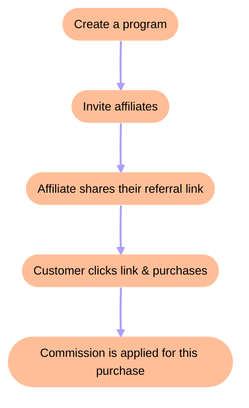

# Activates a license key
Source: https://docs.creem.io/api-reference/endpoint/activate-license

post /v1/licenses/activate
Activate a license key for a specific device or instance. Register new activations and track usage limits.


# Cancel a subscription
Source: https://docs.creem.io/api-reference/endpoint/cancel-subscription

post /v1/subscriptions/{id}/cancel
Cancel an active subscription immediately or schedule cancellation at period end.


# Creates a new checkout session
Source: https://docs.creem.io/api-reference/endpoint/create-checkout

post /v1/checkouts
Create a new checkout session to accept one-time payments or start subscriptions. Returns a checkout URL to redirect customers.


# Generate Customer Links
Source: https://docs.creem.io/api-reference/endpoint/create-customer-billing

post /v1/customers/billing
Generate a customer portal link for managing billing, subscriptions, and payment methods.


# Create a discount
Source: https://docs.creem.io/api-reference/endpoint/create-discount-code

post /v1/discounts
Create promotional discount codes for products. Set percentage or fixed amount discounts with expiration dates.


# Creates a new product
Source: https://docs.creem.io/api-reference/endpoint/create-product

post /v1/products
Create a new product for one-time payments or subscriptions. Configure pricing, billing cycles, and features.


# Deactivate a license key instance
Source: https://docs.creem.io/api-reference/endpoint/deactivate-license

post /v1/licenses/deactivate
Remove a device activation from a license key. Free up activation slots for new devices.


# Delete a discount
Source: https://docs.creem.io/api-reference/endpoint/delete-discount-code

delete /v1/discounts/{id}/delete
Permanently delete a discount code. Prevent further usage of the discount.


# Retrieve a checkout session
Source: https://docs.creem.io/api-reference/endpoint/get-checkout

get /v1/checkouts
Retrieve details of a checkout session by ID. View status, customer info, and payment details.


# Retrieve a customer
Source: https://docs.creem.io/api-reference/endpoint/get-customer

get /v1/customers
Retrieve customer information by ID or email. View purchase history, subscriptions, and profile details.


# Retrieve discount
Source: https://docs.creem.io/api-reference/endpoint/get-discount-code

get /v1/discounts
Retrieve discount code details by ID or code. Check usage limits, expiration, and discount amount.


# Retrieve a product
Source: https://docs.creem.io/api-reference/endpoint/get-product

get /v1/products
Retrieve product details by ID. View pricing, billing type, status, and product configuration.


# Retrieve a subscription
Source: https://docs.creem.io/api-reference/endpoint/get-subscription

get /v1/subscriptions
Retrieve subscription details by ID. View status, billing cycle, customer info, and payment history.


# Get a transaction by ID
Source: https://docs.creem.io/api-reference/endpoint/get-transaction

get /v1/transactions
Retrieve a single transaction by ID. View payment details, status, and associated order information.


# List all transactions
Source: https://docs.creem.io/api-reference/endpoint/get-transactions

get /v1/transactions/search
Search and retrieve payment transactions. Filter by customer, product, date range, and status.


# List all customers
Source: https://docs.creem.io/api-reference/endpoint/list-customers

get /v1/customers/list
Retrieve a paginated list of all customers. Filter and search through your customer base.


# Pause a subscription
Source: https://docs.creem.io/api-reference/endpoint/pause-subscription

post /v1/subscriptions/{id}/pause
Temporarily pause a subscription. Stop billing while retaining the subscription for later resumption.


# Resume a paused subscription
Source: https://docs.creem.io/api-reference/endpoint/resume-subscription

post /v1/subscriptions/{id}/resume
Resume a previously paused subscription. Restart billing and restore access to the subscription.


# List all products
Source: https://docs.creem.io/api-reference/endpoint/search-products

get /v1/products/search
Search and retrieve a paginated list of products. Filter by status, billing type, and other criteria.


# Update a subscription
Source: https://docs.creem.io/api-reference/endpoint/update-subscription

post /v1/subscriptions/{id}
Modify subscription details like units, seats, or add-ons. Support proration and immediate billing options.


# Upgrade a subscription to a different product
Source: https://docs.creem.io/api-reference/endpoint/upgrade-subscription

post /v1/subscriptions/{id}/upgrade
Upgrade a subscription to a different product or plan. Handle proration and plan changes seamlessly.


# Validates a license key or instance
Source: https://docs.creem.io/api-reference/endpoint/validate-license

post /v1/licenses/validate
Verify if a license key is valid and active for a specific instance. Check activation status and expiration.


# Error Handling
Source: https://docs.creem.io/api-reference/error-codes

Understanding API error responses and how to handle them.

## Error Response Format

When an API request fails, Creem returns a JSON error response:

```json theme={null}
{
  "trace_id": "550e8400-e29b-41d4-a716-446655440000",
  "status": 400,
  "error": "Bad Request",
  "message": ["The 'product_id' field is required."],
  "timestamp": 1706889600000
}
```

| Field       | Type      | Description                                              |
| ----------- | --------- | -------------------------------------------------------- |
| `trace_id`  | string    | Unique identifier for the request (useful for debugging) |
| `status`    | number    | HTTP status code                                         |
| `error`     | string    | Error category                                           |
| `message`   | string\[] | Array of human-readable error messages                   |
| `timestamp` | number    | Unix timestamp in milliseconds                           |

<Note>
  The `trace_id` is included in every error response. Include it when contacting support for faster debugging.
</Note>

## HTTP Status Codes

| Status | Error       | When It Occurs                                                   |
| ------ | ----------- | ---------------------------------------------------------------- |
| `400`  | Bad Request | Invalid request parameters, malformed JSON, or validation errors |
| `403`  | Forbidden   | Invalid API key or insufficient permissions                      |
| `404`  | Not Found   | Requested resource doesn't exist                                 |

## Common Error Scenarios

### Authentication Errors (403 Forbidden)

Returned when the API key is missing, invalid, or doesn't have permission for the requested resource.

```json theme={null}
{
  "trace_id": "550e8400-e29b-41d4-a716-446655440000",
  "status": 403,
  "error": "Forbidden",
  "timestamp": 1706889600000
}
```

**How to fix:**

* Verify your API key in the [dashboard](https://creem.io/dashboard/developers)
* Ensure the `x-api-key` header is included in your request
* Check you're using the correct key for the environment (test vs. production)

```bash theme={null}
curl -X GET https://api.creem.io/v1/products \
  -H "x-api-key: creem_YOUR_API_KEY"
```

### Validation Errors (400 Bad Request)

Returned when request parameters are missing or invalid.

```json theme={null}
{
  "trace_id": "550e8400-e29b-41d4-a716-446655440000",
  "status": 400,
  "error": "Bad Request",
  "message": ["product_id must be a string", "success_url must be a valid URL"],
  "timestamp": 1706889600000
}
```

**How to fix:**

* Check the `message` array for specific validation errors
* Verify all required fields are included
* Ensure data types match the expected format

### Resource Not Found (404)

Returned when the requested resource doesn't exist.

```json theme={null}
{
  "trace_id": "550e8400-e29b-41d4-a716-446655440000",
  "status": 404,
  "error": "Bad Request",
  "message": ["Product not found"],
  "timestamp": 1706889600000
}
```

**How to fix:**

* Verify the resource ID is correct
* Ensure you're using the right environment (test vs. production resources are separate)
* Check if the resource was deleted

### Duplicate Resource (400 Bad Request)

Returned when trying to create a resource that already exists.

```json theme={null}
{
  "trace_id": "550e8400-e29b-41d4-a716-446655440000",
  "status": 400,
  "error": "Bad Request",
  "message": ["A resource with this identifier already exists"],
  "timestamp": 1706889600000
}
```

**How to fix:**

* Use a unique identifier for idempotent requests
* Check if the resource already exists before creating

## Handling Errors in Code

### TypeScript SDK

```typescript theme={null}
import { createCreem } from 'creem_io';

const creem = createCreem({ apiKey: process.env.CREEM_API_KEY! });

try {
  const checkout = await creem.checkouts.create({
    productId: 'prod_123',
    successUrl: 'https://example.com/success',
  });
} catch (error) {
  if (error.response) {
    const { trace_id, status, message } = error.response.data;
    console.error(`Error ${status}: ${message.join(', ')}`);
    console.error(`Trace ID: ${trace_id}`);
  }
}
```

### cURL

```bash theme={null}
# The response includes the trace_id for debugging
curl -X POST https://api.creem.io/v1/checkouts \
  -H "x-api-key: creem_YOUR_API_KEY" \
  -H "Content-Type: application/json" \
  -d '{"product_id": "invalid"}' \
  -w "\nHTTP Status: %{http_code}\n"
```

## Environments

Make sure you're using the correct base URL:

| Environment | Base URL                    |
| ----------- | --------------------------- |
| Production  | `https://api.creem.io`      |
| Test Mode   | `https://test-api.creem.io` |

<Warning>
  Test mode API keys only work with `test-api.creem.io`, and production keys only work with `api.creem.io`.
</Warning>

## Need Help?

If you're experiencing issues:

1. Check the `trace_id` in your error response
2. Join our [Discord community](https://discord.gg/q3GKZs92Av) for quick help
3. [Contact support](https://creem.io/contact) with your trace ID for faster debugging


# Introduction
Source: https://docs.creem.io/api-reference/introduction

Understand general concepts, response codes, and authentication strategies.

## Base URL

The Creem API is built on REST principles. We enforce HTTPS in every request to improve data security, integrity, and privacy. The API does not support HTTP.

All requests contain the following base URL:

```http theme={null}
https://api.creem.io
```

<Warning>
  If you're in test mode, use `https://test-api.creem.io` instead of
  `https://api.creem.io`. Learn more about [Test
  Mode](/getting-started/test-mode).
</Warning>

## Authentication

To authenticate you need to add an `x-api-key` header with the contents of the header being your API Key.
All API endpoints are authenticated using API Keys and picked up from the specification file.

```json theme={null}
{
  "headers": {
    "x-api-key": "creem_123456789"
  }
}
```

## Response codes

Creem uses standard HTTP codes to indicate the success or failure of your requests.
In general, 2xx HTTP codes correspond to success, 4xx codes are for user-related failures, and 5xx codes are for infrastructure issues.

| Status | Description                             |
| ------ | --------------------------------------- |
| 200    | Successful request.                     |
| 400    | Check that the parameters were correct. |
| 401    | The API key used was missing.           |
| 403    | The API key used was invalid.           |
| 404    | The resource was not found.             |
| 429    | The rate limit was exceeded.            |
| 500    | Indicates an error with Creem servers.  |


# Community Resources
Source: https://docs.creem.io/code/community/community-resources

Discover SDKs, templates, boilerplates, and other resources built by our community to help you integrate Creem faster.

<Frame>
  <div>
    <div>
      <h1>
        Community Resources
      </h1>
    </div>

    <p>
      SDKs, templates, boilerplates, and tools built by our community
    </p>

    <p>
      Explore resources created by developers in our community to accelerate
      your Creem integration and build better payment experiences.
    </p>

    <div>
      <a href="#sdks">SDKs</a> · <a href="#plugins">Plugins</a> ·
      <a href="#templates">Templates</a> · <a href="#boilerplates">Boilerplates</a> ·
      <a href="#tools">Tools</a> · <a href="#other-resources">Other</a>
    </div>
  </div>
</Frame>

***

## Introduction

Our community has built an incredible collection of resources to help you integrate Creem into your applications faster. From official SDKs to community-maintained templates and boilerplates, you'll find everything you need to get started.

<Warning>
  Resources highlighted here are maintained by third-party developers. We do our
  best to showcase helpful projects, but Creem is

  <strong>
    not liable for any code or dependencies you install from third-party sources
  </strong>

  . Always review the code before integrating.
</Warning>

***

## Boilerplates

Minimal boilerplates and code snippets to help you get started quickly. These are lightweight starting points that you can customize for your specific needs.

| Name                                       | Description                                         | Repository                             | Use Case                          |
| ------------------------------------------ | --------------------------------------------------- | -------------------------------------- | --------------------------------- |
| [SaaSKit](/code/community/saaskit)         | TanStack Start boilerplate with Creem integration   | [Website](https://saaskit.paceui.com/) | Full-stack SaaS starter           |
| [Supastarter](/code/community/supastarter) | Next.js SaaS starter kit with Creem payment support | [Website](https://supastarter.dev/)    | Production-ready SaaS boilerplate |

***

## SDKs

Community-maintained SDKs and adapters for various frameworks and languages. These SDKs provide type-safe wrappers around the Creem API, making integration seamless.

| Name                                     | Language/Framework | Description                                                   | Repository                                         | Maintainer |
| ---------------------------------------- | ------------------ | ------------------------------------------------------------- | -------------------------------------------------- | ---------- |
| [Nuxt Creem](/code/community/nuxt-creem) | Nuxt               | Nuxt module for Creem integration with typed API and webhooks | [GitHub](https://github.com/justserdar/nuxt-creem) | Community  |
| [Krema](/code/community/krema)           | TypeScript         | TypeScript SDK for Creem API with type generation             | [GitHub](https://github.com/emirsassan/krema)      | Community  |

<Note>
  Looking for official SDKs? Check out our
  <a href="/code/sdks/typescript">TypeScript SDK</a> and
  <a href="/code/sdks/nextjs">Next.js adapter</a>.
</Note>

***

## Plugins

Plugins and integrations for popular platforms like WordPress, enabling seamless Creem integration without custom code.

| Name                    | Platform  | Description                                                                                        | Repository                                           | Maintainer |
| ----------------------- | --------- | -------------------------------------------------------------------------------------------------- | ---------------------------------------------------- | ---------- |
| Creem WordPress Plugin  | WordPress | Connect WordPress with Creem to automatically create user accounts when customers make a purchase. | [GitHub](https://github.com/sinanisler/creem-io-api) | Sinan      |
| Creem Raycast Extension | Raycast   | Manage Creem products, customers, and checkouts directly from the Raycast launcher.                | [Raycast](https://www.raycast.com/xmok/creem)        | xmok       |

<Tip>
  Building a plugin for another platform? Share it in our Discord and we'll feature it here!
</Tip>

***

## Templates

Ready-to-use templates and starter projects that demonstrate best practices for integrating Creem. These templates include authentication, database setup, and complete payment flows.

| Name                                                                      | Stack              | Description                                        | Repository                                                      | Features                          |
| ------------------------------------------------------------------------- | ------------------ | -------------------------------------------------- | --------------------------------------------------------------- | --------------------------------- |
| [Creem Checkout Next.js Demo](/code/community/creem-checkout-nextjs-demo) | Next.js + Supabase | Next.js demo showcasing Creem checkout integration | [GitHub](https://github.com/ja3nyc/creem-checkout-next-js-demo) | Checkout, Subscriptions, Webhooks |

<Tip>
  Our official <a href="/code/sdks/templates">Next.js template</a> includes
  Prisma, Better Auth, and Shadcn UI out of the box.
</Tip>

***

## Other Resources

Additional resources including tutorials, blog posts, video guides, entertaining content, and other helpful content.

| Name                  | Type  | Description                                                            | Link                                         | Author |
| --------------------- | ----- | ---------------------------------------------------------------------- | -------------------------------------------- | ------ |
| Creem YouTube Channel | Video | Official Creem YouTube channel with entertaining content and fun stuff | [YouTube](https://www.youtube.com/@creem_io) | Creem  |

***

## Contributing

We love seeing what our community builds! If you've created an SDK, template, boilerplate, or tool that uses Creem, we'd love to feature it here.

### How to Submit

1. **Join our Discord** - Connect with the community at [discord.gg/q3GKZs92Av](https://discord.gg/q3GKZs92Av)
2. **Share your resource** - Post in the #showcase channel with:
   * A brief description
   * Repository link
   * Screenshots or demo (if applicable)
3. **Get featured** - Our team reviews submissions and adds the best ones to this page

### Guidelines

* Resources should be actively maintained
* Include clear documentation and examples
* Follow best practices for security and performance
* Be respectful and inclusive in your code and documentation

***

## Resources

<CardGroup>
  <Card title="Join Discord" icon="discord" href="https://discord.gg/q3GKZs92Av">
    Connect with other developers and get help from the community.
  </Card>

  <Card title="Official SDKs" icon="code" href="/code/sdks/typescript">
    Check out our official TypeScript SDK and framework adapters.
  </Card>

  <Card title="API Reference" icon="book" href="/api-reference/introduction">
    Explore the complete Creem API documentation.
  </Card>
</CardGroup>

***

Need help? Reach us at [support@creem.io](https://creem.io/contact) or join the [Discord community](https://discord.gg/q3GKZs92Av).


# SaaSKit
Source: https://docs.creem.io/code/community/community-resources/boilerplates/saaskit

TanStack Start boilerplate with Creem payment integration built-in.

## Overview

SaaSKit is a community-maintained TanStack Start boilerplate that includes Creem as a payment provider option. It provides a full-stack starter template with authentication, database, and payment flows pre-configured.

## Features

* **TanStack Start** - Full-stack React framework
* **Creem Integration** - Pre-configured payment flows using Creem as Merchant of Record
* **Authentication** - Better Auth with RBAC support
* **Database** - Drizzle ORM with PostgreSQL
* **Email** - Resend integration for transactional emails
* **Storage** - S3-compatible file uploads
* **Admin Dashboard** - Built-in admin interface
* **UI Components** - DaisyUI and Tailwind CSS components

## Creem Integration

SaaSKit includes Creem payment integration out of the box, allowing you to accept payments and manage subscriptions without additional setup. The boilerplate handles checkout sessions, webhooks, and subscription management.

## Resources

<CardGroup>
  <Card title="SaaSKit Website" icon="rocket" href="https://saaskit.paceui.com/">
    Visit the official SaaSKit website for documentation and setup instructions.
  </Card>

  <Card title="Creem TypeScript SDK" icon="code" href="/code/sdks/typescript">
    Learn about the Creem SDK used in SaaSKit.
  </Card>
</CardGroup>


# Creem Checkout Next.js Demo
Source: https://docs.creem.io/code/community/creem-checkout-nextjs-demo

Next.js demo application showcasing Creem checkout integration with authentication and subscription management.

## About Creem Checkout Next.js Demo

A Next.js demo application that demonstrates how to integrate Creem checkout flows into a Next.js application. The demo includes authentication, product listing, checkout sessions, subscription management, and webhook handling.

### Features

* **Checkout Integration:** Complete checkout flow with Creem payment processing
* **Product Management:** List and display Creem products with pricing
* **Subscription Management:** Get subscription details and cancel subscriptions
* **Customer Portal:** Create billing portal sessions for customer management
* **Webhook Handling:** Webhook signature verification and event handling
* **Security:** Redirect signature verification for secure payment flows
* **Authentication:** Supabase integration for user authentication

### Stack

* Next.js (App Router)
* TypeScript
* Supabase (Authentication)
* Creem API

***

## Resources

<CardGroup>
  <Card title="GitHub Repository" icon="github" href="https://github.com/ja3nyc/creem-checkout-next-js-demo">
    View the source code and documentation on GitHub.
  </Card>

  <Card title="Creem Integration" icon="credit-card" href="/code/sdks/typescript">
    Learn about Creem's payment integration.
  </Card>
</CardGroup>


# Krema
Source: https://docs.creem.io/code/community/krema

Unofficial TypeScript SDK for the Creem API with type-safe access to products, licenses, checkouts, and discounts.

## About Krema

Krema is an unofficial TypeScript SDK for the Creem API that provides type-safe access to Creem's payment features. It includes utilities for generating type definitions from your Creem products and managing checkouts, licenses, and discount codes.

### Features

* **Type Generation:** Generate TypeScript type definitions from your Creem API products
* **Checkout Sessions:** Create checkout sessions with type-safe product references
* **License Management:** Activate, validate, and deactivate licenses
* **Discount Codes:** Create and manage percentage and fixed-amount discount codes
* **CLI Tool:** Command-line interface for generating types
* **Configuration:** Support for `.env` files or `.kremarc` configuration file

### Stack

* TypeScript
* Creem API

***

## Resources

<CardGroup>
  <Card title="GitHub Repository" icon="github" href="https://github.com/emirsassan/krema">
    View the source code and documentation on GitHub.
  </Card>

  <Card title="Creem Integration" icon="credit-card" href="/code/sdks/typescript">
    Learn about Creem's payment integration.
  </Card>
</CardGroup>


# Nuxt Creem
Source: https://docs.creem.io/code/community/nuxt-creem

Nuxt module for integrating Creem payments with typed API, server utilities, and webhook support.

## About Nuxt Creem

Nuxt Creem is a Nuxt module that provides an easy way to integrate Creem payments into your Nuxt application. It utilizes the official Creem API for server-side operations and includes type-safe utilities for common payment flows.

### Features

* **Typed Creem API:** Easily import and load Creem products with full TypeScript support
* **Server Utils:** Auto-injected server utilities for quick checkout session creation
* **Customer Portal:** Support for generating customer billing portal links
* **Webhooks:** Built-in webhook header verification and event type handling
* **Default Handler:** Pre-configured webhook handler for common events

### Stack

* Nuxt 3
* TypeScript
* Creem API

***

## Resources

<CardGroup>
  <Card title="GitHub Repository" icon="github" href="https://github.com/justserdar/nuxt-creem">
    View the source code and documentation on GitHub.
  </Card>

  <Card title="Module Website" icon="rocket" href="https://nuxt-creem.justserdar.dev">
    Visit the Nuxt Creem module website.
  </Card>

  <Card title="Creem Integration" icon="credit-card" href="/code/sdks/typescript">
    Learn about Creem's payment integration.
  </Card>
</CardGroup>


# SaaSKit
Source: https://docs.creem.io/code/community/saaskit

TanStack Start boilerplate with Creem payment integration for building SaaS applications.

## About SaaSKit

SaaSKit is a modular TanStack Start boilerplate that includes Creem payment integration out of the box. It provides a production-ready foundation for building SaaS applications with authentication, database, email, and payment handling already configured.

### Features

* **Payments:** Integrated with Creem as Merchant of Record
* **Authentication:** Better Auth with Role-Based Access Control (RBAC)
* **Database:** Drizzle ORM with PostgreSQL
* **Email:** Resend integration for transactional emails
* **Storage:** S3-compatible file uploads
* **Admin Dashboard:** Built-in admin interface
* **UI Components:** DaisyUI and Tailwind CSS components

### Stack

* TanStack Start (React framework)
* TypeScript
* Drizzle ORM
* Better Auth
* Creem (Payments)

***

## Resources

<CardGroup>
  <Card title="SaaSKit Website" icon="rocket" href="https://saaskit.paceui.com/">
    Visit the official SaaSKit website to learn more.
  </Card>

  <Card title="Creem Integration" icon="credit-card" href="/code/sdks/typescript">
    Learn about Creem's payment integration.
  </Card>
</CardGroup>


# Supastarter
Source: https://docs.creem.io/code/community/supastarter

Production-ready Next.js SaaS starter kit with Creem payment integration and full-stack features.

## About Supastarter

Supastarter is a production-ready Next.js SaaS starter kit that includes Creem payment integration. It provides a complete foundation for building scalable SaaS applications with authentication, billing, organizations, and admin features already configured.

### Features

* **Payments:** Integrated with Creem as Merchant of Record. Includes complete billing flow, billing components, and seat-based billing.
* **Authentication:** Better Auth with password, magic link, OAuth, 2FA, roles & permissions, and super admin features.
* **Organizations:** Multi-tenant support with seat-based billing, member roles, and resource sharing.
* **Database:** Choose between Prisma or Drizzle ORM with PostgreSQL support.
* **API:** Type-safe REST API built with Hono, includes oRPC integration and OpenAPI specs.
* **Internationalization:** Multi-language support with translatable mail templates.
* **Additional Features:** Admin UI, AI chatbot (Vercel AI SDK), background tasks, analytics, landing page, blog, documentation, and more.

### Stack

* Next.js 16 (App Router)
* TypeScript
* Tailwind CSS & Radix UI
* Better Auth
* Prisma or Drizzle ORM
* Hono (API framework)
* Creem (Payments)

***

## Resources

<CardGroup>
  <Card title="Supastarter Website" icon="rocket" href="https://supastarter.dev/">
    Visit the official Supastarter website to learn more and see the demo.
  </Card>

  <Card title="Creem Integration" icon="credit-card" href="/code/sdks/typescript">
    Learn about Creem's payment integration.
  </Card>
</CardGroup>


# MCP
Source: https://docs.creem.io/code/mcp

Model Context Protocol integration

# MCP

Documentation coming soon.


# AI Agents
Source: https://docs.creem.io/code/sdks/ai-agents

Integrate Creem faster with AI coding assistants like Claude Code, Cursor, Windsurf, and other AI-powered development tools using our official skill.

AI coding assistants like Claude Code, Cursor, and Windsurf are transforming how developers build software. To help you integrate Creem faster and with best practices built-in, we've created an official **Creem API Skill** that gives AI assistants deep knowledge about our payment infrastructure.

## Quick Install for Claude Code

Install the Creem skill with a single command:

```bash theme={null}
/plugin marketplace add armitage-labs/creem-skills
```

Then install the skill using either method:

**Option A: Use the interactive UI (easiest)**

1. Type `/plugin` and press Enter
2. Go to the **Discover** tab
3. Search for `creem-api`
4. Press Enter to install

**Option B: Use the command directly**

```bash theme={null}
/plugin install creem-api@creem-skills
```

<Tip>
  That's it! Claude Code now has complete knowledge of the Creem API and will
  generate production-ready integration code when you ask about payments,
  subscriptions, webhooks, or licenses.
</Tip>

***

## What is a Skill?

A skill is a structured set of instructions and reference materials that AI assistants use to provide more accurate, contextual help for specific tasks. When you load the Creem skill, your AI assistant gains comprehensive knowledge about:

* All 24 API endpoints with request/response schemas
* Webhook events and signature verification
* Common integration patterns and workflows
* Best practices for security and error handling
* Test mode configuration

***

## Get the Skill

<CardGroup>
  <Card title="Claude Code (Recommended)" icon="terminal">
    ```bash theme={null}
    /plugin marketplace add armitage-labs/creem-skills
    /plugin install creem-api@creem-skills
    ```
  </Card>

  <Card title="GitHub Repository" icon="github" href="https://github.com/armitage-labs/creem-skills">
    Clone, fork, or download the skill files directly
  </Card>

  <Card title="Download ZIP" icon="download" href="https://github.com/armitage-labs/creem-skills/archive/refs/heads/main.zip">
    Download as a ZIP file for manual setup
  </Card>
</CardGroup>

***

## Skill Contents

The skill includes four comprehensive reference files:

| File           | Description                                                 |
| -------------- | ----------------------------------------------------------- |
| `Skill.md`     | Core skill with quick reference and implementation patterns |
| `REFERENCE.md` | Complete API reference with all endpoints and schemas       |
| `WEBHOOKS.md`  | Webhook events documentation with payload examples          |
| `WORKFLOWS.md` | Step-by-step integration guides for common use cases        |

### What's Covered

<AccordionGroup>
  <Accordion title="API Endpoints (24 total)">
    * **Checkouts**: Create and retrieve checkout sessions
    * **Products**: Create, retrieve, and list products
    * **Customers**: Manage customers and portal links
    * **Subscriptions**: Full lifecycle management (get, update, upgrade, cancel, pause, resume)
    * **Licenses**: Activation, validation, and deactivation
    * **Discounts**: Create, retrieve, and delete promotional codes
    * **Transactions**: Query payment history
  </Accordion>

  <Accordion title="Webhook Events (10 types)">
    * `checkout.completed` - Payment successful
    * `subscription.active` - New subscription created
    * `subscription.paid` - Recurring payment processed
    * `subscription.canceled` - Subscription ended
    * `subscription.expired` - Period ended without payment
    * `subscription.trialing` - Trial started
    * `subscription.paused` - Subscription paused
    * `subscription.update` - Subscription modified
    * `refund.created` - Refund processed
    * `dispute.created` - Chargeback opened
  </Accordion>

  <Accordion title="Integration Workflows">
    * Basic SaaS subscription flows
    * One-time purchases with digital delivery
    * License key systems for desktop/mobile apps
    * Seat-based team billing
    * Freemium with upgrade flows
    * Affiliate and referral tracking
  </Accordion>

  <Accordion title="Best Practices">
    * Webhook signature verification (HMAC-SHA256)
    * Error handling patterns
    * Test mode development
    * Security considerations
    * Idempotency and retry handling
  </Accordion>
</AccordionGroup>

***

## Setup by AI Tool

### Claude Code

<Note>
  **Recommended Method**: Use the plugin marketplace for the easiest setup experience.
</Note>

**One-Line Install (Plugin Marketplace)**

Claude Code's plugin marketplace makes installation effortless:

<Steps>
  <Step title="Add the Marketplace">
    Open Claude Code and run:

    ```bash theme={null}
    /plugin marketplace add armitage-labs/creem-skills
    ```
  </Step>

  <Step title="Install the Skill">
    **Option A: Interactive UI (easiest)**

    Type `/plugin`, go to the **Discover** tab, search for `creem-api`, and press Enter to install.

    **Option B: Command**

    ```bash theme={null}
    /plugin install creem-api@creem-skills
    ```
  </Step>

  <Step title="Start Building">
    Ask Claude to help with Creem integration:

    ```
    Help me create a checkout flow for my SaaS product
    ```
  </Step>
</Steps>

**Managing the Plugin**

```bash theme={null}
# View installed plugins
/plugin

# Disable the skill temporarily
/plugin disable creem-api@creem-skills

# Enable again
/plugin enable creem-api@creem-skills

# Uninstall
/plugin uninstall creem-api@creem-skills

# Update marketplace to get latest version
/plugin marketplace update creem-skills
```

**Alternative: Direct Reference**

If you prefer not to use the marketplace, you can reference the skill directly in any conversation:

```
Help me integrate Creem payments. Use the skill at https://github.com/armitage-labs/creem-skills
```

***

### Cursor

Cursor supports adding context through multiple methods:

**Option 1: Add to Project**

1. Clone the skill repository into your project:

   ```bash theme={null}
   git clone https://github.com/armitage-labs/creem-skills.git .cursor/skills
   ```

2. Reference the skill files in your conversations using `@` mentions:

   ```
   @.cursor/skills/creem-api/Skill.md Help me create a checkout flow
   ```

**Option 2: Custom Instructions**

Add the skill content to your project's `.cursorrules` file:

```
When working with Creem payment integration:
- Use the Creem API at https://api.creem.io (or test-api.creem.io for test mode)
- Authenticate with x-api-key header
- Always verify webhook signatures using HMAC-SHA256
- Prices are in cents (1000 = $10.00)
- Reference: .cursor/skills/creem-api/
```

**Option 3: Docs Integration**

Add the Creem documentation to Cursor's docs:

1. Open Cursor Settings → Features → Docs
2. Add: `https://docs.creem.io`
3. Cursor will index our documentation for context

***

### Windsurf

Windsurf supports custom knowledge through its Cascade feature:

1. Clone the skill repository:

   ```bash theme={null}
   git clone https://github.com/armitage-labs/creem-skills.git .windsurf/creem
   ```

2. Add to your project's knowledge base in Windsurf settings

3. Reference in conversations:

   ```
   Using the Creem skill, help me implement subscription billing
   ```

***

### Other AI Tools

For other AI coding assistants (GitHub Copilot Chat, Cody, Continue, etc.):

1. **Download the skill files** from the GitHub repository
2. **Add to your project** in a dedicated folder (e.g., `.ai/creem/`)
3. **Reference in context** when asking questions about Creem integration
4. **Copy relevant sections** into your conversation when needed

Most AI tools support adding files to conversation context - simply include the relevant skill file when working on payment integration.

***

## Example Usage

Once the skill is loaded, you can ask natural language questions and get production-ready code:

### Creating a Checkout

<CodeGroup>
  ```text Prompt theme={null}
  Create a checkout API route for my Next.js app that handles subscription purchases
  with metadata tracking
  ```

  ```typescript Generated Code theme={null}
  // app/api/checkout/route.ts
  import { NextRequest, NextResponse } from 'next/server';

  const CREEM_API_KEY = process.env.CREEM_API_KEY!;
  const BASE_URL =
    process.env.NODE_ENV === 'production'
      ? 'https://api.creem.io'
      : 'https://test-api.creem.io';

  export async function POST(req: NextRequest) {
    const { productId, userId, email } = await req.json();

    const response = await fetch(`${BASE_URL}/v1/checkouts`, {
      method: 'POST',
      headers: {
        'x-api-key': CREEM_API_KEY,
        'Content-Type': 'application/json',
      },
      body: JSON.stringify({
        product_id: productId,
        request_id: `checkout_${userId}_${Date.now()}`,
        success_url: `${process.env.NEXT_PUBLIC_APP_URL}/success`,
        customer: { email },
        metadata: { userId, source: 'webapp' },
      }),
    });

    const checkout = await response.json();
    return NextResponse.json({ checkoutUrl: checkout.checkout_url });
  }
  ```
</CodeGroup>

### Handling Webhooks

<CodeGroup>
  ```text Prompt theme={null}
  Create a webhook handler that verifies signatures and handles subscription events
  ```

  ```typescript Generated Code theme={null}
  // app/api/webhooks/creem/route.ts
  import { NextRequest, NextResponse } from 'next/server';
  import crypto from 'crypto';

  export async function POST(req: NextRequest) {
    const signature = req.headers.get('creem-signature');
    const rawBody = await req.text();

    // Verify signature
    const computed = crypto
      .createHmac('sha256', process.env.CREEM_WEBHOOK_SECRET!)
      .update(rawBody)
      .digest('hex');

    if (computed !== signature) {
      return NextResponse.json({ error: 'Invalid signature' }, { status: 401 });
    }

    const event = JSON.parse(rawBody);

    switch (event.eventType) {
      case 'checkout.completed':
        await handleCheckoutCompleted(event.object);
        break;
      case 'subscription.paid':
        await handleSubscriptionPaid(event.object);
        break;
      case 'subscription.canceled':
        await handleSubscriptionCanceled(event.object);
        break;
    }

    return NextResponse.json({ received: true });
  }
  ```
</CodeGroup>

### License Key Integration

<CodeGroup>
  ```text Prompt theme={null}
  Implement license key activation and validation for my Electron desktop app
  ```

  ```typescript Generated Code theme={null}
  // license.ts
  import Store from 'electron-store';
  import { machineIdSync } from 'node-machine-id';

  const store = new Store<{ license: LicenseState }>();
  const API_URL = 'https://api.creem.io';

  export async function activateLicense(licenseKey: string) {
    const instanceName = machineIdSync();

    const response = await fetch(`${API_URL}/v1/licenses/activate`, {
      method: 'POST',
      headers: {
        'x-api-key': process.env.CREEM_API_KEY!,
        'Content-Type': 'application/json',
      },
      body: JSON.stringify({
        key: licenseKey,
        instance_name: instanceName,
      }),
    });

    if (!response.ok) {
      const error = await response.json();
      throw new Error(error.message || 'Activation failed');
    }

    const license = await response.json();
    store.set('license', {
      key: licenseKey,
      instanceId: license.instance.id,
      expiresAt: license.expires_at,
    });

    return license;
  }

  export async function validateLicense() {
    const stored = store.get('license');
    if (!stored) return { valid: false, status: 'not_activated' };

    const response = await fetch(`${API_URL}/v1/licenses/validate`, {
      method: 'POST',
      headers: {
        'x-api-key': process.env.CREEM_API_KEY!,
        'Content-Type': 'application/json',
      },
      body: JSON.stringify({
        key: stored.key,
        instance_id: stored.instanceId,
      }),
    });

    const license = await response.json();
    return { valid: license.status === 'active', status: license.status };
  }
  ```
</CodeGroup>

***

## Why Use the Skill?

<CardGroup>
  <Card title="Faster Development" icon="bolt">
    Skip reading documentation - describe what you want and get working code
    instantly
  </Card>

  <Card title="Best Practices Built-in" icon="shield-check">
    Generated code includes security patterns, error handling, and production
    considerations
  </Card>

  <Card title="Always Up-to-Date" icon="rotate">
    We maintain the skill alongside our API - you always get current patterns
  </Card>
</CardGroup>

### Comparison

| Without Skill                       | With Skill                           |
| ----------------------------------- | ------------------------------------ |
| Read API docs, find endpoints       | Describe your goal in plain English  |
| Copy-paste examples, adapt manually | Get tailored, working code           |
| Miss edge cases and best practices  | Security and error handling included |
| Search for webhook payload formats  | Full payload examples in context     |
| Trial and error with parameters     | Correct parameters from the start    |

***

## Skill vs SDK

The Creem skill is designed for **direct API integration** and complements our SDKs:

| Use the Skill When              | Use an SDK When                           |
| ------------------------------- | ----------------------------------------- |
| Building custom integrations    | Using Next.js, TypeScript, or Better Auth |
| Learning the API                | Want type-safety and abstractions         |
| Working with any language       | Prefer pre-built components               |
| Need full control over requests | Want faster development with helpers      |

<Note>
  The skill focuses on the REST API. For SDK-specific help, see our [TypeScript
  SDK](/code/sdks/typescript), [Next.js SDK](/code/sdks/nextjs), or [Better
  Auth](/code/sdks/better-auth) documentation.
</Note>

***

## Contributing

Found an issue or want to improve the skill? We welcome contributions:

<CardGroup>
  <Card title="Report Issues" icon="bug" href="https://github.com/armitage-labs/creem-skills/issues">
    Found a bug or incorrect information? Let us know
  </Card>

  <Card title="Contribute" icon="code-pull-request" href="https://github.com/armitage-labs/creem-skills/pulls">
    Submit improvements or new workflow examples
  </Card>
</CardGroup>

***

## Next Steps

<CardGroup>
  <Card title="Install the Skill" icon="terminal" href="https://github.com/armitage-labs/creem-skills">
    Run `/plugin marketplace add armitage-labs/creem-skills` in Claude Code
  </Card>

  <Card title="API Reference" icon="book" href="/api-reference/introduction">
    Explore the full API documentation
  </Card>

  <Card title="Webhooks Guide" icon="webhook" href="/code/webhooks">
    Learn about real-time event handling
  </Card>

  <Card title="Test Mode" icon="flask" href="/getting-started/test-mode">
    Set up your development environment
  </Card>
</CardGroup>


# Better Auth
Source: https://docs.creem.io/code/sdks/better-auth

Integrate authentication and payment processing seamlessly with Better Auth and Creem.

## Overview

Welcome to the integration guide for Creem and Better Auth! This integration enables you to combine powerful authentication capabilities with seamless payment processing and subscription management.

[Better Auth](https://better-auth.com) is a modern authentication framework for TypeScript that provides comprehensive user management, session handling, and authentication flows. By integrating Better Auth with Creem, you can:

* Automatically synchronize customer and subscription data with your users
* Grant or revoke access based on subscription status
* Manage subscriptions directly through your authentication layer
* Handle payments and billing for authenticated users
* Prevent trial abuse across multiple subscriptions

<Accordion title="What you'll learn">
  How to integrate Better Auth with Creem to build a complete authentication and payment solution for your SaaS application.
</Accordion>

<Card title="Requirements" icon="gears">
  * A Creem account
  * Your Creem API keys
  * A TypeScript/JavaScript application
  * A database (PostgreSQL, MySQL, or SQLite)
</Card>

## Installation

<Steps>
  <Step>
    ### Install the plugin

    Install the Better Auth Creem plugin in your project:

    <CodeGroup>
      ```bash npm theme={null}
      npm install @creem_io/better-auth
      ```

      ```bash pnpm theme={null}
      pnpm add @creem_io/better-auth
      ```

      ```bash yarn theme={null}
      yarn add @creem_io/better-auth
      ```

      ```bash bun theme={null}
      bun install @creem_io/better-auth
      ```
    </CodeGroup>

    <Note>
      If you're using a separate client and server setup, make sure to install the plugin in both parts of your project.
    </Note>
  </Step>

  <Step>
    ### Get your Creem API Key

    1. Navigate to the [Creem dashboard](https://creem.io/dashboard/developers)
    2. Click on the "Developers" menu
    3. Copy your API key
    4. Add it to your environment variables:

    ```bash theme={null}
    # .env
    CREEM_API_KEY=your_api_key_here
    ```

    <Warning>
      Test Mode and Production have different API keys. Make sure you're using the correct one for your environment.
    </Warning>
  </Step>
</Steps>

## Configuration

### Server Configuration

Configure Better Auth with the Creem plugin:

```typescript theme={null}
// lib/auth.ts
import { betterAuth } from 'better-auth';
import { creem } from '@creem_io/better-auth';

export const auth = betterAuth({
  database: {
    // your database config
  },
  plugins: [
    creem({
      apiKey: process.env.CREEM_API_KEY!,
      webhookSecret: process.env.CREEM_WEBHOOK_SECRET, // Optional
      testMode: true, // Use test mode for development
      defaultSuccessUrl: '/success', // Redirect URL after payments
      persistSubscriptions: true, // Enable database persistence (recommended)
    }),
  ],
});
```

### Client Configuration

```typescript theme={null}
// lib/auth-client.ts
import { createAuthClient } from 'better-auth/react';
import { creemClient } from '@creem_io/better-auth/client';

export const authClient = createAuthClient({
  baseURL: process.env.NEXT_PUBLIC_APP_URL,
  plugins: [creemClient()],
});
```

### Database Migration

Generate and run the database schema for subscription persistence:

```bash theme={null}
npx @better-auth/cli generate
npx @better-auth/cli migrate
```

## Webhook Setup

<Steps>
  <Step>
    ### Create Webhook in Creem Dashboard

    1. Go to your [Creem dashboard](https://creem.io/dashboard/developers/webhooks)
    2. Click on the "Developers" tab
    3. Navigate to the "Webhooks" section
    4. Click "Add Webhook"
    5. Enter your webhook URL:

    ```text theme={null}
    https://your-domain.com/api/auth/creem/webhook
    ```

    <Info>
      The `/api/auth` prefix is the default Better Auth server path. Adjust if you've customized your Better Auth configuration.
    </Info>
  </Step>

  <Step>
    ### Configure Webhook Secret

    1. Copy the webhook signing secret from Creem
    2. Add it to your environment variables:

    ```bash theme={null}
    CREEM_WEBHOOK_SECRET=your_webhook_secret_here
    ```

    3. Update your server configuration to include the webhook secret (shown in Configuration section above)
  </Step>

  <Step>
    ### Local Development (Optional)

    For local testing, use [ngrok](https://ngrok.com) to expose your local server:

    ```bash theme={null}
    ngrok http 3000
    ```

    Then add the ngrok URL to your Creem webhook settings.
  </Step>
</Steps>

## Usage Examples

### Create Checkout Session

Allow users to subscribe to your products:

```typescript theme={null}
"use client";

import { authClient } from "@/lib/auth-client";

export function SubscribeButton({ productId }: { productId: string }) {
  const handleCheckout = async () => {
    const { data, error } = await authClient.creem.createCheckout({
      productId,
      successUrl: "/dashboard",
      discountCode: "LAUNCH50", // Optional
      metadata: { planType: "pro" }, // Optional
    });

    if (data?.url) {
      window.location.href = data.url;
    }
  };

  return <button onClick={handleCheckout}>Subscribe Now</button>;
}
```

### Customer Portal

Let users manage their subscriptions:

```typescript theme={null}
const handlePortal = async () => {
  const { data } = await authClient.creem.createPortal();

  if (data?.url) {
    window.location.href = data.url;
  }
};
```

### Check Subscription Access

Verify if a user has an active subscription:

```typescript theme={null}
const { data } = await authClient.creem.hasAccessGranted();

if (data?.hasAccess) {
  // User has active subscription
  console.log(`Access expires: ${data.expiresAt}`);
}
```

### Cancel Subscription

Allow users to cancel their subscription:

```typescript theme={null}
const handleCancel = async () => {
  const { data, error } = await authClient.creem.cancelSubscription();

  if (data?.success) {
    console.log('Subscription canceled successfully');
  }
};
```

## Access Control with Webhooks

The plugin provides high-level handlers to manage user access automatically:

```typescript theme={null}
// lib/auth.ts
import { betterAuth } from 'better-auth';
import { creem } from '@creem_io/better-auth';

export const auth = betterAuth({
  database: {
    // your database config
  },
  plugins: [
    creem({
      apiKey: process.env.CREEM_API_KEY!,
      webhookSecret: process.env.CREEM_WEBHOOK_SECRET!,

      onGrantAccess: async ({ reason, product, customer, metadata }) => {
        const userId = metadata?.referenceId as string;

        // Grant access in your database
        await db.user.update({
          where: { id: userId },
          data: {
            hasAccess: true,
            subscriptionTier: product.name,
          },
        });

        console.log(`Granted access to ${customer.email}`);
      },

      onRevokeAccess: async ({ reason, product, customer, metadata }) => {
        const userId = metadata?.referenceId as string;

        // Revoke access in your database
        await db.user.update({
          where: { id: userId },
          data: {
            hasAccess: false,
          },
        });

        console.log(`Revoked access from ${customer.email}`);
      },
    }),
  ],
});
```

## Server-Side Usage

Use Creem functions directly in Server Components or API routes:

```typescript theme={null}
import { checkSubscriptionAccess } from "@creem_io/better-auth/server";
import { auth } from "@/lib/auth";
import { headers } from "next/headers";
import { redirect } from "next/navigation";

export default async function DashboardPage() {
  const session = await auth.api.getSession({ headers: await headers() });

  if (!session?.user) {
    redirect("/login");
  }

  const status = await checkSubscriptionAccess(
    {
      apiKey: process.env.CREEM_API_KEY!,
      testMode: true,
    },
    {
      database: auth.options.database,
      userId: session.user.id,
    }
  );

  if (!status.hasAccess) {
    redirect("/subscribe");
  }

  return (
    <div>
      <h1>Welcome to Dashboard</h1>
      <p>Subscription Status: {status.status}</p>
    </div>
  );
}
```

## Key Features

### Automatic Trial Abuse Prevention

When using database mode, the plugin automatically prevents users from abusing trial periods. Each user can only receive one trial across all subscription plans.

### Database Persistence

Store subscription data in your database for fast access checks without API calls. This enables:

* Offline access to subscription data
* SQL queries for subscription management
* Automatic synchronization via webhooks

### Transaction History

Search and filter transaction records for authenticated users:

```typescript theme={null}
const { data } = await authClient.creem.searchTransactions({
  productId: 'prod_xyz789', // Optional filter
  pageNumber: 1,
  pageSize: 50,
});
```

## Best Practices

* **Always test in development** - Use test mode and a development environment before going live
* **Implement error handling** - Handle payment failures and webhook errors gracefully
* **Monitor webhooks** - Set up logging and alerts for webhook processing
* **Use database mode** - Enable `persistSubscriptions` for better performance and features
* **Protect sensitive routes** - Use middleware or server-side checks to protect premium content
* **Validate subscriptions** - Always verify subscription status before granting access to premium features

## Additional Resources

* [Better Auth Plugin Documentation](https://better-auth.com/docs/plugins/creem)
* [Creem Documentation](https://docs.creem.io)
* [Creem Dashboard](https://creem.io/dashboard)
* [Plugin GitHub Repository](https://github.com/armitage-labs/creem-betterauth)

## Support

Need help with the integration?

* Join our [Discord community](https://discord.gg/q3GKZs92Av) for real-time support
* Chat with us directly using the in-app live chat on the [Creem dashboard](https://creem.io/dashboard)
* [Contact us](https://www.creem.io/contact) via our support form
* Open an issue on [GitHub](https://github.com/armitage-labs/creem-betterauth/issues)


# Next.js Adapter
Source: https://docs.creem.io/code/sdks/nextjs

Integrate Creem payments into Next.js with our official adapter. React components, webhook handlers, and subscription management in minutes. Works with App Router and Pages Router.

<Frame>
  <div>
    <div>
      <h1>
        @creem\_io/nextjs
      </h1>
    </div>

    <p>
      The simplest way to integrate Creem payments into your Next.js
      application.
    </p>

    <p>
      Build beautiful checkout experiences with React components, handle
      webhooks with ease, and manage subscriptions without the headache.
    </p>

    <div>
      <a href="#installation">Installation</a> ·
      <a href="#quick-start">Quick Start</a> ·
      <a href="#components">Components</a> ·
      <a href="#server-functions">Server Functions</a>
    </div>
  </div>
</Frame>

***

## Introduction

`@creem_io/nextjs` is the official adapter for running Creem inside the Next.js App Router. It gives you:

* 🎨 **React Components** — Drop-in checkout and portal components that wrap routing logic.
* 🔐 **Type-safe APIs** — Full TypeScript coverage and sensible defaults.
* ⚡ **Zero-config setup** — Works with App Router filesystem routing.
* 🪝 **Webhook helpers** — Automatic verification and strongly typed handlers.
* 🔄 **Subscription lifecycle** — Built-in helpers for grant/revoke access flows.

Use it as your default integration path whenever you are building on Next.js. For other runtimes, you can still call the REST API or the TypeScript SDK directly, but this adapter keeps everything in one place.

***

## Installation

Install the package with your favorite manager:

<CodeGroup>
  ```bash npm theme={null}
  npm install @creem_io/nextjs
  ```

  ```bash yarn theme={null}
  yarn add @creem_io/nextjs
  ```

  ```bash pnpm theme={null}
  pnpm install @creem_io/nextjs
  ```

  ```bash bun theme={null}
  bun install @creem_io/nextjs
  ```
</CodeGroup>

### Requirements

* Next.js 13+ using the App Router
* React 18+
* A Creem account with API keys

***

## Quick Start

The adapter follows a four-step setup. The snippets below mirror what we use in production templates.

### 1. Configure environment variables

```bash theme={null}
# .env.local
CREEM_API_KEY=your_api_key_here
CREEM_WEBHOOK_SECRET=your_webhook_secret_here
```

### 2. Create a checkout route

```ts theme={null}
// app/checkout/route.ts
import { Checkout } from '@creem_io/nextjs';

export const GET = Checkout({
  apiKey: process.env.CREEM_API_KEY!,
  testMode: true, // flip to false in production
  defaultSuccessUrl: '/thank-you',
});
```

### 3. Drop the checkout component into your UI

```tsx theme={null}
// page.tsx
'use client'; // Optional: Works with server side components

import { CreemCheckout } from '@creem_io/nextjs';

export default function SubscribeButton() {
  return (
    <CreemCheckout productId="prod_abc123" successUrl="/thank-you">
      <button className="btn-primary">Subscribe Now</button>
    </CreemCheckout>
  );
}
```

### 4. Handle webhooks

```ts theme={null}
// app/api/webhook/creem/route.ts
import { Webhook } from '@creem_io/nextjs';

export const POST = Webhook({
  webhookSecret: process.env.CREEM_WEBHOOK_SECRET!,
  onGrantAccess: async ({ customer, metadata }) => {
    // The user should be granted access
    const userId = metadata?.referenceId as string;
    await grantAccess(userId, customer.email);
  },
  onRevokeAccess: async ({ customer, metadata }) => {
    // The user should have their access revoked
    const userId = metadata?.referenceId as string;
    await revokeAccess(userId, customer.email);
  },
});
```

Once these routes are in place you can test end-to-end by creating a checkout session, redirecting the user, and watching the webhook fire.

***

## Components

### `<CreemCheckout />`

Creates a checkout link and delegates session creation to your `/checkout` route handler.

```tsx theme={null}
// page.tsx
import { CreemCheckout } from '@creem_io/nextjs';

<CreemCheckout
  productId="prod_abc123"
  units={2}
  discountCode="SUMMER2024"
  customer={{ email: 'user@example.com', name: 'John Doe' }}
  successUrl="/thank-you"
  metadata={{ orderId: '12345', source: 'web' }}
  referenceId="user_123"
>
  <button>Buy Now</button>
</CreemCheckout>;
```

### `<CreemPortal />`

Generate a customer portal link for managing billing:

```tsx theme={null}
// page.tsx
import { CreemPortal } from '@creem_io/nextjs';

<CreemPortal customerId="cust_abc123">Manage Subscription</CreemPortal>;
```

***

## Server Functions

### `Checkout`

Creates a GET route handler that issues checkout sessions.

```ts theme={null}
// app/checkout/route.ts
export const GET = Checkout({
  apiKey: process.env.CREEM_API_KEY!,
  defaultSuccessUrl: '/success',
  testMode: process.env.NODE_ENV !== 'production',
});
```

### `Portal`

Generate customer portal sessions from a server route:

```ts theme={null}
// app/portal/route.ts
export const GET = Portal({
  apiKey: process.env.CREEM_API_KEY!,
  testMode: true,
});
```

### `Webhook`

Verify webhooks and run lifecycle hooks:

```ts theme={null}
// app/api/webhook/creem/route.ts
export const POST = Webhook({
  webhookSecret: process.env.CREEM_WEBHOOK_SECRET!,
  onCheckoutCompleted: async ({ customer, product }) => {
    console.log(`${customer.email} purchased ${product.name}`);
  },
});
```

***

## Access Management

Leverage `onGrantAccess` and `onRevokeAccess` to keep your database in sync.

```ts theme={null}
onGrantAccess: async ({ customer, metadata }) => {
  const userId = metadata?.referenceId as string;
  await db.user.upsert({
    where: { id: userId },
    update: { subscriptionActive: true },
    create: { id: userId, subscriptionActive: true },
  });
};
```

```ts theme={null}
onRevokeAccess: async ({ customer, metadata }) => {
  const userId = metadata?.referenceId as string;
  await db.user.update({
    where: { id: userId },
    data: { subscriptionActive: false },
  });
};
```

***

## Best Practices

* **Use environment variables** for API keys and webhook secrets.
* **Pass `referenceId`** whenever possible to map users to Creem customers.
* **Test in `testMode`** before switching the adapter to production.
* **Keep callbacks idempotent** so multiple webhook event deliveries stay safe.

***

## Resources

<CardGroup>
  <Card title="GitHub Repository" icon="github" href="https://github.com/armitage-labs/creem-nextjs-adaptor">
    Star or contribute to the adapter on GitHub.
  </Card>

  <Card title="Creem Next.js Template" icon="rocket" href="/code/sdks/templates">
    Full-stack example with Prisma, Better Auth, and Shadcn UI.
  </Card>

  <Card title="Better Auth Integration" icon="lock" href="/code/sdks/better-auth">
    Learn how to wire auth + billing in one flow.
  </Card>
</CardGroup>

***

Need help? [Contact us](https://www.creem.io/contact) or join the [Discord community](https://discord.gg/q3GKZs92Av).


# Creem Next.js Template
Source: https://docs.creem.io/code/sdks/templates

A modern Next.js App Router template for integrating Creem subscriptions and payments with Prisma, Shadcn UI, Radix UI, and Tailwind.

<Frame>
  
</Frame>

<Tip>
  The Creem Next.js Template is open source and available on

  <a href="https://github.com/armitage-labs/creem-template">
    GitHub
  </a>

  . Use it for examples on how to integrate Creem with your Next.js App Router.
</Tip>

## Overview

<CardGroup>
  <Card title="Modern Stack" icon="rocket">
    Next.js App Router, Prisma ORM, Shadcn UI, Radix UI, and Tailwind CSS.
  </Card>

  <Card title="Creem Integration" icon="credit-card">
    End-to-end subscription and payment flows powered by the Creem SDK.
  </Card>
</CardGroup>

<Accordion title="What you can do with it">
  How to use the Creem Next.js Template to: - Fetch and display products from
  your Creem account - Create checkout sessions for products - Fulfill orders
  and manage subscriptions - Handle webhooks and customer portal links
</Accordion>

***

## Quickstart

<Card title="1. Clone the repository" icon="github">
  ```bash theme={null}
  git clone https://github.com/armitage-labs/creem-template.git
  cd creem-template
  ```
</Card>

<Card title="2. Install dependencies" icon="box-archive">
  <CodeGroup>
    ```bash yarn theme={null}
    yarn install
    ```

    ```bash npm theme={null}
    npm install
    ```

    ```bash pnpm theme={null}
    pnpm install
    ```

    ```bash bun theme={null}
    bun install
    ```
  </CodeGroup>
</Card>

<Card title="3. Set up environment variables" icon="gear">
  ```bash theme={null}
  cp .env.example .env
  # Edit .env and fill in the required variables
  ```
</Card>

<Card title="4. Run database migrations" icon="database">
  ```bash theme={null}
  yarn prisma migrate dev
  ```
</Card>

<Card title="5. Start the development server" icon="bolt">
  ```bash theme={null}
  yarn dev
  ```
</Card>

<Card title="6. Expose your app for webhooks (optional)" icon="globe">
  To receive webhooks from Creem, use a reverse proxy like

  <a href="https://ngrok.com/">
    NGROK
  </a>

  .
</Card>

***

## Screenshots

<div>
  <div>
    

    <div>
      <h4>Interactive onboarding</h4>

      <p>
        The template includes a step-by-step tutorial to help you get started
        and your account ready.
      </p>
    </div>
  </div>

  <div>
    

    <div>
      <h4>Product Catalog</h4>

      <p>
        Allows you to test your products in a easy way, without having to
        manually set product IDs
      </p>
    </div>
  </div>

  <div>
    

    <div>
      <h4>Account Management</h4>

      <p>
        Includes an account management page, to manage subscriptions, billing
        and customer portal links.
      </p>
    </div>
  </div>
</div>

***

## Features

<CardGroup>
  <Card title="Product Catalog" icon="list">
    Fetch and display all products in your Creem account.
  </Card>

  <Card title="Checkout Sessions" icon="credit-card">
    Create checkout sessions for any product.
  </Card>

  <Card title="Subscription Management" icon="repeat">
    Handle creation, cancellation, and expiration of subscriptions.
  </Card>

  <Card title="Customer Portal" icon="user">
    Generate portal links for clients with active subscriptions.
  </Card>

  <Card title="Webhooks" icon="bell">
    Fulfill orders and update your app using Creem webhooks.
  </Card>

  <Card title="Auth" icon="lock">
    Minimal auth setup with BetterAuth.
  </Card>
</CardGroup>

***

## Technology Stack

<CardGroup>
  <Card title="Next.js" icon="code">
    App Router, SSR, and React Server Components.
  </Card>

  <Card title="Prisma" icon="database">
    Type-safe ORM for database access (SQLite by default).
  </Card>

  <Card title="Creem SDK" icon="credit-card">
    Subscription and payment integration.
  </Card>

  <Card title="Shadcn UI" icon="palette">
    Accessible, beautiful React components.
  </Card>

  <Card title="Radix UI" icon="book">
    Low-level UI primitives for React.
  </Card>

  <Card title="Tailwind CSS" icon="paintbrush">
    Utility-first CSS for rapid UI development.
  </Card>
</CardGroup>

***

## Resources

<CardGroup>
  <Card title="GitHub Repository" icon="github" href="https://github.com/armitage-labs/creem-template">
    View the source code, open issues, or contribute.
  </Card>

  <Card title="Creem SDK Docs" icon="book" href="/code/sdks/typescript">
    Learn more about the Creem TypeScript SDK.
  </Card>

  <Card title="Next.js Documentation" icon="code" href="https://nextjs.org/docs">
    Official Next.js docs for routing, SSR, and more.
  </Card>

  <Card title="Prisma Documentation" icon="database" href="https://www.prisma.io/docs">
    ORM docs and guides.
  </Card>
</CardGroup>

***

<Tip>
  For feedback, feature requests, or to contribute, open an issue or pull
  request on the

  <a href="https://github.com/armitage-labs/creem-template">
    GitHub repository
  </a>

  .
</Tip>


# Core SDK (creem)
Source: https://docs.creem.io/code/sdks/typescript-core

The official Creem TypeScript SDK with full API access, all endpoints, and maximum flexibility for advanced integrations.

<Info>
  This is the **creem** core package with full API access and advanced configuration options.

  For a simpler integration with webhook helpers, see the [SDK Wrapper (creem\_io)](/code/sdks/typescript-wrapper).
</Info>

## Overview

The `creem` package is the official TypeScript SDK for the Creem API, providing:

* **Full API coverage** with all available endpoints
* **Type-safe** with comprehensive TypeScript definitions
* **Standalone functions** optimized for tree-shaking
* **Configurable retry strategies** with backoff options
* **Custom HTTP client** support
* **Server selection** for production and test environments
* **MCP server support** for AI applications (Claude, Cursor)
* **Debug logging** for development

***

## Installation

Install with your preferred package manager:

<CodeGroup>
  ```bash npm theme={null}
  npm install creem
  ```

  ```bash yarn theme={null}
  yarn add creem
  ```

  ```bash pnpm theme={null}
  pnpm add creem
  ```

  ```bash bun theme={null}
  bun add creem
  ```
</CodeGroup>

***

## Quick Start

```ts theme={null}
import { Creem } from 'creem';

const creem = new Creem({
  apiKey: process.env.CREEM_API_KEY!,
  // 0 = production, 1 = test
  serverIdx: 0,
});

// Retrieve a product
const product = await creem.products.get('prod_7CIbZEZnRC5DWibmoOboOu');
console.log(product);

// Create a checkout session
const checkout = await creem.checkouts.create({
  productId: 'prod_xxxxx',
  successUrl: 'https://yourapp.com/success',
  metadata: {
    userId: 'user_123',
  },
});
console.log(checkout.checkoutUrl); // Redirect user to this URL
```

***

### Environment Variables

We recommend storing your credentials in environment variables:

```bash theme={null}
CREEM_API_KEY=your_api_key
# Optional: enable debug logs from the SDK
CREEM_DEBUG=true
```

***

## API Resources

The SDK organizes all operations into logical resources:

### Products

```ts theme={null}
// List products
const products = await creem.products.search(1, 10);

// Get a product
const product = await creem.products.get('prod_7CIbb...');

// Create a product
const createdProduct = await creem.products.create({
  name: 'Test Product',
  description: 'Test Product Description',
  price: 1000, // In cents
  currency: 'USD',
  billingType: 'recurring',
  billingPeriod: 'every-month',
});

// Search products
const products = await creem.products.search(1, 10);
```

### Checkouts

```ts theme={null}
// Create a checkout session
const checkout = await creem.checkouts.create({
  productId: 'prod_xxxxx',
  units: 2, // Optional: Number of units (default: 1)
  discountCode: 'SUMMER2024', // Optional: Apply discount
  customer: {
    email: 'customer@example.com', // Optional: Pre-fill customer info
  },
  customFields: [
    // Optional: Max 3 custom fields
    {
      key: 'company',
      label: 'Company Name',
      type: 'text',
      optional: false,
    },
  ],
  successUrl: 'https://yourapp.com/success',
  metadata: {
    userId: 'user_123',
    source: 'web',
  },
});

console.log(checkout.checkoutUrl); // Redirect user to this URL

// Get a checkout session
const retrievedCheckout = await creem.checkouts.retrieve('chck_1234567890');
```

### Customers

```ts theme={null}
// List customers
const customers = await creem.customers.list(1, 10);

// Get a customer by ID
const customer = await creem.customers.retrieve('cust_abc123');

// Get a customer by email
const customerByEmail = await creem.customers.retrieve(
  undefined,
  'customer@example.com'
);

// Create customer portal link
const portal = await creem.customers.generateBillingLinks({
  customerId: 'cust_abc123',
});

console.log(portal.customerPortalLink); // Redirect user to portal
```

### Subscriptions

```ts theme={null}
// Get a subscription
const subscription = await creem.subscriptions.get('sub_abc123');

// Cancel a subscription
const canceledSubscription = await creem.subscriptions.cancel('sub_abc123', {
  mode: 'immediate',
});

// Update a subscription (change units/seats)
const updated = await creem.subscriptions.update('sub_abc123', {
  items: [
    {
      id: 'item_abc123', // Subscription item ID
      units: 5, // Update to 5 seats
    },
  ],
  updateBehavior: 'proration-charge-immediately',
});

// Upgrade a subscription to a different product
const upgraded = await creem.subscriptions.upgrade('sub_abc123', {
  productId: 'prod_premium', // New product ID
  updateBehavior: 'proration-charge-immediately',
});
```

<Note>
  **Update Behavior Options:** - `proration-charge-immediately`: Calculate
  proration and charge immediately - `proration-charge`: Calculate proration and
  charge at next billing cycle - `proration-none`: No proration, just switch the
  plan
</Note>

### Licenses

```ts theme={null}
// Activate a license
const license = await creem.licenses.activate({
  key: 'license_key_here',
  instanceName: 'Production Server',
});

console.log(license.instance?.id); // Use this instance ID for validation

// Validate a license
const validatedLicense = await creem.licenses.validate({
  key: 'license_key_here',
  instanceId: 'inst_abc123',
});

console.log(validatedLicense.status); // "active" | "inactive" | "expired" | "disabled"

// Deactivate a license
const deactivatedLicense = await creem.licenses.deactivate({
  key: 'license_key_here',
  instanceId: 'inst_abc123',
});
```

### Discounts

```ts theme={null}
// Create a discount code
const discount = await creem.discounts.create({
  name: 'Summer Sale 2024',
  code: 'SUMMER2024', // Optional: Auto-generated if not provided
  type: 'percentage',
  percentage: 20, // 20% off
  duration: 'forever', // "forever" | "once" | "repeating"
  maxRedemptions: 100,
  appliesToProducts: ['prod_xxxxx'],
});

// Retrieve a discount by ID
const discountById = await creem.discounts.get('disc_xxxxx');

// Retrieve a discount by code
const discountByCode = await creem.discounts.get(undefined, 'SUMMER2024');

// Delete a discount
await creem.discounts.delete('disc_xxxxx');
```

### Transactions

```ts theme={null}
// Get a transaction
const transaction = await creem.transactions.getById('txn_xxxxx');

// List transactions
const transactions = await creem.transactions.search(
  'cust_xxxxx', // customerId (optional)
  undefined, // orderId
  undefined, // productId
  1, // page
  50 // pageSize
);
```

***

## Standalone functions (tree-shakable)

Every SDK method is also available as a standalone function. This is useful for browser / serverless environments where **bundle size** matters.

```ts theme={null}
import { CreemCore } from 'creem/core.js';
import { productsGet } from 'creem/funcs/productsGet.js';

// Use `CreemCore` for best tree-shaking performance.
const creem = new CreemCore({
  apiKey: process.env['CREEM_API_KEY'] ?? '',
});

const res = await productsGet(creem, 'prod_1234567890');
if (!res.ok) throw res.error;

console.log(res.value);
```

***

## Webhooks

The `creem` TypeScript SDK focuses on making API calls (products, checkouts, subscriptions, etc.) and **does not** include webhook routing helpers.

* If you're on Next.js, prefer the [`@creem_io/nextjs`](/code/sdks/nextjs) `Webhook` helper.
* Otherwise, implement an HTTP endpoint and verify the `creem-signature` header yourself (see the [Webhook Setup Guide](/code/webhooks)).

***

## TypeScript Support

The SDK is written in TypeScript and provides comprehensive type definitions:

```ts theme={null}
import type {
  CheckoutEntity,
  CustomerEntity,
  ProductEntity,
  SubscriptionEntity,
  TransactionEntity,
  LicenseEntity,
  DiscountEntity,
} from 'creem/models/components';
```

All API responses are fully typed, and the SDK automatically converts snake\_case to camelCase for better TypeScript/JavaScript experience.

***

## Error Handling

The SDK throws errors when API calls fail. Always wrap SDK calls in try-catch blocks:

```ts theme={null}
try {
  const product = await creem.products.get('prod_xxxxx');
} catch (error) {
  console.error('Failed to retrieve product:', error);
  // Handle error appropriately
}
```

***

## References

* [Creem SDK on GitHub](https://github.com/armitage-labs/creem-sdk)
* [Creem API Documentation](https://docs.creem.io/api-reference/introduction)
* [Creem Dashboard](https://creem.io/dashboard)
* [Webhook Setup Guide](https://docs.creem.io/code/webhooks)

***

> For feedback or issues, open a PR or issue on the [Creem SDK GitHub](https://github.com/armitage-labs/creem-sdk).


# SDK Wrapper (creem_io)
Source: https://docs.creem.io/code/sdks/typescript-wrapper

A convenience wrapper SDK with helper functions for webhooks, access management, and simplified API interactions. Ideal for quick integrations with less boilerplate.

<Info>
  This is the **creem\_io** wrapper package, which provides convenience methods and webhook helpers for common use cases.

  For full API access with all endpoints and maximum flexibility, see the [Core SDK (creem)](/code/sdks/typescript-core).
</Info>

## Overview

The `creem_io` package is a convenience wrapper around the Creem API that provides:

* **Simplified webhook handling** with `onGrantAccess` and `onRevokeAccess` callbacks
* **Automatic signature verification** for webhook events
* **Type-safe event handlers** for all webhook events
* **Framework-agnostic** webhook processing

This wrapper is ideal if you want to get started quickly with minimal configuration, especially for handling subscription access management.

***

## Installation

Install with your preferred package manager:

<CodeGroup>
  ```bash npm theme={null}
  npm install creem_io
  ```

  ```bash yarn theme={null}
  yarn add creem_io
  ```

  ```bash pnpm theme={null}
  pnpm add creem_io
  ```

  ```bash bun theme={null}
  bun add creem_io
  ```
</CodeGroup>

***

## Quick Start

```ts theme={null}
import { createCreem } from 'creem_io';

const creem = createCreem({
  apiKey: process.env.CREEM_API_KEY!,
  webhookSecret: process.env.CREEM_WEBHOOK_SECRET, // optional, for webhooks
  testMode: false, // set to true for test mode
});

// Retrieve a product
const product = await creem.products.get({
  productId: 'prod_7CIbZEZnRC5DWibmoOboOu',
});
console.log(product);

// Create a checkout session
const checkout = await creem.checkouts.create({
  productId: 'prod_xxxxx',
  successUrl: 'https://yourapp.com/success',
  metadata: {
    userId: 'user_123',
  },
});
console.log(checkout.checkoutUrl); // Redirect user to this URL
```

***

### Environment Variables

We recommend storing your credentials in environment variables:

```bash theme={null}
CREEM_API_KEY=your_api_key
CREEM_WEBHOOK_SECRET=your_webhook_secret
```

***

## API Resources

The SDK organizes all operations into logical resources:

### Products

```ts theme={null}
// List products
const products = await creem.products.list({
  page: 1,
  limit: 10,
});

// Get a product
const product = await creem.products.get({
  productId: 'prod_7CIbb...',
});

// Create a product
creem.products.create({
  name: 'Test Product',
  description: 'Test Product Description',
  price: 1000, // In cents
  currency: 'USD',
  billingType: 'recurring',
  billingPeriod: 'every-month',
});

// Search products
const products = await creem.products.list({
  page: 1,
  limit: 10,
});
```

### Checkouts

```ts theme={null}
// Create a checkout session
const checkout = await creem.checkouts.create({
  productId: 'prod_xxxxx',
  units: 2, // Optional: Number of units (default: 1)
  discountCode: 'SUMMER2024', // Optional: Apply discount
  customer: {
    email: 'customer@example.com', // Optional: Pre-fill customer info
  },
  customField: [
    // Optional: Max 3 custom fields
    {
      key: 'company',
      label: 'Company Name',
      type: 'text',
      optional: false,
    },
  ],
  successUrl: 'https://yourapp.com/success',
  metadata: {
    userId: 'user_123',
    source: 'web',
  },
});

console.log(checkout.checkoutUrl); // Redirect user to this URL

// Get a checkout session
const retrievedCheckout = await creem.checkouts.get({
  checkoutId: 'chck_1234567890',
});
```

### Customers

```ts theme={null}
// List customers
const customers = await creem.customers.list({
  page: 1,
  limit: 10,
});

// Get a customer by ID
const customer = await creem.customers.get({
  customerId: 'cust_abc123',
});

// Get a customer by email
const customerByEmail = await creem.customers.get({
  email: 'customer@example.com',
});

// Create customer portal link
const portal = await creem.customers.createPortal({
  customerId: 'cust_abc123',
});

console.log(portal.customerPortalLink); // Redirect user to portal
```

### Subscriptions

```ts theme={null}
// Get a subscription
const subscription = await creem.subscriptions.get({
  subscriptionId: 'sub_abc123',
});

// Cancel a subscription
const canceledSubscription = await creem.subscriptions.cancel({
  subscriptionId: 'sub_abc123',
});

// Update a subscription (change units/seats)
const updated = await creem.subscriptions.update({
  subscriptionId: 'sub_abc123',
  items: [
    {
      id: 'item_abc123', // Subscription item ID
      units: 5, // Update to 5 seats
    },
  ],
  updateBehavior: 'proration-charge-immediately',
});

// Upgrade a subscription to a different product
const upgraded = await creem.subscriptions.upgrade({
  subscriptionId: 'sub_abc123',
  productId: 'prod_premium', // New product ID
  updateBehavior: 'proration-charge-immediately',
});
```

<Note>
  **Update Behavior Options:** - `proration-charge-immediately`: Calculate
  proration and charge immediately - `proration-charge`: Calculate proration and
  charge at next billing cycle - `proration-none`: No proration, just switch the
  plan
</Note>

### Licenses

```ts theme={null}
// Activate a license
const license = await creem.licenses.activate({
  key: 'license_key_here',
  instanceName: 'Production Server',
});

console.log(license.instance?.id); // Use this instance ID for validation

// Validate a license
const validatedLicense = await creem.licenses.validate({
  key: 'license_key_here',
  instanceId: 'inst_abc123',
});

console.log(validatedLicense.status); // "active" | "inactive" | "expired" | "disabled"

// Deactivate a license
const deactivatedLicense = await creem.licenses.deactivate({
  key: 'license_key_here',
  instanceId: 'inst_abc123',
});
```

### Discounts

```ts theme={null}
// Create a discount code
const discount = await creem.discounts.create({
  name: 'Summer Sale 2024',
  code: 'SUMMER2024', // Optional: Auto-generated if not provided
  type: 'percentage',
  percentage: 20, // 20% off
  duration: 'forever', // "forever" | "once" | "repeating"
  maxRedemptions: 100,
});

// Retrieve a discount by ID
const discount = await creem.discounts.get({
  discountId: 'disc_xxxxx',
});

// Retrieve a discount by code
const discountByCode = await creem.discounts.get({
  discountCode: 'SUMMER2024',
});

// Delete a discount
await creem.discounts.delete({
  discountId: 'disc_xxxxx',
});
```

### Transactions

```ts theme={null}
// Get a transaction
const transaction = await creem.transactions.get({
  transactionId: 'txn_xxxxx',
});

// List transactions
const transactions = await creem.transactions.list({
  customerId: 'cust_xxxxx', // Optional: filter by customer
  page: 1,
  limit: 50,
});
```

***

## Webhooks

Handle Creem webhook events in your application. The SDK provides automatic signature verification and type-safe event handlers.

### Basic Webhook Setup

```ts theme={null}
import { createCreem } from 'creem_io';

const creem = createCreem({
  apiKey: process.env.CREEM_API_KEY!,
  webhookSecret: process.env.CREEM_WEBHOOK_SECRET!,
});

// In your webhook endpoint
app.post('/webhook', async (req, res) => {
  try {
    await creem.webhooks.handleEvents(
      req.body, // raw body as string
      req.headers['creem-signature'],
      {
        onCheckoutCompleted: async (data) => {
          console.log('Checkout completed:', data.customer?.email);
        },

        onGrantAccess: async (context) => {
          // Grant user access when subscription is active/trialing/paid
          const userId = context.metadata?.userId;
          await grantUserAccess(userId);
        },

        onRevokeAccess: async (context) => {
          // Revoke access when subscription is paused/expired
          const userId = context.metadata?.userId;
          await revokeUserAccess(userId);
        },
      }
    );

    res.status(200).send('OK');
  } catch (error) {
    console.error('Webhook error:', error);
    res.status(400).send('Invalid signature');
  }
});
```

### Access Management Callbacks

The `onGrantAccess` and `onRevokeAccess` callbacks simplify subscription access management:

```ts theme={null}
onGrantAccess: async ({ reason, customer, product, metadata }) => {
  // Called for: subscription.active, subscription.trialing, subscription.paid
  const userId = metadata?.userId as string;

  await db.user.update({
    where: { id: userId },
    data: { subscriptionActive: true },
  });

  console.log(`Granted ${reason} to ${customer.email}`);
},

onRevokeAccess: async ({ reason, customer, product, metadata }) => {
  // Called for: subscription.paused, subscription.expired
  const userId = metadata?.userId as string;

  await db.user.update({
    where: { id: userId },
    data: { subscriptionActive: false },
  });

  console.log(`Revoked access (${reason}) from ${customer.email}`);
},
```

### All Available Webhook Events

```ts theme={null}
await creem.webhooks.handleEvents(body, signature, {
  // Checkout events
  onCheckoutCompleted: async (data) => {},

  // Access management (simplified)
  onGrantAccess: async (context) => {},
  onRevokeAccess: async (context) => {},

  // Individual subscription events
  onSubscriptionActive: async (data) => {},
  onSubscriptionTrialing: async (data) => {},
  onSubscriptionCanceled: async (data) => {},
  onSubscriptionPaid: async (data) => {},
  onSubscriptionExpired: async (data) => {},
  onSubscriptionUnpaid: async (data) => {},
  onSubscriptionPastDue: async (data) => {},
  onSubscriptionPaused: async (data) => {},
  onSubscriptionUpdate: async (data) => {},

  // Other events
  onRefundCreated: async (data) => {},
  onDisputeCreated: async (data) => {},
});
```

### Framework-Specific Examples

<Tabs>
  <Tab title="Next.js App Router">
    ```ts theme={null}
    import { NextRequest } from "next/server";
    import { createCreem } from "creem_io";

    const creem = createCreem({
    apiKey: process.env.CREEM_API_KEY!,
    webhookSecret: process.env.CREEM_WEBHOOK_SECRET!,
    });

    export async function POST(req: NextRequest) {
      try {
        const body = await req.text();
        const signature = req.headers.get("creem-signature")!;

        await creem.webhooks.handleEvents(body, signature, {
          onCheckoutCompleted: async (data) => {
            // Handle checkout completion
          },
          onGrantAccess: async (context) => {
            // Grant access to user
          },
        });

        return new Response("OK", { status: 200 });

    } catch (error) {
    return new Response("Invalid signature", { status: 400 });
    }
    }

    ```
  </Tab>

  <Tab title="Express">
    ```ts theme={null}
    import express from "express";

    app.post(
      "/webhook",
      express.raw({ type: "application/json" }),
      async (req, res) => {
        try {
          await creem.webhooks.handleEvents(
            req.body,
            req.headers["creem-signature"],
            {
              onCheckoutCompleted: async (data) => {
                // Handle checkout
              },
            }
          );
          res.status(200).send("OK");
        } catch (error) {
          res.status(400).send("Invalid signature");
        }
      }
    );
    ```
  </Tab>

  <Tab title="Fastify">
    ```ts theme={null}
    fastify.post("/webhook", async (request, reply) => {
      try {
        await creem.webhooks.handleEvents(
          request.rawBody,
          request.headers["creem-signature"],
          {
            onCheckoutCompleted: async (data) => {
              // Handle checkout
            },
          }
        );
        reply.code(200).send("OK");
      } catch (error) {
        reply.code(400).send("Invalid signature");
      }
    });
    ```
  </Tab>

  <Tab title="Hono">
    ```ts theme={null}
    app.post("/webhook", async (c) => {
      try {
        const body = await c.req.text();
        const signature = c.req.header("creem-signature");

        await creem.webhooks.handleEvents(body, signature, {
          onCheckoutCompleted: async (data) => {
            // Handle checkout
          },
        });

        return c.text("OK");

    } catch (error) {
    return c.text("Invalid signature", 400);
    }
    });

    ```
  </Tab>
</Tabs>

***

## TypeScript Support

The SDK is written in TypeScript and provides comprehensive type definitions:

```ts theme={null}
import type {
  Checkout,
  Customer,
  Product,
  Subscription,
  Transaction,
  License,
  Discount,
  WebhookOptions,
  CheckoutCompletedEvent,
  SubscriptionEvent,
  GrantAccessContext,
  RevokeAccessContext,
} from "creem_io";
```

All API responses are fully typed, and the SDK automatically converts snake\_case to camelCase for better TypeScript/JavaScript experience.

***

## Error Handling

The SDK throws errors when API calls fail. Always wrap SDK calls in try-catch blocks:

```ts theme={null}
try {
  const product = await creem.products.get({
    productId: 'prod_xxxxx',
  });
} catch (error) {
  console.error('Failed to retrieve product:', error);
  // Handle error appropriately
}
```

***

## References

* [Creem SDK on GitHub](https://github.com/armitage-labs/creem_io)
* [Creem API Documentation](https://docs.creem.io/api-reference/introduction)
* [Creem Dashboard](https://creem.io/dashboard)
* [Webhook Setup Guide](https://docs.creem.io/code/webhooks)

***

> For feedback or issues, open a PR or issue on the [Creem SDK GitHub](https://github.com/armitage-labs/creem_io).


# Webhooks
Source: https://docs.creem.io/code/webhooks

Creem webhooks guide: receive real-time payment notifications, handle subscription lifecycle events, and verify webhook signatures securely.

## What is a webhook?

Creem uses webhooks to push real-time notifications to you about your payments and subscriptions. All webhooks use HTTPS and deliver a JSON payload that can be used by your application. You can use webhook feeds to do things like:

* Automatically enable access to a user after a successful payment
* Automatically remove access to a user after a canceled subscription
* Confirm that a payment has been received by the same customer that initiated it.

In case webhooks are not successfully received by your endpoint, Creem automatically retries to send the request with a progressive backoff period of 30 seconds, 1 minute, 5 minutes and 1 hour. You can also resend webhook events manually from your Merchant dashboard under [Developers section](https://creem.io/dashboard/developers).

## Steps to receive a webhook

You can start receiving real-time events in your app using the steps:

* Create a local endpoint to receive requests
* Register your development webhook endpoint on the Developers tab of the Creem dashboard
* Test that your webhook endpoint is working properly using the test environment
* Deploy your webhook endpoint to production
* Register your production webhook endpoint on Creem live dashboard

<Info>
  On Next.js projects, the
  <a href="/code/sdks/nextjs">@creem\_io/nextjs adapter</a> exports a `Webhook`
  helper that verifies signatures and surfaces typed lifecycle callbacks. Use it
  as your default implementation before falling back to manual parsing.
</Info>

### 1. Create a local endpoint to receive requests

In your local application, create a new route that can accept POST requests.

<CodeGroup>
  ```ts Next.js theme={null}
  // app/api/webhook/creem/route.ts
  import { Webhook } from '@creem_io/nextjs';

  export const POST = Webhook({
    webhookSecret: process.env.CREEM_WEBHOOK_SECRET!,
    onCheckoutCompleted: async ({ customer, product }) => {
      console.log(`${customer.email} purchased ${product.name}`);
    },
    onGrantAccess: async ({ customer, metadata }) => {
      const userId = metadata?.referenceId as string;
      await grantAccess(userId, customer.email);
    },
    onRevokeAccess: async ({ customer, metadata }) => {
      const userId = metadata?.referenceId as string;
      await revokeAccess(userId, customer.email);
    },
  });
  ```

  ```ts Node.js theme={null}
  import type { NextApiRequest, NextApiResponse } from 'next';

  export default async function handler(
    req: NextApiRequest,
    res: NextApiResponse
  ) {
    if (req.method !== 'POST') {
      return res.status(405).end();
    }

    const payload = req.body;
    console.log(payload);
    res.status(200).end();
  }
  ```
</CodeGroup>

On receiving an event, you should respond with an HTTP 200 OK to signal to Creem that the event was successfully delivered.

### 2. Register your development webhook endpoint

Register your publicly accessible HTTPS URL in the Creem dashboard.

<Tip>
  You can create a tunnel to your localhost server using a tool like ngrok. For
  example: [https://8733-191-204-177-89.sa.ngrok.io/api/webhooks](https://8733-191-204-177-89.sa.ngrok.io/api/webhooks)
</Tip>


### 3. Test that your webhook endpoint is working properly

Create a few test payments to check that your webhook endpoint is receiving the events.

### 4. Deploy your webhook endpoint

After you're done testing, deploy your webhook endpoint to production.

### 5. Register your production webhook endpoint

Once your webhook endpoint is deployed to production, you can register it in the Creem dashboard.

## Webhook Signatures

### How to verify Creem signature?

Creem signature is sent in the `creem-signature` header of the webhook request. The signature is generated using the HMAC-SHA256 algorithm with the webhook secret as the key, and the request payload as the message.

<AccordionGroup>
  <Accordion title="Sample Webhook Header">
    ```json theme={null}
    {
    'creem-signature': 'dd7bdd2cf1f6bac6e171c6c508c157b7cd3cc1fd196394277fb59ba0bdd9b87b'
    }
    ```
  </Accordion>
</AccordionGroup>

To verify the signature, you need to generate the signature using the same algorithm and compare it with the signature sent in the header. If the two signatures match, the request is authentic.

<Tip>
  You can find your webhook secret on the Developers>Webhook page.
</Tip>


To generate the signature, you can use the following code snippet:

```typescript theme={null}
import * as crypto from 'crypto';

  generateSignature(payload: string, secret: string): string {
    const computedSignature = crypto
      .createHmac('sha256', secret)
      .update(payload)
      .digest('hex');
    return computedSignature;
  }
```

In the code snippet above, the `payload` is the request body, and the `secret` is the webhook secret.
Simply compare the generated Signature with the one received on the header to complete the verification process.

## Event Types

List of supported event types and their payloads.

### checkout.completed

A checkout session was completed, returning all the information about the payment and the order created.

<AccordionGroup>
  <Accordion title="Sample Request Body">
    ```json theme={null}
    {
      "id": "evt_5WHHcZPv7VS0YUsberIuOz",
      "eventType": "checkout.completed",
      "created_at": 1728734325927,
      "object": {
        "id": "ch_4l0N34kxo16AhRKUHFUuXr",
        "object": "checkout",
        "request_id": "my-request-id",
        "order": {
          "id": "ord_4aDwWXjMLpes4Kj4XqNnUA",
          "customer": "cust_1OcIK1GEuVvXZwD19tjq2z",
          "product": "prod_d1AY2Sadk9YAvLI0pj97f",
          "amount": 1000,
          "currency": "EUR",
          "status": "paid",
          "type": "recurring",
          "created_at": "2024-10-12T11:58:33.097Z",
          "updated_at": "2024-10-12T11:58:33.097Z",
          "mode": "local"
        },
        "product": {
          "id": "prod_d1AY2Sadk9YAvLI0pj97f",
          "name": "Monthly",
          "description": "Monthly",
          "image_url": null,
          "price": 1000,
          "currency": "EUR",
          "billing_type": "recurring",
          "billing_period": "every-month",
          "status": "active",
          "tax_mode": "exclusive",
          "tax_category": "saas",
          "default_success_url": "",
          "created_at": "2024-10-11T11:50:00.182Z",
          "updated_at": "2024-10-11T11:50:00.182Z",
          "mode": "local"
        },
        "customer": {
          "id": "cust_1OcIK1GEuVvXZwD19tjq2z",
          "object": "customer",
          "email": "customer@emaildomain",
          "name": "Tester Test",
          "country": "NL",
          "created_at": "2024-10-11T09:16:48.557Z",
          "updated_at": "2024-10-11T09:16:48.557Z",
          "mode": "local"
        },
        "subscription": {
          "id": "sub_6pC2lNB6joCRQIZ1aMrTpi",
          "object": "subscription",
          "product": "prod_d1AY2Sadk9YAvLI0pj97f",
          "customer": "cust_1OcIK1GEuVvXZwD19tjq2z",
          "collection_method": "charge_automatically",
          "status": "active",
          "canceled_at": null,
          "created_at": "2024-10-12T11:58:45.425Z",
          "updated_at": "2024-10-12T11:58:45.425Z",
          "metadata": {
            "custom_data": "mycustom data",
            "internal_customer_id": "internal_customer_id"
          },
          "mode": "local"
        },
        "custom_fields": [],
        "status": "completed",
        "metadata": {
          "custom_data": "mycustom data",
          "internal_customer_id": "internal_customer_id"
        },
        "mode": "local"
      }
    }
    ```
  </Accordion>
</AccordionGroup>

### subscription.active

Received when a new subscription is created, the payment was successful and Creem collected the payment creating a new subscription object in your account.
Use only for synchronization, we encourage using `subscription.paid` for activating access.

<AccordionGroup>
  <Accordion title="Sample Request Body">
    ```json theme={null}
    {
      "id": "evt_6EptlmjazyGhEPiNQ5f4lz",
      "eventType": "subscription.active",
      "created_at": 1728734325927,
      "object": {
          "id": "sub_21lfZb67szyvMiXnm6SVi0",
          "object": "subscription",
          "product": {
              "id": "prod_AnVJ11ujp7x953ARpJvAF",
              "name": "My Product - Product 01",
              "description": "Test my product",
              "image_url": null,
              "price": 10000,
              "currency": "EUR",
              "billing_type": "recurring",
              "billing_period": "every-month",
              "status": "active",
              "tax_mode": "inclusive",
              "tax_category": "saas",
              "default_success_url": "",
              "created_at": "2024-09-16T16:12:09.813Z",
              "updated_at": "2024-09-16T16:12:09.813Z",
              "mode": "local"
          },
          "customer": {
              "id": "cust_3biFPNt4Cz5YRDSdIqs7kc",
              "object": "customer",
              "email": "customer@emaildomain",
              "name": "Tester Test",
              "country": "SE",
              "created_at": "2024-09-16T16:13:39.265Z",
              "updated_at": "2024-09-16T16:13:39.265Z",
              "mode": "local"
          },
          "collection_method": "charge_automatically",
          "status": "active",
          "canceled_at": "2024-09-16T19:40:41.984Z",
          "created_at": "2024-09-16T19:40:41.984Z",
          "updated_at": "2024-09-16T19:40:42.121Z",
          "mode": "local"
      }
    }
    ```
  </Accordion>
</AccordionGroup>

### subscription.paid

A subscription transaction was paid by the customer

<AccordionGroup>
  <Accordion title="Sample Request Body">
    ```json theme={null}
    {
      "id": "evt_21mO1jWmU2QHe7u2oFV7y1",
      "eventType": "subscription.paid",
      "created_at": 1728734327355,
      "object": {
        "id": "sub_6pC2lNB6joCRQIZ1aMrTpi",
        "object": "subscription",
        "product": {
          "id": "prod_d1AY2Sadk9YAvLI0pj97f",
          "name": "Monthly",
          "description": "Monthly",
          "image_url": null,
          "price": 1000,
          "currency": "EUR",
          "billing_type": "recurring",
          "billing_period": "every-month",
          "status": "active",
          "tax_mode": "exclusive",
          "tax_category": "saas",
          "default_success_url": "",
          "created_at": "2024-10-11T11:50:00.182Z",
          "updated_at": "2024-10-11T11:50:00.182Z",
          "mode": "local"
        },
        "customer": {
          "id": "cust_1OcIK1GEuVvXZwD19tjq2z",
          "object": "customer",
          "email": "customer@emaildomain",
          "name": "Tester Test",
          "country": "NL",
          "created_at": "2024-10-11T09:16:48.557Z",
          "updated_at": "2024-10-11T09:16:48.557Z",
          "mode": "local"
        },
        "collection_method": "charge_automatically",
        "status": "active",
        "last_transaction_id": "tran_5yMaWzAl3jxuGJMCOrYWwk",
        "last_transaction_date": "2024-10-12T11:58:47.109Z",
        "next_transaction_date": "2024-11-12T11:58:38.000Z",
        "current_period_start_date": "2024-10-12T11:58:38.000Z",
        "current_period_end_date": "2024-11-12T11:58:38.000Z",
        "canceled_at": null,
        "created_at": "2024-10-12T11:58:45.425Z",
        "updated_at": "2024-10-12T11:58:45.425Z",
        "metadata": {
          "custom_data": "mycustom data",
          "internal_customer_id": "internal_customer_id"
        },
        "mode": "local"
      }
    }
    ```
  </Accordion>
</AccordionGroup>

### subscription.canceled

The subscription was canceled by the merchant or by the customer.

<AccordionGroup>
  <Accordion title="Sample Request Body">
    ```json theme={null}
    {
      "id": "evt_2iGTc600qGW6FBzloh2Nr7",
      "eventType": "subscription.canceled",
      "created_at": 1728734337932,
      "object": {
        "id": "sub_6pC2lNB6joCRQIZ1aMrTpi",
        "object": "subscription",
        "product": {
          "id": "prod_d1AY2Sadk9YAvLI0pj97f",
          "name": "Monthly",
          "description": "Monthly",
          "image_url": null,
          "price": 1000,
          "currency": "EUR",
          "billing_type": "recurring",
          "billing_period": "every-month",
          "status": "active",
          "tax_mode": "exclusive",
          "tax_category": "saas",
          "default_success_url": "",
          "created_at": "2024-10-11T11:50:00.182Z",
          "updated_at": "2024-10-11T11:50:00.182Z",
          "mode": "local"
        },
        "customer": {
          "id": "cust_1OcIK1GEuVvXZwD19tjq2z",
          "object": "customer",
          "email": "customer@emaildomain",
          "name": "Tester Test",
          "country": "NL",
          "created_at": "2024-10-11T09:16:48.557Z",
          "updated_at": "2024-10-11T09:16:48.557Z",
          "mode": "local"
        },
        "collection_method": "charge_automatically",
        "status": "canceled",
        "last_transaction_id": "tran_5yMaWzAl3jxuGJMCOrYWwk",
        "last_transaction_date": "2024-10-12T11:58:47.109Z",
        "current_period_start_date": "2024-10-12T11:58:38.000Z",
        "current_period_end_date": "2024-11-12T11:58:38.000Z",
        "canceled_at": "2024-10-12T11:58:57.813Z",
        "created_at": "2024-10-12T11:58:45.425Z",
        "updated_at": "2024-10-12T11:58:57.827Z",
        "metadata": {
          "custom_data": "mycustom data",
          "internal_customer_id": "internal_customer_id"
        },
        "mode": "local"
      }
    }
    ```
  </Accordion>
</AccordionGroup>

### subscription.scheduled\_cancel

The subscription was scheduled for cancellation at the end of the current billing period. The subscription remains active until `current_period_end_date`, after which it transitions to `canceled`.
This event is triggered when a customer or merchant requests cancellation but opts to cancel at the end of the period rather than immediately. You can use this event to notify the customer about the upcoming cancellation or to offer retention incentives.

The subscription can be resumed before the period ends using the [Resume Subscription](/api-reference/endpoint/subscriptions/resume-subscription) endpoint, which will change the status back to `active` and prevent the cancellation.

<AccordionGroup>
  <Accordion title="Sample Request Body">
    ```json theme={null}
    {
      "id": "evt_4RfTc700qGW6FBzloh3Ms8",
      "eventType": "subscription.scheduled_cancel",
      "created_at": 1728734337932,
      "object": {
        "id": "sub_6pC2lNB6joCRQIZ1aMrTpi",
        "object": "subscription",
        "product": {
          "id": "prod_d1AY2Sadk9YAvLI0pj97f",
          "name": "Monthly",
          "description": "Monthly",
          "image_url": null,
          "price": 1000,
          "currency": "EUR",
          "billing_type": "recurring",
          "billing_period": "every-month",
          "status": "active",
          "tax_mode": "exclusive",
          "tax_category": "saas",
          "default_success_url": "",
          "created_at": "2024-10-11T11:50:00.182Z",
          "updated_at": "2024-10-11T11:50:00.182Z",
          "mode": "local"
        },
        "customer": {
          "id": "cust_1OcIK1GEuVvXZwD19tjq2z",
          "object": "customer",
          "email": "customer@emaildomain",
          "name": "Tester Test",
          "country": "NL",
          "created_at": "2024-10-11T09:16:48.557Z",
          "updated_at": "2024-10-11T09:16:48.557Z",
          "mode": "local"
        },
        "collection_method": "charge_automatically",
        "status": "scheduled_cancel",
        "last_transaction_id": "tran_5yMaWzAl3jxuGJMCOrYWwk",
        "last_transaction_date": "2024-10-12T11:58:47.109Z",
        "current_period_start_date": "2024-10-12T11:58:38.000Z",
        "current_period_end_date": "2024-11-12T11:58:38.000Z",
        "canceled_at": null,
        "created_at": "2024-10-12T11:58:45.425Z",
        "updated_at": "2024-10-12T11:59:15.827Z",
        "metadata": {
          "custom_data": "mycustom data",
          "internal_customer_id": "internal_customer_id"
        },
        "mode": "local"
      }
    }
    ```
  </Accordion>
</AccordionGroup>

### subscription.past\_due

The subscription payment has failed and the subscription is now past due. This occurs when a payment attempt fails (e.g., card declined, insufficient funds). Creem will automatically retry the payment according to the retry schedule. If a retry succeeds, the subscription transitions back to `active`. If all retries are exhausted, the subscription is canceled.

<AccordionGroup>
  <Accordion title="Sample Request Body">
    ```json theme={null}
    {
      "id": "evt_7HkTd800rHX7GCampi4Nt9",
      "eventType": "subscription.past_due",
      "created_at": 1728734337932,
      "object": {
        "id": "sub_6pC2lNB6joCRQIZ1aMrTpi",
        "object": "subscription",
        "product": {
          "id": "prod_d1AY2Sadk9YAvLI0pj97f",
          "name": "Monthly",
          "description": "Monthly",
          "image_url": null,
          "price": 1000,
          "currency": "EUR",
          "billing_type": "recurring",
          "billing_period": "every-month",
          "status": "active",
          "tax_mode": "exclusive",
          "tax_category": "saas",
          "default_success_url": "",
          "created_at": "2024-10-11T11:50:00.182Z",
          "updated_at": "2024-10-11T11:50:00.182Z",
          "mode": "local"
        },
        "customer": {
          "id": "cust_1OcIK1GEuVvXZwD19tjq2z",
          "object": "customer",
          "email": "customer@emaildomain",
          "name": "Tester Test",
          "country": "NL",
          "created_at": "2024-10-11T09:16:48.557Z",
          "updated_at": "2024-10-11T09:16:48.557Z",
          "mode": "local"
        },
        "collection_method": "charge_automatically",
        "status": "past_due",
        "last_transaction_id": "tran_5yMaWzAl3jxuGJMCOrYWwk",
        "last_transaction_date": "2024-10-12T11:58:47.109Z",
        "current_period_start_date": "2024-10-12T11:58:38.000Z",
        "current_period_end_date": "2024-11-12T11:58:38.000Z",
        "canceled_at": null,
        "created_at": "2024-10-12T11:58:45.425Z",
        "updated_at": "2024-11-12T12:05:30.827Z",
        "metadata": {
          "custom_data": "mycustom data",
          "internal_customer_id": "internal_customer_id"
        },
        "mode": "local"
      }
    }
    ```
  </Accordion>
</AccordionGroup>

### subscription.expired

The subscription was expired, given that the `current_end_period` has been reached without a new payment.
Payment retries can happen at this stage, and the subscription status will be terminal only when status is changed to `canceled`.

<AccordionGroup>
  <Accordion title="Sample Request Body">
    ```json theme={null}
    {
      "id": "evt_V5CxhipUu10BYonO2Vshb",
      "eventType": "subscription.expired",
      "created_at": 1734463872058,
      "object": {
          "id": "sub_7FgHvrOMC28tG5DEemoCli",
          "object": "subscription",
          "product": {
              "id": "prod_3ELsC3Lt97orn81SOdgQI3",
              "name": "Subs",
              "description": "Subs",
              "image_url": null,
              "price": 1200,
              "currency": "EUR",
              "billing_type": "recurring",
              "billing_period": "every-year",
              "status": "active",
              "tax_mode": "exclusive",
              "tax_category": "saas",
              "default_success_url": "",
              "created_at": "2024-12-11T17:33:32.186Z",
              "updated_at": "2024-12-11T17:33:32.186Z",
              "mode": "local"
          },
          "customer": {
              "id": "cust_3y4k2CELGsw7n9Eeeiw2hm",
              "object": "customer",
              "email": "customer@emaildomain",
              "name": "Alec Erasmus",
              "country": "NL",
              "created_at": "2024-12-09T16:09:20.709Z",
              "updated_at": "2024-12-09T16:09:20.709Z",
              "mode": "local"
          },
          "collection_method": "charge_automatically",
          "status": "active",
          "last_transaction_id": "tran_6ZeTvMqMkGdAIIjw5aAcnh",
          "last_transaction_date": "2024-12-16T12:40:12.658Z",
          "next_transaction_date": "2025-12-16T12:39:47.000Z",
          "current_period_start_date": "2024-12-16T12:39:47.000Z",
          "current_period_end_date": "2024-12-16T12:39:47.000Z",
          "canceled_at": null,
          "created_at": "2024-12-16T12:40:05.058Z",
          "updated_at": "2024-12-16T12:40:05.058Z",
          "mode": "local"
      }
    }
    ```
  </Accordion>
</AccordionGroup>

### refund.created

A refund was created by the merchant

<AccordionGroup>
  <Accordion title="Sample Request Body">
    ```json theme={null}
    {
    "id": "evt_61eTsJHUgInFw2BQKhTiPV",
    "eventType": "refund.created",
    "created_at": 1728734351631,
    "object": {
      "id": "ref_3DB9NQFvk18TJwSqd0N6bd",
      "object": "refund",
      "status": "succeeded",
      "refund_amount": 1210,
      "refund_currency": "EUR",
      "reason": "requested_by_customer",
      "transaction": {
        "id": "tran_5yMaWzAl3jxuGJMCOrYWwk",
        "object": "transaction",
        "amount": 1000,
        "amount_paid": 1210,
        "currency": "EUR",
        "type": "invoice",
        "tax_country": "NL",
        "tax_amount": 210,
        "status": "refunded",
        "refunded_amount": 1210,
        "order": "ord_4aDwWXjMLpes4Kj4XqNnUA",
        "subscription": "sub_6pC2lNB6joCRQIZ1aMrTpi",
        "description": "Subscription payment",
        "period_start": 1728734318000,
        "period_end": 1731412718000,
        "created_at": 1728734327109,
        "mode": "local"
      },
      "subscription": {
        "id": "sub_6pC2lNB6joCRQIZ1aMrTpi",
        "object": "subscription",
        "product": "prod_d1AY2Sadk9YAvLI0pj97f",
        "customer": "cust_1OcIK1GEuVvXZwD19tjq2z",
        "collection_method": "charge_automatically",
        "status": "canceled",
        "last_transaction_id": "tran_5yMaWzAl3jxuGJMCOrYWwk",
        "last_transaction_date": "2024-10-12T11:58:47.109Z",
        "current_period_start_date": "2024-10-12T11:58:38.000Z",
        "current_period_end_date": "2024-11-12T11:58:38.000Z",
        "canceled_at": "2024-10-12T11:58:57.813Z",
        "created_at": "2024-10-12T11:58:45.425Z",
        "updated_at": "2024-10-12T11:58:57.827Z",
        "metadata": {
          "custom_data": "mycustom data",
          "internal_customer_id": "internal_customer_id"
        },
        "mode": "local"
      },
      "checkout": {
        "id": "ch_4l0N34kxo16AhRKUHFUuXr",
        "object": "checkout",
        "request_id": "my-request-id",
        "custom_fields": [],
        "status": "completed",
        "metadata": {
          "custom_data": "mycustom data",
          "internal_customer_id": "internal_customer_id"
        },
        "mode": "local"
      },
      "order": {
        "id": "ord_4aDwWXjMLpes4Kj4XqNnUA",
        "customer": "cust_1OcIK1GEuVvXZwD19tjq2z",
        "product": "prod_d1AY2Sadk9YAvLI0pj97f",
        "amount": 1000,
        "currency": "EUR",
        "status": "paid",
        "type": "recurring",
        "created_at": "2024-10-12T11:58:33.097Z",
        "updated_at": "2024-10-12T11:58:33.097Z",
        "mode": "local"
      },
      "customer": {
        "id": "cust_1OcIK1GEuVvXZwD19tjq2z",
        "object": "customer",
        "email": "customer@emaildomain",
        "name": "Tester Test",
        "country": "NL",
        "created_at": "2024-10-11T09:16:48.557Z",
        "updated_at": "2024-10-11T09:16:48.557Z",
        "mode": "local"
      },
      "created_at": 1728734351525,
      "mode": "local"
    }
    }
    ```
  </Accordion>
</AccordionGroup>

### dispute.created

A dispute was created by the customer

<AccordionGroup>
  <Accordion title="Sample Request Body">
    ```json theme={null}
    {
      "id": "evt_6mfLDL7P0NYwYQqCrICvDH",
      "eventType": "dispute.created",
      "created_at": 1750941264812,
      "object": {
        "id": "disp_6vSsOdTANP5PhOzuDlUuXE",
        "object": "dispute",
        "amount": 1331,
        "currency": "EUR",
        "transaction": {
          "id": "tran_4Dk8CxWFdceRUQgMFhCCXX",
          "object": "transaction",
          "amount": 1100,
          "amount_paid": 1331,
          "currency": "EUR",
          "type": "invoice",
          "tax_country": "NL",
          "tax_amount": 231,
          "status": "chargeback",
          "refunded_amount": 1331,
          "order": "ord_57bf8042UmG8fFypxZrfnj",
          "subscription": "sub_5sD6zM482uwOaEoyEUDDJs",
          "customer": "cust_OJPZd2GMxgo1MGPNXXBSN",
          "description": "Subscription payment",
          "period_start": 1750941201000,
          "period_end": 1753533201000,
          "created_at": 1750941205659,
          "mode": "sandbox"
        },
        "subscription": {
          "id": "sub_5sD6zM482uwOaEoyEUDDJs",
          "object": "subscription",
          "product": "prod_3EFtQRQ9SNIizK3xwfxZHu",
          "customer": "cust_OJPZd2GMxgo1MGPNXXBSN",
          "collection_method": "charge_automatically",
          "status": "active",
          "current_period_start_date": "2025-06-26T12:33:21.000Z",
          "current_period_end_date": "2025-07-26T12:33:21.000Z",
          "canceled_at": null,
          "created_at": "2025-06-26T12:33:23.589Z",
          "updated_at": "2025-06-26T12:33:26.102Z",
          "mode": "sandbox"
        },
        "checkout": {
          "id": "ch_1bJMvqGGzHIftf4ewLXJeq",
          "object": "checkout",
          "product": "prod_3EFtQRQ9SNIizK3xwfxZHu",
          "units": 1,
          "custom_fields": [
            {
              "key": "testing",
              "text": {
                "value": "asdfasdf",
                "max_length": 255
              },
              "type": "text",
              "label": "Testing",
              "optional": false
            }
          ],
          "status": "completed",
          "mode": "sandbox"
        },
        "order": {
          "object": "order",
          "id": "ord_57bf8042UmG8fFypxZrfnj",
          "customer": "cust_OJPZd2GMxgo1MGPNXXBSN",
          "product": "prod_3EFtQRQ9SNIizK3xwfxZHu",
          "amount": 1100,
          "currency": "EUR",
          "sub_total": 1100,
          "tax_amount": 231,
          "amount_due": 1331,
          "amount_paid": 1331,
          "status": "paid",
          "type": "recurring",
          "transaction": "tran_4Dk8CxWFdceRUQgMFhCCXX",
          "created_at": "2025-06-26T12:32:41.395Z",
          "updated_at": "2025-06-26T12:32:41.395Z",
          "mode": "sandbox"
        },
        "customer": {
          "id": "cust_OJPZd2GMxgo1MGPNXXBSN",
          "object": "customer",
          "email": "customer@emaildomain",
          "name": "Alec Erasmus",
          "country": "NL",
          "created_at": "2025-02-05T10:11:01.146Z",
          "updated_at": "2025-02-05T10:11:01.146Z",
          "mode": "sandbox"
        },
        "created_at": 1750941264728,
        "mode": "local"
      }
    }
    ```
  </Accordion>
</AccordionGroup>

### subscription.update

A subscription object was updated

<AccordionGroup>
  <Accordion title="Sample Request Body">
    ```json theme={null}
    {
    "id": "evt_5pJMUuvqaqvttFVUvtpY32",
    "eventType": "subscription.update",
    "created_at": 1737890536421,
    "object": {
      "id": "sub_2qAuJgWmXhXHAuef9k4Kur",
      "object": "subscription",
      "product": {
        "id": "prod_1dP15yoyogQe2seEt1Evf3",
        "name": "Monthly Sub",
        "description": "Test Test",
        "image_url": null,
        "price": 1000,
        "currency": "EUR",
        "billing_type": "recurring",
        "billing_period": "every-month",
        "status": "active",
        "tax_mode": "exclusive",
        "tax_category": "saas",
        "default_success_url": "",
        "created_at": "2025-01-26T11:17:16.082Z",
        "updated_at": "2025-01-26T11:17:16.082Z",
        "mode": "local"
      },
      "customer": {
        "id": "cust_2fQZKKUZqtNhH2oDWevQkW",
        "object": "customer",
        "email": "customer@emaildomain",
        "name": "John Doe",
        "country": "NL",
        "created_at": "2025-01-26T11:18:24.071Z",
        "updated_at": "2025-01-26T11:18:24.071Z",
        "mode": "local"
      },
      "items": [
        {
          "object": "subscription_item",
          "id": "sitem_3QWlqRbAat2eBRakAxFtt9",
          "product_id": "prod_5jnudVkLGZWF4AqMFBs5t5",
          "price_id": "pprice_4W0mJK6uGiQzHbVhfaFTl1",
          "units": 1,
          "created_at": "2025-01-26T11:20:40.296Z",
          "updated_at": "2025-01-26T11:20:40.296Z",
          "mode": "local"
        }
      ],
      "collection_method": "charge_automatically",
      "status": "active",
      "current_period_start_date": "2025-01-26T11:20:36.000Z",
      "current_period_end_date": "2025-02-26T11:20:36.000Z",
      "canceled_at": null,
      "created_at": "2025-01-26T11:20:40.292Z",
      "updated_at": "2025-01-26T11:22:16.388Z",
      "mode": "local"
    }
    }
    ```
  </Accordion>
</AccordionGroup>

### subscription.trialing

A subscription started a trial period

<AccordionGroup>
  <Accordion title="Sample Request Body">
    ```json theme={null}
    {
    "id": "evt_2ciAM8ABYtj0pVueeJPxUZ",
    "eventType": "subscription.trialing",
    "created_at": 1739963911073,
    "object": {
      "id": "sub_dxiauR8zZOwULx5QM70wJ",
      "object": "subscription",
      "product": {
        "id": "prod_3kpf0ZdpcfsSCQ3kDiwg9m",
        "name": "trail",
        "description": "asdfasf",
        "image_url": null,
        "price": 1100,
        "currency": "EUR",
        "billing_type": "recurring",
        "billing_period": "every-month",
        "status": "active",
        "tax_mode": "exclusive",
        "tax_category": "saas",
        "default_success_url": "",
        "created_at": "2025-02-19T11:18:07.570Z",
        "updated_at": "2025-02-19T11:18:07.570Z",
        "mode": "test"
      },
      "customer": {
        "id": "cust_4fpU8kYkQmI1XKBwU2qeME",
        "object": "customer",
        "email": "customer@emaildomain",
        "name": "Alec Erasmus",
        "country": "NL",
        "created_at": "2024-11-07T23:21:11.763Z",
        "updated_at": "2024-11-07T23:21:11.763Z",
        "mode": "test"
      },
      "items": [
        {
          "object": "subscription_item",
          "id": "sitem_1xbHCmIM61DHGRBCFn0W1L",
          "product_id": "prod_3kpf0ZdpcfsSCQ3kDiwg9m",
          "price_id": "pprice_517h9CebmM3P079bGAXHnE",
          "units": 1,
          "created_at": "2025-02-19T11:18:30.690Z",
          "updated_at": "2025-02-19T11:18:30.690Z",
          "mode": "test"
        }
      ],
      "collection_method": "charge_automatically",
      "status": "trialing",
      "current_period_start_date": "2025-02-19T11:18:25.000Z",
      "current_period_end_date": "2025-02-26T11:18:25.000Z",
      "canceled_at": null,
      "created_at": "2025-02-19T11:18:30.674Z",
      "updated_at": "2025-02-19T11:18:30.674Z",
      "mode": "test"
      }
    }
    ```
  </Accordion>
</AccordionGroup>

### subscription.paused

A checkout session was completed, returning all the information about the payment and the order created.

<AccordionGroup>
  <Accordion title="Sample Request Body">
    ```json theme={null}
    {
    "id": "evt_5veN2cn5N9Grz8u7w3yJuL",
    "eventType": "subscription.paused",
    "created_at": 1754041946898,
    "object": {
      "id": "sub_3ZT1iYMeDBpiUpRTqq4veE",
      "object": "subscription",
      "product": {
        "id": "prod_sYwbyE1tPbsqbLu6S0bsR",
        "object": "product",
        "name": "Prod",
        "description": "My Product Description",
        "price": 2000,
        "currency": "EUR",
        "billing_type": "recurring",
        "billing_period": "every-month",
        "status": "active",
        "tax_mode": "exclusive",
        "tax_category": "saas",
        "default_success_url": "",
        "created_at": "2025-08-01T09:51:26.277Z",
        "updated_at": "2025-08-01T09:51:26.277Z",
        "mode": "test"
      },
      "customer": {
        "id": "cust_4fpU8kYkQmI1XKBwU2qeME",
        "object": "customer",
        "email": "customer@emaildomain",
        "name": "Test Test",
        "country": "NL",
        "created_at": "2024-11-07T23:21:11.763Z",
        "updated_at": "2024-11-07T23:21:11.763Z",
        "mode": "test"
      },
      "items": [
        {
          "object": "subscription_item",
          "id": "sitem_1ZIqcUuxKKDTj5WZPNsN6C",
          "product_id": "prod_sYwbyE1tPbsqbLu6S0bsR",
          "price_id": "pprice_1uM3Pi1vJJ3xkhwQuZiM42",
          "units": 1,
          "created_at": "2025-08-01T09:51:50.497Z",
          "updated_at": "2025-08-01T09:51:50.497Z",
          "mode": "test"
        }
      ],
      "collection_method": "charge_automatically",
      "status": "paused",
      "current_period_start_date": "2025-08-01T09:51:47.000Z",
      "current_period_end_date": "2025-09-01T09:51:47.000Z",
      "canceled_at": null,
      "created_at": "2025-08-01T09:51:50.488Z",
      "updated_at": "2025-08-01T09:52:26.822Z",
      "mode": "test"
    }
    }
    ```
  </Accordion>
</AccordionGroup>


# Code Blocks
Source: https://docs.creem.io/essentials/code

Display inline code and code blocks

## Basic

### Inline Code

To denote a `word` or `phrase` as code, enclose it in backticks (\`).

```
To denote a `word` or `phrase` as code, enclose it in backticks (`).
```

### Code Block

Use [fenced code blocks](https://www.markdownguide.org/extended-syntax/#fenced-code-blocks) by enclosing code in three backticks and follow the leading ticks with the programming language of your snippet to get syntax highlighting. Optionally, you can also write the name of your code after the programming language.

```java HelloWorld.java theme={null}
class HelloWorld {
    public static void main(String[] args) {
        System.out.println("Hello, World!");
    }
}
```

````md theme={null}
```java HelloWorld.java
class HelloWorld {
    public static void main(String[] args) {
        System.out.println("Hello, World!");
    }
}
```
````


# Images and Embeds
Source: https://docs.creem.io/essentials/images

Add image, video, and other HTML elements


## Image

### Using Markdown

The [markdown syntax](https://www.markdownguide.org/basic-syntax/#images) lets you add images using the following code

```md theme={null}

```

Note that the image file size must be less than 5MB. Otherwise, we recommend hosting on a service like [Cloudinary](https://cloudinary.com/) or [S3](https://aws.amazon.com/s3/). You can then use that URL and embed.

### Using Embeds

To get more customizability with images, you can also use [embeds](/writing-content/embed) to add images

```html theme={null}

```

## Embeds and HTML elements

<iframe title="YouTube video player" />

<br />

<Tip>
  Mintlify supports [HTML tags in Markdown](https://www.markdownguide.org/basic-syntax/#html). This is helpful if you prefer HTML tags to Markdown syntax, and lets you create documentation with infinite flexibility.
</Tip>

### iFrames

Loads another HTML page within the document. Most commonly used for embedding videos.

```html theme={null}
<iframe src="https://www.youtube.com/embed/4KzFe50RQkQ"> </iframe>
```


# Markdown Syntax
Source: https://docs.creem.io/essentials/markdown

Text, title, and styling in standard markdown

## Titles

Best used for section headers.

```md theme={null}
## Titles
```

### Subtitles

Best use to subsection headers.

```md theme={null}
### Subtitles
```

<Tip>
  Each **title** and **subtitle** creates an anchor and also shows up on the table of contents on the right.
</Tip>

## Text Formatting

We support most markdown formatting. Simply add `**`, `_`, or `~` around text to format it.

| Style         | How to write it   | Result            |
| ------------- | ----------------- | ----------------- |
| Bold          | `**bold**`        | **bold**          |
| Italic        | `_italic_`        | *italic*          |
| Strikethrough | `~strikethrough~` | ~~strikethrough~~ |

You can combine these. For example, write `**_bold and italic_**` to get ***bold and italic*** text.

You need to use HTML to write superscript and subscript text. That is, add `<sup>` or `<sub>` around your text.

| Text Size   | How to write it          | Result                 |
| ----------- | ------------------------ | ---------------------- |
| Superscript | `<sup>superscript</sup>` | <sup>superscript</sup> |
| Subscript   | `<sub>subscript</sub>`   | <sub>subscript</sub>   |

## Linking to Pages

You can add a link by wrapping text in `[]()`. You would write `[link to google](https://google.com)` to [link to google](https://google.com).

Links to pages in your docs need to be root-relative. Basically, you should include the entire folder path. For example, `[link to text](/writing-content/text)` links to the page "Text" in our components section.

Relative links like `[link to text](../text)` will open slower because we cannot optimize them as easily.

## Blockquotes

### Singleline

To create a blockquote, add a `>` in front of a paragraph.

> Dorothy followed her through many of the beautiful rooms in her castle.

```md theme={null}
> Dorothy followed her through many of the beautiful rooms in her castle.
```

### Multiline

> Dorothy followed her through many of the beautiful rooms in her castle.
>
> The Witch bade her clean the pots and kettles and sweep the floor and keep the fire fed with wood.

```md theme={null}
> Dorothy followed her through many of the beautiful rooms in her castle.
>
> The Witch bade her clean the pots and kettles and sweep the floor and keep the fire fed with wood.
```

### LaTeX

Mintlify supports [LaTeX](https://www.latex-project.org) through the Latex component.

<Latex>8 x (vk x H1 - H2) = (0,1)</Latex>

```md theme={null}
<Latex>8 x (vk x H1 - H2) = (0,1)</Latex>
```


# Navigation
Source: https://docs.creem.io/essentials/navigation

The navigation field in mint.json defines the pages that go in the navigation menu

The navigation menu is the list of links on every website.

You will likely update `mint.json` every time you add a new page. Pages do not show up automatically.

## Navigation syntax

Our navigation syntax is recursive which means you can make nested navigation groups. You don't need to include `.mdx` in page names.

<CodeGroup>
  ```json Regular Navigation theme={null}
  "navigation": [
      {
          "group": "Getting Started",
          "pages": ["quickstart"]
      }
  ]
  ```

  ```json Nested Navigation theme={null}
  "navigation": [
      {
          "group": "Getting Started",
          "pages": [
              "quickstart",
              {
                  "group": "Nested Reference Pages",
                  "pages": ["nested-reference-page"]
              }
          ]
      }
  ]
  ```
</CodeGroup>

## Folders

Simply put your MDX files in folders and update the paths in `mint.json`.

For example, to have a page at `https://yoursite.com/your-folder/your-page` you would make a folder called `your-folder` containing an MDX file called `your-page.mdx`.

<Warning>
  You cannot use `api` for the name of a folder unless you nest it inside another folder. Mintlify uses Next.js which reserves the top-level `api` folder for internal server calls. A folder name such as `api-reference` would be accepted.
</Warning>

```json Navigation With Folder theme={null}
"navigation": [
    {
        "group": "Group Name",
        "pages": ["your-folder/your-page"]
    }
]
```

## Hidden Pages

MDX files not included in `mint.json` will not show up in the sidebar but are accessible through the search bar and by linking directly to them.


# Reusable Snippets
Source: https://docs.creem.io/essentials/reusable-snippets

Reusable, custom snippets to keep content in sync

One of the core principles of software development is DRY (Don't Repeat
Yourself). This is a principle that apply to documentation as
well. If you find yourself repeating the same content in multiple places, you
should consider creating a custom snippet to keep your content in sync.

## Creating a custom snippet

**Pre-condition**: You must create your snippet file in the `snippets` directory.

<Note>
  Any page in the `snippets` directory will be treated as a snippet and will not
  be rendered into a standalone page. If you want to create a standalone page
  from the snippet, import the snippet into another file and call it as a
  component.
</Note>

### Default export

1. Add content to your snippet file that you want to re-use across multiple
   locations. Optionally, you can add variables that can be filled in via props
   when you import the snippet.

```mdx snippets/my-snippet.mdx theme={null}
Hello world! This is my content I want to reuse across pages. My keyword of the
day is {word}.
```

<Warning>
  The content that you want to reuse must be inside the `snippets` directory in
  order for the import to work.
</Warning>

2. Import the snippet into your destination file.

```mdx destination-file.mdx theme={null}
---
title: My title
description: My Description
---

import MySnippet from '/snippets/path/to/my-snippet.mdx';

## Header

Lorem impsum dolor sit amet.

<MySnippet word="bananas" />
```

### Reusable variables

1. Export a variable from your snippet file:

```mdx snippets/path/to/custom-variables.mdx theme={null}
export const myName = 'my name';

export const myObject = { fruit: 'strawberries' };
```

2. Import the snippet from your destination file and use the variable:

```mdx destination-file.mdx theme={null}
---
title: My title
description: My Description
---

import { myName, myObject } from '/snippets/path/to/custom-variables.mdx';

Hello, my name is {myName} and I like {myObject.fruit}.
```

### Reusable components

1. Inside your snippet file, create a component that takes in props by exporting
   your component in the form of an arrow function.

```mdx snippets/custom-component.mdx theme={null}
export const MyComponent = ({ title }) => (
  <div>
    <h1>{title}</h1>
    <p>... snippet content ...</p>
  </div>
);
```

<Warning>
  MDX does not compile inside the body of an arrow function. Stick to HTML
  syntax when you can or use a default export if you need to use MDX.
</Warning>

2. Import the snippet into your destination file and pass in the props

```mdx destination-file.mdx theme={null}
---
title: My title
description: My Description
---

import { MyComponent } from '/snippets/custom-component.mdx';

Lorem ipsum dolor sit amet.

<MyComponent title={'Custom title'} />
```


# Global Settings
Source: https://docs.creem.io/essentials/settings

Mintlify gives you complete control over the look and feel of your documentation using the mint.json file

Every Mintlify site needs a `mint.json` file with the core configuration settings. Learn more about the [properties](#properties) below.

## Properties

<ResponseField name="name" type="string">
  Name of your project. Used for the global title.

  Example: `mintlify`
</ResponseField>

<ResponseField name="navigation" type="Navigation[]">
  An array of groups with all the pages within that group

  <Expandable title="Navigation">
    <ResponseField name="group" type="string">
      The name of the group.

      Example: `Settings`
    </ResponseField>

    <ResponseField name="pages" type="string[]">
      The relative paths to the markdown files that will serve as pages.

      Example: `["customization", "page"]`
    </ResponseField>
  </Expandable>
</ResponseField>

<ResponseField name="logo" type="string or object">
  Path to logo image or object with path to "light" and "dark" mode logo images

  <Expandable title="Logo">
    <ResponseField name="light" type="string">
      Path to the logo in light mode
    </ResponseField>

    <ResponseField name="dark" type="string">
      Path to the logo in dark mode
    </ResponseField>

    <ResponseField name="href" type="string">
      Where clicking on the logo links you to
    </ResponseField>
  </Expandable>
</ResponseField>

<ResponseField name="favicon" type="string">
  Path to the favicon image
</ResponseField>

<ResponseField name="colors" type="Colors">
  Hex color codes for your global theme

  <Expandable title="Colors">
    <ResponseField name="primary" type="string">
      The primary color. Used for most often for highlighted content, section
      headers, accents, in light mode
    </ResponseField>

    <ResponseField name="light" type="string">
      The primary color for dark mode. Used for most often for highlighted
      content, section headers, accents, in dark mode
    </ResponseField>

    <ResponseField name="dark" type="string">
      The primary color for important buttons
    </ResponseField>

    <ResponseField name="background" type="object">
      The color of the background in both light and dark mode

      <Expandable title="Object">
        <ResponseField name="light" type="string">
          The hex color code of the background in light mode
        </ResponseField>

        <ResponseField name="dark" type="string">
          The hex color code of the background in dark mode
        </ResponseField>
      </Expandable>
    </ResponseField>
  </Expandable>
</ResponseField>

<ResponseField name="topbarLinks" type="TopbarLink[]">
  Array of `name`s and `url`s of links you want to include in the topbar

  <Expandable title="TopbarLink">
    <ResponseField name="name" type="string">
      The name of the button.

      Example: `Contact us`
    </ResponseField>

    <ResponseField name="url" type="string">
      The url once you click on the button. Example: `https://mintlify.com/contact`
    </ResponseField>
  </Expandable>
</ResponseField>

<ResponseField name="topbarCtaButton" type="Call to Action">
  <Expandable title="Topbar Call to Action">
    <ResponseField name="type" type={'"link" or "github"'}>
      Link shows a button. GitHub shows the repo information at the url provided including the number of GitHub stars.
    </ResponseField>

    <ResponseField name="url" type="string">
      If `link`: What the button links to.

      If `github`: Link to the repository to load GitHub information from.
    </ResponseField>

    <ResponseField name="name" type="string">
      Text inside the button. Only required if `type` is a `link`.
    </ResponseField>
  </Expandable>
</ResponseField>

<ResponseField name="versions" type="string[]">
  Array of version names. Only use this if you want to show different versions
  of docs with a dropdown in the navigation bar.
</ResponseField>

<ResponseField name="anchors" type="Anchor[]">
  An array of the anchors, includes the `icon`, `color`, and `url`.

  <Expandable title="Anchor">
    <ResponseField name="icon" type="string">
      The [Font Awesome](https://fontawesome.com/search?s=brands%2Cduotone) icon used to feature the anchor.

      Example: `comments`
    </ResponseField>

    <ResponseField name="name" type="string">
      The name of the anchor label.

      Example: `Community`
    </ResponseField>

    <ResponseField name="url" type="string">
      The start of the URL that marks what pages go in the anchor. Generally, this is the name of the folder you put your pages in.
    </ResponseField>

    <ResponseField name="color" type="string">
      The hex color of the anchor icon background. Can also be a gradient if you pass an object with the properties `from` and `to` that are each a hex color.
    </ResponseField>

    <ResponseField name="version" type="string">
      Used if you want to hide an anchor until the correct docs version is selected.
    </ResponseField>

    <ResponseField name="isDefaultHidden" type="boolean">
      Pass `true` if you want to hide the anchor until you directly link someone to docs inside it.
    </ResponseField>

    <ResponseField name="iconType" type="string">
      One of: "brands", "duotone", "light", "sharp-solid", "solid", or "thin"
    </ResponseField>
  </Expandable>
</ResponseField>

<ResponseField name="topAnchor" type="Object">
  Override the default configurations for the top-most anchor.

  <Expandable title="Object">
    <ResponseField name="name" type="string">
      The name of the top-most anchor
    </ResponseField>

    <ResponseField name="icon" type="string">
      Font Awesome icon.
    </ResponseField>

    <ResponseField name="iconType" type="string">
      One of: "brands", "duotone", "light", "sharp-solid", "solid", or "thin"
    </ResponseField>
  </Expandable>
</ResponseField>

<ResponseField name="tabs" type="Tabs[]">
  An array of navigational tabs.

  <Expandable title="Tabs">
    <ResponseField name="name" type="string">
      The name of the tab label.
    </ResponseField>

    <ResponseField name="url" type="string">
      The start of the URL that marks what pages go in the tab. Generally, this
      is the name of the folder you put your pages in.
    </ResponseField>
  </Expandable>
</ResponseField>

<ResponseField name="api" type="API">
  Configuration for API settings. Learn more about API pages at [API Components](/api-playground/demo).

  <Expandable title="API">
    <ResponseField name="baseUrl" type="string">
      The base url for all API endpoints. If `baseUrl` is an array, it will enable for multiple base url
      options that the user can toggle.
    </ResponseField>

    <ResponseField name="auth" type="Auth">
      <Expandable title="Auth">
        <ResponseField name="method" type="&#x22;bearer&#x22; | &#x22;basic&#x22; | &#x22;key&#x22;">
          The authentication strategy used for all API endpoints.
        </ResponseField>

        <ResponseField name="name" type="string">
          The name of the authentication parameter used in the API playground.

          If method is `basic`, the format should be `[usernameName]:[passwordName]`
        </ResponseField>

        <ResponseField name="inputPrefix" type="string">
          The default value that's designed to be a prefix for the authentication input field.

          E.g. If an `inputPrefix` of `AuthKey` would inherit the default input result of the authentication field as `AuthKey`.
        </ResponseField>
      </Expandable>
    </ResponseField>

    <ResponseField name="playground" type="Playground">
      Configurations for the API playground

      <Expandable title="Playground">
        <ResponseField name="mode" type="&#x22;show&#x22; | &#x22;simple&#x22; | &#x22;hide&#x22;">
          Whether the playground is showing, hidden, or only displaying the endpoint with no added user interactivity `simple`

          Learn more at the [playground guides](/api-playground/demo)
        </ResponseField>
      </Expandable>
    </ResponseField>

    <ResponseField name="maintainOrder" type="boolean">
      Enabling this flag ensures that key ordering in OpenAPI pages matches the key ordering defined in the OpenAPI file.

      <Warning>This behavior will soon be enabled by default, at which point this field will be deprecated.</Warning>
    </ResponseField>
  </Expandable>
</ResponseField>

<ResponseField name="openapi" type="string | string[]">
  A string or an array of strings of URL(s) or relative path(s) pointing to your
  OpenAPI file.

  Examples:

  <CodeGroup>
    ```json Absolute theme={null}
    "openapi": "https://example.com/openapi.json"
    ```

    ```json Relative theme={null}
    "openapi": "/openapi.json"
    ```

    ```json Multiple theme={null}
    "openapi": ["https://example.com/openapi1.json", "/openapi2.json", "/openapi3.json"]
    ```
  </CodeGroup>
</ResponseField>

<ResponseField name="footerSocials" type="FooterSocials">
  An object of social media accounts where the key:property pair represents the social media platform and the account url.

  Example:

  ```json theme={null}
  {
    "x": "https://x.com/mintlify",
    "website": "https://mintlify.com"
  }
  ```

  <Expandable title="FooterSocials">
    <ResponseField name="[key]" type="string">
      One of the following values `website`, `facebook`, `x`, `discord`, `slack`, `github`, `linkedin`, `instagram`, `hacker-news`

      Example: `x`
    </ResponseField>

    <ResponseField name="property" type="string">
      The URL to the social platform.

      Example: `https://x.com/mintlify`
    </ResponseField>
  </Expandable>
</ResponseField>

<ResponseField name="feedback" type="Feedback">
  Configurations to enable feedback buttons

  <Expandable title="Feedback">
    <ResponseField name="suggestEdit" type="boolean">
      Enables a button to allow users to suggest edits via pull requests
    </ResponseField>

    <ResponseField name="raiseIssue" type="boolean">
      Enables a button to allow users to raise an issue about the documentation
    </ResponseField>
  </Expandable>
</ResponseField>

<ResponseField name="modeToggle" type="ModeToggle">
  Customize the dark mode toggle.

  <Expandable title="ModeToggle">
    <ResponseField name="default" type={'"light" or "dark"'}>
      Set if you always want to show light or dark mode for new users. When not
      set, we default to the same mode as the user's operating system.
    </ResponseField>

    <ResponseField name="isHidden" type="boolean">
      Set to true to hide the dark/light mode toggle. You can combine `isHidden` with `default` to force your docs to only use light or dark mode. For example:

      <CodeGroup>
        ```json Only Dark Mode theme={null}
        "modeToggle": {
          "default": "dark",
          "isHidden": true
        }
        ```

        ```json Only Light Mode theme={null}
        "modeToggle": {
          "default": "light",
          "isHidden": true
        }
        ```
      </CodeGroup>
    </ResponseField>
  </Expandable>
</ResponseField>

<ResponseField name="backgroundImage" type="string">
  A background image to be displayed behind every page. See example with
  [Infisical](https://infisical.com/docs) and [FRPC](https://frpc.io).
</ResponseField>


# Abandoned Cart Recovery
Source: https://docs.creem.io/features/addons/abandoned-cart-recovery

Automatically recover lost sales with abandoned cart email reminders.

# Abandoned Cart Recovery with Creem

Welcome to Creem's Abandoned Cart Recovery documentation! This feature helps you automatically re-engage potential customers who start the checkout process but don't complete their purchase, significantly boosting your conversion rates and recovering lost sales.

<Frame>
  
</Frame>

## What is Abandoned Cart Recovery?

Abandoned cart recovery is an automated email marketing strategy that targets customers who begin the checkout process but don't complete their purchase. With high checkout abandonment rates across industries, this feature is essential for maximizing your revenue.

## Key Benefits

* **Recover Lost Sales:** Significantly boost conversion rates and recover previously lost sales
* **Automated Process:** Set it and forget it - emails are sent automatically
* **Competitive Advantage:** Stay competitive in the e-commerce market
* **Increased Revenue:** Turn potential lost sales into actual revenue
* **Customer Re-engagement:** Bring customers back to complete their intended purchase

## How It Works

1. **Enable Per Product:** Merchants enable abandoned cart recovery for specific products
2. **Customer Starts Checkout:** A customer begins the checkout process for your product
3. **Abandonment Detection:** If they leave without completing the purchase, the system detects the abandoned checkout
4. **Automatic Email:** After a set time period, an automated recovery email is sent
5. **Revenue Recovery:** Earn revenue from previously lost sales

## Getting Started

Setting up abandoned cart recovery is straightforward and requires minimal configuration:

1. **Enable the Feature Per Product**

<Tip>
  Ensure that you create a checkout passing your customer email in the request:
  [Docs](https://docs.creem.io/features/checkout)
</Tip>

* Log into your Creem Dashboard
* Navigate to "Products" section
* Select the product you want to use the feature for
* Scroll to "Abandoned Cart Recovery" section
* Toggle the feature to "On"
* Save product updates
* Feature will be enabled and start monitoring product checkouts

<Warning>
  **Important Note** - **Ensure you have consent to use customer emails for
  marketing** - **Recovered transactions will incur additional charges**
</Warning>

## Merchant Responsibilities

Before enabling abandoned cart recovery, merchants must ensure proper customer consent and legal compliance:

### **Legal Compliance**

* **Update Terms & Conditions** - include information about abandoned cart email processing
* **Update Privacy Policy** - disclose how customer data is used for recovery emails
* **GDPR Compliance** - ensure all data processing follows GDPR requirements
* **Regional Laws** - comply with local email marketing regulations in your jurisdiction

## Billing Model

Creem charges a **5% fee on recovered transactions** - you only pay when the feature actually works and generates revenue for you. This performance-based pricing ensures you're only charged for successful recoveries. The 5% fee applies when customers complete checkout, subscription, or subscription renewals. Merchants keep 95% of the recovered revenue.

## Email Sequence

The abandoned cart recovery system automatically sends a sequence of recovery emails to customers who abandon their checkout process.

## Automated Process

Once enabled, the abandoned cart recovery system works automatically:

* **24-Hour Detection:** After 24 hours, the system automatically marks checkouts as abandoned
* **Automatic Emails:** Recovery emails are sent automatically without merchant intervention

## Common Use Cases

* **Digital Products:** Re-engage customers interested in software, courses, or downloads
* **SaaS Subscriptions:** Convert trial users who abandon signup
* **Micro-SaaS:** Recover sales for small software products and tools

**Need Help?**

Our support team is ready to assist you with setting up abandoned cart recovery. [Contact us](https://www.creem.io/contact)


# File Downloads
Source: https://docs.creem.io/features/addons/file-downloads

Allow customers to download protected files after product purchase."


# File Downloads with Creem

Welcome to Creem's File Downloads documentation! This feature enables you to easily distribute digital files to customers after their purchase through our secure customer portal.

<Frame>
  
</Frame>

## Getting Started

Setting up file downloads for your product is straightforward and requires minimal configuration:

1. Navigate to Your Product Settings
   * Log into your Creem Dashboard
   * Go to "Products" section
   * Create a new product
   * Enable "File Downloads" feature
2. Configure Your File Download
   * Upload your digital file(s)
   * Save your configuration

## How It Works

Once configured, the file download system works automatically. When a customer completes a purchase, they'll receive access to your files in multiple locations:

* **Email Receipt:** A secure download link appears in the purchase confirmation email that will lead the user to the customer portal

  <Frame>
    
  </Frame>

* **Customer Portal:** Customers can download files anytime through their portal
  <Frame>
    
  </Frame>

## Best Practices

* Organize files with clear, descriptive names
* Compress large files when possible
* Include readme files for installation or usage instructions
* Regularly verify file integrity

**Pro Tips**

* Consider providing multiple file formats when relevant
* Include version numbers in file names if applicable

## Common Use Cases

* **Digital Products:** eBooks, music, videos, or software
* **Documentation:** User manuals, guides, or specifications
* **Resources:** Templates, assets, or tools
* **Educational Content:** Course materials or supplementary resources

## Security Features

Creem's file download system implements several security measures:

* Secure, expiring download links
* Protected file storage
* Download attempt monitoring
* Automated abuse prevention

**Need Help?**

Our support team is ready to assist you with setting up file downloads. [Contact us](https://www.creem.io/contact)


# License Keys
Source: https://docs.creem.io/features/addons/licenses

Use the license key feature to enable access to your products.

<Frame>
  
</Frame>

# License Key Management with Creem

Welcome to Creem's License Key documentation! As a Merchant of Record specializing in Micro-SaaS and AI Businesses, we've built a powerful license key system that's both flexible and secure.

## Getting Started

Setting up license keys for your product is straightforward:

1. **Configuring**
   * Create a new product with a License key feature enabled
   * Configure settings related to the licenses
   * Set up your product integration or payment links for customer purchases

2. **Dealing with a license after purchases**
   * Enable the user to enter a license key in your application
   * Activate a license key instance
   * Validate a license key instance on subsequent usages

## Step-by-Step Tutorial: Implementing License Keys

Let's walk through the complete process of implementing license keys in your application. We'll cover everything from initial setup to handling customer interactions.

### Step 1: Creating Your Product

First, let's set up your product in the Creem dashboard:

1. **Navigate to Products:** Log into your Creem dashboard and click "Create New Product"
2. **Enable License Keys:** In the product settings, enable the "License Key Management" feature
3. **Configure License Settings:**
   * Set activation limits (e.g., 3 devices per license)
   * Define expiration periods (e.g., 1 year from purchase)

<Frame>
  
</Frame>

### Step 2: Customer Purchase Flow

When a customer purchases your product, here's what happens automatically:

* A unique license key is generated and associated with their purchase
* The key appears in their order confirmation page
* It's included in their email receipt
* The key is accessible in their customer portal

<Frame>
  
</Frame>

## Activating Licenses

The activation endpoint is used to register a new device or instance with a valid license key. This is typically done when a user first sets up your application.

### Common Use Cases

* **Initial Software Setup:** When users first install your application and enter their license key
* **Device Migration:** When users need to activate your software on a new device
* **Multi-device Scenarios:** For users who need to use your software across multiple machines
* **Cloud Instance Deployment:** When spinning up new cloud instances that require license validation

### Benefits of the Activation System

* **Prevents Unauthorized Usage:** Each activation is tracked and counted against the license limit
* **User Flexibility:** Allows users to manage their own device activations within their quota
* **Usage Analytics:** Provides insights into how and where your software is being used
* **Fraud Prevention:** Helps identify and prevent license key sharing or abuse

### Activation Flow

Here's how a typical activation flow works:

1. User purchases your software and receives a license key
2. User installs your application on their device
3. Application prompts for license key during first launch
4. Application generates a unique instance name (usually based on device characteristics)
5. Activation request is sent to the API
6. Upon successful activation, the instance ID is stored locally for future validation

### Endpoint Details

* **URL:** `https://test-api.creem.io/v1/licenses/activate`
* **Method:** POST
* **Authentication:** Requires API key in headers

### Request Parameters

* **key** (required): The license key to activate
* **instance\_name** (required): A unique identifier for the device/installation

<Tip>
  The InstanceName field is an arbitrary name of your choice. Merchants usually
  use the internal customer ID, or customer email for quality of life
  maintainability.
</Tip>

### Response Format

```json theme={null}
{
  "id": "<string>",
  "mode": "test",
  "object": "<string>",
  "status": "active",
  "key": "ABC123-XYZ456-XYZ456-XYZ456",
  "activation": 5,
  "activation_limit": 1,
  "expires_at": "2023-09-13T00:00:00Z",
  "created_at": "2023-09-13T00:00:00Z",
  "instance": [
    {
      "id": "<string>",
      "mode": "test",
      "object": "license-instance",
      "name": "My Customer License Instance",
      "status": "active",
      "created_at": "2023-09-13T00:00:00Z"
    }
  ]
}
```

### Implementation Examples

<CodeGroup>
  ```ts TypeScript SDK theme={null}
  import { createCreem } from 'creem_io';

  const creem = createCreem({
    apiKey: process.env.CREEM_API_KEY!,
    testMode: true,
  });

  const license = await creem.licenses.activate({
    key: 'ABC123-XYZ456-XYZ456-XYZ456',
    instanceName: 'johns-macbook-pro',
  });
  ```

  ```bash cURL theme={null}
  curl -X POST https://test-api.creem.io/v1/licenses/activate \
    -H "accept: application/json" \
    -H "x-api-key: YOUR_API_KEY" \
    -H "Content-Type: application/json" \
    -d '{
      "key": "ABC123-XYZ456-XYZ456-XYZ456",
      "instance_name": "johns-macbook-pro"
    }'
  ```

  ```jsx JavaScript theme={null}
  const activateLicense = async (licenseKey, instanceName) => {
    const response = await fetch(
      'https://test-api.creem.io/v1/licenses/activate',
      {
        method: 'POST',
        headers: {
          accept: 'application/json',
          'x-api-key': 'YOUR_API_KEY',
          'Content-Type': 'application/json',
        },
        body: JSON.stringify({
          key: licenseKey,
          instance_name: instanceName,
        }),
      }
    );
    return await response.json();
  };
  ```

  ```python Python theme={null}
  import requests

  def activate_license(license_key, instance_name):
      url = "https://test-api.creem.io/v1/licenses/activate"
      headers = {
          "accept": "application/json",
          "x-api-key": "YOUR_API_KEY",
          "Content-Type": "application/json"
      }
      data = {
          "key": license_key,
          "instance_name": instance_name
      }

      response = requests.post(url, json=data, headers=headers)
      return response.json()
  ```
</CodeGroup>

<Note>
  **Pro Implementation Tips** - Use the TypeScript SDK for automatic type safety
  and better error handling - Generate meaningful instance names that help users
  identify their devices - Store activation tokens securely using system
  keychains or encrypted storage - Implement automatic retry logic for failed
  activation attempts - Add clear user feedback for activation status and
  remaining device quota
</Note>

## Validating Licenses

The validation endpoint allows you to verify if a license key is still valid and active. This is crucial for maintaining software security and ensuring proper usage of your product.

### Key Validation Features

* **Real-time Status:** Get immediate feedback on license validity
* **Feature Access:** Check which features are enabled for the license
* **Quota Management:** Track remaining usage quotas
* **Expiration Checking:** Verify if the license is still within its valid period

### When to Validate

To ensure continued valid usage, implement regular license checks:

* Validate on application startup
* Check before accessing premium features
* Periodically verify license status (e.g., daily)
* Handle network errors and retry scenarios appropriately

### Validation Flow

Here's how the validation process typically works:

1. Application starts up or performs periodic check
2. Retrieves stored license key and instance ID
3. Sends validation request to Creem API
4. Processes response and updates application state
5. Handles any validation errors or expired licenses

### Endpoint Details

* **URL:** `https://test-api.creem.io/v1/licenses/validate`
* **Method:** POST
* **Authentication:** Requires API key in headers

### Request Parameters

* **key** (required): The license key to validate
* **instance\_id** (required): The instance ID received during activation

### Response Format

```json theme={null}
{
  "id": "<string>",
  "mode": "test",
  "object": "<string>",
  "status": "active",
  "key": "ABC123-XYZ456-XYZ456-XYZ456",
  "activation": 5,
  "activation_limit": 1,
  "expires_at": "2023-09-13T00:00:00Z",
  "created_at": "2023-09-13T00:00:00Z",
  "instance": [
    {
      "id": "<string>",
      "mode": "test",
      "object": "license-instance",
      "name": "My Customer License Instance",
      "status": "active",
      "created_at": "2023-09-13T00:00:00Z"
    }
  ]
}
```

### Implementation Examples

<CodeGroup>
  ```ts TypeScript SDK theme={null}
  import { createCreem } from 'creem_io';

  const creem = createCreem({
    apiKey: process.env.CREEM_API_KEY!,
    testMode: true,
  });

  const validatedLicense = await creem.licenses.validate({
    key: 'ABC123-XYZ456-XYZ456-XYZ456',
    instanceId: 'inst_xyz123',
  });

  console.log(validatedLicense.status); // "active" | "inactive" | "expired" | "disabled"

  if (validatedLicense.status === 'active') {
    // Grant access to premium features
    console.log(`License expires at: ${validatedLicense.expiresAt}`);
  } else {
    // Deny access or show upgrade prompt
    console.log('License is not active');
  }
  ```

  ```bash cURL theme={null}
  curl -X POST https://test-api.creem.io/v1/licenses/validate \
    -H "accept: application/json" \
    -H "x-api-key: YOUR_API_KEY" \
    -H "Content-Type: application/json" \
    -d '{
      "key": "ABC123-XYZ456-XYZ456-XYZ456",
      "instance_id": "inst_xyz123"
    }'
  ```

  ```jsx JavaScript theme={null}
  const validateLicense = async (licenseKey, instanceId) => {
    const response = await fetch(
      'https://test-api.creem.io/v1/licenses/validate',
      {
        method: 'POST',
        headers: {
          accept: 'application/json',
          'x-api-key': 'YOUR_API_KEY',
          'Content-Type': 'application/json',
        },
        body: JSON.stringify({
          key: licenseKey,
          instance_id: instanceId,
        }),
      }
    );
    return await response.json();
  };
  ```

  ```python Python theme={null}
  import requests

  def validate_license(license_key, instance_id):
      url = "https://test-api.creem.io/v1/licenses/validate"
      headers = {
          "accept": "application/json",
          "x-api-key": "YOUR_API_KEY",
          "Content-Type": "application/json"
      }
      data = {
          "key": license_key,
          "instance_id": instance_id
      }

      response = requests.post(url, json=data, headers=headers)
      return response.json()
  ```
</CodeGroup>

<Note>
  **Implementation Best Practices** - Cache validation results locally to reduce
  API calls - Implement graceful degradation for offline scenarios - Add clear
  user feedback for validation status - Keep logs of validation attempts for
  troubleshooting
</Note>

## Deactivating Licenses

The deactivation endpoint allows you to remove a device's access to a license key. This is essential for managing device transfers, subscription cancellations, and maintaining security of your software.

### Key Deactivation Features

* **Instance Management:** Remove specific device instances from active licenses
* **Activation Slot Recovery:** Free up slots for new device activations
* **Usage Tracking:** Monitor deactivation history and remaining slots
* **Automatic Cleanup:** Clear associated device data upon deactivation

### Common Deactivation Scenarios

There are several scenarios where you might need to deactivate a license:

* User requests to transfer their license to a new device
* Subscription cancellation
* Suspicious activity detection
* User switching between devices

### Deactivation Flow

Here's how the deactivation process typically works:

1. User initiates deactivation (e.g., switching devices)
2. Application retrieves stored license key and instance ID
3. Sends deactivation request to Creem API
4. Cleans up local license data
5. Provides feedback to user about deactivation status

### Endpoint Details

* **URL:** `https://test-api.creem.io/v1/licenses/deactivate`
* **Method:** POST
* **Authentication:** Requires API key in headers

### Request Parameters

* **key** (required): The license key to deactivate
* **instance\_id** (required): The instance ID to deactivate

### Response Format

```json theme={null}
{
  "id": "<string>",
  "mode": "test",
  "object": "<string>",
  "status": "active",
  "key": "ABC123-XYZ456-XYZ456-XYZ456",
  "activation": 5,
  "activation_limit": 1,
  "expires_at": "2023-09-13T00:00:00Z",
  "created_at": "2023-09-13T00:00:00Z",
  "instance": [
    {
      "id": "<string>",
      "mode": "test",
      "object": "license-instance",
      "name": "My Customer License Instance",
      "status": "active",
      "created_at": "2023-09-13T00:00:00Z"
    }
  ]
}
```

### Implementation Examples

<CodeGroup>
  ```ts TypeScript SDK theme={null}
  import { createCreem } from 'creem_io';

  const creem = createCreem({
    apiKey: process.env.CREEM_API_KEY!,
    testMode: true,
  });

  const deactivatedLicense = await creem.licenses.deactivate({
    key: 'ABC123-XYZ456-XYZ456-XYZ456',
    instanceId: 'inst_xyz123',
  });
  ```

  ```bash cURL theme={null}
  curl -X POST https://test-api.creem.io/v1/licenses/deactivate \
    -H "accept: application/json" \
    -H "x-api-key: YOUR_API_KEY" \
    -H "Content-Type: application/json" \
    -d '{
      "key": "ABC123-XYZ456-XYZ456-XYZ456",
      "instance_id": "inst_xyz123"
    }'
  ```

  ```jsx JavaScript theme={null}
  const deactivateLicense = async (licenseKey, instanceId) => {
    const response = await fetch(
      'https://test-api.creem.io/v1/licenses/deactivate',
      {
        method: 'POST',
        headers: {
          accept: 'application/json',
          'x-api-key': 'YOUR_API_KEY',
          'Content-Type': 'application/json',
        },
        body: JSON.stringify({
          key: licenseKey,
          instance_id: instanceId,
        }),
      }
    );
    return await response.json();
  };
  ```

  ```python Python theme={null}
  import requests

  def deactivate_license(license_key, instance_id):
      url = "https://test-api.creem.io/v1/licenses/deactivate"
      headers = {
          "accept": "application/json",
          "x-api-key": "YOUR_API_KEY",
          "Content-Type": "application/json"
      }
      data = {
          "key": license_key,
          "instance_id": instance_id
      }

      response = requests.post(url, json=data, headers=headers)
      return response.json()
  ```
</CodeGroup>

<Note>
  **Deactivation Best Practices** - Always confirm deactivation with users
  before proceeding - Clear all local license data after successful deactivation

  * Implement proper error handling for failed deactivations - Maintain
    deactivation logs for customer support
</Note>

## Error Handling

Common error responses across all license endpoints include:

* **400 Bad Request:** Invalid or missing parameters
* **401 Unauthorized:** Invalid API key
* **403 Forbidden:** License key has reached activation limit (activation only)
* **404 Not Found:** Invalid license key or instance ID
* **409 Conflict:** Instance already deactivated (deactivation only)
* **410 Gone:** License has been revoked or expired (validation only)

## Best Practices

* **Security:** Store the instance\_id securely after successful activation
* **Error Handling:** Implement graceful error handling for network issues
* **User Experience:** Add clear user feedback for all license-related actions
* **Offline Support:** Consider implementing an offline grace period
* **Validation:** Always validate license keys on startup and critical operations
* **Caching:** Cache validation results to prevent excessive API calls
* **API Keys:** Securely store API keys and never expose them client-side

## Common Pitfalls to Avoid

* Don't store API keys in client-side code
* Never expose the full license validation logic to end users
* Don't forget to handle edge cases (expired licenses, network errors)

## Security Considerations

Creem's license key system implements several security measures:

* Encrypted communication channels
* Automatic suspicious activity detection
* Regular security audits and updates

## API Reference

For detailed API documentation, visit:

* [License Key API Reference](http://docs.creem.io/api-reference/endpoint/validate-license)

<Card title="TypeScript SDK Documentation" icon="code" href="/code/sdks/typescript">
  View the complete TypeScript SDK documentation with examples for licenses,
  subscriptions, and more.
</Card>

<Note>
  **Need Help?**

  Our support team is ready to assist you with license key implementation. [Contact us](https://www.creem.io/contact)
</Note>


# Private Notes
Source: https://docs.creem.io/features/addons/private-notes

Display private notes for users after they complete a purchase of your product."


# Private Notes with Creem

Welcome to Creem's Private Notes documentation! This feature allows you to seamlessly include private notes that are automatically shared with customers after their purchase.

## Getting Started

Setting up private notes for your product is straightforward and requires minimal configuration:

1. Navigate to Your Product Settings
   * Log into your Creem Dashboard
   * Go to "Products" section
   * Create a new product
   * Enable "Private Notes" feature

<Frame>
  
</Frame>

2. Configure Your Private Note
   * Enter the note content that customers will receive
   * Save your configuration

## How It Works

Once configured, the private note system works automatically. When a customer completes a purchase, they'll receive your private note in multiple locations:

* **Email Receipt:** The private note appears in the purchase confirmation email

  <Frame>
    
  </Frame>

* **Customer Portal:** Customers can access the note anytime through their portal

  <Frame>
    
  </Frame>

* **Order Confirmation Page:** The note is displayed immediately after purchase (when no redirect URL is set)
  <Frame>
    
  </Frame>

## Best Practices

* Keep notes clear and concise
* Include relevant information for post-purchase actions
* Consider adding support contact information
* Use different notes as needed for different product versions

**Pro Tips**

* Use formatting to highlight important information
* Include next steps if applicable
* Consider different customer scenarios when writing your note

## Common Use Cases

* **Service Purchases:** Share onboarding information or next steps
* **Course Access:** Provide login credentials or access instructions
* **Digital Content:** Password to spreadsheets
* **Premium Customer Support:** Contact numbers, emails or other channels

<aside>
  **Need Help?**

  Our support team is ready to assist you with setting up private notes. [Contact us](https://www.creem.io/contact)
</aside>


# Affiliate Program
Source: https://docs.creem.io/features/affiliate-program

Launch your own affiliate marketing program to grow revenue through partner referrals. Invite affiliates, set custom commission rates, and track performance from your dashboard.

The Creem Affiliate Platform is a complete affiliate marketing solution that enables merchants to create referral programs and affiliates to earn commissions by promoting products. The platform handles tracking, attribution, payouts, and compliance automatically.

<Frame>
  
</Frame>

## Key Features

<CardGroup>
  <Card title="For Merchants" icon="store">
    Create affiliate programs, invite partners, set commission rates, and track revenue from affiliate referrals
  </Card>

  <Card title="For Affiliates" icon="users">
    Join programs, get unique referral links, track earnings in real-time, and request payouts
  </Card>

  <Card title="Automated Tracking" icon="chart-line">
    Cookie-based attribution automatically credits affiliates for referred sales
  </Card>

  <Card title="Compliant Payouts" icon="building-columns">
    Built-in KYC verification and multiple payout methods (bank transfer, crypto)
  </Card>
</CardGroup>

## How It Works

The affiliate platform consists of two parts:

| Component            | URL                                | Purpose                                  |
| -------------------- | ---------------------------------- | ---------------------------------------- |
| **Affiliate Hub**    | `creem.io/dashboard/affiliate-hub` | Merchant dashboard for managing programs |
| **Affiliate Portal** | `affiliates.creem.io`              | Dedicated portal for affiliate partners  |



***

## For Merchants

### Creating an Affiliate Program

Navigate to your Creem dashboard and access the Affiliate Hub under the **Growth** section.

<Frame>
  
</Frame>

<Steps>
  <Step title="Open Affiliate Hub">
    Go to **Growth** → **Affiliate Hub** in your dashboard sidebar. If this is your first time, you'll see the program creation wizard.
  </Step>

  <Step title="Enter Program Details">
    Fill in your program information:

    * **Program Name**: A descriptive name for your affiliate program
    * **Website URL**: Where affiliate links should redirect (your landing page)
    * **Description**: What affiliates should know about your program

    <Frame>
      
    </Frame>
  </Step>

  <Step title="Configure Commission Settings">
    Set up your program's commission structure:

    * **Program Slug**: A unique URL identifier (e.g., `my-program` creates links like `?ref=my-program`)
    * **Commission Rate**: Percentage of each sale paid to affiliates (0-100%)

    <Frame>
      
    </Frame>
  </Step>

  <Step title="Start Inviting Affiliates">
    Once your program is created, you can start inviting partners from the Affiliate Hub dashboard.
  </Step>
</Steps>

### Inviting Affiliates

Click **Invite Partner** from the Affiliate Hub to send invitations to potential affiliates.

<Frame>
  
</Frame>

To invite an affiliate:

1. Enter their **email address**
2. Enter their **name**
3. Click **Send Invite**

The affiliate will receive an email invitation with a link to join your program. Pending invites appear in your Partners list with "Invited" status.

### Tracking Performance

The Affiliate Hub provides comprehensive analytics for your program:

| Metric                | Description                                      |
| --------------------- | ------------------------------------------------ |
| **Revenue**           | Total revenue generated from affiliate referrals |
| **Unique Leads**      | Number of unique visitors from affiliate links   |
| **Total Clicks**      | Total clicks on all affiliate links              |
| **Checkouts Created** | Checkout sessions started by referred visitors   |
| **Conversions**       | Conversion rate (sales / unique leads)           |
| **Affiliates**        | Number of active affiliate partners              |

### Managing Individual Affiliates

Click on any affiliate in your Partners list to open their details panel. From here you can:

* **Set Custom Commission Rate**: Override the program default (0-95%)
* **Select Allowed Products**: Restrict which products this affiliate can promote
* **View Performance**: See clicks, conversions, and earnings for this affiliate

***

## For Affiliates

### Joining a Program

When a merchant invites you to their affiliate program, you'll receive an email with an invitation link.

<Steps>
  <Step title="Sign In">
    Visit `affiliates.creem.io` and sign in using the email address the invitation was sent to. You can use Google sign-in or a magic link.

    <Frame>
      
    </Frame>
  </Step>

  <Step title="Accept the Invite">
    Click the invitation link from your email. Review the program details and click **Join Program** to accept.
  </Step>

  <Step title="Complete Your Profile">
    First-time affiliates will be prompted to complete their profile:

    * **Display Name**: How merchants will see you
    * **Bio**: A brief description of yourself/your platform
    * **Website**: Your website or landing page (optional)
    * **Social Links**: Your social media profiles (optional)
  </Step>
</Steps>

### Your Affiliate Dashboard

After joining a program, your dashboard shows:

* **Your Referral Link**: Copy and share this unique URL to earn commissions
* **Revenue**: Total commissions earned
* **Customers**: Number of customers referred
* **Clicks**: Total clicks on your affiliate links
* **Conversion Rate**: Percentage of clicks that result in sales
* **Commission Chart**: 30-day visual breakdown of your earnings

### Sharing Your Referral Link

Your unique referral link is displayed on your dashboard. When someone clicks your link:

1. A tracking cookie is set on their browser
2. If they make a purchase within the cookie duration, you earn commission
3. The sale appears in your dashboard automatically

### Tracking Earnings

View your earnings breakdown on the **Balance** page:

| Balance Type          | Description                           |
| --------------------- | ------------------------------------- |
| **Available Balance** | Funds ready to withdraw               |
| **On Hold**           | Pending verification or review period |
| **Pending Payouts**   | Payout requests being processed       |

### Requesting Payouts

Navigate to the **Payouts** page to withdraw your earnings.

Before requesting payouts, you must complete verification:

<AccordionGroup>
  <Accordion title="Identity Verification (KYC)">
    Complete identity verification through Sumsub. This requires a government-issued ID and a selfie. Verification typically completes within 24 hours.
  </Accordion>

  <Accordion title="Payout Method Setup">
    Choose your preferred payout method:

    * **Bank Transfer**: Add your bank account details via Paysway
    * **Cryptocurrency**: Set up USDC payouts via Mural
  </Accordion>
</AccordionGroup>

Once verified, you can request payouts from the Payouts page. Funds are distributed according to the merchant's payout schedule.

### Managing Your Profile

Update your profile information on the **Profile** page:

* **Email**: Your account email (read-only)
* **Display Name**: How you appear to merchants
* **Bio**: Describe yourself and your promotional methods (max 1,000 characters)
* **Website**: Your primary website or landing page
* **Social Links**: Add links to your social media profiles

### Multiple Program Memberships

If you're an affiliate for multiple merchants, you can switch between programs using the membership switcher in the sidebar footer. Each program has its own stats, balance, and payout settings.

***

## Configuration Options

### Program Settings

| Setting               | Description                                 | Default  |
| --------------------- | ------------------------------------------- | -------- |
| **Commission Rate**   | Percentage paid to affiliates per sale      | Required |
| **Cookie Duration**   | How long referral tracking lasts (days)     | Varies   |
| **Payout Threshold**  | Minimum balance required for withdrawal     | None     |
| **Requires Approval** | Whether new affiliates need manual approval | Yes      |
| **Public Program**    | Whether anyone can join without invitation  | No       |

### Per-Affiliate Overrides

Merchants can customize settings for individual affiliates:

* Custom commission rates (override program default)
* Product restrictions (limit which products an affiliate can promote)

***

## Frequently Asked Questions

<AccordionGroup>
  <Accordion title="How long do affiliate cookies last?">
    Cookie duration is set by the merchant when creating the program. Typical durations range from 30 to 90 days. If a customer returns and purchases within the cookie window, you earn commission.
  </Accordion>

  <Accordion title="When do I get paid?">
    Payouts are processed according to the merchant's schedule after you request a withdrawal. You must complete identity verification and set up a payout method first. Processing typically takes 3-5 business days.
  </Accordion>

  <Accordion title="Can I promote multiple merchants?">
    Yes! You can join multiple affiliate programs and manage them all from your affiliate portal. Use the membership switcher to view stats and earnings for each program.
  </Accordion>

  <Accordion title="What commission rates are typical?">
    Commission rates vary by merchant and product type. Software and digital products often offer 20-50% commissions, while physical products typically range from 5-20%.
  </Accordion>

  <Accordion title="How is my referral tracked?">
    When someone clicks your affiliate link, a cookie is stored in their browser. This cookie attributes any purchases to you within the cookie duration period.
  </Accordion>

  <Accordion title="Can I see which products are selling?">
    Yes, your dashboard shows conversion data. Merchants may also provide additional reporting on which products drive the most affiliate sales.
  </Accordion>

  <Accordion title="What payout methods are available?">
    Affiliates can receive payouts via bank transfer (processed through Paysway) or cryptocurrency (USDC via Mural). Set up your preferred method in the Payouts section.
  </Accordion>

  <Accordion title="Is there a minimum payout amount?">
    This depends on the merchant's program settings. Some programs have minimum payout thresholds, while others allow withdrawals of any amount.
  </Accordion>
</AccordionGroup>

***

## Related Features

<CardGroup>
  <Card title="Revenue Splits" icon="money-bill-transfer" href="/features/split-payments">
    Automatically distribute revenue between co-founders and partners
  </Card>

  <Card title="Discount Codes" icon="tag" href="/features/discounts">
    Create promotional codes for affiliates to share with their audience
  </Card>

  <Card title="Webhooks" icon="webhook" href="/code/webhooks">
    Get notified of affiliate sales in real-time via webhooks
  </Card>

  <Card title="Affonso Integration" icon="plug" href="/integrations/affiliates">
    Alternative: Use Affonso for external affiliate tracking
  </Card>
</CardGroup>

***

Need help with your affiliate program? [Contact us](https://www.creem.io/contact) or join our [Discord community](https://discord.gg/q3GKZs92Av).


# Checkout API
Source: https://docs.creem.io/features/checkout/checkout-api

Create dynamic checkout sessions programmatically with full control over payment flow and tracking.

Checkout sessions give you programmatic control over the payment flow. Unlike static payment links, checkout sessions are generated dynamically, allowing you to:

* Pass custom tracking IDs for each payment
* Pre-fill customer information like email
* Set dynamic success URLs based on your app's context
* Apply discount codes programmatically
* Add metadata for internal tracking

## Prerequisites

Before creating checkout sessions, you'll need:

* **A Creem account** with an API key ([Get your key](https://creem.io/dashboard/developers))
* **At least one product** created in your dashboard

<Tip>
  Find your product ID by going to the [Products
  tab](https://creem.io/dashboard/products), clicking on a product, and
  selecting "Copy ID" from the options menu.
</Tip>

## Creating a Checkout Session

Choose the integration method that works best for your stack:

<Tabs>
  <Tab title="Next.js">
    The Next.js adapter provides a route handler and React component for seamless integration.

    ### Install the package

    <CodeGroup>
      ```bash npm theme={null}
      npm install @creem_io/nextjs
      ```

      ```bash yarn theme={null}
      yarn add @creem_io/nextjs
      ```

      ```bash pnpm theme={null}
      pnpm install @creem_io/nextjs
      ```

      ```bash bun theme={null}
      bun install @creem_io/nextjs
      ```
    </CodeGroup>

    ### Create the checkout route

    ```ts theme={null}
    // app/api/checkout/route.ts
    import { Checkout } from '@creem_io/nextjs';

    export const GET = Checkout({
      apiKey: process.env.CREEM_API_KEY!,
      testMode: process.env.NODE_ENV !== 'production',
      defaultSuccessUrl: '/success',
    });
    ```

    ### Add a checkout button

    ```tsx theme={null}
    // app/page.tsx
    'use client'; // Optional: CreemCheckout also works in Server Components

    import { CreemCheckout } from '@creem_io/nextjs';

    export function CheckoutButton() {
      return (
        <CreemCheckout
          productId="prod_YOUR_PRODUCT_ID"
          referenceId="user_123" // Optional: Track this payment in your system
        >
          <button>Buy Now</button>
        </CreemCheckout>
      );
    }
    ```

    The `CreemCheckout` component automatically handles the checkout session creation and redirects the user to the payment page.

    <Card title="Next.js SDK Documentation" icon="react" href="/code/sdks/nextjs">
      Explore advanced features, server components, and webhook handling.
    </Card>
  </Tab>

  <Tab title="TypeScript SDK">
    The TypeScript SDK provides full type-safety and works with any JavaScript framework.

    ### Install the SDK

    <CodeGroup>
      ```bash npm theme={null}
      npm install creem_io
      ```

      ```bash yarn theme={null}
      yarn add creem_io
      ```

      ```bash pnpm theme={null}
      pnpm install creem_io
      ```

      ```bash bun theme={null}
      bun install creem_io
      ```
    </CodeGroup>

    ### Create a checkout session

    ```typescript theme={null}
    import { createCreem } from 'creem_io';

    const creem = createCreem({
      apiKey: process.env.CREEM_API_KEY!,
      testMode: process.env.NODE_ENV !== 'production',
    });

    // Create a checkout session
    const checkout = await creem.checkouts.create({
      productId: 'prod_YOUR_PRODUCT_ID',
      requestId: 'order_123', // Optional: Track this payment
      successUrl: 'https://yoursite.com/success',
      customer: {
        email: 'customer@example.com', // Optional: Pre-fill email
      },
    });

    // Redirect to the checkout URL
    console.log(checkout.checkout_url);
    // In the browser: window.location.href = checkout.checkout_url;
    ```

    <Card title="TypeScript SDK Documentation" icon="code" href="/code/sdks/typescript">
      View the full SDK API reference and advanced usage examples.
    </Card>
  </Tab>

  <Tab title="Better Auth">
    The Better Auth integration automatically syncs payments with your authenticated users.

    ### Install the plugin

    ```bash theme={null}
    npm install @creem_io/better-auth better-auth
    ```

    ### Configure Better Auth

    ```typescript theme={null}
    // auth.ts
    import { betterAuth } from 'better-auth';
    import { creem } from '@creem_io/better-auth';

    export const auth = betterAuth({
      database: {
        // your database config
      },
      plugins: [
        creem({
          apiKey: process.env.CREEM_API_KEY!,
          testMode: process.env.NODE_ENV !== 'production',
          defaultSuccessUrl: '/dashboard',
        }),
      ],
    });
    ```

    ### Client setup

    ```typescript theme={null}
    // lib/auth-client.ts
    import { createAuthClient } from 'better-auth/react';
    import { creemClient } from '@creem_io/better-auth/client';

    export const authClient = createAuthClient({
      baseURL: process.env.NEXT_PUBLIC_APP_URL,
      plugins: [creemClient()],
    });
    ```

    ### Create a checkout

    ```typescript theme={null}
    "use client";

    import { authClient } from "@/lib/auth-client";

    export function CheckoutButton({ productId }: { productId: string }) {
      const handleCheckout = async () => {
        const { data, error } = await authClient.creem.createCheckout({
          productId,
          successUrl: "/dashboard",
        });

        if (data?.url) {
          window.location.href = data.url;
        }
      };

      return <button onClick={handleCheckout}>Subscribe Now</button>;
    }
    ```

    The Better Auth integration automatically tracks the authenticated user and syncs subscription status with your database.

    <Card title="Better Auth Integration" icon="lock" href="/code/sdks/better-auth">
      Learn about database persistence, access management, and webhook handling.
    </Card>
  </Tab>

  <Tab title="REST API">
    Use the REST API directly from any language or framework.

    ### Create a checkout session

    <Warning>
      If you're in test mode, use `https://test-api.creem.io` instead of
      `https://api.creem.io`. Learn more about [Test
      Mode](/getting-started/test-mode).
    </Warning>

    ```bash theme={null}
    curl -X POST https://api.creem.io/v1/checkouts \
      -H "x-api-key: YOUR_API_KEY" \
      -H "Content-Type: application/json" \
      -d '{
        "product_id": "prod_YOUR_PRODUCT_ID",
        "request_id": "order_123",
        "success_url": "https://yoursite.com/success"
      }'
    ```

    ### Response

    ```json theme={null}
    {
      "id": "ch_1QyIQDw9cbFWdA1ry5Qc6I",
      "checkout_url": "https://checkout.creem.io/ch_1QyIQDw9cbFWdA1ry5Qc6I",
      "product_id": "prod_YOUR_PRODUCT_ID",
      "status": "pending"
    }
    ```

    Redirect your user to the `checkout_url` to complete the payment.

    <Card title="API Reference" icon="book" href="/api-reference/endpoint/create-checkout">
      View the complete endpoint documentation with all available parameters.
    </Card>
  </Tab>
</Tabs>

## Handling Successful Payments

After a successful payment, users are redirected to your `success_url` with payment details as query parameters:

```
https://yoursite.com/success?checkout_id=ch_xxx&order_id=ord_xxx&customer_id=cust_xxx&product_id=prod_xxx
```

| Query parameter   | Description                                                                    |
| ----------------- | ------------------------------------------------------------------------------ |
| `checkout_id`     | The ID of the checkout session created for this payment.                       |
| `order_id`        | The ID of the order created after successful payment.                          |
| `customer_id`     | The customer ID, based on the email that executed the successful payment.      |
| `subscription_id` | The subscription ID of the product.                                            |
| `product_id`      | The product ID that the payment is related to.                                 |
| `request_id`      | Optional. The request/reference ID you provided when creating this checkout.   |
| `signature`       | All previous parameters signed by creem using your API-key, verifiable by you. |

<Warning>
  For production applications, we recommend using [Webhooks](/code/webhooks) to
  handle payment events.
</Warning>

### Verifying Redirect Signatures

The `signature` query parameter allows you to verify that the redirect came from Creem. This prevents malicious users from spoofing successful payment redirects.

<Note>
  The signature is generated using HMAC-SHA256 with your API key as the secret. **Null or undefined values are excluded** from the signature string — only include parameters that have actual values.
</Note>

<Tabs>
  <Tab title="TypeScript">
    ```typescript theme={null}
    import * as crypto from 'crypto';

    interface RedirectParams {
      checkout_id: string;
      order_id: string | null;
      customer_id: string | null;
      subscription_id: string | null;
      product_id: string;
      request_id?: string | null;
      signature: string;
    }

    function verifyRedirectSignature(
      params: RedirectParams,
      apiKey: string
    ): boolean {
      const { signature, ...rest } = params;

      // Filter out null/undefined values before generating signature
      const sortedParams = Object.keys(rest)
        .filter((key) => rest[key as keyof typeof rest] !== null && rest[key as keyof typeof rest] !== undefined)
        .sort()
        .map((key) => `${key}=${rest[key as keyof typeof rest]}`)
        .join('&');

      const expectedSignature = crypto
        .createHmac('sha256', apiKey)
        .update(sortedParams)
        .digest('hex');

      return signature === expectedSignature;
    }

    // Usage in your success page
    export async function GET(request: Request) {
      const url = new URL(request.url);
      const params: RedirectParams = {
        checkout_id: url.searchParams.get('checkout_id')!,
        order_id: url.searchParams.get('order_id'),
        customer_id: url.searchParams.get('customer_id'),
        subscription_id: url.searchParams.get('subscription_id'),
        product_id: url.searchParams.get('product_id')!,
        request_id: url.searchParams.get('request_id'),
        signature: url.searchParams.get('signature')!,
      };

      const isValid = verifyRedirectSignature(params, process.env.CREEM_API_KEY!);

      if (!isValid) {
        return new Response('Invalid signature', { status: 401 });
      }

      // Proceed with success page...
    }
    ```
  </Tab>

  <Tab title="Python">
    ```python theme={null}
    import hmac
    import hashlib
    from urllib.parse import parse_qs

    def verify_redirect_signature(params: dict, api_key: str) -> bool:
        """
        Verify the redirect signature from Creem checkout.
        
        Args:
            params: Dictionary of query parameters from the redirect URL
            api_key: Your Creem API key
        
        Returns:
            True if signature is valid, False otherwise
        """
        signature = params.get('signature', [''])[0]
        
        # Filter out null/None values and the signature itself
        filtered = {
            k: v[0] if isinstance(v, list) else v
            for k, v in params.items()
            if k != 'signature' and v and v[0] not in (None, 'null', '')
        }
        
        # Sort and build the signature string
        sorted_params = '&'.join(
            f'{k}={v}' for k, v in sorted(filtered.items())
        )
        
        expected_signature = hmac.new(
            api_key.encode(),
            sorted_params.encode(),
            hashlib.sha256
        ).hexdigest()
        
        return hmac.compare_digest(signature, expected_signature)

    # Usage in Flask
    @app.route('/success')
    def success():
        params = request.args.to_dict(flat=False)
        
        if not verify_redirect_signature(params, os.environ['CREEM_API_KEY']):
            return 'Invalid signature', 401
        
        # Proceed with success page...
    ```
  </Tab>

  <Tab title="Go">
    ```go theme={null}
    package main

    import (
        "crypto/hmac"
        "crypto/sha256"
        "encoding/hex"
        "net/url"
        "sort"
        "strings"
    )

    func verifyRedirectSignature(params url.Values, apiKey string) bool {
        signature := params.Get("signature")
        
        // Build list of non-null parameters (excluding signature)
        var keys []string
        for k := range params {
            if k != "signature" {
                v := params.Get(k)
                if v != "" && v != "null" {
                    keys = append(keys, k)
                }
            }
        }
        sort.Strings(keys)
        
        // Build signature string
        var pairs []string
        for _, k := range keys {
            pairs = append(pairs, k+"="+params.Get(k))
        }
        sortedParams := strings.Join(pairs, "&")
        
        // Generate expected signature
        mac := hmac.New(sha256.New, []byte(apiKey))
        mac.Write([]byte(sortedParams))
        expectedSignature := hex.EncodeToString(mac.Sum(nil))
        
        return hmac.Equal([]byte(signature), []byte(expectedSignature))
    }
    ```
  </Tab>
</Tabs>

<Warning>
  **Important:** Parameters with `null` values (like `order_id` for subscription-only checkouts, or `subscription_id` for one-time payments) must be **excluded** from the signature string. Including them as `"order_id=null"` will cause verification to fail.
</Warning>

***

## Advanced Features

### Metadata

Add custom metadata to track additional information with each payment. Metadata is included in webhook events and can be retrieved later.

<Tabs>
  <Tab title="Next.js">
    ```tsx theme={null}
    <CreemCheckout
      productId="prod_YOUR_PRODUCT_ID"
      referenceId="user_123"
      metadata={{
        userId: 'internal_user_id',
        planType: 'premium',
        source: 'marketing_campaign',
      }}
    >
      <button>Subscribe</button>
    </CreemCheckout>
    ```
  </Tab>

  <Tab title="TypeScript SDK">
    ```typescript theme={null}
    const checkout = await creem.checkouts.create({
      productId: 'prod_YOUR_PRODUCT_ID',
      requestId: 'order_123',
      metadata: {
        userId: 'internal_user_id',
        planType: 'premium',
        source: 'marketing_campaign',
      },
    });
    ```
  </Tab>

  <Tab title="Better Auth">
    ```typescript theme={null}
    const { data } = await authClient.creem.createCheckout({
      productId: 'prod_YOUR_PRODUCT_ID',
      metadata: {
        planType: 'premium',
        source: 'marketing_campaign',
      },
    });
    ```
  </Tab>

  <Tab title="REST API">
    ```bash theme={null}
    curl -X POST https://api.creem.io/v1/checkouts \
      -H "x-api-key: YOUR_API_KEY" \
      -H "Content-Type: application/json" \
      -d '{
        "product_id": "prod_YOUR_PRODUCT_ID",
        "metadata": {
          "userId": "internal_user_id",
          "planType": "premium",
          "source": "marketing_campaign"
        }
      }'
    ```
  </Tab>
</Tabs>

<Tip>
  Metadata is especially useful for tracking internal IDs, campaign sources, or
  any custom information you need to associate with a payment.
</Tip>

### Custom Success URL

Override the default success URL on a per-checkout basis. This is useful for directing users to specific pages after payment based on context.

<Tabs>
  <Tab title="Next.js">
    ```tsx theme={null}
    <CreemCheckout
      productId="prod_YOUR_PRODUCT_ID"
      successUrl="/account/welcome" // Overrides defaultSuccessUrl
    >
      <button>Get Started</button>
    </CreemCheckout>
    ```
  </Tab>

  <Tab title="TypeScript SDK">
    ```typescript theme={null}
    const checkout = await creem.checkouts.create({
      productId: 'prod_YOUR_PRODUCT_ID',
      successUrl: 'https://yoursite.com/account/welcome',
    });
    ```
  </Tab>

  <Tab title="Better Auth">
    ```typescript theme={null}
    const { data } = await authClient.creem.createCheckout({
      productId: 'prod_YOUR_PRODUCT_ID',
      successUrl: '/account/welcome',
    });
    ```
  </Tab>

  <Tab title="REST API">
    ```bash theme={null}
    curl -X POST https://api.creem.io/v1/checkouts \
      -H "x-api-key: YOUR_API_KEY" \
      -H "Content-Type: application/json" \
      -d '{
        "product_id": "prod_YOUR_PRODUCT_ID",
        "success_url": "https://yoursite.com/account/welcome"
      }'
    ```
  </Tab>
</Tabs>

### Pre-fill Customer Email

Lock the customer email at checkout to ensure users complete payment with the email they registered with on your platform.

<Tabs>
  <Tab title="Next.js">
    ```tsx theme={null}
    <CreemCheckout
      productId="prod_YOUR_PRODUCT_ID"
      customer={{ email: 'user@example.com' }}
    >
      <button>Complete Purchase</button>
    </CreemCheckout>
    ```
  </Tab>

  <Tab title="TypeScript SDK">
    ```typescript theme={null}
    const checkout = await creem.checkouts.create({
      productId: 'prod_YOUR_PRODUCT_ID',
      customer: {
        email: 'user@example.com',
      },
    });
    ```
  </Tab>

  <Tab title="Better Auth">
    ```typescript theme={null}
    // Email is automatically set from the authenticated user
    const { data } = await authClient.creem.createCheckout({
      productId: 'prod_YOUR_PRODUCT_ID',
      customer: {
        email: 'user@example.com', // Optional: if you want to overwrite the session
      },
    });
    ```

    <Note>
      The Better Auth integration automatically uses the authenticated user's email.
    </Note>
  </Tab>

  <Tab title="REST API">
    ```bash theme={null}
    curl -X POST https://api.creem.io/v1/checkouts \
      -H "x-api-key: YOUR_API_KEY" \
      -H "Content-Type: application/json" \
      -d '{
        "product_id": "prod_YOUR_PRODUCT_ID",
        "customer": {
          "email": "user@example.com"
        }
      }'
    ```
  </Tab>
</Tabs>

### Apply Discount Codes

Apply discount codes programmatically to pre-fill them at checkout.

<Tabs>
  <Tab title="Next.js">
    ```tsx theme={null}
    <CreemCheckout productId="prod_YOUR_PRODUCT_ID" discountCode="LAUNCH50">
      <button>Claim Offer</button>
    </CreemCheckout>
    ```
  </Tab>

  <Tab title="TypeScript SDK">
    ```typescript theme={null}
    const checkout = await creem.checkouts.create({
      productId: 'prod_YOUR_PRODUCT_ID',
      discountCode: 'LAUNCH50',
    });
    ```
  </Tab>

  <Tab title="Better Auth">
    ```typescript theme={null}
    const { data } = await authClient.creem.createCheckout({
      productId: 'prod_YOUR_PRODUCT_ID',
      discountCode: 'LAUNCH50',
    });
    ```
  </Tab>

  <Tab title="REST API">
    ```bash theme={null}
    curl -X POST https://api.creem.io/v1/checkouts \
      -H "x-api-key: YOUR_API_KEY" \
      -H "Content-Type: application/json" \
      -d '{
        "product_id": "prod_YOUR_PRODUCT_ID",
        "discount_code": "LAUNCH50"
      }'
    ```
  </Tab>
</Tabs>

<Card title="Discount Codes" icon="tag" href="/features/discounts">
  Learn how to create and manage discount codes in your dashboard.
</Card>

### Seat-Based Billing

Charge for multiple units or seats by specifying the `units` parameter. The total price will be calculated as `base_price × units`.

<Tabs>
  <Tab title="Next.js">
    ```tsx theme={null}
    <CreemCheckout
      productId="prod_YOUR_PRODUCT_ID"
      units={seatCount} // Charge for 5 seats
    >
      <button>Add {seatCount} Seats</button>
    </CreemCheckout>
    ```
  </Tab>

  <Tab title="TypeScript SDK">
    ```typescript theme={null}
    const checkout = await creem.checkouts.create({
      productId: 'prod_YOUR_PRODUCT_ID',
      units: 5, // Charge for 5 seats
    });
    ```
  </Tab>

  <Tab title="Better Auth">
    ```typescript theme={null}
    const { data } = await authClient.creem.createCheckout({
      productId: 'prod_YOUR_PRODUCT_ID',
      units: 5, // Charge for 5 seats
    });
    ```
  </Tab>

  <Tab title="REST API">
    ```bash theme={null}
    curl -X POST https://api.creem.io/v1/checkouts \
      -H "x-api-key: YOUR_API_KEY" \
      -H "Content-Type: application/json" \
      -d '{
        "product_id": "prod_YOUR_PRODUCT_ID",
        "units": 5
      }'
    ```
  </Tab>
</Tabs>

<Card title="Seat-Based Billing" icon="users" href="/features/seat-based-billing">
  Learn more about implementing and managing seat-based pricing models.
</Card>

***

## Next Steps

<CardGroup>
  <Card title="Checkout Customization" icon="palette" href="/features/checkout/checkout-customization">
    Brand your checkout with custom colors, logos, and themes
  </Card>

  <Card title="Checkout Custom Fields" icon="input-text" href="/features/checkout/checkout-custom-fields">
    Collect additional information from customers during checkout
  </Card>

  <Card title="Subscriptions" icon="repeat" href="/features/subscriptions/introduction">
    Learn how to manage recurring billing and subscriptions
  </Card>

  <Card title="Revenue Splits" icon="split" href="/features/split-payments">
    Split revenue between multiple parties automatically
  </Card>
</CardGroup>


# Checkout Custom Fields
Source: https://docs.creem.io/features/checkout/checkout-custom-fields

Enable custom fields on product checkout sessions.

This feature allows you to collect additional information from customers during checkout by adding customizable fields to your product purchase flow.

## Getting Started

Setting up custom fields for your product is straightforward and requires minimal configuration:

1. Navigate to Your Product Settings
   * Log into your Creem Dashboard
   * Go to "Products" section
   * Create a new product
   * Enable "Custom Fields" feature
2. Configure Your Custom Fields
   * Choose the field type (text, number, email, etc.)
   * Set the field name and label
   * Configure input validation rules
   * Save your configuration

## How It Works

When custom fields are configured, they automatically appear during the checkout process. The collected information is then:

* **Stored securely:** All custom field data is encrypted and stored securely
* **Accessible via Webhook:** Data is included in the `checkout.completed` webhook event
* **Available in Dashboard:** View responses in your merchant dashboard

## Common Use Cases

* **Integration IDs:** Collect user IDs from other platforms or systems
* **Contact Information:** Gather phone numbers, alternative email addresses, or social media handles
* **Customization Details:** Collect preferences, sizes, or specifications
* **Business Information:** Company names, tax IDs, or registration numbers
* **Event Details:** Dates, attendance information, or dietary preferences

## Best Practices

* Keep required fields to a minimum
* Use clear, descriptive field labels
* Select appropriate validation rules
* Consider mobile user experience

**Pro Tips**

* Use conditional fields when appropriate
* Group related fields together
* Test the checkout flow thoroughly

## Webhook Integration

Custom field data is automatically included in the `checkout.completed` webhook payload, making it easy to integrate with your systems.
[Learn more about the checkout.completed webhook](https://docs.creem.io/code/webhooks).


# Checkout Customization
Source: https://docs.creem.io/features/checkout/checkout-customization

Customize your checkout and email receipts with your brand logo, colors, and theme for a seamless customer experience.

Deliver a seamless, on-brand experience from your application to the checkout and beyond. Creem lets you customize your checkout flow and email receipts with your store's logo, colors, and theme. Ensuring your customers always feel at home.

<Frame>
  
</Frame>

## Why Customize Branding?

* **Consistent brand experience** from your app to checkout and receipts
* **Build trust** with your customers
* **Increase conversion** by reducing friction and confusion

<Tip>
  Your logo and colors are used on both the checkout page and the email receipt
  sent after a successful payment.
</Tip>

## How to Update Your Store Branding

<Steps>
  <Step title="Open Account Settings">
    Click your profile icon in the top right corner, then select <b>Settings</b>
    for your current store.
  </Step>

  <Step title="Choose Branding Menu">
    In the settings sidebar, navigate to <b>Branding</b>.
  </Step>

  <Step title="Customize Your Branding">
    <ul>
      <li>
        <b>Upload your logo</b> (used on checkout and email receipts)
      </li>

      <li>
        <b>Select your default checkout theme</b> (light or dark)
      </li>

      <li>
        <b>Pick your accent color</b> (used for buttons, upsells, and field
        borders)
      </li>

      <li>
        <b>Set your accent hover color</b> (for button hover states)
      </li>

      <li>
        <b>Choose your text color</b> (for dynamic buttons and component text)
      </li>
    </ul>
  </Step>

  <Step title="Save and Preview">
    Save your changes. You can preview your checkout with the new branding
    instantly.
  </Step>
</Steps>

<Frame>
  
</Frame>

## Test Mode vs Live Mode

You can safely experiment with different branding options in [Test Mode](/getting-started/test-mode). These changes won't affect your live checkout. When you're ready, switch to live mode and apply your final branding for real customers.

## Programmatic Theme Selection

You can override the default checkout theme by appending <code>?theme=light</code> or <code>?theme=dark</code> to your checkout URL before redirecting your customers.

<Tip>
  Example:

  <code>
    [https://www.creem.io/payment/prod\_3pcofZ4pTXtuvdDb1j2MMp?theme=dark](https://www.creem.io/payment/prod_3pcofZ4pTXtuvdDb1j2MMp?theme=dark)
  </code>
</Tip>

## Best Practices

* Use a high-contrast logo with a transparent background for best results
* Choose accessible color combinations for text and buttons
* Preview your checkout and email receipts in both light and dark themes
* Test your branding in test mode before going live

<aside>
  <b>Need help?</b> Reach out to our support team for guidance on branding best
  practices or troubleshooting.
</aside>


# Checkout Link
Source: https://docs.creem.io/features/checkout/checkout-link

Learn how to receive payments without any code

## Prerequisites

To get the most out of this guide, you'll need to:

* **Create an account on Creem.io**
* **Have your API key ready**

## 1. Create a product

Go over to the [products tab](https://creem.io/dashboard/products) and create a product.
You can add a name, description, and price to your product. Optionally you can also add a picture to your product that will be shown to users.

<AccordionGroup>
  <Accordion icon="browser" title="Product page">
    
  </Accordion>

  <Accordion icon="file-spreadsheet" title="Adding product details">
    
  </Accordion>
</AccordionGroup>

## 2. Copy the payment link from the product

After successfully creating your product, you can copy the payment link by clicking on the product Share button. Simply send this link to your users and they will be able to pay you instantly.

### More use cases

If you are not planning to do a no-code integration, we strongly encourage you to check out our other guides.
Create checkout-sessions and prices dynamically, use webhooks to receive updates on your application automatically, and much more. Check out our guides to get the most out of Creem.

<CardGroup>
  <Card title="Checkout API" icon="code" href="/features/checkout/checkout-api">
    Learn how to create and manage checkout sessions programmatically using the
    Creem API.
  </Card>

  <Card title="Webhooks and Events" icon="square-code" href="/code/webhooks">
    Set up webhooks to receive updates on your application automatically.
  </Card>
</CardGroup>


# Checkout Localization
Source: https://docs.creem.io/features/checkout/checkout-localization

Provide a native language checkout experience with automatic language detection and support for 42 languages worldwide.

Creem automatically localizes your checkout interface to match your customer's language, helping you reach a global audience and increase conversion rates through familiar, native-language interactions.

<Note>
  Localization applies only to the checkout interface elements (form labels,
  buttons, validation messages, payment UI). Your product names, descriptions,
  and other store content remain as you've entered them.
</Note>

## Supported Languages

Creem supports 42 languages and regional variants, ensuring comprehensive global coverage:

### European Languages

Bulgarian, Croatian, Czech, Danish, Dutch, English, Estonian, Finnish, French, German, Greek, Hungarian, Italian, Latvian, Lithuanian, Maltese, Norwegian (Bokmål), Polish, Portuguese, Romanian, Russian, Slovak, Slovenian, Spanish, Swedish

### Regional Variants

* **English:** English (US), English (UK)
* **Spanish:** Spanish (Spain), Spanish (Latin America)
* **French:** French (France), French (Canada)
* **Portuguese:** Portuguese (Portugal), Portuguese (Brazil)
* **Chinese:** Simplified Chinese, Traditional Chinese (Hong Kong), Traditional Chinese (Taiwan)

### Asian Languages

Chinese (Simplified and Traditional), Filipino, Indonesian, Japanese, Korean, Malay, Thai, Turkish, Vietnamese

## How It Works

**Automatic Detection:** Creem detects the customer's browser language on first visit. If supported, the checkout displays in that language; otherwise, it defaults to English.

**Manual Override:** Customers can change languages using the language switcher in the checkout interface. Their preference is saved and persists across sessions.

**What's Localized:**

* Form labels and placeholders
* Validation and error messages
* Button text and calls-to-action
* Payment interface elements
* Order summary sections

## Fallback Behavior

* **Unsupported languages:** Defaults to English
* **Missing translations:** English text shown for incomplete translations
* **Partial browser support:** Closest supported language variant is selected

## Testing

Test different languages in [Test Mode](/getting-started/test-mode) by changing your browser's language preference or using the language switcher in the checkout interface.

## Frequently Asked Questions

<AccordionGroup>
  <Accordion title="Can I customize or disable certain languages?">
    All 42 supported languages are automatically available to ensure the widest
    reach. Localization cannot be customized or disabled.
  </Accordion>

  <Accordion title="Are product names and descriptions localized?">
    No, only the checkout interface is localized. Your product names,
    descriptions, and other store content remain as you enter them.
  </Accordion>
</AccordionGroup>


# Customer Portal
Source: https://docs.creem.io/features/customer-portal

Customers can cancel and refund subscriptions by themselves.

## What is a Customer Portal?

After every successful payment, your customers will receive an email with a link to their Customer Portal. This portal allows them to manage their subscriptions, payment methods, and personal information.

This email contains a magic link, to a completely different authentication mechanism, in which they are able to access their account which allows them to execute the aforementioned actions.

<Info>
  If you're building with Next.js, the
  <a href="/code/sdks/nextjs">@creem\_io/nextjs adapter</a> ships a `   <CreemPortal />` component and `Portal` route helper so users can open the
  portal directly from your dashboard without touching the REST API.
</Info>

<AccordionGroup>
  <Accordion icon="receipt" title="Receipt Example">
    
  </Accordion>

  <Accordion icon="right-to-bracket" title="Magic Link Login Example">
    
  </Accordion>
</AccordionGroup>

## What can customers do in the Customer Portal?

### 1. Cancel a subscription

Upon entering the Customer Portal, customers can cancel their subscriptions by selecting an active subscription, and clicking on the **Manage Subscription** button.
This will open a details sheet on the right side of the screen, where a **Cancel Subscription** button is available.

This will immediately cancel their subscription and they will no longer be charged for it.


### 2. Request Invoice or Support

Customers using the customer portal, can copy all details of a specific payment, including order\_ID and request support from Creem team directly without contacting the merchant.


### 3. Generate Customer Portal Access Programmatically

You can generate a customer portal link for your users programmatically, allowing them to manage their subscriptions directly from your application.

<Tabs>
  <Tab title="Next.js">
    **Step 1: Create the Portal Route**

    ```typescript theme={null}
    // app/portal/route.ts
    import { Portal } from '@creem_io/nextjs';

    export const GET = Portal({
      apiKey: process.env.CREEM_API_KEY!,
      testMode: process.env.NODE_ENV !== 'production',
    });
    ```

    **Step 2: Use the Component**

    ```tsx theme={null}
    // components/ManageSubscriptionButton.tsx
    'use client';

    import { CreemPortal } from '@creem_io/nextjs';

    export function ManageSubscriptionButton({
      customerId,
    }: {
      customerId: string;
    }) {
      return (
        <CreemPortal customerId={customerId}>
          <button className="btn-primary">Manage Subscription</button>
        </CreemPortal>
      );
    }
    ```

    <Card title="Next.js Adapter Documentation" icon="react" href="/code/sdks/nextjs">
      Learn more about the Portal component and route helper.
    </Card>
  </Tab>

  <Tab title="TypeScript SDK">
    ```typescript theme={null}
    import { createCreem } from 'creem_io';

    const creem = createCreem({
      apiKey: process.env.CREEM_API_KEY!,
      testMode: process.env.NODE_ENV !== 'production',
    });

    // Create customer portal link
    const portal = await creem.customers.createPortal({
      customerId: 'cust_abc123',
    });

    // Redirect user to portal
    console.log(portal.customerPortalLink);
    // Output: https://creem.io/my-orders/login/xxxxxxxxxx
    ```

    You can also retrieve the customer ID by email:

    ```typescript theme={null}
    // Get customer by email first
    const customer = await creem.customers.get({
      email: 'customer@example.com',
    });

    // Then create portal link
    const portal = await creem.customers.createPortal({
      customerId: customer.id,
    });

    // Redirect to portal
    window.location.href = portal.customerPortalLink;
    ```

    <Card title="TypeScript SDK Documentation" icon="code" href="/code/sdks/typescript">
      View the complete customer management API reference.
    </Card>
  </Tab>

  <Tab title="Better Auth">
    **Client-Side Usage:**

    ```typescript theme={null}
    "use client";

    import { authClient } from "@/lib/auth-client";

    export function ManageSubscriptionButton() {
      const handlePortal = async () => {
        const { data, error } = await authClient.creem.createPortal();

        if (data?.url) {
          window.location.href = data.url;
        }

        if (error) {
          console.error("Failed to create portal:", error);
        }
      };

      return (
        <button onClick={handlePortal}>
          Manage Subscription
        </button>
      );
    }
    ```

    <Note>
      With Better Auth, the customer is automatically identified from the
      authenticated session—no need to pass a customer ID.
    </Note>

    <Card title="Better Auth Integration" icon="lock" href="/code/sdks/better-auth">
      Learn about automatic customer identification and session handling.
    </Card>
  </Tab>

  <Tab title="REST API">
    <Warning>
      If you're in test mode, use `https://test-api.creem.io` instead of
      `https://api.creem.io`. Learn more about [Test
      Mode](/getting-started/test-mode).
    </Warning>

    ```bash theme={null}
    curl -X POST https://api.creem.io/v1/customers/billing \
      -H "x-api-key: YOUR_API_KEY" \
      -H "Content-Type: application/json" \
      -d '{
        "customer_id": "cust_abc123"
      }'
    ```

    ### Response

    ```json theme={null}
    {
      "customer_portal_link": "https://creem.io/my-orders/login/xxxxxxxxxx"
    }
    ```

    ### JavaScript Example

    ```javascript theme={null}
    const response = await fetch('https://api.creem.io/v1/customers/billing', {
      method: 'POST',
      headers: {
        'x-api-key': 'YOUR_API_KEY',
        'Content-Type': 'application/json',
      },
      body: JSON.stringify({
        customer_id: 'cust_abc123',
      }),
    });

    const data = await response.json();
    console.log(data.customer_portal_link);
    ```

    <Card title="API Reference" icon="book" href="/api-reference/endpoint/create-customer-billing">
      View the complete endpoint documentation.
    </Card>
  </Tab>
</Tabs>


# Discount Codes
Source: https://docs.creem.io/features/discounts

Create and manage discount codes to drive sales, reward customers, and run promotional campaigns for your products.

Discount codes give you powerful tools to incentivize purchases and run promotional campaigns. You can create percentage-based or fixed-amount discounts that apply to specific products, with full control over duration, expiration, and redemption limits.

## Creating Discount Codes

### Via Dashboard

1. Navigate to **Discounts** in your [Creem Dashboard](https://creem.io/dashboard/discounts)
2. Click **Create Discount Code**
3. Configure your discount settings:
   * **Name**: Internal name for your reference (e.g., "Holiday Sale 2024")
   * **Code**: Customer-facing code (e.g., "HOLIDAY50")
   * **Type**: Percentage or fixed amount
   * **Amount/Percentage**: The discount value
   * **Duration**: How long the discount applies
   * **Products**: Which products this code applies to
   * **Expiration Date**: When the code expires (optional)
   * **Max Redemptions**: Limit total uses (optional)
4. Click **Create** to activate the discount

### Via API

You can also create discounts programmatically using the API.

<Tabs>
  <Tab title="TypeScript SDK">
    ```typescript theme={null}
    import { createCreem } from 'creem_io';

    const creem = createCreem({
      apiKey: process.env.CREEM_API_KEY!,
      testMode: process.env.NODE_ENV !== 'production',
    });

    // Create a percentage discount
    const percentageDiscount = await creem.discounts.create({
      name: 'Percentage Discount',
      code: 'PERC10',
      currency: 'USD',
      type: 'percentage',
      percentage: 10,
      duration: 'forever',
    });

    // Create a fixed amount discount
    const fixedDiscount = await creem.discounts.create({
      name: 'Fixed Discount',
      code: 'FIXED10',
      amount: 1000, // In cents
      currency: 'USD',
      type: 'fixed',
      duration: 'forever',
    });
    ```
  </Tab>

  <Tab title="REST API">
    ```bash theme={null}
    # Create a percentage discount
    curl -X POST https://api.creem.io/v1/discounts \
      -H "x-api-key: YOUR_API_KEY" \
      -H "Content-Type: application/json" \
      -d '{
        "name": "Launch Week Special",
        "code": "LAUNCH50",
        "type": "percentage",
        "percentage": 50,
        "duration": "once",
        "applies_to_products": ["prod_YOUR_PRODUCT_ID"],
        "expiry_date": "2024-12-31T23:59:59Z",
        "max_redemptions": 100
      }'
    ```

    ```bash theme={null}
    # Create a fixed amount discount
    curl -X POST https://api.creem.io/v1/discounts \
      -H "x-api-key: YOUR_API_KEY" \
      -H "Content-Type: application/json" \
      -d '{
        "name": "Welcome Bonus",
        "code": "WELCOME20",
        "type": "fixed",
        "amount": 20,
        "currency": "USD",
        "duration": "once",
        "applies_to_products": ["prod_YOUR_PRODUCT_ID"]
      }'
    ```
  </Tab>
</Tabs>

***

## Discount Types

### Percentage Discounts

Reduce the price by a percentage (e.g., 25% off).

```json theme={null}
{
  "type": "percentage",
  "percentage": 25,
  "duration": "once"
}
```

<Example>A \$100 product with a 25% discount becomes \$75.</Example>

### Fixed Amount Discounts

Reduce the price by a fixed amount in a specific currency (e.g., \$20 off).

```json theme={null}
{
  "type": "fixed",
  "amount": 20,
  "currency": "USD",
  "duration": "once"
}
```

<Example>A \$100 product with a \$20 discount becomes \$80.</Example>

***

## Duration Options

Control how long a discount applies for subscriptions.

### Once

Applies only to the first payment. Perfect for acquisition discounts.

```json theme={null}
{
  "duration": "once"
}
```

**Use case**: "Get 50% off your first month" for a monthly subscription.

### Forever

Applies to all payments for the lifetime of the subscription.

```json theme={null}
{
  "duration": "forever"
}
```

**Use case**: "Lifetime 20% discount for early supporters" on a subscription.

### Repeating

Applies for a specific number of months, then reverts to full price.

```json theme={null}
{
  "duration": "repeating",
  "durationInMonths": 3
}
```

**Use case**: "50% off for your first 3 months" on a subscription.

<Note>
  Duration only affects subscription products. For one-time payments, the
  discount is always applied once.
</Note>

***

## Applying Discount Codes

### Customer-Entered Codes

Customers can enter discount codes directly at checkout. If the code is valid for the product and hasn't expired, it will automatically apply.

No implementation required - this works out of the box!

### Pre-Applied Codes

Pre-apply a discount code programmatically when creating a checkout session. This is useful for landing pages, email campaigns, or special offers.

<Tabs>
  <Tab title="Next.js">
    ```tsx theme={null}
    import { CreemCheckout } from '@creem_io/nextjs';

    export function PromoButton() {
      return (
        <CreemCheckout productId="prod_YOUR_PRODUCT_ID" discountCode="LAUNCH50">
          <button>Claim 50% Off</button>
        </CreemCheckout>
      );
    }
    ```
  </Tab>

  <Tab title="TypeScript SDK">
    ```typescript theme={null}
    const checkout = await creem.checkouts.create({
      productId: 'prod_YOUR_PRODUCT_ID',
      discountCode: 'LAUNCH50',
      successUrl: 'https://yoursite.com/success',
    });

    // Redirect to checkout with discount pre-applied
    window.location.href = checkout.checkout_url;
    ```
  </Tab>

  <Tab title="Better Auth">
    ```typescript theme={null}
    const { data } = await authClient.creem.createCheckout({
      productId: 'prod_YOUR_PRODUCT_ID',
      discountCode: 'LAUNCH50',
      successUrl: '/dashboard',
    });

    if (data?.url) {
      window.location.href = data.url;
    }
    ```
  </Tab>

  <Tab title="REST API">
    ```bash theme={null}
    curl -X POST https://api.creem.io/v1/checkouts \
      -H "x-api-key: YOUR_API_KEY" \
      -H "Content-Type: application/json" \
      -d '{
        "product_id": "prod_YOUR_PRODUCT_ID",
        "discount_code": "LAUNCH50",
        "success_url": "https://yoursite.com/success"
      }'
    ```
  </Tab>
</Tabs>

***

## Managing Discount Codes

### Retrieve a Discount

Get details about a specific discount code.

<Tabs>
  <Tab title="TypeScript SDK">
    ```typescript theme={null}
    // By discount ID
    const discount = await creem.discounts.get({
      discountId: 'disc_1234567890',
    });

    // By discount code
    const discount = await creem.discounts.get({
      discountCode: 'LAUNCH50',
    });

    console.log(discount.redeem_count); // See how many times it's been used
    ```
  </Tab>

  <Tab title="REST API">
    ```bash theme={null}
    # By discount ID
    curl -X GET "https://api.creem.io/v1/discounts?discount_id=disc_1234567890" \
      -H "x-api-key: YOUR_API_KEY"

    # By discount code
    curl -X GET "https://api.creem.io/v1/discounts?discount_code=LAUNCH50" \
      -H "x-api-key: YOUR_API_KEY"
    ```
  </Tab>
</Tabs>

### Delete a Discount

Permanently delete a discount code. This action cannot be undone.

<Tabs>
  <Tab title="TypeScript SDK">
    ```typescript theme={null}
    await creem.discounts.delete({
      discountId: 'disc_1234567890',
    });
    ```
  </Tab>

  <Tab title="REST API">
    ```bash theme={null}
    curl -X DELETE https://api.creem.io/v1/discounts/disc_1234567890/delete \
      -H "x-api-key: YOUR_API_KEY"
    ```
  </Tab>
</Tabs>

***

## Next Steps

<CardGroup>
  <Card title="Revenue Splits" icon="split" href="/features/split-payments">
    Automatically split revenue between multiple parties
  </Card>

  <Card title="Free Trials" icon="clock" href="/features/trials">
    Offer free trials for your products
  </Card>

  <Card title="Customer Portal" icon="user" href="/features/customer-portal">
    Let customers manage their subscriptions and billing
  </Card>

  <Card title="Addons" icon="puzzle" href="/features/addons/licenses">
    Add licenses, file downloads, and more to your products
  </Card>
</CardGroup>


# One Time Payments
Source: https://docs.creem.io/features/one-time-payment

One Time Payments in Creem allow you to accept single, non-recurring payments for your products and services. This documentation will guide you through the key concepts and implementation details of the one-time payment system.

## Understanding One Time Payments

A one time payment represents a single transaction between you and your customer. When a customer makes a one time payment, they are charged once for the full amount of the purchase.

## Key Concepts

### Payment Status

A payment can be in different states throughout its lifecycle:

* **Pending:** The payment has been initiated but not yet completed
* **Paid:** The payment has been successfully processed
* **Refunded:** The payment has been refunded to the customer
* **Partially Refunded:** The payment has been partially refunded to the customer

## Creating a One Time Payment

To create a one time payment:

1. Create a one-time product in your Creem dashboard (set billing type to "one-time")
2. Generate a checkout session for the payment
3. Direct your customer to the checkout URL

<Tabs>
  <Tab title="Next.js">
    ```tsx theme={null}
    'use client'; // Optional: Works with server components

    import { CreemCheckout } from '@creem_io/nextjs';

    export function BuyButton() {
      return (
        <CreemCheckout
          productId="prod_YOUR_PRODUCT_ID"
          metadata={{
            customerId: 'cust_123',
            source: 'web',
          }}
        >
          <button>Buy Now</button>
        </CreemCheckout>
      );
    }
    ```

    <Card title="Next.js SDK Documentation" icon="react" href="/code/sdks/nextjs">
      Learn more about the Next.js adapter and advanced features.
    </Card>
  </Tab>

  <Tab title="TypeScript SDK">
    ```typescript theme={null}
    import { createCreem } from 'creem_io';

    const creem = createCreem({
      apiKey: process.env.CREEM_API_KEY!,
      testMode: process.env.NODE_ENV !== 'production',
    });

    // Create a one-time payment checkout session
    const checkout = await creem.checkouts.create({
      productId: 'prod_YOUR_PRODUCT_ID',
      successUrl: 'https://yoursite.com/success',
      metadata: {
        customerId: 'cust_123',
        source: 'web',
      },
    });

    // Redirect to the checkout URL
    console.log(checkout.checkout_url);
    ```

    <Card title="TypeScript SDK Documentation" icon="code" href="/code/sdks/typescript">
      View the full SDK API reference and advanced usage examples.
    </Card>
  </Tab>

  <Tab title="Better Auth">
    ```typescript theme={null}
    "use client";

    import { authClient } from "@/lib/auth-client";

    export function BuyButton({ productId }: { productId: string }) {
      const handleCheckout = async () => {
        const { data, error } = await authClient.creem.createCheckout({
          productId,
          successUrl: "/thank-you",
          metadata: {
            source: "web"
          },
        });

        if (data?.url) {
          window.location.href = data.url;
        }
      };

      return (
        <button onClick={handleCheckout}>
          Buy Now
        </button>
      );
    }
    ```

    <Card title="Better Auth Integration" icon="lock" href="/code/sdks/better-auth">
      Learn about database persistence and automatic user synchronization.
    </Card>
  </Tab>

  <Tab title="REST API">
    <Warning>
      If you're in test mode, use `https://test-api.creem.io` instead of
      `https://api.creem.io`. Learn more about [Test
      Mode](/getting-started/test-mode).
    </Warning>

    ```bash theme={null}
    curl -X POST https://api.creem.io/v1/checkouts \
      -H "x-api-key: YOUR_API_KEY" \
      -H "Content-Type: application/json" \
      -d '{
        "product_id": "prod_YOUR_PRODUCT_ID",
        "request_id": "order_123",
        "success_url": "https://yoursite.com/success",
        "metadata": {
          "customerId": "cust_123",
          "source": "web"
        }
      }'
    ```

    ### Response

    ```json theme={null}
    {
      "id": "ch_1QyIQDw9cbFWdA1ry5Qc6I",
      "checkout_url": "https://checkout.creem.io/ch_1QyIQDw9cbFWdA1ry5Qc6I",
      "product_id": "prod_YOUR_PRODUCT_ID",
      "status": "pending"
    }
    ```

    <Card title="API Reference" icon="book" href="/api-reference/endpoint/create-checkout">
      View the complete endpoint documentation with all available parameters.
    </Card>
  </Tab>
</Tabs>

## Handling Successful Payments

After a successful payment, users are redirected to your `success_url` with payment details as query parameters:

```
https://yoursite.com/success?checkout_id=ch_xxx&order_id=ord_xxx&customer_id=cust_xxx&product_id=prod_xxx
```

| Query parameter | Description                                                                    |
| --------------- | ------------------------------------------------------------------------------ |
| `checkout_id`   | The ID of the checkout session created for this payment.                       |
| `order_id`      | The ID of the order created after successful payment.                          |
| `customer_id`   | The customer ID, based on the email that executed the successful payment.      |
| `product_id`    | The product ID that the payment is related to.                                 |
| `request_id`    | Optional. The request/reference ID you provided when creating this checkout.   |
| `signature`     | All previous parameters signed by Creem using your API-key, verifiable by you. |

<Warning>
  For production applications, we recommend using [Webhooks](/code/webhooks) to
  handle payment events.
</Warning>

## Managing Payments

Creem provides several payment management features:

* **Refund payments:** Process full or partial refunds directly through the Creem Dashboard
* **Payment history:** View detailed transaction history
* **Payment metadata:** Add custom data to payments for tracking
* **Custom fields:** Collect additional information during checkout

<CardGroup>
  <Card title="Checkout Customization" icon="palette" href="/features/checkout/checkout-customization">
    Brand your checkout with custom colors, logos, and themes
  </Card>

  <Card title="Checkout Custom Fields" icon="input-text" href="/features/checkout/checkout-custom-fields">
    Collect additional information from customers during checkout
  </Card>

  <Card title="Discount Codes" icon="tag" href="/features/discounts">
    Create and apply discount codes to your one-time payments
  </Card>

  <Card title="Webhooks" icon="webhook" href="/code/webhooks">
    Handle payment events and automate your workflow
  </Card>
</CardGroup>


# Product Bundles
Source: https://docs.creem.io/features/product-bundles

Group related subscription tiers together for seamless self-service upgrades and strategic upsells at checkout.

Product Bundles allow you to organize related subscription tiers into cohesive groups, enabling customers to easily upgrade or downgrade between tiers and presenting strategic upsell opportunities during checkout.

<Frame>
  
</Frame>

## What are Product Bundles?

Product Bundles are collections of related products that:

* Share similar characteristics or serve the same use case
* Represent different tiers or levels of the same service
* Enable streamlined product management in your dashboard
* Allow customers to self-service upgrade or downgrade between tiers

## Key Benefits

<CardGroup>
  <Card title="Organized Structure" icon="layer-group">
    Logical grouping of related products with clear hierarchy
  </Card>

  <Card title="Enhanced Experience" icon="user-check">
    Easy product comparison and simplified decision-making
  </Card>

  <Card title="Self-Service" icon="arrows-up-down">
    Customers can upgrade or downgrade independently
  </Card>
</CardGroup>

## Creating Product Bundles

Create and manage product bundles through the [Creem dashboard](https://www.creem.io/dashboard/products/bundles):

1. Navigate to **Products > Bundles**
2. Click **Create Bundle**
3. Select the products to include in the bundle
4. Configure bundle options:
   * **Self-Service Upgrades/Downgrades**: Let customers manage their subscription tier independently
   * **Checkout Upsells**: Show upgrade options during the checkout flow

<Frame>
  
</Frame>

## Self-Service Upgrades

When enabled, customers can independently upgrade or downgrade between products in the bundle through the Customer Portal, without requiring support intervention:

<Frame>
  
</Frame>

<Tip>
  Self-service upgrades reduce support overhead and improve customer
  satisfaction by giving users control over their subscription tier.
</Tip>

## Best Practices

### Logical Grouping

* Group products that naturally belong together
* Use consistent naming conventions across tiers
* Maintain clear relationships between products in the bundle

### Value Proposition

* Clearly differentiate features between tiers
* Maintain logical price progression from lower to higher tiers
* Highlight the unique benefits of each tier

### Bundle Organization

* Keep bundles focused and specific to a single product line
* Avoid mixing unrelated products in the same bundle
* Document bundle contents and tier differences clearly

***

## Next Steps

<CardGroup>
  <Card title="Checkout API" icon="code" href="/features/checkout/checkout-api">
    Programmatically create checkout sessions for bundled products
  </Card>

  <Card title="Webhooks" icon="webhook" href="/code/webhooks">
    Receive real-time updates about subscription upgrades and changes
  </Card>
</CardGroup>


# Seat Based Billing
Source: https://docs.creem.io/features/seat-based-billing

Seat Based Billing in Creem enables you to charge customers based on the number of seats or users they need, supporting both one-time payments and subscription models. This documentation explains how to implement and manage seat-based billing for your products.

## Understanding Seat Based Billing

Seat Based Billing allows you to set a per-seat price for your product and let customers purchase multiple seats. This is particularly useful for team-based products, enterprise software, or any service where pricing scales with the number of users.

Seat Based Billing in Creem works for both One Time Payments and Subscriptions seamlessly without any special setup.

## Key Concepts

### Per-Seat Pricing

In Seat Based Billing:

* **Base Price:** Set in the Creem dashboard as the price per individual seat
* **Units:** Represents the number of seats being purchased
* **Total Price:** Automatically calculated as (Base Price × Units)

## Implementation

To implement Seat Based Billing:

1. Create a product in your Creem dashboard where the price is the base seat price
2. Generate a checkout session with the desired number of seats using the `units` parameter
3. Direct your customer to the checkout URL

<Tabs>
  <Tab title="Next.js">
    ```tsx theme={null}
    'use client'; // Optional: Works with server components

    import { CreemCheckout } from '@creem_io/nextjs';

    export function SeatBasedCheckout({ seatCount }: { seatCount: number }) {
      return (
        <CreemCheckout
          productId="prod_YOUR_PRODUCT_ID"
          units={seatCount} // Number of seats to purchase
          referenceId="user_123" // Optional: Track this purchase
        >
          <button>Purchase {seatCount} Seats</button>
        </CreemCheckout>
      );
    }
    ```

    <Card title="Next.js SDK Documentation" icon="react" href="/code/sdks/nextjs">
      Learn more about the Next.js adapter and advanced features.
    </Card>
  </Tab>

  <Tab title="TypeScript SDK">
    ```typescript theme={null}
    import { createCreem } from 'creem_io';

    const creem = createCreem({
      apiKey: process.env.CREEM_API_KEY!,
      testMode: process.env.NODE_ENV !== 'production',
    });

    // Create a checkout session with multiple seats
    const checkout = await creem.checkouts.create({
      productId: 'prod_YOUR_PRODUCT_ID',
      units: 5, // Number of seats to purchase
      successUrl: 'https://yoursite.com/success',
    });

    // Redirect to the checkout URL
    console.log(checkout.checkout_url);
    ```

    <Card title="TypeScript SDK Documentation" icon="code" href="/code/sdks/typescript">
      View the full SDK API reference and advanced usage examples.
    </Card>
  </Tab>

  <Tab title="Better Auth">
    ```typescript theme={null}
    "use client";

    import { authClient } from "@/lib/auth-client";

    export function SeatBasedCheckout({
      productId,
      seatCount
    }: {
      productId: string;
      seatCount: number;
    }) {
      const handleCheckout = async () => {
        const { data, error } = await authClient.creem.createCheckout({
          productId,
          units: seatCount, // Number of seats to purchase
          successUrl: "/dashboard",
        });

        if (data?.url) {
          window.location.href = data.url;
        }
      };

      return (
        <button onClick={handleCheckout}>
          Purchase {seatCount} Seats
        </button>
      );
    }
    ```

    <Card title="Better Auth Integration" icon="lock" href="/code/sdks/better-auth">
      Learn about database persistence and automatic user synchronization.
    </Card>
  </Tab>

  <Tab title="REST API">
    <Warning>
      If you're in test mode, use `https://test-api.creem.io` instead of
      `https://api.creem.io`. Learn more about [Test
      Mode](/getting-started/test-mode).
    </Warning>

    ```bash theme={null}
    curl -X POST https://api.creem.io/v1/checkouts \
      -H "x-api-key: YOUR_API_KEY" \
      -H "Content-Type: application/json" \
      -d '{
        "product_id": "prod_YOUR_PRODUCT_ID",
        "units": 5,
        "request_id": "order_123",
        "success_url": "https://yoursite.com/success"
      }'
    ```

    ### Response

    ```json theme={null}
    {
      "id": "ch_1QyIQDw9cbFWdA1ry5Qc6I",
      "checkout_url": "https://checkout.creem.io/ch_1QyIQDw9cbFWdA1ry5Qc6I",
      "product_id": "prod_YOUR_PRODUCT_ID",
      "units": 5,
      "status": "pending"
    }
    ```

    <Card title="API Reference" icon="book" href="/api-reference/endpoint/create-checkout">
      View the complete endpoint documentation with all available parameters.
    </Card>
  </Tab>
</Tabs>

## Managing Seat Changes

You can manage seat quantities for your customers in subscriptions by:

* **Adding seats:** Modify the subscription through the dashboard or update subscription API
* **Reducing seats:** Modify the subscription through the dashboard or update subscription API

### Programmatically Update Seats

You can add or reduce seats in a subscription programmatically using the Creem API.

<Steps>
  <Step title="Get the subscription details">
    First, retrieve the subscription to get the subscription item ID:

    <Tabs>
      <Tab title="TypeScript SDK">
        ```typescript theme={null}
        import { createCreem } from 'creem_io';

        const creem = createCreem({
          apiKey: process.env.CREEM_API_KEY!,
          testMode: process.env.NODE_ENV !== 'production',
        });

        // Get subscription details
        const subscription = await creem.subscriptions.get({
          subscriptionId: 'sub_YOUR_SUBSCRIPTION_ID',
        });

        // Extract the subscription item ID
        const itemId = subscription.items[0].id;
        console.log('Item ID:', itemId);
        ```
      </Tab>

      <Tab title="REST API">
        <Warning>
          If you're in test mode, use `https://test-api.creem.io` instead of
          `https://api.creem.io`. Learn more about [Test
          Mode](/getting-started/test-mode).
        </Warning>

        ```bash theme={null}
        curl -X GET "https://api.creem.io/v1/subscriptions?subscription_id=sub_YOUR_SUBSCRIPTION_ID" \
          -H "x-api-key: YOUR_API_KEY"
        ```

        **Response:**

        ```json theme={null}
        {
          "id": "sub_2O4LbygGkNJJ6VrStIZz21",
          "items": [
            {
              "object": "subscription_item",
              "id": "sitem_3l8jhRR2jWWhIBbJrKLwPT",
              "product_id": "prod_6PyZn18alhCSGwhJXHBdQ4",
              "units": 10,
              "created_at": "2025-01-10T08:49:13.790Z"
            }
          ],
          "status": "active"
        }
        ```
      </Tab>
    </Tabs>
  </Step>

  <Step title="Update the seat count">
    Use the subscription item ID to update the number of seats:

    <Tabs>
      <Tab title="TypeScript SDK">
        ```typescript theme={null}
        // Update the subscription to 15 seats
        const updated = await creem.subscriptions.update({
          subscriptionId: 'sub_YOUR_SUBSCRIPTION_ID',
          items: [
            {
              id: 'sitem_3l8jhRR2jWWhIBbJrKLwPT', // Item ID from step 1
              price_id: 'pprice_YOUR_PRICE_ID', // Price ID for validation
              units: 5, // New seat count
            },
          ],
          updateBehavior: 'proration-charge-immediately', // Optional
        });

        console.log('Subscription updated:', updated);
        ```
      </Tab>

      <Tab title="REST API">
        <Warning>
          If you're in test mode, use `https://test-api.creem.io` instead of
          `https://api.creem.io`. Learn more about [Test
          Mode](/getting-started/test-mode).
        </Warning>

        ```bash theme={null}
        curl -X POST https://api.creem.io/v1/subscriptions/sub_YOUR_SUBSCRIPTION_ID \
          -H "x-api-key: YOUR_API_KEY" \
          -H "Content-Type: application/json" \
          -d '{
            "items": [
              {
                "id": "sitem_3l8jhRR2jWWhIBbJrKLwPT",
                "price_id": "pprice_YOUR_PRICE_ID",
                "units": 15
              }
            ]
          }'
        ```
      </Tab>
    </Tabs>
  </Step>
</Steps>

<Note>
  **Update Behavior Options:** - `proration-charge-immediately`: Calculate
  proration and charge immediately - `proration-charge`: Calculate proration and
  charge at next billing cycle - `proration-none`: No proration, just update the
  seat count
</Note>

### Manual subscription changes through the Creem Dashboard

You can also modify subscription seats through your Creem Dashboard as a merchant.
Simply click on a subscription, and upon the details sheet opening, click on the "Modify Subscription" button

<Frame>
  
</Frame>

### Billing after subscription updates

The new amount will be charged upon subscription renewal. If you need pro-rata charges or different use cases, contact the Creem team.

<Warning>
  Remember to validate and track seat usage in your application to ensure
  customers don't exceed their purchased seat limit.
</Warning>

<Note>
  **Troubleshooting Update Errors:** If you receive a 404 error with the message
  "Could not find product or price" when updating subscription seats, ensure
  you're providing either a valid `price_id` or `product_id` in your request.
  The `price_id` is recommended as it provides the most specific reference for
  validation.
</Note>


# Revenue Splits
Source: https://docs.creem.io/features/split-payments

Revenue Splits in Creem allow you to automatically distribute payments between multiple recipients. This documentation will guide you through the key concepts and answer most common questions.

<Frame>
  
</Frame>

## Understanding Revenue Splits

Revenue splits enable you to automatically distribute payments across multiple recipients when a transaction occurs.
This is specially useful for businesses with co-founders, affiliate programs, business partners or any scenario where revenue needs to be shared between parties.

> Note: Split payments incur a 2% fee. This fee is deducted from the transaction amount before any commission is distributed to recipients.

## Key Concepts

### Use Cases

* **Co-founder Partnerships:** Automatically split revenue between business partners
* **Affiliate Programs:** Reward affiliates with percentage-based commissions
* **Contractor Payments:** Automatically pay freelancers and contractors a percentage of your product revenue
* **Investment Agreements:** Honor revenue sharing agreements with investors
* **External Partners:** Distribute revenue with external partners (e.g. a design agency)
* **Bonuses and rewards:** Distribute bonuses and rewards to your team members

### Quick Overview

To create a revenue split, you'll need to:

1. Have an active and verified store in Creem
2. Your store needs to be in good standing (no pending charges, low amount of chargebacks, etc.)
3. Have a product or products in your store

With the above requirements met, you will then be able to create revenue splits in the Creem dashboard. For that, simply go to the Splits hub and go to the splits overview page.
Once on the splits overview page, you will see a button to create a new split.

<Frame>
  
</Frame>

When creating a new split, you will be able to define the name of the split, the recipients and the percentage or fixed amount of the revenue to be distributed to each recipient.
When adding a recipient, you will be able to send an invite either through their StoreID, which can be found in the dashboard under the "Settings" tab, or through their email address.
In both scenarios, the recipient will need to onboard and verify their account and store into Creem to ensure they are able to receive the funds that are related to the commission payments of the split.

<Frame>
  
</Frame>

You can also associate the split to a specific product or products.

Once the split is created, you will be able to see the split in the splits overview page.

### Recipients

Each split recipients who receive their portion of the revenue gets paid out on the same schedule as the Merchant.
Recipients can receive their funds via bank transfer, e-wallet payments, or stablecoin (USDC) payouts.

Recipients can also see their commission payments in the splits overview page or in their Activity tab under their Store account on the main Creem dashboard.

## Managing Revenue Splits

Creem provides comprehensive tools for managing your revenue splits:

* **Real-time Dashboard:** Monitor split performance and recipient payments
* **Automated Distribution:** Funds are automatically distributed according to your split rules
* **Recipient Management:** Add, remove, or modify recipients and their payout preferences
* **Compliance Support:** All splits are handled with proper tax documentation and reporting


# Storefronts
Source: https://docs.creem.io/features/storefronts

Create a hosted storefront page that displays all your products in one place. Start selling immediately without building your own website.

## What is a Storefront?

A Storefront is a fully hosted page on Creem's domain that automatically displays all your products in a clean, professional layout. Your customers can browse, compare, and purchase any of your products from a single page.

No coding required. No website needed. Just create your products and your storefront is ready.

<Frame>
  
</Frame>

## Key Features

* **Automatic Product Listing** - All your active products appear automatically
* **Hosted by Creem** - No servers or infrastructure to manage
* **Mobile Optimized** - Works perfectly on all devices
* **Built-in Checkout** - Seamless payment flow included
* **Always Up-to-Date** - Product changes reflect instantly

## How It Works

When you enable Storefronts, Creem creates a unique URL for your store:

```
https://creem.io/store/your-store-name
```

Customers can:

1. Browse all your products
2. Click on any product to learn more
3. Complete checkout instantly
4. Receive their purchase confirmation

All payments, taxes, and compliance are handled by Creem as your Merchant of Record.

## Setting Up Your Storefront

### Step 1: Enable Storefronts

1. Log into your [Creem dashboard](https://creem.io/dashboard)
2. Navigate to **Settings** > **Storefronts**
3. Click **Enable Public Storefront**
4. Click on Allow Search Engine Indexing if you want to be ranked on Google (optional)

<Frame>
  
</Frame>

You can disable your storefront at any time by toggling off **Enable Public Storefront** again. If you prefer your store not to appear in search engine results, simply turn off **Allow Search Engine Indexing**, this will update your robots.txt to block indexing.

### Step 2: Customize Your Storefront

To configure your storefront go to **Settings** > **Storefronts** and setup your store.

* **Logo** - Upload your brand logo (recommended: 512x512px)
* **Banner** - A cool banner to improve the overal look
* **Theme** - Set a default light or dark theme
* **Colors** - Match your brand colors (optional)

### Step 3: Add Products

Your storefront automatically displays all **active** products. To add products:

1. Go to **Products** in your dashboard
2. Click **Create Product**
3. Fill in product details (name, price, description)
4. Click **Save**

The product will appear on your storefront immediately.

### Step 4: Share Your Storefront

Once your storefront is ready, share it with customers:

* Add the link to your social media profiles
* Include it in your email signature
* Share it in newsletters or marketing campaigns
* Embed it as a link on your existing website

```
https://creem.io/store/your-store-name
```

## Managing Your Storefront

### Updating Products

Any changes you make to your products update automatically:

* Edit product details - Changes appear instantly
* Adjust pricing - New prices show immediately
* Add/remove products - Storefront updates in real-time
* Archieve products - They're removed from the storefront

## Related Features

<CardGroup>
  <Card title="Checkout Links" icon="link" href="/features/checkout/checkout-link">
    Create direct payment links for individual products
  </Card>

  <Card title="Product Bundles" icon="boxes-stacked" href="/features/product-bundles">
    Offer multiple products together at a discounted price
  </Card>

  <Card title="Discount Codes" icon="tag" href="/features/discounts">
    Create promotional codes for your storefront products
  </Card>

  <Card title="Customer Portal" icon="user-circle" href="/features/customer-portal">
    Let customers manage their purchases and subscriptions
  </Card>
</CardGroup>

***

Need help setting up your storefront? [Contact us](https://www.creem.io/contact) or join our [Discord community](https://discord.gg/q3GKZs92Av).


# Subscriptions
Source: https://docs.creem.io/features/subscriptions/introduction

Create recurring payment plans for your products and services with flexible billing cycles and subscription management.

Subscriptions in Creem allow you to create recurring payment agreements with your customers. When a customer subscribes to your product, they agree to be billed periodically (monthly, yearly, etc.) until they cancel their subscription.

## Subscription Lifecycle

A subscription represents a recurring payment agreement between you and your customer. Subscriptions automatically handle billing cycles, payment retries, and customer management.

To help you understand the various subscription lifecycle scenarios, including relevant states and the webhook events triggered at each stage, see the diagrams below:

### Default Subscription Lifecycle

This diagram shows a standard subscription flow from checkout to cancellation, including payment failures and cancellations:


### Trial Subscription Lifecycle

This diagram shows how subscriptions with free trials work, from checkout through the trial period to paid billing:


### Paused Subscription Lifecycle

This diagram shows how subscriptions can be paused and resumed, including updates during the active period:


### Subscription Status

A subscription can be in different states throughout its lifecycle:

* **Active:** The subscription is current and payments are being processed normally.
* **Canceled:** The subscription has been terminated and will not renew or bill again.
* **Unpaid:** Payment for the subscription has failed or is overdue; access may be restricted until payment is made.
* **Incomplete:** Customer must complete payment within 23 hours to activate, or payment requires action (e.g., authentication). Also applies to pending payments with processing status.
* **Paused:** The subscription is temporarily paused (no charges are processed and billing is on hold).
* **Trialing:** The subscription is in a trial period before the first payment is collected.
* **Scheduled Cancel:** The subscription is scheduled to cancel at the end of the current billing period but is still active until then.

### Billing Cycles

Subscriptions operate on billing cycles that determine when payments are collected:

* **Monthly billing** - Charged every month
* **3 month billing** - Charged every 3 months
* **6 month billing** - Charged every 6 months
* **Yearly billing** - Charged annually

## Creating a Subscription

To create a subscription:

1. Create a subscription product in your Creem dashboard (set billing type to "recurring")
2. Generate a checkout session for the subscription
3. Direct your customer to the checkout URL

<Tabs>
  <Tab title="Next.js">
    ```tsx theme={null}
    'use client'; // Optional: Works with server components

    import { CreemCheckout } from '@creem_io/nextjs';

    export function SubscribeButton() {
      return (
        <CreemCheckout
          productId="prod_YOUR_SUBSCRIPTION_ID"
          metadata={{
            userId: 'user_123',
            source: 'web',
          }}
        >
          <button>Subscribe Now</button>
        </CreemCheckout>
      );
    }
    ```

    <Card title="Next.js SDK Documentation" icon="react" href="/code/sdks/nextjs">
      Learn more about the Next.js adapter and advanced features.
    </Card>
  </Tab>

  <Tab title="TypeScript SDK">
    ```typescript theme={null}
    import { createCreem } from 'creem_io';

    const creem = createCreem({
      apiKey: process.env.CREEM_API_KEY!,
      testMode: process.env.NODE_ENV !== 'production',
    });

    // Create a subscription checkout session
    const checkout = await creem.checkouts.create({
      productId: 'prod_YOUR_SUBSCRIPTION_ID',
      successUrl: 'https://yoursite.com/success',
      customer: {
        email: 'customer@example.com', // Optional: Pre-fill email
      },
      metadata: {
        userId: 'user_123',
        source: 'web',
      },
    });

    // Redirect to the checkout URL
    console.log(checkout.checkout_url);
    ```

    <Card title="TypeScript SDK Documentation" icon="code" href="/code/sdks/typescript">
      View the full SDK API reference and advanced usage examples.
    </Card>
  </Tab>

  <Tab title="Better Auth">
    ```typescript theme={null}
    "use client";

    import { authClient } from "@/lib/auth-client";

    export function SubscribeButton({ productId }: { productId: string }) {
      const handleCheckout = async () => {
        const { data, error } = await authClient.creem.createCheckout({
          productId,
          successUrl: "/dashboard",
        });

        if (data?.url) {
          window.location.href = data.url;
        }
      };

      return (
        <button onClick={handleCheckout}>
          Subscribe Now
        </button>
      );
    }
    ```

    <Note>
      The Better Auth integration automatically syncs the authenticated user's email
      and tracks subscription status in your database.
    </Note>

    <Card title="Better Auth Integration" icon="lock" href="/code/sdks/better-auth">
      Learn about database persistence and automatic user synchronization.
    </Card>
  </Tab>

  <Tab title="REST API">
    <Warning>
      If you're in test mode, use `https://test-api.creem.io` instead of
      `https://api.creem.io`. Learn more about [Test
      Mode](/getting-started/test-mode).
    </Warning>

    ```bash theme={null}
    curl -X POST https://api.creem.io/v1/checkouts \
      -H "x-api-key: YOUR_API_KEY" \
      -H "Content-Type: application/json" \
      -d '{
        "product_id": "prod_YOUR_SUBSCRIPTION_ID",
        "success_url": "https://yoursite.com/success",
        "customer": {
          "email": "customer@example.com"
        }
      }'
    ```

    ### Response

    ```json theme={null}
    {
      "id": "ch_1QyIQDw9cbFWdA1ry5Qc6I",
      "checkout_url": "https://checkout.creem.io/ch_1QyIQDw9cbFWdA1ry5Qc6I",
      "product_id": "prod_YOUR_SUBSCRIPTION_ID",
      "status": "pending"
    }
    ```

    <Card title="API Reference" icon="book" href="/api-reference/endpoint/create-checkout">
      View the complete endpoint documentation with all available parameters.
    </Card>
  </Tab>
</Tabs>

## Handling Successful Subscriptions

After a successful subscription creation, users are redirected to your `success_url` with subscription details as query parameters:

```
https://yoursite.com/success?checkout_id=ch_xxx&subscription_id=sub_xxx&customer_id=cust_xxx&product_id=prod_xxx
```

| Query parameter   | Description                                                                    |
| ----------------- | ------------------------------------------------------------------------------ |
| `checkout_id`     | The ID of the checkout session created for this subscription.                  |
| `subscription_id` | The ID of the subscription created.                                            |
| `customer_id`     | The customer ID associated with this subscription.                             |
| `product_id`      | The product ID that the subscription is for.                                   |
| `request_id`      | Optional. The request/reference ID you provided when creating this checkout.   |
| `signature`       | All previous parameters signed by Creem using your API-key, verifiable by you. |

<Tip>
  See [Verifying Redirect Signatures](/features/checkout/checkout-api#verifying-redirect-signatures) for code examples on how to validate the signature. Remember that null values (like `order_id` for subscription checkouts) are **excluded** from the signature string.
</Tip>

<Warning>
  For production applications, we recommend using [Webhooks](/code/webhooks) to
  handle subscription events like renewals, cancellations, and payment failures.
</Warning>

## Managing Subscription Access

Creem makes it incredibly simple to grant and revoke access based on subscription status. Instead of manually handling multiple webhook events, you can use the high-level `onGrantAccess` and `onRevokeAccess` callbacks that automatically fire at the right times in your subscription lifecycle.

### How It Works

* **`onGrantAccess`** - Automatically called when a customer should have access (when subscription is `active`, `trialing`, or `paid`)
* **`onRevokeAccess`** - Automatically called when a customer should lose access (when subscription is `paused` or `expired`)

This abstraction means you don't need to track individual subscription events. Just implement these two callbacks to handle your entire access management flow.

<Tabs>
  <Tab title="Next.js">
    ```typescript theme={null}
    // app/api/webhook/creem/route.ts
    import { Webhook } from '@creem_io/nextjs';

    export const POST = Webhook({
      webhookSecret: process.env.CREEM_WEBHOOK_SECRET!,

      onGrantAccess: async ({ customer, metadata, reason, product }) => {
        // Grant access when subscription becomes active/trialing/paid
        const userId = metadata?.referenceId as string;

        await db.user.update({
          where: { id: userId },
          data: {
            subscriptionActive: true,
            subscriptionTier: product.name,
          },
        });

        console.log(`Granted access to ${customer.email} - Reason: ${reason}`);
      },

      onRevokeAccess: async ({ customer, metadata, reason }) => {
        // Revoke access when subscription is paused/expired
        const userId = metadata?.referenceId as string;

        await db.user.update({
          where: { id: userId },
          data: { subscriptionActive: false },
        });

        console.log(`Revoked access from ${customer.email} - Reason: ${reason}`);
      },
    });
    ```

    <Card title="Next.js Adapter Documentation" icon="react" href="/code/sdks/nextjs">
      Learn more about webhook handling and server functions.
    </Card>
  </Tab>

  <Tab title="TypeScript SDK">
    ```typescript theme={null}
    // app/api/webhook/route.ts
    import { createCreem } from 'creem_io';

    const creem = createCreem({
      apiKey: process.env.CREEM_API_KEY!,
      webhookSecret: process.env.CREEM_WEBHOOK_SECRET!,
    });

    app.post('/webhook', async (req, res) => {
      try {
        await creem.webhooks.handleEvents(
          req.body,
          req.headers['creem-signature'],
          {
            onGrantAccess: async ({ reason, customer, product, metadata }) => {
              // Called for: subscription.active, subscription.trialing, subscription.paid
              const userId = metadata?.userId as string;

              await db.user.update({
                where: { id: userId },
                data: {
                  subscriptionActive: true,
                  subscriptionTier: product.name,
                },
              });

              console.log(`Granted ${reason} to ${customer.email}`);
            },

            onRevokeAccess: async ({ reason, customer, metadata }) => {
              // Called for: subscription.paused, subscription.expired
              const userId = metadata?.userId as string;

              await db.user.update({
                where: { id: userId },
                data: { subscriptionActive: false },
              });

              console.log(`Revoked access (${reason}) from ${customer.email}`);
            },
          }
        );

        res.status(200).send('OK');
      } catch (error) {
        res.status(400).send('Invalid signature');
      }
    });
    ```

    <Card title="TypeScript SDK Documentation" icon="code" href="/code/sdks/typescript">
      View the complete webhook API and all available events.
    </Card>
  </Tab>

  <Tab title="Better Auth">
    ```typescript theme={null}
    // lib/auth.ts
    import { betterAuth } from 'better-auth';
    import { creem } from '@creem_io/better-auth';

    export const auth = betterAuth({
      database: {
        // your database config
      },
      plugins: [
        creem({
          apiKey: process.env.CREEM_API_KEY!,
          webhookSecret: process.env.CREEM_WEBHOOK_SECRET!,

          onGrantAccess: async ({ reason, product, customer, metadata }) => {
            const userId = metadata?.referenceId as string;

            // Grant access in your database
            await db.user.update({
              where: { id: userId },
              data: {
                hasAccess: true,
                subscriptionTier: product.name,
              },
            });

            console.log(`Granted access to ${customer.email}`);
          },

          onRevokeAccess: async ({ reason, product, customer, metadata }) => {
            const userId = metadata?.referenceId as string;

            // Revoke access in your database
            await db.user.update({
              where: { id: userId },
              data: {
                hasAccess: false,
              },
            });

            console.log(`Revoked access from ${customer.email}`);
          },
        }),
      ],
    });
    ```

    <Note>
      With Better Auth, subscription data is automatically persisted to your
      database and synced via webhooks.
    </Note>

    <Card title="Better Auth Integration" icon="lock" href="/code/sdks/better-auth">
      Learn about automatic trial abuse prevention and database persistence.
    </Card>
  </Tab>

  <Tab title="Manual Webhook">
    If you're not using any of our SDKs, you can still implement the same logic by listening to specific webhook events:

    ```typescript theme={null}
    // app/api/webhook/route.ts
    import crypto from 'crypto';

    async function verifySignature(payload: string, signature: string) {
      const computed = crypto
        .createHmac('sha256', process.env.CREEM_WEBHOOK_SECRET!)
        .update(payload)
        .digest('hex');
      return computed === signature;
    }

    app.post('/webhook', async (req, res) => {
      const signature = req.headers['creem-signature'];
      const payload = JSON.stringify(req.body);

      if (!verifySignature(payload, signature)) {
        return res.status(401).send('Invalid signature');
      }

      const { eventType, object } = req.body;

      // Grant access events
      if (
        [
          'subscription.active',
          'subscription.trialing',
          'subscription.paid',
        ].includes(eventType)
      ) {
        const userId = object.metadata?.referenceId;
        const customer = object.customer;
        const product = object.product;

        await db.user.update({
          where: { id: userId },
          data: {
            subscriptionActive: true,
            subscriptionTier: product.name,
          },
        });

        console.log(`Granted access to ${customer.email}`);
      }

      // Revoke access events
      if (['subscription.paused', 'subscription.expired'].includes(eventType)) {
        const userId = object.metadata?.referenceId;
        const customer = object.customer;

        await db.user.update({
          where: { id: userId },
          data: { subscriptionActive: false },
        });

        console.log(`Revoked access from ${customer.email}`);
      }

      res.status(200).send('OK');
    });
    ```

    <Card title="Webhook Documentation" icon="webhook" href="/code/webhooks">
      View all webhook events and learn about signature verification.
    </Card>
  </Tab>
</Tabs>

<Tip>
  If you want to remove access when your customer cancels the subscription (even
  though the billing period might still be active), you should listen to the
  `subscription.canceled` event.
</Tip>

## Key Features

<CardGroup>
  <Card title="Free Trials" icon="clock" href="/features/trials">
    Learn how to set up trial periods for your subscriptions.
  </Card>

  <Card title="Seat-Based Billing" icon="users" href="/features/seat-based-billing">
    Implement per-seat pricing for team-based products.
  </Card>

  <Card title="Customer Portal" icon="user-circle" href="/features/customer-portal">
    Enable self-service subscription management.
  </Card>

  <Card title="Discount Codes" icon="tag" href="/features/discounts">
    Create discount codes for subscriptions
  </Card>

  <Card title="Managing Subscriptions" icon="gear" href="/features/subscriptions/managing">
    Learn how to update, upgrade, and manage active subscriptions
  </Card>

  <Card title="Cancellations & Refunds" icon="ban" href="/features/subscriptions/refunds-and-cancellations">
    Handle subscription cancellations and process refunds
  </Card>
</CardGroup>


# Managing Subscriptions
Source: https://docs.creem.io/features/subscriptions/managing

Update, upgrade, and manage active subscriptions with flexible billing options and self-service customer management.

Creem provides comprehensive tools for managing active subscriptions, including updating seat counts, changing billing information, upgrading/downgrading plans, and enabling self-service management for your customers.

## Managing Subscription Changes

### Update Billing Information

Customers can update their payment method through the Customer Portal:

<Tabs>
  <Tab title="Next.js">
    ```tsx theme={null}
    import { CreemPortal } from '@creem_io/nextjs';

    export function ManageBillingButton({ customerId }: { customerId: string }) {
      return (
        <CreemPortal customerId={customerId}>
          <button>Manage Billing</button>
        </CreemPortal>
      );
    }
    ```
  </Tab>

  <Tab title="TypeScript SDK">
    ```typescript theme={null}
    import { createCreem } from 'creem_io';

    const creem = createCreem({
      apiKey: process.env.CREEM_API_KEY!,
      testMode: process.env.NODE_ENV !== 'production',
    });

    // Create customer portal link
    const portal = await creem.customers.createPortal({
      customerId: 'cust_YOUR_CUSTOMER_ID',
    });

    // Redirect to portal
    console.log(portal.customerPortalLink);
    ```
  </Tab>

  <Tab title="Better Auth">
    ```typescript theme={null}
    "use client";

    import { authClient } from "@/lib/auth-client";

    export function ManageBillingButton() {
      const handlePortal = async () => {
        const { data } = await authClient.creem.createPortal();

        if (data?.url) {
          window.location.href = data.url;
        }
      };

      return (
        <button onClick={handlePortal}>
          Manage Billing
        </button>
      );
    }
    ```
  </Tab>

  <Tab title="REST API">
    ```bash theme={null}
    curl -X POST https://api.creem.io/v1/customer-portal \
      -H "x-api-key: YOUR_API_KEY" \
      -H "Content-Type: application/json" \
      -d '{
        "customer_id": "cust_YOUR_CUSTOMER_ID"
      }'
    ```
  </Tab>
</Tabs>

<Card title="Customer Portal" icon="user-circle" href="/features/customer-portal">
  Learn more about the Customer Portal and its features.
</Card>

***

## Subscription Upgrades & Downgrades

### Programmatic Upgrades

Upgrade or downgrade a subscription to a different product using the subscription upgrade endpoint:

<Tabs>
  <Tab title="TypeScript SDK">
    ```typescript theme={null}
    import { createCreem } from 'creem_io';

    const creem = createCreem({
      apiKey: process.env.CREEM_API_KEY!,
      testMode: process.env.NODE_ENV !== 'production',
    });

    // Upgrade subscription to a different product
    const upgraded = await creem.subscriptions.upgrade({
      subscriptionId: 'sub_YOUR_SUBSCRIPTION_ID',
      productId: 'prod_PREMIUM_PLAN', // New product ID
      updateBehavior: 'proration-charge-immediately',
    });

    console.log('Subscription upgraded:', upgraded);
    ```
  </Tab>

  <Tab title="REST API">
    ```bash theme={null}
    curl -X POST https://api.creem.io/v1/subscriptions/sub_YOUR_SUBSCRIPTION_ID/upgrade \
      -H "x-api-key: YOUR_API_KEY" \
      -H "Content-Type: application/json" \
      -d '{
        "product_id": "prod_PREMIUM_PLAN",
        "update_behavior": "proration-charge-immediately"
      }'
    ```
  </Tab>
</Tabs>

### Update Behavior Options

When upgrading or downgrading subscriptions, you can control how the change is processed:

| Behavior                       | Description                                                                                    |
| ------------------------------ | ---------------------------------------------------------------------------------------------- |
| `proration-charge-immediately` | Calculate prorated amount and charge immediately. Starts a new billing cycle from today.       |
| `proration-charge`             | Calculate prorated amount as credit and add to next invoice. Maintains original billing cycle. |
| `proration-none`               | No proration. Change takes effect on next billing cycle with no immediate charges.             |

<Note>
  **Proration Example:**

  If a customer upgrades from a \$10/month plan to a \$30/month plan halfway through their billing cycle:

  * **proration-charge-immediately**: Customer is charged \~\$10 now (the difference for the remaining half of the month) and \$30 on the next billing date.
  * **proration-charge**: Customer receives \~\$5 credit (unused half of old plan) and pays \~\$25 on next billing date (\$30 - \$5).
  * **proration-none**: Customer continues paying \$10 until the next billing cycle, then pays \$30.
</Note>

<Card title="API Reference - Upgrade Subscription" icon="book" href="/api-reference/endpoint/upgrade-subscription">
  View the complete upgrade subscription endpoint documentation.
</Card>

***

## Updating Seat Count

For seat-based subscriptions, you can update the number of seats:

<Tabs>
  <Tab title="TypeScript SDK">
    ```typescript theme={null}
    import { createCreem } from 'creem_io';

    const creem = createCreem({
      apiKey: process.env.CREEM_API_KEY!,
      testMode: process.env.NODE_ENV !== 'production',
    });

    // First, get the subscription to retrieve the item ID
    const subscription = await creem.subscriptions.get({
      subscriptionId: 'sub_YOUR_SUBSCRIPTION_ID',
    });

    const itemId = subscription.items[0].id;

    // Update the seat count
    const updated = await creem.subscriptions.update({
      subscriptionId: 'sub_YOUR_SUBSCRIPTION_ID',
      items: [
        {
          id: itemId,
          units: 10, // New seat count
        },
      ],
      updateBehavior: 'proration-charge-immediately',
    });
    ```
  </Tab>

  <Tab title="REST API">
    ```bash theme={null}
    # First, get the subscription
    curl -X GET https://api.creem.io/v1/subscriptions/sub_YOUR_SUBSCRIPTION_ID \
      -H "x-api-key: YOUR_API_KEY"

    # Then update with the item ID
    curl -X POST https://api.creem.io/v1/subscriptions/sub_YOUR_SUBSCRIPTION_ID \
      -H "x-api-key: YOUR_API_KEY" \
      -H "Content-Type: application/json" \
      -d '{
        "items": [
          {
            "id": "sitem_ITEM_ID",
            "units": 10
          }
        ]
      }'
    ```
  </Tab>
</Tabs>

<Card title="Seat-Based Billing" icon="users" href="/features/seat-based-billing">
  Learn more about implementing seat-based pricing models.
</Card>

***

## Dashboard Management

You can also manage subscriptions directly through the Creem Dashboard:

* **View subscription details** - See customer info, billing history, and status
* **Modify subscriptions** - Change seat counts, update pricing
* **Pause subscriptions** - Temporarily pause without canceling
* **Cancel subscriptions** - End recurring billing

Simply navigate to a subscription and click "Modify Subscription" to make changes.

***

## Next Steps

<CardGroup>
  <Card title="Cancellations & Refunds" icon="ban" href="/features/subscriptions/refunds-and-cancellations">
    Handle subscription cancellations and process refunds
  </Card>

  <Card title="Webhooks" icon="webhook" href="/code/webhooks">
    Handle subscription events like renewals and cancellations
  </Card>

  <Card title="Customer Portal" icon="user-circle" href="/features/customer-portal">
    Enable self-service subscription management
  </Card>

  <Card title="API Reference" icon="book" href="/api-reference/endpoint/update-subscription">
    View the complete API documentation
  </Card>
</CardGroup>


# Refunds and Cancellations
Source: https://docs.creem.io/features/subscriptions/refunds-and-cancellations

Handle subscription cancellations and process refunds with flexible options for immediate or end-of-period cancellation.

Creem provides flexible options for managing subscription cancellations and processing refunds. You can cancel subscriptions immediately or at the end of the billing period, and process full or partial refunds through the dashboard or API.

## Canceling Subscriptions

### Cancellation Options

When canceling a subscription, you have two options:

* **Cancel Immediately** - Subscription ends right away and no further charges occur
* **Cancel at Period End** - Customer retains access until the end of the current billing period

### Programmatic Cancellation

Cancel subscriptions programmatically using the API:

<Tabs>
  <Tab title="TypeScript SDK">
    ```typescript theme={null}
    import { createCreem } from 'creem_io';

    const creem = createCreem({
      apiKey: process.env.CREEM_API_KEY!,
      testMode: process.env.NODE_ENV !== 'production',
    });

    // Cancel subscription
    const canceled = await creem.subscriptions.cancel({
      subscriptionId: 'sub_YOUR_SUBSCRIPTION_ID',
    });

    console.log('Subscription canceled:', canceled);
    ```
  </Tab>

  <Tab title="Better Auth">
    ```typescript theme={null}
    "use client";

    import { authClient } from "@/lib/auth-client";

    export function CancelSubscriptionButton() {
      const handleCancel = async () => {
        const confirmed = confirm(
          "Are you sure you want to cancel your subscription?"
        );

        if (!confirmed) return;

        const { data, error } = await authClient.creem.cancelSubscription();

        if (data?.success) {
          alert("Subscription canceled successfully");
          // Refresh the page or update UI
        }
      };

      return (
        <button onClick={handleCancel} className="text-red-600">
          Cancel Subscription
        </button>
      );
    }
    ```
  </Tab>

  <Tab title="REST API">
    <Warning>
      If you're in test mode, use `https://test-api.creem.io` instead of
      `https://api.creem.io`. Learn more about [Test
      Mode](/getting-started/test-mode).
    </Warning>

    ```bash theme={null}
    curl -X POST https://api.creem.io/v1/subscriptions/sub_YOUR_SUBSCRIPTION_ID/cancel \
      -H "x-api-key: YOUR_API_KEY" \
      -H "Content-Type: application/json"
    ```

    ### Response

    ```json theme={null}
    {
      "id": "sub_YOUR_SUBSCRIPTION_ID",
      "status": "canceled",
      "canceled_at": "2025-01-15T10:30:00.000Z",
      "current_period_end_date": "2025-02-01T10:30:00.000Z"
    }
    ```

    <Card title="API Reference - Cancel Subscription" icon="book" href="/api-reference/endpoint/cancel-subscription">
      View the complete cancel subscription endpoint documentation.
    </Card>
  </Tab>
</Tabs>

### Customer Self-Service Cancellation

Customers can cancel their own subscriptions through the Customer Portal:

<Tabs>
  <Tab title="Next.js">
    ```tsx theme={null}
    import { CreemPortal } from '@creem_io/nextjs';

    export function ManageSubscriptionButton({
      customerId,
    }: {
      customerId: string;
    }) {
      return (
        <CreemPortal customerId={customerId}>
          <button>Manage Subscription</button>
        </CreemPortal>
      );
    }
    ```
  </Tab>

  <Tab title="TypeScript SDK">
    ```typescript theme={null}
    // Create customer portal link
    const portal = await creem.customers.createPortal({
      customerId: 'cust_YOUR_CUSTOMER_ID',
    });

    // Redirect customer to portal
    window.location.href = portal.customerPortalLink;
    ```
  </Tab>

  <Tab title="Better Auth">
    ```typescript theme={null}
    "use client";

    import { authClient } from "@/lib/auth-client";

    export function ManageSubscriptionButton() {
      const handlePortal = async () => {
        const { data } = await authClient.creem.createPortal();

        if (data?.url) {
          window.location.href = data.url;
        }
      };

      return (
        <button onClick={handlePortal}>
          Manage Subscription
        </button>
      );
    }
    ```
  </Tab>
</Tabs>

<Card title="Customer Portal" icon="user-circle" href="/features/customer-portal">
  Learn more about enabling self-service subscription management.
</Card>

***

## Processing Refunds

### Dashboard Refunds

The easiest way to process refunds is through the Creem Dashboard:

1. Navigate to **Transactions** or **Subscriptions**
2. Find the transaction you want to refund
3. Click on the transaction details
4. Select **Refund**
5. Choose full or partial refund amount
6. Confirm the refund

### Refund Types

<CardGroup>
  <Card title="Full Refund" icon="money-bill-wave">
    Refund the entire transaction amount to the customer
  </Card>

  <Card title="Partial Refund" icon="money-bill-1">
    Refund a specific amount (less than the total transaction)
  </Card>
</CardGroup>

### Refund Processing

When you process a refund:

* **Immediate processing** - Refunds are processed immediately
* **Customer notification** - Customer receives an email notification
* **Webhook event** - A `refund.created` webhook is sent
* **5-10 business days** - Funds typically appear in customer's account within 5-10 business days

<Note>
  Refund availability depends on the payment method and may vary by region.
  Credit card refunds are generally processed within 5-10 business days.
</Note>

***

## Cancellation Policies

### Best Practices

1. **Clear Communication**
   * Set clear expectations about cancellation policies
   * Communicate what happens to customer data after cancellation
   * Explain billing cycle and refund policies upfront

2. **Retention Strategies**
   * Offer to pause subscription instead of canceling
   * Provide downgrade options to lower-tier plans
   * Ask for feedback to improve your service

3. **Grace Periods**
   * Consider offering a grace period for failed payments
   * Allow customers to reactivate within a certain timeframe
   * Preserve customer data for a reasonable period

### Cancellation Flow Example

```typescript theme={null}
import { createCreem } from 'creem_io';

const creem = createCreem({
  apiKey: process.env.CREEM_API_KEY!,
});

async function handleCancellation(subscriptionId: string, reason?: string) {
  try {
    // Log cancellation reason for analytics
    console.log(`Canceling subscription: ${subscriptionId}`, { reason });

    // Cancel the subscription
    const canceled = await creem.subscriptions.cancel({
      subscriptionId,
    });

    // Send cancellation email to customer
    await sendCancellationEmail(canceled.customer.email);

    // Update internal database
    await db.subscription.update({
      where: { id: subscriptionId },
      data: { status: 'canceled', canceledAt: new Date() },
    });

    return { success: true, subscription: canceled };
  } catch (error) {
    console.error('Cancellation failed:', error);
    throw error;
  }
}
```

***

## Handling Cancellation Events

Use webhooks to automatically respond to cancellation events:

<Tabs>
  <Tab title="Next.js">
    ```typescript theme={null}
    // app/api/webhook/creem/route.ts
    import { Webhook } from '@creem_io/nextjs';

    export const POST = Webhook({
      webhookSecret: process.env.CREEM_WEBHOOK_SECRET!,
      onSubscriptionCanceled: async ({ subscription, customer }) => {
        console.log(`Subscription ${subscription.id} canceled`);

        // Revoke access in your database
        await revokeAccess(customer.email);

        // Send cancellation confirmation email
        await sendEmail({
          to: customer.email,
          subject: 'Subscription Canceled',
          body: 'Your subscription has been canceled...',
        });
      },
    });
    ```
  </Tab>

  <Tab title="TypeScript SDK">
    ```typescript theme={null}
    import { createCreem } from 'creem_io';

    const creem = createCreem({
      apiKey: process.env.CREEM_API_KEY!,
      webhookSecret: process.env.CREEM_WEBHOOK_SECRET!,
    });

    // In your webhook endpoint
    await creem.webhooks.handleEvents(
      request.body,
      request.headers['creem-signature'],
      {
        onSubscriptionCanceled: async (data) => {
          const { subscription, customer } = data;

          console.log(`Subscription ${subscription.id} canceled`);

          // Revoke access
          await revokeAccess(customer.email);
        },

        onRevokeAccess: async (context) => {
          // Simplified access management
          const userId = context.metadata?.userId;
          await db.user.update({
            where: { id: userId },
            data: { subscriptionActive: false },
          });
        },
      }
    );
    ```
  </Tab>
</Tabs>

<Card title="Webhooks" icon="webhook" href="/code/webhooks">
  Learn more about handling subscription events with webhooks.
</Card>

***

## Failed Payments

### Payment Retry Logic

When a subscription payment fails:

1. **Automatic retries** - Creem automatically retries failed payments
2. **Status changes** - Subscription moves to "unpaid" status
3. **Customer notification** - Customer receives email to update payment method
4. **Grace period** - Subscription remains active during retry period
5. **Final failure** - After all retries fail, subscription may be canceled

### Handling Failed Payments

```typescript theme={null}
// Handle failed payment webhook
await creem.webhooks.handleEvents(
  request.body,
  request.headers['creem-signature'],
  {
    onSubscriptionPastDue: async (data) => {
      const { subscription, customer } = data;

      // Notify customer to update payment method
      await sendPaymentFailedEmail(customer.email, {
        portalLink: `https://yoursite.com/portal?customer=${customer.id}`,
      });

      // Optionally restrict access or show warning
      await showPaymentWarning(customer.email);
    },

    onSubscriptionCanceled: async (data) => {
      // After all retries failed
      await revokeAccess(data.customer.email);
      await sendSubscriptionEndedEmail(data.customer.email);
    },
  }
);
```

***

## Next Steps

<CardGroup>
  <Card title="Customer Portal" icon="user-circle" href="/features/customer-portal">
    Enable self-service subscription management
  </Card>

  <Card title="Webhooks" icon="webhook" href="/code/webhooks">
    Handle subscription events automatically
  </Card>

  <Card title="Managing Subscriptions" icon="gear" href="/features/subscriptions/managing">
    Learn how to update and manage subscriptions
  </Card>

  <Card title="API Reference" icon="book" href="/api-reference/endpoint/cancel-subscription">
    View the complete API documentation
  </Card>
</CardGroup>


# Free Trials
Source: https://docs.creem.io/features/trials

Offer free trials to let customers try your subscription products before they're charged.

## Creating a Trial

To create a trial is just as simple as:

1. Go to **Products**
2. Click **Create Product**
3. Enable **Trial Period**
4. Set **Days of Trial** (e.g., 7, 14, or 30 days)

That's it! Customers will now get the specified trial period before their first payment.

## How Trials Work

* During the trial period, customers have full access to the product
* No payment is collected until the trial ends
* Customers can cancel anytime during the trial without being charged
* After the trial ends, the subscription automatically begins and the customer is charged


# How to cancel a subscription
Source: https://docs.creem.io/for-customers/how-to-cancel-subscription

Learn how to easily manage your orders.

#### How do I cancel subscriptions that I'm being charged for?

Subscriptions can be cancelled at any time, but you will also lose access to the service or software that you are paying for. You can manage subscriptions and cancel them via [my orders →](https://creem.io/my-orders/login)

### How do I request a refund from Creem?

Refunds are handled by the original merchant that you purchased your item from.
If there was a problem with the item that you paid for, please be respectful and attempt to contact the original seller using your email receipt.
You can find the merchant contact email on the bottom of the email receipt.

If a long-standing issue persists and you still couldn't resolve it with the seller that you purchased your item from you can speak to us. [Contact us→](https://creem.io/contact)

### Can I contact you about a charge?

If you have any questions about a charge you don't recognize, or you have noticed an issue with one of your payments or charges you can reach out to us any time and we can investigate for you. [Contact us→](https://www.creem.io/contact)


# How to update payment method
Source: https://docs.creem.io/for-customers/how-to-update-payment-method

Learn how to easily manage your active subscription.

#### How to change the card or payment method I'm using for a subscription?

Subscriptions can be have their payment methods updated at any time. You can manage subscriptions and update your payment method via [my orders →](https://creem.io/my-orders/login)

### Can I contact you about a charge?

If you have any questions about a charge you don't recognize, or you have noticed an issue with one of your payments or charges you can reach out to us any time and we can investigate for you. [Contact us→](https://www.creem.io/contact)


# Why did Creem charge me
Source: https://docs.creem.io/for-customers/why-creem-charged-me

Why do I have a charge from CREEM.IO* STORE?.

#### Find out why you see a charge from Creem.

Do you have a charge from Creem or CREEM.IO\* STORE and don’t know why? Don't worry, we’ll explain why this is normal.

You’ve probably noticed a charge from CREEM.IO\* STORE on your credit card or bank statement and not always understood why. We'll clear up why you are seeing these charges and why it's completely normal.

### Why am I seeing charges from Creem or CREEM.IO\* STORE ?

If you are seeing charges on your bank or card statements from CREEM.IO then this relates to a recent purchase that you made for a digital product, subscription service or piece of software from one of our many merchants. You can access any item(s) you purchased by viewing your orders page and entering your email address, or login details. [Go to my orders →](https://creem.io/my-orders/login)

### Are you the merchant of record?

Yes.
We help companies to rid themselves of the burden and legal responsibility of collecting and reporting Tax and EU VAT. As a result Creem is a Merchant of Record, and this is why our name is appearing on your statements. [Learn more →](https://docs.creem.io/merchant-of-record/what-is)

### Why are merchants selling via Creem?

Selling digital products online is complicated, so Creem is used by sellers across the globe to help simplify payments and tax. Your favorite merchants are using Creem so that we can handle the complicated financial admin for them and they can focus on building kick-ass digital goods for you to enjoy. [Learn more →](https://docs.creem.io/merchant-of-record/finance/payment-methods)

### Can I contact you about a charge?

If you have any questions about a charge you don't recognize, or you have noticed an issue with one of your payments or charges you can reach out to us any time and we can investigate for you. [Contact us→](https://www.creem.io/contact)


# Introduction
Source: https://docs.creem.io/getting-started/introduction

Get started with Creem, the Merchant of Record for SaaS and digital businesses. Set up payments, subscriptions, and global tax compliance in minutes.

## Welcome to Creem

Creem is your all-in-one payment solution that handles the complexity of global commerce so you don't have to. As your **Merchant of Record**, we take care of tax compliance, payment processing, and regulatory requirements across the globe, allowing you to focus on building and growing your business.

Whether you're selling digital products, SaaS subscriptions, software licenses, or online courses, Creem provides a straightforward API and powerful features that let you start accepting payments in minutes, not weeks.

## Why Creem?

<CardGroup>
  <Card title="Simple Integration" icon="code">
    Get started in minutes with our clean API and comprehensive SDKs.
  </Card>

  <Card title="Global Tax Compliance" icon="globe">
    We handle VAT, GST, and sales tax across 190+ countries automatically.
  </Card>

  <Card title="Built for SaaS" icon="rocket">
    Subscriptions, licenses, trials, and seat-based billing out of the box.
  </Card>

  <Card title="Collaboration First" icon="users">
    Split payments, affiliates, and seamless collaboration, designed for small
    teams.
  </Card>
</CardGroup>

## Get Started

Everything you need to start accepting payments and managing your business.

<CardGroup>
  <Card title="Quickstart Guide" icon="bolt" href="/getting-started/quickstart">
    Receive your first payment in under 10 minutes with our step-by-step guide.
  </Card>

  <Card title="Test Mode" icon="flask" href="/getting-started/test-mode">
    Develop and test your integration without processing real payments.
  </Card>

  <Card title="Checkout" icon="shopping-cart" href="/features/checkout/checkout-link">
    Create payment links and accept payments.
  </Card>

  <Card title="Webhooks" icon="webhook" href="/code/webhooks">
    Receive real-time updates about payments, subscriptions, and more.
  </Card>
</CardGroup>

## For Customers

If you purchased a product using the Creem's payment platform

<CardGroup>
  <Card title="Cancel Subscription" icon="circle-xmark" href="/for-customers/how-to-cancel-subscription">
    Guide for customers to cancel their subscriptions through the portal.
  </Card>

  <Card title="Update Payment Method" icon="credit-card" href="/for-customers/how-to-update-payment-method">
    Instructions for updating payment information and billing details.
  </Card>
</CardGroup>

## Frequently Asked Questions

<AccordionGroup>
  <Accordion title="How do I get started with Creem?">
    Getting started with Creem takes just a few minutes. Create an account at creem.io, set up your first product in the dashboard, grab your API keys, and integrate using our TypeScript SDK or Next.js adapter. You can start accepting payments the same day.
  </Accordion>

  <Accordion title="What payment methods does Creem support?">
    Creem supports all major payment methods including credit/debit cards (Visa, Mastercard, American Express), PayPal, Apple Pay, Google Pay, and local payment methods depending on your customer's region. We automatically show the most relevant payment options based on customer location.
  </Accordion>

  <Accordion title="How does pricing work?">
    Creem charges a percentage fee on successful transactions. There are no monthly fees, setup costs, or hidden charges. You only pay when you make money. Visit creem.io/pricing for current rates and volume discounts.
  </Accordion>

  <Accordion title="Can I migrate from Stripe/Paddle?">
    Yes! Many of our customers migrate from Stripe or Paddle. We offer migration guides and support to help you transition smoothly. The main benefit of switching to Creem is that we handle all tax compliance as your Merchant of Record, eliminating the burden of global tax management.
  </Accordion>
</AccordionGroup>


# Quickstart
Source: https://docs.creem.io/getting-started/quickstart

Start accepting payments in minutes with Creem.

Choose the path that works best for you:

<CardGroup>
  <Card title="Code Integration" icon="code" href="#code-integration">
    Integrate Creem into your application with our SDKs and APIs
  </Card>

  <Card title="No-Code Solution" icon="link" href="#no-code-solution">
    Create a payment link and start selling without writing code
  </Card>
</CardGroup>

***

## Code Integration

Integrate Creem directly into your application. It's as easy as the following:

### 1. Get your API key

Navigate to the [Developers section](https://creem.io/dashboard/developers) in your dashboard and copy your API key.

<Tip>
  Use [Test Mode](/getting-started/test-mode) to develop without processing real
  payments.
</Tip>

### 2. Install and create a checkout

<Tabs>
  <Tab title="Next.js">
    Install the Next.js adapter for the fastest integration with built-in routes and components.

    <CodeGroup>
      ```bash npm theme={null}
      npm install @creem_io/nextjs
      ```

      ```bash yarn theme={null}
      yarn add @creem_io/nextjs
      ```

      ```bash pnpm theme={null}
      pnpm install @creem_io/nextjs
      ```

      ```bash bun theme={null}
      bun install @creem_io/nextjs
      ```
    </CodeGroup>

    Add your API Key as environment variable:

    ```bash theme={null}
    # .env
    CREEM_API_KEY=your_api_key_here
    ```

    Create a checkout API route:

    ```ts theme={null}
    // app/api/checkout/route.ts
    import { Checkout } from '@creem_io/nextjs';

    export const GET = Checkout({
      apiKey: process.env.CREEM_API_KEY!,
      testMode: true,
      defaultSuccessUrl: '/success',
    });
    ```

    Add a checkout button to your page:

    ```tsx theme={null}
    // app/page.tsx
    import { CreemCheckout } from '@creem_io/nextjs';

    export default function Page() {
      return (
        <CreemCheckout productId="prod_YOUR_PRODUCT_ID">
          <button>Subscribe Now</button>
        </CreemCheckout>
      );
    }
    ```

    <Card title="Next.js Adapter Docs" icon="react" href="/code/sdks/nextjs">
      Learn about advanced features, webhooks, and server components.
    </Card>
  </Tab>

  <Tab title="TypeScript SDK">
    Install the TypeScript SDK for full type-safety and flexibility.

    <CodeGroup>
      ```bash npm theme={null}
      npm install creem_io
      ```

      ```bash yarn theme={null}
      yarn add creem_io
      ```

      ```bash pnpm theme={null}
      pnpm install creem_io
      ```

      ```bash bun theme={null}
      bun install creem_io
      ```
    </CodeGroup>

    Add your API Key as environment variable:

    ```bash theme={null}
    # .env
    CREEM_API_KEY=your_api_key_here
    ```

    <Tip>
      See the [API Keys](/getting-started/api-keys) page for more information.
    </Tip>

    Create a checkout session:

    ```ts theme={null}
    import { createCreem } from 'creem_io';

    const creem = createCreem({
      apiKey: process.env.CREEM_API_KEY!,
      testMode: true, // Set to false for production
    });

    const checkout = await creem.checkouts.create({
      productId: 'prod_abc123',
      successUrl: 'https://yoursite.com/success',
    });

    // Redirect to checkout.checkout_url
    console.log(checkout.checkout_url);
    ```

    <Card title="TypeScript SDK Docs" icon="code" href="/code/sdks/typescript">
      Explore the full SDK API reference and advanced usage.
    </Card>
  </Tab>

  <Tab title="Better Auth">
    Integrate Creem with Better Auth for seamless authentication and billing.

    ```bash theme={null}
    npm install @creem_io/better-auth better-auth
    ```

    Add your API Key as environment variable:

    ```bash theme={null}
    # .env
    CREEM_API_KEY=your_api_key_here
    ```

    <Tip>
      See the [API Keys](/getting-started/api-keys) page for more information.
    </Tip>

    Configure Better Auth with the Creem plugin:

    ```ts theme={null}
    // auth.ts
    import { betterAuth } from 'better-auth';
    import { creem } from '@creem_io/better-auth';

    export const auth = betterAuth({
      database: {
        // your database config
      },
      plugins: [
        creem({
          apiKey: process.env.CREEM_API_KEY!,
          testMode: true,
        }),
      ],
    });
    ```

    Client configuration:

    ```ts theme={null}
    // lib/auth-client.ts
    import { createAuthClient } from 'better-auth/react';
    import { creemClient } from '@creem_io/better-auth/client';

    export const authClient = createAuthClient({
      baseURL: process.env.NEXT_PUBLIC_APP_URL,
      plugins: [creemClient()],
    });
    ```

    Creating a checkout:

    ```ts theme={null}
    import { authClient } from '@/lib/auth-client';

    // Client-side integration
    const { data, error } = await authClient.creem.createCheckout({
      productId,
      successUrl: '/success',
    });
    ```

    <Card title="Better Auth Integration" icon="lock" href="/code/sdks/better-auth">
      Learn how to sync with your database users, manage access, and handle
      webhooks.
    </Card>
  </Tab>

  <Tab title="REST API">
    Use our REST API directly from any language or framework.

    <Warning>
      If you're in test mode, use `https://test-api.creem.io` instead of
      `https://api.creem.io`. Learn more about [Test
      Mode](/getting-started/test-mode).
    </Warning>

    ```bash theme={null}
    curl -X POST https://api.creem.io/v1/checkouts \
      -H "x-api-key: YOUR_API_KEY" \
      -H "Content-Type: application/json" \
      -d '{
        "product_id": "prod_YOUR_PRODUCT_ID",
        "success_url": "https://yoursite.com/success"
      }'
    ```

    Response:

    ```json theme={null}
    {
      "id": "ch_1QyIQDw9cbFWdA1ry5Qc6I",
      "checkout_url": "https://checkout.creem.io/ch_1QyIQDw9cbFWdA1ry5Qc6I",
      "product_id": "prod_YOUR_PRODUCT_ID",
      "status": "pending"
    }
    ```

    Redirect your user to the `checkout_url` to complete payment.

    <Card title="API Reference" icon="book" href="/api-reference/introduction">
      View the complete API documentation and endpoint reference.
    </Card>
  </Tab>
</Tabs>

### 3. Handle successful payments

After payment, users are redirected to your `success_url` with payment details:

```
https://yoursite.com/success?checkout_id=ch_xxx&order_id=ord_xxx&customer_id=cust_xxx&product_id=prod_xxx
```

<Tip>
  For production apps, use [Webhooks](/code/webhooks) to reliably receive
  payment events on your server.
</Tip>

***

## Complete Working Example

Here's a full Next.js App Router example you can copy and run. This includes everything: checkout creation, success page, and webhook handling.

### Project Structure

```
your-app/
├── app/
│   ├── api/
│   │   ├── checkout/
│   │   │   └── route.ts      # Creates checkout sessions
│   │   └── webhooks/
│   │       └── creem/
│   │           └── route.ts  # Handles payment webhooks
│   ├── success/
│   │   └── page.tsx          # Success page after payment
│   └── page.tsx              # Main page with buy button
├── lib/
│   └── creem.ts              # Creem client setup
└── .env.local
```

### 1. Environment Variables

```bash theme={null}
# .env.local
CREEM_API_KEY=creem_test_your_api_key
CREEM_WEBHOOK_SECRET=whsec_your_webhook_secret
NEXT_PUBLIC_APP_URL=http://localhost:3000
```

### 2. Creem Client Setup

```typescript theme={null}
// lib/creem.ts
import { createCreem } from 'creem_io';

export const creem = createCreem({
  apiKey: process.env.CREEM_API_KEY!,
  testMode: true, // Set to false for production
});
```

### 3. Checkout API Route

```typescript theme={null}
// app/api/checkout/route.ts
import { NextRequest, NextResponse } from 'next/server';
import { creem } from '@/lib/creem';

export async function POST(request: NextRequest) {
  try {
    const { productId } = await request.json();
    
    const checkout = await creem.checkouts.create({
      productId,
      successUrl: `${process.env.NEXT_PUBLIC_APP_URL}/success`,
    });
    
    return NextResponse.json({ 
      checkoutUrl: checkout.checkout_url 
    });
  } catch (error) {
    console.error('Checkout error:', error);
    return NextResponse.json(
      { error: 'Failed to create checkout' },
      { status: 500 }
    );
  }
}
```

### 4. Webhook Handler

```typescript theme={null}
// app/api/webhooks/creem/route.ts
import { NextRequest, NextResponse } from 'next/server';
import crypto from 'crypto';

export async function POST(request: NextRequest) {
  const body = await request.text();
  const signature = request.headers.get('creem-signature');
  
  // Verify webhook signature
  const expectedSignature = crypto
    .createHmac('sha256', process.env.CREEM_WEBHOOK_SECRET!)
    .update(body)
    .digest('hex');
  
  if (signature !== expectedSignature) {
    return NextResponse.json(
      { error: 'Invalid signature' },
      { status: 401 }
    );
  }
  
  const event = JSON.parse(body);
  
  // Handle different event types
  switch (event.type) {
    case 'checkout.completed':
      console.log('Payment successful!', {
        checkoutId: event.data.id,
        customerId: event.data.customer_id,
        productId: event.data.product_id,
      });
      // Grant access, send email, update database, etc.
      break;
      
    case 'subscription.created':
      console.log('New subscription:', event.data);
      break;
      
    case 'subscription.canceled':
      console.log('Subscription canceled:', event.data);
      // Revoke access
      break;
  }
  
  return NextResponse.json({ received: true });
}
```

### 5. Buy Button Component

```tsx theme={null}
// app/page.tsx
'use client';

import { useState } from 'react';

export default function Home() {
  const [loading, setLoading] = useState(false);
  
  const handleCheckout = async () => {
    setLoading(true);
    
    try {
      const response = await fetch('/api/checkout', {
        method: 'POST',
        headers: { 'Content-Type': 'application/json' },
        body: JSON.stringify({
          productId: 'prod_YOUR_PRODUCT_ID', // Replace with your product ID
        }),
      });
      
      const { checkoutUrl } = await response.json();
      
      // Redirect to Creem checkout
      window.location.href = checkoutUrl;
    } catch (error) {
      console.error('Checkout failed:', error);
      alert('Something went wrong. Please try again.');
    } finally {
      setLoading(false);
    }
  };
  
  return (
    <main className="flex min-h-screen flex-col items-center justify-center p-24">
      <h1 className="text-4xl font-bold mb-8">My Awesome Product</h1>
      <button
        onClick={handleCheckout}
        disabled={loading}
        className="bg-blue-600 hover:bg-blue-700 text-white font-bold py-3 px-6 rounded-lg disabled:opacity-50"
      >
        {loading ? 'Loading...' : 'Buy Now - $29'}
      </button>
    </main>
  );
}
```

### 6. Success Page

```tsx theme={null}
// app/success/page.tsx
import { Suspense } from 'react';

function SuccessContent({ searchParams }: { searchParams: { checkout_id?: string } }) {
  return (
    <main className="flex min-h-screen flex-col items-center justify-center p-24">
      <div className="text-center">
        <h1 className="text-4xl font-bold text-green-600 mb-4">
          🎉 Payment Successful!
        </h1>
        <p className="text-lg text-gray-600 mb-8">
          Thank you for your purchase. You should receive a confirmation email shortly.
        </p>
        {searchParams.checkout_id && (
          <p className="text-sm text-gray-400">
            Order ID: {searchParams.checkout_id}
          </p>
        )}
        <a
          href="/"
          className="inline-block mt-8 bg-blue-600 hover:bg-blue-700 text-white font-bold py-2 px-4 rounded"
        >
          Back to Home
        </a>
      </div>
    </main>
  );
}

export default function SuccessPage({ 
  searchParams 
}: { 
  searchParams: { checkout_id?: string } 
}) {
  return (
    <Suspense fallback={<div>Loading...</div>}>
      <SuccessContent searchParams={searchParams} />
    </Suspense>
  );
}
```

### Running the Example

1. Install dependencies:

```bash theme={null}
npm install creem_io
```

2. Create a product in the [Creem dashboard](https://creem.io/dashboard/products)

3. Copy the product ID (starts with `prod_`) and update `app/page.tsx`

4. Get your webhook secret from the dashboard and add to `.env.local`

5. Run the development server:

```bash theme={null}
npm run dev
```

6. Visit `http://localhost:3000` and click "Buy Now"

<Note>
  In test mode, use test card number `4242 4242 4242 4242` with any future expiry date and any CVC.
</Note>

***

## No-Code Solution

Perfect for creators, vibe coders, and anyone who wants to start selling quickly without code.

### 1. Create a product

Go to the [products tab](https://creem.io/dashboard/products) in your dashboard and create your first product with a name, description, and price.

### 2. Share your payment link

Click the **Share** button on your product to get your payment link. Send it to customers via email, social media, or anywhere else.


That's it! You're ready to accept payments.

<Card title="Learn More About Payment Links" icon="book" href="/features/checkout/checkout-link">
  Explore advanced customization options, custom fields, and more.
</Card>

***

## Next Steps

<CardGroup>
  <Card title="Test Mode" icon="flask" href="/getting-started/test-mode">
    Learn how to test your integration without real payments
  </Card>

  <Card title="Checkout" icon="shopping-cart" href="/features/checkout/checkout-link">
    Create payment links and accept payments without code.
  </Card>

  <Card title="Subscriptions" icon="repeat" href="/features/subscriptions/introduction">
    Set up recurring billing and subscription management
  </Card>

  <Card title="Webhooks" icon="webhook" href="/code/webhooks">
    Set up webhooks to receive real-time payment notifications
  </Card>
</CardGroup>


# Test Mode
Source: https://docs.creem.io/getting-started/test-mode

Develop and test your integration safely without processing real payments or affecting production data

Test Mode allows you to build and test your Creem integration in a completely isolated environment. All API calls, payments, webhooks, and data are kept separate from your production environment, ensuring you can develop with confidence.

<Tip>
  Always develop and test your integration in Test Mode before going live. This
  prevents accidental charges and allows you to verify your entire payment flow
  safely.
</Tip>

## Activating Test Mode

To switch to the test environment, click the **Test Mode** toggle on the top navbar of your dashboard.


## Using Test Mode in Code

When building your integration, you'll need to configure your code to use Test Mode. Here's how to do it across different SDKs:

<Tabs>
  <Tab title="Next.js">
    Use the `testMode` parameter when creating checkouts:

    ```typescript theme={null}
    // app/api/checkout/route.ts
    import { Checkout } from '@creem_io/nextjs';

    export const GET = Checkout({
      apiKey: process.env.CREEM_API_KEY!,
      testMode: true, // Enable test mode
      defaultSuccessUrl: '/success',
    });
    ```

    For production, use an environment variable:

    ```typescript theme={null}
    export const GET = Checkout({
      apiKey: process.env.CREEM_API_KEY!,
      testMode: process.env.NODE_ENV !== 'production',
      defaultSuccessUrl: '/success',
    });
    ```
  </Tab>

  <Tab title="TypeScript SDK">
    Enable test mode when initializing the SDK:

    ```typescript theme={null}
    import { createCreem } from 'creem_io';

    const creem = createCreem({
      apiKey: process.env.CREEM_API_KEY!,
      testMode: true, // Enable test mode
    });

    const checkout = await creem.checkouts.create({
      productId: 'prod_abc123',
      successUrl: 'https://yoursite.com/success',
    });
    ```

    Use environment-based configuration:

    ```typescript theme={null}
    const creem = createCreem({
      apiKey: process.env.CREEM_API_KEY!,
      testMode: process.env.NODE_ENV !== 'production',
    });
    ```
  </Tab>

  <Tab title="Better Auth">
    Configure test mode in your auth setup:

    ```typescript theme={null}
    // auth.ts
    import { betterAuth } from 'better-auth';
    import { creem } from '@creem_io/better-auth';

    export const auth = betterAuth({
      database: {
        // your database config
      },
      plugins: [
        creem({
          apiKey: process.env.CREEM_API_KEY!,
          testMode: true, // Enable test mode
        }),
      ],
    });
    ```
  </Tab>

  <Tab title="REST API">
    When using the REST API directly, use the test API endpoint:

    ```bash theme={null}
    # Test Mode
    curl -X POST https://test-api.creem.io/v1/checkouts \
      -H "x-api-key: YOUR_TEST_API_KEY" \
      -H "Content-Type: application/json" \
      -d '{
        "product_id": "prod_YOUR_PRODUCT_ID",
        "success_url": "https://yoursite.com/success"
      }'
    ```

    ```bash theme={null}
    # Production Mode
    curl -X POST https://api.creem.io/v1/checkouts \
      -H "x-api-key: YOUR_PRODUCTION_API_KEY" \
      -H "Content-Type: application/json" \
      -d '{
        "product_id": "prod_YOUR_PRODUCT_ID",
        "success_url": "https://yoursite.com/success"
      }'
    ```
  </Tab>
</Tabs>

## API Endpoints

Creem uses separate API endpoints for test and production environments:

| Environment | Base URL                    |
| ----------- | --------------------------- |
| Production  | `https://api.creem.io`      |
| Test Mode   | `https://test-api.creem.io` |

<Warning>
  Make sure to use the correct API endpoint for your environment. Using the
  production endpoint with test mode enabled (or vice versa) will result in
  errors.
</Warning>

## API Keys

Test and production environments use different API keys. You can find both keys in the [Developers section](https://creem.io/dashboard/developers). Make sure to toggle Test Mode in the navigation bar.

<Tip>
  Store your API keys as environment variables and never commit them to version
  control.
</Tip>

```bash theme={null}
# .env.local
CREEM_API_KEY=your_test_api_key_here
```

## Testing Payments

Use these test card numbers to simulate different payment scenarios:

<Note>
  All test card numbers work with any future expiration date, any CVV, and any
  billing information.
</Note>

| Card Number           | Behavior           |
| --------------------- | ------------------ |
| `4242 4242 4242 4242` | Successful payment |
| `4000 0000 0000 0002` | Card declined      |
| `4000 0000 0000 9995` | Insufficient funds |
| `4000 0000 0000 0127` | Incorrect CVC      |
| `4000 0000 0000 0069` | Expired card       |

## Webhook Testing

When in Test Mode, webhook events are sent to your test webhook URL. This allows you to:

1. Test your webhook endpoint locally using tools like [ngrok](https://ngrok.com)
2. Verify webhook signature validation
3. Ensure your event handlers work correctly

If you want a more in-depth explanation about webhooks, check the guide below:

<Card title="Learn More About Webhooks" icon="webhook" href="/code/webhooks">
  Set up webhooks to receive real-time payment notifications.
</Card>

## Switching to Production

When you're ready to go live:

<Steps>
  <Step title="Complete Testing">
    Verify all payment flows work correctly in Test Mode
  </Step>

  <Step title="Update API Keys">
    Replace test API keys with production API keys in your environment variables
  </Step>

  <Step title="Update API Endpoint">
    Ensure your code uses `https://api.creem.io` or disable `testMode` flag
  </Step>

  <Step title="Configure Production Webhooks">
    Register your production webhook URL in the live dashboard
  </Step>

  <Step title="Create Production Products">
    Switch to production mode in the dashboard and create your live products
  </Step>

  <Step title="Monitor First Transactions">
    Watch your first few production transactions carefully to ensure everything
    works as expected
  </Step>
</Steps>

<Warning>
  Never use test API keys or the test API endpoint in production. This will
  cause all payments to fail.
</Warning>

## Next Steps

<CardGroup>
  <Card title="Checkout" icon="shopping-cart" href="/features/checkout/checkout-link">
    Learn how to create checkout sessions and payment links
  </Card>

  <Card title="One-Time Payments" icon="credit-card" href="/features/one-time-payment">
    Accept single payments for products and services
  </Card>

  <Card title="Subscriptions" icon="repeat" href="/features/subscriptions/introduction">
    Set up recurring billing and subscription management
  </Card>

  <Card title="Webhooks" icon="webhook" href="/code/webhooks">
    Set up webhooks to receive real-time payment notifications
  </Card>
</CardGroup>


# Creating a Checkout Session
Source: https://docs.creem.io/guides/create-checkout-session

Learn how to create dynamic checkout sessions programmatically with Creem

# Creating a Checkout Session

Learn how to programmatically create checkout sessions for your products using Creem's APIs and SDKs.

## Video Tutorial

<Frame>
  <iframe title="YouTube video player" />
</Frame>

## What is a Checkout Session?

A checkout session is a dynamically generated payment page that gives you programmatic control over the payment flow. Unlike static payment links, checkout sessions allow you to:

* Pass custom tracking IDs for each payment
* Pre-fill customer information
* Set dynamic success URLs based on your app's context
* Apply discount codes programmatically
* Add metadata for internal tracking

## Prerequisites

Before you begin, make sure you have:

* A Creem account with an API key
* At least one product created in your dashboard
* Your development environment set up

<Tip>
  Find your product ID by going to the [Products
  tab](https://creem.io/dashboard/products), clicking on a product, and
  selecting "Copy ID" from the options menu.
</Tip>

## Quick Start

Choose your preferred integration method:

<CardGroup>
  <Card title="Next.js" icon="react" href="/code/sdks/nextjs">
    Use the Next.js adapter for seamless integration
  </Card>

  <Card title="TypeScript SDK" icon="code" href="/code/sdks/typescript">
    Full type-safety for any JavaScript framework
  </Card>

  <Card title="Better Auth" icon="lock" href="/code/sdks/better-auth">
    Integrate with authentication and user management
  </Card>

  <Card title="REST API" icon="globe" href="/api-reference/endpoint/create-checkout">
    Use the REST API from any language
  </Card>
</CardGroup>

## Common Use Cases

### 1. Pre-fill Customer Email

Ensure users complete payment with their registered email:

```typescript theme={null}
const checkout = await creem.checkouts.create({
  productId: 'prod_YOUR_PRODUCT_ID',
  customer: {
    email: 'user@example.com',
  },
});
```

### 2. Track Payments with Custom IDs

Associate payments with your internal system:

```typescript theme={null}
const checkout = await creem.checkouts.create({
  productId: 'prod_YOUR_PRODUCT_ID',
  requestId: 'order_12345',
  metadata: {
    userId: 'internal_user_id',
    source: 'marketing_campaign',
  },
});
```

### 3. Apply Discount Codes

Pre-fill discount codes for special offers:

```typescript theme={null}
const checkout = await creem.checkouts.create({
  productId: 'prod_YOUR_PRODUCT_ID',
  discountCode: 'LAUNCH50',
});
```

### 4. Seat-Based Billing

Charge for multiple units or seats:

```typescript theme={null}
const checkout = await creem.checkouts.create({
  productId: 'prod_YOUR_PRODUCT_ID',
  units: 5, // Charge for 5 seats
});
```

## Next Steps

<CardGroup>
  <Card title="Checkout API Documentation" icon="book" href="/features/checkout/checkout-api">
    View the complete Checkout API reference
  </Card>

  <Card title="Webhooks" icon="webhook" href="/code/webhooks">
    Set up webhooks to receive real-time payment notifications
  </Card>

  <Card title="Test Your Integration" icon="flask" href="/getting-started/test-mode">
    Learn how to test without processing real payments
  </Card>

  <Card title="Checkout Customization" icon="palette" href="/features/checkout/checkout-customization">
    Brand your checkout with custom colors and logos
  </Card>
</CardGroup>

## Need Help?

<Note>
  Having trouble? Check out our [complete Checkout API
  documentation](/features/checkout/checkout-api) or [contact
  us](https://www.creem.io/contact)
</Note>


# Create Your First Product
Source: https://docs.creem.io/guides/create-your-first-product

Step-by-step guide to creating and sharing your first product on Creem

# Create Your First Product

Learn how to set up your first product and start accepting payments with Creem.

## Video Tutorial

<Frame>
  <iframe title="YouTube video player" />
</Frame>

## Step 1: Navigate to Products

Go to the [products tab](https://creem.io/dashboard/products) in your Creem dashboard.

## Step 2: Add Product Details

Create a new product by adding:

* **Name**: A clear, descriptive name for your product
* **Description**: Details about what customers will receive
* **Price**: Set your pricing (one-time or subscription)
* **Image** (optional): Add a product image that will be shown to customers

<AccordionGroup>
  <Accordion icon="browser" title="Product page">
    
  </Accordion>

  <Accordion icon="file-spreadsheet" title="Adding product details">
    
  </Accordion>
</AccordionGroup>

## Step 3: Share Your Product

After creating your product, click the **Share** button to copy the payment link. Send this link to your customers and they'll be able to pay you instantly.


## Next Steps

<CardGroup>
  <Card title="Checkout API" icon="code" href="/features/checkout/checkout-api">
    Learn how to create dynamic checkout sessions programmatically
  </Card>

  <Card title="Webhooks" icon="webhook" href="/code/webhooks">
    Set up webhooks to receive real-time payment updates
  </Card>

  <Card title="Customer Portal" icon="users" href="/features/customer-portal">
    Enable customers to manage their subscriptions
  </Card>

  <Card title="Test Mode" icon="flask" href="/getting-started/test-mode">
    Test your integration safely without real charges
  </Card>
</CardGroup>


# Guides Overview
Source: https://docs.creem.io/guides/introduction

Step-by-step guides to help you get the most out of Creem

# Guides

Welcome to the Creem guides section! Here you'll find step-by-step tutorials and best practices to help you integrate and optimize your payment flow.

## Available Guides

<CardGroup>
  <Card title="Create Your First Product" icon="box" href="/guides/create-your-first-product">
    Learn how to set up your first product and start accepting payments
  </Card>

  <Card title="Creating a Checkout Session" icon="code" href="/guides/create-checkout-session">
    Learn how to create dynamic checkout sessions programmatically
  </Card>
</CardGroup>

## Coming Soon

We're constantly adding new guides to help you succeed with Creem. Check back regularly for new content!

<Note>Have a guide suggestion? [Contact us](https://www.creem.io/contact)</Note>


# Affilliates
Source: https://docs.creem.io/integrations/affiliates

Create affiliate programs while processing transactions through Creem.

<Frame>
  
</Frame>

## Overview

Welcome to the integration guide for Creem and Affonso! This partnership enables automated affiliate program management with seamless payment processing.

<Frame>
  
</Frame>

This integration allows you to leverage Affonso's affiliate tracking and management alongside Creem's robust payment processing. Your affiliates can be automatically tracked, and their commissions paid separately from your business financials.

<Accordion title="What you'll learn.">
  How to integrate Affonso's affiliate management capabilities with Creem's payment processing to automate your affiliate program and scale your business.
</Accordion>

<Card title="Requirements" icon="gears">
  * A Creem account
  * An Affonso account
  * Your Creem API keys
</Card>

## Integration Steps

The below animation shows all the necessary steps to integrate your Creem account with Affonso in less than 2 minutes.

<Frame>
  
</Frame>

### 1. Installing the Creem plugin

<Accordion title="1.1 Access Plugin Installation.">
  Navigate to your Affonso dashboard and create a new Affiliate Program.
  After creating a new Affiliate Program:

  * Open the created affiliate program
  * Click the "Connect" tab
  * Click on the "Creem" tab
</Accordion>

<Accordion title="1.2 Configure API Keys.">
  You'll need to add your Creem API keys to establish the connection:

  * Within Creem dashboard, click on the "Developers" tab
  * Get your API keys from Creem's Developer Settings
  * Copy the API keys into Affonso dashboard
  * Click the connect button.
  * Copy the Webhook URL displayed
</Accordion>

### 2. Creating a Webhook to track affiliates

<Accordion title="2.1 Create new Creem webhook.">
  Within Creem dashboard, click on the "Developers" tab

  * On the "Developers" tab, click the "Webhooks" tab
  * Click the "Add Webhook" button
  * Name it appropriately (e.g. "Affonso Webhook", "Affiliates Webhook")
  * Paste the Webhook URL generated from step 1.2
</Accordion>

### 3. Add Affonso tracking capabilities into your product.

<Accordion title="3.1 Add affonso script.">
  ```html theme={null}
  <!-- Place in <head> tag -->
  <script 
    async 
    defer
    src="https://affonso.io/js/pixel.js" 
    data-affonso="cm4ya9sik0009l9fbcvl9m05z" 
    data-cookie_duration="1">
  </script>
  ```

  This script is essential for Affonso to function. When a user visits your website through an affiliate link, it automatically creates a referral with the status "Visited link" and stores a referral cookie on their device.

  The script creates a global window\.Affonso object that you'll use in the next step to track successful signups.
</Accordion>

<Accordion title="3.2 Track User Signups.">
  ```html theme={null}
  // After successful registration
  window.Affonso.signup(userEmail);
  ```

  When this function is called, Affonso system will:

  Create a new referral with status "LEAD" if a valid referral ID cookie exists
  Make the referral visible in both your and your affiliate's statistics

  <Note>
    Note: If your platform allows payments without user registration (e.g., direct checkout), you can skip this step and proceed to the next one for payment tracking.
  </Note>

  <Info>
    Best Practice: Call this function for all signups, regardless of the traffic source. The system will only create referrals when a valid referral ID cookie is present. Place the code:

    After successful registration for immediate tracking
    After email verification if you use double opt-in (DOI)
  </Info>
</Accordion>

<Tip>
  For more advanced tracking documentation, or further examples in several
  languages, visit [Affonso](https://affonso.io) documentation.
</Tip>

## Best Practices

* Always test the integration in a development environment first
* Implement proper error handling for affiliate tracking
* Monitor webhook deliveries and set up retry mechanisms
* Regularly verify commission calculations


# AI Negotiation bot
Source: https://docs.creem.io/integrations/ai-negotiation-bot

Let your customers negotiate with an AI bot and increase your conversions.

<Frame>
  
</Frame>

## Overview

We are proud to partner with SaleSnip on the cutting edge of AI and payments.

<Frame>
  
</Frame>

This integration allows you to leverage Salesnip's advanced AI negotiation bot alongside Creem's robust payment processing. Your customers can negotiate prices automatically, and upon agreement, seamlessly complete their purchase through Creem's secure checkout.

<Accordion title="What you'll learn.">
  How to integrate Salesnip's AI negotiation capabilities with Creem's payment processing to automate your sales process and boost conversions.
</Accordion>

<Card title="Requirements" icon="gears">
  * A Creem account
  * A Salesnip account
  * Your Creem API keys
  * A product created in Creem
</Card>

## Integration Steps

### 1. Installing the Creem plugin

<Accordion title="1.1 Access Plugin Installation.">
  Navigate to your Salesnip dashboard and locate the "Plugins" tab within your project settings.

  * Open your Salesnip dashboard
  * Go to your project settings
  * Click on the "Plugins" tab
  * Find and select the Creem plugin
</Accordion>

<Accordion title="1.2 Configure API Keys.">
  You'll need to add your Creem API keys to establish the connection:

  * Get your API keys from Creem's Developer Settings
  * Copy both Test and Live environment API keys
  * Paste them into the respective fields in Salesnip
</Accordion>

### 2. Creating Negotiation Sessions

<Accordion title="2.1 Session Creation API.">
  ```javascript theme={null}
  import axios from 'axios';

  const config = {
    enviroment: 'test',
    projectId: '[SALESNIP_PROJECT_ID]',
    productId: '[CREEM_PRODUCT_ID]',
    minimumPrice: 100,
    callbacks: {
      success: 'https://example.com/callback/creem',
    },
  };

  const session = await axios.post(
    'https://api.salesnip.com/v1/sessions/creem',
    config,
    {
      headers: {
        'Content-Type': 'application/json',
        'X-Api-Key': process.env.SALESNIP_API_KEY,
      },
    }
  );
  ```
</Accordion>

### 3. Implementation Options

<CardGroup>
  <Card title="Hosted Negotiation Page" icon="square-1">
    Redirect customers to a ready-made negotiation page hosted by Salesnip. Upon successful negotiation, they'll automatically move to Creem's checkout.

    <Frame>
      
    </Frame>
  </Card>

  <Card title="Embedded Widget" icon="square-2">
    Integrate the negotiation interface directly into your application for a seamless experience. Users can negotiate and checkout without leaving your site.

    <Frame>
      
    </Frame>
  </Card>
</CardGroup>

<Accordion title="Using Hosted Negotiation Page">
  To use the hosted negotiation page, simply use the URL that is returned on the session, from section 2.1, and redirect your user to it. Upon completing the negotiation, the user will be redirected to a Creem checkout session to complete the payment.
</Accordion>

<Accordion title="Using Embedded Negotiation Widget">
  To use the embedded Widget, add SalesSnip javascript script into your application, and simply open it using the session ID, that is also returned from the session of section 2.1.

  ```javascript theme={null}

  // Add the script to your HTML
  <script>
  !function(e,n){if(!n.loaded){var t,a,r=n||{};for(r.__queue=[],(n=e.createElement("script")).type="text/javascript",n.async=!0,n.src="https://cdn.salesnip.com/v1/script.min.js",(o=e.getElementsByTagName("script")[0])?o.parentNode.insertBefore(n,o):e.head.appendChild(n),r.__handler=function(e){return function(){r.__queue.push([e].concat(Array.prototype.slice.call(arguments,0)))}},t="open on off".split(" "),a=0;a<t.length;a++){var i=t[a];r[i]=r.__handler(i)}var o=new Proxy(r,{get:function(e,n){return n in e||(e[n]=r.__handler(n)),e[n]}});window.salesnip=o,window.salesnip.loaded=1}}(document,window.salesnip||{});
  </script>

  // Initialize and open the widget after retrieving the session from step 2.1
  window.salesnip.open(session.id, {
    theme: {
      mode: "dark",
    })
  ```
</Accordion>

## Best Practices

* Always implement both test and live environment configurations
* Store API keys securely and never expose them in client-side code
* Set appropriate minimum prices to ensure profitable negotiations
* Test the complete flow in the test environment before going live

### Further Reading

For more advanced use cases and detailed documentation, check out SaleSnip resources:

* [Creem Plugin](https://docs.salesnip.com/docs/creem-plugin).
* [Creem x SaleSnip API Reference](https://docs.salesnip.com/api-reference/plugins/create-a-creem-session).


# Account Reviews
Source: https://docs.creem.io/merchant-of-record/account-reviews/account-reviews

Learn how account reviews work on Creem.

As the Merchant of Record (MoR), we serve as the reseller of digital goods and services.
Consequently, it is imperative that businesses utilizing Creem adhere to our acceptable product guidelines.
This involves continuous monitoring, reviewing, and preventing fraud, misuse, malicious activities, and high-risk accounts.

<Tip>
  Below you can find a TLDR checklist to ensure your account review is
  successful.
</Tip>

| Checklist for Account Review Submission | Description                                                                                                                                        |
| --------------------------------------- | -------------------------------------------------------------------------------------------------------------------------------------------------- |
| Product readiness                       | Your product is ready for production (if you are still developing it, feel free to use the test-mode)                                              |
| No false information                    | Your website does not contain any false information such as reviews, testimonials or past usage                                                    |
| Privacy Policy and Terms of Service     | Your website has a Privacy Policy and Terms of Service                                                                                             |
| Product visibility                      | We can clearly see and understand the product from your website or landing page                                                                    |
| Product name                            | The product name clearly does not infringe on any existing trademarks nor does it create any likelihood of consumer confusion or misrepresentation |
| Pricing display                         | The pricing is easily accessible and displayed to the user                                                                                         |
| Compliance with acceptable use          | Your product does not engage in high-risk, shady, or illegitimate use of technology, and you are proud of its integrity                            |
| Reachable customer support email        | Ensure you have a reachable email for customer support which will be displayed on the email receipt customers receive                              |
| Compliance with prohibited product list | Your product is not included in our prohibited product list (see below)                                                                            |

## How to submit an account review, and what information is needed?

To submit an account review, you need to navigate to the Balance menu, located on the left-side menu of the platform.
Upon successful navigation to the Balance menu, click on the Payout Account option to start the process of submitting a payout account and getting your store reviewed.

The information necessary for the store review includes:

* Your full individual name and/or your business entity name
* Your store/product name
* The product URL of your store
* A description of your business and how you operate
* A description of the products you are intending to sell through Creem with your store
* The country you are a tax resident in (Country of citizenship if an individual store account, or country of incorporation if a business entity)

### How to ensure that your account review is successful?

To ensure that your account review is successful, follow these tips when submitting your application.

Make sure to provide accurate and detailed information about your store and the products you intend to sell.
We work with a variety of digital products, including software & SaaS, templates, eBooks, PDFs, code, icons, fonts, design assets, photos, videos, audio, and premium access such as Discord servers, GitHub repositories, and subscription-based courses.

As a Merchant of Record, we can handle digital goods, software, or services that can be fulfilled by Creem on your behalf, such as license keys, file downloads, private links, and premium content.
Alternatively, you can use our APIs to grant immediate access to digital assets, services, or software for customers with one-time purchases or subscriptions.

We meticulously review every store application to ensure there is no deceptive content, such as

* Unearned badges (e.g. Product Hunt)
* False customer testimonials
* Misleading reviews or number of users

We do not allow anything that is unfair, deceptive, abusive, harmful, or shady.
If you are unsure whether your use case would be approved, please reach out to us in advance for clarification.

## AI Wrapper Compliance

To ensure a fair and transparent ecosystem for both merchants and customers, Creem has established a set of compliance requirements for all AI wrapper products. These are platforms that provide a custom interface or extended features for third-party AI models like VEO3, Claude, or Gemini.

<Warning>
  Failure to comply with these policies will result in the suspension of your
  payment processing capabilities.
</Warning>

### 1. Product Branding and Naming

Your product's brand identity must be distinct from the underlying AI models it uses. This is crucial for trademark protection and to avoid customer confusion.

#### Prohibited Practices

* **Do not use AI model brand names in your product name.** For example, names like "VEO3Studio" or "GeminiVideo" are not allowed.

#### Required Practices

* **Develop independent branding.** Choose a name that is unique and does not directly reference the AI models. Examples of compliant names include `MintAI`, `RenderZen`, or `SlateVidAI`.
* **You may mention supported models within your application or on your website**, but not as part of the core product branding. For instance, you can say "Powered by VEO3" or "Integrates with Gemini."
* **SEO-focused domains are permitted with a redirect.** You can use a domain like `veo3generator.com` for SEO, but it must redirect to your properly branded product website.

### 2. Marketing and Transparency

When marketing your product, it's essential to be transparent about its nature and your relationship with the AI model providers.

#### Disclaimers

* If you use model names in advertisements or marketing content, you must include a disclaimer stating that your product is not affiliated with, endorsed by, or sponsored by the model creators.
* **Example Disclaimer:** `"This platform is an independent product and is not affiliated with Google. We provide access to the VEO3 model through our custom interface."`

#### Feature Representation

* **Advertise only the features you deliver.** Do not claim functionalities that are part of a more advanced model version than the one you use.
* Be explicit about any limitations or tiered access to specific model capabilities.

### 3. Platform and Product Integrity

Your Creem integration should be used for a single, clearly defined product.

* **One Product per Integration:** If you launch new AI tools, they must be onboarded as separate products through Creem's review process.
* **Disclose the Wrapper Nature:** Clearly state that your platform provides a custom interface for underlying AI models. This prevents potential flags for consumer deception.
* **Example Disclosure:** `"Our platform offers a user-friendly interface built on top of models like VEO3 to enhance usability and provide additional features. We are an independent service and not affiliated with the model providers."`

### 4. Customer Experience and Support

Providing excellent customer support is a core requirement for all merchants on Creem.

#### Support Channels

* **A visible support email is mandatory.** This email must be accessible on your public website and within the user dashboard.
* **Use a branded support email.** If your product is `MintAI`, your support email should be `support@mintai.com`, not a generic address.

#### Subscription Management

* **Users must be able to cancel subscriptions directly from your product.** You can achieve this by integrating with the `Creem Cancel Subscription API` or by redirecting users to the `Creem Customer Portal`.

### 5. Refund Policy

Timely customer resolution is critical.

* **Respond to customer requests within 3 business days.**
* If you do not respond within this timeframe, Creem reserves the right to issue a refund on your behalf to ensure customer satisfaction.

<Tip>
  These policies are actively enforced. We encourage you to review your product
  and marketing materials to ensure full compliance. If you have any questions,
  please reach out to our support team.
</Tip>

## Prohibited and Restricted Products

<Warning>
  If you violate our terms of service or attempt to sell prohibited products,
  you risk getting your store placed in review or suspended.
</Warning>

As a general rule, we allow selling of digital goods that can be fulfilled through Creem's website.

### Examples of acceptable products

Some examples of acceptable goods include:

* Software & SaaS
* eBooks
* PDFs
* Design assets
* Photos
* Audio
* Video

### List of prohibited products

The following products and services are prohibited on Creem:

* Sexually-oriented or pornographic content of any kind, including NSFW chatbots
* IPTV services
* Physical goods of any kind
* Spyware or parental control apps
* Donations or charity giving where no product exists or where the price is greater than the product value
* Products or content for which you do not hold a proper license or intellectual property rights
* Marketplaces - where you use your Creem store to "partner" to sell others' products
* Dating sites
* Private Label Rights (PLR) products or Master Resell Products (MRR) products - this includes any product which you've obtained a license to sell but do not hold the original IP rights
* Counterfeit goods
* Any products restricted by our payment processing partners
* Illegal or age restricted products such as: drugs and paraphernalia, alcohol, tobacco, vaping products
* Regulated products such as: CBD, gambling, weapons, ammunition, pay to play auctions, sweepstakes, lotteries, business-in-a-box, work-from-home, get-rich-quick schemes, etc.
* Regulated services such as: real estate, mortgage, lending, telemarketing, cellular/communication, door-to-door sales, bankruptcy, legal, merchant, debt-relief, collections, banking/financing, currency exchange, warranties, etc.
* Timeshares
* Pharmacies, pharmaceuticals and nutraceuticals
* Homework/Essay mills
* Multi-level marketing, pyramid, or IBO schemes
* NFT & Crypto assets products.
* Any other products that our providers deem too risky

### List of restricted products

These services will be subject to strict due diligence and are not guaranteed to be accepted.

* Services of any kind (including marketing, design, web development, consulting or other related services)
* Job boards
* Advertising in newsletters, on websites, or in social media posts

If you are unsure whether your content is prohibited, please contact Creem support with a description or example of the content before you start selling.

### Why do you need to review my account?

We review accounts to ensure that they are legitimate and in compliance with our terms of service.
This helps us prevent fraud, misuse, malicious activities, and high-risk accounts.

We need to perform these reviews to protect our users and ensure a safe and secure platform for all. Combined with meeting our own KYC/AML requirements as a billing platform.

### On-going monitoring

We continuously monitor all accounts to ensure that they are in compliance with our terms of service and to proactively prevent fraud.
If we notice any suspicious activity, we will review the account again.

In addition to performing these reviews, we also perform random audits of accounts to ensure that they are in compliance with our terms of service. These reviews are often completed within hours and without any additional information required from you.

We look at:

* The product and its description
* The pricing and payment methods
* The customer support and contact information
* The website and landing page
* Risk scores across historic transactions
* Refund & Chargeback ratio


# Payments
Source: https://docs.creem.io/merchant-of-record/finance/payment-methods

What happens when a payment is processed through Creem

## Benefits

Creem democratizes SaaS financial operations by serving as your merchant of record, enabling immediate payment acceptance, handling all the headaches with tax compliance, VAT requirements, and fraud prevention, while supporting global transactions with competitive, transparent pricing.

## Merchant of Record

As your merchant of record, Creem eliminates the complexities of managing international sales and compliance. We handle all the intricate details of tax collection, VAT requirements, and regulatory compliance, allowing you to focus on growing your business while we manage the financial backend. Our commitment to transparency means no hidden fees or surprise charges - just clear, competitive rates that help you scale confidently.

<CardGroup>
  <Card title="Merchant of Record" icon="credit-card-front" href="/merchant-of-record/what-is">
    Learn what is a Merchant of Record, and how that can help your business
  </Card>
</CardGroup>

In essence, you can focus entirely on growing your business while we meticulously handle every aspect of your financial operations, ensuring seamless transactions across borders.

Your business will appreciate our highly competitive rates and straightforward fee structure, making international expansion more accessible than ever.

## Payment Methods

Creem supports a wide range of payment methods to help you reach customers globally. Below is a list of currently supported payment methods, though this is not exhaustive as we are constantly working to add new options to our capabilities. You can expect new payment methods to be added frequently.

### Currently Supported Payment Methods

* Credit Cards
* Apple Pay
* Bancontact
* Cartes Bancaires
* EPS
* Google Pay
* IDEAL
* Link
* MobilePay

<Tip>
  The payment methods displayed on a checkout page vary significantly based on
  several factors: - The type of product (One-Time Payment vs Subscription) -
  Your customer's location - Your customer's billing address - The price of your
  product - The device your customer is using to access the checkout page
</Tip>

We automatically optimize the checkout experience to show the most relevant payment methods for each customer, increasing conversion rates and providing a seamless payment experience.

<CardGroup>
  <Card title="Global Reach" icon="globe">
    Accept payments from customers worldwide with localized payment methods.
  </Card>

  <Card title="Optimized Conversion" icon="chart-line">
    We show the right payment methods to the right customers at the right time.
  </Card>
</CardGroup>

## Learn more about Creem Finance operations

Create customers and subscriptions, manage your products, and much more. Check out our guides to get the most out of Creem.

<CardGroup>
  <Card title="Payouts" icon="credit-card-front" href="/merchant-of-record/finance/payouts">
    Receive payments without any code or integration.
  </Card>

  <Card title="Standard Integration" icon="basket-shopping" href="/getting-started/quickstart">
    Create checkout sessions dynamically in your app
  </Card>
</CardGroup>


# Payouts
Source: https://docs.creem.io/merchant-of-record/finance/payouts

How payouts from Creem work.

## Fees and Payout Schedule

Get familiar with the fees and payout schedule associated with using Creem.

## Platform Fee

When you make a sale using Creem, we take a small fee, known as the "platform fee", to cover the costs of credit card transaction fees, currency conversion fees, taxes (yes, we cover taxes) etc. The net sales will be paid out to your bank account.

[Learn more about our pricing](https://www.creem.io/pricing).

The platform fee is calculated on the total order value and collected when the order is placed.

Here's an example breakdown where someone in France (20% VAT) buys a digital product with a card.

| Description                             | Amount  |
| --------------------------------------- | ------- |
| Product price                           | \$20.00 |
| Tax (20% VAT)                           | \$4.00  |
| Total                                   | \$24.00 |
| Platform fee (3.9% + 0.40c)             | \$1.33  |
| Net profit (total - tax - platform fee) | \$18.67 |

## Additional Product Fees

Certain products and features incur additional fees beyond the standard platform fee. These fees are applied before any commission calculations and affect your final payout amount.

### Splits Payment Functionality

When using Creem's splits payment feature, an additional **2% fee** is applied to the transaction amount before any commission is distributed to the participating parties.

**Example:**

* Transaction amount: \$100.00
* Splits fee (2%): \$2.00
* Amount available for splits: \$98.00
* Commission distribution is then calculated on the \$98.00

### Affiliate Marketing Platform

When a transaction is processed through Creem's Affiliate Marketing platform, an additional **2% fee** is applied to the transaction amount. This fee covers the infrastructure and tracking capabilities that power the affiliate system.

**Example:**

* Transaction amount: \$100.00
* Affiliate platform fee (2%): \$2.00
* Amount after affiliate fee: \$98.00
* Affiliate commission is then calculated on the \$98.00

### Abandoned Cart Recovery

For transactions recovered through abandoned cart functionality, an additional **5% fee** is applied to the recovered transaction amount.

**Example:**

* Recovered transaction: \$50.00
* Recovery fee (5%): \$2.50
* Net amount after recovery fee: \$47.50
* Platform fee is then calculated on the \$47.50

These additional fees help cover the specialized infrastructure and processing costs associated with these advanced features.

## Payout Fees

Payouts do not incur any additional fees if no external services are used to transfer money to your bank account.

You can receive payouts without any transfer costs from SEPA countries and European Union if you are using Stripe Connect. We plan to expand this list soon.

If your country is outside of the European Union region, Creem will charge from 7USD/EUR to 1% of the payout amount, whichever is higher, to cover international transfer costs.
Conversion rates are automatically applied by Stripe and other partners in case you registered a bank account that is not in the currency that you are charging products with.
In that case, a small conversion fee from our Partners will be applied, which is outside of our control.

### Stablecoin Payouts (USDC via Polygon)

Creem also supports payouts in USDC using the Polygon Network. This allows you to receive your funds quickly and securely in stablecoins, directly to your compatible wallet address.

* Supported stablecoin: **USDC**
* Network: **Polygon**
* Fee: **2% of the payout volume**

To use this option, ensure your wallet supports USDC on Polygon. When registering a payout account, select the stablecoin payout method and provide your wallet address. The payout will be processed in the next available payout window, subject to the 2% fee.

## Payout Schedule

Payouts are always executed twice per month:

* On the 1st day of the month
* On the 15th day of the month

To be eligible for a payout, you need to achieve a minimum balance of 50 USD or 50 EUR. Once you reach this threshold, the "withdraw" button will be enabled for you on your balance page.

When you click on the withdraw button, your store will be automatically added to our payout schedule queue, and your payout will be executed on the next available window (1st or 15th of the month).

After the payout is processed, you will see a new payout item on the payout activity tab of your balance page, with a reverse invoice available for download for tax purposes.

If the payout day falls on a weekend or a public holiday, delays might occur due to our banking partners, and the payout will be executed on the next business day.

## Transfer Limits

Creem is actively working to increase the number of banking partners it operates with.
At the moment, there are some countries in which transfer limits are imposed:

### China

* Individual recipient: Alipay
* Business recipient: Local Bank Account

Receiving via Alipay:
You can receive up to 50,000 CNY per payout and between 300,000—600,000 CNY per year

Receiving via Local Bank account:
Unlimited

## Important Note on Payout Availability

Please note that if you have applied for a payout, we will only be able to execute your available balance on that date. Stripe requires a 7-12 day hold on any payments received on your account for risk assessment purposes.

For example, if you are getting your payout executed on the 15th, only funds that were processed via payments before the 8th day of the calendar month will be available for withdrawal on that specific payout.

## Custom Pricing

If you're a fast-growing or established large-scale business, sell products lower than \$10, or have a business model that processes a high volume of transactions, [contact our sales team](https://www.creem.io/contact) for custom pricing.


# Refunds and Chargebacks
Source: https://docs.creem.io/merchant-of-record/finance/refunds-and-chargebacks

How Creem handles refunds and chargebacks.

Creem empowers sellers with the flexibility to establish their own refund policies while maintaining the right to process refunds within 60 days to prevent chargebacks.

## Refunds

At Creem, we believe in giving sellers the autonomy to determine refund policies that align with their business objectives and requirements. If you opt to offer refunds, they can be processed at any time through the Creem dashboard. The refunded amount will be deducted from your upcoming payout.

**Refund Fees:** Creem does not charge any fees for processing refunds. However, the original transaction processing fees remain charged against your merchant balance in case of a refund, as these are transaction processing costs that Creem itself pays to our providers and partners.

However, to protect against chargebacks, Creem reserves the right to issue refunds within 60 days of purchase at our discretion. Even if you maintain a "no refunds" policy, please note that customers retain the ability to initiate chargebacks against their purchases at any time.

## Chargebacks

A chargeback (also known as a charge reversal or dispute) occurs when a customer requests their credit card provider to reverse a charge on their statement. These disputes can arise for various reasons, with fraud being a common trigger.

As part of our commitment to transparent financial operations, Creem takes responsibility for managing chargebacks against your sales. When a chargeback occurs, we typically process a full refund on your behalf, deducting the refunded amount.

**Chargeback Fees:** A fee of 25 USD/EUR is charged for each chargeback. It is important to note that this fee is due to the providers and partners that Creem uses, and that Creem does not profit from such fees. We always do our best to avoid such occurrences.

Common reasons for chargebacks include:

* **Fraudulent transactions using stolen credit card information, leading to charge cancellation by the credit card provider**
* **Customers failing to recognize the charge on their statement and requesting a reversal**
* **Customers disputing product delivery and bypassing the refund process by directly contacting their credit card provider**

In the event of a chargeback, Creem will provide comprehensive information to the payment provider to advocate on your behalf. However, our involvement is limited by legal constraints, and the final decision rests with the payment provider.

To maintain the integrity of our platform and protect all users, Creem may take action, including account suspension, if a store experiences an excessive number of chargebacks.


# Supported Countries
Source: https://docs.creem.io/merchant-of-record/supported-countries

Creem supports merchants and affiliates in hundreds of countries. Find out if your country is supported for payouts and purchases.

Creem can offer services to merchants who can receive bank or Stripe payouts in one of the countries we support.

We currently allow purchases from all countries except those listed in our unsupported customer countries list.

<Info>
  If you don’t see your country listed by Bank Accounts or in the list below,
  sorry, you won’t be able to use Creem at this time We are always expanding our
  region support, and would love to hear from you.
</Info>

### Supported Countries

Local Bank Account transfers will be subject to transfer fees from 7EUR/USD to 1% of the payout amount, whichever is higher.

* Local Bank Account payouts are supported in the following countries:
  * Andorra
  * Australia
  * Bangladesh
  * Brazil
  * Bulgaria
  * Canada
  * Chile
  * China - [Transfer limits](https://docs.creem.io/finance/payouts#transfer-limits)
  * Colombia
  * Costa Rica
  * Egypt
  * Guatemala
  * Hong Kong
  * Hungary
  * Iceland
  * India
  * Indonesia
  * Israel
  * Japan
  * Kenya
  * Malaysia
  * Mexico
  * Morocco
  * Nepal
  * New Zealand
  * Nigeria
  * Pakistan
  * Philippines
  * Serbia
  * Singapore
  * South Africa
  * South Korea
  * Sri Lanka
  * Taiwan
  * Tanzania
  * Thailand
  * Turkey
  * Ukraine
  * United Arab Emirates
  * United States of America
  * Uruguay
  * Vietnam
  * Zambia
* Stripe Payouts supported in the following countries:
  * Austria
  * Belgium
  * Bulgaria
  * Croatia
  * Cyprus
  * Czech Republic
  * Denmark
  * Estonia
  * Finland
  * France
  * Germany
  * Greece
  * Hungary
  * Ireland
  * Italy
  * Iceland
  * Latvia
  * Liechtenstein
  * Lithuania
  * Luxembourg
  * Malta
  * Monaco
  * Netherlands
  * Norway
  * Poland
  * Portugal
  * Romania
  * Slovakia
  * Slovenia
  * Spain
  * Sweden
  * San Marino
  * Switzerland
  * United Kingdom

### Unsupported countries for purchases

We cannot accept payments from customers or Merchants in the following countries:

* Afghanistan
* Antarctica
* Belarus\*
* Burma (Myanmar)
* Central African Republic
* Cuba
* Crimea (Region of Ukraine)\*
* Democratic Republic of Congo
* Donetsk (Region of Ukraine)\*
* Haiti
* Iran
* Kherson (Region of Ukraine)\*
* Libya
* Luhansk (Region of Ukraine)\*
* Mali
* Netherlands Antilles
* Nicaragua
* North Korea
* Russia\*
* Somalia
* South Sudan
* Sudan
* Syria
* Venezuela
* Yemen
* Zaporizhzhia (Region of Ukraine)\*
* Zimbabwe


# What is a Merchant of Record
Source: https://docs.creem.io/merchant-of-record/what-is

What is a Merchant of Record (MoR)? Learn how Creem handles global tax compliance, payment processing, and SaaS billing as your MoR partner.

A merchant of record (sometimes shortened to “MoR”) is a legal entity that takes on the responsibility of selling goods and services to end customers, handling everything from payments to compliance.

## What is a Merchant of Record?

A Merchant of Record (MoR) is the legal entity responsible for selling goods or services to end customers. When customers make a purchase through Creem, they are technically buying from us as the Merchant of Record. This means we handle all aspects of the transaction, including payment processing, sales tax collection, refund management, chargeback handling, etc.

## Is Creem a Merchant of Record?

Yes!
Creem acts as your Merchant of Record, taking on all the complex financial and legal responsibilities so you can focus on what matters most - building and growing your SaaS business.

We handle:

* **Payment processing and tax compliance across different markets**
* **Management of refunds and chargebacks**
* **Sales tax collection and remittance**

## Frequently Asked Questions

<AccordionGroup>
  <Accordion title="What is a Merchant of Record?">
    A Merchant of Record (MoR) is the legal entity responsible for selling goods or services to end customers. The MoR appears on customer bank statements and invoices, and is responsible for all tax collection, remittance, and regulatory compliance. When you use Creem as your MoR, we handle all of this complexity so you can focus on building your product.
  </Accordion>

  <Accordion title="How is a MoR different from a payment processor?">
    A payment processor (like Stripe) only handles the technical side of moving money. You remain the seller of record and are responsible for tax compliance, refunds, and regulatory issues. A Merchant of Record like Creem takes on the legal responsibility of being the seller, handling VAT/GST collection, tax remittance, compliance, and customer disputes on your behalf.
  </Accordion>

  <Accordion title="Why do I need a Merchant of Record?">
    If you sell to customers globally, you face complex tax requirements in 190+ countries. Each jurisdiction has different VAT/GST rates, registration thresholds, and compliance rules. A MoR handles all of this automatically, letting you sell globally without setting up legal entities or tax registrations in every country.
  </Accordion>

  <Accordion title="Does Creem handle tax compliance?">
    Yes! Creem automatically calculates and collects the correct VAT, GST, or sales tax based on your customer's location. We handle tax remittance to authorities in 190+ countries, provide compliant invoices to your customers, and manage all tax reporting requirements.
  </Accordion>
</AccordionGroup>

## Further reading

Want to learn more about how the Merchant of Record model works?

[Learn more about MoR](https://www.creem.io/blog/what-is-a-merchant-of-record).

Read our detailed guide on Understanding the Merchant of Record Business Model, where we break down the key benefits and explain why it's crucial for modern and lean SaaS businesses.


# null
Source: https://docs.creem.io/skills/creem-api/REFERENCE


# CREEM API Reference

Complete API reference with all endpoints, request/response schemas, and field descriptions.

## Base Configuration

```
Production: https://api.creem.io
Test Mode:  https://test-api.creem.io
Version:    v1
```

## Authentication

All requests require the `x-api-key` header:

```http theme={null}
x-api-key: creem_your_api_key_here
```

API keys are found in the dashboard under Settings > API Keys. Test and production use different keys.

***

## Checkouts API

### Create Checkout Session

Creates a new checkout session and returns a URL to redirect the customer.

```http theme={null}
POST /v1/checkouts
```

**Request Body:**

| Field            | Type   | Required | Description                                  |
| ---------------- | ------ | -------- | -------------------------------------------- |
| `product_id`     | string | Yes      | Product ID to purchase (e.g., `prod_abc123`) |
| `request_id`     | string | No       | Your tracking ID for this checkout           |
| `units`          | number | No       | Number of units/seats (default: 1)           |
| `discount_code`  | string | No       | Pre-fill discount code                       |
| `customer`       | object | No       | Pre-fill customer data                       |
| `customer.email` | string | No       | Customer's email address                     |
| `customer.id`    | string | No       | Existing customer ID                         |
| `success_url`    | string | No       | Redirect URL after payment                   |
| `metadata`       | object | No       | Key-value pairs for tracking                 |
| `custom_fields`  | array  | No       | Additional fields to collect (max 3)         |

**Custom Fields Schema:**

```json theme={null}
{
  "custom_fields": [
    {
      "type": "text",
      "key": "companyName",
      "label": "Company Name",
      "optional": false,
      "text": {
        "min_length": 1,
        "max_length": 200
      }
    },
    {
      "type": "checkbox",
      "key": "termsAccepted",
      "label": "Accept Terms",
      "optional": false,
      "checkbox": {
        "label": "I agree to the [terms](https://example.com/terms)"
      }
    }
  ]
}
```

**Response: CheckoutEntity**

```json theme={null}
{
  "id": "ch_1234567890",
  "mode": "test",
  "object": "checkout",
  "status": "pending",
  "checkout_url": "https://checkout.creem.io/ch_1234567890",
  "product": "prod_abc123",
  "units": 1,
  "request_id": "order_123",
  "success_url": "https://yoursite.com/success",
  "metadata": { "userId": "user_123" }
}
```

### Retrieve Checkout

```http theme={null}
GET /v1/checkouts?checkout_id={id}
```

**Query Parameters:**

| Field         | Type   | Required | Description         |
| ------------- | ------ | -------- | ------------------- |
| `checkout_id` | string | Yes      | Checkout session ID |

**Response:** Full `CheckoutEntity` with expanded `product`, `customer`, `order`, `subscription`, and `feature` objects if checkout is completed.

***

## Products API

### Create Product

```http theme={null}
POST /v1/products
```

**Request Body:**

| Field                             | Type    | Required     | Description                               |
| --------------------------------- | ------- | ------------ | ----------------------------------------- |
| `name`                            | string  | Yes          | Product name                              |
| `description`                     | string  | No           | Product description                       |
| `image_url`                       | string  | No           | Product image URL (PNG/JPG)               |
| `price`                           | integer | Yes          | Price in cents (min: 100)                 |
| `currency`                        | string  | Yes          | ISO currency code (USD, EUR, etc.)        |
| `billing_type`                    | string  | Yes          | `recurring` or `onetime`                  |
| `billing_period`                  | string  | If recurring | `every-month`, `every-year`, etc.         |
| `tax_mode`                        | string  | No           | `inclusive` or `exclusive`                |
| `tax_category`                    | string  | No           | `saas`, `digital-goods-service`, `ebooks` |
| `default_success_url`             | string  | No           | Default redirect after payment            |
| `custom_fields`                   | array   | No           | Fields to collect at checkout             |
| `abandoned_cart_recovery_enabled` | boolean | No           | Enable cart recovery emails               |

**Response: ProductEntity**

```json theme={null}
{
  "id": "prod_abc123",
  "mode": "test",
  "object": "product",
  "name": "Pro Plan",
  "description": "Full access to all features",
  "image_url": "https://example.com/image.jpg",
  "price": 2900,
  "currency": "USD",
  "billing_type": "recurring",
  "billing_period": "every-month",
  "status": "active",
  "tax_mode": "exclusive",
  "tax_category": "saas",
  "product_url": "https://creem.io/product/prod_abc123",
  "default_success_url": "https://example.com/success",
  "features": [],
  "created_at": "2024-01-01T00:00:00Z",
  "updated_at": "2024-01-01T00:00:00Z"
}
```

### Retrieve Product

```http theme={null}
GET /v1/products?product_id={id}
```

### List Products

```http theme={null}
GET /v1/products/search?page_number={n}&page_size={size}
```

**Query Parameters:**

| Field         | Type   | Required | Description              |
| ------------- | ------ | -------- | ------------------------ |
| `page_number` | number | No       | Page number (default: 1) |
| `page_size`   | number | No       | Items per page           |

**Response: ProductListEntity**

```json theme={null}
{
  "items": [ /* ProductEntity[] */ ],
  "pagination": {
    "total_records": 25,
    "total_pages": 3,
    "current_page": 1,
    "next_page": 2,
    "prev_page": null
  }
}
```

***

## Customers API

### Retrieve Customer

```http theme={null}
GET /v1/customers?customer_id={id}
GET /v1/customers?email={email}
```

Retrieve by ID or email (provide one, not both).

**Response: CustomerEntity**

```json theme={null}
{
  "id": "cust_abc123",
  "mode": "test",
  "object": "customer",
  "email": "user@example.com",
  "name": "John Doe",
  "country": "US",
  "created_at": "2024-01-01T00:00:00Z",
  "updated_at": "2024-01-01T00:00:00Z"
}
```

### List Customers

```http theme={null}
GET /v1/customers/list?page_number={n}&page_size={size}
```

### Generate Customer Portal Link

```http theme={null}
POST /v1/customers/billing
```

**Request Body:**

```json theme={null}
{
  "customer_id": "cust_abc123"
}
```

**Response:**

```json theme={null}
{
  "customer_portal_link": "https://creem.io/portal/cust_abc123?token=..."
}
```

***

## Subscriptions API

### Retrieve Subscription

```http theme={null}
GET /v1/subscriptions?subscription_id={id}
```

**Response: SubscriptionEntity**

```json theme={null}
{
  "id": "sub_abc123",
  "mode": "test",
  "object": "subscription",
  "status": "active",
  "product": { /* ProductEntity */ },
  "customer": { /* CustomerEntity */ },
  "items": [
    {
      "id": "sitem_xyz789",
      "object": "subscription_item",
      "product_id": "prod_abc123",
      "price_id": "pprice_123",
      "units": 5,
      "mode": "test"
    }
  ],
  "collection_method": "charge_automatically",
  "last_transaction_id": "tran_xyz789",
  "last_transaction_date": "2024-01-01T00:00:00Z",
  "next_transaction_date": "2024-02-01T00:00:00Z",
  "current_period_start_date": "2024-01-01T00:00:00Z",
  "current_period_end_date": "2024-02-01T00:00:00Z",
  "canceled_at": null,
  "created_at": "2024-01-01T00:00:00Z",
  "updated_at": "2024-01-01T00:00:00Z"
}
```

**Subscription Statuses:**

* `active` - Currently active and paid
* `trialing` - In trial period
* `paused` - Temporarily paused
* `canceled` - Canceled (terminal)
* `unpaid` - Payment failed
* `scheduled_cancel` - Will cancel at period end

### Update Subscription

```http theme={null}
POST /v1/subscriptions/{id}
```

**Request Body:**

```json theme={null}
{
  "items": [
    {
      "id": "sitem_xyz789",
      "units": 10
    }
  ],
  "update_behavior": "proration-charge-immediately"
}
```

**Update Behaviors:**

* `proration-charge-immediately` - Charge prorated amount now, new billing cycle starts
* `proration-charge` - Credit added to next invoice, same billing cycle
* `proration-none` - No proration, change at next cycle

### Upgrade Subscription

```http theme={null}
POST /v1/subscriptions/{id}/upgrade
```

**Request Body:**

```json theme={null}
{
  "product_id": "prod_premium",
  "update_behavior": "proration-charge-immediately"
}
```

### Cancel Subscription

```http theme={null}
POST /v1/subscriptions/{id}/cancel
```

**Request Body:**

```json theme={null}
{
  "mode": "scheduled",
  "onExecute": "cancel"
}
```

**Options:**

* `mode`: `immediate` (cancel now) or `scheduled` (at period end)
* `onExecute`: `cancel` or `pause` (only for scheduled mode)

### Pause Subscription

```http theme={null}
POST /v1/subscriptions/{id}/pause
```

No request body required.

### Resume Subscription

```http theme={null}
POST /v1/subscriptions/{id}/resume
```

No request body required.

***

## Licenses API

### Activate License

```http theme={null}
POST /v1/licenses/activate
```

**Request Body:**

```json theme={null}
{
  "key": "ABC123-XYZ456-XYZ456-XYZ456",
  "instance_name": "johns-macbook-pro"
}
```

**Response: LicenseEntity**

```json theme={null}
{
  "id": "lic_abc123",
  "mode": "test",
  "object": "license",
  "status": "active",
  "key": "ABC123-XYZ456-XYZ456-XYZ456",
  "activation": 1,
  "activation_limit": 3,
  "expires_at": "2025-01-01T00:00:00Z",
  "created_at": "2024-01-01T00:00:00Z",
  "instance": {
    "id": "inst_xyz789",
    "mode": "test",
    "object": "license-instance",
    "name": "johns-macbook-pro",
    "status": "active",
    "created_at": "2024-01-01T00:00:00Z"
  }
}
```

**License Statuses:**

* `active` - Valid and usable
* `inactive` - No activations yet
* `expired` - Past expiration date
* `disabled` - Manually disabled

### Validate License

```http theme={null}
POST /v1/licenses/validate
```

**Request Body:**

```json theme={null}
{
  "key": "ABC123-XYZ456-XYZ456-XYZ456",
  "instance_id": "inst_xyz789"
}
```

### Deactivate License

```http theme={null}
POST /v1/licenses/deactivate
```

**Request Body:**

```json theme={null}
{
  "key": "ABC123-XYZ456-XYZ456-XYZ456",
  "instance_id": "inst_xyz789"
}
```

***

## Discounts API

### Create Discount

```http theme={null}
POST /v1/discounts
```

**Request Body:**

```json theme={null}
{
  "name": "Holiday Sale",
  "code": "HOLIDAY2024",
  "type": "percentage",
  "percentage": 20,
  "duration": "repeating",
  "duration_in_months": 6,
  "max_redemptions": 100,
  "expiry_date": "2024-12-31T23:59:59Z",
  "applies_to_products": ["prod_abc123", "prod_xyz456"]
}
```

**Fields:**

| Field                 | Type   | Required              | Description                             |
| --------------------- | ------ | --------------------- | --------------------------------------- |
| `name`                | string | Yes                   | Display name                            |
| `code`                | string | No                    | Discount code (auto-generated if empty) |
| `type`                | string | Yes                   | `percentage` or `fixed`                 |
| `percentage`          | number | If type=percentage    | Discount percentage (e.g., 20 for 20%)  |
| `amount`              | number | If type=fixed         | Fixed amount in cents                   |
| `currency`            | string | If type=fixed         | Currency for fixed discount             |
| `duration`            | string | Yes                   | `forever`, `once`, or `repeating`       |
| `duration_in_months`  | number | If duration=repeating | Months to apply                         |
| `max_redemptions`     | number | No                    | Usage limit                             |
| `expiry_date`         | string | No                    | ISO date when code expires              |
| `applies_to_products` | array  | Yes                   | Product IDs this applies to             |

**Response: DiscountEntity**

```json theme={null}
{
  "id": "dis_abc123",
  "mode": "test",
  "object": "discount",
  "status": "active",
  "name": "Holiday Sale",
  "code": "HOLIDAY2024",
  "type": "percentage",
  "percentage": 20,
  "duration": "repeating",
  "duration_in_months": 6,
  "max_redemptions": 100,
  "expiry_date": "2024-12-31T23:59:59Z",
  "applies_to_products": ["prod_abc123"],
  "redeem_count": 15
}
```

### Retrieve Discount

```http theme={null}
GET /v1/discounts?discount_id={id}
GET /v1/discounts?discount_code={code}
```

### Delete Discount

```http theme={null}
DELETE /v1/discounts/{id}/delete
```

***

## Transactions API

### Get Transaction

```http theme={null}
GET /v1/transactions?transaction_id={id}
```

**Response: TransactionEntity**

```json theme={null}
{
  "id": "tran_abc123",
  "mode": "test",
  "object": "transaction",
  "amount": 2900,
  "amount_paid": 3509,
  "discount_amount": 0,
  "currency": "USD",
  "type": "invoice",
  "tax_country": "US",
  "tax_amount": 609,
  "status": "paid",
  "refunded_amount": null,
  "order": "ord_xyz789",
  "subscription": "sub_abc123",
  "customer": "cust_xyz789",
  "description": "Subscription payment",
  "period_start": 1704067200000,
  "period_end": 1706745600000,
  "created_at": 1704067200000
}
```

**Transaction Types:**

* `payment` - One-time payment
* `invoice` - Subscription payment

**Transaction Statuses:**

* `paid` - Successfully paid
* `refunded` - Fully refunded
* `partially_refunded` - Partially refunded
* `chargeback` - Disputed

### List Transactions

```http theme={null}
GET /v1/transactions/search
```

**Query Parameters:**

| Field         | Type   | Required | Description        |
| ------------- | ------ | -------- | ------------------ |
| `customer_id` | string | No       | Filter by customer |
| `order_id`    | string | No       | Filter by order    |
| `product_id`  | string | No       | Filter by product  |
| `page_number` | number | No       | Page number        |
| `page_size`   | number | No       | Items per page     |

***

## Common Entities

### OrderEntity

```json theme={null}
{
  "id": "ord_abc123",
  "mode": "test",
  "object": "order",
  "customer": "cust_xyz789",
  "product": "prod_abc123",
  "transaction": "tran_xyz789",
  "discount": "dis_abc123",
  "amount": 2900,
  "sub_total": 2900,
  "tax_amount": 609,
  "discount_amount": 0,
  "amount_due": 3509,
  "amount_paid": 3509,
  "currency": "USD",
  "status": "paid",
  "type": "recurring",
  "created_at": "2024-01-01T00:00:00Z",
  "updated_at": "2024-01-01T00:00:00Z"
}
```

### PaginationEntity

```json theme={null}
{
  "total_records": 100,
  "total_pages": 10,
  "current_page": 1,
  "next_page": 2,
  "prev_page": null
}
```

### EnvironmentMode

Values: `test`, `prod`, `sandbox`

***

## HTTP Response Codes

| Code | Description                                  |
| ---- | -------------------------------------------- |
| 200  | Success                                      |
| 400  | Bad Request - Invalid parameters             |
| 401  | Unauthorized - Missing API key               |
| 403  | Forbidden - Invalid API key or limit reached |
| 404  | Not Found - Resource doesn't exist           |
| 429  | Rate Limited                                 |
| 500  | Server Error                                 |

***

## Rate Limits

Contact support for specific rate limits. Implement exponential backoff for 429 responses.

## Idempotency

Use `request_id` for checkout sessions to prevent duplicate payments if retrying failed requests.


# null
Source: https://docs.creem.io/skills/creem-api/Skill

Integrate CREEM payment infrastructure for checkouts, subscriptions, licenses, and webhooks. Supports one-time payments, recurring billing, and MoR compliance.

# CREEM API Integration Skill

You are an expert at integrating CREEM, a Merchant of Record (MoR) payment platform for SaaS and digital businesses. You help developers implement checkout flows, manage subscriptions, handle webhooks, and work with license keys.

## Core Concepts

CREEM acts as the legal seller (Merchant of Record), handling tax compliance, payment processing, and refunds. When integrating:

* **Production API**: `https://api.creem.io`
* **Test API**: `https://test-api.creem.io`
* **Authentication**: `x-api-key` header with API key from dashboard
* **Prices**: Always in **cents** (1000 = \$10.00)
* **Currencies**: Three-letter ISO codes in uppercase (USD, EUR, etc.)

## Authentication Setup

Always configure authentication properly:

```typescript theme={null}
// Environment variables (never commit API keys)
const API_KEY = process.env.CREEM_API_KEY;
const BASE_URL = process.env.NODE_ENV === 'production'
  ? 'https://api.creem.io'
  : 'https://test-api.creem.io';

// All requests require the x-api-key header
const headers = {
  'x-api-key': API_KEY,
  'Content-Type': 'application/json'
};
```

## Quick Reference: API Endpoints

### Checkouts

| Method | Endpoint                         | Description             |
| ------ | -------------------------------- | ----------------------- |
| POST   | `/v1/checkouts`                  | Create checkout session |
| GET    | `/v1/checkouts?checkout_id={id}` | Retrieve checkout       |

### Products

| Method | Endpoint                       | Description       |
| ------ | ------------------------------ | ----------------- |
| POST   | `/v1/products`                 | Create product    |
| GET    | `/v1/products?product_id={id}` | Retrieve product  |
| GET    | `/v1/products/search`          | List all products |

### Customers

| Method | Endpoint                         | Description          |
| ------ | -------------------------------- | -------------------- |
| GET    | `/v1/customers?customer_id={id}` | Retrieve customer    |
| GET    | `/v1/customers?email={email}`    | Retrieve by email    |
| GET    | `/v1/customers/list`             | List all customers   |
| POST   | `/v1/customers/billing`          | Generate portal link |

### Subscriptions

| Method | Endpoint                                 | Description           |
| ------ | ---------------------------------------- | --------------------- |
| GET    | `/v1/subscriptions?subscription_id={id}` | Retrieve subscription |
| POST   | `/v1/subscriptions/{id}`                 | Update subscription   |
| POST   | `/v1/subscriptions/{id}/upgrade`         | Upgrade plan          |
| POST   | `/v1/subscriptions/{id}/cancel`          | Cancel subscription   |
| POST   | `/v1/subscriptions/{id}/pause`           | Pause subscription    |
| POST   | `/v1/subscriptions/{id}/resume`          | Resume subscription   |

### Licenses

| Method | Endpoint                  | Description        |
| ------ | ------------------------- | ------------------ |
| POST   | `/v1/licenses/activate`   | Activate license   |
| POST   | `/v1/licenses/validate`   | Validate license   |
| POST   | `/v1/licenses/deactivate` | Deactivate license |

### Discounts

| Method | Endpoint                             | Description       |
| ------ | ------------------------------------ | ----------------- |
| POST   | `/v1/discounts`                      | Create discount   |
| GET    | `/v1/discounts?discount_id={id}`     | Retrieve discount |
| GET    | `/v1/discounts?discount_code={code}` | Retrieve by code  |
| DELETE | `/v1/discounts/{id}/delete`          | Delete discount   |

### Transactions

| Method | Endpoint                               | Description       |
| ------ | -------------------------------------- | ----------------- |
| GET    | `/v1/transactions?transaction_id={id}` | Get transaction   |
| GET    | `/v1/transactions/search`              | List transactions |

## Implementation Patterns

### 1. Create a Checkout Session

The most common integration pattern - redirect users to CREEM's hosted checkout:

```typescript theme={null}
// POST /v1/checkouts
const createCheckout = async (productId: string, options?: {
  requestId?: string;
  successUrl?: string;
  customerEmail?: string;
  discountCode?: string;
  units?: number;
  metadata?: Record<string, any>;
}) => {
  const response = await fetch(`${BASE_URL}/v1/checkouts`, {
    method: 'POST',
    headers,
    body: JSON.stringify({
      product_id: productId,
      request_id: options?.requestId,
      success_url: options?.successUrl,
      customer: options?.customerEmail ? { email: options.customerEmail } : undefined,
      discount_code: options?.discountCode,
      units: options?.units,
      metadata: options?.metadata
    })
  });

  const checkout = await response.json();
  // Redirect user to: checkout.checkout_url
  return checkout;
};
```

**Success URL query parameters** after payment:

* `checkout_id` - Checkout session ID
* `order_id` - Order created
* `customer_id` - Customer ID
* `subscription_id` - Subscription (if recurring)
* `product_id` - Product purchased
* `request_id` - Your tracking ID (if provided)
* `signature` - HMAC signature for verification

### 2. Webhook Handler

**CRITICAL**: Always verify webhook signatures to prevent fraud.

```typescript theme={null}
import crypto from 'crypto';

// Signature verification
function verifyWebhookSignature(payload: string, signature: string, secret: string): boolean {
  const computed = crypto
    .createHmac('sha256', secret)
    .update(payload)
    .digest('hex');
  return computed === signature;
}

// Webhook handler
export async function handleWebhook(req: Request) {
  const signature = req.headers.get('creem-signature');
  const rawBody = await req.text();

  if (!verifyWebhookSignature(rawBody, signature!, process.env.CREEM_WEBHOOK_SECRET!)) {
    return new Response('Invalid signature', { status: 401 });
  }

  const event = JSON.parse(rawBody);

  switch (event.eventType) {
    case 'checkout.completed':
      // Payment successful - grant access
      await handleCheckoutCompleted(event.object);
      break;
    case 'subscription.paid':
      // Recurring payment - extend access
      await handleSubscriptionPaid(event.object);
      break;
    case 'subscription.canceled':
      // Subscription ended - revoke access at period end
      await handleSubscriptionCanceled(event.object);
      break;
    case 'subscription.expired':
      // Subscription expired - payment retries may happen
      await handleSubscriptionExpired(event.object);
      break;
    case 'refund.created':
      // Refund processed - may need to revoke access
      await handleRefund(event.object);
      break;
  }

  return new Response('OK', { status: 200 });
}
```

### 3. License Key Management

For desktop apps, CLI tools, or software requiring activation:

```typescript theme={null}
// Activate on first use
const activateLicense = async (licenseKey: string, instanceName: string) => {
  const response = await fetch(`${BASE_URL}/v1/licenses/activate`, {
    method: 'POST',
    headers,
    body: JSON.stringify({
      key: licenseKey,
      instance_name: instanceName // e.g., "johns-macbook-pro"
    })
  });

  const result = await response.json();
  // Store result.instance.id locally for future validation
  return result;
};

// Validate on app startup
const validateLicense = async (licenseKey: string, instanceId: string) => {
  const response = await fetch(`${BASE_URL}/v1/licenses/validate`, {
    method: 'POST',
    headers,
    body: JSON.stringify({
      key: licenseKey,
      instance_id: instanceId
    })
  });

  const result = await response.json();
  // result.status: "active" | "inactive" | "expired" | "disabled"
  return result;
};

// Deactivate when user switches device
const deactivateLicense = async (licenseKey: string, instanceId: string) => {
  const response = await fetch(`${BASE_URL}/v1/licenses/deactivate`, {
    method: 'POST',
    headers,
    body: JSON.stringify({
      key: licenseKey,
      instance_id: instanceId
    })
  });
  return response.json();
};
```

### 4. Subscription Management

```typescript theme={null}
// Update seat count
const updateSubscriptionSeats = async (subscriptionId: string, itemId: string, newUnits: number) => {
  const response = await fetch(`${BASE_URL}/v1/subscriptions/${subscriptionId}`, {
    method: 'POST',
    headers,
    body: JSON.stringify({
      items: [{ id: itemId, units: newUnits }],
      update_behavior: 'proration-charge-immediately' // or 'proration-charge', 'proration-none'
    })
  });
  return response.json();
};

// Upgrade to different plan
const upgradeSubscription = async (subscriptionId: string, newProductId: string) => {
  const response = await fetch(`${BASE_URL}/v1/subscriptions/${subscriptionId}/upgrade`, {
    method: 'POST',
    headers,
    body: JSON.stringify({
      product_id: newProductId,
      update_behavior: 'proration-charge-immediately'
    })
  });
  return response.json();
};

// Cancel subscription
const cancelSubscription = async (subscriptionId: string, immediate: boolean = false) => {
  const response = await fetch(`${BASE_URL}/v1/subscriptions/${subscriptionId}/cancel`, {
    method: 'POST',
    headers,
    body: JSON.stringify({
      mode: immediate ? 'immediate' : 'scheduled' // scheduled = at period end
    })
  });
  return response.json();
};
```

### 5. Customer Portal

Let customers manage their own subscriptions:

```typescript theme={null}
const getCustomerPortalLink = async (customerId: string) => {
  const response = await fetch(`${BASE_URL}/v1/customers/billing`, {
    method: 'POST',
    headers,
    body: JSON.stringify({ customer_id: customerId })
  });

  const { customer_portal_link } = await response.json();
  return customer_portal_link;
};
```

## Webhook Events Reference

| Event                   | When                         | Action                    |
| ----------------------- | ---------------------------- | ------------------------- |
| `checkout.completed`    | Payment successful           | Grant access, create user |
| `subscription.active`   | New subscription created     | Sync to database          |
| `subscription.paid`     | Recurring payment processed  | Extend access period      |
| `subscription.canceled` | User/merchant canceled       | Revoke at period end      |
| `subscription.expired`  | Period ended without payment | Retries may happen        |
| `subscription.trialing` | Trial started                | Grant trial access        |
| `subscription.paused`   | Subscription paused          | Pause features            |
| `subscription.update`   | Subscription modified        | Sync changes              |
| `refund.created`        | Refund processed             | May revoke access         |
| `dispute.created`       | Chargeback opened            | Handle dispute            |

## Error Handling

All endpoints return standard HTTP status codes:

```typescript theme={null}
const handleApiResponse = async (response: Response) => {
  if (response.ok) {
    return response.json();
  }

  switch (response.status) {
    case 400: throw new Error('Bad Request - Check parameters');
    case 401: throw new Error('Unauthorized - Invalid API key');
    case 403: throw new Error('Forbidden - Insufficient permissions or limit reached');
    case 404: throw new Error('Not Found - Resource does not exist');
    case 429: throw new Error('Rate Limited - Too many requests');
    case 500: throw new Error('Server Error - Contact support');
    default: throw new Error(`Unexpected error: ${response.status}`);
  }
};
```

## Test Mode

Always develop in test mode first:

1. Use `https://test-api.creem.io` as base URL
2. Use test API key from dashboard
3. Test cards:
   * `4242 4242 4242 4242` - Success
   * `4000 0000 0000 0002` - Declined
   * `4000 0000 0000 9995` - Insufficient funds

## Common Integration Checklist

When implementing CREEM:

1. **Environment Setup**
   * [ ] Store API key in environment variables
   * [ ] Configure base URL for test/production
   * [ ] Set up webhook endpoint

2. **Checkout Flow**
   * [ ] Create checkout session with product\_id
   * [ ] Include request\_id for tracking
   * [ ] Set success\_url with verification
   * [ ] Handle checkout.completed webhook

3. **Subscription Handling**
   * [ ] Handle subscription.paid for renewals
   * [ ] Handle subscription.canceled for access revocation
   * [ ] Implement customer portal link
   * [ ] Store subscription\_id for management

4. **License Keys** (if applicable)
   * [ ] Implement activate on first use
   * [ ] Validate on each app start
   * [ ] Handle deactivation for device transfer

5. **Security**
   * [ ] Verify webhook signatures
   * [ ] Never expose API keys client-side
   * [ ] Validate success URL signatures

## File References

For detailed information, see:

* `REFERENCE.md` - Complete API reference with all fields
* `WEBHOOKS.md` - Webhook payload examples
* `WORKFLOWS.md` - Step-by-step integration patterns

## Need Help?

* Documentation: [https://docs.creem.io](https://docs.creem.io)
* Dashboard: [https://creem.io/dashboard](https://creem.io/dashboard)
* Support: [support@creem.io](mailto:support@creem.io)


# null
Source: https://docs.creem.io/skills/creem-api/WEBHOOKS


# CREEM Webhooks Reference

Comprehensive guide to implementing webhook handlers for CREEM events.

## Overview

Webhooks push real-time notifications about payments, subscriptions, and other events to your application. They are essential for:

* Granting access after payment
* Revoking access on cancellation
* Syncing subscription status
* Handling refunds and disputes

## Setup

1. Create a webhook endpoint in your application
2. Register the URL in the CREEM Dashboard (Developers > Webhooks)
3. Copy the webhook secret for signature verification
4. Test with the test environment before going live

## Signature Verification

**CRITICAL**: Always verify signatures to prevent fraud.

The signature is sent in the `creem-signature` header as a HMAC-SHA256 hex digest.

```typescript theme={null}
import crypto from 'crypto';

function verifySignature(rawBody: string, signature: string, secret: string): boolean {
  const computed = crypto
    .createHmac('sha256', secret)
    .update(rawBody)
    .digest('hex');

  // Use timing-safe comparison to prevent timing attacks
  return crypto.timingSafeEqual(
    Buffer.from(computed, 'hex'),
    Buffer.from(signature, 'hex')
  );
}
```

## Retry Policy

If your endpoint doesn't respond with HTTP 200, CREEM retries with exponential backoff:

1. Initial attempt
2. 30 seconds later
3. 1 minute later
4. 5 minutes later
5. 1 hour later

After all retries fail, the event is marked as failed. You can manually resend from the dashboard.

## Event Structure

All webhook events follow this structure:

```json theme={null}
{
  "id": "evt_unique_event_id",
  "eventType": "event.type",
  "created_at": 1728734325927,
  "object": {
    // Event-specific payload
  }
}
```

***

## Event Types

### checkout.completed

Fired when a customer successfully completes a checkout. This is your primary trigger for granting access.

```json theme={null}
{
  "id": "evt_5WHHcZPv7VS0YUsberIuOz",
  "eventType": "checkout.completed",
  "created_at": 1728734325927,
  "object": {
    "id": "ch_4l0N34kxo16AhRKUHFUuXr",
    "object": "checkout",
    "request_id": "my-request-id",
    "status": "completed",
    "mode": "test",
    "order": {
      "id": "ord_4aDwWXjMLpes4Kj4XqNnUA",
      "customer": "cust_1OcIK1GEuVvXZwD19tjq2z",
      "product": "prod_d1AY2Sadk9YAvLI0pj97f",
      "amount": 1000,
      "currency": "EUR",
      "status": "paid",
      "type": "recurring",
      "created_at": "2024-10-12T11:58:33.097Z",
      "updated_at": "2024-10-12T11:58:33.097Z"
    },
    "product": {
      "id": "prod_d1AY2Sadk9YAvLI0pj97f",
      "name": "Monthly",
      "description": "Monthly plan",
      "price": 1000,
      "currency": "EUR",
      "billing_type": "recurring",
      "billing_period": "every-month",
      "status": "active",
      "tax_mode": "exclusive",
      "tax_category": "saas"
    },
    "customer": {
      "id": "cust_1OcIK1GEuVvXZwD19tjq2z",
      "object": "customer",
      "email": "customer@example.com",
      "name": "John Doe",
      "country": "NL"
    },
    "subscription": {
      "id": "sub_6pC2lNB6joCRQIZ1aMrTpi",
      "object": "subscription",
      "product": "prod_d1AY2Sadk9YAvLI0pj97f",
      "customer": "cust_1OcIK1GEuVvXZwD19tjq2z",
      "status": "active",
      "collection_method": "charge_automatically",
      "metadata": {
        "custom_data": "my custom data",
        "internal_customer_id": "internal_123"
      }
    },
    "custom_fields": [],
    "metadata": {
      "custom_data": "my custom data",
      "internal_customer_id": "internal_123"
    }
  }
}
```

**Handler Example:**

```typescript theme={null}
async function handleCheckoutCompleted(checkout: CheckoutObject) {
  const { customer, subscription, product, metadata, order } = checkout;

  // 1. Find or create user
  let user = await db.users.findByEmail(customer.email);
  if (!user) {
    user = await db.users.create({
      email: customer.email,
      name: customer.name,
      creemCustomerId: customer.id
    });
  }

  // 2. Grant access based on product
  await db.subscriptions.create({
    userId: user.id,
    creemSubscriptionId: subscription?.id,
    productId: product.id,
    status: 'active',
    metadata: metadata
  });

  // 3. Send welcome email
  await sendWelcomeEmail(user.email, product.name);
}
```

***

### subscription.active

Fired when a new subscription is created and first payment collected. Use `subscription.paid` for granting access instead - this is mainly for synchronization.

```json theme={null}
{
  "id": "evt_6EptlmjazyGhEPiNQ5f4lz",
  "eventType": "subscription.active",
  "created_at": 1728734325927,
  "object": {
    "id": "sub_21lfZb67szyvMiXnm6SVi0",
    "object": "subscription",
    "status": "active",
    "collection_method": "charge_automatically",
    "product": {
      "id": "prod_AnVJ11ujp7x953ARpJvAF",
      "name": "Pro Plan",
      "price": 10000,
      "currency": "EUR",
      "billing_type": "recurring",
      "billing_period": "every-month"
    },
    "customer": {
      "id": "cust_3biFPNt4Cz5YRDSdIqs7kc",
      "email": "customer@example.com",
      "name": "John Doe",
      "country": "SE"
    },
    "created_at": "2024-09-16T19:40:41.984Z",
    "updated_at": "2024-09-16T19:40:42.121Z"
  }
}
```

***

### subscription.paid

Fired when a subscription payment is successfully processed. This includes initial payments and renewals.

```json theme={null}
{
  "id": "evt_21mO1jWmU2QHe7u2oFV7y1",
  "eventType": "subscription.paid",
  "created_at": 1728734327355,
  "object": {
    "id": "sub_6pC2lNB6joCRQIZ1aMrTpi",
    "object": "subscription",
    "status": "active",
    "product": {
      "id": "prod_d1AY2Sadk9YAvLI0pj97f",
      "name": "Monthly",
      "price": 1000,
      "currency": "EUR",
      "billing_type": "recurring",
      "billing_period": "every-month"
    },
    "customer": {
      "id": "cust_1OcIK1GEuVvXZwD19tjq2z",
      "email": "customer@example.com",
      "name": "John Doe",
      "country": "NL"
    },
    "collection_method": "charge_automatically",
    "last_transaction_id": "tran_5yMaWzAl3jxuGJMCOrYWwk",
    "last_transaction_date": "2024-10-12T11:58:47.109Z",
    "next_transaction_date": "2024-11-12T11:58:38.000Z",
    "current_period_start_date": "2024-10-12T11:58:38.000Z",
    "current_period_end_date": "2024-11-12T11:58:38.000Z",
    "canceled_at": null,
    "metadata": {
      "custom_data": "my custom data"
    }
  }
}
```

**Handler Example:**

```typescript theme={null}
async function handleSubscriptionPaid(subscription: SubscriptionObject) {
  // Extend access period
  await db.subscriptions.update({
    where: { creemSubscriptionId: subscription.id },
    data: {
      status: 'active',
      currentPeriodEnd: new Date(subscription.current_period_end_date),
      nextPaymentDate: new Date(subscription.next_transaction_date)
    }
  });
}
```

***

### subscription.canceled

Fired when a subscription is canceled (by customer or merchant).

```json theme={null}
{
  "id": "evt_2iGTc600qGW6FBzloh2Nr7",
  "eventType": "subscription.canceled",
  "created_at": 1728734337932,
  "object": {
    "id": "sub_6pC2lNB6joCRQIZ1aMrTpi",
    "object": "subscription",
    "status": "canceled",
    "product": {
      "id": "prod_d1AY2Sadk9YAvLI0pj97f",
      "name": "Monthly"
    },
    "customer": {
      "id": "cust_1OcIK1GEuVvXZwD19tjq2z",
      "email": "customer@example.com"
    },
    "current_period_start_date": "2024-10-12T11:58:38.000Z",
    "current_period_end_date": "2024-11-12T11:58:38.000Z",
    "canceled_at": "2024-10-12T11:58:57.813Z",
    "metadata": {}
  }
}
```

**Handler Example:**

```typescript theme={null}
async function handleSubscriptionCanceled(subscription: SubscriptionObject) {
  // Revoke access at period end (not immediately)
  await db.subscriptions.update({
    where: { creemSubscriptionId: subscription.id },
    data: {
      status: 'canceled',
      canceledAt: new Date(subscription.canceled_at),
      // Keep access until period ends
      accessUntil: new Date(subscription.current_period_end_date)
    }
  });

  // Send cancellation confirmation
  await sendCancellationEmail(subscription.customer.email);
}
```

***

### subscription.expired

Fired when the billing period ends without successful payment. Retries may still happen.

```json theme={null}
{
  "id": "evt_V5CxhipUu10BYonO2Vshb",
  "eventType": "subscription.expired",
  "created_at": 1734463872058,
  "object": {
    "id": "sub_7FgHvrOMC28tG5DEemoCli",
    "object": "subscription",
    "status": "active",
    "product": {
      "id": "prod_3ELsC3Lt97orn81SOdgQI3",
      "name": "Annual Plan",
      "price": 1200,
      "billing_period": "every-year"
    },
    "customer": {
      "id": "cust_3y4k2CELGsw7n9Eeeiw2hm",
      "email": "customer@example.com"
    },
    "current_period_end_date": "2024-12-16T12:39:47.000Z"
  }
}
```

**Note:** Status remains "active" during retry period. Only act on `subscription.canceled` for terminal state.

***

### subscription.trialing

Fired when a subscription enters a trial period.

```json theme={null}
{
  "id": "evt_2ciAM8ABYtj0pVueeJPxUZ",
  "eventType": "subscription.trialing",
  "created_at": 1739963911073,
  "object": {
    "id": "sub_dxiauR8zZOwULx5QM70wJ",
    "object": "subscription",
    "status": "trialing",
    "product": {
      "id": "prod_3kpf0ZdpcfsSCQ3kDiwg9m",
      "name": "Pro Plan with Trial",
      "price": 1100
    },
    "customer": {
      "id": "cust_4fpU8kYkQmI1XKBwU2qeME",
      "email": "customer@example.com"
    },
    "current_period_start_date": "2025-02-19T11:18:25.000Z",
    "current_period_end_date": "2025-02-26T11:18:25.000Z",
    "items": [
      {
        "id": "sitem_1xbHCmIM61DHGRBCFn0W1L",
        "product_id": "prod_3kpf0ZdpcfsSCQ3kDiwg9m",
        "units": 1
      }
    ]
  }
}
```

***

### subscription.paused

Fired when a subscription is paused.

```json theme={null}
{
  "id": "evt_5veN2cn5N9Grz8u7w3yJuL",
  "eventType": "subscription.paused",
  "created_at": 1754041946898,
  "object": {
    "id": "sub_3ZT1iYMeDBpiUpRTqq4veE",
    "object": "subscription",
    "status": "paused",
    "product": {
      "id": "prod_sYwbyE1tPbsqbLu6S0bsR",
      "name": "Monthly Plan",
      "price": 2000
    },
    "customer": {
      "id": "cust_4fpU8kYkQmI1XKBwU2qeME",
      "email": "customer@example.com"
    },
    "current_period_end_date": "2025-09-01T09:51:47.000Z"
  }
}
```

***

### subscription.update

Fired when a subscription is modified (seats changed, upgraded, etc.).

```json theme={null}
{
  "id": "evt_5pJMUuvqaqvttFVUvtpY32",
  "eventType": "subscription.update",
  "created_at": 1737890536421,
  "object": {
    "id": "sub_2qAuJgWmXhXHAuef9k4Kur",
    "object": "subscription",
    "status": "active",
    "product": {
      "id": "prod_1dP15yoyogQe2seEt1Evf3",
      "name": "Monthly Sub",
      "price": 1000
    },
    "customer": {
      "id": "cust_2fQZKKUZqtNhH2oDWevQkW",
      "email": "customer@example.com"
    },
    "items": [
      {
        "id": "sitem_3QWlqRbAat2eBRakAxFtt9",
        "product_id": "prod_5jnudVkLGZWF4AqMFBs5t5",
        "units": 1
      }
    ],
    "current_period_end_date": "2025-02-26T11:20:36.000Z"
  }
}
```

***

### refund.created

Fired when a refund is processed.

```json theme={null}
{
  "id": "evt_61eTsJHUgInFw2BQKhTiPV",
  "eventType": "refund.created",
  "created_at": 1728734351631,
  "object": {
    "id": "ref_3DB9NQFvk18TJwSqd0N6bd",
    "object": "refund",
    "status": "succeeded",
    "refund_amount": 1210,
    "refund_currency": "EUR",
    "reason": "requested_by_customer",
    "transaction": {
      "id": "tran_5yMaWzAl3jxuGJMCOrYWwk",
      "amount": 1000,
      "amount_paid": 1210,
      "status": "refunded"
    },
    "subscription": {
      "id": "sub_6pC2lNB6joCRQIZ1aMrTpi",
      "status": "canceled"
    },
    "customer": {
      "id": "cust_1OcIK1GEuVvXZwD19tjq2z",
      "email": "customer@example.com"
    },
    "created_at": 1728734351525
  }
}
```

**Handler Example:**

```typescript theme={null}
async function handleRefund(refund: RefundObject) {
  // Check if this requires access revocation
  if (refund.subscription?.status === 'canceled') {
    await db.subscriptions.update({
      where: { creemSubscriptionId: refund.subscription.id },
      data: {
        status: 'refunded',
        accessUntil: new Date() // Immediate revocation
      }
    });
  }

  // Log refund for accounting
  await db.refunds.create({
    transactionId: refund.transaction.id,
    amount: refund.refund_amount,
    currency: refund.refund_currency,
    reason: refund.reason
  });
}
```

***

### dispute.created

Fired when a chargeback/dispute is opened.

```json theme={null}
{
  "id": "evt_6mfLDL7P0NYwYQqCrICvDH",
  "eventType": "dispute.created",
  "created_at": 1750941264812,
  "object": {
    "id": "disp_6vSsOdTANP5PhOzuDlUuXE",
    "object": "dispute",
    "amount": 1331,
    "currency": "EUR",
    "transaction": {
      "id": "tran_4Dk8CxWFdceRUQgMFhCCXX",
      "status": "chargeback"
    },
    "subscription": {
      "id": "sub_5sD6zM482uwOaEoyEUDDJs",
      "status": "active"
    },
    "customer": {
      "id": "cust_OJPZd2GMxgo1MGPNXXBSN",
      "email": "customer@example.com"
    },
    "created_at": 1750941264728
  }
}
```

***

## Complete Webhook Handler

Here's a complete TypeScript webhook handler with all event types:

```typescript theme={null}
import crypto from 'crypto';

interface WebhookEvent {
  id: string;
  eventType: string;
  created_at: number;
  object: any;
}

export async function handleCreemWebhook(req: Request): Promise<Response> {
  // 1. Get signature and raw body
  const signature = req.headers.get('creem-signature');
  const rawBody = await req.text();

  if (!signature) {
    return new Response('Missing signature', { status: 401 });
  }

  // 2. Verify signature
  const secret = process.env.CREEM_WEBHOOK_SECRET!;
  const computed = crypto.createHmac('sha256', secret).update(rawBody).digest('hex');

  if (!crypto.timingSafeEqual(Buffer.from(computed, 'hex'), Buffer.from(signature, 'hex'))) {
    return new Response('Invalid signature', { status: 401 });
  }

  // 3. Parse event
  const event: WebhookEvent = JSON.parse(rawBody);

  try {
    // 4. Handle event
    switch (event.eventType) {
      case 'checkout.completed':
        await handleCheckoutCompleted(event.object);
        break;

      case 'subscription.active':
        await handleSubscriptionActive(event.object);
        break;

      case 'subscription.paid':
        await handleSubscriptionPaid(event.object);
        break;

      case 'subscription.canceled':
        await handleSubscriptionCanceled(event.object);
        break;

      case 'subscription.expired':
        await handleSubscriptionExpired(event.object);
        break;

      case 'subscription.trialing':
        await handleSubscriptionTrialing(event.object);
        break;

      case 'subscription.paused':
        await handleSubscriptionPaused(event.object);
        break;

      case 'subscription.update':
        await handleSubscriptionUpdate(event.object);
        break;

      case 'refund.created':
        await handleRefundCreated(event.object);
        break;

      case 'dispute.created':
        await handleDisputeCreated(event.object);
        break;

      default:
        console.log(`Unhandled event type: ${event.eventType}`);
    }

    return new Response('OK', { status: 200 });
  } catch (error) {
    console.error('Webhook handler error:', error);
    // Return 500 to trigger retry
    return new Response('Internal error', { status: 500 });
  }
}
```

## Next.js Adapter

If using the `@creem_io/nextjs` package:

```typescript theme={null}
// app/api/webhook/creem/route.ts
import { Webhook } from '@creem_io/nextjs';

export const POST = Webhook({
  webhookSecret: process.env.CREEM_WEBHOOK_SECRET!,

  onCheckoutCompleted: async ({ customer, product, subscription, metadata }) => {
    console.log(`${customer.email} purchased ${product.name}`);
    // Grant access
  },

  onGrantAccess: async ({ customer, metadata }) => {
    const userId = metadata?.referenceId as string;
    await grantAccess(userId, customer.email);
  },

  onRevokeAccess: async ({ customer, metadata }) => {
    const userId = metadata?.referenceId as string;
    await revokeAccess(userId, customer.email);
  },
});
```

## Best Practices

1. **Always verify signatures** - Never process unverified webhooks
2. **Return 200 quickly** - Process asynchronously if needed
3. **Be idempotent** - Handle duplicate deliveries gracefully
4. **Log events** - Keep records for debugging
5. **Handle all relevant events** - Don't miss critical state changes
6. **Test in sandbox** - Verify handlers before production
7. **Monitor failures** - Set up alerts for webhook failures


# null
Source: https://docs.creem.io/skills/creem-api/WORKFLOWS


# CREEM Integration Workflows

Step-by-step guides for common integration patterns.

## Table of Contents

1. [Basic SaaS Subscription](#1-basic-saas-subscription)
2. [One-Time Purchase with Digital Delivery](#2-one-time-purchase-with-digital-delivery)
3. [License Key System for Desktop Apps](#3-license-key-system-for-desktop-apps)
4. [Seat-Based Team Billing](#4-seat-based-team-billing)
5. [Freemium with Upgrade Flow](#5-freemium-with-upgrade-flow)
6. [Affiliate/Referral Tracking](#6-affiliatereferral-tracking)

***

## 1. Basic SaaS Subscription

A complete flow for a typical SaaS application with monthly/yearly plans.

### Architecture

```
User clicks "Subscribe" → Create Checkout → User pays → Webhook grants access
                                                      ↓
User's subscription status ← Check status ← Webhook renews/cancels
```

### Step 1: Create Products in Dashboard

Create products in the CREEM dashboard:

* Monthly Plan: \$29/month, billing\_type: recurring, billing\_period: every-month
* Yearly Plan: \$290/year, billing\_type: recurring, billing\_period: every-year

### Step 2: Implement Checkout Route

```typescript theme={null}
// app/api/checkout/route.ts (Next.js)
import { NextRequest, NextResponse } from 'next/server';

const CREEM_API_KEY = process.env.CREEM_API_KEY!;
const BASE_URL = process.env.NODE_ENV === 'production'
  ? 'https://api.creem.io'
  : 'https://test-api.creem.io';

export async function POST(req: NextRequest) {
  const { productId, userId, email } = await req.json();

  const response = await fetch(`${BASE_URL}/v1/checkouts`, {
    method: 'POST',
    headers: {
      'x-api-key': CREEM_API_KEY,
      'Content-Type': 'application/json',
    },
    body: JSON.stringify({
      product_id: productId,
      request_id: `checkout_${userId}_${Date.now()}`,
      success_url: `${process.env.NEXT_PUBLIC_APP_URL}/dashboard?upgraded=true`,
      customer: { email },
      metadata: {
        userId,
        source: 'webapp'
      }
    }),
  });

  const checkout = await response.json();

  if (!response.ok) {
    return NextResponse.json({ error: checkout }, { status: response.status });
  }

  return NextResponse.json({ checkoutUrl: checkout.checkout_url });
}
```

### Step 3: Create Checkout Button Component

```tsx theme={null}
// components/CheckoutButton.tsx
'use client';

import { useState } from 'react';

interface CheckoutButtonProps {
  productId: string;
  userId: string;
  email: string;
  children: React.ReactNode;
}

export function CheckoutButton({ productId, userId, email, children }: CheckoutButtonProps) {
  const [loading, setLoading] = useState(false);

  const handleCheckout = async () => {
    setLoading(true);
    try {
      const response = await fetch('/api/checkout', {
        method: 'POST',
        headers: { 'Content-Type': 'application/json' },
        body: JSON.stringify({ productId, userId, email }),
      });

      const { checkoutUrl, error } = await response.json();

      if (error) {
        console.error('Checkout error:', error);
        return;
      }

      // Redirect to CREEM checkout
      window.location.href = checkoutUrl;
    } catch (error) {
      console.error('Failed to create checkout:', error);
    } finally {
      setLoading(false);
    }
  };

  return (
    <button onClick={handleCheckout} disabled={loading}>
      {loading ? 'Loading...' : children}
    </button>
  );
}
```

### Step 4: Handle Webhook Events

```typescript theme={null}
// app/api/webhooks/creem/route.ts
import { NextRequest, NextResponse } from 'next/server';
import crypto from 'crypto';
import { db } from '@/lib/db';

export async function POST(req: NextRequest) {
  const signature = req.headers.get('creem-signature');
  const rawBody = await req.text();

  // Verify signature
  const computed = crypto
    .createHmac('sha256', process.env.CREEM_WEBHOOK_SECRET!)
    .update(rawBody)
    .digest('hex');

  if (computed !== signature) {
    return NextResponse.json({ error: 'Invalid signature' }, { status: 401 });
  }

  const event = JSON.parse(rawBody);

  switch (event.eventType) {
    case 'checkout.completed': {
      const { customer, subscription, metadata, product } = event.object;

      // Find user by metadata or email
      const userId = metadata?.userId;
      const user = userId
        ? await db.user.findUnique({ where: { id: userId } })
        : await db.user.findUnique({ where: { email: customer.email } });

      if (!user) {
        console.error('User not found:', customer.email);
        break;
      }

      // Create or update subscription
      await db.subscription.upsert({
        where: { userId: user.id },
        create: {
          userId: user.id,
          creemSubscriptionId: subscription.id,
          creemCustomerId: customer.id,
          productId: product.id,
          plan: product.name,
          status: 'active',
          currentPeriodEnd: new Date(subscription.current_period_end_date),
        },
        update: {
          creemSubscriptionId: subscription.id,
          productId: product.id,
          plan: product.name,
          status: 'active',
          currentPeriodEnd: new Date(subscription.current_period_end_date),
        },
      });

      // Update user role
      await db.user.update({
        where: { id: user.id },
        data: { role: 'pro' },
      });
      break;
    }

    case 'subscription.paid': {
      const { id, current_period_end_date } = event.object;

      await db.subscription.update({
        where: { creemSubscriptionId: id },
        data: {
          status: 'active',
          currentPeriodEnd: new Date(current_period_end_date),
        },
      });
      break;
    }

    case 'subscription.canceled': {
      const { id, current_period_end_date } = event.object;

      await db.subscription.update({
        where: { creemSubscriptionId: id },
        data: {
          status: 'canceled',
          currentPeriodEnd: new Date(current_period_end_date),
        },
      });
      break;
    }
  }

  return NextResponse.json({ received: true });
}
```

### Step 5: Check Subscription Status

```typescript theme={null}
// lib/subscription.ts
import { db } from './db';

export async function checkSubscription(userId: string): Promise<{
  isActive: boolean;
  plan: string | null;
  expiresAt: Date | null;
}> {
  const subscription = await db.subscription.findUnique({
    where: { userId },
  });

  if (!subscription) {
    return { isActive: false, plan: null, expiresAt: null };
  }

  // Active if status is 'active' OR canceled but still within period
  const isActive =
    subscription.status === 'active' ||
    (subscription.status === 'canceled' &&
      subscription.currentPeriodEnd > new Date());

  return {
    isActive,
    plan: subscription.plan,
    expiresAt: subscription.currentPeriodEnd,
  };
}
```

### Step 6: Create Customer Portal Link

```typescript theme={null}
// app/api/billing/route.ts
export async function POST(req: NextRequest) {
  const session = await getSession(req);
  if (!session) {
    return NextResponse.json({ error: 'Unauthorized' }, { status: 401 });
  }

  const subscription = await db.subscription.findUnique({
    where: { userId: session.userId },
  });

  if (!subscription?.creemCustomerId) {
    return NextResponse.json({ error: 'No subscription found' }, { status: 404 });
  }

  const response = await fetch(`${BASE_URL}/v1/customers/billing`, {
    method: 'POST',
    headers: {
      'x-api-key': CREEM_API_KEY,
      'Content-Type': 'application/json',
    },
    body: JSON.stringify({
      customer_id: subscription.creemCustomerId,
    }),
  });

  const { customer_portal_link } = await response.json();

  return NextResponse.json({ portalUrl: customer_portal_link });
}
```

***

## 2. One-Time Purchase with Digital Delivery

For selling digital products like ebooks, templates, or courses.

### Architecture

```
User purchases → Checkout completes → Webhook triggers → Generate download link
                                                        ↓
                                            Send email with access
```

### Step 1: Product Setup

Create a one-time product in the dashboard with:

* billing\_type: `onetime`
* Enable "File Downloads" feature with your digital files

### Step 2: Checkout with Custom Fields

```typescript theme={null}
const createCheckout = async (productId: string, customerEmail: string) => {
  const response = await fetch(`${BASE_URL}/v1/checkouts`, {
    method: 'POST',
    headers: {
      'x-api-key': CREEM_API_KEY,
      'Content-Type': 'application/json',
    },
    body: JSON.stringify({
      product_id: productId,
      customer: { email: customerEmail },
      success_url: `${APP_URL}/download?session={checkout_id}`,
      custom_fields: [
        {
          type: 'text',
          key: 'companyName',
          label: 'Company Name (for license)',
          optional: true,
        },
        {
          type: 'checkbox',
          key: 'newsletter',
          label: 'Subscribe to newsletter',
          optional: true,
          checkbox: {
            label: 'Send me updates about new products'
          }
        }
      ]
    }),
  });

  return response.json();
};
```

### Step 3: Handle Completed Purchase

```typescript theme={null}
case 'checkout.completed': {
  const { customer, product, feature, custom_fields } = event.object;

  // Get files from features
  const fileFeature = feature?.find(f => f.type === 'file');
  const files = fileFeature?.file?.files || [];

  // Create purchase record
  await db.purchase.create({
    data: {
      customerEmail: customer.email,
      productId: product.id,
      downloadLinks: files.map(f => f.url),
      customFields: custom_fields,
    },
  });

  // Send delivery email
  await sendDeliveryEmail({
    to: customer.email,
    productName: product.name,
    downloadLinks: files,
    companyName: custom_fields.find(f => f.key === 'companyName')?.text?.value,
  });

  // Add to newsletter if opted in
  const newsletter = custom_fields.find(f => f.key === 'newsletter');
  if (newsletter?.checkbox?.value) {
    await addToNewsletter(customer.email);
  }
  break;
}
```

### Step 4: Download Page

```typescript theme={null}
// app/download/page.tsx
export default async function DownloadPage({ searchParams }) {
  const checkoutId = searchParams.session;

  // Verify checkout is completed
  const response = await fetch(
    `${BASE_URL}/v1/checkouts?checkout_id=${checkoutId}`,
    {
      headers: { 'x-api-key': CREEM_API_KEY },
    }
  );

  const checkout = await response.json();

  if (checkout.status !== 'completed') {
    return <div>Purchase not found or not completed</div>;
  }

  const files = checkout.feature?.find(f => f.type === 'file')?.file?.files || [];

  return (
    <div>
      <h1>Thank you for your purchase!</h1>
      <h2>Your Downloads</h2>
      <ul>
        {files.map((file) => (
          <li key={file.id}>
            <a href={file.url} download>
              {file.file_name} ({(file.size / 1024 / 1024).toFixed(2)} MB)
            </a>
          </li>
        ))}
      </ul>
    </div>
  );
}
```

***

## 3. License Key System for Desktop Apps

For software requiring activation and device management.

### Architecture

```
User purchases → License key generated → User enters in app → Activation
                                                              ↓
                    App validates on startup ← Store instance ID locally
```

### Step 1: Product Setup

Create a product in the dashboard with:

* Enable "License Key" feature
* Set activation limit (e.g., 3 devices)
* Set expiration (or unlimited)

### Step 2: Desktop App Activation Flow

```typescript theme={null}
// Desktop app - activation.ts
import Store from 'electron-store';

interface LicenseState {
  key: string;
  instanceId: string;
  expiresAt: string | null;
  activatedAt: string;
}

const store = new Store<{ license: LicenseState }>();

const CREEM_API = 'https://api.creem.io';
const API_KEY = process.env.CREEM_API_KEY;

export async function activateLicense(licenseKey: string): Promise<boolean> {
  // Generate unique instance name from machine
  const instanceName = await getMachineId(); // Use machine-id package

  const response = await fetch(`${CREEM_API}/v1/licenses/activate`, {
    method: 'POST',
    headers: {
      'x-api-key': API_KEY,
      'Content-Type': 'application/json',
    },
    body: JSON.stringify({
      key: licenseKey,
      instance_name: instanceName,
    }),
  });

  if (!response.ok) {
    const error = await response.json();
    if (response.status === 403) {
      throw new Error('Activation limit reached. Deactivate another device first.');
    }
    throw new Error(error.message || 'Activation failed');
  }

  const license = await response.json();

  // Store license locally
  store.set('license', {
    key: licenseKey,
    instanceId: license.instance.id,
    expiresAt: license.expires_at,
    activatedAt: new Date().toISOString(),
  });

  return true;
}

export async function validateLicense(): Promise<{
  valid: boolean;
  status: string;
  expiresAt: string | null;
}> {
  const storedLicense = store.get('license');

  if (!storedLicense) {
    return { valid: false, status: 'not_activated', expiresAt: null };
  }

  const response = await fetch(`${CREEM_API}/v1/licenses/validate`, {
    method: 'POST',
    headers: {
      'x-api-key': API_KEY,
      'Content-Type': 'application/json',
    },
    body: JSON.stringify({
      key: storedLicense.key,
      instance_id: storedLicense.instanceId,
    }),
  });

  if (!response.ok) {
    // Clear invalid license
    store.delete('license');
    return { valid: false, status: 'invalid', expiresAt: null };
  }

  const license = await response.json();

  return {
    valid: license.status === 'active',
    status: license.status,
    expiresAt: license.expires_at,
  };
}

export async function deactivateLicense(): Promise<boolean> {
  const storedLicense = store.get('license');

  if (!storedLicense) {
    return false;
  }

  const response = await fetch(`${CREEM_API}/v1/licenses/deactivate`, {
    method: 'POST',
    headers: {
      'x-api-key': API_KEY,
      'Content-Type': 'application/json',
    },
    body: JSON.stringify({
      key: storedLicense.key,
      instance_id: storedLicense.instanceId,
    }),
  });

  if (response.ok) {
    store.delete('license');
    return true;
  }

  return false;
}
```

### Step 3: App Startup Check

```typescript theme={null}
// main.ts (Electron)
import { app, BrowserWindow, dialog } from 'electron';
import { validateLicense } from './activation';

async function createWindow() {
  // Validate license on startup
  const licenseStatus = await validateLicense();

  if (!licenseStatus.valid) {
    // Show activation window
    const activationWindow = new BrowserWindow({
      width: 400,
      height: 300,
      modal: true,
    });
    activationWindow.loadFile('activation.html');
    return;
  }

  // Check if expiring soon
  if (licenseStatus.expiresAt) {
    const expiresAt = new Date(licenseStatus.expiresAt);
    const daysUntilExpiry = Math.ceil(
      (expiresAt.getTime() - Date.now()) / (1000 * 60 * 60 * 24)
    );

    if (daysUntilExpiry <= 7) {
      dialog.showMessageBox({
        type: 'warning',
        title: 'License Expiring',
        message: `Your license expires in ${daysUntilExpiry} days. Please renew.`,
      });
    }
  }

  // Normal app startup
  const mainWindow = new BrowserWindow({ width: 1200, height: 800 });
  mainWindow.loadFile('index.html');
}

app.whenReady().then(createWindow);
```

***

## 4. Seat-Based Team Billing

For B2B SaaS with per-user pricing.

### Architecture

```
Admin purchases seats → Members invited → Seat count tracked
                                          ↓
               Update seats via API ← Admin adds/removes members
```

### Step 1: Initial Purchase with Seats

```typescript theme={null}
// Create checkout with seat count
const createTeamCheckout = async (seats: number, adminEmail: string) => {
  const response = await fetch(`${BASE_URL}/v1/checkouts`, {
    method: 'POST',
    headers: {
      'x-api-key': CREEM_API_KEY,
      'Content-Type': 'application/json',
    },
    body: JSON.stringify({
      product_id: 'prod_team_plan', // Per-seat product
      units: seats,
      customer: { email: adminEmail },
      success_url: `${APP_URL}/team/setup`,
      metadata: {
        initialSeats: seats,
      },
    }),
  });

  return response.json();
};
```

### Step 2: Track Team Members

```typescript theme={null}
// Handle checkout completed - team setup
case 'checkout.completed': {
  const { subscription, customer, metadata } = event.object;
  const seats = event.object.units || 1;

  // Create team
  await db.team.create({
    data: {
      creemSubscriptionId: subscription.id,
      creemCustomerId: customer.id,
      adminEmail: customer.email,
      totalSeats: seats,
      usedSeats: 0, // Will be 1 after admin is added
    },
  });

  // Add admin as first member
  await db.teamMember.create({
    data: {
      teamId: team.id,
      email: customer.email,
      role: 'admin',
    },
  });

  await db.team.update({
    where: { id: team.id },
    data: { usedSeats: 1 },
  });
  break;
}
```

### Step 3: Update Seat Count

```typescript theme={null}
// Update seats when team changes
export async function updateTeamSeats(teamId: string) {
  const team = await db.team.findUnique({
    where: { id: teamId },
    include: { members: true },
  });

  if (!team) throw new Error('Team not found');

  const currentMembers = team.members.length;

  if (currentMembers === team.totalSeats) {
    return; // No change needed
  }

  // Get subscription details first
  const subResponse = await fetch(
    `${BASE_URL}/v1/subscriptions?subscription_id=${team.creemSubscriptionId}`,
    {
      headers: { 'x-api-key': CREEM_API_KEY },
    }
  );

  const subscription = await subResponse.json();
  const itemId = subscription.items[0].id;

  // Update seat count in CREEM
  const response = await fetch(
    `${BASE_URL}/v1/subscriptions/${team.creemSubscriptionId}`,
    {
      method: 'POST',
      headers: {
        'x-api-key': CREEM_API_KEY,
        'Content-Type': 'application/json',
      },
      body: JSON.stringify({
        items: [{ id: itemId, units: currentMembers }],
        update_behavior: 'proration-charge-immediately',
      }),
    }
  );

  if (!response.ok) {
    throw new Error('Failed to update seats');
  }

  // Update local record
  await db.team.update({
    where: { id: teamId },
    data: { totalSeats: currentMembers },
  });
}
```

### Step 4: Invite Team Members

```typescript theme={null}
// API route to invite member
export async function POST(req: NextRequest) {
  const { teamId, email } = await req.json();

  const team = await db.team.findUnique({
    where: { id: teamId },
    include: { members: true },
  });

  if (team.members.length >= team.totalSeats) {
    // Need to add more seats first
    return NextResponse.json({
      error: 'No seats available. Upgrade your plan to add more members.',
      requiresUpgrade: true,
    }, { status: 400 });
  }

  // Create invitation
  const invitation = await db.invitation.create({
    data: {
      teamId,
      email,
      token: generateToken(),
      expiresAt: new Date(Date.now() + 7 * 24 * 60 * 60 * 1000),
    },
  });

  // Send invitation email
  await sendInvitationEmail(email, invitation.token);

  return NextResponse.json({ success: true });
}
```

***

## 5. Freemium with Upgrade Flow

Free tier with premium features unlocked via subscription.

### Step 1: Feature Gating Middleware

```typescript theme={null}
// middleware/subscription.ts
import { NextRequest, NextResponse } from 'next/server';

const PREMIUM_ROUTES = [
  '/api/export',
  '/api/integrations',
  '/api/advanced',
];

const PREMIUM_LIMITS = {
  free: {
    projects: 3,
    storage: 100 * 1024 * 1024, // 100MB
    collaborators: 1,
  },
  pro: {
    projects: -1, // unlimited
    storage: 10 * 1024 * 1024 * 1024, // 10GB
    collaborators: 10,
  },
  enterprise: {
    projects: -1,
    storage: -1,
    collaborators: -1,
  },
};

export async function subscriptionMiddleware(req: NextRequest) {
  const session = await getSession(req);

  if (!session) {
    return NextResponse.redirect('/login');
  }

  const isPremiumRoute = PREMIUM_ROUTES.some(route =>
    req.nextUrl.pathname.startsWith(route)
  );

  if (!isPremiumRoute) {
    return NextResponse.next();
  }

  const subscription = await getSubscription(session.userId);

  if (!subscription?.isActive) {
    return NextResponse.json(
      {
        error: 'Premium subscription required',
        upgrade_url: '/pricing',
      },
      { status: 403 }
    );
  }

  return NextResponse.next();
}

export function getLimits(plan: string) {
  return PREMIUM_LIMITS[plan] || PREMIUM_LIMITS.free;
}
```

### Step 2: Upgrade Prompts

```tsx theme={null}
// components/UpgradePrompt.tsx
'use client';

import { useState } from 'react';

export function UpgradePrompt({
  feature,
  currentPlan,
}: {
  feature: string;
  currentPlan: string;
}) {
  const [loading, setLoading] = useState(false);

  const handleUpgrade = async () => {
    setLoading(true);
    const response = await fetch('/api/checkout', {
      method: 'POST',
      headers: { 'Content-Type': 'application/json' },
      body: JSON.stringify({ productId: 'prod_pro_plan' }),
    });
    const { checkoutUrl } = await response.json();
    window.location.href = checkoutUrl;
  };

  return (
    <div className="upgrade-prompt">
      <h3>Upgrade to Pro</h3>
      <p>{feature} requires a Pro subscription.</p>
      <ul>
        <li>Unlimited projects</li>
        <li>10GB storage</li>
        <li>Team collaboration</li>
        <li>Priority support</li>
      </ul>
      <button onClick={handleUpgrade} disabled={loading}>
        {loading ? 'Redirecting...' : 'Upgrade to Pro - $29/mo'}
      </button>
    </div>
  );
}
```

***

## 6. Affiliate/Referral Tracking

Track conversions from marketing campaigns or affiliates.

### Step 1: Pass Tracking Data

```typescript theme={null}
// Checkout with tracking metadata
const createTrackedCheckout = async (
  productId: string,
  tracking: {
    referralCode?: string;
    utm_source?: string;
    utm_campaign?: string;
    affiliateId?: string;
  }
) => {
  const response = await fetch(`${BASE_URL}/v1/checkouts`, {
    method: 'POST',
    headers: {
      'x-api-key': CREEM_API_KEY,
      'Content-Type': 'application/json',
    },
    body: JSON.stringify({
      product_id: productId,
      metadata: {
        ...tracking,
        timestamp: new Date().toISOString(),
      },
    }),
  });

  return response.json();
};
```

### Step 2: Track Conversions

```typescript theme={null}
case 'checkout.completed': {
  const { metadata, customer, order } = event.object;

  // Log conversion
  await db.conversion.create({
    data: {
      customerId: customer.id,
      customerEmail: customer.email,
      orderId: order.id,
      amount: order.amount,
      currency: order.currency,
      referralCode: metadata?.referralCode,
      utmSource: metadata?.utm_source,
      utmCampaign: metadata?.utm_campaign,
      affiliateId: metadata?.affiliateId,
    },
  });

  // Credit affiliate
  if (metadata?.affiliateId) {
    await creditAffiliate(
      metadata.affiliateId,
      order.amount * 0.2 // 20% commission
    );
  }

  // Credit referrer
  if (metadata?.referralCode) {
    const referrer = await db.user.findUnique({
      where: { referralCode: metadata.referralCode },
    });
    if (referrer) {
      await creditReferrer(referrer.id, 500); // $5 credit
    }
  }
  break;
}
```

### Step 3: Landing Page Tracking

```tsx theme={null}
// app/page.tsx
import { cookies } from 'next/headers';

export default function LandingPage({ searchParams }) {
  // Store tracking params in cookie
  const trackingData = {
    utm_source: searchParams.utm_source,
    utm_campaign: searchParams.utm_campaign,
    ref: searchParams.ref, // referral code
    aff: searchParams.aff, // affiliate ID
  };

  cookies().set('tracking', JSON.stringify(trackingData), {
    maxAge: 30 * 24 * 60 * 60, // 30 days
  });

  return <LandingPageContent />;
}
```

```typescript theme={null}
// API route reads tracking from cookie
export async function POST(req: NextRequest) {
  const trackingCookie = req.cookies.get('tracking');
  const tracking = trackingCookie ? JSON.parse(trackingCookie.value) : {};

  const checkout = await createTrackedCheckout(productId, {
    referralCode: tracking.ref,
    utm_source: tracking.utm_source,
    utm_campaign: tracking.utm_campaign,
    affiliateId: tracking.aff,
  });

  return NextResponse.json({ checkoutUrl: checkout.checkout_url });
}
```

***

## Best Practices Summary

1. **Always use webhooks** for production access control, not success URL redirects
2. **Store CREEM IDs** (customer\_id, subscription\_id) for later API calls
3. **Use metadata** to link checkouts to your internal user/order IDs
4. **Implement idempotency** to handle duplicate webhook deliveries
5. **Test in sandbox** before going live
6. **Log everything** for debugging and customer support
7. **Handle edge cases**: expired subscriptions, failed payments, refunds
8. **Keep secrets safe**: Use environment variables, never client-side

