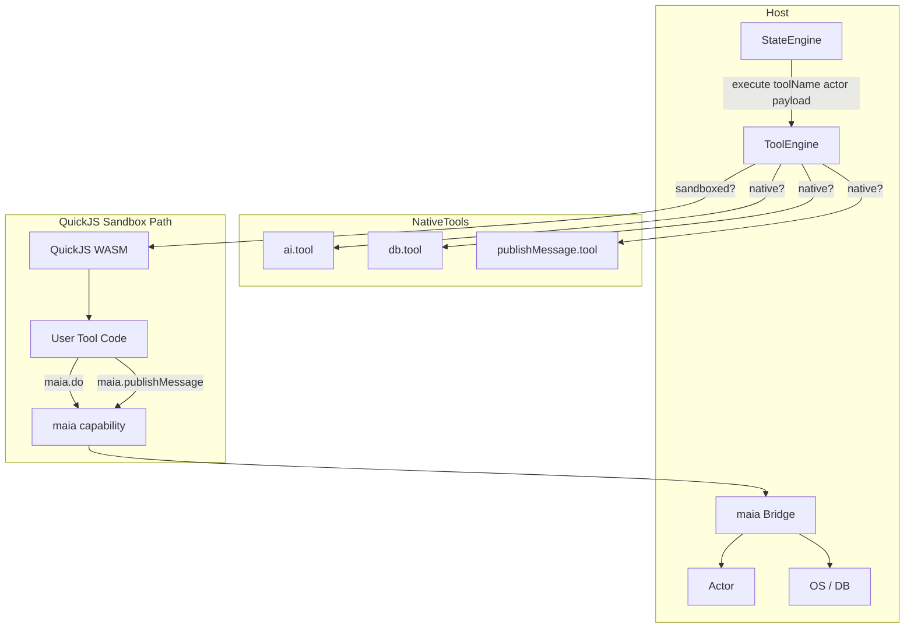

# QuickJS WASM Sandbox for User-Written Tools

> **REFERENCE / ROADMAP**
>
> This document describes a design for executing user-written tools in sandboxed QuickJS WASM runtimes, enabling users to author custom tools alongside system tools.
>
> **Status:** Design phase
>
> **Related:** [maia-actors](../../03_developers/08_maia-actors/README.md), [maia-script engines](../../03_developers/04_maia-engines/engines/00-overview.md)

## Overview

The MaiaOS tools engine ([maia-actors](../../03_developers/08_maia-actors/README.md), [maia-script engines](../../03_developers/04_maia-engines/engines/00-overview.md)) currently executes only **native ES module tools** with full host access. This document outlines a design to run **user-written tools** in isolated QuickJS WebAssembly sandboxes, allowing users to create custom tools that integrate with the system via a capability-based IPC bridge.

## Goals

- **Security**: Untrusted user code runs in a separate interpreter (QuickJS) inside WASM; no access to host globals, DOM, or credentials.
- **Extensibility**: Users can write tools in JavaScript (or transpiled TypeScript) that call system capabilities through a controlled API.
- **Compatibility**: System tools remain native; user tools use the same `execute(actor, payload)` contract and `OperationResult` return format.

## Current Architecture

| Component | Role |
|-----------|------|
| **ToolEngine** | Maps `@namespace/toolName` → `{ definition, function }`, validates payload, calls `function.execute(actor, payload)` |
| **Tools** | Native ES modules with `execute(actor, payload)` returning `OperationResult` |
| **StateEngine** | Evaluates payload expressions, invokes `toolEngine.execute()`, handles SUCCESS/ERROR transitions |
| **Actor** | Full host object with `actorEngine`, `os`, `db`, `context`, `id`, etc. |

**Current tools and their dependencies:**

| Tool | Host access |
|------|-------------|
| `@ai/chat` | `fetch()` to API proxy |
| `@db` | `os.db(payload)` (CoValue/backend) |
| `@core/publishMessage` | `actorEngine.sendMessage()` |
| `@sparks` | Thin wrapper over `@db` |
| `@core/computeMessageNames` | Pure transformation, no host access |

## Proposed Design: Capability-Based Host Bridge

### 1. Polymorphic ToolEngine

ToolEngine distinguishes native vs sandboxed tools:

- **Native tools**: `{ definition, function }` — execute `function.execute(actor, payload)` directly.
- **Sandboxed tools**: `{ definition, code }` — run `code` in a QuickJS WASM context with a `maia` capability object.

### 2. The `maia` Capability Object

User code inside QuickJS receives **only** a `maia` object exposing explicit methods. The host closes over `actor`; the guest never sees raw actor references.

```javascript
// What user code sees inside QuickJS:
const maia = {
  db(payload) { /* host executes os.db, returns OperationResult */ },
  publishMessage(target, type, payload) { /* host sends via actorEngine */ },
  ai(context, model) { /* host proxies to RedPill — no cookies/auth */ },
  log(...args) { /* guest console or host logging */ }
};
```

All methods return JSON-serializable results (e.g. `{ ok: true, data }` or `{ ok: false, errors }`).

### 3. User Tool Format

User tools are JavaScript strings. Convention: must implement `execute(actor, payload)` (or equivalent). The `actor` in the guest is a **minimal, serializable view** (e.g. `id`, `contextSchemaCoId`, `contextCoId`) — not the full host actor.

```javascript
// Example user tool code (string evaluated in QuickJS):
export default {
  async execute(actor, payload) {
    const items = await maia.do({ op: 'read', schema: payload.schema, filter: payload.filter });
    if (items.ok && items.data?.value?.length > 0) {
      await maia.publishMessage(payload.target, 'NOTIFY', { count: items.data.value.length });
    }
    return items.ok ? { ok: true, data: items.data } : { ok: false, errors: items.errors };
  }
}
```

### 4. Architecture Diagram



### 5. IPC Protocol

- **Direction**: Guest → Host (guest calls `maia.method(...)`; host executes and returns).
- **Format**: JSON-serializable arguments and return values.
- **Implementation**: Host functions passed into QuickJS via `vm.newFunction()`; no separate wire protocol needed.

## Implementation Considerations

| Decision | Recommendation |
|----------|-----------------|
| **Per-invocation vs pooled sandbox** | Fresh QuickJS context per invocation — better isolation, no cross-run state leakage. |
| **System tools in QuickJS?** | No — keep them native for performance and simplicity. |
| **Capabilities to expose** | `maia.do`, `maia.publishMessage`, `maia.memory`, `maia.ai`, `maia.log`. No raw `fetch`, `require`, or DOM. |
| **User tool registration** | Store in DB (e.g. tool schema with `definition` + `code`); module registry or ToolEngine loads and marks as sandboxed. |
| **Async** | Use QuickJS async/ASYNCIFY build; user tools are async and await `maia.*` calls. |
| **Execution limits** | Configure memory limit (`setMemoryLimit`), CPU interrupt handler, and timeouts via quickjs-emscripten. |

## Security Checklist

| Check | Notes |
|-------|-------|
| No `fetch` in guest | All network via `maia.ai`, `maia.memory` (host proxy; no cookies). |
| No `require`/`import` | Unless a controlled module loader is explicitly added. |
| Restricted actor view | Guest sees only `{ id, contextSchemaCoId, contextCoId }` or similar — no `actorEngine`, `os`, etc. |
| Payload validation | ToolEngine still validates payload against tool definition schema before execution. |
| CPU/memory limits | Enforced on QuickJS runtime. |

## Technology: quickjs-emscripten

- **Library**: [quickjs-emscripten](https://github.com/justjake/quickjs-emscripten) — QuickJS compiled to WebAssembly.
- **Alternatives**: [@sebastianwessel/quickjs](https://github.com/sebastianwessel/quickjs) — higher-level wrapper with virtual FS, optional fetch (use with caution for untrusted code).
- **WASM mitigates engine bugs**: QuickJS heap overflows (e.g. CVE-2026-0821/0822) are contained within WASM linear memory; no escape to host JavaScript.

## User Tool Storage

User tools could be stored in the database:

- **Schema**: e.g. `°Maia/schema/tool` with fields `name`, `definition` (JSON schema), `code` (JS string).
- **Registration**: On boot or on-demand, ToolEngine registers sandboxed tools: `registerTool(namespace, id, { definition, code })`.
- **Lookup**: ToolEngine checks `tool.code` — if present, use sandbox path; else use native `tool.function`.

## Example User Tool Definition

```json
{
  "$schema": "°Maia/schema/tool",
  "$id": "tool_user_count_notify_001",
  "name": "@user/countAndNotify",
  "description": "Reads items from a schema, counts them, and sends a NOTIFY message",
  "parameters": {
    "type": "object",
    "properties": {
      "schema": { "type": "string" },
      "filter": { "type": "object" },
      "target": { "type": "string" }
    },
    "required": ["schema", "target"]
  }
}
```

```javascript
// code (stored as string):
export default {
  async execute(actor, payload) {
    const result = await maia.do({
      op: 'read',
      schema: payload.schema,
      filter: payload.filter || null
    });
    if (!result.ok) return result;
    const count = result.data?.value?.length ?? 0;
    await maia.publishMessage(payload.target, 'NOTIFY', { count });
    return { ok: true, data: { count } };
  }
};
```

## Related Documents

- [maia-actors README](../../03_developers/08_maia-actors/README.md)
- [maia-script engines](../../03_developers/04_maia-engines/engines/00-overview.md)
- [Skills (AI Agent Interface)](./skills.md) — tool discovery for AI agents
