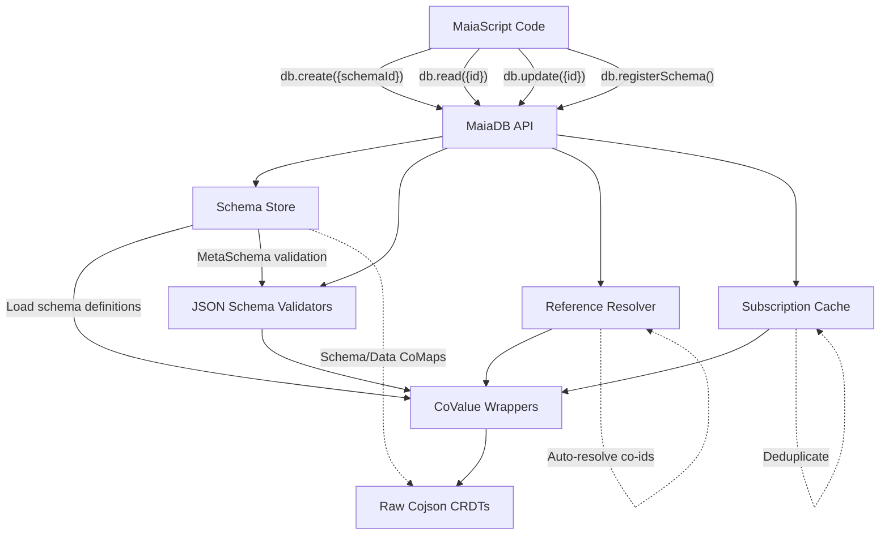
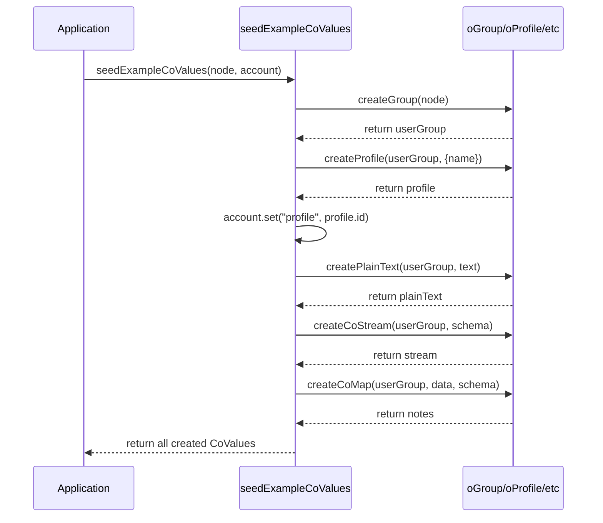
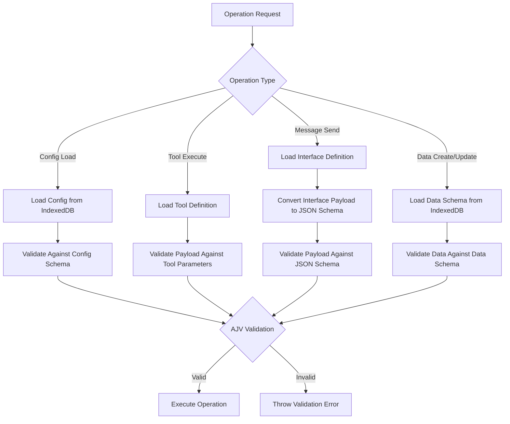

# MaiaOS Documentation for Developers

**Auto-generated:** 2026-01-22T14:43:39.713Z
**Purpose:** Complete context for LLM agents working with MaiaOS

---

# CONCEPT

*Source: getting-started/01_concept.md*

# MaiaOS Concept

**Version:** 0.4  
**Last Updated:** January 2026

## What is MaiaOS?

MaiaOS is a **100% runtime-based, AI-LLM native platform** for building AI-composable applications. It's a declarative operating system where everything is defined in JSON, executed by engines, and orchestrated by AI agents.

## Core Philosophy

### Pure Declarative Runtime

**Everything is JSON:**
- No JavaScript in your app code
- No compiled bundles
- No build steps
- Pure `.maia` files loaded at runtime

**Example Actor:**
```json
{
  "$type": "actor",
  "id": "actor_todo_001",
  "contextRef": "todo",
  "stateRef": "todo",
  "viewRef": "todo"
}
```

That's it. No classes, no functions, no imports. Just references.

### AI-LLM Native

**Built for AI Orchestration:**
- LLMs can read and generate `.maia` files natively (they're just JSON)
- Skills provide AI-readable interface specifications
- State machines are AI-compatible event flows
- Tools are defined with JSON schemas (LLM-friendly)

**Why This Matters:**
- AI agents can build entire apps by generating `.maia` files
- No code generation → No syntax errors
- LLMs understand the structure perfectly
- Agents can modify apps at runtime

### 100% Runtime-Based

**No Build Process:**
```
Traditional:  Write Code → Compile → Bundle → Deploy → Run
MaiaOS:       Write .maia → Run
```

**Hot Runtime Reload Everything:**
- Change a view → Instant update
- Modify state machine → Instant update
- Update styles → Instant update
- No webpack, no vite, no build tools

**How It Works:**
1. Browser loads `kernel.js` (single entry point)
2. Kernel loads `.maia` files via `fetch()`
3. Engines interpret and execute
4. Shadow DOM renders isolated UI
5. Done!

## Three-Layer Architecture

### 1. Definition Layer (What to Do)

**Pure JSON definitions:**
- `actor.maia` - Component identity and references
- `context.maia` - Initial runtime data
- `state.maia` - Behavior flow (state machine)
- `view.maia` - UI structure
- `style.maia` - Appearance
- `skill.maia` - AI agent interface

**No logic, just configuration.**

### 2. Execution Layer (How to Do It)

**JavaScript engines interpret definitions:**
- `ActorEngine` - Orchestrates actors
- `StateEngine` - Executes state machines
- `ViewEngine` - Renders views
- `ToolEngine` - Executes actions
- `StyleEngine` - Compiles styles

**Logic lives here, not in your app.**

### 3. Intelligence Layer (Why & When to Do It)

**AI agents orchestrate via skills:**
- Skills describe actor capabilities
- LLMs read skills to understand what's possible
- Agents generate events based on user intent
- System executes via state machines

**AI decides, engines execute.**

## Why MaiaOS?

### For Vibecreators (App Builders)

✅ **No JavaScript Required** - Pure JSON definitions  
✅ **Instant Hot Reload** - No build process  
✅ **AI-Assisted Development** - LLMs understand `.maia` files  
✅ **Component Isolation** - Shadow DOM per actor  
✅ **Declarative Everything** - Views, state, styles  

### For AI Agents

✅ **Native JSON** - No code generation needed  
✅ **Schema-Defined** - Every tool has JSON schema  
✅ **Discoverable** - Skills describe capabilities  
✅ **Composable** - Mix and match actors  
✅ **Predictable** - State machines are explicit  

### For Developers (Core Contributors)

✅ **Modular Architecture** - Pluggable engines  
✅ **Schema-Agnostic Tools** - Generic CRUD  
✅ **Clean Separation** - Definition vs. execution  
✅ **Extensible** - Add engines, tools, modules  
✅ **Type-Safe** - JSON schemas validate everything  

## Real-World Example

**Traditional React Todo:**
```jsx
// TodoApp.jsx (100+ lines of JavaScript)
import React, { useState } from 'react';
import './TodoApp.css';

function TodoApp() {
  const [todos, setTodos] = useState([]);
  const [input, setInput] = useState('');
  
  const addTodo = () => {
    setTodos([...todos, { id: Date.now(), text: input, done: false }]);
    setInput('');
  };
  
  // ... more code ...
}
```

**MaiaOS Todo:**
```json
// todo.actor.maia (14 lines of JSON)
{
  "$type": "actor",
  "contextRef": "todo",
  "stateRef": "todo",
  "viewRef": "todo"
}
```

That's the entire actor. Context, state, and view are separate files. No JavaScript. No build. Just JSON.

## Service/UI Actor Architecture

MaiaOS uses a **service actor / UI actor** pattern for building applications:

**Service Actors** (orchestration):
- Entry point for every vibe
- Handle business logic and data management
- Coordinate between UI actors
- Minimal or no view (only render child actors)

**UI Actors** (presentation):
- Render user interfaces
- Handle user interactions
- Receive data/configurations from service actors
- Send generic events to service actors

**Default Pattern:**
```
Vibe → Service Actor → Composite Actor → UI Actors
```

This ensures clean separation of concerns and scalable architecture. See [Actors Documentation](../vibecreators/02-actors.md#default-vibe-pattern-service--composite--ui) for details.

## Key Differentiators

### vs. Traditional Frameworks (React, Vue, Svelte)

| Feature | Traditional | MaiaOS |
|---------|-------------|--------|
| Language | JavaScript/TypeScript | JSON |
| Build Process | Required | None |
| Hot Reload | Via bundler | Native |
| AI Generation | Code (error-prone) | JSON (perfect) |
| Component Isolation | CSS Modules | Shadow DOM |
| State Management | Library (Redux, etc.) | Built-in (State Machines) |

### vs. Low-Code Platforms (Bubble, Webflow)

| Feature | Low-Code | MaiaOS |
|---------|----------|--------|
| Editing | Visual GUI | Text (`.maia` files) |
| Version Control | Proprietary | Git |
| AI Integration | Limited | Native |
| Extensibility | Plugins | Engines + Tools |
| Lock-in | Platform | Open source |

### vs. Backend Frameworks (Rails, Django)

MaiaOS is **frontend-first** but with backend patterns:
- State machines (like backend workflows)
- Tools (like backend services)
- Actors (like backend models)
- But all in the browser, no server required

## The MaiaOS Promise

> **Build AI-native applications with zero JavaScript, zero build process, and 100% runtime flexibility.**

**What This Means:**
1. **Vibecreators** define apps in JSON
2. **Engines** execute definitions
3. **AI Agents** orchestrate via skills
4. **Users** get instant, reactive UIs

**No compilation. No bundling. No build tools. Just pure, declarative, AI-native applications.**

## Next Steps

- [Terminology](./02_terminology.md) - Understand the key concepts
- [Architecture](./03_architecture.md) - Deep dive into system design
- [Installation](./04_install.md) - Get started building

---

# TERMINOLOGY

*Source: getting-started/02_terminology.md*

# MaiaOS Terminology

**Quick reference glossary of all MaiaOS concepts.**

## Core Concepts

### MaiaOS
The operating system itself. A runtime-based, AI-native platform for building declarative applications. Think of it as "an OS for apps" that runs in the browser.

### Kernel
The single entry point (`o/kernel.js`). Boots the system, loads modules, initializes engines, and creates actors. One file to rule them all.

### MaiaScript
The JSON-based DSL (Domain Specific Language) for defining actors, views, states, styles, and tools. Pure declarative syntax with expressions like `$context`, `$$item`, `@inputValue`.

---

## Definition Layer (Declarative)

### Actor
A pure declarative specification (`.actor.maia`) that references other components. Contains zero logic - just IDs and references. Think: "component configuration file."

**Example:**
```json
{
  "$type": "actor",
  "contextRef": "todo",
  "stateRef": "todo",
  "viewRef": "todo"
}
```

### Context
Runtime data for an actor (`.context.maia`). All state lives here: collections, UI state, form values, etc. Can be inline or separate file.

**Example:**
```json
{
  "$type": "context",
  "todos": [],
  "newTodoText": "",
  "viewMode": "list"
}
```

### State Machine
Behavior flow definition (`.state.maia`). XState-like state machine with states, transitions, guards, and actions. Defines WHAT happens WHEN.

**Example:**
```json
{
  "$type": "state",
  "initial": "idle",
  "states": {
    "idle": {
      "on": {
        "CREATE_TODO": "creating"
      }
    }
  }
}
```

### View
UI structure definition (`.view.maia`). Declarative DOM tree with expressions, loops, conditionals, and event handlers. Renders to Shadow DOM.

**Example:**
```json
{
  "$type": "view",
  "root": {
    "tag": "div",
    "text": "$title",
    "children": [...]
  }
}
```

### Style
Appearance definition (`.style.maia`). Design tokens + component styles. Compiles to CSS and injects into Shadow DOM.

**Types:**
- **Brand** (`brand.style.maia`) - Shared design system
- **Local** (`actor.style.maia`) - Actor-specific overrides

### Skill
AI agent interface specification (`.skill.maia`). Describes actor capabilities, events, context schema, and usage patterns for LLM orchestration.

**Example:**
```json
{
  "$type": "skill",
  "actorType": "todo",
  "capabilities": {
    "taskManagement": "Create, complete, delete todos"
  },
  "stateEvents": {...}
}
```

---

## Execution Layer (Imperative)

### Engine
JavaScript execution machinery that interprets definitions. Engines contain all the logic - definitions contain none.

**Core Engines:**
- **ActorEngine** - Orchestrates actors, manages lifecycle
- **StateEngine** - Interprets state machines, executes transitions
- **ViewEngine** - Renders views to Shadow DOM
- **ToolEngine** - Executes tool actions
- **StyleEngine** - Compiles styles to CSS
- **MaiaScriptEvaluator** - Evaluates DSL expressions

### Tool
An executable function (`.tool.js` + `.tool.maia`). The ONLY place imperative code lives. Tools mutate actor context based on payloads.

**Structure:**
- `.tool.maia` - JSON schema (AI-compatible metadata)
- `.tool.js` - JavaScript function (execution logic)

**Example:**
```javascript
// create.tool.js
export default {
  async execute(actor, payload) {
    const { schema, data } = payload;
    const entity = { id: Date.now().toString(), ...data };
    actor.context[schema].push(entity);
  }
};
```

### Module
A collection of related tools (`.module.js`). Modules register tools with the ToolEngine at boot time.

**Built-in Modules:**
- `@core/*` - UI utilities (modals, view modes)
- `@mutation/*` - Generic CRUD (create, update, delete, toggle)
- `@dragdrop/*` - Drag-and-drop handlers
- `@context/*` - Context manipulation

### Module Registry
Central plugin system for dynamic module loading. Manages module lifecycle and tool registration.

---

## Intelligence Layer (AI Orchestration)

### Vibecreator
A person who builds MaiaOS applications. Writes `.maia` files, composes actors, defines behaviors. No JavaScript required.

### Agent / LLM
AI assistant (ChatGPT, Claude, Cursor, etc.) that reads skills and generates events. Orchestrates actors based on user intent.

### Skill Engine
(v0.5) Engine that manages skill discovery and interpretation for AI agents. Enables LLM-driven app orchestration.

---

## Data Flow Concepts

### Event
A message sent to a state machine to trigger a transition. Events have a name and optional payload.

**Example:**
```json
{
  "send": "CREATE_TODO",
  "payload": { "text": "$newTodoText" }
}
```

### Payload
Data passed with an event. Can contain expressions that are evaluated at runtime.

**Expression Types:**
- `$field` - Context reference (`actor.context.field`)
- `$$field` - Item reference (in loops: `item.field`)
- `@inputValue` - DOM value reference (`input.value`)

### Guard
A condition that determines if a transition should occur. Evaluated before state change.

**Example:**
```json
{
  "guard": { "$ne": ["$newTodoText", ""] }
}
```

### Transition
Moving from one state to another in response to an event. Can have guards and actions.

### Action
A tool invocation or context update. Executed during state transitions (entry/exit/inline).

---

## UI Concepts

### Shadow DOM
Browser-native encapsulation. Each actor renders into its own shadow root with isolated styles and DOM.

**Benefits:**
- Style isolation (no CSS leakage)
- DOM encapsulation
- Multiple instances without conflicts

### Constructable Stylesheet
Modern CSS API for efficient style sharing. Brand styles compiled once, adopted by all actors.

### Component
In MaiaOS, "component" = "actor". Reusable, isolated, self-contained unit with state, view, and behavior.

---

## Architectural Patterns

### Schema-Agnostic
Tools don't know about specific data types. They work with generic `schema` and `data` parameters.

**Example:**
```javascript
@mutation/create { schema: "todos", data: {...} }
@mutation/create { schema: "notes", data: {...} }
```

Same tool, different schema. Zero hardcoded domain knowledge.

### Message Passing
Actors communicate asynchronously via inboxes and subscriptions. Watermark pattern for processing.

**Properties:**
- `inbox` - Message queue
- `subscriptions` - Actors to receive messages from
- `inboxWatermark` - Last processed message index

### Modular Architecture
Everything is a plugin. Engines are pluggable, tools are modular, modules are dynamic.

---

## File Conventions

### `.maia` Extension
All MaiaOS definition files use `.maia` extension. JSON format with `$type` discriminator.

**Types:**
- `actor.maia` - Actor definition
- `context.maia` - Runtime data
- `state.maia` - State machine
- `view.maia` - UI structure
- `style.maia` - Styling
- `skill.maia` - AI interface
- `tool.maia` - Tool metadata

### Naming Pattern
`{name}.{type}.maia`

**Examples:**
- `todo.actor.maia`
- `todo.context.maia`
- `todo.state.maia`
- `brand.style.maia`

### CoMap ID (Future)
Fake IDs used for Jazz integration. Currently maps to filenames, will map to Jazz CoMaps in v0.5.

**Example:**
```json
{
  "viewRef": "co_view_001"  // Maps to: todo.view.maia
}
```

---

## Development Concepts

### Hot Reload
Automatic browser refresh on file changes. No build process, instant updates.

### Watch Mode
Scripts that monitor file changes and regenerate outputs (e.g., LLM docs).

### Vibecreators Docs
User-facing documentation for app builders. Located in `docs/vibecreators/`.

### Developers Docs
Technical documentation for core contributors. Located in `docs/developers/`.

### LLM Docs
Auto-generated, context-optimized documentation for AI agents. Located in `docs/agents/`.

---

## Quick Reference

| Term | Type | Purpose |
|------|------|---------|
| **Actor** | Definition | Component configuration |
| **Context** | Definition | Runtime data |
| **State** | Definition | Behavior flow |
| **View** | Definition | UI structure |
| **Style** | Definition | Appearance |
| **Skill** | Definition | AI interface |
| **Engine** | Execution | Interprets definitions |
| **Tool** | Execution | Executes actions |
| **Module** | Execution | Groups tools |
| **Event** | Data Flow | Triggers transitions |
| **Payload** | Data Flow | Event data |
| **Guard** | Data Flow | Transition condition |

---

## Next Steps

- [Architecture](./03_architecture.md) - System design deep dive
- [Installation](./04_install.md) - Get started building

---

# ARCHITECTURE

*Source: getting-started/03_architecture.md*

# MaiaOS Architecture

**Deep dive into system design and data flow.**

## System Architecture

```
┌─────────────────────────────────────────────────────────────┐
│                         MaiaOS Kernel                        │
│                    (Single Entry Point)                      │
└─────────────────────────────────────────────────────────────┘
                              │
        ┌─────────────────────┼─────────────────────┐
        │                     │                     │
        ▼                     ▼                     ▼
┌─────────────┐      ┌─────────────┐      ┌─────────────┐
│   Module    │      │   Engine    │      │    Actor    │
│  Registry   │◄─────│  Layer      │◄─────│   Layer     │
└─────────────┘      └─────────────┘      └─────────────┘
        │                     │                     │
        │              ┌──────┴──────┐             │
        │              │             │             │
        ▼              ▼             ▼             ▼
┌─────────────┐  ┌──────────┐  ┌──────────┐  ┌──────────┐
│   Modules   │  │  State   │  │   View   │  │   Tool   │
│ (core,      │  │  Engine  │  │  Engine  │  │  Engine  │
│  mutation,  │  └──────────┘  └──────────┘  └──────────┘
│  dragdrop)  │
└─────────────┘
```

## Three Layers

### 1. Definition Layer (Declarative)

**Pure JSON definitions - zero logic:**

**Actors** - Component configuration:
```json
{
  "$type": "actor",
  "id": "actor_todo_001",
  "contextRef": "todo",
  "stateRef": "todo",
  "viewRef": "todo"
}
```

**Context** - Runtime data:
```json
{
  "$type": "context",
  "todos": [],
  "newTodoText": "",
  "viewMode": "list"
}
```

**State** - Behavior flow:
```json
{
  "$type": "state",
  "initial": "idle",
  "states": {
    "idle": {
      "on": {
        "CREATE_TODO": "creating"
      }
    }
  }
}
```

**View** - UI structure:
```json
{
  "$type": "view",
  "root": {
    "tag": "div",
    "text": "$title"
  }
}
```

**Style** - Appearance:
```json
{
  "$type": "style",
  "tokens": {
    "colors": {
      "primary": "#3b82f6"
    }
  }
}
```

**Skill** - AI interface:
```json
{
  "$type": "skill",
  "actorType": "todo",
  "capabilities": {
    "taskManagement": "Create, complete, delete todos"
  }
}
```

### 2. Execution Layer (Imperative)

**Engines** - JavaScript execution machinery:

- **ActorEngine** - Orchestrates actors, manages lifecycle
- **StateEngine** - Interprets state machines, executes transitions
- **ViewEngine** - Renders views to Shadow DOM
- **ToolEngine** - Executes tool actions
- **StyleEngine** - Compiles styles to CSS
- **ModuleRegistry** - Manages dynamic module loading
- **MaiaScriptEvaluator** - Evaluates DSL expressions

**Tools** - Executable functions:

```javascript
// create.tool.js
export default {
  async execute(actor, payload) {
    const { schema, data } = payload;
    const entity = { id: Date.now().toString(), ...data };
    actor.context[schema].push(entity);
  }
};
```

**Modules** - Tool collections:

```javascript
// mutation.module.js
export class MutationModule {
  static async register(registry, toolEngine) {
    const tools = ['create', 'update', 'delete', 'toggle'];
    for (const tool of tools) {
      await toolEngine.registerTool(`mutation/${tool}`, `@mutation/${tool}`);
    }
  }
}
```

### 3. Intelligence Layer (AI Orchestration)

**Skills** - AI-readable interface specifications:

```json
{
  "stateEvents": {
    "CREATE_TODO": {
      "description": "Creates a new todo item",
      "payload": {
        "text": { "type": "string", "required": true }
      },
      "when": ["User says: 'add todo'", "User says: 'create task'"]
    }
  },
  "queryableContext": {
    "todos": {
      "type": "array",
      "description": "All todo items"
    }
  }
}
```

## Data Flow

### User Interaction Flow

```
User Input (click, type, etc.)
  ↓
ViewEngine captures event
  ↓
ViewEngine evaluates payload ($ and $$)
  ↓
StateEngine.send(EVENT_NAME, payload)
  ↓
StateEngine finds current state
  ↓
StateEngine checks event handlers
  ↓
StateEngine evaluates guard (if present)
  ↓
Guard passes → Continue | Guard fails → Ignore
  ↓
StateEngine executes exit actions
  ↓
StateEngine transitions to target state
  ↓
StateEngine executes entry actions
  ↓
ToolEngine.execute(toolName, actor, payload)
  ↓
Tool mutates actor.context
  ↓
Tool succeeds → SUCCESS event | Tool fails → ERROR event
  ↓
StateEngine handles SUCCESS/ERROR
  ↓
ActorEngine.rerender(actor)
  ↓
ViewEngine re-renders Shadow DOM
  ↓
User sees updated UI
```

### AI Agent Interaction Flow

```
LLM Agent receives user intent
  ↓
Agent queries SkillEngine for available actors
  ↓
Agent reads skill definitions
  ↓
Agent matches user intent to capabilities
  ↓
Agent generates appropriate event + payload
  ↓
Agent sends event to actor via StateEngine
  ↓
[Same as User Interaction from StateEngine onward]
```

## File Organization

```
libs/maia-script/src/
├── o/                          # Operating System Layer
│   ├── kernel.js               # Single entry point
│   ├── engines/                # Execution engines
│   │   ├── ActorEngine.js
│   │   ├── StateEngine.js
│   │   ├── ViewEngine.js
│   │   ├── ToolEngine.js
│   │   └── ModuleRegistry.js
│   ├── modules/                # Tool modules
│   │   ├── core.module.js
│   │   ├── mutation.module.js
│   │   └── dragdrop.module.js
│   └── tools/                  # Tool implementations
│       ├── core/
│       ├── mutation/
│       ├── dragdrop/
│       └── context/
│
├── examples/                   # Example applications
│   └── todos/
│       ├── index.html
│       ├── todo.actor.maia
│       ├── todo.context.maia
│       ├── todo.state.maia
│       ├── todo.view.maia
│       └── brand.style.maia
│
└── docs/                       # Documentation
    ├── getting-started/
    ├── vibecreators/
    ├── developers/
    └── agents/
```

## Key Architectural Patterns

### Service Actor / UI Actor Separation

MaiaOS follows a clear separation between **service actors** (orchestration) and **UI actors** (presentation):

**Service Actors:**
- Orchestrate data queries and mutations
- Manage application-level state
- Coordinate between UI actors via messages
- Typically have minimal or no view (only render child actors)

**UI Actors:**
- Render user interfaces
- Handle user interactions
- Receive query configurations from service actors
- Send generic UI events to service actors

**Default Vibe Pattern:**
```
Vibe Entry Point
  └── Service Actor (orchestrating, minimal view)
        └── Composite Actor (first UI actor, shared structure)
              └── UI Actors (leaf components)
```

This pattern ensures:
- ✅ Clear separation of concerns
- ✅ Scalable through composition
- ✅ Message-based communication
- ✅ Consistent architecture across vibes

See [Actors Documentation](../vibecreators/02-actors.md#default-vibe-pattern-service--composite--ui) for details.

### Schema-Agnostic Design

Tools don't know about specific data types:

```javascript
@mutation/create { schema: "todos", data: {...} }
@mutation/create { schema: "notes", data: {...} }
@mutation/create { schema: "users", data: {...} }
```

Same tool, different schema. Zero hardcoded domain knowledge.

### Modular Everything

- **Tools** grouped into modules (`@core/*`, `@mutation/*`)
- **Modules** loaded dynamically at boot
- **Engines** pluggable (future: add ThreeJS renderer)
- **Skills** describe capabilities without implementation

### Shadow DOM Isolation

Each actor renders into its own shadow root:

```html
<div id="actor-todo">
  #shadow-root (open)
    <style>/* Actor styles */</style>
    <div>/* Actor UI */</div>
</div>
```

**Benefits:**
- ✅ Style isolation (no CSS leakage)
- ✅ DOM encapsulation
- ✅ Multiple instances without conflicts

### Message Passing

Actors communicate asynchronously:

```javascript
// Send message
os.sendMessage('actor_todo_001', {
  type: 'notification',
  data: {text: 'Task completed!'}
});

// Subscribe to messages
actor.subscriptions = ['actor_calendar_001'];

// Process messages
actor.inbox = [...]; // Watermark pattern
```

## Design Principles

1. **Declarative Over Imperative** - Define what, not how
2. **Separation of Concerns** - Actors, engines, and skills are independent
3. **Schema Agnostic** - Tools work with any data model
4. **AI Composable** - Skills enable LLM orchestration
5. **Module Everything** - No hardcoded dependencies
6. **Single Entry Point** - kernel.js loads everything
7. **Shadow DOM Isolation** - Each actor is self-contained
8. **Message Passing** - Actors communicate via inboxes

## Version History

- **v0.1** - Basic actor/view/style system
- **v0.2** - Added state machines and tool system
- **v0.3** - Added message passing and AI tool definitions
- **v0.4** - **Current** - Modular architecture with generic CRUD
- **v0.5** - **Planned** - Skills as AI agent interface

## Next Steps

- [Installation](./04_install.md) - Get started building
- [Vibecreators Docs](../vibecreators/) - Build applications
- [Developers Docs](../developers/) - Extend MaiaOS

---

# INSTALL

*Source: getting-started/04_install.md*

# Installation & Quick Start

**Get MaiaOS running in under 5 minutes.**

## Prerequisites

**Required:**
- Modern browser (Chrome, Firefox, Safari, Edge)
- Local web server (for ES modules)
- Bun (for development with hot reload)
- Git (for cloning the repository)

## Quick Start

###  Clone the Repository

```bash
# Clone
git clone https://github.com/oMaiaCity/MaiaOS.git
cd MaiaOS/libs/maia-script

# Install dependencies
bun install

# Start dev server with hot reload
bun dev

# Open browser
open http://localhost:4200/
```

## File Structure

Create your first actor:

```
my-app/
├── index.html              # Entry point (see above)
├── todo.actor.maia         # Actor definition
├── todo.context.maia       # Runtime data
├── todo.state.maia         # State machine
├── todo.view.maia          # UI structure
└── brand.style.maia        # Design system
```

### Minimal Actor

**`todo.actor.maia`:**
```json
{
  "$type": "actor",
  "$id": "actor_todo_001",
  "id": "actor_todo_001",
  "contextRef": "todo",
  "stateRef": "todo",
  "viewRef": "todo",
  "styleRef": "brand"
}
```

**`todo.context.maia`:**
```json
{
  "$type": "context",
  "$id": "context_todo_001",
  "todos": [],
  "newTodoText": ""
}
```

**`todo.state.maia`:**
```json
{
  "$type": "state",
  "$id": "state_todo_001",
  "initial": "idle",
  "states": {
    "idle": {
      "on": {
        "CREATE_TODO": {
          "target": "creating",
          "guard": { "$ne": ["$newTodoText", ""] }
        }
      }
    },
    "creating": {
      "entry": {
        "tool": "@mutation/create",
        "payload": {
          "schema": "todos",
          "data": { "text": "$newTodoText", "done": false }
        }
      },
      "on": {
        "SUCCESS": "idle",
        "ERROR": "error"
      }
    },
    "error": {
      "on": {
        "RETRY": "idle"
      }
    }
  }
}
```

**`todo.view.maia`:**
```json
{
  "$type": "view",
  "$id": "view_todo_001",
  "root": {
    "tag": "div",
    "attrs": { "class": "todo-app" },
    "children": [
      {
        "tag": "h1",
        "text": "My Todos"
      },
      {
        "tag": "input",
        "attrs": {
          "type": "text",
          "placeholder": "What needs to be done?"
        },
        "value": "$newTodoText",
        "$on": {
          "input": {
            "send": "UPDATE_INPUT",
            "payload": { "newTodoText": "@inputValue" }
          },
          "keydown": {
            "send": "CREATE_TODO",
            "key": "Enter"
          }
        }
      },
      {
        "tag": "button",
        "text": "Add",
        "$on": {
          "click": {
            "send": "CREATE_TODO"
          }
        }
      },
      {
        "tag": "ul",
        "$each": {
          "items": "$todos",
          "template": {
            "tag": "li",
            "text": "$$text"
          }
        }
      }
    ]
  }
}
```

**`brand.style.maia`:**
```json
{
  "$type": "brand.style",
  "$id": "brand_001",
  "tokens": {
    "colors": {
      "primary": "#3b82f6",
      "background": "#ffffff",
      "text": "#1f2937"
    },
    "spacing": {
      "sm": "0.5rem",
      "md": "1rem",
      "lg": "1.5rem"
    }
  },
  "components": {
    "todo-app": {
      "padding": "{spacing.lg}",
      "maxWidth": "600px",
      "margin": "0 auto"
    },
    "button": {
      "padding": "{spacing.sm} {spacing.md}",
      "background": "{colors.primary}",
      "color": "white",
      "border": "none",
      "borderRadius": "0.25rem",
      "cursor": "pointer"
    },
    "input": {
      "padding": "{spacing.sm}",
      "border": "1px solid #e5e7eb",
      "borderRadius": "0.25rem",
      "width": "100%"
    }
  }
}
```


## Next Steps

- [Vibecreators Docs](../vibecreators/) - Learn to build apps
- [Examples](../../examples/todos/) - See complete working app
- [Developers Docs](../developers/) - Extend MaiaOS core

## Resources

- **Examples:** `libs/maia-script/src/examples/todos/`
- **Kernel:** `libs/maia-script/src/o/kernel.js`
- **Tools:** `libs/maia-script/src/o/tools/`
- **Docs:** `libs/maia-script/src/docs/`

## Support

- GitHub Issues: [Report bugs](https://github.com/oMaiaCity/MaiaOS/issues)

---

# 01_MAIAOS

*Source: developers/01_maiaos.md*

# MaiaOS (Developer Guide)

**For developers** who want to understand and extend the MaiaOS architecture.

## Architecture Overview

MaiaOS is a **declarative operating system** for building AI-composable applications. It separates concerns into three distinct layers:

### 1. Definition Layer (Declarative)
User-facing configuration files (`.maia`):
- **Actors** - Component identity and references
- **State Machines** - Behavior flow
- **Views** - UI structure
- **Styles** - Appearance
- **Skills** - AI agent interface

### 2. Execution Layer (Imperative)
JavaScript engines that interpret definitions:
- **ActorEngine** - Actor lifecycle management
- **StateEngine** - State machine interpreter
- **ViewEngine** - View-to-DOM renderer
- **ToolEngine** - Tool executor
- **StyleEngine** - Style compiler
- **ModuleRegistry** - Dynamic module loader

### 3. Intelligence Layer (Orchestration)
AI agent integration:
- **SkillEngine** - Skill discovery and interpretation (v0.5)
- **LLM Integration** - Event generation from natural language (v0.5)

## Core Philosophy

### Separation of Concerns

```
┌──────────────┐
│   Actors     │  ← Pure configuration (JSON)
└──────┬───────┘
       │
       ▼
┌──────────────┐
│   Engines    │  ← Execution machinery (JavaScript)
└──────┬───────┘
       │
       ▼
┌──────────────┐
│    Tools     │  ← Imperative actions (JavaScript)
└──────────────┘
```

### Zero Logic in Definitions

Actors, views, and state machines are **pure data**:
- No JavaScript functions
- No embedded logic
- Only references and configuration

This enables:
- ✅ Easy serialization (JSON)
- ✅ AI generation/modification
- ✅ Hot reload without code changes
- ✅ Visual editing tools (future)

## System Initialization

### Boot Sequence

```javascript
// 1. Initialize kernel
const os = await MaiaOS.boot({
  modules: ['core', 'mutation', 'dragdrop']
});

// Behind the scenes:
// → ModuleRegistry initialized
// → Engines initialized (Actor, State, View, Tool, Style)
// → Modules loaded dynamically
// → Tools registered
```

### Kernel Structure

```javascript
class MaiaOS {
  static async boot(config) {
    const os = {
      // Core registries
      moduleRegistry: new ModuleRegistry(),
      actors: new Map(),
      
      // Engines
      actorEngine: null,
      stateEngine: null,
      viewEngine: null,
      toolEngine: null,
      styleEngine: null,
      evaluator: null,
      
      // Public API
      createActor: async (actorPath, container) => {...},
      loadVibe: async (vibePath, container) => {...},
      getActor: (actorId) => {...},
      sendMessage: (actorId, message) => {...},
      getEngines: () => {...}
    };
    
    // Initialize engines
    os.evaluator = new MaiaScriptEvaluator(os.moduleRegistry);
    os.toolEngine = new ToolEngine(os.moduleRegistry);
    os.stateEngine = new StateEngine(os.evaluator, os.toolEngine);
    os.viewEngine = new ViewEngine(os.evaluator, os.stateEngine);
    os.styleEngine = new StyleEngine(os.evaluator);
    os.actorEngine = new ActorEngine(
      os.stateEngine,
      os.viewEngine,
      os.styleEngine
    );
    
    // Load modules
    for (const moduleName of config.modules) {
      await os.moduleRegistry.loadModule(moduleName);
    }
    
    return os;
  }
}
```

## Vibes (App Manifests)

### What Are Vibes?

Vibes are marketplace-ready app manifests (`.vibe.maia`) that provide metadata and reference the root actor. They serve as the "app store listing" for MaiaOS applications.

**Structure:**
```json
{
  "$type": "vibe",
  "$id": "vibe_todos_001",
  "name": "Todo List",
  "description": "A complete todo list application...",
  "actor": "./todo.actor.maia"
}
```

### Loading Vibes

```javascript
// High-level API (recommended)
const { vibe, actor } = await os.loadVibe(
  './vibes/todos/todos.vibe.maia',
  document.getElementById('container')
);

// Equivalent to:
// 1. Fetch vibe manifest
// 2. Validate structure ($type, actor field)
// 3. Resolve actor path (relative to vibe)
// 4. Call os.createActor(resolvedPath, container)
// 5. Return {vibe, actor}
```

### Implementation

**kernel.js:**
```javascript
async loadVibe(vibePath, container) {
  // Fetch vibe manifest
  const response = await fetch(vibePath);
  const vibe = await response.json();
  
  // Validate
  if (vibe.$type !== 'vibe') {
    throw new Error('Invalid vibe manifest: $type must be "vibe"');
  }
  if (!vibe.actor) {
    throw new Error('Vibe manifest missing "actor" field');
  }
  
  // Resolve actor path relative to vibe location
  const vibeDir = vibePath.substring(0, vibePath.lastIndexOf('/'));
  const actorPath = `${vibeDir}/${vibe.actor}`;
  
  // Create actor
  const actor = await this.createActor(actorPath, container);
  
  return { vibe, actor };
}
```

### Design Rationale

**Why separate vibes from actors?**

1. **Marketplace Integration** - Vibes provide metadata for discovery, search, and installation
2. **Clean Separation** - Manifest (vibe) vs Implementation (actor)
3. **Extensibility** - Easy to add icon, screenshots, version, etc. without changing actors
4. **AI-Friendly** - LLMs can generate vibe manifests as app packaging

**Future Extensions:**
```json
{
  "$type": "vibe",
  "name": "...",
  "description": "...",
  "actor": "...",
  "icon": "./icon.svg",          // Marketplace icon
  "screenshots": ["..."],         // Preview images
  "tags": ["productivity"],       // Search tags
  "category": "productivity",     // Primary category
  "license": "MIT",               // License type
  "repository": "https://..."     // Source URL
}
```

## Actor Lifecycle

### 1. Creation

```javascript
const actor = await os.createActor(
  './maia/todo.actor.maia',
  document.getElementById('container')
);

// Behind the scenes:
// 1. Load actor.maia (JSON)
// 2. Load referenced state.maia
// 3. Load referenced view.maia (if present)
// 4. Load referenced style.maia (if present)
// 5. Initialize state machine
// 6. Render view to Shadow DOM
// 7. Apply styles
// 8. Return actor instance
```

### 2. Actor Instance Structure

```javascript
{
  id: 'actor_todo_001',
  context: {
    todos: [],
    newTodoText: '',
    // ... runtime state
  },
  machine: {
    id: 'state_todo_001',
    currentState: 'idle',
    definition: {...},
    // ... state machine instance
  },
  container: HTMLElement,        // DOM mount point
  viewDef: {...},                // View definition
  styleDef: {...},               // Style definition
  inbox: [],                     // Message queue
  subscriptions: [],             // Actor subscriptions
  inboxWatermark: 0,             // Last processed message
  actorEngine: ActorEngine,      // Reference to engine
}
```

### 3. Event Flow

```
User Interaction (click, input, etc.)
  ↓
ViewEngine captures event
  ↓
ViewEngine.evaluatePayload() (resolve $ and $$)
  ↓
StateEngine.send(machineId, eventName, payload)
  ↓
StateEngine finds current state
  ↓
StateEngine checks event handlers (on: {...})
  ↓
StateEngine evaluates guard (if present)
  ↓
Guard passes → Continue
Guard fails → Ignore event
  ↓
StateEngine executes exit actions (if leaving state)
  ↓
StateEngine transitions to target state
  ↓
StateEngine executes entry actions (tool invocations)
  ↓
ToolEngine.execute(toolName, actor, payload)
  ↓
Tool mutates actor.context
  ↓
Tool succeeds → StateEngine sends SUCCESS event
Tool fails → StateEngine sends ERROR event
  ↓
StateEngine handles SUCCESS/ERROR transition
  ↓
ActorEngine.rerender(actor)
  ↓
ViewEngine re-renders Shadow DOM
  ↓
User sees updated UI
```

## Engine Architecture

### ActorEngine

**Responsibilities:**
- Actor creation and registration
- Actor lifecycle management
- Re-rendering orchestration
- Message passing coordination

**Key Methods:**
```javascript
class ActorEngine {
  async createActor(actorPath, container, os)
  registerActor(actor)
  getActor(actorId)
  async rerender(actor)
  destroyActor(actorId)
  sendMessage(actorId, message)
  processMessages(actor)
}
```

### StateEngine

**Responsibilities:**
- State machine interpretation
- Event handling
- Guard evaluation
- Tool invocation
- Automatic SUCCESS/ERROR events

**Key Methods:**
```javascript
class StateEngine {
  registerMachine(machineId, definition, initialContext)
  send(machineId, event, payload)
  getCurrentState(machineId)
  async transition(machineId, event, payload)
  _evaluateGuard(guard, context, eventPayload)
  _evaluatePayload(payload, context, eventPayload)
  async _invokeTool(tool, actor)
}
```

### ViewEngine

**Responsibilities:**
- View definition to DOM rendering
- Event listener attachment
- Payload evaluation
- Shadow DOM management

**Key Methods:**
```javascript
class ViewEngine {
  render(container, viewDef, actor, actorEngine)
  _renderElement(elementDef, context, actorEngine, actor)
  _attachEventListeners(element, events, actor, actorEngine)
  _evaluatePayload(payload, context, item, element)
}
```

### ToolEngine

**Responsibilities:**
- Tool registration
- Tool execution
- Tool definition loading
- Error handling

**Key Methods:**
```javascript
class ToolEngine {
  async registerTool(toolPath, toolName)
  async execute(toolName, actor, payload)
  async loadToolDefinition(toolPath)
  async loadToolFunction(toolPath)
}
```

### StyleEngine

**Responsibilities:**
- Style compilation
- Token to CSS custom property conversion
- CSS injection into Shadow DOM

**Key Methods:**
```javascript
class StyleEngine {
  compile(styleDef)
  _compileTokens(tokens)
  _compileStyles(styles)
}
```

### ModuleRegistry

**Responsibilities:**
- Module registration
- Dynamic module loading
- Module metadata management

**Key Methods:**
```javascript
class ModuleRegistry {
  registerModule(name, moduleClass, metadata)
  async loadModule(moduleName, modulePath)
  getModule(name)
  hasModule(name)
  listModules()
  setToolEngine(toolEngine)
}
```

## Module System

### Module Structure

```javascript
// o/modules/custom.module.js
export class CustomModule {
  static async register(registry, toolEngine) {
    // Register tools
    await toolEngine.registerTool('custom/doSomething', '@custom/doSomething');
    await toolEngine.registerTool('custom/doOther', '@custom/doOther');
    
    // Register module metadata
    registry.registerModule('custom', CustomModule, {
      version: '1.0.0',
      description: 'Custom functionality module',
      namespace: '@custom',
      tools: ['@custom/doSomething', '@custom/doOther']
    });
  }
}

// Export register function (alternative pattern)
export async function register(registry) {
  const toolEngine = registry._toolEngine;
  await CustomModule.register(registry, toolEngine);
}
```

### Tool Structure

Two files per tool:

1. **Tool Definition** (`*.tool.maia`) - AI-compatible metadata:
```json
{
  "$type": "tool",
  "$id": "tool_custom_001",
  "name": "@custom/doSomething",
  "description": "Does something useful",
  "parameters": {
    "type": "object",
    "properties": {
      "param1": {"type": "string", "required": true}
    }
  }
}
```

2. **Tool Function** (`*.tool.js`) - Executable code:
```javascript
export default {
  async execute(actor, payload) {
    const { param1 } = payload;
    // Mutate actor.context
    actor.context.someField = param1;
    console.log('✅ Did something:', param1);
  }
};
```

## Extending MaiaOS

### Adding a New Engine

1. Create engine class:
```javascript
// o/engines/ThreeJSEngine.js
export class ThreeJSEngine {
  constructor(evaluator) {
    this.evaluator = evaluator;
    this.scenes = new Map();
  }
  
  createScene(actor, sceneDef) {
    // Initialize Three.js scene
  }
  
  render(sceneId) {
    // Render Three.js scene
  }
}
```

2. Register in kernel:
```javascript
os.threeEngine = new ThreeJSEngine(os.evaluator);
```

3. Update actor definition schema:
```json
{
  "$type": "actor",
  "sceneRef": "myScene",  // ← New reference type
  "viewRef": "myView"
}
```

### Adding a New DSL Type

1. Define DSL schema:
```json
{
  "$type": "animation",
  "$id": "anim_001",
  "keyframes": {
    "0%": {"opacity": 0},
    "100%": {"opacity": 1}
  },
  "duration": "300ms",
  "easing": "ease-out"
}
```

2. Create engine/compiler:
```javascript
class AnimationEngine {
  compile(animDef) {
    // Convert to CSS animations or Web Animations API
  }
}
```

3. Integrate with actors:
```json
{
  "$type": "actor",
  "animationRef": "fadeIn"
}
```

## Best Practices

### ✅ DO:

- **Keep engines stateless** - State lives in actors
- **Use dependency injection** - Pass engines/registries as params
- **Validate inputs** - Check payloads and definitions
- **Log operations** - Help debugging
- **Handle errors gracefully** - Don't crash the system
- **Document public APIs** - Clear JSDoc comments

### ❌ DON'T:

- **Don't store actor state in engines** - Use `actor.context`
- **Don't mutate definitions** - Treat as immutable
- **Don't hardcode paths** - Use relative imports
- **Don't bypass engines** - Use proper APIs
- **Don't create global singletons** - Pass instances

## Debugging

```javascript
// Expose OS globally
window.os = os;
window.engines = os.getEngines();

// Inspect actor
const actor = os.getActor('actor_todo_001');
console.log(actor.context);
console.log(actor.machine.currentState);

// Monitor events
const originalSend = os.stateEngine.send;
os.stateEngine.send = function(machineId, event, payload) {
  console.log('Event:', event, payload);
  return originalSend.call(this, machineId, event, payload);
};

// Monitor rerenders
const originalRerender = os.actorEngine.rerender;
os.actorEngine.rerender = function(actor) {
  console.log('Rerender:', actor.id);
  return originalRerender.call(this, actor);
};
```

## Next Steps

- Read [Engines Guide](./engines.md) - Creating custom engines
- Read [Tools Guide](./tools.md) - Creating tool modules
- Read [DSL Guide](./dsl.md) - Extending DSL types

---

# 02_DSL

*Source: developers/02_dsl.md*

# DSL Guide (Developer)

**For developers** who want to extend MaiaScript DSL with new definition types and expression syntax.

## What is MaiaScript DSL?

**MaiaScript** is a declarative JSON-based language for defining actors, state machines, views, styles, tools, and skills. It's designed to be:

- ✅ **Human-readable** - JSON with clear semantics
- ✅ **AI-compatible** - LLMs can read and generate it
- ✅ **Schema-validated** - Type-safe definitions validated against JSON Schema
- ✅ **Expression-rich** - Context references (`$`), item references (`$$`)

All MaiaScript files are automatically validated against JSON schemas when loaded. See [Schema System](./schemas.md) for details.

## DSL Types

### Core DSL Types

| Type | File Extension | Purpose | Engine |
|------|----------------|---------|--------|
| `actor` | `.actor.maia` | Actor definition | ActorEngine |
| `state` | `.state.maia` | State machine | StateEngine |
| `view` | `.view.maia` | UI structure | ViewEngine |
| `style` | `.style.maia` | Styling | StyleEngine |
| `tool` | `.tool.maia` | Tool metadata | ToolEngine |
| `skill` | `.skill.maia` | AI interface | SkillEngine (v0.5) |

## Expression Syntax

### Context References (`$`)

Access actor context fields:

```json
{
  "text": "$newTodoText",
  "mode": "$viewMode",
  "count": "$todos.length"
}
```

Evaluated by `MaiaScriptEvaluator`:

```javascript
evaluate(expression, data) {
  if (typeof expression === 'string' && expression.startsWith('$')) {
    const path = expression.slice(1);
    return this._resolvePath(data.context, path);
  }
  return expression;
}
```

### Item References (`$$`)

Access current item in `for` loops:

```json
{
  "for": "$todos",
  "forItem": "todo",
  "children": [
    {
      "text": "$$text",
      "data-id": "$$id"
    }
  ]
}
```

### Special Event References (`@`)

Access DOM event values:

```json
{
  "on": {
    "input": {
      "send": "UPDATE_INPUT",
      "payload": {
        "value": "@inputValue",     // input.value
        "checked": "@checked",       // input.checked
        "selectedValue": "@selectedValue"  // select.value
      }
    }
  }
}
```

## Creating a New DSL Type

### Example: Animation DSL

**Goal:** Define animations that can be applied to actors.

#### 1. Define DSL Schema

```json
{
  "$type": "animation",
  "$id": "anim_fade_in_001",
  "name": "fadeIn",
  
  "keyframes": {
    "0%": {
      "opacity": "0",
      "transform": "translateY(-10px)"
    },
    "100%": {
      "opacity": "1",
      "transform": "translateY(0)"
    }
  },
  
  "duration": "300ms",
  "easing": "ease-out",
  "fillMode": "forwards",
  
  "triggers": {
    "onEnter": true,
    "onStateChange": ["creating", "updating"]
  }
}
```

#### 2. Create Engine/Compiler

```javascript
// o/engines/AnimationEngine.js
export class AnimationEngine {
  constructor(evaluator) {
    this.evaluator = evaluator;
    this.animations = new Map();
    this.activeAnimations = new Map();
  }
  
  /**
   * Register animation definition
   */
  registerAnimation(animDef) {
    if (animDef.$type !== 'animation') {
      throw new Error('Invalid animation definition');
    }
    
    // Compile to CSS animation
    const css = this._compileToCSS(animDef);
    
    this.animations.set(animDef.$id, {
      definition: animDef,
      css,
      name: animDef.name
    });
    
    console.log(`✅ Registered animation: ${animDef.name}`);
  }
  
  /**
   * Apply animation to actor
   */
  applyAnimation(actor, animationId, target = 'root') {
    const animation = this.animations.get(animationId);
    if (!animation) {
      throw new Error(`Animation not found: ${animationId}`);
    }
    
    // Inject CSS into actor's Shadow DOM
    const shadowRoot = actor.container.shadowRoot;
    if (!shadowRoot) return;
    
    let styleElement = shadowRoot.querySelector('style[data-animations]');
    if (!styleElement) {
      styleElement = document.createElement('style');
      styleElement.setAttribute('data-animations', '');
      shadowRoot.appendChild(styleElement);
    }
    
    styleElement.textContent += animation.css;
    
    // Apply animation class to target element
    const targetElement = target === 'root'
      ? shadowRoot.querySelector(':host > *')
      : shadowRoot.querySelector(target);
    
    if (targetElement) {
      targetElement.style.animation = `${animation.name} ${animation.definition.duration} ${animation.definition.easing} ${animation.definition.fillMode}`;
      
      // Track active animation
      this.activeAnimations.set(`${actor.id}_${target}`, {
        actor,
        animation: animation.name,
        element: targetElement
      });
      
      // Remove after animation completes
      const duration = parseFloat(animation.definition.duration);
      setTimeout(() => {
        this.activeAnimations.delete(`${actor.id}_${target}`);
      }, duration);
    }
  }
  
  /**
   * Compile keyframes to CSS
   */
  _compileToCSS(animDef) {
    let css = `@keyframes ${animDef.name} {\n`;
    
    for (const [offset, props] of Object.entries(animDef.keyframes)) {
      css += `  ${offset} {\n`;
      for (const [prop, value] of Object.entries(props)) {
        const cssProperty = prop.replace(/([A-Z])/g, '-$1').toLowerCase();
        css += `    ${cssProperty}: ${value};\n`;
      }
      css += `  }\n`;
    }
    
    css += `}\n`;
    return css;
  }
  
  /**
   * Cleanup
   */
  destroyActorAnimations(actorId) {
    for (const [key, data] of this.activeAnimations) {
      if (key.startsWith(`${actorId}_`)) {
        data.element.style.animation = 'none';
        this.activeAnimations.delete(key);
      }
    }
  }
}
```

#### 3. Integrate with Kernel

```javascript
// o/kernel.js
import { AnimationEngine } from './engines/AnimationEngine.js';

export class MaiaOS {
  static async boot(config) {
    const os = {...};
    
    // Initialize animation engine
    os.animationEngine = new AnimationEngine(os.evaluator);
    
    return os;
  }
}
```

#### 4. Load Animations

```javascript
// o/engines/ActorEngine.js
async createActor(actorPath, container, os) {
  // ... load actor definition ...
  
  // Load animations if present
  if (actorDef.animationRefs) {
    for (const animRef of actorDef.animationRefs) {
      const animPath = `${basePath}/${animRef}.animation.maia`;
      const animDef = await this._loadJSON(animPath);
      os.animationEngine.registerAnimation(animDef);
      
      // Apply on enter if configured
      if (animDef.triggers?.onEnter) {
        os.animationEngine.applyAnimation(actor, animDef.$id);
      }
    }
  }
  
  // ... rest of actor creation ...
}
```

#### 5. Hook into State Changes

```javascript
// o/engines/StateEngine.js
async transition(machineId, event, payload) {
  // ... existing transition logic ...
  
  // Trigger animations on state change
  const machine = this.machines.get(machineId);
  const actor = this._getActorForMachine(machineId);
  
  if (actor && actor.animationRefs) {
    for (const animRef of actor.animationRefs) {
      const animDef = this.os.animationEngine.animations.get(animRef);
      if (animDef?.definition.triggers?.onStateChange?.includes(machine.currentState)) {
        this.os.animationEngine.applyAnimation(actor, animRef);
      }
    }
  }
}
```

#### 6. Usage

**`animations/fadeIn.animation.maia`:**
```json
{
  "$type": "animation",
  "$id": "anim_fade_in",
  "name": "fadeIn",
  "keyframes": {
    "0%": {"opacity": "0", "transform": "translateY(-10px)"},
    "100%": {"opacity": "1", "transform": "translateY(0)"}
  },
  "duration": "300ms",
  "easing": "ease-out",
  "fillMode": "forwards",
  "triggers": {
    "onEnter": true,
    "onStateChange": ["creating"]
  }
}
```

**`todo.actor.maia`:**
```json
{
  "$type": "actor",
  "id": "actor_todo_001",
  "stateRef": "todo",
  "viewRef": "todo",
  "animationRefs": ["fadeIn"],  // ← Load animation
  "context": {...}
}
```

## Extending Expression Syntax

### Adding Custom Operators

**Goal:** Add `#` prefix for computed properties.

#### 1. Update Evaluator

```javascript
// o/engines/MaiaScriptEvaluator.js
evaluate(expression, data = {}) {
  // Existing: $ for context
  if (typeof expression === 'string' && expression.startsWith('$')) {
    const path = expression.slice(1);
    return this._resolvePath(data.context || {}, path);
  }
  
  // Existing: $$ for item
  if (typeof expression === 'string' && expression.startsWith('$$')) {
    const path = expression.slice(2);
    return this._resolvePath(data.item || {}, path);
  }
  
  // NEW: # for computed properties
  if (typeof expression === 'string' && expression.startsWith('#')) {
    const computedName = expression.slice(1);
    return this._evaluateComputed(computedName, data.context);
  }
  
  // ... rest of evaluation ...
}

_evaluateComputed(name, context) {
  // Define computed properties
  const computed = {
    todosCount: () => context.todos?.length || 0,
    completedCount: () => context.todos?.filter(t => t.done).length || 0,
    progressPercent: () => {
      const total = context.todos?.length || 0;
      const completed = context.todos?.filter(t => t.done).length || 0;
      return total > 0 ? Math.round((completed / total) * 100) : 0;
    },
    now: () => Date.now(),
    today: () => new Date().toISOString().split('T')[0]
  };
  
  if (computed[name]) {
    return computed[name]();
  }
  
  throw new Error(`Unknown computed property: ${name}`);
}
```

#### 2. Usage

```json
{
  "tag": "p",
  "text": "You've completed #progressPercent% of your tasks"
}

{
  "tag": "span",
  "text": "#todosCount tasks remaining"
}

{
  "tag": "input",
  "attrs": {
    "value": "#today"
  }
}
```

### Adding Custom Guards

**Goal:** Add `$between` guard operator.

```javascript
// o/engines/StateEngine.js
_evaluateGuard(guard, context, eventPayload = {}) {
  // ... existing operators ...
  
  // NEW: $between operator
  if (guard.$between) {
    const [value, min, max] = guard.$between;
    const val = this.evaluator.evaluate(value, { context, item: eventPayload });
    const minVal = this.evaluator.evaluate(min, { context, item: eventPayload });
    const maxVal = this.evaluator.evaluate(max, { context, item: eventPayload });
    return val >= minVal && val <= maxVal;
  }
  
  // ... rest of guards ...
}
```

Usage:
```json
{
  "guard": {
    "$between": ["$age", 18, 65]
  }
}
```

## DSL Validation

### Schema Validation

```javascript
// o/validators/ActorValidator.js
export class ActorValidator {
  static validate(actorDef) {
    const errors = [];
    
    // Check required fields
    if (actorDef.$type !== 'actor') {
      errors.push('$type must be "actor"');
    }
    
    if (!actorDef.$id) {
      errors.push('$id is required');
    }
    
    if (!actorDef.id) {
      errors.push('id is required');
    }
    
    if (!actorDef.stateRef) {
      errors.push('stateRef is required');
    }
    
    if (!actorDef.context || typeof actorDef.context !== 'object') {
      errors.push('context must be an object');
    }
    
    // Check references
    if (actorDef.viewRef && typeof actorDef.viewRef !== 'string') {
      errors.push('viewRef must be a string');
    }
    
    if (actorDef.styleRef && typeof actorDef.styleRef !== 'string') {
      errors.push('styleRef must be a string');
    }
    
    if (errors.length > 0) {
      throw new Error(`Actor validation failed:\n${errors.join('\n')}`);
    }
    
    return true;
  }
}
```

### Runtime Validation

```javascript
// o/engines/ActorEngine.js
async createActor(actorPath, container, os) {
  const actorDef = await this._loadJSON(actorPath);
  
  // Validate before creating
  ActorValidator.validate(actorDef);
  
  // ... rest of actor creation ...
}
```

## DSL Best Practices

### ✅ DO:

- **Use JSON schemas** - Validate structure
- **Namespace types** - Use `$type` consistently
- **Document fields** - Add `description` properties
- **Version definitions** - Include version field
- **Keep declarative** - No functions or logic
- **Support expressions** - Use `$`, `$$`, `@` where appropriate

### ❌ DON'T:

- **Don't embed logic** - Keep definitions pure data
- **Don't use functions** - Not JSON-serializable
- **Don't create circular refs** - Will break serialization
- **Don't hardcode values** - Use context references
- **Don't skip validation** - Always validate inputs

## DSL Transformation

### Preprocessing DSL

```javascript
// o/transformers/DSLPreprocessor.js
export class DSLPreprocessor {
  /**
   * Transform shorthand syntax to full syntax
   */
  static transform(dsl) {
    if (dsl.$type === 'view') {
      return this._transformView(dsl);
    }
    if (dsl.$type === 'state') {
      return this._transformState(dsl);
    }
    return dsl;
  }
  
  static _transformView(viewDef) {
    // Transform shorthand: "text": "Hello" → "text": {"$eval": "Hello"}
    // (Example: add metadata for debugging)
    return this._transformElement(viewDef.root);
  }
  
  static _transformElement(element) {
    if (!element) return element;
    
    // Add source tracking
    element._source = {
      file: element.$source || 'unknown',
      line: element.$line || 0
    };
    
    // Transform children recursively
    if (element.children) {
      element.children = element.children.map(c => this._transformElement(c));
    }
    
    return element;
  }
}
```

### Compiling DSL to Another Format

```javascript
// o/compilers/ViewToReact.js
export class ViewToReact {
  /**
   * Compile MaiaScript view to React JSX
   */
  static compile(viewDef) {
    return this._compileElement(viewDef.root);
  }
  
  static _compileElement(element) {
    const { tag, attrs, text, children } = element;
    
    let jsx = `<${tag}`;
    
    // Add attributes
    if (attrs) {
      for (const [key, value] of Object.entries(attrs)) {
        jsx += ` ${key}="${value}"`;
      }
    }
    
    jsx += '>';
    
    // Add text
    if (text) {
      jsx += text;
    }
    
    // Add children
    if (children) {
      jsx += children.map(c => this._compileElement(c)).join('\n');
    }
    
    jsx += `</${tag}>`;
    
    return jsx;
  }
}
```

## Next Steps

- Read [Engines Guide](./engines.md) - Creating custom engines
- Read [Tools Guide](./tools.md) - Creating tool modules
- Read [MaiaOS Guide](./maiaos.md) - Understanding the system
- Explore [VIBE Docs](../vibe/) - User-facing documentation

---

# 03_SCHEMAS

*Source: developers/03_schemas.md*

# JSON Schema System

MaiaOS uses a centralized JSON Schema validation system to ensure all `.maia` files conform to their expected structure. This provides:

- **Runtime validation** - Catch malformed data early
- **Clear error messages** - Know exactly what's wrong and where
- **Type safety** - Consistent data structures across the system
- **Documentation** - Schemas serve as authoritative documentation

## Overview

All schemas are located in `src/schemata/` and use JSON Schema Draft 2020-12. The validation engine uses AJV for fast, cached validation.

## Validation Engine

The `ValidationEngine` class provides a unified API for validating all MaiaOS data types:

```javascript
import { ValidationEngine, getSchema } from '../schemata/index.js';

const engine = new ValidationEngine();

// Load a schema
const actorSchema = getSchema('actor');
engine.loadSchema('actor', actorSchema);

// Validate data
const result = engine.validate('actor', actorData);
if (!result.valid) {
  console.error('Validation errors:', result.errors);
}
```

## Using Validation Helper

For most use cases, use the validation helper which automatically loads all schemas:

```javascript
import { validateOrThrow } from '../schemata/validation.helper.js';

// Validate and throw on error
try {
  validateOrThrow('actor', actorData, 'path/to/actor.maia');
} catch (error) {
  console.error('Validation failed:', error.message);
}
```

## Schema Types

### Actor Schema

Validates actor definitions (`.actor.maia` files).

**Required fields:**
- `$type`: Must be `"actor"`
- `$id`: Unique identifier (pattern: `^actor_`)

**Optional fields:**
- `contextRef`, `stateRef`, `viewRef`, `interfaceRef`, `brandRef`, `styleRef`
- `children`: Object mapping child names to actor IDs
- `subscriptions`: Array of actor IDs to receive messages from
- `inbox`: Array of messages
- `inboxWatermark`: Number (default: 0)

**Example:**
```json
{
  "$type": "actor",
  "$id": "actor_todo_001",
  "contextRef": "todo",
  "viewRef": "todo",
  "stateRef": "todo"
}
```

### Context Schema

Validates context definitions (`.context.maia` files).

**Required fields:**
- `$type`: Must be `"context"`
- `$id`: Unique identifier (pattern: `^context_`)

**Additional properties:** Any additional fields are allowed (flexible structure).

**Example:**
```json
{
  "$type": "context",
  "$id": "context_todo_001",
  "todos": [],
  "newTodoText": ""
}
```

### State Schema

Validates state machine definitions (`.state.maia` files).

**Required fields:**
- `$type`: Must be `"state"`
- `$id`: Unique identifier (pattern: `^state_`)
- `initial`: Initial state name
- `states`: Object mapping state names to state definitions

**State definition properties:**
- `entry`: Action or array of actions to execute on entry
- `exit`: Action or array of actions to execute on exit
- `on`: Object mapping event names to transitions

**Example:**
```json
{
  "$type": "state",
  "$id": "state_todo_001",
  "initial": "idle",
  "states": {
    "idle": {
      "on": {
        "CREATE_TODO": "creating"
      }
    }
  }
}
```

### View Schema

Validates view definitions (`.view.maia` files).

**Required fields:**
- `$type`: Must be `"view"`
- `$id`: Unique identifier (pattern: `^co_view_`)

**Properties:**
- `root`: Root DOM node (for leaf views)
- `container`: Container node (for composite views)

**View node properties:**
- `tag`: HTML tag name
- `class`: CSS class name
- `text`: Text content (can be expression)
- `value`: Input value (can be expression)
- `attrs`: HTML attributes object
- `children`: Array of child nodes
- `$on`: Event handlers object
- `$each`: Loop definition
- `$slot`: Slot reference (expression)

**Example:**
```json
{
  "$type": "view",
  "$id": "co_view_todo_001",
  "root": {
    "tag": "div",
    "text": "$title",
    "children": []
  }
}
```

### Style Schema

Validates style definitions (`.style.maia` files).

**Required fields:**
- `$type`: Must be `"actor.style"`

**Properties:**
- `tokens`: Design tokens object
- `components`: Component-specific styles object

**Example:**
```json
{
  "$type": "actor.style",
  "tokens": {
    "colors": {
      "primary": "#8fa89b"
    }
  },
  "components": {
    "button": {
      "background": "{colors.primary}"
    }
  }
}
```

### Brand Style Schema

Validates brand style definitions (`brand.style.maia` files).

**Required fields:**
- `$type`: Must be `"brand.style"`
- `$id`: Unique identifier (pattern: `^co_brand_`)

**Properties:**
- `tokens`: Design tokens (colors, spacing, typography, radii, shadows)
- `components`: Component-specific styles
- `selectors`: CSS selector-based styles

**Example:**
```json
{
  "$type": "brand.style",
  "$id": "co_brand_001",
  "tokens": {
    "colors": {
      "primary": "#8fa89b"
    }
  },
  "components": {
    "button": {
      "background": "{colors.primary}"
    }
  }
}
```

### Interface Schema

Validates interface definitions (`.interface.maia` files).

**Required fields:**
- `$type`: Must be `"actor.interface"`

**Properties:**
- `inbox`: Object mapping message types to payload schemas
- `publishes`: Object mapping message types to payload schemas
- `subscriptions`: Array of actor IDs
- `watermark`: Number (default: 0)

**Example:**
```json
{
  "$type": "actor.interface",
  "inbox": {
    "CREATE_TODO": {
      "payload": {
        "text": "string"
      }
    }
  },
  "publishes": {
    "TODO_CREATED": {
      "payload": {
        "id": "string"
      }
    }
  }
}
```

### Tool Schema

Validates tool definitions (`.tool.maia` files).

**Required fields:**
- `$type`: Must be `"tool"`
- `$id`: Unique identifier (pattern: `^tool_`)
- `name`: Tool identifier (pattern: `^@`)
- `description`: Tool description
- `parameters`: JSON Schema for tool parameters

**Example:**
```json
{
  "$type": "tool",
  "$id": "tool_create_001",
  "name": "@mutation/create",
  "description": "Creates a new entity",
  "parameters": {
    "type": "object",
    "properties": {
      "schema": {
        "type": "string"
      },
      "data": {
        "type": "object"
      }
    },
    "required": ["schema", "data"]
  }
}
```

### Skill Schema

Validates skill definitions (`.skill.maia` files).

**Required fields:**
- `$type`: Must be `"skill"`
- `$id`: Unique identifier (pattern: `^skill_`)
- `actorType`: Actor type this skill describes
- `description`: High-level capability summary
- `stateEvents`: Events the actor can handle
- `queryableContext`: Context fields AI can read

**Optional fields:**
- `version`: Skill version
- `capabilities`: High-level capability categories
- `bestPractices`: Guidelines for AI agents
- `commonPatterns`: Reusable interaction sequences
- `examples`: Usage examples

**Example:**
```json
{
  "$type": "skill",
  "$id": "skill_todo_001",
  "actorType": "todo",
  "description": "Todo list manager",
  "stateEvents": {
    "CREATE_TODO": {
      "description": "Create a new todo",
      "payload": {
        "text": {
          "type": "string",
          "required": true
        }
      }
    }
  },
  "queryableContext": {
    "todos": {
      "type": "array",
      "description": "List of todos"
    }
  }
}
```

### Vibe Schema

Validates vibe definitions (`.vibe.maia` files).

**Required fields:**
- `$type`: Must be `"vibe"`
- `$id`: Unique identifier (pattern: `^vibe_`)
- `name`: Vibe name
- `description`: Vibe description
- `actor`: Path to actor definition file

**Example:**
```json
{
  "$type": "vibe",
  "$id": "vibe_todos_001",
  "name": "Todo List",
  "description": "A todo list application",
  "actor": "./vibe/vibe.actor.maia"
}
```

### Message Schema

Validates messages passed between actors.

**Required fields:**
- `type`: Message type/event name
- `timestamp`: Unix timestamp (number, minimum: 0)

**Optional fields:**
- `payload`: Message payload data (object)
- `from`: Sender actor ID (string)
- `id`: Optional message ID for deduplication (string)

**Example:**
```json
{
  "type": "CREATE_TODO",
  "payload": {
    "text": "Buy milk"
  },
  "from": "actor_user_001",
  "timestamp": 1234567890
}
```

### Data Schemas

Validates application data (todos, notes, etc.) stored in IndexedDB. These schemas are dynamically seeded into the database and used for runtime validation of create/update operations.

**Location:** `src/schemata/data/`

**Required fields:**
- `$id`: Unique schema identifier (e.g., `"https://maiaos.dev/schemas/data/todos"`)
- `$schema`: JSON Schema version (e.g., `"http://json-schema.org/draft-07/schema#"`)
- `type`: Must be `"object"`
- `properties`: Object defining field schemas
- `required`: Array of required field names

**Example - Todos Schema:**
```json
{
  "$id": "https://maiaos.dev/schemas/data/todos",
  "$schema": "http://json-schema.org/draft-07/schema#",
  "type": "object",
  "properties": {
    "id": {
      "type": "string",
      "description": "Unique identifier for the todo item"
    },
    "text": {
      "type": "string",
      "minLength": 1,
      "description": "The todo item text content"
    },
    "done": {
      "type": "boolean",
      "description": "Whether the todo item is completed"
    }
  },
  "required": ["text", "done"],
  "additionalProperties": false
}
```

**How It Works:**

1. **Schema Definition**: Create a JSON Schema file in `src/schemata/data/` (e.g., `todos.schema.json`)
2. **Automatic Seeding**: Schemas are automatically seeded into IndexedDB during `MaiaOS.boot()` via the `schemata` module
3. **Runtime Validation**: When creating or updating data, the operation loads the schema from IndexedDB and validates the data
4. **Storage**: Schemas are stored in IndexedDB's `schemas` store with keys like `@schema/data/todos`

**Adding a New Data Schema:**

1. Create `src/schemata/data/yourtype.schema.json` following JSON Schema format
2. Export it in `src/schemata/index.js`:
   ```javascript
   import yourtypeSchema from './data/yourtype.schema.json';
   const DATA_SCHEMAS = {
     'data/todos': todosSchema,
     'data/yourtype': yourtypeSchema  // Add here
   };
   ```
3. The schema will be automatically seeded and used for validation

**Validation Points:**
- **Create operations**: Full validation (all required fields must be present)
- **Update operations**: Partial validation (only validates fields being updated, doesn't require all fields)
- **Toggle operations**: Validates field exists and is boolean type

## Common Definitions

The `common.schema.json` file defines shared patterns used across multiple schemas:

- **Expression**: Context reference (`$field`), item reference (`$$field`), or literal value
- **Guard**: Guard condition for state machine transitions
- **Action**: Tool invocation or context update
- **Transition**: State machine transition definition
- **MessagePayload**: Message payload definition

## Integration

Validation is automatically integrated into all engines:

- **ActorEngine**: Validates actor, context, and interface files on load
- **StateEngine**: Validates state machine files on load
- **ViewEngine**: Validates view files on load
- **StyleEngine**: Validates style files on load
- **ToolEngine**: Validates tool definition files on load
- **Kernel**: Validates vibe manifest files on load

## Error Messages

Validation errors include:

- `instancePath`: JSON path to the invalid field (e.g., `/properties/name`)
- `schemaPath`: JSON path in the schema (e.g., `/properties/name/type`)
- `keyword`: Validation keyword that failed (e.g., `required`, `type`)
- `message`: Human-readable error message
- `params`: Additional error parameters

**Example error:**
```json
{
  "instancePath": "/properties/name",
  "schemaPath": "#/properties/name/type",
  "keyword": "type",
  "message": "must be string",
  "params": {
    "type": "string"
  }
}
```

## Performance

- Schemas are compiled once and cached
- Validation is fast (< 1ms per file typically)
- Validation only occurs on file load, not at runtime

## Extending Schemas

To add a new schema:

1. Create `src/schemata/newtype.schema.json`
2. Add schema to `src/schemata/index.js` exports
3. Update `validation.helper.js` to load the new schema
4. Add validation calls in the appropriate engine

## Best Practices

1. **Be permissive initially**: Start with schemas that accept current data, tighten later
2. **Use clear descriptions**: Add `title` and `description` fields for better error messages
3. **Reuse common definitions**: Extract shared patterns into `common.schema.json`
4. **Test against real data**: Use integration tests to validate all existing files
5. **Version schemas**: Include `$schema` field pointing to JSON Schema spec

---

# 04_ENGINES

*Source: developers/04_engines.md*

# Engines Guide (Developer)

**For developers** who want to create custom engines to extend MaiaOS capabilities.

## What Are Engines?

Engines are the **execution machinery** of MaiaOS. They interpret declarative definitions and execute imperative operations.

### Built-in Engines

| Engine | Purpose | Input | Output |
|--------|---------|-------|--------|
| `ActorEngine` | Actor lifecycle | Actor definitions | Running actors |
| `SubscriptionEngine` | Reactive data | Context query objects | Auto-updating context |
| `StateEngine` | State machines | State definitions + events | State transitions |
| `ViewEngine` | UI rendering | View definitions | Shadow DOM |
| `ToolEngine` | Action execution | Tool names + payloads | Side effects |
| `StyleEngine` | Style compilation | Style definitions | CSS |
| `DBEngine` | Database operations | @db tool payloads | CRUD results |
| `ModuleRegistry` | Module loading | Module names | Registered modules |
| `MaiaScriptEvaluator` | Expression eval | DSL expressions | Evaluated values |

## Engine Architecture

### Core Responsibilities

1. **Interpret Definitions** - Parse and validate DSL using JSON schemas
2. **Execute Operations** - Perform imperative actions
3. **Manage State** - Track runtime state (not actor state!)
4. **Handle Errors** - Graceful failure and recovery
5. **Emit Events** - Notify other engines (if needed)

All engines automatically validate their input data against JSON schemas when loading definitions. See [Schema System](./03_schemas.md) for details.

## Validation System

MaiaOS implements **end-to-end JSON Schema validation** across all data operations. Every piece of data flowing through the system is validated against its schema definition.

### Validation Coverage

**Config Files** (100% validated):
- Actors, Contexts, States, Views, Styles, Interfaces, Vibes
- Validated when loaded from IndexedDB using AJV
- Validation happens in respective engines (ActorEngine, StateEngine, ViewEngine, etc.)

**Tool Payloads** (100% validated):
- Full JSON Schema validation for all tool parameters
- Validated in `ToolEngine.execute()` before tool execution
- Uses `validateOrThrow()` helper with AJV

**Message Payloads** (100% validated):
- Full JSON Schema validation for all message payloads
- Validated in `ActorEngine._validateMessage()` for both inbox and publishes
- Converts interface payload format to JSON Schema automatically

**Application Data** (100% validated):
- Create operations: Full validation against data schema from IndexedDB
- Update operations: Partial validation (only fields being updated)
- Toggle operations: Validates field exists and is boolean type
- Schemas stored in IndexedDB `schemas` store (e.g., `@schema/data/todos`)

### How Validation Works

1. **Schema Storage**: All schemas (config schemas + data schemas) are seeded into IndexedDB during `MaiaOS.boot()`
2. **Runtime Loading**: Operations load schemas from IndexedDB on-demand
3. **AJV Validation**: Uses AJV (fast JSON Schema validator) for validation
4. **Fail-Fast**: Validation errors throw immediately with clear, actionable error messages

### Example: Tool Payload Validation

```javascript
// Tool definition (.tool.maia)
{
  "parameters": {
    "type": "object",
    "properties": {
      "text": { "type": "string", "minLength": 1 }
    },
    "required": ["text"]
  }
}

// Tool execution validates payload
await toolEngine.execute('@core/createTodo', actor, { text: "Buy milk" });
// ✅ Valid - passes validation

await toolEngine.execute('@core/createTodo', actor, { text: "" });
// ❌ Invalid - throws: "Validation failed: text should NOT be shorter than 1 characters"
```

### Example: Message Payload Validation

```javascript
// Interface definition (.interface.maia)
{
  "inbox": {
    "CREATE_TODO": {
      "payload": { "text": "string" }
    }
  }
}

// Message validation converts to JSON Schema and validates
await actorEngine.sendMessage(actorId, {
  type: "CREATE_TODO",
  payload: { text: "Buy milk" }
});
// ✅ Valid - passes validation

await actorEngine.sendMessage(actorId, {
  type: "CREATE_TODO",
  payload: { text: 123 }
});
// ❌ Invalid - throws: "Validation failed: text should be string"
```

### Example: Application Data Validation

```javascript
// Data schema (todos.schema.json) stored in IndexedDB
{
  "properties": {
    "text": { "type": "string", "minLength": 1 },
    "done": { "type": "boolean" }
  },
  "required": ["text", "done"]
}

// Create operation validates data
await maia.db({
  op: 'create',
  schema: '@schema/todos',
  data: { text: "Buy milk", done: false }
});
// ✅ Valid - passes validation

await maia.db({
  op: 'create',
  schema: '@schema/todos',
  data: { text: "", done: false }
});
// ❌ Invalid - throws: "Validation failed: text should NOT be shorter than 1 characters"
```

### Validation Error Messages

Validation errors provide clear, actionable feedback:

```
Validation failed for 'tool-payload' in tool-payload:
  - /text: should NOT be shorter than 1 characters
  - /done: should be boolean
```

### Performance

- AJV compiles schemas for fast validation (< 1ms per validation)
- Schemas are cached after first load
- Validation only occurs at operation boundaries (not on every property access)

For more details, see [Validation Guide](./10_validation.md).

### SubscriptionEngine - Context-Driven Reactivity

**SubscriptionEngine** is the central reactive system that makes data automatically update your UI. It's the "magic" behind automatic re-rendering when data changes.

#### What It Does

**The problem it solves:** You want your UI to automatically update when data changes, without writing manual subscription code.

**How it works:**

1. **Scans actor context** - When an actor is created, SubscriptionEngine looks at its context
2. **Identifies query objects** - Finds objects with a `schema` field (e.g., `{ "schema": "@schema/todos", "filter": null }`)
3. **Auto-subscribes** - Creates database subscriptions for each query object
4. **Updates context** - When data changes, updates `actor.context[key]` with new data
5. **Triggers re-renders** - Schedules actor re-render (batched in microtask)
6. **Cleans up** - Unsubscribes when actor is destroyed (prevents memory leaks)

#### Architecture

**Location:** `libs/maia-script/src/o/engines/subscription-engine/subscription.engine.js`

```javascript
export class SubscriptionEngine {
  constructor(dbEngine, actorEngine) {
    this.dbEngine = dbEngine;
    this.actorEngine = actorEngine;
    this.pendingRerenders = new Set();  // Batching system
    this.batchTimer = null;
    this.debugMode = true;
  }
  
  // Initialize subscriptions for an actor
  async initialize(actor) {
    await this._subscribeToContext(actor);
  }
  
  // Watch context for query objects
  async _subscribeToContext(actor) {
    for (const [key, value] of Object.entries(actor.context)) {
      // Query object → reactive subscription
      if (value?.schema?.startsWith('@')) {
        const unsubscribe = await this.dbEngine.execute({
          op: 'query',
          schema: value.schema,
          filter: value.filter || null,
          callback: (data) => this._handleDataUpdate(actor.id, key, data)
        });
        
        actor._subscriptions.push(unsubscribe);
      }
    }
  }
  
  // Handle data updates
  _handleDataUpdate(actorId, contextKey, data) {
    const actor = this.actorEngine.getActor(actorId);
    if (!actor) return;
    
    // Deduplication check
    if (this._isSameData(actor.context[contextKey], data)) {
      return; // Skip if data hasn't changed
    }
    
    // Update context
    actor.context[contextKey] = data;
    
    // Schedule batched re-render
    if (actor._initialRenderComplete) {
      this._scheduleRerender(actorId);
    }
  }
  
  // Batching system
  _scheduleRerender(actorId) {
    this.pendingRerenders.add(actorId);
    
    if (!this.batchTimer) {
      this.batchTimer = queueMicrotask(() => {
        this._flushRerenders();
      });
    }
  }
  
  _flushRerenders() {
    const actorIds = Array.from(this.pendingRerenders);
    this.pendingRerenders.clear();
    this.batchTimer = null;
    
    for (const actorId of actorIds) {
      this.actorEngine.rerender(actorId);
    }
  }
  
  // Cleanup
  cleanup(actor) {
    actor._subscriptions.forEach(unsubscribe => unsubscribe());
    actor._subscriptions = [];
    this.pendingRerenders.delete(actor.id);
  }
}
```

#### Integration with ActorEngine

**In ActorEngine:**

```javascript
class ActorEngine {
  constructor(styleEngine, viewEngine, ..., subscriptionEngine) {
    // ... other initialization
    this.subscriptionEngine = subscriptionEngine;
  }
  
  async createActor(actorPath, container, os) {
    // ... create actor instance
    
    // Initialize subscriptions
    if (this.subscriptionEngine) {
      await this.subscriptionEngine.initialize(actor);
    }
    
    // ... render view
  }
  
  destroyActor(actorId) {
    const actor = this.actors.get(actorId);
    if (actor) {
      // Cleanup subscriptions
      if (this.subscriptionEngine) {
        this.subscriptionEngine.cleanup(actor);
      }
      // ... rest of cleanup
    }
  }
}
```

#### Query Object Format

A **query object** in context declares a reactive data subscription:

```json
{
  "todos": {
    "schema": "@schema/todos",
    "filter": null
  }
}
```

**Properties:**
- `schema` (required): Database collection ID (must start with `@`)
- `filter` (optional): Filter criteria (null = get all)

**Examples:**

```json
// All todos
{ "schema": "@schema/todos", "filter": null }

// Incomplete todos only
{ "schema": "@schema/todos", "filter": { "done": false } }

// Completed todos only
{ "schema": "@schema/todos", "filter": { "done": true } }
```

#### Batching and Deduplication

**Batching** - Multiple updates in quick succession are batched into a single re-render:

```
Update 1 → Schedule re-render (microtask)
Update 2 → Already scheduled, add to batch
Update 3 → Already scheduled, add to batch
  ↓
Microtask runs → Re-render ONCE
```

**Result:** 3 updates = 1 re-render (instead of 3 re-renders)

**Deduplication** - If data hasn't changed, skip re-render:

```javascript
// Old: [{ id: "1", text: "Buy milk" }]
// New: [{ id: "1", text: "Buy milk" }]
// Result: Skip re-render (data is the same)
```

**Result:** No unnecessary re-renders!

#### Debug Logging

SubscriptionEngine logs all operations in development mode:

```javascript
[SubscriptionEngine] Initialized
[SubscriptionEngine] Initializing actor_list_001
[SubscriptionEngine] ✅ actor_list_001 → @schema/todos → $todos
[SubscriptionEngine] actor_list_001 initialized with 1 subscription(s)
[SubscriptionEngine] 📥 actor_list_001.$todos initial data (3)
[SubscriptionEngine] 🔄 actor_list_001.$todos updated (4)
[SubscriptionEngine] 🎨 Batched re-render: 1 actor(s) [actor_list_001]
```

**Emoji legend:**
- ✅ Subscription created
- 📥 Initial data received
- 🔄 Data updated
- ⏭️ Skipped (no change)
- 🎨 Re-rendering
- 🧹 Cleaning up

#### Why This Architecture?

**Before (scattered subscriptions):**
- Subscription logic in ActorEngine, StateEngine, query tools
- Manual subscription tracking
- Memory leaks from forgotten unsubscribes
- Inconsistent patterns
- Hard to debug

**After (centralized SubscriptionEngine):**
- ✅ All reactivity in one place
- ✅ Context-driven (declarative)
- ✅ Automatic cleanup (no memory leaks)
- ✅ Batched re-renders (performance)
- ✅ Deduplicated updates (efficiency)
- ✅ Clean debug logs (visibility)
- ✅ Future-ready (CoJSON migration)

**Key insight:** Actors never think about subscriptions. They just declare what data they need in context, and SubscriptionEngine handles everything.

See [Reactive Data System](./06_reactive-queries.md) for detailed usage examples.

### Engine Interface Pattern

```javascript
class CustomEngine {
  constructor(dependencies) {
    // Store dependencies (other engines, registries)
    this.evaluator = dependencies.evaluator;
    this.registry = new Map();  // Internal state
  }
  
  // Primary operations
  async initialize() {...}
  async execute(...args) {...}
  
  // State management
  register(id, definition) {...}
  get(id) {...}
  
  // Cleanup
  destroy(id) {...}
}
```

## Creating a Custom Engine

### Example: ThreeJS Rendering Engine

**Goal:** Render 3D scenes alongside 2D UI actors.

#### 1. Define DSL Schema

```json
{
  "$type": "scene",
  "$id": "scene_cube_001",
  
  "camera": {
    "type": "perspective",
    "fov": 75,
    "position": [0, 0, 5]
  },
  
  "objects": [
    {
      "type": "mesh",
      "geometry": "box",
      "material": {
        "color": "$primaryColor"
      },
      "position": [0, 0, 0],
      "rotation": [0, "$rotation", 0]
    }
  ],
  
  "lights": [
    {
      "type": "ambient",
      "color": 0xffffff,
      "intensity": 0.5
    }
  ]
}
```

#### 2. Implement Engine

```javascript
// o/engines/ThreeJSEngine.js
import * as THREE from 'three';

export class ThreeJSEngine {
  constructor(evaluator) {
    this.evaluator = evaluator;
    this.scenes = new Map();
    this.renderers = new Map();
    this.animationLoops = new Map();
  }
  
  /**
   * Create and register a 3D scene
   */
  async createScene(sceneId, sceneDef, container, actor) {
    // Validate definition
    if (sceneDef.$type !== 'scene') {
      throw new Error('Invalid scene definition');
    }
    
    // Initialize Three.js
    const scene = new THREE.Scene();
    const camera = this._createCamera(sceneDef.camera);
    const renderer = new THREE.WebGLRenderer({ antialias: true });
    
    renderer.setSize(container.clientWidth, container.clientHeight);
    container.appendChild(renderer.domElement);
    
    // Create objects (evaluate context references)
    for (const objDef of sceneDef.objects) {
      const obj = await this._createObject(objDef, actor.context);
      scene.add(obj);
    }
    
    // Create lights
    for (const lightDef of sceneDef.lights) {
      const light = this._createLight(lightDef);
      scene.add(light);
    }
    
    // Store scene data
    this.scenes.set(sceneId, {
      scene,
      camera,
      renderer,
      definition: sceneDef,
      actor,
      container
    });
    
    this.renderers.set(sceneId, renderer);
    
    // Start render loop
    this._startRenderLoop(sceneId);
    
    console.log(`✅ Created 3D scene: ${sceneId}`);
    return sceneId;
  }
  
  /**
   * Update scene based on actor context changes
   */
  async updateScene(sceneId) {
    const sceneData = this.scenes.get(sceneId);
    if (!sceneData) return;
    
    const { scene, definition, actor } = sceneData;
    
    // Re-evaluate object properties with current context
    scene.children.forEach((child, index) => {
      if (index < definition.objects.length) {
        const objDef = definition.objects[index];
        
        // Update rotation (evaluate $rotation from context)
        if (objDef.rotation) {
          const rotation = objDef.rotation.map(
            r => typeof r === 'string' && r.startsWith('$')
              ? actor.context[r.slice(1)]
              : r
          );
          child.rotation.set(...rotation);
        }
        
        // Update material color (evaluate $primaryColor)
        if (objDef.material?.color && typeof objDef.material.color === 'string') {
          const color = this.evaluator.evaluate(
            objDef.material.color,
            { context: actor.context }
          );
          child.material.color.set(color);
        }
      }
    });
  }
  
  /**
   * Render loop
   */
  _startRenderLoop(sceneId) {
    const sceneData = this.scenes.get(sceneId);
    if (!sceneData) return;
    
    const { scene, camera, renderer } = sceneData;
    
    const animate = () => {
      const loopId = requestAnimationFrame(animate);
      this.animationLoops.set(sceneId, loopId);
      
      renderer.render(scene, camera);
    };
    
    animate();
  }
  
  /**
   * Cleanup
   */
  destroyScene(sceneId) {
    // Stop animation loop
    const loopId = this.animationLoops.get(sceneId);
    if (loopId) {
      cancelAnimationFrame(loopId);
      this.animationLoops.delete(sceneId);
    }
    
    // Dispose Three.js resources
    const sceneData = this.scenes.get(sceneId);
    if (sceneData) {
      sceneData.scene.traverse(obj => {
        if (obj.geometry) obj.geometry.dispose();
        if (obj.material) obj.material.dispose();
      });
      sceneData.renderer.dispose();
      sceneData.container.removeChild(sceneData.renderer.domElement);
    }
    
    // Remove from registry
    this.scenes.delete(sceneId);
    this.renderers.delete(sceneId);
    
    console.log(`🗑️ Destroyed scene: ${sceneId}`);
  }
  
  // Helper methods
  _createCamera(cameraDef) {
    const { type, fov, position } = cameraDef;
    if (type === 'perspective') {
      const camera = new THREE.PerspectiveCamera(fov, window.innerWidth / window.innerHeight, 0.1, 1000);
      camera.position.set(...position);
      return camera;
    }
    throw new Error(`Unknown camera type: ${type}`);
  }
  
  async _createObject(objDef, context) {
    // Evaluate material color (may reference context)
    let color = objDef.material?.color;
    if (typeof color === 'string' && color.startsWith('$')) {
      color = context[color.slice(1)];
    }
    
    // Create geometry
    let geometry;
    if (objDef.geometry === 'box') {
      geometry = new THREE.BoxGeometry(1, 1, 1);
    } else if (objDef.geometry === 'sphere') {
      geometry = new THREE.SphereGeometry(1, 32, 32);
    }
    
    // Create material
    const material = new THREE.MeshStandardMaterial({ color });
    
    // Create mesh
    const mesh = new THREE.Mesh(geometry, material);
    mesh.position.set(...objDef.position);
    
    // Evaluate rotation (may reference context)
    const rotation = objDef.rotation.map(
      r => typeof r === 'string' && r.startsWith('$')
        ? context[r.slice(1)]
        : r
    );
    mesh.rotation.set(...rotation);
    
    return mesh;
  }
  
  _createLight(lightDef) {
    if (lightDef.type === 'ambient') {
      return new THREE.AmbientLight(lightDef.color, lightDef.intensity);
    }
    if (lightDef.type === 'directional') {
      const light = new THREE.DirectionalLight(lightDef.color, lightDef.intensity);
      if (lightDef.position) light.position.set(...lightDef.position);
      return light;
    }
    throw new Error(`Unknown light type: ${lightDef.type}`);
  }
}
```

#### 3. Integrate with Kernel

```javascript
// o/kernel.js
import { ThreeJSEngine } from './engines/ThreeJSEngine.js';

export class MaiaOS {
  static async boot(config) {
    const os = {...};
    
    // Initialize existing engines
    os.evaluator = new MaiaScriptEvaluator(os.moduleRegistry);
    // ... other engines ...
    
    // Initialize ThreeJS engine
    os.threeEngine = new ThreeJSEngine(os.evaluator);
    
    return os;
  }
}
```

#### 4. Update Actor Creation

```javascript
// o/engines/ActorEngine.js
async createActor(actorPath, container, os) {
  // ... load actor definition ...
  
  // Load scene if present
  if (actorDef.sceneRef) {
    const scenePath = `${basePath}/${actorDef.sceneRef}.scene.maia`;
    const sceneDef = await this._loadJSON(scenePath);
    actor.sceneDef = sceneDef;
    
    // Create 3D scene
    await os.threeEngine.createScene(
      sceneDef.$id,
      sceneDef,
      sceneContainer,
      actor
    );
  }
  
  // ... rest of actor creation ...
}
```

#### 5. Hook into Rerender

```javascript
// o/engines/ActorEngine.js
async rerender(actor) {
  // Re-render view (2D UI)
  if (actor.viewDef && actor.container.shadowRoot) {
    this.viewEngine.render(actor.container, actor.viewDef, actor, this);
  }
  
  // Update 3D scene
  if (actor.sceneDef && this.os.threeEngine) {
    await this.os.threeEngine.updateScene(actor.sceneDef.$id);
  }
  
  console.log(`✅ Re-render complete for: ${actor.id}`);
}
```

#### 6. Usage in Actor Definition

```json
{
  "$type": "actor",
  "$id": "actor_cube_001",
  "id": "actor_cube_001",
  
  "stateRef": "cube",
  "viewRef": "cubeUI",
  "sceneRef": "cube",    // ← References cube.scene.maia
  
  "context": {
    "rotation": 0,
    "primaryColor": "#3b82f6"
  }
}
```

## Engine Best Practices

### ✅ DO:

- **Accept dependencies via constructor** - Don't use globals
- **Validate inputs** - Check definition schemas
- **Handle errors gracefully** - Don't crash the system
- **Log operations** - Help debugging
- **Clean up resources** - Implement `destroy()` methods
- **Use evaluator for context refs** - Leverage `$` and `$$` syntax
- **Document public API** - Clear JSDoc comments

### ❌ DON'T:

- **Don't store actor state** - Use `actor.context`
- **Don't mutate definitions** - Treat as immutable
- **Don't create global state** - Instance-based only
- **Don't bypass other engines** - Use proper APIs
- **Don't block the main thread** - Use Web Workers if needed

## Testing Engines

```javascript
// test-three-engine.js
import { ThreeJSEngine } from './o/engines/ThreeJSEngine.js';
import { MaiaScriptEvaluator } from './o/engines/MaiaScriptEvaluator.js';

// Mock dependencies
const evaluator = new MaiaScriptEvaluator();

// Create engine
const threeEngine = new ThreeJSEngine(evaluator);

// Test scene creation
const sceneDef = {
  $type: 'scene',
  $id: 'test_scene',
  camera: { type: 'perspective', fov: 75, position: [0, 0, 5] },
  objects: [
    { type: 'mesh', geometry: 'box', material: { color: '#ff0000' }, position: [0, 0, 0] }
  ],
  lights: [{ type: 'ambient', color: 0xffffff, intensity: 0.5 }]
};

const mockActor = {
  context: { rotation: 0, primaryColor: '#ff0000' }
};

const container = document.createElement('div');
document.body.appendChild(container);

await threeEngine.createScene('test_scene', sceneDef, container, mockActor);

// Test update
mockActor.context.rotation = Math.PI / 4;
await threeEngine.updateScene('test_scene');

// Test cleanup
threeEngine.destroyScene('test_scene');
```

## Advanced Patterns

### Engine-to-Engine Communication

```javascript
class CustomEngine {
  constructor(stateEngine, viewEngine) {
    this.stateEngine = stateEngine;
    this.viewEngine = viewEngine;
  }
  
  async doSomething(actor) {
    // Trigger state machine event
    this.stateEngine.send(actor.machine.id, 'CUSTOM_EVENT', {
      data: 'from engine'
    });
    
    // Force UI re-render
    await this.viewEngine.render(actor.container, actor.viewDef, actor, actor.actorEngine);
  }
}
```

### Async Initialization

```javascript
class DatabaseEngine {
  constructor() {
    this.db = null;
    this.ready = false;
  }
  
  async initialize() {
    this.db = await openDatabase();
    this.ready = true;
    console.log('✅ Database engine ready');
  }
  
  async query(sql) {
    if (!this.ready) {
      throw new Error('DatabaseEngine not initialized');
    }
    return await this.db.execute(sql);
  }
}

// In kernel
os.dbEngine = new DatabaseEngine();
await os.dbEngine.initialize();
```

### Resource Management

```javascript
class AudioEngine {
  constructor() {
    this.audioContext = new AudioContext();
    this.buffers = new Map();
    this.sources = new Map();
  }
  
  async loadSound(id, url) {
    const response = await fetch(url);
    const arrayBuffer = await response.arrayBuffer();
    const audioBuffer = await this.audioContext.decodeAudioData(arrayBuffer);
    this.buffers.set(id, audioBuffer);
  }
  
  play(id) {
    const buffer = this.buffers.get(id);
    if (!buffer) return;
    
    const source = this.audioContext.createBufferSource();
    source.buffer = buffer;
    source.connect(this.audioContext.destination);
    source.start(0);
    
    this.sources.set(id, source);
  }
  
  stop(id) {
    const source = this.sources.get(id);
    if (source) {
      source.stop();
      this.sources.delete(id);
    }
  }
  
  destroy() {
    // Stop all sources
    for (const [id, source] of this.sources) {
      source.stop();
    }
    this.sources.clear();
    
    // Close audio context
    this.audioContext.close();
  }
}
```

## Next Steps

- Read [Tools Guide](./tools.md) - Creating tool modules
- Read [DSL Guide](./dsl.md) - Defining new DSL types
- Read [MaiaOS Guide](./maiaos.md) - Understanding the system

---

# 05_COMPOSITION

*Source: developers/05_composition.md*

# Actor Composition (Developer Guide)

**For developers** who want to understand how composite/leaf actor patterns work in MaiaOS.

## Overview

MaiaOS supports **composable actor architecture** where actors can be composed hierarchically:
- **Composite Actors**: Container actors with slots for child actors
- **Leaf Actors**: Terminal actors that render UI or perform tasks
- **Pure Message Passing**: All actor-to-actor communication via inbox/subscriptions

## Composite vs Leaf Views

### Leaf View

A **leaf view** has a `root` property and renders directly to DOM:

```json
{
  "$type": "view",
  "root": {
    "tag": "div",
    "text": "$title"
  }
}
```

**Characteristics:**
- Has `root` property (not `container`)
- Renders directly to Shadow DOM
- No slots or child actors
- Terminal in composition tree

### Composite View

A **composite view** has a `container` property with slots:

```json
{
  "$type": "view",
  "container": {
    "tag": "div",
    "class": "dashboard",
    "slots": {
      "header": "@header",
      "content": "@content",
      "sidebar": "@sidebar"
    }
  }
}
```

**Characteristics:**
- Has `container` property (not `root`)
- Defines slots using `@slotName` syntax
- Child actors fill slots
- Can nest composite → composite → leaf

## Slot Resolution

Slots use `@slotName` syntax to reference child actors:

```json
{
  "container": {
    "slots": {
      "header": "@header",      // Resolves to children.header actor ID
      "content": "@content"      // Resolves to children.content actor ID
    }
  }
}
```

**Resolution Process:**
1. ViewEngine detects `@slotName` reference
2. Looks up `actor.config.children[slotName]` to get child actor ID
3. Renders child actor's Shadow DOM root into slot position
4. Recursively renders nested composites

## Actor Children Map

Actors define children in their `.actor.maia` file:

```json
{
  "$type": "actor",
  "$id": "actor_dashboard_001",
  "children": {
    "header": "actor_header_001",
    "content": "actor_content_001"
  }
}
```

**Key Points:**
- `children` is a map: `slotName → actorId`
- Child actors are created recursively before parent renders
- Parent auto-subscribes to all children
- Children maintain their own Shadow DOM (isolated)

## ViewEngine Composite Rendering

**Flow:**
1. `ViewEngine.render()` detects composite vs leaf
2. Composite: calls `renderComposite()` with container definition
3. For each slot:
   - Resolves `@slotName` to child actor ID
   - Gets child actor instance
   - Clones child's Shadow DOM root into slot
4. Leaf: calls `renderNode()` normally

**Code Reference:**
- `ViewEngine._isCompositeView()` - Detects view type
- `ViewEngine._resolveSlot()` - Resolves `@slotName` to actor ID
- `ViewEngine.renderComposite()` - Renders container with slots

## ActorEngine Child Creation

**Flow:**
1. `ActorEngine.createActor()` checks for `config.children`
2. For each child:
   - Resolves actor ID to filename
   - Loads child actor config
   - Creates child container element
   - Recursively calls `createActor()` for child
   - Stores child reference in `actor.children[slotName]`
   - Auto-subscribes parent to child

**Code Reference:**
- `ActorEngine.resolveActorIdToFilename()` - Maps actor ID to file
- `ActorEngine.createActor()` - Recursive child creation

## Message Passing Between Actors

**Parent → Child:**
- Parent publishes message via `publishMessage()`
- Message validated against parent's `interface.publishes`
- Sent to all actors in parent's `subscriptions` list
- Child receives in inbox, validated against `interface.inbox`

**Child → Parent:**
- Child publishes message
- Parent receives in inbox (if subscribed)
- Parent's state machine processes message

**Example:**
```javascript
// Child actor publishes TODO_CREATED
actorEngine.publishMessage('actor_todo_input_001', 'TODO_CREATED', {
  id: 'todo_123',
  text: 'New todo'
});

// Parent receives in inbox
// Parent's state machine processes TODO_CREATED event
```

## Interface Validation

**Outgoing Messages (Publishes):**
- Validated against `interface.publishes` schema
- Rejected if message type not defined
- Rejected if payload structure doesn't match

**Incoming Messages (Inbox):**
- Validated against `interface.inbox` schema
- Rejected if message type not defined
- Rejected if payload structure doesn't match

**Validation Code:**
- `ActorEngine._validateMessage()` - Validates message against interface
- `ActorEngine.publishToSubscriptions()` - Validates before publishing
- `ActorEngine.sendMessage()` - Validates before adding to inbox

## Recursive Composition

Composite actors can contain other composite actors:

```
vibe_root (composite)
├── @header (view_switcher - leaf)
├── @list (todo_list - composite)
│   └── @item (todo_item - leaf, repeated)
└── @kanban (kanban_view - leaf)
```

**Rendering Order:**
1. Create `vibe_root` actor
2. Create `view_switcher` child → render leaf
3. Create `todo_list` child → render composite
4. Create `todo_item` children → render leaves (repeated)
5. Create `kanban_view` child → render leaf
6. Render `vibe_root` composite with all slots filled

## Best Practices

**✅ DO:**
- Use composite views for layout containers
- Use leaf views for terminal UI components
- Define clear interfaces for message contracts
- Keep children isolated (own Shadow DOM)
- Use descriptive slot names

**❌ DON'T:**
- Don't expose context directly (use message passing)
- Don't create circular child dependencies
- Don't skip interface definitions
- Don't use prop drilling (use messages)

## Future: Jazz CoMap Integration

When migrating to Jazz-native architecture:
- Each actor becomes a CoMap
- `children` map stored in CoMap
- `inbox` becomes CoFeed
- `subscriptions` becomes CoList
- Context dynamically queried (not stored)

**Migration Path:**
- Current: File-based actor definitions
- Future: CoMap-based actor definitions
- Interface validation remains the same
- Message passing becomes CoFeed operations

---

# 06_REACTIVE QUERIES

*Source: developers/06_reactive-queries.md*

# Reactive Data System - How Data Magically Updates Your UI

## What Problem Does This Solve?

Imagine you're building a todo app. When you add a new todo, you want it to automatically appear in the list without refreshing the page. When you mark a todo as done, you want it to instantly move from the "Todo" column to the "Done" column. 

**The problem:** How do you make your UI automatically update when your data changes?

**The old way:** You'd have to manually write code to update the UI every time data changes. It's like having to manually redraw a picture every time someone adds a new element.

**The MaiaOS way:** Just declare what data you need in your `context`, and MaiaOS automatically watches for changes and updates your UI. It's like magic! ✨

## Quick Example - See It in Action

**Step 1: Declare what data you need (in your context)**

```json
{
  "context": {
    "todos": { 
      "schema": "@schema/todos", 
      "filter": null 
    }
  }
}
```

**Step 2: Use it in your view**

```json
{
  "$each": {
    "items": "$todos",
    "template": {
      "tag": "li",
      "text": "$$item.text"
    }
  }
}
```

**Step 3: There is no step 3!** When you create a new todo using the `@db` tool, your view automatically updates. No extra code needed.

## How It Works (The Simple Version)

Think of MaiaOS like a helpful assistant watching your data:

1. **You declare your needs**: "I need all todos" (in context)
2. **MaiaOS subscribes for you**: A special engine called SubscriptionEngine notices your declaration and starts watching the database
3. **Data changes**: Someone creates a new todo
4. **MaiaOS notifies you**: SubscriptionEngine says "Hey! Your todos changed!"
5. **UI updates automatically**: Your view re-renders with the new data

**It's like subscribing to a newsletter** - you tell the system what you want to know about, and it automatically sends you updates when things change.

## The Three Magic Ingredients

### 1. Context = "What I Need" (Declarative)

Your actor's `context` tells MaiaOS what data you need. Use **query objects** to declare reactive data subscriptions:

```json
{
  "context": {
    "todos": { 
      "schema": "@schema/todos", 
      "filter": null 
    }
  }
}
```

**What this means:** "I need all items from the 'todos' collection, and keep me updated when they change."

**Think of it like:** Ordering a newspaper subscription - you tell them what you want, and they deliver it to you every day.

### 2. SubscriptionEngine = "The Watcher" (Automatic)

SubscriptionEngine is a behind-the-scenes helper that:
- Scans your context for query objects
- Automatically subscribes to the database
- Listens for changes
- Updates your context when data changes
- Triggers UI re-renders

**You never interact with SubscriptionEngine directly** - it just works! Like electricity in your house - you don't think about it, you just flip the switch and the lights turn on.

### 3. MaiaDB = "The Data Store" (Reactive)

MaiaDB is the database that stores your data. It's special because:
- It knows when data changes
- It can notify subscribers (like SubscriptionEngine)
- It's reactive by default (no manual "watch" setup)

**Think of it like:** A smart filing cabinet that automatically tells you when someone adds or removes a file.

## Context-Driven Reactivity - Your Data Blueprint

The key concept: **Your context IS your data subscription blueprint.**

### Simple Example - All Todos

```json
{
  "context": {
    "todos": {
      "schema": "@schema/todos",
      "filter": null
    }
  }
}
```

**What happens:**
1. SubscriptionEngine sees `"todos"` has a `schema` field starting with `@`
2. It automatically creates a subscription to `@schema/todos`
3. It initializes `context.todos = []`
4. When data comes in, it sets `context.todos = [actual data]`
5. Your view re-renders with the new data

**In your view, you just use it:**

```json
{
  "$each": {
    "items": "$todos",
    "template": {
      "tag": "li",
      "text": "$$item.text"
    }
  }
}
```

### Filtered Example - Only Incomplete Todos

```json
{
  "context": {
    "todosTodo": {
      "schema": "@schema/todos",
      "filter": { "done": false }
    },
    "todosDone": {
      "schema": "@schema/todos",
      "filter": { "done": true }
    }
  }
}
```

**What happens:**
1. SubscriptionEngine creates TWO subscriptions (one for each context key)
2. `todosTodo` gets all todos where `done === false`
3. `todosDone` gets all todos where `done === true`
4. Both update independently when data changes

**In your view (Kanban board example):**

```json
{
  "container": {
    "tag": "div",
    "class": "kanban",
    "children": [
      {
        "tag": "div",
        "class": "column",
        "children": [
          { "tag": "h2", "text": "Todo" },
          {
            "$each": {
              "items": "$todosTodo",
              "template": { "tag": "div", "text": "$$item.text" }
            }
          }
        ]
      },
      {
        "tag": "div",
        "class": "column",
        "children": [
          { "tag": "h2", "text": "Done" },
          {
            "$each": {
              "items": "$todosDone",
              "template": { "tag": "div", "text": "$$item.text" }
            }
          }
        ]
      }
    ]
  }
}
```

## Query Objects - The Subscription Format

A **query object** is how you declare "I want this data, reactively":

```json
{
  "schema": "@schema/todos",
  "filter": { "done": false }
}
```

**Properties:**

| Property | Required | Type | Description |
|----------|----------|------|-------------|
| `schema` | Yes | string | Database collection ID (must start with `@`) |
| `filter` | No | object or null | Filter criteria (null = get all) |

**Filter examples:**

```json
// All items
{ "schema": "@schema/todos", "filter": null }

// Incomplete todos
{ "schema": "@schema/todos", "filter": { "done": false } }

// Completed todos
{ "schema": "@schema/todos", "filter": { "done": true } }

// Specific user's todos
{ "schema": "@schema/todos", "filter": { "userId": "123" } }
```

## The @ Reference System - Future-Proof IDs

You might notice all schema references start with `@` (like `@schema/todos`, `@list`, `@brand`).

**Why the @ symbol?**

Think of `@` references as **symbolic names** that point to something. Like how `@username` on social media points to a user profile.

**Right now:** `@schema/todos` is a string ID that MaiaDB uses to look up data.

**In the future:** When MaiaOS migrates to CoJSON (our CRDT-based sync system), these `@` references will become **CoValue IDs** - unique identifiers for collaborative data objects that can sync across devices.

**What this means for you:**
- Keep using `@` prefixes for schemas, actors, views, styles, etc.
- Your code will automatically work when we migrate to CoJSON
- No breaking changes needed!

**Examples:**
```json
{
  "todos": { "schema": "@schema/todos", "filter": null },  // ← Data reference
  "currentView": "@list",                                   // ← View reference (future: reactive)
  "styleRef": "@brand"                                      // ← Style reference (future: reactive)
}
```

## Context Types - Different Kinds of Data

Your context can hold different types of data:

### 1. Reactive Data (Query Objects)

```json
{
  "todos": { "schema": "@schema/todos", "filter": null }
}
```

**Auto-subscribes** - Changes in database automatically update context.

### 2. @ References (Future Reactive)

```json
{
  "currentView": "@list",
  "currentStyle": "@brand"
}
```

**Right now:** Static references to actors, views, styles.
**Future:** Will be reactive (hot-reload when definitions change).

### 3. Scalar Values (Non-Reactive)

```json
{
  "newTodoText": "",
  "viewMode": "list",
  "isModalOpen": false
}
```

**Updated by tools** - Only change when you explicitly update them via tools (like `@context/update`).

## Creating, Updating, Deleting Data - The @db Tool

To modify data, use the **`@db` tool**. It's a unified database operation tool that handles all CRUD operations.

### Creating New Data

**In your state machine:**

```json
{
  "states": {
    "creating": {
      "entry": {
        "tool": "@db",
        "payload": {
          "op": "create",
          "schema": "@schema/todos",
          "data": {
            "text": "$newTodoText",
            "done": false
          }
        }
      },
      "on": {
        "SUCCESS": "idle"
      }
    }
  }
}
```

**What happens:**
1. State machine sends event `CREATE_TODO`
2. Transition to `creating` state
3. Execute `@db` tool with `op: "create"`
4. Database creates new todo
5. **SubscriptionEngine automatically notifies subscribers**
6. Your `context.todos` updates
7. View re-renders with new todo
8. Transition to `idle` state

**You never manually update context** - the SubscriptionEngine does it for you!

### Updating Data

```json
{
  "tool": "@db",
  "payload": {
    "op": "update",
    "schema": "@schema/todos",
    "id": "$editingId",
    "data": {
      "text": "$newTodoText"
    }
  }
}
```

### Toggling Boolean Fields

```json
{
  "tool": "@db",
  "payload": {
    "op": "toggle",
    "schema": "@schema/todos",
    "id": "$$id",
    "field": "done"
  }
}
```

**Special operation** - Flips a boolean field from `true` to `false` or vice versa. Perfect for todo completion!

### Deleting Data

```json
{
  "tool": "@db",
  "payload": {
    "op": "delete",
    "schema": "@schema/todos",
    "id": "$$id"
  }
}
```

## Data Flow - From Click to Update

Let's trace what happens when you click "Add Todo":

```
1. User types "Buy milk" in input
   ↓
2. User clicks "Add" button
   ↓
3. View sends event: { "send": "CREATE_TODO" }
   ↓
4. State machine transitions: "idle" → "creating"
   ↓
5. State machine entry action executes @db tool:
   { "op": "create", "schema": "@schema/todos", "data": {...} }
   ↓
6. MaiaDB creates new todo in IndexedDB:
   { "id": "123", "text": "Buy milk", "done": false }
   ↓
7. MaiaDB notifies observers: "Hey! @schema/todos changed!"
   ↓
8. SubscriptionEngine receives notification
   ↓
9. SubscriptionEngine updates context:
   actor.context.todos = [new data from database]
   ↓
10. SubscriptionEngine schedules re-render (batched in microtask)
   ↓
11. ActorEngine.rerender(actor) is called
   ↓
12. ViewEngine re-renders with new context.todos
   ↓
13. User sees "Buy milk" appear in the list! ✨
   ↓
14. State machine transitions: "creating" → "idle"
```

**Key insight:** You never manually update `context.todos`. The SubscriptionEngine does it automatically when the database changes.

## SubscriptionEngine - The Magic Behind the Scenes

You don't directly interact with SubscriptionEngine, but it's helpful to understand what it does for you:

### What It Does

1. **Scans your context** - Looks for query objects (objects with `schema` field)
2. **Auto-subscribes** - Creates database subscriptions for each query object
3. **Watches for changes** - Listens to database notifications
4. **Updates context** - Sets `context[key]` when data changes
5. **Batches re-renders** - Collects multiple updates and re-renders once
6. **Deduplicates** - Skips re-renders if data hasn't actually changed
7. **Cleans up** - Unsubscribes when actor is destroyed (prevents memory leaks)

### Lifecycle

```
Actor Created
  ↓
SubscriptionEngine.initialize(actor)
  ↓
Scan context for query objects
  ↓
For each query object:
  - Subscribe to MaiaDB
  - Store unsubscribe function in actor._subscriptions
  ↓
Actor is now reactive!
  ↓
Data changes → Callback fired → Context updated → Re-render scheduled
  ↓
(Repeat until actor is destroyed)
  ↓
Actor Destroyed
  ↓
SubscriptionEngine.cleanup(actor)
  ↓
All subscriptions unsubscribed
```

### Optimization - Batching and Deduplication

**Batching** - If multiple updates happen at once (e.g., you create 5 todos in a loop), SubscriptionEngine batches them:

```
Update 1 → Schedule re-render (in microtask)
Update 2 → Already scheduled, skip
Update 3 → Already scheduled, skip
Update 4 → Already scheduled, skip
Update 5 → Already scheduled, skip
  ↓
Microtask runs → Re-render ONCE with all updates
```

**Result:** 5 updates = 1 re-render (instead of 5 re-renders)

**Deduplication** - If data hasn't actually changed, skip re-render:

```javascript
// Old data: [{ id: "1", text: "Buy milk", done: false }]
// New data: [{ id: "1", text: "Buy milk", done: false }]
// Result: Same data → Skip re-render
```

**Result:** No unnecessary re-renders!

### Debug Logs - See What's Happening

SubscriptionEngine logs everything in development mode:

```javascript
[SubscriptionEngine] Initialized
[SubscriptionEngine] Initializing actor_list_001
[SubscriptionEngine] ✅ actor_list_001 → @schema/todos → $todos
[SubscriptionEngine] actor_list_001 initialized with 1 subscription(s)
[SubscriptionEngine] 📥 actor_list_001.$todos initial data (3)
[SubscriptionEngine] 🔄 actor_list_001.$todos updated (4)
[SubscriptionEngine] 🎨 Batched re-render: 1 actor(s) [actor_list_001]
```

**Emojis explain what's happening:**
- ✅ Subscription created
- 📥 Initial data received
- 🔄 Data updated
- ⏭️ Skipping (no change)
- 🎨 Re-rendering
- 🧹 Cleaning up

**Open your browser console** and watch the magic happen!

## State Machine's Role - Pure Transition Rules

With the new architecture, **state machines are purely declarative**. They define:
- **What transitions happen** (A → B)
- **What tools to execute** (`@db`, `@context/update`, etc.)
- **What context updates to make** (via tools)

**State machines DO NOT:**
- ❌ Load data directly
- ❌ Subscribe to data
- ❌ Manage subscriptions
- ❌ Know about SubscriptionEngine

**Example:**

```json
{
  "$type": "state",
  "initial": "loading",
  "states": {
    "loading": {
      "entry": [],
      "on": {
        "SUCCESS": "idle"
      }
    },
    "idle": {
      "on": {
        "CREATE_TODO": {
          "target": "creating",
          "guard": { "$ne": ["$newTodoText", ""] }
        }
      }
    },
    "creating": {
      "entry": {
        "tool": "@db",
        "payload": {
          "op": "create",
          "schema": "@schema/todos",
          "data": {
            "text": "$newTodoText",
            "done": false
          }
        }
      },
      "on": {
        "SUCCESS": {
          "target": "idle",
          "actions": [
            {
              "tool": "@context/update",
              "payload": {
                "newTodoText": ""
              }
            }
          ]
        }
      }
    }
  }
}
```

**What the state machine does:**
1. Defines transition rules (`idle` → `creating` when `CREATE_TODO` received)
2. Executes tools (`@db` to create todo)
3. Updates context (`newTodoText = ""` to clear input)

**What it doesn't do:**
- Subscribe to data (SubscriptionEngine does this)
- Load data (SubscriptionEngine does this)
- Know about reactivity (SubscriptionEngine handles it)

**It's purely business logic** - "When this happens, do that."

## View's Role - Pure Consumer of Context

Views are **purely presentation**. They read from context and render UI.

**Views DO:**
- ✅ Read from context (`$todos`, `$newTodoText`)
- ✅ Loop over arrays (`$each`)
- ✅ Send events (`{ "send": "CREATE_TODO" }`)
- ✅ Display data (`$$item.text`)

**Views DO NOT:**
- ❌ Subscribe to data
- ❌ Load data
- ❌ Know about reactivity
- ❌ Contain business logic

**Example:**

```json
{
  "$type": "view",
  "container": {
    "tag": "div",
    "children": [
      {
        "tag": "input",
        "attrs": {
          "value": "$newTodoText"
        }
      },
      {
        "tag": "button",
        "text": "Add",
        "$on": {
          "click": { "send": "CREATE_TODO" }
        }
      },
      {
        "tag": "ul",
        "$each": {
          "items": "$todos",
          "template": {
            "tag": "li",
            "children": [
              { "tag": "span", "text": "$$item.text" },
              {
                "tag": "button",
                "text": "✓",
                "$on": {
                  "click": {
                    "send": "TOGGLE_TODO",
                    "payload": { "id": "$$item.id" }
                  }
                }
              }
            ]
          }
        }
      }
    ]
  }
}
```

**That's it!** Views just read from context and send events. SubscriptionEngine keeps context up to date.

## Real Example - Todo App Architecture

Let's build a complete todo app to see how it all fits together:

### 1. Context - Declare Your Data Needs

**`list.context.maia`:**

```json
{
  "$type": "context",
  "$id": "context_list_001",
  
  "todos": {
    "schema": "@schema/todos",
    "filter": null
  },
  
  "newTodoText": ""
}
```

**What this does:**
- `todos`: Reactive data (auto-subscribes, auto-updates)
- `newTodoText`: Form state (updated via tools)

### 2. State Machine - Define Business Logic

**`list.state.maia`:**

```json
{
  "$type": "state",
  "$id": "state_list_001",
  "initial": "loading",
  "states": {
    "loading": {
      "entry": [],
      "on": {
        "SUCCESS": "idle"
      }
    },
    "idle": {
      "on": {
        "CREATE_TODO": {
          "target": "creating",
          "guard": { "$ne": ["$newTodoText", ""] }
        },
        "TOGGLE_TODO": "toggling",
        "DELETE_TODO": "deleting"
      }
    },
    "creating": {
      "entry": {
        "tool": "@db",
        "payload": {
          "op": "create",
          "schema": "@schema/todos",
          "data": {
            "text": "$newTodoText",
            "done": false
          }
        }
      },
      "on": {
        "SUCCESS": {
          "target": "idle",
          "actions": [
            {
              "tool": "@context/update",
              "payload": {
                "newTodoText": ""
              }
            }
          ]
        }
      }
    },
    "toggling": {
      "entry": {
        "tool": "@db",
        "payload": {
          "op": "toggle",
          "schema": "@schema/todos",
          "id": "$$event.payload.id",
          "field": "done"
        }
      },
      "on": {
        "SUCCESS": "idle"
      }
    },
    "deleting": {
      "entry": {
        "tool": "@db",
        "payload": {
          "op": "delete",
          "schema": "@schema/todos",
          "id": "$$event.payload.id"
        }
      },
      "on": {
        "SUCCESS": "idle"
      }
    }
  }
}
```

**What this does:**
- Handles user events (`CREATE_TODO`, `TOGGLE_TODO`, `DELETE_TODO`)
- Executes database operations via `@db` tool
- Updates form state (clear input after create)

### 3. View - Display Data

**`list.view.maia`:**

```json
{
  "$type": "view",
  "$id": "view_list_001",
  "container": {
    "tag": "div",
    "class": "todo-list",
    "children": [
      {
        "tag": "div",
        "class": "input-form",
        "children": [
          {
            "tag": "input",
            "attrs": {
              "type": "text",
              "placeholder": "What needs to be done?",
              "value": "$newTodoText"
            },
            "$on": {
              "input": {
                "tool": "@context/update",
                "payload": {
                  "newTodoText": "$$event.target.value"
                }
              }
            }
          },
          {
            "tag": "button",
            "text": "Add",
            "$on": {
              "click": { "send": "CREATE_TODO" }
            }
          }
        ]
      },
      {
        "tag": "ul",
        "class": "todo-items",
        "$each": {
          "items": "$todos",
          "template": {
            "tag": "li",
            "class": "todo-item",
            "children": [
              {
                "tag": "span",
                "text": "$$item.text",
                "class": {
                  "done": "$$item.done"
                }
              },
              {
                "tag": "button",
                "text": "✓",
                "$on": {
                  "click": {
                    "send": "TOGGLE_TODO",
                    "payload": { "id": "$$item.id" }
                  }
                }
              },
              {
                "tag": "button",
                "text": "✕",
                "$on": {
                  "click": {
                    "send": "DELETE_TODO",
                    "payload": { "id": "$$item.id" }
                  }
                }
              }
            ]
          }
        }
      }
    ]
  }
}
```

**What this does:**
- Renders input form (reads `$newTodoText`, sends `CREATE_TODO`)
- Renders todo list (loops over `$todos`)
- Renders buttons (sends `TOGGLE_TODO`, `DELETE_TODO`)

### 4. Actor - Compose It All

**`list.actor.maia`:**

```json
{
  "$type": "actor",
  "$id": "actor_list_001",
  "id": "actor_list_001",
  
  "contextRef": "list",
  "stateRef": "list",
  "viewRef": "list"
}
```

**That's it!** SubscriptionEngine handles all the reactivity automatically.

## Common Patterns

### Pattern 1: Multiple Filtered Views (Kanban Board)

**Context:**

```json
{
  "todosTodo": {
    "schema": "@schema/todos",
    "filter": { "done": false }
  },
  "todosDone": {
    "schema": "@schema/todos",
    "filter": { "done": true }
  }
}
```

**View:**

```json
{
  "container": {
    "tag": "div",
    "class": "kanban",
    "children": [
      {
        "tag": "div",
        "class": "column",
        "children": [
          { "tag": "h2", "text": "Todo" },
          {
            "$each": {
              "items": "$todosTodo",
              "template": {
                "tag": "div",
                "class": "card",
                "text": "$$item.text"
              }
            }
          }
        ]
      },
      {
        "tag": "div",
        "class": "column",
        "children": [
          { "tag": "h2", "text": "Done" },
          {
            "$each": {
              "items": "$todosDone",
              "template": {
                "tag": "div",
                "class": "card",
                "text": "$$item.text"
              }
            }
          }
        ]
      }
    ]
  }
}
```

**Result:** When you toggle a todo, it automatically moves from "Todo" to "Done" column!

### Pattern 2: Loading States

**Context:**

```json
{
  "todos": {
    "schema": "@schema/todos",
    "filter": null
  },
  "isLoading": true
}
```

**State Machine:**

```json
{
  "states": {
    "loading": {
      "entry": {
        "tool": "@context/update",
        "payload": { "isLoading": true }
      },
      "on": {
        "SUCCESS": {
          "target": "idle",
          "actions": [
            {
              "tool": "@context/update",
              "payload": { "isLoading": false }
            }
          ]
        }
      }
    }
  }
}
```

**View:**

```json
{
  "container": {
    "tag": "div",
    "children": [
      {
        "tag": "div",
        "text": "Loading...",
        "$if": "$isLoading"
      },
      {
        "tag": "ul",
        "$if": { "$not": "$isLoading" },
        "$each": {
          "items": "$todos",
          "template": { "tag": "li", "text": "$$item.text" }
        }
      }
    ]
  }
}
```

**Result:** Shows "Loading..." until data arrives, then shows the list!

### Pattern 3: Search/Filter

**Context:**

```json
{
  "todos": {
    "schema": "@schema/todos",
    "filter": null
  },
  "searchQuery": ""
}
```

**View (with client-side filtering):**

```json
{
  "container": {
    "tag": "div",
    "children": [
      {
        "tag": "input",
        "attrs": {
          "type": "search",
          "placeholder": "Search todos...",
          "value": "$searchQuery"
        },
        "$on": {
          "input": {
            "tool": "@context/update",
            "payload": {
              "searchQuery": "$$event.target.value"
            }
          }
        }
      },
      {
        "tag": "ul",
        "$each": {
          "items": {
            "$filter": {
              "items": "$todos",
              "condition": {
                "$contains": ["$$item.text", "$searchQuery"]
              }
            }
          },
          "template": {
            "tag": "li",
            "text": "$$item.text"
          }
        }
      }
    ]
  }
}
```

**Result:** As you type, the list filters in real-time!

## Troubleshooting

### My data isn't showing up!

**Checklist:**
1. Is your context query object correct?
   ```json
   { "schema": "@schema/todos", "filter": null }
   ```
2. Does the schema name match your database?
3. Is there actually data in the database? (Check IndexedDB in DevTools)
4. Are there errors in the console?

**Debug:**
- Open DevTools → Console
- Look for `[SubscriptionEngine]` logs
- Look for `[IndexedDBBackend]` logs
- Check: `✅ actor_list_001 → @schema/todos → $todos`

### My UI isn't updating when I create data!

**Checklist:**
1. Are you using the `@db` tool to create data?
   ```json
   { "tool": "@db", "payload": { "op": "create", ... } }
   ```
2. Is the `schema` in your create operation the same as in your context?
3. Are you seeing `🔄 actor_list_001.$todos updated` in console?

**Debug:**
- Check console for `[DBEngine]` logs
- Check console for `[SubscriptionEngine]` logs
- Verify the state machine transition completes (SUCCESS event)

### I'm seeing duplicate UI elements!

**Cause:** ViewEngine was appending to the shadow DOM without clearing it first.

**Fixed in v0.4+** - ViewEngine now clears `shadowRoot.innerHTML = ''` on every render.

**If you see this:** Update to latest MaiaOS version.

### Memory leaks - Subscriptions not cleaning up!

**Cause:** Old code wasn't properly unsubscribing when actors were destroyed.

**Fixed in v0.4+** - SubscriptionEngine automatically cleans up all subscriptions when an actor is destroyed.

**How it works:**
- Every subscription stores an unsubscribe function in `actor._subscriptions`
- When `destroyActor()` is called, SubscriptionEngine calls all unsubscribe functions
- No memory leaks! ✨

## Migration Path to CoJSON (Future)

The current architecture is designed to be **100% compatible** with CoJSON (our CRDT-based collaborative sync system).

**What will change:**
- Database backend: IndexedDB → CoJSON sync layer
- Schema references: `@schema/todos` → CoValue IDs
- Reactivity: Still automatic (CRDTs are reactive by default)

**What WON'T change:**
- Query object syntax (same format)
- Context declarations (same structure)
- State machines (same business logic)
- Views (same presentation code)
- Your application code!

**Migration steps (when we're ready):**
1. Replace `IndexedDBBackend` with `CoJSONBackend`
2. Update schema IDs to CoValue IDs
3. Done! Everything else works automatically

**You don't need to worry about this now** - just keep using the current system, and migration will be seamless.

## Best Practices

### ✅ DO:

1. **Declare data needs in context**
   ```json
   { "todos": { "schema": "@schema/todos", "filter": null } }
   ```

2. **Use filtered subscriptions for views that need subsets**
   ```json
   { "todosTodo": { "schema": "@schema/todos", "filter": { "done": false } } }
   ```

3. **Let SubscriptionEngine handle reactivity** (never manually update arrays)

4. **Use @db tool for all CRUD operations**
   ```json
   { "tool": "@db", "payload": { "op": "create", ... } }
   ```

5. **Keep state machines pure** (only transition rules and tool calls)

6. **Keep views pure** (only presentation, no logic)

7. **Check console logs** (SubscriptionEngine shows everything)

### ❌ DON'T:

1. **Don't manually update query object arrays**
   ```javascript
   // ❌ WRONG
   actor.context.todos.push(newTodo);
   ```

2. **Don't create custom subscription code** (SubscriptionEngine does it)

3. **Don't mix reactive and non-reactive data** (use query objects for data arrays)

4. **Don't put business logic in views** (state machines handle logic)

5. **Don't create subscriptions in state machines** (context-driven only)

6. **Don't bypass the @db tool** (always use it for data operations)

## Summary

### The Big Picture

1. **Context = What I Need** (Declarative query objects)
2. **SubscriptionEngine = The Watcher** (Automatic subscriptions)
3. **MaiaDB = The Data Store** (Reactive database)
4. **State Machines = Business Logic** (Pure transition rules)
5. **Views = Presentation** (Pure UI rendering)

### Key Concepts

- **Context-driven reactivity**: Your context IS your subscription blueprint
- **Automatic subscriptions**: SubscriptionEngine handles everything
- **@ references**: Future-proof symbolic IDs (ready for CoJSON)
- **Pure separation**: State machines (logic), Views (presentation), SubscriptionEngine (reactivity)
- **Centralized**: All reactivity in one place (SubscriptionEngine), no scattered code

### Remember

You **never manually manage subscriptions**. Just declare what data you need in context, and MaiaOS does the rest! ✨

## Next Steps

- Learn about [Engines](./04_engines.md) - How the system executes your definitions
- Understand [Tools](./08_tools.md) - Creating custom tools (like @db)
- Explore [CoJSON Integration](./07_cojson.md) - Future collaborative sync
- Read [Best Practices](../creators/10-best-practices.md) - Patterns and anti-patterns

---

# 07_COJSON

*Source: developers/07_cojson.md*

# MaiaDB: JSON Schema-Native CRDT Database

## Overview

**MaiaDB** is a JSON Schema-native wrapper around cojson (Jazz's CRDT core library), providing a purely JSON-based database API with an operations-based architecture for collaborative data management in MaiaOS.

**Key Features**:
- **Operations-Based API**: Single `o.db({ op })` entry point for all database interactions
- **Schema-as-CoMaps**: JSON Schemas are collaborative CRDTs themselves
- **JSON-Native**: All operations are pure JSON configurations
- **URI-Based References**: Standard `$ref` for schema dependencies
- **100% Reactive**: Auto-subscribed data updates
- **Auto-Resolution**: Nested co-id references resolve automatically via operations
- **Real CRDTs**: Built on `cojson` package (Jazz's CRDT core)

## Why MaiaDB?

MaiaDB provides a high-level, JSON-native API over cojson's raw CRDT primitives:

- **JSON Schema** for runtime validation and introspection
- **Simple Operations API**: `o.db({ op: "create", ... })` instead of raw CRDT methods
- **Auto-managed**: Subscriptions, caching, reference resolution handled internally
- **Collaborative Schemas**: Schemas themselves are versioned CRDTs
- **LLM-Friendly**: All operations have formal JSON Schema DSL definitions

For details on the operations API, see [Operations Documentation](../vibes/11_operations.md).

## Operations-Based Architecture

MaiaDB uses a unified operations API where all database interactions flow through a single entry point:

```javascript
await o.db({ op: "operationName", ...params })
```

**Key benefits:**
- **Uniform interface**: Single API for all CRUD + schema operations
- **JSON-configurable**: All operations are pure JSON
- **Validated**: Each operation type has a formal DSL schema
- **Composable**: Operations can be batched and nested
- **Read-only wrappers**: CoValue wrappers are read-only; all mutations via operations

See the [Operations Guide](../creators/11_operations.md) for complete documentation.

## Schema-as-CoMaps Architecture

**MaiaCojson** has been renamed to **MaiaDB** with a revolutionary schema system where JSON Schemas themselves are collaborative CRDTs!

### Core Concepts

**1. Schema/Data Separation**

MaiaDB maintains two distinct root-level CoMaps:

- **`Schema` CoMap** (System/Meta Layer):
  - `Genesis`: co-id reference to the MetaSchema CoValue
  - `Registry`: CoList containing co-ids of all registered schemas
  
- **`Data` CoMap** (Application Layer):
  - Your application's actual data
  - References schemas by co-id for validation

**2. MetaSchema (Self-Referencing)**

The foundational meta-schema that validates all other schemas, including itself:

```javascript
{
  "$schema": "https://maia.city/co_zMetaSchemaId",  // References itself!
  "$id": "https://maia.city/co_zMetaSchemaId",      // Its own co-id
  "type": "co-map",
  "properties": {
    "$schema": { "type": "co-id" },
    "type": { "type": "string" },
    "properties": { "type": "object" },
    // ... JSON Schema 2020 spec
  }
}
```

**3. Schema Storage**

Each registered schema is stored as a CoMap with a `definition` property:

```javascript
// Schema CoMap structure:
{
  definition: {
    "$schema": "https://maia.city/co_zMetaSchemaId",
    "$id": "https://maia.city/co_zSchemaId",
    "type": "co-map",
    "properties": {
      "title": { "type": "string" },
      "author": {
        "type": "co-id",
        "$ref": "https://maia.city/co_zAuthorSchemaId"
      }
    },
    "required": ["title"]
  }
}
```

**Key Points:**
- Schema definitions are **plain JSON objects** (not recursive CoMaps)
- Each schema includes complete JSON Schema metadata (`$schema`, `$id`)
- Schemas reference other schemas via `$ref` (for co-id properties)
- All co-ids are formatted as URIs: `https://maia.city/{co-id}`

**4. Registry System**

The `Schema.Registry` is a CoList that tracks all registered schemas:

```javascript
Schema.Registry = [
  "co_zMetaSchemaId",
  "co_zAuthorSchemaId",
  "co_zPostSchemaId",
  // ... more schema co-ids
]
```

### Co-ID References: Data Layer vs Schema Layer

**CRITICAL DISTINCTION**: `type: "co-id"` and `$ref` serve different purposes and BOTH are required for entity-to-entity relationships:

**`type: "co-id"` (Data Layer)**
- Indicates a property contains a **reference** to another CoValue
- The actual runtime value is a co-id string: `"co_zJohnDoe123"`
- Used by MaiaDB to resolve and load the referenced CoValue

**`$ref` (Schema Layer)**
- Indicates **which schema** the referenced CoValue should conform to
- Used at validation time to ensure data integrity
- Points to another schema definition via URI

**Example - Both Working Together:**

```javascript
// Schema Definition (tells MaiaDB what to expect)
{
  "type": "co-map",
  "properties": {
    "author": {
      "type": "co-id",  // ← REQUIRED: Marks this as a reference
      "$ref": "https://maia.city/co_zAuthorSchemaId"  // ← REQUIRED: Links to Author schema
    }
  }
}

// Data Instance (actual stored data)
{
  "title": "My Post",
  "author": "co_zJohnDoe123"  // ← The actual co-id reference!
}

// Runtime Resolution:
// 1. MaiaDB sees "type": "co-id" → loads co_zJohnDoe123
// 2. MaiaDB sees "$ref" → validates loaded data against Author schema
// 3. Returns wrapped CoMap representing the author
```

**Why Both Are Needed:**
- `type: "co-id"` alone → MaiaDB knows it's a reference but can't validate it
- `$ref` alone → Ajv validator doesn't know it's a CRDT reference
- Together → Complete type safety + CRDT resolution

### URI-Based References

All schema references use the URI format `https://maia.city/{co-id}` for JSON Schema compatibility:

**`$schema` (Validation)**
- Reference to the meta-schema that validates this schema
- For user schemas: `"$schema": "https://maia.city/co_zMetaSchemaId"`
- For MetaSchema: `"$schema": "https://maia.city/co_zMetaSchemaId"` (self-reference)

**`$id` (Identity)**
- Unique identifier for the schema itself
- Derived from the schema's CoMap co-id
- Example: `"$id": "https://maia.city/co_zPostSchemaId"`

**`$ref` (Cross-References)**
- Native JSON Schema keyword for referencing other schemas
- Used for co-id properties to link to their target schema
- Example: `"$ref": "https://maia.city/co_zAuthorSchemaId"`

**Why URIs?**
- Standard JSON Schema format (Ajv compatible)
- Globally unique (uses co-id)
- Future-proof for distributed schema resolution
- Clean separation between storage (co-id) and validation (URI)

### Validation Strategy

MaiaDB uses a two-layer approach to handle URI-based schemas:

**1. Storage Layer (Full JSON Schema)**
```javascript
{
  "$schema": "https://maia.city/co_zMetaId",
  "$id": "https://maia.city/co_zPostId",
  "properties": {
    "author": {
      "type": "co-id",
      "$ref": "https://maia.city/co_zAuthorId"
    }
  }
}
```

**2. Validation Layer (Metadata Stripped)**

Before passing to Ajv, `_stripSchemaMetadata()` transforms the schema:

```javascript
// _stripSchemaMetadata() removes:
// - Root-level $schema and $id (metadata)
// - Replaces $ref with generic co-id pattern

{
  "properties": {
    "author": {
      "type": "string",
      "pattern": "^co_z[a-zA-Z0-9]+$"  // Generic co-id validation
    }
  }
}
```

**Benefits:**
- JSON Schema compliance at storage layer
- Ajv can validate data structure without resolving URIs
- CRDT resolution happens at runtime (separate layer)
- Clean separation of concerns

## Architecture



### Layers Explained

1. **User Layer (MaiaScript)**
   - Pure JSON operations
   - No knowledge of CRDTs
   - Simple, declarative API
   - Works with schemaIds (co-ids)

2. **MaiaDB API Layer**
   - `MaiaDB` class (formerly MaiaCRUD)
   - Handles create/read/update/delete
   - Schema registration via `registerSchema()`
   - Manages LocalNode, Account, Group internally

3. **Schema Store Layer**
   - Manages Schema-as-CoMaps architecture
   - Bootstraps MetaSchema (self-referencing)
   - Maintains Schema.Registry (CoList of schema co-ids)
   - Loads and validates schema definitions
   - Handles URI-based references (`$schema`, `$id`, `$ref`)

4. **Core Systems**
   - **Reference Resolver**: Auto-resolves co-id strings to CoValue wrappers
   - **Subscription Cache**: Deduplicates subscriptions, 5-second cleanup timeout
   - **JSON Schema Validators**: Validates data before CRDT operations (with metadata stripping)

5. **Wrapper Layer**
   - Thin Proxy-based wrappers around Raw CRDTs
   - CoMap, CoList, CoStream, CoBinary, Account, Group, CoPlainText
   - Property access via Proxies

6. **Raw CRDT Layer** (from `cojson` package)
   - RawCoMap, RawCoList, RawCoStream, etc.
   - Actual collaborative data structures
   - Sync, encryption, permissions built-in

## CoValue Types

MaiaDB provides 7 core CRDT types:

| Type | JSON Schema | Description | Example |
|------|-------------|-------------|---------|
| **CoMap** | `co-map` | Key-value collaborative map | User profiles, settings |
| **CoList** | `co-list` | Ordered collaborative list | Todo items, messages |
| **CoStream** | `co-stream` | Append-only stream | Activity logs, events |
| **CoBinary** | `co-binary` | Binary data stream | Files, images |
| **Account** | `co-account` | User identity | Current user |
| **Group** | `co-group` | Permission group | Teams, access control |
| **CoPlainText** | `co-plaintext` | Collaborative text | Documents, notes |

### Co-ID References

References between CoValues use co-ids (string format: `co_z<base58>`) with explicit `$ref` for validation:

```json
{
  "type": "co-map",
  "properties": {
    "author": {
      "type": "co-id",
      "$ref": "https://maia.city/co_zAuthorSchemaId"
    }
  }
}
```

MaiaDB auto-resolves co-id strings to actual CoValue wrappers when accessed, and validates them against the referenced schema.

## API Reference

### Initialize MaiaDB

```javascript
import { MaiaDB } from '@maiaos/maia-cojson';
import { LocalNode } from 'cojson';
import { WasmCrypto } from 'cojson/crypto/WasmCrypto';

// Initialize cojson runtime
const crypto = await WasmCrypto.create();
const { node, accountID } = await LocalNode.withNewlyCreatedAccount({
  creationProps: { name: "Demo User" },
  peers: [], // Add sync peers here
  crypto,
});
const group = node.createGroup();

// Create MaiaDB instance
const db = new MaiaDB({ node, accountID, group });
```

### Account Initialization & Seeding

**Seeding Service** - Initialize new accounts with example CoValues

MaiaOS provides a centralized seeding service (`@MaiaOS/db`) that creates example CoValues for new accounts. This service demonstrates best practices for creating CoValues with proper group ownership.

**Why Separate Seeding?**
- **Separation of Concerns**: Account creation (authentication) is separate from data initialization (seeding)
- **Reusable**: Can be used across multiple applications
- **Clean Architecture**: One central UserGroup owns all example CoValues

**Using the Seeding Service:**

```javascript
import { seedExampleCoValues } from "@MaiaOS/db";

// After creating account
const { node, account } = await signUpWithPasskey({ 
  name: "maia",
  salt: "maia.city" 
});

// Seed example CoValues
await seedExampleCoValues(node, account, { name: "Maia User" });

// Returns:
// {
//   userGroup,   // The owner group (co_z...)
//   profile,     // Profile CoMap with ProfileSchema
//   plainText,   // CoPlainText example
//   stream,      // CoStream with ActivityStream schema
//   notes        // Notes CoList with NotesSchema
// }
```

**What Gets Created:**
1. **UserGroup**: Central group that owns all example CoValues
2. **Profile CoMap**: User profile with `ProfileSchema` in headerMeta
3. **CoPlainText**: Example plain text storage
4. **CoStream**: Activity stream example with `ActivityStream` schema
5. **Notes CoList**: Example notes with `NotesSchema`

**Architecture:**



**Key Benefits:**
- ✅ **No Group Ownership Issues**: UserGroup created FIRST, then all CoValues reference it
- ✅ **Proper Metadata**: Each CoValue has appropriate schema in headerMeta
- ✅ **Composable**: Uses existing primitives (oGroup, oProfile, oMap, oPlainText, oStream)
- ✅ **Type-Safe**: All schemas are validated

**Implementation Details:**

The seeding service is located at `libs/maia-db/src/services/oSeeding.js` and uses the following primitives:

```javascript
// Internal implementation (for reference)
import { createGroup } from "./oGroup.js";
import { createProfile } from "./oProfile.js";
import { createCoMap } from "./oMap.js";
import { createPlainText } from "./oPlainText.js";
import { createCoStream } from "./oStream.js";

export async function seedExampleCoValues(node, account, { name = "Maia User" } = {}) {
  // 1. Create UserGroup (owner of all example data)
  const userGroup = createGroup(node, { name: "UserGroup" });
  
  // 2. Create Profile and link to account
  const profile = createProfile(userGroup, { name });
  account.set("profile", profile.id);
  
  // 3. Create example CoValues
  const plainText = createPlainText(userGroup, "Hello from CoPlainText!", null);
  const stream = createCoStream(userGroup, "ActivityStream");
  const notes = createCoList(userGroup, [
    {
      title: "My First Note",
      content: "This is an example note.",
      created: new Date().toISOString()
    }
  ], "NotesSchema");
  
  return { userGroup, profile, plainText, stream, notes };
}
```

**When to Use:**
- ✅ After new account creation (signup flow)
- ✅ When initializing demo/example data
- ✅ When testing account initialization

**When NOT to Use:**
- ❌ During account login (data already exists)
- ❌ For production user data (use proper schema registration instead)

### db.registerSchema() - Register Schemas

**Registers a new JSON Schema as a collaborative CoMap**

```javascript
const authorSchemaId = await db.registerSchema("Author", {
  type: "co-map",
  properties: {
    title: { type: "string" },
    description: { type: "string" }
  },
  required: ["title"]
});

const postSchemaId = await db.registerSchema("Post", {
  type: "co-map",
  properties: {
    title: { type: "string" },
    content: { type: "string" },
    author: {
      type: "co-id",  // ← Data layer
      "$ref": `https://maia.city/${authorSchemaId}`  // ← Schema layer
    },
    likes: { type: "number" }
  },
  required: ["title", "content", "author"]
});

console.log(postSchemaId); // "co_z..." (the schema's co-id)
```

**Features**:
- Stores schema as a CoMap with `definition` property
- Automatically adds `$schema` and `$id` (URI format)
- Validates schema against MetaSchema
- Adds schema co-id to Schema.Registry
- Returns schema co-id for use in `create()`

**Important**: Schema names are NOT unique identifiers. Use the returned `schemaId` (co-id) for all operations.

### db.create() - Create CoValues

**Creates a new collaborative data structure**

```javascript
// First, register schema
const postSchemaId = await db.registerSchema("Post", {
  type: "co-map",
  properties: {
    title: { type: "string" },
    content: { type: "string" },
    author: { type: "co-id" },
    likes: { type: "number" }
  },
  required: ["title", "content"]
});

// Then create data using schemaId
const post = await db.create({
  schemaId: postSchemaId,  // ← Use co-id returned from registerSchema
  data: {
    title: "Hello World",
    content: "This is a collaborative post",
    author: accountID, // Stores as co-id
    likes: 0
  }
});

console.log(post.$id); // Real CRDT ID: co_z...
console.log(post.title); // "Hello World"
```

**Parameters**:
- `schemaId`: co-id of registered schema (from `registerSchema()`)
- `data`: Plain JSON object with data to store

**Features**:
- Infers CRDT type from schema definition (`type` property)
- Validates data against JSON Schema before creating (with metadata stripping)
- Automatically extracts co-ids from object references
- Returns wrapped CoValue with property access

**Supported CRDT Types** (inferred from schema):
- `co-map` - Creates RawCoMap
- `co-list` - Creates RawCoList
- `co-stream` - Creates RawCoStream
- `co-binary` - Creates RawBinaryCoStream

### db.read() - Read CoValues (Reactive)

**Loads a CoValue and auto-subscribes to updates**

```javascript
const post = await db.read({
  id: "co_z123abc..."
});

console.log(post.title); // Current value

// post.likes updates automatically when changed!
// 100% reactive - no manual subscriptions needed
```

**Parameters**:
- `id`: co-id of the CoValue to load
- `timeout` (optional): Timeout in milliseconds

**Features**:
- Auto-detects CRDT type from the raw CoValue
- Auto-subscribes via SubscriptionCache
- Deduplicates subscriptions to same co-id
- Returns loading state if unavailable: `{ $isLoaded: false, $id: "co_z..." }`
- Updates automatically via real cojson subscriptions
- No schema parameter needed (type detection is automatic)

**Timeout Option**:
```javascript
const post = await db.read({
  id: "co_z123...",
  timeout: 10000, // 10 seconds
});
```

### db.update() - Update CoValues

**Modifies an existing CoValue**

```javascript
await db.update({
  id: post.$id,
  data: {
    likes: 42,
    title: "Updated Title"
  }
});

// post.likes is now 42 (reactive update!)
```

**Parameters**:
- `id`: co-id of the CoValue to update
- `data`: Plain JSON object with properties to update

**Features**:
- Updates only specified properties
- Works with CoMap (sets keys) and CoList (appends items)
- Validation happens automatically if schema was registered
- Direct property assignment on returned CoValue wrappers

### db.delete() - Delete CoValues

**Deletes a CoValue**

```javascript
await db.delete({
  id: post.$id
});

// post.title is now undefined
// All keys removed from CoMap
```

**Parameters**:
- `id`: co-id of the CoValue to delete

**Behavior**:
- **CoMap**: Deletes all keys
- **CoList**: Deletes all items
- Underlying CRDT still exists (for sync), but content is cleared

## JSON Schema Extensions

MaiaDB extends JSON Schema with CRDT-specific types:

### Co-Types

```json
{
  "type": "co-map",
  "properties": {
    "title": { "type": "string" },
    "items": { "type": "co-list" },
    "author": { "type": "co-id" },
    "data": { "type": "co-binary" }
  }
}
```

### Schema Preprocessing

MaiaDB automatically converts `co-*` types to Ajv-compatible formats for validation:

**Input**:
```json
{
  "type": "co-map",
  "properties": {
    "author": { "type": "co-id" }
  }
}
```

**Preprocessed for Ajv**:
```json
{
  "type": "object",
  "x-co-type": "co-map",
  "properties": {
    "author": {
      "type": "string",
      "pattern": "^co_z[a-zA-Z0-9]+$",
      "x-co-type": "co-id"
    }
  }
}
```

The original type is preserved in `x-co-type` for internal use.

## Complete Example: Blog System

```javascript
import { MaiaDB } from '@maiaos/maia-cojson';
import { LocalNode } from 'cojson';
import { WasmCrypto } from 'cojson/crypto/WasmCrypto';

// Initialize
const crypto = await WasmCrypto.create();
const { node, accountID } = await LocalNode.withNewlyCreatedAccount({
  creationProps: { name: "Blogger" },
  peers: [],
  crypto,
});
const group = node.createGroup();
const db = new MaiaDB({ node, accountID, group });

// 1. REGISTER SCHEMAS
// Author schema (no dependencies)
const authorSchemaId = await db.registerSchema("Author", {
  type: "co-map",
  properties: {
    title: { type: "string" },
    description: { type: "string" }
  },
  required: ["title"]
});

// Post schema (depends on Author)
const postSchemaId = await db.registerSchema("Post", {
  type: "co-map",
  properties: {
    title: { type: "string" },
    content: { type: "string" },
    author: {
      type: "co-id",  // ← Data layer: marks as reference
      "$ref": `https://maia.city/${authorSchemaId}`  // ← Schema layer: validation
    },
    likes: { type: "number" }
  },
  required: ["title", "content", "author"]
});

// Blog schema
const blogSchemaId = await db.registerSchema("Blog", {
  type: "co-map",
  properties: {
    title: { type: "string" },
    posts: {
      type: "co-list",
      items: {
        type: "co-id",  // ← References to posts
        "$ref": `https://maia.city/${postSchemaId}`
      }
    }
  },
  required: ["title"]
});

console.log("Schemas registered:", { authorSchemaId, postSchemaId, blogSchemaId });

// 2. CREATE author
const author = await db.create({
  schemaId: authorSchemaId,
  data: {
    title: "Tech Blogger",
    description: "Writing about CRDTs"
  }
});

// 3. CREATE blog
const blog = await db.create({
  schemaId: blogSchemaId,
  data: {
    title: "My Tech Blog"
  }
});

console.log("Blog created:", blog.$id); // co_z...

// 4. CREATE posts list
const postsListSchemaId = await db.registerSchema("PostsList", {
  type: "co-list",
  items: {
    type: "co-id",
    "$ref": `https://maia.city/${postSchemaId}`
  }
});

const posts = await db.create({
  schemaId: postsListSchemaId,
  data: []
});

// 5. CREATE post (with author reference)
const post = await db.create({
  schemaId: postSchemaId,
  data: {
    title: "Getting Started with MaiaDB",
    content: "Welcome to MaiaDB! Schemas are CRDTs...",
    author: author.$id,  // ← co-id reference stored
    likes: 0
  }
});

console.log("Post created:", post.$id);
console.log("Author co-id:", post.author);  // "co_z..."

// 6. ADD post to list
await db.update({
  id: posts.$id,
  data: [post]  // Appends post reference
});

// 7. READ post (reactive!)
const loadedPost = await db.read({
  id: post.$id
});

console.log(loadedPost.title); // "Getting Started with MaiaDB"

// 8. UPDATE post (increase likes)
await db.update({
  id: post.$id,
  data: { likes: 42 }
});

// loadedPost.likes is now 42 (automatic reactive update!)
console.log(loadedPost.likes); // 42

// 9. DELETE post
await db.delete({ id: post.$id });

// loadedPost.title is now undefined (content cleared)
```

**Key Differences from Old API:**
- ✅ Schemas registered first with `registerSchema()`
- ✅ `create()` uses `schemaId` instead of inline schema
- ✅ Explicit `$ref` for all co-id properties
- ✅ `read()` doesn't need schema (auto-detected)
- ✅ URI-based references (`https://maia.city/{co-id}`)
- ✅ Clear separation: data layer (`type: "co-id"`) vs schema layer (`$ref`)

## Reactivity System

### How Reactivity Works

**1. Subscription Cache (Deduplication)**

When you call `db.read()`, MaiaDB:
1. Checks if a subscription already exists for that co-id
2. Reuses existing subscription (no duplicate `node.subscribe()` calls)
3. Adds your read callback to the subscriber set
4. When CRDT updates, triggers all callbacks

**Structure**:
```javascript
Map<coId, {
  callbacks: Set<Function>,
  subscriberCount: number,
  unsubscribe: Function,
  cleanupTimeoutId: number | null,
}>
```

**2. Cleanup Timeout (5 seconds)**

When subscriber count reaches 0:
1. Schedules cleanup after 5 seconds
2. If new subscriber added, cancels cleanup
3. Prevents subscription churn (rapid subscribe/unsubscribe)

**3. Automatic Updates**

When real CRDT changes:
```
RawCoMap.set() → node.subscribe() callback → All subscribers notified → UI updates
```

No manual subscription management needed!

## Reference Resolution

### The Problem

CRDTs store references as co-id strings:

```javascript
{
  "author": "co_z123abc..." // String, not object
}
```

### MaiaDB Solution

**Auto-Resolution**: When you access a co-id, MaiaDB automatically:
1. Checks cache (coValuesCache)
2. If not loaded, calls `node.load(coId)`
3. Returns loading state immediately (non-blocking)
4. Updates automatically when loaded

**Example**:
```javascript
const post = await db.read({ id: "co_z123..." });

// post.author is a co-id string internally
// But you can resolve it:
import { resolveReference } from '@maiaos/maia-cojson';

const author = await resolveReference(
  post.author,
  null,  // Schema is auto-detected
  db.node
);

console.log(author.name); // Resolved!
```

### Circular Reference Detection

MaiaDB uses a `WeakSet` to track resolution paths:

```javascript
// map1.ref → map2
// map2.ref → map1 (circular!)

const map1 = await resolveReference(map1Id, schema, node);

// Returns loading state for circular refs (no infinite loop)
```

## Caching System

### Instance Cache (coValuesCache)

**Purpose**: Ensure same `RawCoValue` always returns same wrapper instance (object identity)

**Implementation**:
```javascript
// WeakMap<RawCoValue, CoValue>
const coValuesCache = {
  get(raw, compute) {
    const cached = weakMap.get(raw);
    if (cached) return cached;
    
    const computed = compute();
    weakMap.set(raw, computed);
    return computed;
  },
};
```

**Benefits**:
- Automatic garbage collection (WeakMap)
- Object identity: `CoMap.fromRaw(raw) === CoMap.fromRaw(raw)`
- No memory leaks

### Subscription Cache

**Purpose**: Deduplicate subscriptions to same CoValue

**Implementation**:
```javascript
Map<coId, {
  callbacks: Set<Function>,
  subscriberCount: number,
  unsubscribe: Function,     // Real cojson unsubscribe
  cleanupTimeoutId: number,   // 5-second timeout
}>
```

**Lifecycle**:
1. First `db.read()` → Creates subscription
2. Second `db.read()` → Reuses subscription (adds callback)
3. All callbacks unsubscribed → Schedules cleanup (5s)
4. New `db.read()` before timeout → Cancels cleanup
5. Timeout expires → Destroys subscription

**Benefits**:
- No duplicate `node.subscribe()` calls
- Efficient update propagation
- Prevents subscription churn
- Automatic cleanup (no memory leaks)

## Validation System

### SchemaValidator

**Purpose**: Validate data against JSON Schema before CRDT operations

```javascript
import { SchemaValidator } from '@maiaos/maia-cojson';

const validator = new SchemaValidator({
  type: "co-map",
  properties: {
    title: { type: "string" },
    likes: { type: "number" },
  },
  required: ["title"],
});

try {
  validator.validate({
    title: "Hello",
    likes: 42,
  });
  console.log("✅ Valid!");
} catch (error) {
  console.error("❌", error.message);
  console.error("Errors:", error.ajvErrors);
}
```

### Preprocessing

**Schema Preprocessor** converts co-* types to Ajv-compatible formats:

```javascript
import { preprocessSchema } from '@maiaos/maia-cojson';

const original = {
  type: "co-map",
  properties: {
    author: { type: "co-id" }
  }
};

const processed = preprocessSchema(original);

// processed.type === "object"
// processed["x-co-type"] === "co-map"
// processed.properties.author.pattern === "^co_z[a-zA-Z0-9]+$"
```

### ValidationError

Custom error class with formatted Ajv errors:

```javascript
try {
  validator.validate(invalidData);
} catch (error) {
  console.log(error.message);
  // "Validation failed:
  //  (root): must have required property 'title'"
  
  console.log(error.ajvErrors);
  // [{
  //   instancePath: "",
  //   schemaPath: "#/required",
  //   keyword: "required",
  //   params: { missingProperty: "title" },
  //   message: "must have required property 'title'"
  // }]
  
  console.log(error.originalSchema);
  // Original JSON Schema
}
```

## Internal Components

### Wrappers (Proxy-based)

All wrappers use JavaScript Proxies for property access:

**CoMap Example**:
```javascript
class CoMap {
  constructor(rawCoMap, schema) {
    this._raw = rawCoMap;
    this.$schema = schema;
    
    return new Proxy(this, {
      get(target, prop) {
        // System properties
        if (prop === '$id') return target._raw.id;
        if (prop === '$schema') return target.$schema;
        
        // Get from RawCoMap
        const value = target._raw.get(prop);
        
        // Check if co-id reference
        if (typeof value === 'string' && value.startsWith('co_')) {
          return value; // Return co-id (resolve separately)
        }
        
        return value;
      },
      
      set(target, prop, value) {
        // Extract $id if object
        if (value && typeof value === 'object' && value.$id) {
          target._raw.set(prop, value.$id);
        } else {
          target._raw.set(prop, value);
        }
        return true;
      }
    });
  }
  
  static fromRaw(raw, schema) {
    return coValuesCache.get(raw, () => new CoMap(raw, schema));
  }
}
```

### Reference Resolver

**Purpose**: Auto-resolve co-id strings to CoValue wrappers

**API**:
```javascript
import { resolveReference, isCoId } from '@maiaos/maia-cojson';

// Check if value is a co-id
if (isCoId(value)) {
  // Resolve to wrapper
  const resolved = await resolveReference(value, schema, node);
  
  if (resolved.$isLoaded) {
    console.log(resolved.name); // Resolved CoMap
  } else {
    console.log("Loading..."); // Not yet available
  }
}
```

**Features**:
- Uses `node.load()` for async loading
- Returns loading state immediately (non-blocking)
- Detects circular references
- Integrates with coValuesCache

### Subscription Cache

**Purpose**: Deduplicate and manage cojson subscriptions

**API**:
```javascript
import { SubscriptionCache } from '@maiaos/maia-cojson';

const cache = new SubscriptionCache(5000); // 5-second cleanup

// Add subscriber
cache.addSubscriber(coId, (value) => {
  console.log("Updated:", value);
}, node);

// Remove subscriber
cache.removeSubscriber(coId, callback);

// Get subscriber count
cache.getSubscriberCount(coId); // number

// Clear all
cache.clear();
```

**Lifecycle**:
1. `addSubscriber()` → Creates `node.subscribe()` if first subscriber
2. `addSubscriber()` (again) → Reuses existing subscription
3. `removeSubscriber()` → Decrements count, schedules cleanup if 0
4. Wait 5 seconds → Cleanup destroys subscription
5. `addSubscriber()` before timeout → Cancels cleanup

**Used by MaiaDB:**
- `db.read()` adds subscriber automatically
- Subscriptions persist for 5 seconds after last use
- All subscriptions cleaned up on `db.destroy()`

## Loading States

**Three States**:
```javascript
import { CoValueLoadingState } from '@maiaos/maia-cojson';

CoValueLoadingState.LOADING      // "loading"
CoValueLoadingState.LOADED       // "loaded"
CoValueLoadingState.UNAVAILABLE  // "unavailable"
```

**Loading State Object**:
```javascript
{
  $isLoaded: false,
  $id: "co_z123...",
  $loadingState: "unavailable" | "error" | "circular",
  $error: "Error message" // if error
}
```

## Reloading CoValues from Storage

When you modify a CoValue and need to reload it from IndexedDB (after `waitForStorageSync` completes), you must use the correct pattern to avoid cached instances.

### The Problem: Cached Instances

**Wrong Pattern** (returns cached instance):
```javascript
// ❌ This returns the in-memory cached instance, NOT reloaded from storage
const coValueCore = node.getCoValue(id);
const content = coValueCore.getCurrentContent();
const value = content.get("key"); // May not reflect persisted changes!
```

**Why this fails:**
- `node.getCoValue()` returns a cached CoValue instance that's already in memory
- Even after `waitForStorageSync()` persists changes to IndexedDB, the cached instance may not reflect those changes
- This causes "value not found" errors when trying to access recently modified data

### The Solution: Load from Storage

**Correct Pattern** (loads from IndexedDB):
```javascript
// ✅ This actually loads from IndexedDB storage
// Note: node.load() returns the content directly (already calls getCurrentContent())
const content = await node.load(id);
if (content === 'unavailable') {
  throw new Error('CoValue unavailable after persistence');
}
const value = content.get("key"); // Reflects persisted changes!
```

**Why this works:**
- `await node.load(id)` triggers actual loading from IndexedDB
- Returns the content directly (already calls `getCurrentContent()` internally)
- Ensures you see modifications that were synced via `waitForStorageSync()`

### When to Use Each Pattern

**Use `getCoValue()` when:**
- You want the current in-memory instance (no reload needed)
- You're setting up subscriptions to listen for updates
- You're checking if a CoValue exists and is available

**Use `await node.load()` when:**
- You need to reload from storage after modifications
- You're accessing a CoValue for the first time after it was persisted
- You need to ensure you have the latest persisted state

### Real-World Example: Account Modifications

```javascript
// During migration - modify account
account.set("os", accountOs.id, "trusting");
account.set("data", accountData.id, "trusting");

// Persist to IndexedDB
await node.syncManager.waitForStorageSync(account.id);

// ❌ Wrong: Cached instance may not reflect changes
const cachedAccount = node.getCoValue(account.id).getCurrentContent();
const osId = cachedAccount.get("os"); // May be undefined!

// ✅ Correct: Reload from storage
// Note: node.load() returns the content directly
const freshAccount = await node.load(account.id);
if (freshAccount === 'unavailable') {
  throw new Error('Account unavailable');
}
const osId = freshAccount.get("os"); // Correctly reflects persisted value!
```

### Subscription Pattern (Correct Use of getCoValue)

When setting up subscriptions, `getCoValue()` is correct:

```javascript
// ✅ Correct for subscriptions
const coValueCore = node.getCoValue(id);
if (!coValueCore.isAvailable()) {
  // Trigger loading from storage
  await node.loadCoValueCore(id);
}

// Subscribe to updates
coValueCore.subscribe((core) => {
  if (core.isAvailable()) {
    const content = core.getCurrentContent();
    // Handle updates...
  }
});
```

This pattern:
1. Gets the cached instance with `getCoValue()`
2. Checks if it's available with `isAvailable()`
3. If not available, triggers loading with `loadCoValueCore()`
4. Subscribes to future updates

**Key Difference:** Subscriptions use `getCoValue()` + `loadCoValueCore()` for reactive updates, while reloading uses `await node.load()` for immediate access to persisted state.


## Integration with MaiaScript

### Basic Integration

```javascript
// In MaiaScript engine
import { MaiaDB } from '@maiaos/maia-cojson';

// Initialize once
const db = new MaiaDB({ node, accountID, group });

// Register schemas at startup
const todoSchemaId = await db.registerSchema("Todo", {
  type: "co-map",
  properties: {
    title: { type: "string" },
    description: { type: "string" },
    done: { type: "boolean" }
  },
  required: ["title"]
});

// Use in intent handlers
async function createTodo(title, description) {
  return await db.create({
    schemaId: todoSchemaId,
    data: { title, description, done: false }
  });
}

async function loadTodos(todoListId) {
  const list = await db.read({
    id: todoListId
  });
  
  // list is reactive - updates automatically!
  return list;
}

async function updateTodo(todoId, updates) {
  await db.update({
    id: todoId,
    data: updates
  });
}
```

### With Schema Registry

```javascript
// schemas/todo.schema.json
{
  "type": "co-map",
  "properties": {
    "title": { "type": "string" },
    "done": { "type": "boolean" }
  },
  "required": ["title"]
}

// In MaiaScript - load and register schema
const todoSchemaJson = await loadSchemaFile("todo");
const todoSchemaId = await db.registerSchema("Todo", todoSchemaJson);

const todo = await db.create({
  schemaId: todoSchemaId,
  data: { title: "Buy milk", done: false }
});
```

## Performance Considerations

### Caching

**Two-level cache**:
1. **Instance Cache (WeakMap)**: Same raw → same wrapper
2. **Subscription Cache (Map)**: Same co-id → shared subscription

**Benefits**:
- O(1) lookups
- No duplicate subscriptions
- Automatic GC

### Lazy Loading

**References loaded on-demand**:
- Co-id strings stored directly (lightweight)
- Resolved only when accessed
- Loading state returned immediately (non-blocking)

### Cleanup

**5-second timeout** prevents:
- Subscription churn (rapid sub/unsub)
- Memory leaks (old subscriptions)
- Unnecessary `node.subscribe()` calls

## Advanced Topics

### Custom Schemas

**Extend base schemas**:
```javascript
const BASE_POST = {
  type: "co-map",
  properties: {
    title: { type: "string" },
    content: { type: "string" },
  },
};

const BLOG_POST = {
  ...BASE_POST,
  properties: {
    ...BASE_POST.properties,
    author: { type: "co-id" },
    likes: { type: "number" },
  },
  required: ["title", "content", "author"],
};
```

### Nested Structures

**CoList of CoMaps**:
```javascript
// Register schemas
const postSchemaId = await db.registerSchema("SimplePost", {
  type: "co-map",
  properties: {
    title: { type: "string" }
  },
  required: ["title"]
});

const postsListSchemaId = await db.registerSchema("PostsList", {
  type: "co-list",
  items: {
    type: "co-id",
    "$ref": `https://maia.city/${postSchemaId}`
  }
});

// Create list
const posts = await db.create({
  schemaId: postsListSchemaId,
  data: []
});

// Add post
const post = await db.create({
  schemaId: postSchemaId,
  data: { title: "Post 1" }
});

await db.update({
  id: posts.$id,
  data: [post]  // Stores co-id reference
});
```

### Direct Wrapper Access

**Low-level API still available**:
```javascript
import { CoMap } from '@maiaos/maia-cojson';

// Direct access to raw CRDT
const coMap = CoMap.fromRaw(rawCoMap, schema);

coMap.title = "Hello";
console.log(coMap._raw.get("title")); // Direct raw access
```

## Troubleshooting

### Common Issues

**1. "Validation failed: must have required property"**
- Check schema `required` array
- Ensure all required fields provided in `data`

**2. "CoValue unavailable"**
- Co-id doesn't exist or not synced yet
- Check `timeout` option in `db.read()`
- Verify network/peer connectivity

**3. "Loading state returned instead of value"**
- CoValue not yet loaded
- Use loading state: `if (!value.$isLoaded) { /* show loading */ }`

**4. Tests fail with "asArray is not a function"**
- Using mock instead of real RawCoList
- Fix: Use `group.createList()` from real cojson

## Best Practices

### 1. Always Define Schemas

```javascript
// ✅ Good
const TODO_SCHEMA = {
  type: "co-map",
  properties: {
    title: { type: "string" },
    done: { type: "boolean" },
  },
  required: ["title"],
};

const todo = await o.create({
  type: "co-map",
  schema: TODO_SCHEMA,
  data: { title: "Task", done: false },
});

// ❌ Bad
const todo = await o.create({
  type: "co-map",
  schema: {}, // Empty schema = no validation!
  data: { anything: "goes" },
});
```

### 2. Use References for Relationships

```javascript
// ✅ Good (reference)
const post = await o.create({
  type: "co-map",
  schema: POST_SCHEMA,
  data: {
    title: "Hello",
    author: authorCoMap, // Stores as co-id
  },
});

// ❌ Bad (nested object)
const post = await o.create({
  type: "co-map",
  schema: POST_SCHEMA,
  data: {
    title: "Hello",
    author: {
      name: "Alice", // Stores as plain JSON (not collaborative!)
    },
  },
});
```

### 3. Handle Loading States

```javascript
const post = await db.read({ id });

if (!post.$isLoaded) {
  // Show loading UI
  return <div>Loading...</div>;
}

// Use post data
return <div>{post.title}</div>;
```

### 4. Clean Up Subscriptions

```javascript
// When component unmounts
db.destroy(); // Clears all subscriptions
```

## About cojson

**cojson** is Jazz's core CRDT library that provides the foundational data structures for collaborative applications. MaiaDB wraps cojson with a high-level, JSON-native API.

**What cojson provides:**
- Core CRDT types: CoMap, CoList, CoStream, CoBinary
- Local-first synchronization
- Conflict-free collaborative editing
- Efficient binary protocol
- IndexedDB persistence

**What MaiaDB adds:**
- Operations-based API (`o.db({ op })`)
- JSON Schema validation and introspection
- Schema-as-CoMaps architecture
- Automatic subscription management
- Deep reference resolution
- LLM-friendly JSON configurations

MaiaDB is the high-level interface; cojson is the low-level engine.

## Package Information

- **Name**: `@maiaos/maia-cojson` (kernel), `@maia/script` (operations engine)
- **Version**: `0.17.0`
- **Dependencies**: `cojson@^0.19.21`, `ajv@^8.12.0`
- **Test Command**: `bun test`
- **Dev Server**: `bun dev` (http://localhost:4200)

## Example App

See [`libs/maia-script/src/vibes/blog/`](../../maia-script/src/vibes/blog/) for a complete working example demonstrating:
- MaiaOS initialization with `createMaiaOS()`
- Operations-based API (`o.db({ op })`)
- Schema registration and management
- CRUD operations with validation
- Deep resolution of references
- Inspector view of loaded CoValues

Run: `cd libs/maia-script && bun dev`, then open http://localhost:4200/vibes/blog/

## Future Enhancements

**Advanced Operations:**
- `subscribe`: Explicit subscription management
- `query`: Advanced filtering and querying
- `migrate`: Schema migration operations
- `transaction`: Multi-operation atomicity

**Higher-Order Types:**
- **CoFeed**: Activity streams
- **CoVector**: Threaded comments
- **ImageDefinition**: Profile pictures with metadata

**Framework Integrations:**
- Svelte stores
- React hooks
- Native reactive bindings

## Contributing

When contributing to MaiaDB:

**Zero Mocks Policy**:
- ✅ All tests MUST use real cojson types
- ✅ Real LocalNode initialization
- ✅ Real co-id generation (`co_z...`)
- ❌ NO Mock classes
- ❌ NO stubs or fakes

**Test Requirements**:
```javascript
// Required imports
import { LocalNode } from "cojson";
import { WasmCrypto } from "cojson/crypto/WasmCrypto";

// Setup
beforeAll(async () => {
  const crypto = await WasmCrypto.create();
  const { node, accountID } = await LocalNode.withNewlyCreatedAccount({
    creationProps: { name: "Test User" },
    peers: [],
    crypto,
  });
  const group = node.createGroup();
  // Use real CRDTs in tests!
});
```

## Resources

- **Source Code**: `libs/maia-cojson/`
- **Tests**: `libs/maia-cojson/src/**/**.test.js`
- **Example App**: `libs/maia-cojson/src/app/`
- **Cojson Docs**: [Jazz Documentation](https://jazz.tools)

## License

Part of MaiaOS project

---

# 08_TOOLS

*Source: developers/08_tools.md*

# Tools Guide (Developer)

**For developers** who want to create custom tools and tool modules to extend MaiaOS functionality.

## What Are Tools?

Tools are **executable functions** that state machines invoke to perform actions. They are the ONLY place where imperative code lives in MaiaOS.

### Tool Characteristics

- ✅ **Pure functions** - Same input → same output
- ✅ **Context mutation** - Modify `actor.context`
- ✅ **Async operations** - API calls, database queries
- ✅ **Schema-agnostic** - Work with any data model
- ✅ **AI-compatible** - Defined with JSON schemas

## Tool Structure

Each tool consists of **two files**:

### 1. Tool Definition (`*.tool.maia`)
AI-compatible metadata in JSON format:

```json
{
  "$type": "tool",
  "$id": "tool_notify_001",
  "name": "@custom/notify",
  "description": "Shows a notification to the user",
  "parameters": {
    "type": "object",
    "properties": {
      "message": {
        "type": "string",
        "description": "Notification message",
        "required": true
      },
      "type": {
        "type": "string",
        "enum": ["info", "success", "error", "warning"],
        "description": "Notification type",
        "default": "info"
      },
      "duration": {
        "type": "number",
        "description": "Duration in milliseconds",
        "default": 3000
      }
    },
    "required": ["message"]
  }
}
```

### 2. Tool Function (`*.tool.js`)
Executable JavaScript:

```javascript
export default {
  async execute(actor, payload) {
    const { message, type = 'info', duration = 3000 } = payload;
    
    // Validate inputs
    if (!message) {
      throw new Error('Message is required');
    }
    
    // Mutate context
    if (!actor.context.notifications) {
      actor.context.notifications = [];
    }
    
    const notification = {
      id: Date.now().toString(),
      message,
      type,
      timestamp: Date.now()
    };
    
    actor.context.notifications.push(notification);
    
    // Auto-clear after duration
    setTimeout(() => {
      actor.context.notifications = actor.context.notifications.filter(
        n => n.id !== notification.id
      );
      actor.actorEngine.rerender(actor);
    }, duration);
    
    console.log(`📬 Notification: ${message} (${type})`);
  }
};
```

## Creating a Tool Module

### Step 1: Organize Tool Files

```
o/tools/
└── notifications/
    ├── show.tool.maia
    ├── show.tool.js
    ├── clear.tool.maia
    ├── clear.tool.js
    ├── clearAll.tool.maia
    └── clearAll.tool.js
```

### Step 2: Create Tool Definitions

**`o/tools/notifications/show.tool.maia`:**
```json
{
  "$type": "tool",
  "$id": "tool_notifications_show",
  "name": "@notifications/show",
  "description": "Display a notification",
  "parameters": {
    "type": "object",
    "properties": {
      "message": {"type": "string", "required": true},
      "type": {"type": "string", "enum": ["info", "success", "error"]},
      "duration": {"type": "number", "default": 3000}
    }
  }
}
```

**`o/tools/notifications/clear.tool.maia`:**
```json
{
  "$type": "tool",
  "$id": "tool_notifications_clear",
  "name": "@notifications/clear",
  "description": "Clear a specific notification by ID",
  "parameters": {
    "type": "object",
    "properties": {
      "id": {"type": "string", "required": true}
    }
  }
}
```

### Step 3: Implement Tool Functions

**`o/tools/notifications/show.tool.js`:**
```javascript
export default {
  async execute(actor, payload) {
    const { message, type = 'info', duration = 3000 } = payload;
    
    if (!actor.context.notifications) {
      actor.context.notifications = [];
    }
    
    const notification = {
      id: Date.now().toString(),
      message,
      type,
      timestamp: Date.now()
    };
    
    actor.context.notifications.push(notification);
    
    setTimeout(() => {
      actor.context.notifications = actor.context.notifications.filter(
        n => n.id !== notification.id
      );
      actor.actorEngine.rerender(actor);
    }, duration);
    
    console.log(`✅ [notifications/show] ${message} (${type})`);
  }
};
```

**`o/tools/notifications/clear.tool.js`:**
```javascript
export default {
  async execute(actor, payload) {
    const { id } = payload;
    
    if (!actor.context.notifications) return;
    
    const before = actor.context.notifications.length;
    actor.context.notifications = actor.context.notifications.filter(
      n => n.id !== id
    );
    const after = actor.context.notifications.length;
    
    console.log(`✅ [notifications/clear] Cleared notification ${id} (${before - after} removed)`);
  }
};
```

**`o/tools/notifications/clearAll.tool.js`:**
```javascript
export default {
  async execute(actor, payload) {
    const count = actor.context.notifications?.length || 0;
    actor.context.notifications = [];
    console.log(`✅ [notifications/clearAll] Cleared ${count} notifications`);
  }
};
```

### Step 4: Create Module Definition

**`o/modules/notifications.module.js`:**
```javascript
export class NotificationsModule {
  static async register(registry, toolEngine) {
    const tools = ['show', 'clear', 'clearAll'];
    
    console.log(`[NotificationsModule] Registering ${tools.length} tools...`);
    
    for (const tool of tools) {
      await toolEngine.registerTool(
        `notifications/${tool}`,      // Tool path (relative to o/tools/)
        `@notifications/${tool}`       // Tool name (namespace + name)
      );
    }
    
    registry.registerModule('notifications', NotificationsModule, {
      version: '1.0.0',
      description: 'User notification system',
      namespace: '@notifications',
      tools: tools.map(t => `@notifications/${t}`)
    });
    
    console.log('[NotificationsModule] Registration complete');
  }
}

export default NotificationsModule;
```

### Step 5: Load Module at Boot

```javascript
// In your app's index.html or boot script
const os = await MaiaOS.boot({
  modules: ['core', 'mutation', 'dragdrop', 'notifications']
});
```

### Step 6: Use in State Machine

```json
{
  "states": {
    "idle": {
      "on": {
        "CREATE_TODO": "creating"
      }
    },
    "creating": {
      "entry": [
        {
          "tool": "@mutation/create",
          "payload": {
            "schema": "todos",
            "data": {"text": "$newTodoText", "done": false}
          }
        },
        {
          "tool": "@notifications/show",
          "payload": {
            "message": "Todo created!",
            "type": "success",
            "duration": 2000
          }
        }
      ],
      "on": {
        "SUCCESS": "idle"
      }
    }
  }
}
```

## Advanced Tool Patterns

### Tool with External API

```javascript
// o/tools/api/fetchWeather.tool.js
export default {
  async execute(actor, payload) {
    const { city } = payload;
    
    try {
      const response = await fetch(
        `https://api.weather.com/v1/current?city=${city}`
      );
      
      if (!response.ok) {
        throw new Error(`Weather API error: ${response.status}`);
      }
      
      const data = await response.json();
      
      // Store in context
      actor.context.weather = {
        city,
        temperature: data.temp,
        condition: data.condition,
        timestamp: Date.now()
      };
      
      console.log(`✅ [api/fetchWeather] Got weather for ${city}: ${data.temp}°`);
    } catch (error) {
      console.error(`❌ [api/fetchWeather] Failed:`, error);
      throw error; // Will trigger ERROR event in state machine
    }
  }
};
```

### Tool with Database Integration

```javascript
// o/tools/db/saveToDatabase.tool.js
export default {
  async execute(actor, payload) {
    const { collection, data } = payload;
    
    try {
      // Use IndexedDB, localStorage, or external DB
      const db = await openDB('myapp', 1);
      const tx = db.transaction(collection, 'readwrite');
      const store = tx.objectStore(collection);
      
      const id = await store.add(data);
      
      // Update context with saved ID
      if (actor.context[collection]) {
        const item = actor.context[collection].find(i => i.id === data.id);
        if (item) {
          item.dbId = id;
        }
      }
      
      await tx.done;
      console.log(`✅ [db/saveToDatabase] Saved to ${collection}: ${id}`);
    } catch (error) {
      console.error(`❌ [db/saveToDatabase] Failed:`, error);
      throw error;
    }
  }
};
```

### Tool with Complex Validation

```javascript
// o/tools/validation/validateEmail.tool.js
export default {
  async execute(actor, payload) {
    const { email, field = 'email' } = payload;
    
    // Validation logic
    const emailRegex = /^[^\s@]+@[^\s@]+\.[^\s@]+$/;
    const isValid = emailRegex.test(email);
    
    // Store validation result in context
    if (!actor.context.validation) {
      actor.context.validation = {};
    }
    
    actor.context.validation[field] = {
      value: email,
      isValid,
      error: isValid ? null : 'Invalid email format',
      timestamp: Date.now()
    };
    
    if (!isValid) {
      throw new Error('Invalid email format');
    }
    
    console.log(`✅ [validation/validateEmail] Valid: ${email}`);
  }
};
```

### Tool with Side Effects (Analytics)

```javascript
// o/tools/analytics/trackEvent.tool.js
export default {
  async execute(actor, payload) {
    const { event, properties = {} } = payload;
    
    // Send to analytics service
    if (window.gtag) {
      window.gtag('event', event, properties);
    }
    
    // Log to console in development
    if (import.meta.env.DEV) {
      console.log(`📊 [analytics/trackEvent] ${event}`, properties);
    }
    
    // Store in context for debugging
    if (!actor.context.analyticsEvents) {
      actor.context.analyticsEvents = [];
    }
    
    actor.context.analyticsEvents.push({
      event,
      properties,
      timestamp: Date.now()
    });
    
    // Keep only last 50 events
    if (actor.context.analyticsEvents.length > 50) {
      actor.context.analyticsEvents.shift();
    }
  }
};
```

## Generic vs Specific Tools

### Generic Tool Pattern
Works with any schema/data:

```javascript
// @mutation/create (generic)
export default {
  async execute(actor, payload) {
    const { schema, data } = payload;
    const entity = { id: Date.now().toString(), ...data };
    actor.context[schema].push(entity);
  }
};
```

Usage:
```json
{"tool": "@mutation/create", "payload": {"schema": "todos", "data": {...}}}
{"tool": "@mutation/create", "payload": {"schema": "notes", "data": {...}}}
```

### Specific Tool Pattern
Hardcoded for one use case:

```javascript
// @todos/createTodo (specific)
export default {
  async execute(actor, payload) {
    const { text } = payload;
    const todo = {
      id: Date.now().toString(),
      text,
      done: false,
      createdAt: Date.now()
    };
    actor.context.todos.push(todo);
  }
};
```

**When to use which:**
- **Generic** - Library tools (core, mutation, dragdrop)
- **Specific** - App-specific business logic

## Tool Best Practices

### ✅ DO:

- **Validate inputs** - Check required fields
- **Handle errors gracefully** - Try/catch and meaningful messages
- **Log operations** - Help debugging
- **Keep pure** - No global state, only `actor.context`
- **Be async** - Even if synchronous (consistency)
- **Document parameters** - Clear JSON schema
- **Use schema-agnostic patterns** - When possible

### ❌ DON'T:

- **Don't mutate actor properties** - Only `context` is safe
- **Don't call other tools directly** - Use state machine
- **Don't store state in tool** - Stateless functions only
- **Don't block** - Async operations should be fast
- **Don't use globals** - Pass everything via payload
- **Don't hardcode** - Parameterize when possible

## Testing Tools

```javascript
// test-notification-tool.js
import notifyTool from './o/tools/notifications/show.tool.js';

describe('Notification Tool', () => {
  it('should add notification to context', async () => {
    const mockActor = {
      context: {},
      actorEngine: {
        rerender: jest.fn()
      }
    };
    
    const payload = {
      message: 'Test notification',
      type: 'info',
      duration: 1000
    };
    
    await notifyTool.execute(mockActor, payload);
    
    expect(mockActor.context.notifications).toHaveLength(1);
    expect(mockActor.context.notifications[0].message).toBe('Test notification');
  });
  
  it('should auto-clear after duration', async () => {
    const mockActor = {
      context: {},
      actorEngine: { rerender: jest.fn() }
    };
    
    await notifyTool.execute(mockActor, {
      message: 'Test',
      type: 'info',
      duration: 100
    });
    
    expect(mockActor.context.notifications).toHaveLength(1);
    
    await new Promise(resolve => setTimeout(resolve, 150));
    
    expect(mockActor.context.notifications).toHaveLength(0);
  });
});
```

## Module Configuration

Advanced module with configuration:

```javascript
export class DatabaseModule {
  static config = {
    dbName: 'myapp',
    version: 1,
    stores: ['todos', 'notes', 'users']
  };
  
  static async register(registry, toolEngine) {
    // Initialize database
    const db = await this._initDatabase();
    
    // Pass db instance to tools (via closure)
    const tools = ['save', 'load', 'delete'];
    
    for (const tool of tools) {
      const toolPath = `db/${tool}`;
      const toolName = `@db/${tool}`;
      
      // Load and augment tool with db instance
      const toolModule = await import(`../tools/${toolPath}.tool.js`);
      toolModule.db = db;
      
      await toolEngine.registerTool(toolPath, toolName);
    }
    
    registry.registerModule('database', DatabaseModule, {
      version: '1.0.0',
      namespace: '@db',
      tools: tools.map(t => `@db/${t}`),
      config: this.config
    });
  }
  
  static async _initDatabase() {
    // IndexedDB initialization
    return await openDB(this.config.dbName, this.config.version, {
      upgrade(db) {
        for (const store of DatabaseModule.config.stores) {
          if (!db.objectStoreNames.contains(store)) {
            db.createObjectStore(store, { keyPath: 'id', autoIncrement: true });
          }
        }
      }
    });
  }
}
```

## Next Steps

- Read [Engines Guide](./engines.md) - Creating custom engines
- Read [DSL Guide](./dsl.md) - Defining new DSL types
- Read [MaiaOS Guide](./maiaos.md) - Understanding the system

---

# 09_AUTHENTICATION

*Source: developers/09_authentication.md*

# Authentication with Passkeys (Self-Sovereign Identity)

## Overview

MaiaOS uses **passkey-based authentication** via WebAuthn PRF for self-sovereign identity. This provides:

- 🔐 **Hardware-backed security** - Keys stored in Secure Enclave/TPM
- 🔑 **Deterministic accounts** - Same passkey = same account across devices
- 🚫 **Zero secret storage** - All secrets derived on-demand
- 🔄 **Cross-device sync** - Automatic via iCloud Keychain/Google Password Manager
- 🎯 **Self-sovereign** - No server holds your keys

## Quick Start

### 1. Basic Authentication Flow

```javascript
import { createMaiaOS, signInWithPasskey } from '@MaiaOS/core';

async function init() {
  // Step 1: Sign in with passkey (auto-detects register vs login)
  const { accountID, agentSecret } = await signInWithPasskey({
    salt: "maia.city"  // Default salt
  });
  
  // Step 2: Create MaiaOS with agentSecret
  const o = await createMaiaOS({ 
    agentSecret, 
    name: "Maia" 
  });
  
  console.log("Authenticated as:", accountID);
}
```

### 2. Check Sign-In Status

```javascript
import { isSignedIn, getCurrentAccount } from '@MaiaOS/core';

if (isSignedIn()) {
  const account = getCurrentAccount();
  console.log("Already signed in as:", account.accountID);
  
  // Auto sign-in
  await init();
} else {
  // Show sign-in UI
  showSignInPrompt();
}
```

### 3. Sign Out

```javascript
import { signOut } from '@MaiaOS/core';

function handleSignOut() {
  signOut(); // Clears metadata
  window.location.reload(); // Reset state
}
```

## API Reference

### `signInWithPasskey(options)`

Sign in with existing passkey, or create new if none exists.

**Parameters:**
- `options.salt` (string, default: "maia.city") - Salt for PRF derivation

**Returns:** `Promise<{accountID: string, agentSecret: Object}>`

**Throws:** If PRF not supported or user cancels

**Example:**
```javascript
const { accountID, agentSecret } = await signInWithPasskey({
  salt: "my-custom-salt"
});
```

### `signUpWithPasskey(options)`

Explicitly create a new passkey (usually not needed - `signInWithPasskey` auto-detects).

**Parameters:**
- `options.name` (string, default: "maia") - Display name
- `options.salt` (string, default: "maia.city") - Salt for PRF

**Returns:** `Promise<{accountID: string, agentSecret: Object}>`

**Example:**
```javascript
const { accountID, agentSecret } = await signUpWithPasskey({
  name: "Alice",
  salt: "maia.city"
});
```

### `isSignedIn()`

Check if user has an active session.

**Returns:** `boolean`

**Example:**
```javascript
if (isSignedIn()) {
  console.log("User has active session");
}
```

### `signOut()`

Clear stored metadata (passkey remains in hardware).

**Returns:** `void`

**Example:**
```javascript
signOut();
// Metadata cleared, passkey still in hardware
```

### `getCurrentAccount()`

Get current account metadata.

**Returns:** `{accountID: string, credentialId: string, salt: string} | null`

**Example:**
```javascript
const account = getCurrentAccount();
if (account) {
  console.log("Account ID:", account.accountID);
  console.log("Salt:", account.salt);
}
```

### `isPRFSupported()`

Check if WebAuthn PRF is supported.

**Returns:** `Promise<boolean>`

**Throws:** If not supported, with instructions

**Example:**
```javascript
try {
  await isPRFSupported();
  console.log("PRF supported!");
} catch (error) {
  console.error("Not supported:", error.message);
}
```

### `inspectStorage()` (Debug)

Inspect what's stored in localStorage for debugging.

**Returns:** `{hasAccount: boolean, accountID: string, securityCheck: string, warnings: string[]}`

**Example:**
```javascript
const report = inspectStorage();
console.log("Security check:", report.securityCheck); // "PASSED" or "FAILED"
console.log("Warnings:", report.warnings);
```

## Integration Patterns

### Pattern 1: Simple Auth Wall

```javascript
import { createMaiaOS, signInWithPasskey, isSignedIn } from '@MaiaOS/core';

async function init() {
  if (!isSignedIn()) {
    // Show sign-in button
    document.getElementById("sign-in-btn").style.display = "block";
    return;
  }
  
  // Auto sign-in
  const { agentSecret } = await signInWithPasskey();
  const o = await createMaiaOS({ agentSecret });
  
  renderApp(o);
}

init();
```

### Pattern 2: Silent Authentication

```javascript
async function silentAuth() {
  try {
    if (!isSignedIn()) {
      // No active session
      return null;
    }
    
    const { agentSecret } = await signInWithPasskey();
    return await createMaiaOS({ agentSecret });
  } catch (error) {
    console.error("Silent auth failed:", error);
    return null;
  }
}

const o = await silentAuth();
if (o) {
  renderApp(o);
} else {
  renderSignInPrompt();
}
```

### Pattern 3: Manual Sign-In Button

```javascript
async function handleSignInClick() {
  try {
    const { accountID, agentSecret } = await signInWithPasskey();
    
    console.log("Signed in as:", accountID);
    
    const o = await createMaiaOS({ agentSecret });
    renderApp(o);
  } catch (error) {
    if (error.message.includes("PRF not supported")) {
      alert("Please use Chrome or Safari");
    } else {
      alert("Sign in failed: " + error.message);
    }
  }
}

document.getElementById("sign-in-btn")
  .addEventListener("click", handleSignInClick);
```

## Browser Compatibility

### ✅ Supported Browsers

| Browser | Platform | Min Version | Notes |
|---------|----------|-------------|-------|
| Chrome | macOS | Latest | Full support |
| Chrome | Linux | Latest | Full support |
| Chrome | Windows 11 | Latest | Full support |
| Safari | macOS | 13+ | Best support |
| Safari | iOS | 16+ | Best support |

### ❌ Not Supported

| Browser | Platform | Reason |
|---------|----------|--------|
| Firefox | All | No PRF support |
| Edge | Windows 10 | No PRF support |
| Chrome | Windows 10 | No PRF support |
| Old browsers | All | No WebAuthn PRF |

### Detecting Support

```javascript
import { isPRFSupported } from '@MaiaOS/core';

try {
  await isPRFSupported();
  // Supported!
} catch (error) {
  // Show error page with instructions
  showUnsupportedBrowser(error.message);
}
```

## Security Considerations

### What's Stored

**localStorage only contains PUBLIC data:**
```json
{
  "accountID": "co_z...",       // Public identifier
  "credentialId": "base64...",  // Public passkey reference
  "salt": "maia.city"           // Public salt
}
```

### What's NOT Stored

- ❌ AgentSecret (ephemeral)
- ❌ SignerSecret (ephemeral)
- ❌ SealerSecret (ephemeral)
- ❌ Passkey private key (hardware-only)

### Attack Resistance

| Attack | Protected? | How |
|--------|------------|-----|
| XSS reads localStorage | ✅ Yes | Only public data stored |
| Device theft | ✅ Yes | Needs biometric |
| Phishing | ✅ Yes | No passwords to steal |
| Keylogger | ✅ Yes | Biometric auth only |
| Shoulder surfing | ✅ Yes | No visible secrets |

## Troubleshooting

### Error: "PRF not supported"

**Cause:** Browser doesn't support WebAuthn PRF extension

**Solution:** Use Chrome (macOS/Linux/Win11) or Safari (macOS 13+/iOS 16+)

### Error: "User canceled"

**Cause:** User dismissed biometric prompt

**Solution:** Prompt user to try again

### Error: "AccountID mismatch"

**Cause:** PRF derivation failed or wrong passkey used

**Solution:** Sign out and sign in again

### Error: "SECURITY VIOLATION"

**Cause:** Attempted to store forbidden data

**Solution:** This is a bug - report it

### Passkey Not Found

**Cause:** Passkey not synced to new device yet

**Solution:** Wait for passkey sync (usually instant on Apple, minutes on Google)

## Advanced Topics

### Custom Salt Values

```javascript
// Different apps can use different salts
const { agentSecret } = await signInWithPasskey({
  salt: "myapp.example.com"
});

// Same passkey, different salt = different account
```

### Multi-Account Support

```javascript
// Use different salts for different accounts
const account1 = await signInWithPasskey({ salt: "app1" });
const account2 = await signInWithPasskey({ salt: "app2" });

// Same passkey, different accounts!
```

### Debugging Storage

```javascript
import { inspectStorage } from '@MaiaOS/core';

// In browser console or code:
const report = inspectStorage();
console.log("Security check:", report.securityCheck);

if (report.securityCheck !== "PASSED") {
  console.error("Security issue detected!");
  console.error("Warnings:", report.warnings);
}
```

## Migration Guide

### From Password-Based Auth

**Before:**
```javascript
async function login(username, password) {
  const token = await api.login(username, password);
  localStorage.setItem("token", token);
}
```

**After:**
```javascript
async function login() {
  const { agentSecret } = await signInWithPasskey();
  const o = await createMaiaOS({ agentSecret });
  // No token, no server - self-sovereign!
}
```

### From Server-Stored Secrets

**Before:**
```javascript
async function init() {
  const secret = await api.getAccountSecret(userId);
  const account = await createAccount(secret);
}
```

**After:**
```javascript
async function init() {
  const { agentSecret } = await signInWithPasskey();
  const o = await createMaiaOS({ agentSecret });
  // Secret derived from passkey, never on server
}
```

## Best Practices

1. ✅ **Always check PRF support first**
   ```javascript
   await isPRFSupported(); // Throws if not supported
   ```

2. ✅ **Use default salt unless you need app-specific accounts**
   ```javascript
   await signInWithPasskey({ salt: "maia.city" }); // Default
   ```

3. ✅ **Handle user cancellation gracefully**
   ```javascript
   try {
     await signInWithPasskey();
   } catch (error) {
     if (error.message.includes("cancel")) {
       // User dismissed prompt
     }
   }
   ```

4. ✅ **Show clear error messages**
   ```javascript
   if (error.message.includes("PRF not supported")) {
     showBrowserCompatibilityPage();
   }
   ```

5. ✅ **Never store agentSecret**
   ```javascript
   // ❌ NEVER DO THIS:
   localStorage.setItem("secret", agentSecret);
   
   // ✅ DO THIS:
   // Let it live in memory during session only
   ```

## Further Reading

- [WebAuthn PRF Extension](https://www.w3.org/TR/webauthn-3/#prf-extension)
- [Passkey Best Practices](https://developers.google.com/identity/passkeys)
- [Security Guarantees](../../../libs/maia-ssi/SECURITY.md)

## See Also

- [MaiaOS Overview](01_maiaos.md)
- [Schemas](03_schemas.md)
- [cojson Architecture](07_cojson.md)

---

# 10_VALIDATION

*Source: developers/10_validation.md*

# Validation Guide

Complete guide to MaiaOS's end-to-end JSON Schema validation system.

## Overview

MaiaOS validates **everything** using JSON Schema:
- ✅ Config files (actors, views, states, etc.)
- ✅ Tool payloads
- ✅ Message payloads
- ✅ Application data (create, update, toggle operations)

All validation uses AJV (fast JSON Schema validator) and schemas are dynamically loaded from IndexedDB.

## Validation Points

### 1. Config Files

**When:** When configs are loaded from IndexedDB  
**Where:** In respective engines (ActorEngine, StateEngine, ViewEngine, etc.)  
**Schema:** Config schemas (actor.schema.json, view.schema.json, etc.)

**Example:**
```javascript
// ActorEngine.loadActor() validates actor definition
await validateOrThrow('actor', actorDef, `maia.db:${actorKey}`);
```

**What Gets Validated:**
- Required fields (`$type`, `$id`, etc.)
- Field types and formats
- Nested object structures
- Enum values

### 2. Tool Payloads

**When:** Before tool execution  
**Where:** `ToolEngine.execute()`  
**Schema:** Tool's `parameters` field (JSON Schema format)

**Example:**
```javascript
// Tool definition
{
  "parameters": {
    "type": "object",
    "properties": {
      "text": { "type": "string", "minLength": 1 }
    },
    "required": ["text"]
  }
}

// Validation happens automatically
await toolEngine.execute('@core/createTodo', actor, { text: "Buy milk" });
```

**What Gets Validated:**
- Required parameters
- Parameter types (string, number, boolean, object, array)
- String constraints (minLength, maxLength, pattern)
- Number constraints (minimum, maximum)
- Enum values
- Nested object structures

### 3. Message Payloads

**When:** Before sending/receiving messages  
**Where:** `ActorEngine._validateMessage()`  
**Schema:** Interface's `payload` field (converted to JSON Schema)

**Example:**
```javascript
// Interface definition
{
  "inbox": {
    "CREATE_TODO": {
      "payload": { "text": "string" }
    }
  }
}

// Validation happens automatically
await actorEngine.sendMessage(actorId, {
  type: "CREATE_TODO",
  payload: { text: "Buy milk" }
});
```

**What Gets Validated:**
- Payload structure matches interface definition
- Field types match expected types
- Required fields are present
- Nested objects and arrays

**Note:** Interface payload format (`{ "text": "string" }`) is automatically converted to JSON Schema format (`{ type: "object", properties: { text: { type: "string" } } }`).

### 4. Application Data

**When:** During create/update/toggle operations  
**Where:** `CreateOperation`, `UpdateOperation`, `ToggleOperation`  
**Schema:** Data schemas from IndexedDB (e.g., `@schema/data/todos`)

#### Create Operations

**Full validation** - All required fields must be present:

```javascript
// Schema requires: text (string, minLength: 1), done (boolean)
await maia.db({
  op: 'create',
  schema: '@schema/todos',
  data: { text: "Buy milk", done: false }
});
// ✅ Valid

await maia.db({
  op: 'create',
  schema: '@schema/todos',
  data: { text: "", done: false }
});
// ❌ Invalid: text should NOT be shorter than 1 characters
```

#### Update Operations

**Partial validation** - Only validates fields being updated:

```javascript
// Schema requires: text, done
// But updates only validate fields being updated
await maia.db({
  op: 'update',
  schema: '@schema/todos',
  id: '123',
  data: { done: true }
});
// ✅ Valid - only validates 'done' field

await maia.db({
  op: 'update',
  schema: '@schema/todos',
  id: '123',
  data: { done: "yes" }
});
// ❌ Invalid: done should be boolean
```

#### Toggle Operations

**Field validation** - Validates field exists and is boolean:

```javascript
await maia.db({
  op: 'toggle',
  schema: '@schema/todos',
  id: '123',
  field: 'done'
});
// ✅ Valid - 'done' exists and is boolean

await maia.db({
  op: 'toggle',
  schema: '@schema/todos',
  id: '123',
  field: 'text'
});
// ❌ Invalid: Field "text" is not a boolean (type: string)
```

## How Validation Works

### Schema Storage

1. **Config Schemas**: Stored in `src/schemata/` (actor.schema.json, view.schema.json, etc.)
2. **Data Schemas**: Stored in `src/schemata/data/` (todos.schema.json, etc.)
3. **Seeding**: All schemas are automatically seeded into IndexedDB during `MaiaOS.boot()`
4. **Storage**: Schemas stored in IndexedDB `schemas` store with keys like:
   - `@schema/actor` (config schema)
   - `@schema/data/todos` (data schema)

### Validation Flow



### AJV Integration

MaiaOS uses AJV (Another JSON Schema Validator) for all validation:

```javascript
import { validateOrThrow } from '../schemata/validation.helper.js';

// validateOrThrow automatically:
// 1. Loads validation engine (AJV instance)
// 2. Compiles schema (cached for performance)
// 3. Validates data
// 4. Throws error with clear message if invalid
await validateOrThrow('tool-payload', payload, schema);
```

**Performance:**
- Schemas are compiled once and cached
- Validation is fast (< 1ms per validation)
- No performance impact on normal operations

## Error Messages

Validation errors provide clear, actionable feedback:

### Example: Tool Payload Error

```
Validation failed for 'tool-payload' in tool-payload:
  - /text: should NOT be shorter than 1 characters
  - /done: should be boolean
```

**What it means:**
- Field path: `/text` (root level field)
- Error: Value is shorter than minimum length (1 character)
- Field path: `/done`
- Error: Value should be boolean but isn't

### Example: Message Payload Error

```
Validation failed for 'message-payload' in message-payload:
  - /id: should be string
  - /text: is required
```

**What it means:**
- Field `/id` has wrong type (expected string)
- Field `/text` is missing (required field)

### Example: Application Data Error

```
Validation failed for 'application-data' in application-data:
  - /text: should NOT be shorter than 1 characters
  - /done: should be boolean
```

**What it means:**
- Field `/text` violates minLength constraint
- Field `/done` has wrong type

## Troubleshooting

### Schema Not Found

**Error:** `No schema found for @schema/data/todos, skipping validation`

**Cause:** Schema not seeded into IndexedDB

**Solution:**
1. Check schema exists in `src/schemata/data/todos.schema.json`
2. Check schema is exported in `src/schemata/index.js`
3. Restart app to trigger re-seeding

### Validation Fails Unexpectedly

**Error:** `Validation failed: text should be string`

**Cause:** Data type mismatch

**Solution:**
1. Check the schema definition for expected type
2. Verify data matches schema (use `console.log` to inspect)
3. Convert data to correct type before validation

### Interface Payload Validation Fails

**Error:** `Message validation failed: Payload.text should be string`

**Cause:** Interface payload format doesn't match actual payload

**Solution:**
1. Check interface definition matches actual message payload
2. Verify payload structure in console logs
3. Update interface definition if payload structure changed

### Partial Update Validation Too Strict

**Error:** `Validation failed: text is required`

**Cause:** Update operation requires all fields (should only validate updated fields)

**Solution:**
- This shouldn't happen - update operations use partial validation
- If it does, check `UpdateOperation` is using `required: []` for partial schema

## Best Practices

### 1. Define Schemas First

Always define schemas before using them:

```javascript
// ✅ Good - Schema defined first
// src/schemata/data/todos.schema.json
{
  "properties": {
    "text": { "type": "string", "minLength": 1 },
    "done": { "type": "boolean" }
  },
  "required": ["text", "done"]
}

// Then use in operations
await maia.db({ op: 'create', schema: '@schema/todos', data: {...} });
```

### 2. Use Descriptive Error Messages

Add `description` fields to schema properties:

```json
{
  "properties": {
    "text": {
      "type": "string",
      "minLength": 1,
      "description": "The todo item text content (required, non-empty)"
    }
  }
}
```

### 3. Be Permissive Initially

Start with permissive schemas, tighten later:

```json
// ✅ Good - Start permissive
{
  "properties": {
    "text": { "type": "string" }  // No minLength initially
  }
}

// Tighten later after testing
{
  "properties": {
    "text": { "type": "string", "minLength": 1 }  // Add constraint
  }
}
```

### 4. Validate at Boundaries

Validation happens at operation boundaries (not on every property access):

```javascript
// ✅ Good - Validate at operation boundary
await maia.db({ op: 'create', schema: '@schema/todos', data: todoData });

// ❌ Bad - Don't validate individual properties
// (Validation happens automatically, don't add manual checks)
```

### 5. Handle Validation Errors Gracefully

Catch validation errors and provide user-friendly messages:

```javascript
try {
  await maia.db({ op: 'create', schema: '@schema/todos', data });
} catch (error) {
  if (error.message.includes('Validation failed')) {
    // Show user-friendly error
    showError('Invalid todo data. Please check your input.');
  } else {
    throw error; // Re-throw other errors
  }
}
```

## Adding New Validation

### Adding a New Data Schema

1. **Create schema file:**
   ```bash
   # Create src/schemata/data/yourtype.schema.json
   ```

2. **Define schema:**
   ```json
   {
     "$id": "https://maiaos.dev/schemas/data/yourtype",
     "$schema": "http://json-schema.org/draft-07/schema#",
     "type": "object",
     "properties": {
       "field1": { "type": "string" },
       "field2": { "type": "number" }
     },
     "required": ["field1"]
   }
   ```

3. **Export in index.js:**
   ```javascript
   import yourtypeSchema from './data/yourtype.schema.json';
   const DATA_SCHEMAS = {
     'data/todos': todosSchema,
     'data/yourtype': yourtypeSchema
   };
   ```

4. **Use in operations:**
   ```javascript
   await maia.db({
     op: 'create',
     schema: '@schema/yourtype',
     data: { field1: "value", field2: 123 }
   });
   ```

### Adding Validation to New Operation

1. **Import validation helper:**
   ```javascript
   import { validateOrThrow } from '../../../schemata/validation.helper.js';
   ```

2. **Load schema from IndexedDB:**
   ```javascript
   const schemaKey = '@schema/data/yourtype';
   const schema = await this._loadDataSchema(schemaKey);
   ```

3. **Validate data:**
   ```javascript
   if (schema) {
     await validateOrThrow('application-data', data, schema);
   }
   ```

## Summary

- ✅ **100% validation coverage** - Everything is validated
- ✅ **Dynamic schemas** - Schemas loaded from IndexedDB at runtime
- ✅ **Fast performance** - AJV compilation and caching
- ✅ **Clear errors** - Actionable error messages with field paths
- ✅ **Fail-fast** - Validation errors throw immediately

For schema definitions, see [Schema System](./03_schemas.md).  
For engine details, see [Engines Guide](./04_engines.md).

---

# README

*Source: developers/README.md*

# MaiaOS Developer Documentation

Developer-facing documentation for understanding and extending MaiaOS.

## Documentation Order

Read the documentation in the following order for a complete understanding:

### 1. [MaiaOS Architecture](./01_maiaos.md)
**Overview of the entire system**
- Three-layer architecture (Definition, Execution, Intelligence)
- Core concepts and design philosophy
- How the layers interact

### 2. [DSL Fundamentals](./02_dsl.md)
**MaiaScript Domain-Specific Language**
- `.maia` file structure and syntax
- Declarative composition patterns
- File naming conventions
- Reference resolution

### 3. [Schemas](./03_schemas.md)
**Schema definitions and validation**
- Schema structure (actors, state machines, views, styles, skills)
- Schema validation and type safety
- Schema composition and inheritance
- Best practices

### 4. [Engines](./04_engines.md)
**Execution engines that interpret definitions**
- ActorEngine - Actor lifecycle management
- StateEngine - State machine interpreter
- ViewEngine - View-to-DOM renderer
- ToolEngine - Tool executor
- StyleEngine - Style compiler
- ModuleRegistry - Dynamic module loader

### 5. [Composition](./05_composition.md)
**How to compose components and build features**
- Actor composition patterns
- State machine composition
- View composition
- Style composition
- Modular architecture

### 6. [Reactive Queries](./06_reactive-queries.md)
**Reactive data system**
- Query syntax and patterns
- Reactive updates and subscriptions
- Data flow and state management
- Performance optimization

### 7. [CoJSON Integration](./07_cojson.md)
**CRDT-based collaborative data layer**
- MaiaCojson architecture
- JSON Schema wrappers for CRDTs
- CRUD API (`o.create`, `o.read`, `o.update`, `o.delete`)
- Real-time collaboration and sync
- Zero Mocks Policy for testing

### 8. [Tools](./08_tools.md)
**Development tools and utilities**
- CLI tools
- Build system
- Testing framework
- Debugging tools
- Code generation

---

## Contributing

When updating these docs:
- ✅ Keep documentation current with code changes
- ✅ Include code examples
- ✅ Update cross-references if doc structure changes
- ❌ **DO NOT** update `docs/agents/LLM_*.md` files (auto-generated)

## Auto-Generated Documentation

**Agent-facing documentation** is auto-generated from these developer docs:
- `docs/agents/LLM_Developers.md` - Auto-generated, DO NOT edit manually
- Run `bun run generate:llm-docs` to regenerate agent docs

---

## Quick Links

- [Creator Documentation](../creators/) - For creators (user-facing)
- [Agent Documentation](../agents/) - For LLM agents (auto-generated)
- [Getting Started](../getting-started/) - Quick start guides

---

