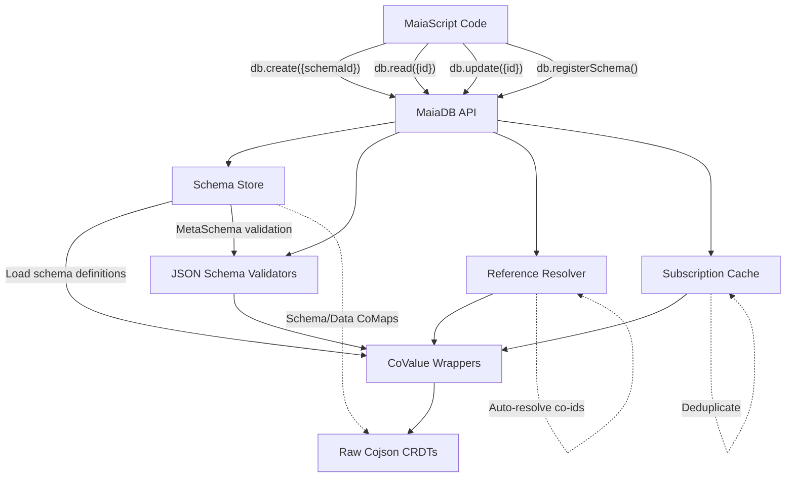

# MaiaDB: JSON Schema-Native CRDT Database

## Overview

**MaiaDB** is a JSON Schema-native wrapper around cojson (Jazz's CRDT core library), providing a purely JSON-based database API with an operations-based architecture for collaborative data management in MaiaOS.

**Key Features**:
- **Operations-Based API**: Single `o.db({ op })` entry point for all database interactions
- **Schema-as-CoMaps**: JSON Schemas are collaborative CRDTs themselves
- **JSON-Native**: All operations are pure JSON configurations
- **URI-Based References**: Standard `$ref` for schema dependencies
- **100% Reactive**: Auto-subscribed data updates
- **Auto-Resolution**: Nested co-id references resolve automatically via operations
- **Real CRDTs**: Built on `cojson` package (Jazz's CRDT core)

## Why MaiaDB?

MaiaDB provides a high-level, JSON-native API over cojson's raw CRDT primitives:

- **JSON Schema** for runtime validation and introspection
- **Simple Operations API**: `o.db({ op: "create", ... })` instead of raw CRDT methods
- **Auto-managed**: Subscriptions, caching, reference resolution handled internally
- **Collaborative Schemas**: Schemas themselves are versioned CRDTs
- **LLM-Friendly**: All operations have formal JSON Schema DSL definitions

For details on the operations API, see [Operations Documentation](../vibes/11_operations.md).

## Operations-Based Architecture

MaiaDB uses a unified operations API where all database interactions flow through a single entry point:

```javascript
await o.db({ op: "operationName", ...params })
```

**Key benefits:**
- **Uniform interface**: Single API for all CRUD + schema operations
- **JSON-configurable**: All operations are pure JSON
- **Validated**: Each operation type has a formal DSL schema
- **Composable**: Operations can be batched and nested
- **Read-only wrappers**: CoValue wrappers are read-only; all mutations via operations

See the [Operations Guide](../creators/11_operations.md) for complete documentation.

## Schema-as-CoMaps Architecture

**MaiaCojson** has been renamed to **MaiaDB** with a revolutionary schema system where JSON Schemas themselves are collaborative CRDTs!

### Core Concepts

**1. Schema/Data Separation**

MaiaDB maintains two distinct root-level CoMaps:

- **`Schema` CoMap** (System/Meta Layer):
  - `Genesis`: co-id reference to the MetaSchema CoValue
  - `Registry`: CoList containing co-ids of all registered schemas
  
- **`Data` CoMap** (Application Layer):
  - Your application's actual data
  - References schemas by co-id for validation

**2. MetaSchema (Self-Referencing)**

The foundational meta-schema that validates all other schemas, including itself:

```javascript
{
  "$schema": "https://maia.city/co_zMetaSchemaId",  // References itself!
  "$id": "https://maia.city/co_zMetaSchemaId",      // Its own co-id
  "type": "co-map",
  "properties": {
    "$schema": { "type": "co-id" },
    "type": { "type": "string" },
    "properties": { "type": "object" },
    // ... JSON Schema 2020 spec
  }
}
```

**3. Schema Storage**

Each registered schema is stored as a CoMap with a `definition` property:

```javascript
// Schema CoMap structure:
{
  definition: {
    "$schema": "https://maia.city/co_zMetaSchemaId",
    "$id": "https://maia.city/co_zSchemaId",
    "type": "co-map",
    "properties": {
      "title": { "type": "string" },
      "author": {
        "type": "co-id",
        "$ref": "https://maia.city/co_zAuthorSchemaId"
      }
    },
    "required": ["title"]
  }
}
```

**Key Points:**
- Schema definitions are **plain JSON objects** (not recursive CoMaps)
- Each schema includes complete JSON Schema metadata (`$schema`, `$id`)
- Schemas reference other schemas via `$ref` (for co-id properties)
- All co-ids are formatted as URIs: `https://maia.city/{co-id}`

**4. Registry System**

The `Schema.Registry` is a CoList that tracks all registered schemas:

```javascript
Schema.Registry = [
  "co_zMetaSchemaId",
  "co_zAuthorSchemaId",
  "co_zPostSchemaId",
  // ... more schema co-ids
]
```

### Co-ID References: Data Layer vs Schema Layer

**CRITICAL DISTINCTION**: `type: "co-id"` and `$ref` serve different purposes and BOTH are required for entity-to-entity relationships:

**`type: "co-id"` (Data Layer)**
- Indicates a property contains a **reference** to another CoValue
- The actual runtime value is a co-id string: `"co_zJohnDoe123"`
- Used by MaiaDB to resolve and load the referenced CoValue

**`$ref` (Schema Layer)**
- Indicates **which schema** the referenced CoValue should conform to
- Used at validation time to ensure data integrity
- Points to another schema definition via URI

**Example - Both Working Together:**

```javascript
// Schema Definition (tells MaiaDB what to expect)
{
  "type": "co-map",
  "properties": {
    "author": {
      "type": "co-id",  // ← REQUIRED: Marks this as a reference
      "$ref": "https://maia.city/co_zAuthorSchemaId"  // ← REQUIRED: Links to Author schema
    }
  }
}

// Data Instance (actual stored data)
{
  "title": "My Post",
  "author": "co_zJohnDoe123"  // ← The actual co-id reference!
}

// Runtime Resolution:
// 1. MaiaDB sees "type": "co-id" → loads co_zJohnDoe123
// 2. MaiaDB sees "$ref" → validates loaded data against Author schema
// 3. Returns wrapped CoMap representing the author
```

**Why Both Are Needed:**
- `type: "co-id"` alone → MaiaDB knows it's a reference but can't validate it
- `$ref` alone → Ajv validator doesn't know it's a CRDT reference
- Together → Complete type safety + CRDT resolution

### URI-Based References

All schema references use the URI format `https://maia.city/{co-id}` for JSON Schema compatibility:

**`$schema` (Validation)**
- Reference to the meta-schema that validates this schema
- For user schemas: `"$schema": "https://maia.city/co_zMetaSchemaId"`
- For MetaSchema: `"$schema": "https://maia.city/co_zMetaSchemaId"` (self-reference)

**`$id` (Identity)**
- Unique identifier for the schema itself
- Derived from the schema's CoMap co-id
- Example: `"$id": "https://maia.city/co_zPostSchemaId"`

**`$ref` (Cross-References)**
- Native JSON Schema keyword for referencing other schemas
- Used for co-id properties to link to their target schema
- Example: `"$ref": "https://maia.city/co_zAuthorSchemaId"`

**Why URIs?**
- Standard JSON Schema format (Ajv compatible)
- Globally unique (uses co-id)
- Future-proof for distributed schema resolution
- Clean separation between storage (co-id) and validation (URI)

### Validation Strategy

MaiaDB uses a two-layer approach to handle URI-based schemas:

**1. Storage Layer (Full JSON Schema)**
```javascript
{
  "$schema": "https://maia.city/co_zMetaId",
  "$id": "https://maia.city/co_zPostId",
  "properties": {
    "author": {
      "type": "co-id",
      "$ref": "https://maia.city/co_zAuthorId"
    }
  }
}
```

**2. Validation Layer (Metadata Stripped)**

Before passing to Ajv, `_stripSchemaMetadata()` transforms the schema:

```javascript
// _stripSchemaMetadata() removes:
// - Root-level $schema and $id (metadata)
// - Replaces $ref with generic co-id pattern

{
  "properties": {
    "author": {
      "type": "string",
      "pattern": "^co_z[a-zA-Z0-9]+$"  // Generic co-id validation
    }
  }
}
```

**Benefits:**
- JSON Schema compliance at storage layer
- Ajv can validate data structure without resolving URIs
- CRDT resolution happens at runtime (separate layer)
- Clean separation of concerns

## Architecture



### Layers Explained

1. **User Layer (MaiaScript)**
   - Pure JSON operations
   - No knowledge of CRDTs
   - Simple, declarative API
   - Works with schemaIds (co-ids)

2. **MaiaDB API Layer**
   - `MaiaDB` class (formerly MaiaCRUD)
   - Handles create/read/update/delete
   - Schema registration via `registerSchema()`
   - Manages LocalNode, Account, Group internally

3. **Schema Store Layer**
   - Manages Schema-as-CoMaps architecture
   - Bootstraps MetaSchema (self-referencing)
   - Maintains Schema.Registry (CoList of schema co-ids)
   - Loads and validates schema definitions
   - Handles URI-based references (`$schema`, `$id`, `$ref`)

4. **Core Systems**
   - **Reference Resolver**: Auto-resolves co-id strings to CoValue wrappers
   - **Subscription Cache**: Deduplicates subscriptions, 5-second cleanup timeout
   - **JSON Schema Validators**: Validates data before CRDT operations (with metadata stripping)

5. **Wrapper Layer**
   - Thin Proxy-based wrappers around Raw CRDTs
   - CoMap, CoList, CoStream, CoBinary, Account, Group, CoPlainText
   - Property access via Proxies

6. **Raw CRDT Layer** (from `cojson` package)
   - RawCoMap, RawCoList, RawCoStream, etc.
   - Actual collaborative data structures
   - Sync, encryption, permissions built-in

## CoValue Types

MaiaDB provides 7 core CRDT types:

| Type | JSON Schema | Description | Example |
|------|-------------|-------------|---------|
| **CoMap** | `co-map` | Key-value collaborative map | User profiles, settings |
| **CoList** | `co-list` | Ordered collaborative list | Todo items, messages |
| **CoStream** | `co-stream` | Append-only stream | Activity logs, events |
| **CoBinary** | `co-binary` | Binary data stream | Files, images |
| **Account** | `co-account` | User identity | Current user |
| **Group** | `co-group` | Permission group | Teams, access control |
| **CoPlainText** | `co-plaintext` | Collaborative text | Documents, notes |

### Co-ID References

References between CoValues use co-ids (string format: `co_z<base58>`) with explicit `$ref` for validation:

```json
{
  "type": "co-map",
  "properties": {
    "author": {
      "type": "co-id",
      "$ref": "https://maia.city/co_zAuthorSchemaId"
    }
  }
}
```

MaiaDB auto-resolves co-id strings to actual CoValue wrappers when accessed, and validates them against the referenced schema.

## API Reference

### Initialize MaiaDB

```javascript
import { MaiaDB } from '@maiaos/maia-cojson';
import { LocalNode } from 'cojson';
import { WasmCrypto } from 'cojson/crypto/WasmCrypto';

// Initialize cojson runtime
const crypto = await WasmCrypto.create();
const { node, accountID } = await LocalNode.withNewlyCreatedAccount({
  creationProps: { name: "Demo User" },
  peers: [], // Add sync peers here
  crypto,
});
const group = node.createGroup();

// Create MaiaDB instance
const db = new MaiaDB({ node, accountID, group });
```

### db.registerSchema() - Register Schemas

**Registers a new JSON Schema as a collaborative CoMap**

```javascript
const authorSchemaId = await db.registerSchema("Author", {
  type: "co-map",
  properties: {
    title: { type: "string" },
    description: { type: "string" }
  },
  required: ["title"]
});

const postSchemaId = await db.registerSchema("Post", {
  type: "co-map",
  properties: {
    title: { type: "string" },
    content: { type: "string" },
    author: {
      type: "co-id",  // ← Data layer
      "$ref": `https://maia.city/${authorSchemaId}`  // ← Schema layer
    },
    likes: { type: "number" }
  },
  required: ["title", "content", "author"]
});

console.log(postSchemaId); // "co_z..." (the schema's co-id)
```

**Features**:
- Stores schema as a CoMap with `definition` property
- Automatically adds `$schema` and `$id` (URI format)
- Validates schema against MetaSchema
- Adds schema co-id to Schema.Registry
- Returns schema co-id for use in `create()`

**Important**: Schema names are NOT unique identifiers. Use the returned `schemaId` (co-id) for all operations.

### db.create() - Create CoValues

**Creates a new collaborative data structure**

```javascript
// First, register schema
const postSchemaId = await db.registerSchema("Post", {
  type: "co-map",
  properties: {
    title: { type: "string" },
    content: { type: "string" },
    author: { type: "co-id" },
    likes: { type: "number" }
  },
  required: ["title", "content"]
});

// Then create data using schemaId
const post = await db.create({
  schemaId: postSchemaId,  // ← Use co-id returned from registerSchema
  data: {
    title: "Hello World",
    content: "This is a collaborative post",
    author: accountID, // Stores as co-id
    likes: 0
  }
});

console.log(post.$id); // Real CRDT ID: co_z...
console.log(post.title); // "Hello World"
```

**Parameters**:
- `schemaId`: co-id of registered schema (from `registerSchema()`)
- `data`: Plain JSON object with data to store

**Features**:
- Infers CRDT type from schema definition (`type` property)
- Validates data against JSON Schema before creating (with metadata stripping)
- Automatically extracts co-ids from object references
- Returns wrapped CoValue with property access

**Supported CRDT Types** (inferred from schema):
- `co-map` - Creates RawCoMap
- `co-list` - Creates RawCoList
- `co-stream` - Creates RawCoStream
- `co-binary` - Creates RawBinaryCoStream

### db.read() - Read CoValues (Reactive)

**Loads a CoValue and auto-subscribes to updates**

```javascript
const post = await db.read({
  id: "co_z123abc..."
});

console.log(post.title); // Current value

// post.likes updates automatically when changed!
// 100% reactive - no manual subscriptions needed
```

**Parameters**:
- `id`: co-id of the CoValue to load
- `timeout` (optional): Timeout in milliseconds

**Features**:
- Auto-detects CRDT type from the raw CoValue
- Auto-subscribes via SubscriptionCache
- Deduplicates subscriptions to same co-id
- Returns loading state if unavailable: `{ $isLoaded: false, $id: "co_z..." }`
- Updates automatically via real cojson subscriptions
- No schema parameter needed (type detection is automatic)

**Timeout Option**:
```javascript
const post = await db.read({
  id: "co_z123...",
  timeout: 10000, // 10 seconds
});
```

### db.update() - Update CoValues

**Modifies an existing CoValue**

```javascript
await db.update({
  id: post.$id,
  data: {
    likes: 42,
    title: "Updated Title"
  }
});

// post.likes is now 42 (reactive update!)
```

**Parameters**:
- `id`: co-id of the CoValue to update
- `data`: Plain JSON object with properties to update

**Features**:
- Updates only specified properties
- Works with CoMap (sets keys) and CoList (appends items)
- Validation happens automatically if schema was registered
- Direct property assignment on returned CoValue wrappers

### db.delete() - Delete CoValues

**Deletes a CoValue**

```javascript
await db.delete({
  id: post.$id
});

// post.title is now undefined
// All keys removed from CoMap
```

**Parameters**:
- `id`: co-id of the CoValue to delete

**Behavior**:
- **CoMap**: Deletes all keys
- **CoList**: Deletes all items
- Underlying CRDT still exists (for sync), but content is cleared

## JSON Schema Extensions

MaiaDB extends JSON Schema with CRDT-specific types:

### Co-Types

```json
{
  "type": "co-map",
  "properties": {
    "title": { "type": "string" },
    "items": { "type": "co-list" },
    "author": { "type": "co-id" },
    "data": { "type": "co-binary" }
  }
}
```

### Schema Preprocessing

MaiaDB automatically converts `co-*` types to Ajv-compatible formats for validation:

**Input**:
```json
{
  "type": "co-map",
  "properties": {
    "author": { "type": "co-id" }
  }
}
```

**Preprocessed for Ajv**:
```json
{
  "type": "object",
  "x-co-type": "co-map",
  "properties": {
    "author": {
      "type": "string",
      "pattern": "^co_z[a-zA-Z0-9]+$",
      "x-co-type": "co-id"
    }
  }
}
```

The original type is preserved in `x-co-type` for internal use.

## Complete Example: Blog System

```javascript
import { MaiaDB } from '@maiaos/maia-cojson';
import { LocalNode } from 'cojson';
import { WasmCrypto } from 'cojson/crypto/WasmCrypto';

// Initialize
const crypto = await WasmCrypto.create();
const { node, accountID } = await LocalNode.withNewlyCreatedAccount({
  creationProps: { name: "Blogger" },
  peers: [],
  crypto,
});
const group = node.createGroup();
const db = new MaiaDB({ node, accountID, group });

// 1. REGISTER SCHEMAS
// Author schema (no dependencies)
const authorSchemaId = await db.registerSchema("Author", {
  type: "co-map",
  properties: {
    title: { type: "string" },
    description: { type: "string" }
  },
  required: ["title"]
});

// Post schema (depends on Author)
const postSchemaId = await db.registerSchema("Post", {
  type: "co-map",
  properties: {
    title: { type: "string" },
    content: { type: "string" },
    author: {
      type: "co-id",  // ← Data layer: marks as reference
      "$ref": `https://maia.city/${authorSchemaId}`  // ← Schema layer: validation
    },
    likes: { type: "number" }
  },
  required: ["title", "content", "author"]
});

// Blog schema
const blogSchemaId = await db.registerSchema("Blog", {
  type: "co-map",
  properties: {
    title: { type: "string" },
    posts: {
      type: "co-list",
      items: {
        type: "co-id",  // ← References to posts
        "$ref": `https://maia.city/${postSchemaId}`
      }
    }
  },
  required: ["title"]
});

console.log("Schemas registered:", { authorSchemaId, postSchemaId, blogSchemaId });

// 2. CREATE author
const author = await db.create({
  schemaId: authorSchemaId,
  data: {
    title: "Tech Blogger",
    description: "Writing about CRDTs"
  }
});

// 3. CREATE blog
const blog = await db.create({
  schemaId: blogSchemaId,
  data: {
    title: "My Tech Blog"
  }
});

console.log("Blog created:", blog.$id); // co_z...

// 4. CREATE posts list
const postsListSchemaId = await db.registerSchema("PostsList", {
  type: "co-list",
  items: {
    type: "co-id",
    "$ref": `https://maia.city/${postSchemaId}`
  }
});

const posts = await db.create({
  schemaId: postsListSchemaId,
  data: []
});

// 5. CREATE post (with author reference)
const post = await db.create({
  schemaId: postSchemaId,
  data: {
    title: "Getting Started with MaiaDB",
    content: "Welcome to MaiaDB! Schemas are CRDTs...",
    author: author.$id,  // ← co-id reference stored
    likes: 0
  }
});

console.log("Post created:", post.$id);
console.log("Author co-id:", post.author);  // "co_z..."

// 6. ADD post to list
await db.update({
  id: posts.$id,
  data: [post]  // Appends post reference
});

// 7. READ post (reactive!)
const loadedPost = await db.read({
  id: post.$id
});

console.log(loadedPost.title); // "Getting Started with MaiaDB"

// 8. UPDATE post (increase likes)
await db.update({
  id: post.$id,
  data: { likes: 42 }
});

// loadedPost.likes is now 42 (automatic reactive update!)
console.log(loadedPost.likes); // 42

// 9. DELETE post
await db.delete({ id: post.$id });

// loadedPost.title is now undefined (content cleared)
```

**Key Differences from Old API:**
- ✅ Schemas registered first with `registerSchema()`
- ✅ `create()` uses `schemaId` instead of inline schema
- ✅ Explicit `$ref` for all co-id properties
- ✅ `read()` doesn't need schema (auto-detected)
- ✅ URI-based references (`https://maia.city/{co-id}`)
- ✅ Clear separation: data layer (`type: "co-id"`) vs schema layer (`$ref`)

## Reactivity System

### How Reactivity Works

**1. Subscription Cache (Deduplication)**

When you call `db.read()`, MaiaDB:
1. Checks if a subscription already exists for that co-id
2. Reuses existing subscription (no duplicate `node.subscribe()` calls)
3. Adds your read callback to the subscriber set
4. When CRDT updates, triggers all callbacks

**Structure**:
```javascript
Map<coId, {
  callbacks: Set<Function>,
  subscriberCount: number,
  unsubscribe: Function,
  cleanupTimeoutId: number | null,
}>
```

**2. Cleanup Timeout (5 seconds)**

When subscriber count reaches 0:
1. Schedules cleanup after 5 seconds
2. If new subscriber added, cancels cleanup
3. Prevents subscription churn (rapid subscribe/unsubscribe)

**3. Automatic Updates**

When real CRDT changes:
```
RawCoMap.set() → node.subscribe() callback → All subscribers notified → UI updates
```

No manual subscription management needed!

## Reference Resolution

### The Problem

CRDTs store references as co-id strings:

```javascript
{
  "author": "co_z123abc..." // String, not object
}
```

### MaiaDB Solution

**Auto-Resolution**: When you access a co-id, MaiaDB automatically:
1. Checks cache (coValuesCache)
2. If not loaded, calls `node.load(coId)`
3. Returns loading state immediately (non-blocking)
4. Updates automatically when loaded

**Example**:
```javascript
const post = await db.read({ id: "co_z123..." });

// post.author is a co-id string internally
// But you can resolve it:
import { resolveReference } from '@maiaos/maia-cojson';

const author = await resolveReference(
  post.author,
  null,  // Schema is auto-detected
  db.node
);

console.log(author.name); // Resolved!
```

### Circular Reference Detection

MaiaDB uses a `WeakSet` to track resolution paths:

```javascript
// map1.ref → map2
// map2.ref → map1 (circular!)

const map1 = await resolveReference(map1Id, schema, node);

// Returns loading state for circular refs (no infinite loop)
```

## Caching System

### Instance Cache (coValuesCache)

**Purpose**: Ensure same `RawCoValue` always returns same wrapper instance (object identity)

**Implementation**:
```javascript
// WeakMap<RawCoValue, CoValue>
const coValuesCache = {
  get(raw, compute) {
    const cached = weakMap.get(raw);
    if (cached) return cached;
    
    const computed = compute();
    weakMap.set(raw, computed);
    return computed;
  },
};
```

**Benefits**:
- Automatic garbage collection (WeakMap)
- Object identity: `CoMap.fromRaw(raw) === CoMap.fromRaw(raw)`
- No memory leaks

### Subscription Cache

**Purpose**: Deduplicate subscriptions to same CoValue

**Implementation**:
```javascript
Map<coId, {
  callbacks: Set<Function>,
  subscriberCount: number,
  unsubscribe: Function,     // Real cojson unsubscribe
  cleanupTimeoutId: number,   // 5-second timeout
}>
```

**Lifecycle**:
1. First `db.read()` → Creates subscription
2. Second `db.read()` → Reuses subscription (adds callback)
3. All callbacks unsubscribed → Schedules cleanup (5s)
4. New `db.read()` before timeout → Cancels cleanup
5. Timeout expires → Destroys subscription

**Benefits**:
- No duplicate `node.subscribe()` calls
- Efficient update propagation
- Prevents subscription churn
- Automatic cleanup (no memory leaks)

## Validation System

### SchemaValidator

**Purpose**: Validate data against JSON Schema before CRDT operations

```javascript
import { SchemaValidator } from '@maiaos/maia-cojson';

const validator = new SchemaValidator({
  type: "co-map",
  properties: {
    title: { type: "string" },
    likes: { type: "number" },
  },
  required: ["title"],
});

try {
  validator.validate({
    title: "Hello",
    likes: 42,
  });
  console.log("✅ Valid!");
} catch (error) {
  console.error("❌", error.message);
  console.error("Errors:", error.ajvErrors);
}
```

### Preprocessing

**Schema Preprocessor** converts co-* types to Ajv-compatible formats:

```javascript
import { preprocessSchema } from '@maiaos/maia-cojson';

const original = {
  type: "co-map",
  properties: {
    author: { type: "co-id" }
  }
};

const processed = preprocessSchema(original);

// processed.type === "object"
// processed["x-co-type"] === "co-map"
// processed.properties.author.pattern === "^co_z[a-zA-Z0-9]+$"
```

### ValidationError

Custom error class with formatted Ajv errors:

```javascript
try {
  validator.validate(invalidData);
} catch (error) {
  console.log(error.message);
  // "Validation failed:
  //  (root): must have required property 'title'"
  
  console.log(error.ajvErrors);
  // [{
  //   instancePath: "",
  //   schemaPath: "#/required",
  //   keyword: "required",
  //   params: { missingProperty: "title" },
  //   message: "must have required property 'title'"
  // }]
  
  console.log(error.originalSchema);
  // Original JSON Schema
}
```

## Internal Components

### Wrappers (Proxy-based)

All wrappers use JavaScript Proxies for property access:

**CoMap Example**:
```javascript
class CoMap {
  constructor(rawCoMap, schema) {
    this._raw = rawCoMap;
    this.$schema = schema;
    
    return new Proxy(this, {
      get(target, prop) {
        // System properties
        if (prop === '$id') return target._raw.id;
        if (prop === '$schema') return target.$schema;
        
        // Get from RawCoMap
        const value = target._raw.get(prop);
        
        // Check if co-id reference
        if (typeof value === 'string' && value.startsWith('co_')) {
          return value; // Return co-id (resolve separately)
        }
        
        return value;
      },
      
      set(target, prop, value) {
        // Extract $id if object
        if (value && typeof value === 'object' && value.$id) {
          target._raw.set(prop, value.$id);
        } else {
          target._raw.set(prop, value);
        }
        return true;
      }
    });
  }
  
  static fromRaw(raw, schema) {
    return coValuesCache.get(raw, () => new CoMap(raw, schema));
  }
}
```

### Reference Resolver

**Purpose**: Auto-resolve co-id strings to CoValue wrappers

**API**:
```javascript
import { resolveReference, isCoId } from '@maiaos/maia-cojson';

// Check if value is a co-id
if (isCoId(value)) {
  // Resolve to wrapper
  const resolved = await resolveReference(value, schema, node);
  
  if (resolved.$isLoaded) {
    console.log(resolved.name); // Resolved CoMap
  } else {
    console.log("Loading..."); // Not yet available
  }
}
```

**Features**:
- Uses `node.load()` for async loading
- Returns loading state immediately (non-blocking)
- Detects circular references
- Integrates with coValuesCache

### Subscription Cache

**Purpose**: Deduplicate and manage cojson subscriptions

**API**:
```javascript
import { SubscriptionCache } from '@maiaos/maia-cojson';

const cache = new SubscriptionCache(5000); // 5-second cleanup

// Add subscriber
cache.addSubscriber(coId, (value) => {
  console.log("Updated:", value);
}, node);

// Remove subscriber
cache.removeSubscriber(coId, callback);

// Get subscriber count
cache.getSubscriberCount(coId); // number

// Clear all
cache.clear();
```

**Lifecycle**:
1. `addSubscriber()` → Creates `node.subscribe()` if first subscriber
2. `addSubscriber()` (again) → Reuses existing subscription
3. `removeSubscriber()` → Decrements count, schedules cleanup if 0
4. Wait 5 seconds → Cleanup destroys subscription
5. `addSubscriber()` before timeout → Cancels cleanup

**Used by MaiaDB:**
- `db.read()` adds subscriber automatically
- Subscriptions persist for 5 seconds after last use
- All subscriptions cleaned up on `db.destroy()`

## Loading States

**Three States**:
```javascript
import { CoValueLoadingState } from '@maiaos/maia-cojson';

CoValueLoadingState.LOADING      // "loading"
CoValueLoadingState.LOADED       // "loaded"
CoValueLoadingState.UNAVAILABLE  // "unavailable"
```

**Loading State Object**:
```javascript
{
  $isLoaded: false,
  $id: "co_z123...",
  $loadingState: "unavailable" | "error" | "circular",
  $error: "Error message" // if error
}
```


## Integration with MaiaScript

### Basic Integration

```javascript
// In MaiaScript engine
import { MaiaDB } from '@maiaos/maia-cojson';

// Initialize once
const db = new MaiaDB({ node, accountID, group });

// Register schemas at startup
const todoSchemaId = await db.registerSchema("Todo", {
  type: "co-map",
  properties: {
    title: { type: "string" },
    description: { type: "string" },
    done: { type: "boolean" }
  },
  required: ["title"]
});

// Use in intent handlers
async function createTodo(title, description) {
  return await db.create({
    schemaId: todoSchemaId,
    data: { title, description, done: false }
  });
}

async function loadTodos(todoListId) {
  const list = await db.read({
    id: todoListId
  });
  
  // list is reactive - updates automatically!
  return list;
}

async function updateTodo(todoId, updates) {
  await db.update({
    id: todoId,
    data: updates
  });
}
```

### With Schema Registry

```javascript
// schemas/todo.schema.json
{
  "type": "co-map",
  "properties": {
    "title": { "type": "string" },
    "done": { "type": "boolean" }
  },
  "required": ["title"]
}

// In MaiaScript - load and register schema
const todoSchemaJson = await loadSchemaFile("todo");
const todoSchemaId = await db.registerSchema("Todo", todoSchemaJson);

const todo = await db.create({
  schemaId: todoSchemaId,
  data: { title: "Buy milk", done: false }
});
```

## Performance Considerations

### Caching

**Two-level cache**:
1. **Instance Cache (WeakMap)**: Same raw → same wrapper
2. **Subscription Cache (Map)**: Same co-id → shared subscription

**Benefits**:
- O(1) lookups
- No duplicate subscriptions
- Automatic GC

### Lazy Loading

**References loaded on-demand**:
- Co-id strings stored directly (lightweight)
- Resolved only when accessed
- Loading state returned immediately (non-blocking)

### Cleanup

**5-second timeout** prevents:
- Subscription churn (rapid sub/unsub)
- Memory leaks (old subscriptions)
- Unnecessary `node.subscribe()` calls

## Advanced Topics

### Custom Schemas

**Extend base schemas**:
```javascript
const BASE_POST = {
  type: "co-map",
  properties: {
    title: { type: "string" },
    content: { type: "string" },
  },
};

const BLOG_POST = {
  ...BASE_POST,
  properties: {
    ...BASE_POST.properties,
    author: { type: "co-id" },
    likes: { type: "number" },
  },
  required: ["title", "content", "author"],
};
```

### Nested Structures

**CoList of CoMaps**:
```javascript
// Register schemas
const postSchemaId = await db.registerSchema("SimplePost", {
  type: "co-map",
  properties: {
    title: { type: "string" }
  },
  required: ["title"]
});

const postsListSchemaId = await db.registerSchema("PostsList", {
  type: "co-list",
  items: {
    type: "co-id",
    "$ref": `https://maia.city/${postSchemaId}`
  }
});

// Create list
const posts = await db.create({
  schemaId: postsListSchemaId,
  data: []
});

// Add post
const post = await db.create({
  schemaId: postSchemaId,
  data: { title: "Post 1" }
});

await db.update({
  id: posts.$id,
  data: [post]  // Stores co-id reference
});
```

### Direct Wrapper Access

**Low-level API still available**:
```javascript
import { CoMap } from '@maiaos/maia-cojson';

// Direct access to raw CRDT
const coMap = CoMap.fromRaw(rawCoMap, schema);

coMap.title = "Hello";
console.log(coMap._raw.get("title")); // Direct raw access
```

## Troubleshooting

### Common Issues

**1. "Validation failed: must have required property"**
- Check schema `required` array
- Ensure all required fields provided in `data`

**2. "CoValue unavailable"**
- Co-id doesn't exist or not synced yet
- Check `timeout` option in `db.read()`
- Verify network/peer connectivity

**3. "Loading state returned instead of value"**
- CoValue not yet loaded
- Use loading state: `if (!value.$isLoaded) { /* show loading */ }`

**4. Tests fail with "asArray is not a function"**
- Using mock instead of real RawCoList
- Fix: Use `group.createList()` from real cojson

## Best Practices

### 1. Always Define Schemas

```javascript
// ✅ Good
const TODO_SCHEMA = {
  type: "co-map",
  properties: {
    title: { type: "string" },
    done: { type: "boolean" },
  },
  required: ["title"],
};

const todo = await o.create({
  type: "co-map",
  schema: TODO_SCHEMA,
  data: { title: "Task", done: false },
});

// ❌ Bad
const todo = await o.create({
  type: "co-map",
  schema: {}, // Empty schema = no validation!
  data: { anything: "goes" },
});
```

### 2. Use References for Relationships

```javascript
// ✅ Good (reference)
const post = await o.create({
  type: "co-map",
  schema: POST_SCHEMA,
  data: {
    title: "Hello",
    author: authorCoMap, // Stores as co-id
  },
});

// ❌ Bad (nested object)
const post = await o.create({
  type: "co-map",
  schema: POST_SCHEMA,
  data: {
    title: "Hello",
    author: {
      name: "Alice", // Stores as plain JSON (not collaborative!)
    },
  },
});
```

### 3. Handle Loading States

```javascript
const post = await db.read({ id });

if (!post.$isLoaded) {
  // Show loading UI
  return <div>Loading...</div>;
}

// Use post data
return <div>{post.title}</div>;
```

### 4. Clean Up Subscriptions

```javascript
// When component unmounts
db.destroy(); // Clears all subscriptions
```

## About cojson

**cojson** is Jazz's core CRDT library that provides the foundational data structures for collaborative applications. MaiaDB wraps cojson with a high-level, JSON-native API.

**What cojson provides:**
- Core CRDT types: CoMap, CoList, CoStream, CoBinary
- Local-first synchronization
- Conflict-free collaborative editing
- Efficient binary protocol
- IndexedDB persistence

**What MaiaDB adds:**
- Operations-based API (`o.db({ op })`)
- JSON Schema validation and introspection
- Schema-as-CoMaps architecture
- Automatic subscription management
- Deep reference resolution
- LLM-friendly JSON configurations

MaiaDB is the high-level interface; cojson is the low-level engine.

## Package Information

- **Name**: `@maiaos/maia-cojson` (kernel), `@maia/script` (operations engine)
- **Version**: `0.17.0`
- **Dependencies**: `cojson@^0.19.21`, `ajv@^8.12.0`
- **Test Command**: `bun test`
- **Dev Server**: `bun dev` (http://localhost:4200)

## Example App

See [`libs/maia-script/src/vibes/blog/`](../../maia-script/src/vibes/blog/) for a complete working example demonstrating:
- MaiaOS initialization with `createMaiaOS()`
- Operations-based API (`o.db({ op })`)
- Schema registration and management
- CRUD operations with validation
- Deep resolution of references
- Inspector view of loaded CoValues

Run: `cd libs/maia-script && bun dev`, then open http://localhost:4200/vibes/blog/

## Future Enhancements

**Advanced Operations:**
- `subscribe`: Explicit subscription management
- `query`: Advanced filtering and querying
- `migrate`: Schema migration operations
- `transaction`: Multi-operation atomicity

**Higher-Order Types:**
- **CoFeed**: Activity streams
- **CoVector**: Threaded comments
- **ImageDefinition**: Profile pictures with metadata

**Framework Integrations:**
- Svelte stores
- React hooks
- Native reactive bindings

## Contributing

When contributing to MaiaDB:

**Zero Mocks Policy**:
- ✅ All tests MUST use real cojson types
- ✅ Real LocalNode initialization
- ✅ Real co-id generation (`co_z...`)
- ❌ NO Mock classes
- ❌ NO stubs or fakes

**Test Requirements**:
```javascript
// Required imports
import { LocalNode } from "cojson";
import { WasmCrypto } from "cojson/crypto/WasmCrypto";

// Setup
beforeAll(async () => {
  const crypto = await WasmCrypto.create();
  const { node, accountID } = await LocalNode.withNewlyCreatedAccount({
    creationProps: { name: "Test User" },
    peers: [],
    crypto,
  });
  const group = node.createGroup();
  // Use real CRDTs in tests!
});
```

## Resources

- **Source Code**: `libs/maia-cojson/`
- **Tests**: `libs/maia-cojson/src/**/**.test.js`
- **Example App**: `libs/maia-cojson/src/app/`
- **Cojson Docs**: [Jazz Documentation](https://jazz.tools)

## License

Part of MaiaOS project
