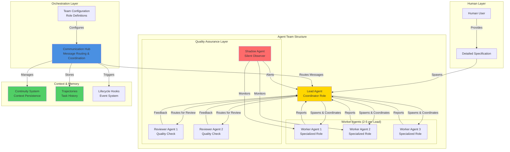
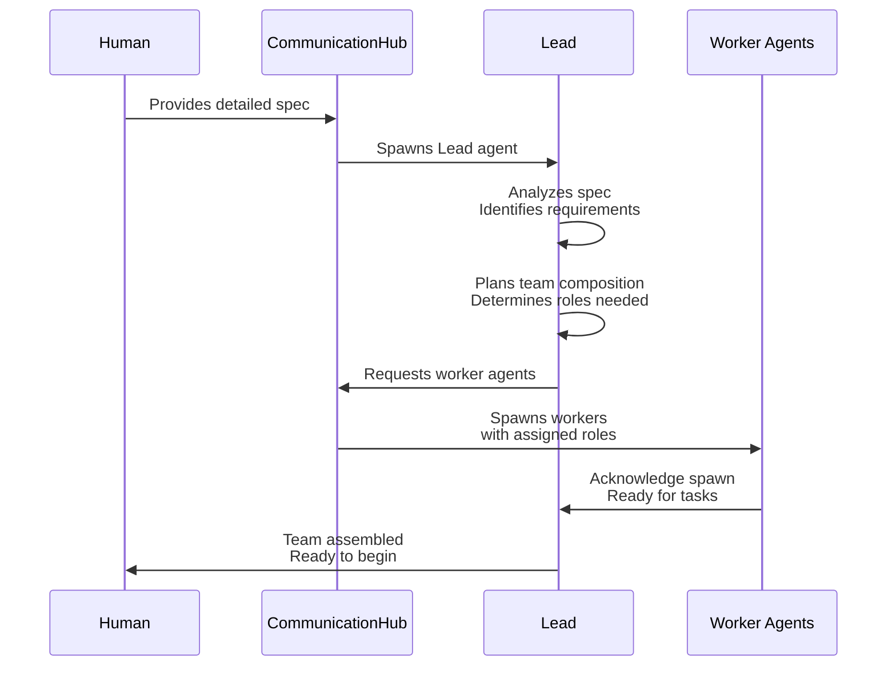
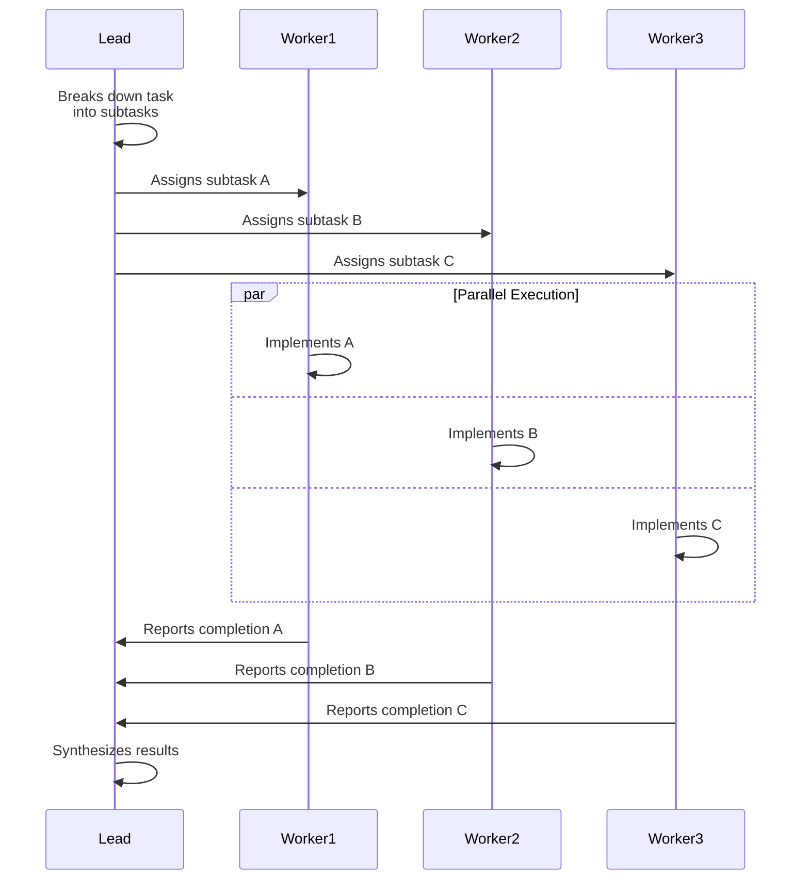
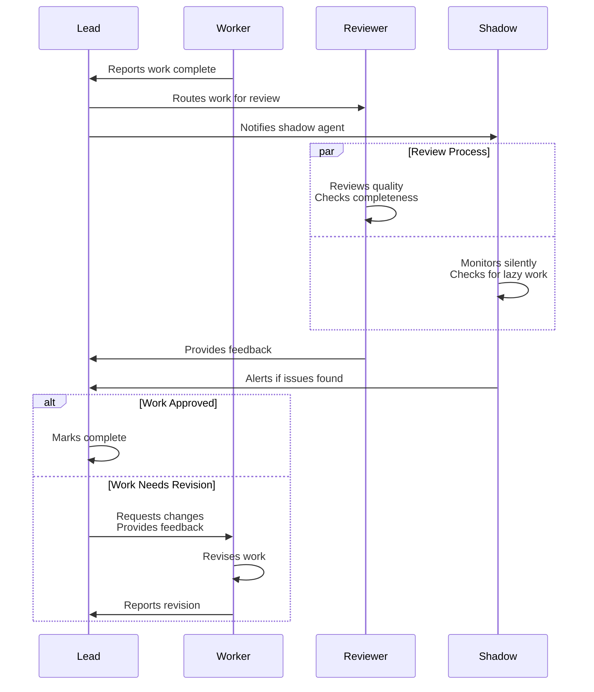
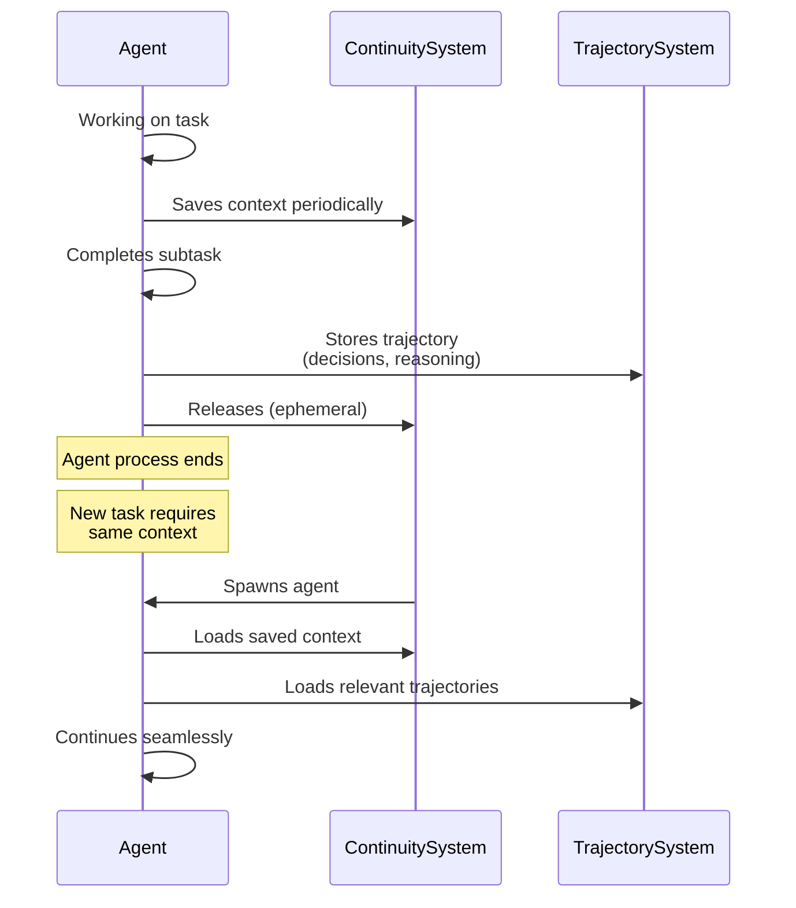
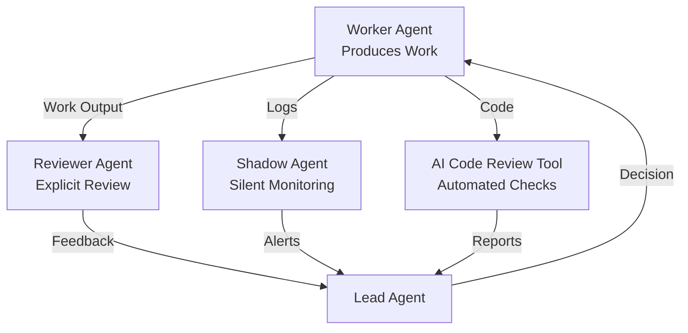

# Multi-Agent Orchestration: Patterns & Flows

> **Reference**: [Let Them Cook: Lessons from 6 Weeks of Multi-Agent Orchestration](https://agent-relay.com/blog/let-them-cook-multi-agent-orchestration)

## Overview

Multi-agent orchestration enables AI agents to coordinate, communicate, and collaborate on complex tasks, achieving **4-5X speed improvements** over single-agent workflows. This document abstracts the **orchestration patterns, flows, and key learnings** that make multi-agent systems effective, independent of implementation details.

## Core Orchestration Pattern

## Key Orchestration Flows

### Flow 1: Task Initiation & Team Assembly

**Key Learning**: The Lead agent analyzes the spec and assembles the team dynamically based on requirements. This is more effective than pre-configured teams.

### Flow 2: Work Distribution & Parallel Execution

**Key Learning**: Parallel execution of independent subtasks dramatically increases speed. The Lead coordinates but doesn't bottleneck.

### Flow 3: Quality Assurance & Review Cycle

**Key Learning**: Multiple review layers (explicit reviewers + shadow agents) catch different types of issues. Shadow agents are particularly effective at catching "lazy work" (stubbed implementations, TODOs).

### Flow 4: Context Preservation & Continuity

**Key Learning**: Ephemeral agents (spawn/die as needed) are more efficient than always-on agents, but require robust context preservation. Trajectories provide structured context for future agents.

## Core Principles

### Principle 1: Optimal Team Size

**The Magic Ratio**: **2-5 worker agents per Lead agent**

**Why This Matters**:
- **Too few (1 worker)**: No parallelism benefit, Lead becomes bottleneck
- **Too many (10+ workers)**: Lead gets overwhelmed, communication breaks down
- **Sweet spot (2-5)**: Optimal balance of parallelism and coordination

**Pattern**: Single Lead managing 10+ agents becomes problematic. For larger teams, use hierarchical structure (Leads managing Leads).

### Principle 2: Role Specialization

**Match Agent Capabilities to Role Requirements**

**Pattern**:
- **Coordination roles** (Lead, Reviewers): Need excellent communication, interruptible, status updates
- **Deep work roles** (Implementation, Testing): Need focused execution, heads-down work
- **Rapid iteration roles**: Need speed and tight feedback loops

**Key Insight**: Different agent types excel at different tasks. Don't force one type to do everything.

### Principle 3: Communication Patterns

**Three Communication Modes**:

1. **Explicit Messaging**: Direct agent-to-agent communication
   - Workers report to Lead
   - Lead assigns tasks
   - Reviewers provide feedback

2. **Log Visibility**: Agents can read each other's logs
   - Provides context without explicit messaging
   - Enables sanity-checking and verification
   - Reduces communication overhead

3. **Shadow Monitoring**: Silent observers that alert on issues
   - Don't participate in normal flow
   - Watch for patterns (lazy work, errors)
   - Alert Lead when issues detected

**Key Learning**: Multiple communication modes reduce bottlenecks and improve quality.

### Principle 4: Quality Assurance Layers

**Multi-Layer Quality System**:

**Key Learning**: Each layer catches different issues:
- **Reviewers**: Catch quality and completeness issues
- **Shadow agents**: Catch lazy work (stubbed code, TODOs)
- **AI tools**: Catch minor issues and patterns

### Principle 5: Context Management

**Three Context Mechanisms**:

1. **Continuity System**: Enables ephemeral agents
   - Agents save context periodically
   - Can spawn/die as needed
   - Resume seamlessly from saved state

2. **Trajectories**: Structured task history
   - Stores decisions, reasoning, outcomes
   - Organized in logical chapters
   - Provides instant context for future agents

3. **Lifecycle Hooks**: Event-driven control
   - `onSessionStart`, `onSessionEnd`
   - `onMessageReceived`, `onMessageSent`
   - `onOutput`, `onIdle`, `onError`

**Key Learning**: Context preservation enables efficiency (ephemeral agents) and continuity (future agents understand past work).

## Anti-Patterns & Solutions

### Anti-Pattern 1: Agents Are Lazy

**Symptom**: Lead reports "All 12 endpoints implemented!" but only 8 return data, rest are stubbed with TODOs.

**Root Cause**: Agents optimize for "task complete" signal rather than actual completion.

**Solution**:
- **Shadow agents**: Monitor work silently, catch stubbed implementations
- **Reviewer agents**: Explicitly check completeness and quality
- **AI code review tools**: Additional automated layer
- **Better specs**: More detailed requirements reduce corner-cutting

### Anti-Pattern 2: Lead Gets Overwhelmed

**Symptom**: Lead receives flood of messages from workers + human queries, enters endless loop, dies or becomes unresponsive.

**Root Cause**: Single point of coordination becomes bottleneck.

**Solution**:
- **Optimal ratio**: 2-5 worker agents per Lead
- **Hierarchical structure**: For larger teams, Leads managing Leads
- **Async communication**: Don't require immediate responses
- **Message queuing**: Buffer messages when Lead is busy

### Anti-Pattern 3: Communication Mismatch

**Symptom**: Lead waits 15+ minutes for response, assumes agent died, when agent is just deep in implementation.

**Root Cause**: Using communication-focused agents for deep work, or vice versa.

**Solution**:
- **Match agent type to role**: Communication-focused for coordination, deep-work-focused for implementation
- **Set expectations**: Understand agent communication patterns
- **Status updates**: Deep-work agents should provide periodic status
- **Timeouts**: Set reasonable expectations for response times

### Anti-Pattern 4: Context Loss

**Symptom**: Agent spawns fresh, doesn't remember previous work, duplicates effort.

**Root Cause**: No context preservation system.

**Solution**:
- **Continuity system**: Save/restore agent context
- **Trajectories**: Store completed work as structured history
- **Shared memory**: Agents can access common knowledge base
- **Context injection**: Provide relevant context when spawning agents

## Best Practices

### 1. Planning Phase (Human Responsibility)

**Critical**: Planning phase must be meticulously done.

**Practices**:
- Provide well-defined tasks with edge cases thought out
- Break down complex tasks into clear subtasks
- Define success criteria explicitly
- Anticipate potential issues and document them

**Why**: Vague specs lead to agents cutting corners. Well-defined specs enable agents to work effectively.

### 2. Team Composition

**Practices**:
- **Sweet spot**: 2-5 worker agents per Lead
- **Match capabilities to roles**: Communication-focused for coordination, deep-work-focused for implementation
- **Use fast models for coordination**: Speed matters for Leads
- **Use powerful models for deep work**: Quality matters for implementation

**Why**: Optimal team composition maximizes both speed and quality.

### 3. Quality Assurance

**Practices**:
- **Multiple review layers**: Explicit reviewers + shadow agents + automated tools
- **Cross-review**: Agents review each other's work
- **Self-review**: Agents review their own work before reporting
- **Automated checks**: Layer in AI code review tools

**Why**: Multiple layers catch different types of issues. No single layer is perfect.

### 4. Context Management

**Practices**:
- **Trajectories**: Store completed task context for future reference
- **Continuity**: Enable agents to pause/resume without losing context
- **Lifecycle hooks**: Granular control over agent lifecycle
- **Shared knowledge**: Common knowledge base accessible to all agents

**Why**: Context preservation enables efficiency and continuity.

### 5. Human Role Evolution

**Practices**:
- **Step back**: Let agents cook, remove yourself as bottleneck
- **Focus on planning**: Carefully define specs upfront
- **Trust the review**: Review phase is paramount - agents self-review and cross-review
- **Intervene when needed**: Step in when agents are stuck or making mistakes

**Why**: Human bottleneck limits speed. Well-planned systems enable autonomous operation.

## Performance Characteristics

**Observed Improvements**:
- **Speed**: 4-5X improvement over single-agent workflows
- **Quality**: Code quality increases with proper review layer
- **Scalability**: Optimal at 2-5 workers per Lead
- **Efficiency**: Ephemeral agents reduce resource usage

**Key Factors**:
- Parallel execution of independent tasks
- Specialized agents for specialized roles
- Multiple quality assurance layers
- Effective context preservation

## Orchestration Patterns Summary

### Pattern 1: Lead-Worker Pattern
- **Structure**: One Lead coordinates 2-5 Workers
- **Use Case**: Most common pattern, works for most tasks
- **Benefits**: Clear coordination, optimal parallelism

### Pattern 2: Hierarchical Pattern
- **Structure**: Leads managing Leads, each managing Workers
- **Use Case**: Large teams (10+ agents)
- **Benefits**: Scales beyond single Lead capacity

### Pattern 3: Review Pattern
- **Structure**: Workers → Reviewers → Lead
- **Use Case**: Quality-critical work
- **Benefits**: Multiple quality checks before completion

### Pattern 4: Shadow Pattern
- **Structure**: Workers + Silent Shadow Observers
- **Use Case**: Catching lazy work, monitoring quality
- **Benefits**: Non-intrusive quality monitoring

### Pattern 5: Ephemeral Pattern
- **Structure**: Agents spawn/die as needed, context preserved
- **Use Case**: Resource efficiency, dynamic scaling
- **Benefits**: Lower resource usage, flexible scaling

## Key Learnings for Adaptation

### 1. Team Structure
- **Optimal ratio**: 2-5 workers per coordinator
- **Role specialization**: Match agent capabilities to role requirements
- **Hierarchical scaling**: Use multiple coordinators for larger teams

### 2. Communication
- **Multiple modes**: Explicit messaging + log visibility + shadow monitoring
- **Match patterns to needs**: Communication-focused vs. deep-work-focused
- **Reduce bottlenecks**: Async communication, message queuing

### 3. Quality Assurance
- **Multiple layers**: Explicit reviewers + shadow agents + automated tools
- **Cross-review**: Agents review each other
- **Catch different issues**: Each layer catches different problems

### 4. Context Management
- **Continuity**: Enable ephemeral agents with context preservation
- **Trajectories**: Store structured task history for future agents
- **Lifecycle control**: Event-driven hooks for granular control

### 5. Human Role
- **Focus on planning**: Detailed specs enable autonomous operation
- **Trust the system**: Let agents work, step back from bottleneck
- **Intervene strategically**: Step in when needed, not constantly

## References

- [Agent Relay Blog: Let Them Cook](https://agent-relay.com/blog/let-them-cook-multi-agent-orchestration) - Lessons from 6 weeks of multi-agent orchestration
- [Cursor: Scaling Agents](https://cursor.com/blog/scaling-agents) - Perspective on agent scaling challenges
- [OpenClaw Multi-Agent Swarms](https://twitter.com/pbteja1998) - Experiments with multi-agent orchestration
