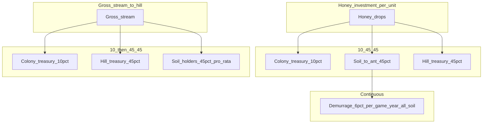

# Ant Colony — game mechanics overview

Design doc for **phase 1** of Maia City: a cooperative, bite-sized MMO where players act as **ants** allocating daily **honey** into **Ant-Hills** (co-operatives), earning **soil** (per-hill stake and consumption currency), and participating in **streaming money**, **collective needs**, and **soil liquidity pools**.

This document is conceptual. Research trees, exact resource catalogs, and implementation live elsewhere.

---

## 1. Design stance: labour, ownership, and currency

**Labour vs ownership.** The simulation separates **income tied to human labour** from **income secured through ownership** in a post-AGI framing. Honey and soil are the mechanical expression of that split: everyone gets a daily honey endowment (not “wages”); converting honey into soil is how ants take **ownership stake** in co-ops that produce goods and services.

**Top-down vs bottom-up money.** Traditional money is mostly issued and steered **top-down**. In Ant Colony, issuance and value accrue **bottom-up**: honey flows from every ant every day; ants **choose** which Ant-Hills receive it; each hill mints its own **soil** and treasury from those flows. **Protocol-wide** rules still exist: a **colony treasury** (system layer) and **demurrage** on soil keep the network coherent—not a single bank, but shared constraints.

---

## 2. Time and session model

- **1 real-world calendar day = 1 in-game year.**
- Players interact **a few minutes per day** (similar cadence to classic tick-based games like OGame).
- **Investment decision:** where to send that day’s honey (one or more Ant-Hills). Exact number of actions per day is a product detail (single batch vs multiple) and can be fixed at implementation time.

---

## 3. Primitives (three currency layers)

### 3.1 Honey (unit: honey drop)

- **Currency name:** **honey**. **1 unit = 1 honey drop** (say “one drop” or “N honey drops” in UI).
- **Universal daily flow.** Each ant receives **24 honey drops** per in-game year (per real day).
- **~8,760 honey drops per year** if 24 × 365; marketing copy sometimes uses **~8,000**—align numbers explicitly when balancing.
- Honey is **invested** into Ant-Hills; it is not the long-term store of co-op value—that role belongs to **soil** per hill.
- **Attention (design metaphor):** total honey flowing into a hill is **attention** from the colony—more drops in → faster progress along that hill’s path (see §6).

### 3.2 Soil (per Ant-Hill)

- Each Ant-Hill **ABC** issues its own **Soil-ABC** (like a named stake / “company” share).
- **Soil is dual-use:**
  - **Protocol currency** for that hill’s goods and services (consume outputs).
  - **Ownership stake** in that hill (dividends / stream share) and **voting weight** for the **minimal daily governance** knob (see §6.4).
- **Demurrage** applies to all soil balances (see §3.5).

### 3.3 Streaming money (income rails)

- Streams are the **payment primitive** for subscriptions-like but **continuous** flows (real-time or tick-aligned—see §5).
- **Invariant:** a stream’s **recipient is always an Ant-Hill**, never a bare ant. Ants receive value only via **soil** (stakes, dividends) or goods purchased with soil—not as direct stream endpoints.
- **Colony tax** applies at stream ingress (see §3.4, §5).

### 3.4 Colony treasury (system Ant-Hill)

The **colony** is represented as a **special system Ant-Hill**—the **city / colony treasury**. It is not a normal player-run co-op; it receives **protocol-level cuts** and funds **colony-wide** purposes (infrastructure, collective needs, future sinks—allocation TBD).

**Colony tax — two places:**

1. **Honey → soil conversion (per unit invested into an Ant-Hill)**  
   Of each **honey drop** allocated to a hill, the split is:
   - **10%** → **colony treasury**
   - **45%** → **Soil-X** minted to the investing ant (ownership + spend in that hill)
   - **45%** → **that Ant-Hill’s treasury**

   So the old “50% ant / 50% hill” rule becomes **10% colony / 45% ant soil / 45% hill treasury**.

2. **Active streams (all streams entering any Ant-Hill)**  
   **At the beginning of the pipe**, **10%** of each active stream is diverted to the **colony treasury**. The **remaining 90%** is processed by the **recipient Ant-Hill** in real time:
   - **Half of that remainder** → hill **treasury** (operations, production, reserves)
   - **Half of that remainder** → **soil holders** pro-rata by **Soil stake**

   Algebraically, of **gross stream = 100%**: **10% colony**, **45% recipient hill treasury**, **45% soil holders** of that hill—same **10 / 45 / 45** shape as honey conversion, so the protocol stays legible.

### 3.5 Demurrage (Soil)

**Every Soil-X balance** is subject to **demurrage**: a **6% per in-game year** loss of **outstanding balance**, applied **continuously in real time** (or fine-grained ticks that approximate it).

- **Mechanism:** **proportional decay** on **all accounts** holding that soil—**equal percentage** shaved from every holder, so no single wallet is targeted; the **currency volume** of that soil contracts over time unless offset by new mints, streams, or trades.
- **Purpose:** incentivise circulation and collective investment; discourage infinite hoarding of idle stake.
- Exact compounding formula (continuous vs discrete daily) is an implementation detail; the **spec** is **6% annualized** pressure on soil stock.

---

## 4. Ant-Hills (co-operatives)

Ant-Hills are **player-directed co-ops** on a shared map. Each hill has:

- Its own **Soil-X** token.
- A **treasury** (held by the hill).
- A **focus** on one primary **resource primitive** line (with a fixed template graph per §6).

### 4.1 Honey → soil + treasury + colony (per unit invested)

When an ant invests **honey drops** into Ant-Hill **ABC**:

- **10%** → **colony treasury** (system Ant-Hill).
- **45%** converts to **Soil-ABC** credited to the investor.
- **45%** flows to **ABC’s treasury**.

Every investment **mints stake for the ant**, **capitalises the co-op**, and **feeds the colony layer**.

---

## 5. Streaming income: colony cut, then real-time hill split

**All income streams** that hit an Ant-Hill are processed **in real time** (or fine-grained ticks):

1. **Colony take (10%)** — skimmed **first** into the **colony treasury** (system Ant-Hill).
2. **Recipient hill (90% of gross)** — split **50% / 50%** between:
   - **Hill treasury** — **45% of gross** (half of 90%).
   - **Soil holders** — **45% of gross**, **pro-rata** by **Soil stake** in that hill.

**Critical rule:** the owner distribution follows **protocol ownership encoded in soil**; demurrage (§3.5) continuously erodes idle soil unless replenished.

Cross-hill economics: streams may originate from other hills or from system-defined needs; **tax and split** apply whenever a stream **activates** on a recipient hill.

---

## 6. Research, resources, and minimal governance

### 6.1 Fixed tree at birth

- At creation, the hill (or its founders) selects **one** of several **template graphs**: a DAG of **nodes** (tiers of recipes / buildings / outputs) and **edges** (dependencies: inputs → outputs).
- The graph is **data-driven** and **identical** for every hill that picks the same template—no freeform graph editing.

### 6.2 Auto-research; speed from collective honey

- **Research is automatic** along the fixed DAG: nodes unlock **in graph order** subject to **progress**.
- **Progress speed** scales with **collective honey invested** into that hill (attention): more **honey drops in** → faster advance along the unlock loop.
- **Higher tiers** unlock **higher-order** resources and services (more complex compositions), tagged by **Maslow need level** (see §6.6).

### 6.3 What comes next (design target)

The **full** composition system should stay **generic**: small **base resources**, **recipes** as inputs→outputs, **Maslow-aligned need tiers**, and **interdependent flows**. **Systematic pricing** for v2+ can replace **hardcoded** prices (§6.7).

### 6.4 Minimal governance — one vote per hill per day

**Each in-game day** (each real day), **soil holders** in a given Ant-Hill vote **once** on a **single optimization** for the **next** day:

| Tick | Effect (v1 semantics) |
|------|------------------------|
| **Speed** | Faster **research progress** along the fixed tree (shorter time to next unlock). |
| **Quality** | Improves **output quality** → **higher fixed prices** on that day’s catalog (or a quality multiplier on streams)—see §6.7 numbers. |
| **Quantity** | **Higher daily production cap** for that day (more units of each unlocked good produced). |

- **Vote weight** = **Soil-X** held (linear, pro-rata; no quadratic in v1).
- **No other governance** in v1: no proposals, no treasury discretion—only this **three-way knob**.

### 6.5 Tradability

- **Resource primitives** (goods) can become **freely tradable** between hills and ants **via markets** (§8) once produced.

### 6.6 Maslow ↔ solarpunk city bridge (resource families)

Maslow levels map to **what a self-contained solarpunk city** actually needs: biosphere, energy, care, culture, and purpose—not abstract “stats.”

| Maslow (short) | Solarpunk city meaning (bridge) | Example in-game resource families |
|------------------|----------------------------------|-------------------------------------|
| **Physiological** | Water, food, energy, thermal comfort, clean air | `Water`, `Calories`, `Power`, `Heat`, `Air` |
| **Safety** | Shelter, resilience, basic health, stable grid | `Shelter`, `Care`, `Storage` |
| **Love / belonging** | Commons, mesh, gathering spaces | `Commons`, `Comms` |
| **Esteem** | Education, craft, reputation | `Skill`, `Culture` |
| **Self-actualization / cognitive** | R&D, art, meaning, coordination | `Research`, `Meaning` |

**Ant metaphor:** ants carry **material flows** (biomass, water, energy) along the graph edges; **Maslow tier** is the **need** the output satisfies.

### 6.7 Worked example — one hill, hardcoded catalog (v1)

**Ant-Hill: “Heliotrope”** — template: **closed-loop food + light power** (solarpunk: vertical greens, solar, compost loop).

**Currency for prices below:** prices are in **Soil-Heliotrope** per **1 unit** of good. **Hardcoded** for simplicity; later replace with a pricing engine.

**Baseline production** (before daily vote): **per in-game day** (real day).

| Level | Maslow | Unlocks (output) | Qty / day (baseline) | Fixed price (Soil-Heliotrope / unit) |
|-------|--------|------------------|----------------------|----------------------------------------|
| 1 | Physiological | `FreshGreens` | 100 | 0.05 |
| 1 | Physiological | `DrinkingWater` | 200 | 0.02 |
| 2 | Physiological | `Mycoprotein` | 80 | 0.12 |
| 2 | Safety | `CompostTea` (fertilizer) | 60 | 0.08 |
| 3 | Safety | `ShelterKit` | 20 | 0.50 |
| 3 | Belonging | `CommonsMeal` (shared kitchen output) | 40 | 0.15 |
| 4 | Esteem | `SkillWorkshop` (training slot) | 10 | 1.00 |
| 5 | Cognitive | `SolarInsight` (R&D buff token) | 5 | 2.00 |

**Daily vote modifiers (next day)** — multiply baseline or price for that day only:

- **Speed:** research progress multiplier **×1.25** (example) toward next level.
- **Quality:** all **fixed prices** for that day **×1.15** (better margins / “quality” as price).
- **Quantity:** all **quantities** for that day **×1.20** (ramp capacity).

(Exact multipliers are **balance knobs**; the pattern is **one lever per day**, soil-weighted vote.)

---

## 7. Needs (collective Maslow ladder)

- Ants progress through **phases of need** (survival → purpose), expressed as **collective challenges** the network of hills must address.
- Needs are **fulfilled** by hills’ outputs; payment uses **soil** and **inter-hill** settlement (streams + pools). **Mapping** of outputs to need tiers is in §6.6–§6.7.
- **Permadeath:** an ant can **die**; the player **respawns with zero resources**. This is a deliberate sink and stakes mechanic (death triggers TBD).

---

## 8. Market — soil interoperability

- Each ant **auto-creates liquidity** between **pairs of soils** they hold (e.g. Soil-A : Soil-B).
- **Purpose:** every Ant-Hill’s asset and service economy becomes **interchangeable** with every other hill’s—**protocol tokens** (soils) bridge the network.
- LPs earn **trading fees** from swaps across those pools (per spec).
- **Demurrage** still applies to soil balances held in wallets and LP positions—clarify in implementation whether LP soil faces the same 6% rule or a modified treatment.

---

## 9. UX metaphor (non-binding)

- **2D map:** Ant-Hills are **circles**; **radius scales with total investment** (more ants / more honey → larger circle).
- **Graph:** circles are **connected by edges** (layout can be random planar or force-directed—TBD).
- **Flows:** **incoming and outgoing streams** are drawn **along edges** as animated paths; **colour = hill / resource identity** (transport / value-flow metaphor). **Colony** streams to the system hill can be visually distinct (e.g. central node).
- **Daily loop:** allocate **honey drops** to hills; **vote** (if staked) on the three-way knob; watch the map and flows update.

---

## 10. Flow summary (mermaid)

---

## 11. Open questions (backlog)

- Exact honey arithmetic: 24 × 365 vs rounded “~8,000” for UX copy.
- Stream tick rate vs strict real-time ledgers in sync engine.
- Death triggers, PvE-only vs conflict, and fairness on respawn.
- **Vote resolution:** tie-break, quorum, or always apply plurality.
- **Demurrage** on LP tokens vs wallet-only; compound schedule.
- **Colony treasury** spend rules (who allocates, needs vs infra).
- Replace **hardcoded** prices (§6.7) with **cost-plus** or **AMM** when ready.

---

## 12. Relation to Maia City

Ant Colony proves **new currency + ownership (decoupling income from human labour)** as primitives for a **post-AGI** economy—aligned with the landing narrative in the app. This game is the **bottom-up** laboratory; later phases scale to Avens and the physical city blueprint.
