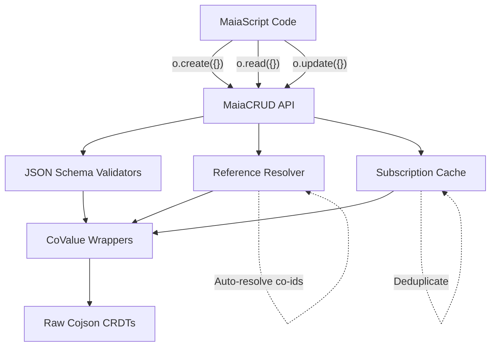

# MaiaCojson: JSON-based CRDT Data Layer

## Overview

**MaiaCojson** is a JSON Schema-native wrapper around Jazz's CRDT (Conflict-free Replicated Data Types) protocol, providing a purely JSON-based API for collaborative data management in MaiaOS.

**Key Features**:
- **JSON-based CRUD**: `o.create({})`, `o.read({})`, `o.update({})`, `o.delete({})`
- **100% Reactive**: Auto-subscribed data updates automatically
- **Auto-Resolution**: Nested references resolve automatically
- **Real CRDTs**: Built on `cojson` package (Jazz's CRDT core)
- **Zero Mocks**: All 127 tests run against real collaborative data structures

## Why MaiaCojson?

### Problem with jazz-tools
- Requires Zod schemas (TypeScript-first)
- Complex API with manual subscription management
- Not designed for JSON-native environments

### MaiaCojson Solution
- **JSON Schema** instead of Zod
- **Simple API**: Just JSON operations
- **Auto-managed**: Subscriptions, caching, reference resolution all handled internally

## Schema Name Resolution (MaiaDB)

**MaiaCojson** has been renamed to **MaiaDB** with schema auto-resolution!

### How It Works

You can now use schema **names** instead of managing co-ids:

```javascript
// Register schema by name
await db.registerSchema("Post", {
  type: "co-map",
  properties: {
    title: { type: "string" },
    author: { type: "co-id" }
  }
});

// Create using the NAME - auto-resolved internally!
const { entity, entityId } = await db.create({
  schema: "Post", // Just the name!
  data: { title: "Hello", author: accountID }
});
```

### Internal Mechanism

Each schema CoMap stores its own name as a property:

```javascript
// Schema CoMap structure:
{
  "$schema": "co_zMetaSchemaId",  // Reference to MetaSchema
  "name": "Post",                 // Human-readable name HERE!
  "definition": {                 // Clean JSON definition
    "type": "co-map",
    "properties": {...}
  }
}
```

**Resolution steps:**
1. Call `db.create({ schema: "Post", ... })`
2. `_resolveSchema("Post")` checks cache
3. If not cached, loads all schemas from `Schema.Registry` (CoList of co-ids)
4. Finds schema where `schemaMap.get("name") === "Post"`
5. Returns `schemaMap.get("definition")`
6. Caches mapping for performance

**No separate name→id registry needed!** The name is stored in each schema CoMap.

## Architecture



### Layers Explained

1. **User Layer (MaiaScript)**
   - Pure JSON operations
   - No knowledge of CRDTs
   - Simple, declarative API

2. **CRUD API Layer**
   - `MaiaCRUD` class
   - Handles create/read/update/delete
   - Manages LocalNode, Account, Group internally

3. **Core Systems**
   - **Reference Resolver**: Auto-resolves co-id strings to CoValue wrappers
   - **Subscription Cache**: Deduplicates subscriptions, 5-second cleanup timeout
   - **JSON Schema Validators**: Validates data before CRDT operations

4. **Wrapper Layer**
   - Thin Proxy-based wrappers around Raw CRDTs
   - CoMap, CoList, CoStream, CoBinary, Account, Group, CoPlainText
   - Property access via Proxies

5. **Raw CRDT Layer** (from `cojson` package)
   - RawCoMap, RawCoList, RawCoStream, etc.
   - Actual collaborative data structures
   - Sync, encryption, permissions built-in

## CoValue Types

MaiaCojson provides 7 core CRDT types:

| Type | JSON Schema | Description | Example |
|------|-------------|-------------|---------|
| **CoMap** | `co-map` | Key-value collaborative map | User profiles, settings |
| **CoList** | `co-list` | Ordered collaborative list | Todo items, messages |
| **CoStream** | `co-stream` | Append-only stream | Activity logs, events |
| **CoBinary** | `co-binary` | Binary data stream | Files, images |
| **Account** | `co-account` | User identity | Current user |
| **Group** | `co-group` | Permission group | Teams, access control |
| **CoPlainText** | `co-plaintext` | Collaborative text | Documents, notes |

### Co-ID References

References between CoValues use co-ids (string format: `co_z<base58>`):

```json
{
  "type": "co-map",
  "properties": {
    "author": { "type": "co-id" }
  }
}
```

MaiaCojson auto-resolves these to actual CoValue wrappers when accessed.

## API Reference

### Initialize MaiaCRUD

```javascript
import { MaiaCRUD } from '@maiaos/maia-cojson';
import { LocalNode } from 'cojson';
import { WasmCrypto } from 'cojson/crypto/WasmCrypto';

// Initialize cojson runtime
const crypto = await WasmCrypto.create();
const { node, accountID } = await LocalNode.withNewlyCreatedAccount({
  creationProps: { name: "Demo User" },
  peers: [], // Add sync peers here
  crypto,
});
const group = node.createGroup();

// Create CRUD API instance
const o = new MaiaCRUD({ node, accountID, group });
```

### o.create({}) - Create CoValues

**Creates a new collaborative data structure**

```javascript
const post = await o.create({
  type: "co-map",
  schema: {
    type: "co-map",
    properties: {
      title: { type: "string" },
      content: { type: "string" },
      author: { type: "co-id" },
      likes: { type: "number" },
    },
    required: ["title", "content"],
  },
  data: {
    title: "Hello World",
    content: "This is a collaborative post",
    author: accountID, // Stores as co-id
    likes: 0,
  },
});

console.log(post.$id); // Real CRDT ID: co_z...
console.log(post.title); // "Hello World"
```

**Supported Types**:
- `co-map` - Creates RawCoMap
- `co-list` - Creates RawCoList
- `co-stream` - Creates RawCoStream
- `co-binary` - Creates RawBinaryCoStream

**Features**:
- Validates data against JSON Schema before creating
- Automatically extracts co-ids from object references
- Returns wrapped CoValue with property access

### o.read({}) - Read CoValues (Reactive)

**Loads a CoValue and auto-subscribes to updates**

```javascript
const post = await o.read({
  id: "co_z123abc...",
  schema: {
    type: "co-map",
    properties: {
      title: { type: "string" },
      likes: { type: "number" },
    },
  },
});

console.log(post.title); // Current value

// post.likes updates automatically when changed!
// 100% reactive - no manual subscriptions needed
```

**Features**:
- Auto-subscribes via SubscriptionCache
- Deduplicates subscriptions to same co-id
- Returns loading state if unavailable: `{ $isLoaded: false, $id: "co_z..." }`
- Updates automatically via real cojson subscriptions

**Timeout Option**:
```javascript
const post = await o.read({
  id: "co_z123...",
  schema: POST_SCHEMA,
  timeout: 10000, // 10 seconds
});
```

### o.update({}) - Update CoValues

**Modifies an existing CoValue**

```javascript
await o.update({
  id: post.$id,
  data: {
    likes: 42,
    title: "Updated Title",
  },
});

// post.likes is now 42 (reactive update!)
```

**Features**:
- Updates only specified properties
- Validates against schema if provided
- Works with CoMap (sets keys) and CoList (appends items)

**With Validation**:
```javascript
await o.update({
  id: post.$id,
  data: { likes: 42 },
  schema: {
    type: "co-map",
    properties: {
      likes: { type: "number" },
    },
  },
});
```

### o.delete({}) - Delete CoValues

**Deletes a CoValue**

```javascript
await o.delete({
  id: post.$id,
});

// post.title is now undefined
// All keys removed from CoMap
```

**Behavior**:
- **CoMap**: Deletes all keys
- **CoList**: Deletes all items
- Underlying CRDT still exists (for sync), but content is cleared

## JSON Schema Extensions

MaiaCojson extends JSON Schema with CRDT-specific types:

### Co-Types

```json
{
  "type": "co-map",
  "properties": {
    "title": { "type": "string" },
    "items": { "type": "co-list" },
    "author": { "type": "co-id" },
    "data": { "type": "co-binary" }
  }
}
```

### Schema Preprocessing

MaiaCojson automatically converts `co-*` types to Ajv-compatible formats:

**Input**:
```json
{
  "type": "co-map",
  "properties": {
    "author": { "type": "co-id" }
  }
}
```

**Preprocessed for Ajv**:
```json
{
  "type": "object",
  "x-co-type": "co-map",
  "properties": {
    "author": {
      "type": "string",
      "pattern": "^co_z[a-zA-Z0-9]+$",
      "x-co-type": "co-id"
    }
  }
}
```

The original type is preserved in `x-co-type` for internal use.

## Complete Example: Blog System

```javascript
import { MaiaCRUD } from '@maiaos/maia-cojson';
import { LocalNode } from 'cojson';
import { WasmCrypto } from 'cojson/crypto/WasmCrypto';

// Initialize
const crypto = await WasmCrypto.create();
const { node, accountID } = await LocalNode.withNewlyCreatedAccount({
  creationProps: { name: "Blogger" },
  peers: [],
  crypto,
});
const group = node.createGroup();
const o = new MaiaCRUD({ node, accountID, group });

// Define schemas
const POST_SCHEMA = {
  type: "co-map",
  properties: {
    title: { type: "string" },
    content: { type: "string" },
    author: { type: "co-id" },
    likes: { type: "number" },
  },
  required: ["title", "content", "author"],
};

const BLOG_SCHEMA = {
  type: "co-map",
  properties: {
    title: { type: "string" },
    posts: {
      type: "co-list",
      items: { type: "co-id" }, // References to posts
    },
  },
  required: ["title"],
};

// 1. CREATE blog
const blog = await o.create({
  type: "co-map",
  schema: BLOG_SCHEMA,
  data: {
    title: "My Tech Blog",
  },
});

console.log("Blog created:", blog.$id); // co_z...

// 2. CREATE posts list
const posts = await o.create({
  type: "co-list",
  schema: {
    type: "co-list",
    items: POST_SCHEMA,
  },
  data: [],
});

// 3. CREATE post
const post = await o.create({
  type: "co-map",
  schema: POST_SCHEMA,
  data: {
    title: "Getting Started",
    content: "Welcome to MaiaCojson!",
    author: accountID,
    likes: 0,
  },
});

// 4. ADD post to list
await o.update({
  id: posts.$id,
  data: [post], // Appends post reference
});

// 5. READ post (reactive!)
const loadedPost = await o.read({
  id: post.$id,
  schema: POST_SCHEMA,
});

console.log(loadedPost.title); // "Getting Started"

// 6. UPDATE post
await o.update({
  id: post.$id,
  data: { likes: 42 },
});

// loadedPost.likes is now 42 (automatic reactive update!)

// 7. DELETE post
await o.delete({ id: post.$id });

// loadedPost.title is now undefined
```

## Reactivity System

### How Reactivity Works

**1. Subscription Cache (Deduplication)**

When you call `o.read()`, MaiaCojson:
1. Checks if a subscription already exists for that co-id
2. Reuses existing subscription (no duplicate `node.subscribe()` calls)
3. Adds your read callback to the subscriber set
4. When CRDT updates, triggers all callbacks

**Structure**:
```javascript
Map<coId, {
  callbacks: Set<Function>,
  subscriberCount: number,
  unsubscribe: Function,
  cleanupTimeoutId: number | null,
}>
```

**2. Cleanup Timeout (5 seconds)**

When subscriber count reaches 0:
1. Schedules cleanup after 5 seconds
2. If new subscriber added, cancels cleanup
3. Prevents subscription churn (rapid subscribe/unsubscribe)

**3. Automatic Updates**

When real CRDT changes:
```
RawCoMap.set() → node.subscribe() callback → All subscribers notified → UI updates
```

No manual subscription management needed!

## Reference Resolution

### The Problem

CRDTs store references as co-id strings:

```javascript
{
  "author": "co_z123abc..." // String, not object
}
```

### MaiaCojson Solution

**Auto-Resolution**: When you access a co-id, MaiaCojson automatically:
1. Checks cache (coValuesCache)
2. If not loaded, calls `node.load(coId)`
3. Returns loading state immediately (non-blocking)
4. Updates automatically when loaded

**Example**:
```javascript
const post = await o.read({ id: "co_z123...", schema: POST_SCHEMA });

// post.author is a co-id string internally
// But you can resolve it:
import { resolveReference } from '@maiaos/maia-cojson';

const author = await resolveReference(
  post.author,
  AUTHOR_SCHEMA,
  o.node
);

console.log(author.name); // Resolved!
```

### Circular Reference Detection

MaiaCojson uses a `WeakSet` to track resolution paths:

```javascript
// map1.ref → map2
// map2.ref → map1 (circular!)

const map1 = await resolveReference(map1Id, schema, node);

// Returns loading state for circular refs (no infinite loop)
```

## Caching System

### Instance Cache (coValuesCache)

**Purpose**: Ensure same `RawCoValue` always returns same wrapper instance (object identity)

**Implementation**:
```javascript
// WeakMap<RawCoValue, CoValue>
const coValuesCache = {
  get(raw, compute) {
    const cached = weakMap.get(raw);
    if (cached) return cached;
    
    const computed = compute();
    weakMap.set(raw, computed);
    return computed;
  },
};
```

**Benefits**:
- Automatic garbage collection (WeakMap)
- Object identity: `CoMap.fromRaw(raw) === CoMap.fromRaw(raw)`
- No memory leaks

### Subscription Cache

**Purpose**: Deduplicate subscriptions to same CoValue

**Implementation**:
```javascript
Map<coId, {
  callbacks: Set<Function>,
  subscriberCount: number,
  unsubscribe: Function,     // Real cojson unsubscribe
  cleanupTimeoutId: number,   // 5-second timeout
}>
```

**Lifecycle**:
1. First `o.read()` → Creates subscription
2. Second `o.read()` → Reuses subscription (adds callback)
3. All callbacks unsubscribed → Schedules cleanup (5s)
4. New `o.read()` before timeout → Cancels cleanup
5. Timeout expires → Destroys subscription

**Benefits**:
- No duplicate `node.subscribe()` calls
- Efficient update propagation
- Prevents subscription churn
- Automatic cleanup (no memory leaks)

## Validation System

### SchemaValidator

**Purpose**: Validate data against JSON Schema before CRDT operations

```javascript
import { SchemaValidator } from '@maiaos/maia-cojson';

const validator = new SchemaValidator({
  type: "co-map",
  properties: {
    title: { type: "string" },
    likes: { type: "number" },
  },
  required: ["title"],
});

try {
  validator.validate({
    title: "Hello",
    likes: 42,
  });
  console.log("✅ Valid!");
} catch (error) {
  console.error("❌", error.message);
  console.error("Errors:", error.ajvErrors);
}
```

### Preprocessing

**Schema Preprocessor** converts co-* types to Ajv-compatible formats:

```javascript
import { preprocessSchema } from '@maiaos/maia-cojson';

const original = {
  type: "co-map",
  properties: {
    author: { type: "co-id" }
  }
};

const processed = preprocessSchema(original);

// processed.type === "object"
// processed["x-co-type"] === "co-map"
// processed.properties.author.pattern === "^co_z[a-zA-Z0-9]+$"
```

### ValidationError

Custom error class with formatted Ajv errors:

```javascript
try {
  validator.validate(invalidData);
} catch (error) {
  console.log(error.message);
  // "Validation failed:
  //  (root): must have required property 'title'"
  
  console.log(error.ajvErrors);
  // [{
  //   instancePath: "",
  //   schemaPath: "#/required",
  //   keyword: "required",
  //   params: { missingProperty: "title" },
  //   message: "must have required property 'title'"
  // }]
  
  console.log(error.originalSchema);
  // Original JSON Schema
}
```

## Internal Components

### Wrappers (Proxy-based)

All wrappers use JavaScript Proxies for property access:

**CoMap Example**:
```javascript
class CoMap {
  constructor(rawCoMap, schema) {
    this._raw = rawCoMap;
    this.$schema = schema;
    
    return new Proxy(this, {
      get(target, prop) {
        // System properties
        if (prop === '$id') return target._raw.id;
        if (prop === '$schema') return target.$schema;
        
        // Get from RawCoMap
        const value = target._raw.get(prop);
        
        // Check if co-id reference
        if (typeof value === 'string' && value.startsWith('co_')) {
          return value; // Return co-id (resolve separately)
        }
        
        return value;
      },
      
      set(target, prop, value) {
        // Extract $id if object
        if (value && typeof value === 'object' && value.$id) {
          target._raw.set(prop, value.$id);
        } else {
          target._raw.set(prop, value);
        }
        return true;
      }
    });
  }
  
  static fromRaw(raw, schema) {
    return coValuesCache.get(raw, () => new CoMap(raw, schema));
  }
}
```

### Reference Resolver

**Purpose**: Auto-resolve co-id strings to CoValue wrappers

**API**:
```javascript
import { resolveReference, isCoId } from '@maiaos/maia-cojson';

// Check if value is a co-id
if (isCoId(value)) {
  // Resolve to wrapper
  const resolved = await resolveReference(value, schema, node);
  
  if (resolved.$isLoaded) {
    console.log(resolved.name); // Resolved CoMap
  } else {
    console.log("Loading..."); // Not yet available
  }
}
```

**Features**:
- Uses `node.load()` for async loading
- Returns loading state immediately (non-blocking)
- Detects circular references
- Integrates with coValuesCache

### Subscription Cache

**Purpose**: Deduplicate and manage cojson subscriptions

**API**:
```javascript
import { SubscriptionCache } from '@maiaos/maia-cojson';

const cache = new SubscriptionCache(5000); // 5-second cleanup

// Add subscriber
cache.addSubscriber(coId, (value) => {
  console.log("Updated:", value);
}, node);

// Remove subscriber
cache.removeSubscriber(coId, callback);

// Get subscriber count
cache.getSubscriberCount(coId); // number

// Clear all
cache.clear();
```

**Lifecycle**:
1. `addSubscriber()` → Creates `node.subscribe()` if first subscriber
2. `addSubscriber()` (again) → Reuses existing subscription
3. `removeSubscriber()` → Decrements count, schedules cleanup if 0
4. Wait 5 seconds → Cleanup destroys subscription
5. `addSubscriber()` before timeout → Cancels cleanup

## Loading States

**Three States**:
```javascript
import { CoValueLoadingState } from '@maiaos/maia-cojson';

CoValueLoadingState.LOADING      // "loading"
CoValueLoadingState.LOADED       // "loaded"
CoValueLoadingState.UNAVAILABLE  // "unavailable"
```

**Loading State Object**:
```javascript
{
  $isLoaded: false,
  $id: "co_z123...",
  $loadingState: "unavailable" | "error" | "circular",
  $error: "Error message" // if error
}
```

## Testing Strategy

### Zero Mocks Policy

**All 127 tests use real CRDTs** - NO mocks, stubs, or fakes!

**Required in Every Test**:
```javascript
import { LocalNode } from "cojson";
import { WasmCrypto } from "cojson/crypto/WasmCrypto";

const crypto = await WasmCrypto.create();
const { node, accountID } = await LocalNode.withNewlyCreatedAccount({
  creationProps: { name: "Test User" },
  peers: [],
  crypto,
});
const group = node.createGroup();
```

**Why No Mocks**:
1. **Real behavior**: Mocks can't simulate CRDT merge logic
2. **Subscription edge cases**: Real subscriptions have race conditions
3. **Co-id format**: Real co-ids have specific format requirements
4. **Production confidence**: Works in tests = works in production

### Test Suite

```
Phase 1 (Original).................. 100 tests
├── Cache + Loading States........... 13 tests
├── Core Wrappers.................... 41 tests
└── JSON Schema Validation........... 46 tests

Milestones 4-5 (New)................ 27 tests
├── Reference Resolver............... 7 tests
├── Subscription Cache............... 9 tests
└── MaiaCRUD API..................... 11 tests

Total: 127 tests passing (all with real CRDTs)
```

## Integration with MaiaScript

### Basic Integration

```javascript
// In MaiaScript engine
import { MaiaCRUD } from '@maiaos/maia-cojson';

// Initialize once
const o = new MaiaCRUD({ node, accountID, group });

// Use in intent handlers
async function createTodo(title, description) {
  return await o.create({
    type: "co-map",
    schema: TODO_SCHEMA,
    data: { title, description, done: false },
  });
}

async function loadTodos(todoListId) {
  const list = await o.read({
    id: todoListId,
    schema: TODO_LIST_SCHEMA,
  });
  
  // list is reactive - updates automatically!
  return list;
}
```

### With Schema Registry

```javascript
// schemas/todo.schema.json
{
  "type": "co-map",
  "properties": {
    "title": { "type": "string" },
    "done": { "type": "boolean" }
  }
}

// In MaiaScript
const schema = await loadSchema("todo");

const todo = await o.create({
  type: "co-map",
  schema,
  data: { title: "Buy milk", done: false },
});
```

## Performance Considerations

### Caching

**Two-level cache**:
1. **Instance Cache (WeakMap)**: Same raw → same wrapper
2. **Subscription Cache (Map)**: Same co-id → shared subscription

**Benefits**:
- O(1) lookups
- No duplicate subscriptions
- Automatic GC

### Lazy Loading

**References loaded on-demand**:
- Co-id strings stored directly (lightweight)
- Resolved only when accessed
- Loading state returned immediately (non-blocking)

### Cleanup

**5-second timeout** prevents:
- Subscription churn (rapid sub/unsub)
- Memory leaks (old subscriptions)
- Unnecessary `node.subscribe()` calls

## Advanced Topics

### Custom Schemas

**Extend base schemas**:
```javascript
const BASE_POST = {
  type: "co-map",
  properties: {
    title: { type: "string" },
    content: { type: "string" },
  },
};

const BLOG_POST = {
  ...BASE_POST,
  properties: {
    ...BASE_POST.properties,
    author: { type: "co-id" },
    likes: { type: "number" },
  },
  required: ["title", "content", "author"],
};
```

### Nested Structures

**CoList of CoMaps**:
```javascript
const posts = await o.create({
  type: "co-list",
  schema: {
    type: "co-list",
    items: {
      type: "co-map",
      properties: {
        title: { type: "string" },
      },
    },
  },
  data: [],
});

// Add post
const post = await o.create({
  type: "co-map",
  schema: { type: "co-map", properties: { title: { type: "string" } } },
  data: { title: "Post 1" },
});

await o.update({
  id: posts.$id,
  data: [post], // Stores co-id reference
});
```

### Direct Wrapper Access

**Low-level API still available**:
```javascript
import { CoMap } from '@maiaos/maia-cojson';

// Direct access to raw CRDT
const coMap = CoMap.fromRaw(rawCoMap, schema);

coMap.title = "Hello";
console.log(coMap._raw.get("title")); // Direct raw access
```

## Troubleshooting

### Common Issues

**1. "Validation failed: must have required property"**
- Check schema `required` array
- Ensure all required fields provided in `data`

**2. "CoValue unavailable"**
- Co-id doesn't exist or not synced yet
- Check `timeout` option in `o.read()`
- Verify network/peer connectivity

**3. "Loading state returned instead of value"**
- CoValue not yet loaded
- Use loading state: `if (!value.$isLoaded) { /* show loading */ }`

**4. Tests fail with "asArray is not a function"**
- Using mock instead of real RawCoList
- Fix: Use `group.createList()` from real cojson

## Best Practices

### 1. Always Define Schemas

```javascript
// ✅ Good
const TODO_SCHEMA = {
  type: "co-map",
  properties: {
    title: { type: "string" },
    done: { type: "boolean" },
  },
  required: ["title"],
};

const todo = await o.create({
  type: "co-map",
  schema: TODO_SCHEMA,
  data: { title: "Task", done: false },
});

// ❌ Bad
const todo = await o.create({
  type: "co-map",
  schema: {}, // Empty schema = no validation!
  data: { anything: "goes" },
});
```

### 2. Use References for Relationships

```javascript
// ✅ Good (reference)
const post = await o.create({
  type: "co-map",
  schema: POST_SCHEMA,
  data: {
    title: "Hello",
    author: authorCoMap, // Stores as co-id
  },
});

// ❌ Bad (nested object)
const post = await o.create({
  type: "co-map",
  schema: POST_SCHEMA,
  data: {
    title: "Hello",
    author: {
      name: "Alice", // Stores as plain JSON (not collaborative!)
    },
  },
});
```

### 3. Handle Loading States

```javascript
const post = await o.read({ id, schema });

if (!post.$isLoaded) {
  // Show loading UI
  return <div>Loading...</div>;
}

// Use post data
return <div>{post.title}</div>;
```

### 4. Clean Up Subscriptions

```javascript
// When component unmounts
o.destroy(); // Clears all subscriptions
```

## Comparison: jazz-tools vs MaiaCojson

| Feature | jazz-tools | MaiaCojson |
|---------|-----------|-----------|
| **Schema Format** | Zod (TypeScript) | JSON Schema |
| **API Style** | Class-based, complex | JSON-based, simple |
| **Subscriptions** | Manual | Automatic |
| **Reference Resolution** | Deep query DSL (`$each`, `$onError`) | Auto-resolve (simple) |
| **Validation** | Runtime Zod checks | JSON Schema (Ajv) |
| **Integration** | TypeScript-first | JSON-native |
| **Complexity** | High | Low |
| **Testing** | Some mocks | Zero mocks (all real CRDTs) |

## Package Information

- **Name**: `@maiaos/maia-cojson`
- **Version**: `0.1.23`
- **Dependencies**: `cojson@^0.19.21`, `ajv@^8.12.0`
- **Test Command**: `bun test`
- **Dev Server**: `bun dev` (http://localhost:5173)

## Example App

See [`libs/maia-cojson/src/app/main.js`](../../maia-cojson/src/app/main.js) for a complete working example demonstrating:
- MaiaCRUD initialization
- JSON-based operations
- Real CRDT IDs generation
- Schema validation

Run: `cd libs/maia-cojson && bun dev`

## Future Enhancements (Phase 2)

**Higher-Order Types** (built on core 7):
- **CoFeed**: Twitter-like activity streams
- **CoVector**: GitHub-like threaded comments  
- **ImageDefinition**: Profile pictures with metadata

**Deep Query DSL** (from jazz-tools):
- `$each` for nested resolution
- `$onError: "catch"` for error boundaries
- Depth control for performance

**Framework Integrations**:
- Svelte stores
- React hooks
- Native reactive bindings

## Contributing

When contributing to MaiaCojson:

**Zero Mocks Policy**:
- ✅ All tests MUST use real cojson types
- ✅ Real LocalNode initialization
- ✅ Real co-id generation (`co_z...`)
- ❌ NO Mock classes
- ❌ NO stubs or fakes

**Test Requirements**:
```javascript
// Required imports
import { LocalNode } from "cojson";
import { WasmCrypto } from "cojson/crypto/WasmCrypto";

// Setup
beforeAll(async () => {
  const crypto = await WasmCrypto.create();
  const { node, accountID } = await LocalNode.withNewlyCreatedAccount({
    creationProps: { name: "Test User" },
    peers: [],
    crypto,
  });
  const group = node.createGroup();
  // Use real CRDTs in tests!
});
```

## Resources

- **Source Code**: `libs/maia-cojson/`
- **Tests**: `libs/maia-cojson/src/**/**.test.js`
- **Example App**: `libs/maia-cojson/src/app/`
- **Cojson Docs**: [Jazz Documentation](https://jazz.tools)

## License

Part of MaiaOS project
